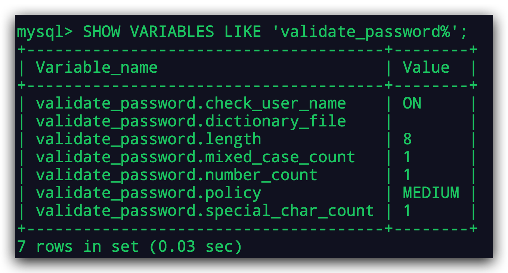

[TOC]

## 1、前言

记一次Centos6 安装mysql8全过程；

## 2、卸载

### 2.1 查看机器上是否已经安装的有mysql服务

~~~
rpm -qa|grep mysql
~~~

~~~shell
[root@10 /]# rpm -qa|grep mysql
mysql-community-client-8.0.21-1.el6.x86_64
mysql80-community-release-el6-1.noarch
mysql-community-server-8.0.21-1.el6.x86_64
mysql-community-common-8.0.21-1.el6.x86_64
mysql-community-libs-8.0.21-1.el6.x86_64
~~~

如果结果如上，需要一个个卸载；

### 2.2 卸载

~~~shell
rpm -e --nodeps mysql-community-client-8.0.21-1.el6.x86_64
rpm -e --nodeps mysql80-community-release-el6-1.noarch
rpm -e --nodeps mysql-community-server-8.0.21-1.el6.x86_64
rpm -e --nodeps mysql-community-common-8.0.21-1.el6.x86_64
rpm -e --nodeps mysql-community-libs-8.0.21-1.el6.x86_64
~~~

## 3、安装

### 3.1 下载

~~~shell
cd /opt	
wget https://dev.mysql.com/get/mysql80-community-release-el6-1.noarch.rpm
~~~

### 3.2 安装

~~~shell
rpm -ivh mysql80-community-release-el6-1.noarch.rpm
~~~

~~~shell
yum install mysql-server
~~~

执行这两行命令，如果网络快的话，很快就安装完成了。

### 3.3 检查安装是否成功

~~~shell
mysqladmin -V
~~~

到此就安装成功了。

## 4、配置mysql

### 4.1 启动mysql

~~~shell
# 启动
service mysqld start
# 检查状态
service mysqld status
# 关闭
service mysqld stop
# 重启
service mysqld restart
~~~

使用该命令启动mysql。

### 4.2 登录mysql

> 默认有个随机密码：

~~~shell
cat /var/log/mysqld.log
~~~

> 使用该密码登录

~~~shell
mysql -u root -p
~~~

### 4.3 改密码

第一次操作数据库的同学，一定要记得每个SQL执行语句后面都需要以分号结尾。

> 随机密码不容易记，所以需要改一个方便记忆的密码；

~~~mysql
mysql> use mysql;
~~~

> 查看当前用户

~~~mysql
mysql> select user,host from user;
+------------------+-----------+
| user             | host      |
+------------------+-----------+
| root             | localhost |
| mysql.infoschema | localhost |
| mysql.session    | localhost |
| mysql.sys        | localhost |
+------------------+-----------+
4 rows in set (0.01 sec)
~~~

> 查看端口

~~~mysql
mysql> show global variables like 'port';
+---------------+-------+
| Variable_name | Value |
+---------------+-------+
| port          | 3306  |
+---------------+-------+
1 row in set (0.05 sec)
~~~

> 查看密码强度

~~~mysql
mysql> SHOW VARIABLES LIKE 'validate_password%';
+--------------------------------------+--------+
| Variable_name                        | Value  |
+--------------------------------------+--------+
| validate_password.check_user_name    | ON     |
| validate_password.dictionary_file    |        |
| validate_password.length             | 8      |
| validate_password.mixed_case_count   | 1      |
| validate_password.number_count       | 1      |
| validate_password.policy             | MEDIUM |
| validate_password.special_char_count | 1      |
+--------------------------------------+--------+
~~~

~~~mysql
关于 mysql 密码策略相关参数；
1）、validate_password_length  固定密码的总长度；
2）、validate_password_dictionary_file 指定密码验证的文件路径；
3）、validate_password_mixed_case_count  整个密码中至少要包含大/小写字母的总个数；
4）、validate_password_number_count  整个密码中至少要包含阿拉伯数字的个数；
5）、validate_password_policy 指定密码的强度验证等级，默认为 MEDIUM；
关于 validate_password_policy 的取值：
0/LOW：只验证长度；
1/MEDIUM：验证长度、数字、大小写、特殊字符；
2/STRONG：验证长度、数字、大小写、特殊字符、字典文件；
6）、validate_password_special_char_count 整个密码中至少要包含特殊字符的个数
~~~

默认是MEDIUM密码强度等级，算是一般严格的；如图有严格的要求；

如果你想设置一个简单的密码，把validate_password_policy等级改为low即可。

~~~mysql
set global validate_password_policy=LOW;
~~~

> 改密码

~~~mysql
alter user 'root'@'localhost' IDENTIFIED BY 'Alex@666';
~~~

> 重启服务

~~~shell
service mysqld restart
# 或者
service mysqld stop
service mysqld start
~~~

### 4.4 忘记登录密码如何重置密码

~~~shell
cat /etc/my.cnf
~~~

~~~shell
[root@10 /]# cat /etc/my.cnf
# For advice on how to change settings please see
# http://dev.mysql.com/doc/refman/8.0/en/server-configuration-defaults.html

[mysqld]
port=3306
#
# Remove leading # and set to the amount of RAM for the most important data
# cache in MySQL. Start at 70% of total RAM for dedicated server, else 10%.
# innodb_buffer_pool_size = 128M
#
# Remove the leading "# " to disable binary logging
# Binary logging captures changes between backups and is enabled by
# default. It's default setting is log_bin=binlog
# disable_log_bin
#
# Remove leading # to set options mainly useful for reporting servers.
# The server defaults are faster for transactions and fast SELECTs.
# Adjust sizes as needed, experiment to find the optimal values.
# join_buffer_size = 128M
# sort_buffer_size = 2M
# read_rnd_buffer_size = 2M
#
# Remove leading # to revert to previous value for default_authentication_plugin,
# this will increase compatibility with older clients. For background, see:
# https://dev.mysql.com/doc/refman/8.0/en/server-system-variables.html#sysvar_default_authentication_plugin
default-authentication-plugin=mysql_native_password

datadir=/var/lib/mysql
socket=/var/lib/mysql/mysql.sock

log-error=/var/log/mysqld.log
pid-file=/var/run/mysqld/mysqld.pid

~~~

> 操作步骤

~~~mysql
1.在 [mysqld]最后加上如下语句 并保持退出文件；
skip-grant-tables
2.重启 mysql
service mysqld restart
3.输入以下命令，点击enter键可以跳过密码直接进入mysql
mysql -u root -p
4.查看root用户的相关信息
select host, user, authentication_string, plugin from user;
可以看到root用户中authentication_string就是你之前的密码的散列值。
5.当前root用户authentication_string字段下有内容，先将其设置为空
use mysql;
update user set authentication_string='' where user='root';
6.使用ALTER修改root用户密码
ALTER user 'root'@'localhost' IDENTIFIED BY '你的新密码'
~~~

## 5、远程登录

### 5.1 修改host

~~~shell
mysql> select user,host from user;
+------------------+-----------+
| user             | host      |
+------------------+-----------+
| root             | localhost |
| mysql.infoschema | localhost |
| mysql.session    | localhost |
| mysql.sys        | localhost |
+------------------+-----------+
4 rows in set (0.01 sec)
~~~

由上面默认的用户的host可知，默认只允许本地连接，不允许远程连接；

那么如何远程连接呢？

需要把 host 的 localhost 改为 %；

~~~shell
mysql -u root -p
~~~

连接成功后：

~~~mysql
mysql> use mysql;
mysql> flush privileges;
# localhost 改 %
mysql> update user set host='%' where user='root';
mysql> flush privileges;
~~~

然后退出mysql重启;

### 5.2 修改防火墙

> 最粗暴的方式是直接关闭防火墙

~~~shell
service iptables stop
chkconfig iptables off

# 反之开启防火墙
service iptables start
chkconfig iptables on
~~~

> 推荐方式：手动添加防火墙3306

~~~shell
vim /etc/sysconfig/iptables

# 追加以下内容，放行3306端口
-A INPUT -p tcp -m state --state NEW -m tcp --dport 3306 -j ACCEPT

# 保存退出之后

#最后重启防火墙使配置生效
/etc/init.d/iptables restart      
~~~

之后就可以远程登录了，需要安装mysql8的同学赶紧去试试吧。