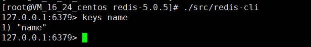
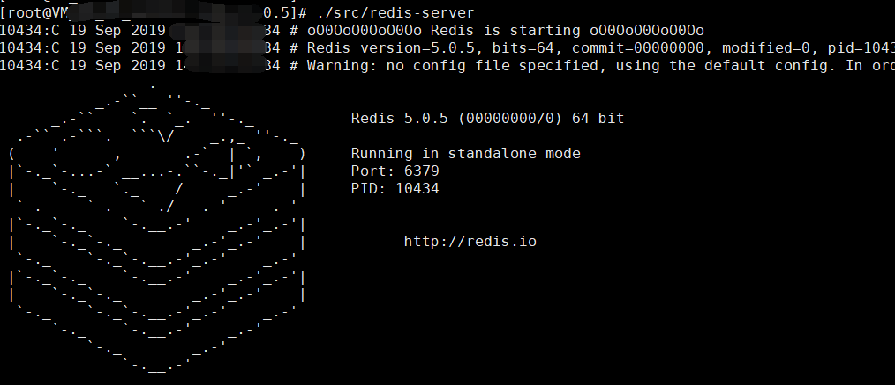
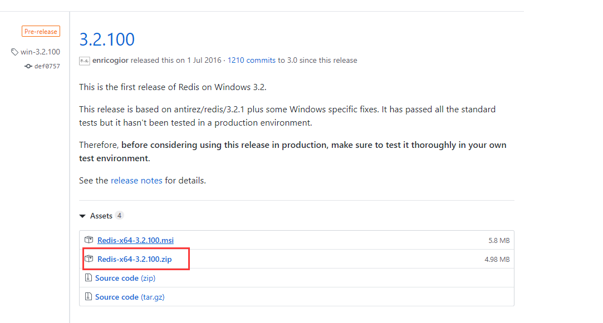
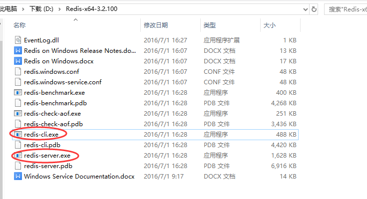
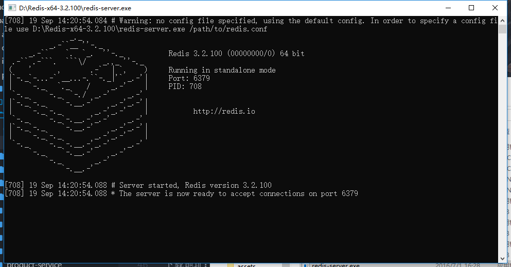
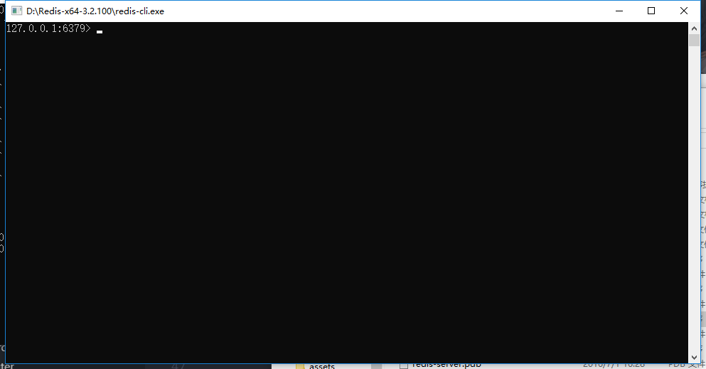

### redis两个平台安装，并保持后台运行
[TOC]

#### 1、CentOS 7 linux 安装

~~~shell

$ wget http://download.redis.io/releases/redis-5.0.5.tar.gz
$ tar xzf redis-5.0.5.tar.gz
$ cd redis-5.0.5
$ make

~~~

> 启动:
~~~shell
$ ./src/redis-sever
~~~

> 使用内置交互客户端：
~~~shell
$ src/redis-cli
redis> set foo bar
OK
redis> get foo
"bar"
~~~

> redis保持后台运行

~~~markdown

1.`cd` 到 `/etc/redis(你的安装目录)` 下，打开`redis.conf`，修改 `daemonize 为 yes`

2.运行命令 `redis-server redis.conf`

~~~

#### 2、window 安装

下载地址：https://github.com/MSOpenTech/redis/releases。

下载安装解压到文件：

直接运行即可；

