### 买房必问的几大问题：

[TOC]

#### 1、得房率

> 得房率是套内可供住户支配、使用的建筑面积（不包括墙体、管道井等部分面积）与销售面积（建筑面积）的比率

得房率是指可供住户支配的建筑面积与每户建筑面积之比。一般多层的建筑物得房率为`88%`，高层的建筑物得房率为`72%`，而办公楼为`55%`

**计算方法**

> `得房率`=`套内建筑面积`/`套型建筑面积`
>
> `套内建筑面积`=`套内使用面积`+`套内墙体面积`+`阳台面积`
>
> `销售面积`（也称套型建筑面积）=`套内建筑面积` +分摊的[公用建筑面积](https://baike.baidu.com/item/公用建筑面积)（俗说“[公摊面积](https://baike.baidu.com/item/公摊面积)”）

`得房率`是买房比较重要的一个指标。计算房屋面积时，计算的是建筑面积，所以得房率太低，不实惠；太高，不方便。因为得房率越高，公共部分的面积就越少，住户也会感到压抑。一般，得房率在==80%==左右比较合适，公共部分既宽敞气派，分摊的面积也不会太多，比较实惠

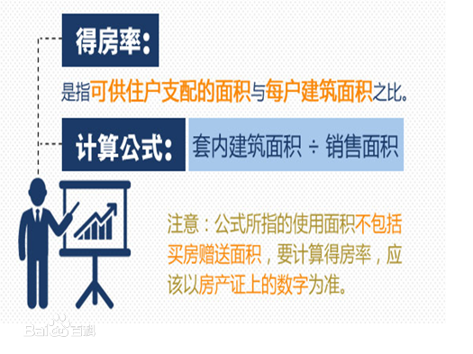

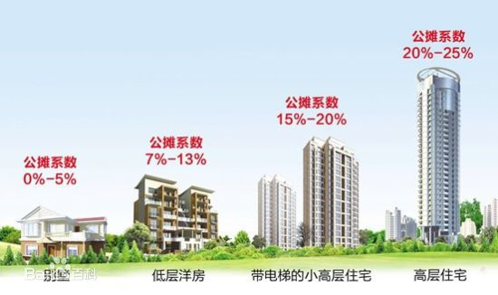

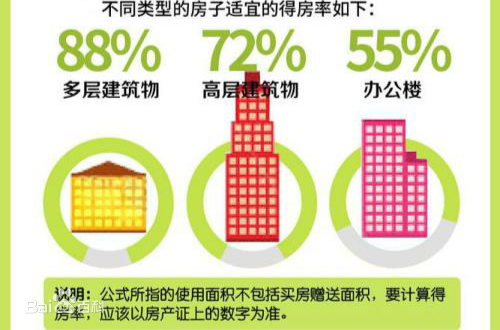

**影响因素**

`公摊面积`包括两部分，其一是[电梯井](https://baike.baidu.com/item/电梯井)、楼梯间、垃圾道、变电室以及其他功能上为整栋建筑服务的公用用房和管理用房建筑面积。其二是套（单元）与公用建筑空间之间的分隔墙以及[外墙](https://baike.baidu.com/item/外墙)（包括[山墙](https://baike.baidu.com/item/山墙)）墙体水平[投影面积](https://baike.baidu.com/item/投影面积)的一半。 具体说来主要体现在几个方面：

> ①房型结构（几梯几户）。例如一梯多户可能与一梯二户需要分摊的公用面积相差无几，可户数增加了，总套内建筑面积增加了，则每户需要分摊的公用面积就会减小。

> ②楼盘形态。一般来说高层得房率最低，小高层次之，多层则得房率较高。

> ③物业类型。一般来说板式得房率最高，叠式次之，[点式](https://baike.baidu.com/item/点式)则较低。

> ④公共活动区域大小。一般来说，高品质的物业多建有高挑大堂，宽敞电梯、室内车库，这些都会占用到大量公摊面积，故得房率相对较低。

> ⑤何种面积不算做公摊面积？
>
> 车库、会所等具备独立使用功能的空间；售楼单位自营、自用的房屋；为多栋房屋服务的警卫室、管理用房、设备房等

#### 2、绿化率

> 绿化率没有法律和法规依据。规范中用绿地率，是指绿化用地面积与总用地面积之比；而与之相近的绿化覆盖率是指绿化[垂直投影面积](https://baike.baidu.com/item/垂直投影面积)之和与总用地面积的比率，这是两个不同的概念

**概念**

> 项目规划[建设用地](https://baike.baidu.com/item/建设用地)范围内的绿化面积与规划建设[用地面积](https://baike.baidu.com/item/用地面积)之比。`绿化率只是开发商宣传楼盘绿化时用的概念，并没有法律和法规依据`。

> 法律法规中明确规定的衡量楼盘绿化状况的国家标准是[绿地率](https://baike.baidu.com/item/绿地率)， 绿地率是指小区用地范围内各类绿地的总和与小区用地的比率,主要包括公共绿地、[宅旁绿地](https://baike.baidu.com/item/宅旁绿地)、配套公建所属绿地和道路绿地等，其计算要比绿化率严格很多

**绿化率 ！= 绿地率**

> ==绿地率==和==绿化覆盖率==是两个不同概念的用语，绿地率与绿化覆盖率都是衡量居住区绿化状况的经济技术指标，但绿地率不等同于绿化覆盖率，二者的区别主要是对“居住区用地范围内各类绿地”这一概念的不同理解上。

> ==绿地率==是规划指标，描述的是居住区用地范围内各类绿地的总和与居住区用地的比率（%）。绿化覆盖率是绿化垂直投影面积之和与占地面积的百分比，比如一棵树的影子很大，但它的占地面积是很小的，两者的具体技术指标是不相同的。

> 在计算绿地率时，对绿地的要求非常严格，并不是所有长草的地方都能算做绿地率。绿地率所指的“居住区用地范围内各类绿地”主要包括公共绿地、宅旁绿地等。其中，公共绿地，又包括居住区公园、小游园、组团绿地及其他的一些块状、带状化公共绿地。而宅旁绿地等庭院绿化的用地面积，在设计计算时也要求距==建筑外墙1.5米和道路边线1米以内的用地，不得计入绿化用地==。此外，还有几种情况也不能计入绿地率的绿化面积，如地下车库、化粪池。==这些设施的地表覆土一般达不到3米的深度，在上面种植大型乔木，成活率较低，所以计算绿地率时不能计入“居住区用地范围内各类绿化”中==；而屋顶绿化等装饰性绿化地，按当前国家的技术规范，也算正式绿地。

> 在房地产开发过程中，政府相关部门在最初项目规划要求的就是绿地率这一指标。因此，买房除了对==地税、户型设计的挑选==外，还要关注“三率”，即==容积率、绿化率、房屋使用率==。对于发展商来说，容积率决定地价成本在房屋中占的比例；而对于住户来说，容积率直接涉及到居住的舒适度。绿化率也是如此，绿化率较高，建筑密度较低，发展商可用于回收资金的面积就越少，而住户就越舒服。这两个比例决定了这个项目是从人的居住需求角度，还是从纯粹赚钱的角度来设计一个。

> ==绿化覆盖率是指绿化垂直投影面积之和小区用地的比率。像地下车库这样大面积的底下设施，它的地表虽然种不了树，但可以种草==；像距建筑外墙 1.5 米这样的范围，虽然不算正式绿地，但若能种一些草，总比地砖铺砌更吸引人……在小区规划设计中，计算绿化覆盖率所指的绿地，简单地说，就是有块草皮便可以计入，如树的影子、露天停车场可以中间种草的方砖都可算入绿化覆盖率，所以绿化覆盖率有时能做到60%以上。==在开发商销售楼盘的时候，开发商当然喜欢引用绿化覆盖率的概念，甚至是在售楼书上印制出“绿化率”一词，其实这是不准确、不规范的用词，国家有关园林绿化用语根本就没有这个用语，准确的只有“绿地率”和“绿化覆盖率”两种说法。购房人要注意房地产商在销售楼盘时宣传的绿化率实际不少是绿化覆盖率==

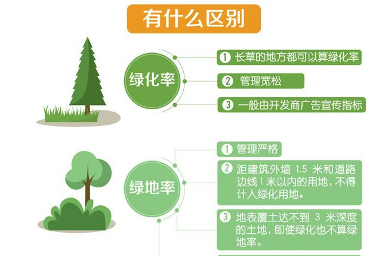

#### 3、容积率


> 容积率（Plot Ratio/Floor Area Ratio/Volume Fraction）是指一个小区的地上总建筑面积与净用地面积的比率。又称建筑面积毛密度。对于开发商来说，容积率决定地价成本在房屋中占的比例，而对于住户来说，容积率直接涉及到居住的舒适度。
>
> 一个良好的居住小区，==高层住宅容积率应不超过5，多层住宅应不超过3，绿地率应不低于30%==。但由于受土地成本的限制，并不是所有项目都能做得到;

> 容积率是衡量建设用地使用强度的一项重要指标。容积率的值是无量纲的比值，通常==以地块面积为1，地块内地上建筑物的总建筑面积对地块面积的倍数，即为容积率的值==

举例：

> 在面积为100平方米的地块上建房，每层建筑面积100平方米，建2层，总建筑面积200平方米，容积率就是2.0；如果建3层，每层建筑面积50平方米，总建筑面积150平方米，容积率就是1.5，依次类推。
>
> 总用地面积10万平方米，总建筑面积8万平方米，容积率为0.8
>
> 总用地面积10万平方米，总建筑面积10万平方米，容积率为1

提示：

> ==容积率越低，居民的舒适度越高，反之则舒适度越低==

> ==容积率超过5就不建议购买了==

容积率的规定：

>现行城市规划法规体系下编制的各类居住用地的控制性详细规划，一般而言，容积率分为：

>独立别墅为0.2~0.5,

>联排别墅为0.4~0.7,

>6层以下多层住宅为0.8~1.2,

>11层小高层住宅为==1.5~2.0==,

>18层高层住宅为1.8~2.5,

>19层以上住宅为==2.4~4.5==,

>住宅小区容积率小于1.0的，为非普通住宅

**关于选购楼盘类型扩展知识：**

> 多层住宅一般指==六层及以下的小区==，多数户型为东西两户

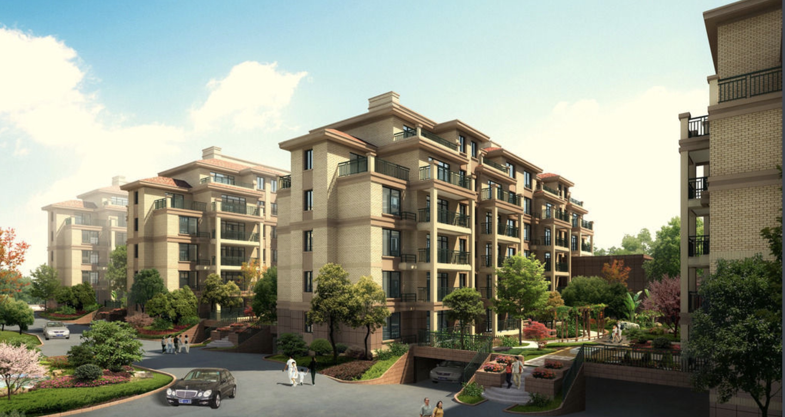

> ==十层及以上住宅为高层住宅==

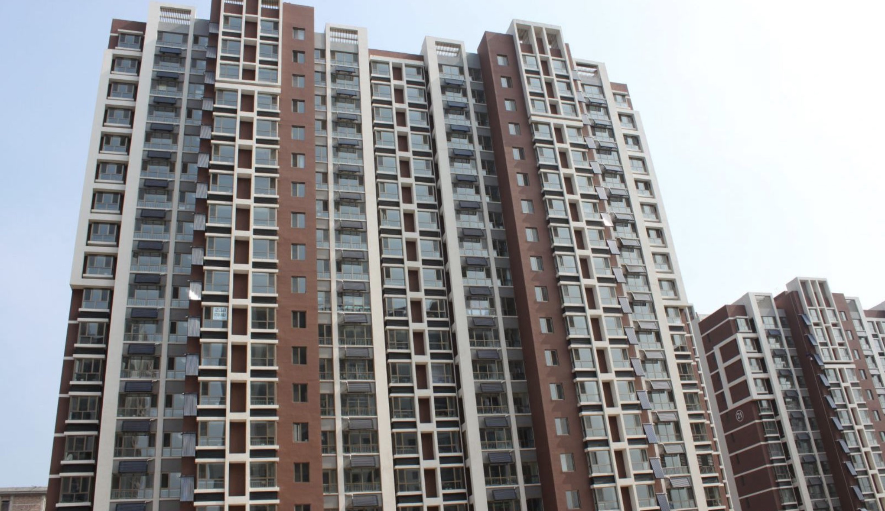


> ==大量的有毒气体和可吸入颗粒物主要集中在离地表层20米以上的空中==;
>
> 现代科学表明，人类的住宅建筑结构应当在20米以下，这有利于能源的节约和人类寿命的延长;
>
> ==人类最佳的居住空间是离地面20米（最好为10米）以内==。对于可吸入颗粒物来说，离地面越近可吸入颗粒物的直径越大，否则越小；可吸入颗粒物的直径越大人体吸入的数量就越少;
>
> 注意观察景观，尤其是在挑选顶层或较高楼层时，不仅要特别注意==朝向景观==，还要考虑周边地区未来规划，如果您现在风景不错的窗前还要再建几幢高楼，风景将会被遮挡;
>
> 向发展商咨询楼层的==供水、水压、夏季是否会断水==等多方面情况。一般高层住宅在顶层都建有水箱，先将水抽到顶层再往下供，使高层住户不会因==压力不足用不上水==;
>
> 注意整幢楼的总户数与电梯数量，电梯的质量与运行速度也很重要。一般情况下，==24层以上住宅都就需要配备3部电梯==；
>
> 高层物业管理不能忽视，尤其是监控保安措施。大楼底层==是否设置值班警卫室==，是否有保安在楼内巡视；
>
> 考虑==车位问题==。在购房时，即使是目前无车的住户也应做好提前打算，因为未来很有可能车位比房价还贵；

==高层的缺点：==

> 每年夏季，高层建筑暴露在炎炎烈日之下，强烈的阳光辐射使建筑物的墙面温度达到数十度，从而导致室内温度不断上升，超过了人类生存能够适应的温度。人们为了降低室内温度，利用风扇、空调等设备降温，把室内的高温气体排到室外。此时，室外的温度会随之升高。恶性循环的温差效应造成了巨大的电能浪费。
>
> 冬季，由于太阳光照射的距离加长，地表温度下降，高层住宅的室内温度将低于低层住宅的室内温度。这是由于地球表面在白天接受阳光的照射，其地球表面的温度增高，而温度随着空间高度的不断增加而下降。也就是说，低层建筑的室内温度高于高层建筑的室内温度。冬季取暖采用的是电加热以及燃煤的方式，楼层越高消耗的能量就越大。因此对于人类来说，高层建筑是一种弊大于利的住宅结构;

==高容积率的缺点：==

> 高容积率的住宅项目意味着小区内房子建得多，而高容积率的住宅必定会带来高密度的居住人口，最终导致小区中业主的生活舒适度下降。另外，高密度的居住人口还会对小区内的健身场所、儿童活动区域、娱乐中心以及楼宇内的电梯、消防通道形成比较大的压力;

>由于高容积率住宅对土地使用率的过分追求，小区内的楼层会比较高、==绿地==的比例也会相应的减少，从而影响居住区内的生活环境与品质。另外，楼间距过近、小区内道路狭窄、==停车位置不足==也是高容积率小区经常遇到的问题;

>由于居住密度大，所以出入的人会较多，外来人员混入其中的难度也会相应地降低很多。这就对高容积率住宅的安防系统提出了更高的要求。所以高容积率的住宅安防系统一定要跟上(当然这不是说低容积率的小区安防就不重要)，不仅要加大监控设备的密度，而且也需要更多的巡逻人员来保证住户的安全;

#### 4、户型

房屋朝向指房屋各个功能分布，比如客厅、卧室、厨房、餐厅、卫生间等的朝向。如下图：

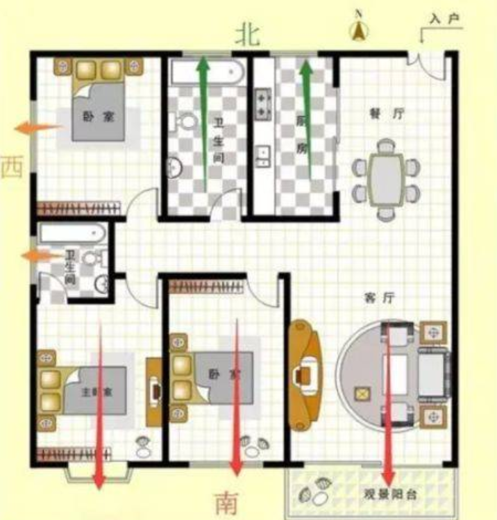


**一般来说：**

~~~

朝南的房屋采光充足，具有冬暖夏凉的特点；

东南朝向的房屋采光相对来说比较好，然而通风却一般；

东朝向的房屋采光是较好，但是通风比较差；

西南朝向的房屋采光比较好，只是有一定西晒的困扰；

北朝向房屋的采光是差的，但是夏日会感觉比较凉爽，不过冬季则会较阴冷；

西朝向的房屋采光时间比较短，夏日午后室内会出现暴晒的情况。

**户型动线**

户型动线包括居住动线、来客动线、家务动线。3条动线之间交叉的部分越少越好，尽量避免不想打扰。

居住动线：主要涉及的区域有卧室、书房、卫生间。

来客动线：主要涉及的区域有客厅、餐厅、公共卫生间。

家务动线：主要涉及的区域有厨房、卫生间、阳台等做家务、洗晒衣物的地方。

~~~

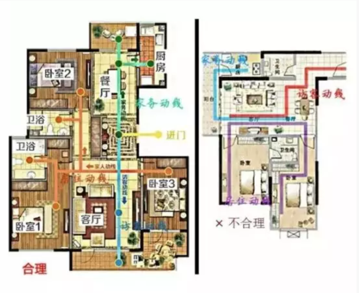

**承重墙和非承重墙**

~~~
一般来说，承重墙不可拆，非承重墙可拆。

但像厨房、卫生间等这些区域的非承重墙墙体可能涉及到水路管道、电路以及防水等，不可随意拆除。

如果买房时想要对户型加以改造，那么就一定要在看户型图或样板间的时候留意承重墙和非承重墙的位置，以及非承重墙是否易于拆除。
~~~

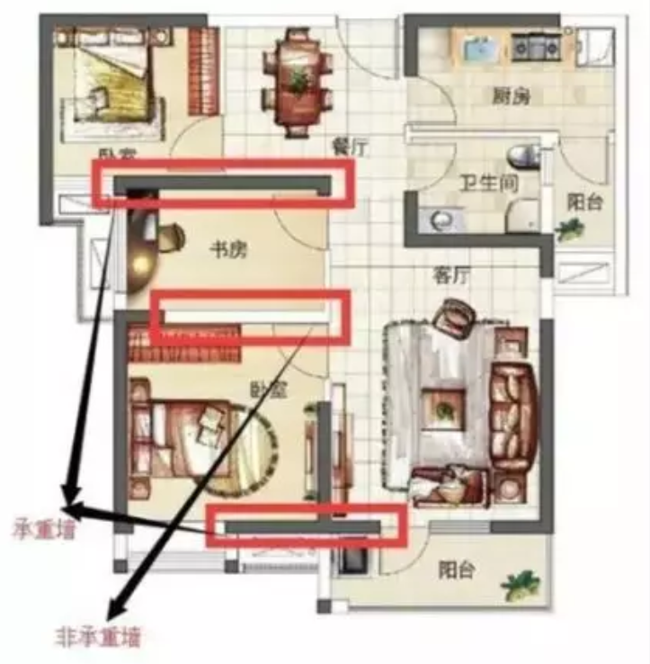

**南北通透**

并不是南北都有窗就叫南北通透，要看窗户之间是否能形成对流。

真正的南北通透需要满足以下3个条件：

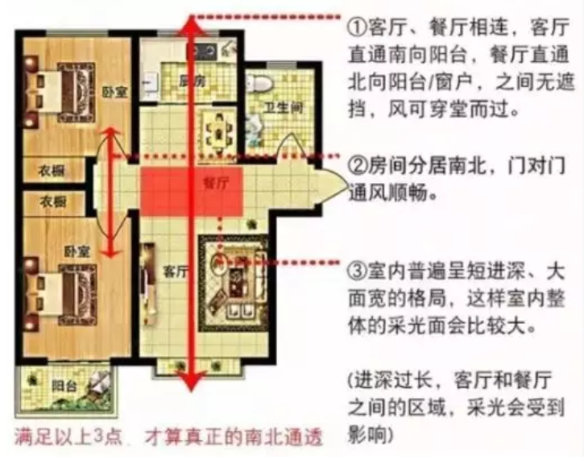

```
一般来说，客厅的阳台能够和厨房的窗户或者餐厅的窗户之间形成对流，就算南北通透。

全明户型

全明户型指的是各个功能分区，如卧室、客厅、厨房、卫生间都有窗户，均可以自然采光。

全明户型不一定要求南北通透，即使全朝南的房子，也可以做到全明。
```

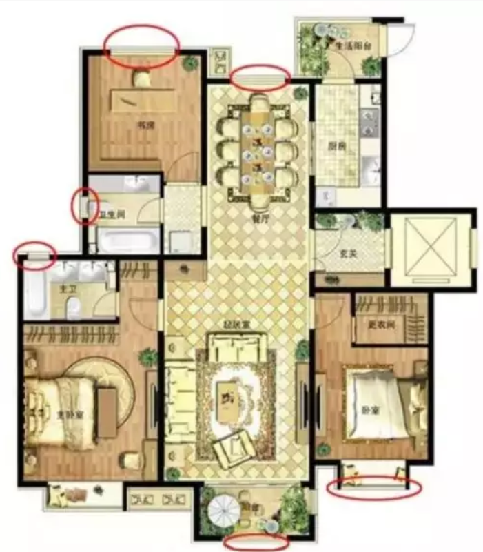

**开间和进深**

```
开间指户型东西之间的距离。

进深指户型南北之间的距离。

开间太小，进深过大，则房屋的采光不好，影响房屋的采光通风效果；

开间过大，进深太小，采光通风非常好，但容易让室内的温度、湿度不稳定。

开间和进深的比例为4:6较为合适。（即开间如果为4米，则进深为6米比较合适。）
```

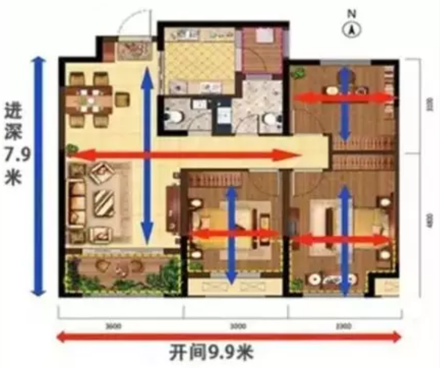

**动静分区**

```
户型的动静分区指的是客厅、厨房、餐厅等主要用来供人活动的场所与卧室、书房等需要安静的场所分开，并且互不干扰。
```

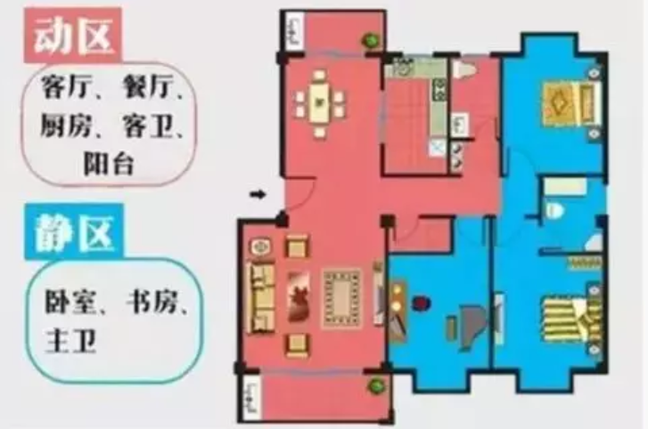

**采光通风**

影响户型采光通风的因素有户型的朝向、开间与进深比例、窗户的数量及大小、周边因素的遮挡（如建筑物、相邻户型的遮挡）等。

因此，判断房型采光时，还要看看户型的楼层平面图，看所选户型是否处于凹槽内，采光是否受到影响。

#### 5、进深

惯上，我们把房间的主采光面成为==开间（面宽），与其垂直的称为进深。也可根据房间门的朝向来确定开间和进深，房门进入的方向的距离为进深，左右两边距离为开间。根据《住宅建筑模数协调标准》（GBJ100-87）规定：住宅建筑的开间常采用下列参数：2.1米、2.4米、2.7米、3.0米、3.3米、3.6米、3.9米、 4.2米==。（卧室以床顺着摆放的方向为开间，床头依靠的墙宽度为“进深”，卧室内布置床时，床头一般不靠窗台摆放）

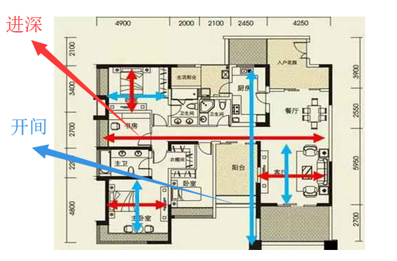


一般意义上的户型方正就是指户型的进深与开间之比合理。进深与开间之比一般介于1：1.5之间较好。进深过大，开间过小，会影响户型采光通风，房间内会显得比较暗；而进深偏小，开间过大不利于房间保温，浪费能源，北方尤其如此。比较方正的户型能做到采光通风与保温两者间的平衡。

所以，进深和面宽到底多大合理是没有统一的答案，不同楼型、不同户型，进深和面宽的设计思路不一样，主要还是看具体户型的分布。为了保证住宅具有良好的天然采光和通风条件，从理论上讲，住宅的进深不宜过大。

对一个单独的房间来讲，当然是面宽越宽、进深越短越好，因为目前除了别墅能够做到四面都有窗户采光、或者双拼别墅能够做到三面采光，一般的普通住宅只有两面或者一面可以采光，对这种住宅来讲，当然是采光面越大越好。


1、==板楼（多层住宅）==的进深12.5米比较合理

南北通透的板式住宅楼为了避免黑房间，包括客厅和餐厅在内的起居室的进深在12.5米左右比较合理，进深超过15米，中间就会有黑厅。

2、卧室和书房的进深在6米左右比较合理

超过7米就显过于狭长。如果一个房间的进深是12.5米，实际就是两个6米长的房间长度。如果进深是15米，可能就是两个6米长的房间，中间夹着一个卫生间，这个卫生间可能没有办法采光，会是个黑房间。

3、==塔楼（高层住宅）==进深各异宜设“采光槽”

塔式住宅楼一梯从4户到6户、8户不等，甚至有的塔楼是一梯十几户，大多数房间肯定不能做到南北都有窗户，可能只有一个方向采光。而且因为塔楼的楼型特点，有的房间进深大一些，所以，在塔楼的楼型设计中，会有一些“槽”，外墙很曲折，形成一些采光井、采光槽，使塔楼里的房间采光面更多，这些采光井和采光槽同时也使单个房间的进深似乎变短了。

==塔楼户型==中，每个房间进深的方向不同，有的是南北向，有的是东西向，而且每个房间进深的长度也不同，这取决于几个因素：一栋塔楼里总共设计了多少套住宅、每套住宅面积多大、在这个塔楼中设计了几处采光井或采光槽、采光井或者采光槽是怎么开的，等等。

对塔楼来讲，进深的设计比较复杂，因此，在买塔楼住宅时，一定注意看清要购买的住宅里，有没有黑房间。在一些住宅楼中，有的面积较大的户型，为了气派，会设计一个进深大、面宽大的客厅，如果是南北通透，朝南的一定是客厅，朝北的一定是餐厅，中间可以安放一个小型会客厅

--------------------------


**一个好的户型，除了户型方正外，还有其他一些原则，主要有：**

1.动静分区

2.干湿分区

3.公私分区

4.通透良好

5.动线合理

6.尺寸合理


**1.动静分区**

动区：客厅、餐厅、厨房、次卫等。

静区：卧室、书房、主卫等。

动区是人们活动较为频繁的区域，应该靠近入户门设置，尤其是厨房；而静区主要供居住者休息，相对比较安静，应当尽量布置在户型内侧。两者分离，一方面使会客、娱乐或者进行家务的人能够放心活动，另一方面也不会过多打扰休息、学习的人，减少相互之间的干扰。

动静分区合理户型（卧室布置在户型深侧，距离入户门较远）

**2.干湿分区**

干湿分区是指厨房、卫生间这两个湿气较重且较容易产生脏污的房间应与精心装修的怕水怕脏的卧室等尽量分离。厨房是家居生活中最主要的污染源，噪声、油烟油污、清洗污水等集中于此，因此厨房的布置要尽可能的靠近进户门，远离卧室、客厅；其次厨房与卫生间是住宅中水管的集中地，从施工成本、能源利用、热水器安装等角度考虑，厨房应与一个卫生间贴邻而处。目前市面上的大部分户型还是考虑到了干湿分区，厨房一般也是设置在入户门最近的位置，但仍有少量灾难级户型，户型完全没有考虑厨房应当如何合理布置。

**3.公私分区**

户型具有私密性的要求，能够适当保护居住者隐私。户型的私密性主要需做到两点：首先在入户门外向户型内望去时，玄关处应当有所遮挡，避免站在门外就能对屋内一览无余；其次是户型内部客厅、餐厅等公共活动空间与卧室等较为私密的空间有视觉上的遮挡，避免在公共区间就能对私密空间一览无余，做到一定程度的“公私分区”。

**4.通透良好**

通透性主要是指户型的通风和采光性能。要保证户型具有良好的通透性能，首先要求户型要有良好的进深开间比，即户型比较方正；其次户型最好有两面可以采光和通风，相对两面采光通风最佳（如南北、东西），其次是相邻两面采光（如东和南、南和西、西和北等），只有一面采光通风效果最差。另外厨房厕所是湿气比较重的两个区域，要尽量做到独立采光通风，也就是避免暗厨暗卫。

**5.动线合理**

动线是指人们在户内活动的路线，动线流畅与否将影响人们进行各种活动时能否实现顺利转换。户型的设计影响到动线的走向，而动线的走向会影响到居住的品质。好的动线能够提升小户型利用率，而差的动线会使大户型变得“大而无当”，浪费空间。户内主要动线有三类，分别是居住动线、家务动线、来客动线。

动线良好（从入户门进客厅、卧室、厨房的三条条线不会交叉)。

#### 6、**买房须知的常识**

1、查看五证，所谓五证就是指《国有土地使用证》、《建筑用地规划许可证》、《[建筑工程](http://www.fang.com/juhe/31651/)规划许可证》、《建筑工程施工许可证》和《商品房预售许可证》。

2、买房其实选择口碑好的开发商很有必要。一般好的开发商资质高、资金充足。开

3、评估购房能力，对于刚需族来说，由于他们的经济能力有限，所以都会采取贷款的方式买房。而贷款每个月需要交一定数额的月供，为了保证生活质量不受影响，避免断供的风险，小编建议月供的数额最好控制在总收入的50%以内。

4、选[户型](http://www.fang.com/juhe/31520/)，挑选户型时，首先要看户型的朝向。朝向优劣的顺序依次为：正南、东南、东、西南、北、西。

5、选楼层，中间层房屋的空气质量相较于低层更好，出行较高层更方便，可以说是折中。

6、很多购房者认为，当下房价过高，所以买房时，一般会在同等区域、同等地段选择价位便宜的楼盘。正确的做法是多学习选房知识，关注户型好坏，房屋质量等干货。

7、看优惠，对于开发商给出的优惠，要多打听，多分析，多判断，不要盲目追风。

8、莫心急，年轻人置业时，不宜好大喜贵，应抛弃置业必须一步到位的思想，根据自身所能承受的范围，作出合理的决策。

9、不可一味买大，看房一定要综合考虑，不可片面。首先是面积，面积以适用为原则，不可为大而大。


10、看规划，买房当然要挑楼盘，挑小区，挑户型，但是也不能只看房子，还要看房子的位置。毕竟，决定房子价值最大的因素便是地段，建议在购置房产时，要切记紧跟城市发展的方向。

11、看价格，价格挑选比较个人承受范围、交通状况、社区环境、户型结构等条件衡量楼盘价格。

12、小区环境，小区景观、绿化、配套等与生活密切相关，更是楼盘质量的体现。

13、避免极端层，顶层和底层不建议买，底层不仅容易潮湿，发霉，滋生蚊子，光线也不好，顶层一到大夏天，不仅闷热，不透气，还容易漏水。

14、远离设备层，设备层是专门供水，供电的中间楼层，要是常年居住在设备层的附近的话，不仅机器设备的噪音把人折磨得无法休息，连机器的辐射也会影响人的身体健康。

15、物业，不同的[物业公司](http://www.fang.com/juhe/32796/)所做的服务千差万别，物业公司能否尽善尽美地完成自己的任务牵扯到小区的整体质量。

16、考虑孩子问题，买地产要考虑孩子路上的安全问题，尽量选择距离近的房子。这样可以给孩子节约大量的时间，让孩子有充裕的时间学习和休息。

17、购房定金，定金对买受人是极为不利的，使买受人在签约的时候处于不利的境地，买受人往往在定金不退的压力下，违心地接受开发商的不平等条款。

18、签[认购](http://www.fang.com/juhe/32316/)书，认购书基本条款要约定详细，对所要购买的房屋的主要情况在认购书中予以约定。条款内容约定要合法有效，要求开发商提供作为正式签约的商品房买卖合同文本。

以上就是关于买房须知的18个常识以及新手买房注意哪些坑的介绍了，其实买房的过程中要细细说来的话，注意事项和常识性的问题可不止这18个，如果有自己亲手办理过买房手续，那就一定清楚买房流程的复杂性，在办理房屋买卖手续的过程中最重要的还是要自己小心谨慎一些

-------

 **哪些楼盘不能买？准确判断楼盘利弊做决定**

**一、看开发商：不良开发商的房屋不能买**

经常会有人这样建议：买房子一定要选大开发商。从现实情况来看，同一地段大开发商的房价也是要比小开发商贵一点的。这是因为大开发商在品牌实力、施工质量、配套设施等方面都更有保障。当然，买大开发商的房子，付出的成本更高，需要量力而为。但无论大开发商还是小开发商都应当选择正规的、五证齐全的。

而一些不良开发商在开发完[房产](http://www.fang.com/juhe/31310/)后，遇到销售业绩不佳，会直接把项目转让他人，自己却抽身走人。这样的开发商不仅口碑不好，如果房子出现问题，购房者都找不到人，居住生活没有保证。

**二、看媒体报道：“负面”楼盘不要买**

烂尾楼应该是购房者很害怕遇到的情况，出现之后购房者往往面临维权艰难的困境。随着网络的日益发达，购房者对于楼盘的信息了解的途径也逐渐增多，因此购房者可以透过网络或媒体的报道提前获取房屋各类信息。对于一些负面新闻很多的楼盘，购房者应该精挑细选，谨慎购买。而对于有漏水、外墙脱落、墙体开裂等质量问题的房屋，购房者也不要购买，以免影响生活。

**三、看土地前身：有问题的房屋不要买**

什么是土地前身不好呢？常见的“不好的土地前身”主要是指化工厂和坟场。由于化工厂污染极大，遗留下的土壤含磷、硫和硫化钠污泥，对居住者的身体健康是不利的。土地前身为坟场主要影响购房者的心理，这就看购房者的心态。

**四、看楼盘环境：治安不好的房屋不要买**

楼盘的治安情况不稳会对居住者的人身安全造成隐患。而如何看治安环境呢？主要看周边是否有破破烂烂的民房、色情场所、垃圾堆、停满黑车等等。

**五、看污染情况：临近污染源的房子不要买**

噪音、灰尘、尾气污染等一系列问题会严重影响到居住者的日常起居。因此在选房时，要注意观察楼盘附近是否有污染源。

一般而言如楼盘距离高架桥、厂房、轨道交通过近会产生受污染严重。高架桥旁边的房屋和距离轨道交通过近的房屋存在噪音、灰尘、尾气污染等一系列问题。厂房附近房屋不仅污染严重，而且存在安全隐患。

------

 **如何准确判断房价涨跌？五招即可轻松判断**

**一、分析地价走势**

熟知楼市的人都知道，土地与房子的关系就跟面粉与面包的关系一样，为什么一样？即面粉贵了，面包自然也会涨价。因此要判断房价走势，不妨先分析一下地价走势，如果你看到地价呈走高[趋势](http://www.fang.com/juhe/32291/)，那么房价的大概率也是有可能会上涨的。

**二、观察人口流动**

对于楼市而言，供需关系一直都是决定价格的一大因素。当楼市库存一定的情况下，购房者越多，那么房价就会越高，因此要判断房价走势，不妨先观察一下人口流动情况，如果当地人口呈净流入趋势，那么房价很有可能要上涨了。

总的来说就是，人口流动直接反映了这个城市未来发展前景，也决定了该城市的房价走势。某城市人口流入量大，意味着该城市对于人才具有较大的吸引力，该城市发展势头良好、前景可观，房子涨价的空间大，而人口大量流入也意味着给该城市[房地产](http://www.fang.com/juhe/31324/)市场带来了大量的需求。

一线城市房价居高不下的一个重要原因就是外来人口的大量流入，房子是外来人口在新城市立足的基础，房[地产](http://www.fang.com/juhe/31154/)市场供不应求，房价上涨合情合理。反之，如果该城市人口净流失量大，该城市经济发展必然不景气，[房价下跌](http://www.fang.com/juhe/116/)可以预见。

**三、银行网点多少**

在通常情况下，银行网点的数量是由当地居民的收入情况来决定的。也就是说，当当地居民收入较多时，那么他们的理财意愿就会比较强烈，而银行自然就会多开网点。

换言之，当银行网点比较多的时候，就意味着当地居民收入比较多，那么此时买房的人也就会增加，而房价自然也就会上涨了。

**四、城市交通规划**

正所谓“地铁一响，黄金万两”，这是楼市行内的一句俗话，但同时也是正理。如果当地有建设地铁的规划，那么房价必然会迎来一波大涨，而且地铁沿线的房价也将会涨得特别快。

**五、中小房企动向**

一般来说，房企对于房价的敏感性要远高于普通购房者，因此，从房企的动向就可以判断房价的走势。如果房企热衷于在当地建房，那么就意味着他们看到当地的[房地产市场](http://www.fang.com/juhe/795/)，此时房价也就很可能会上涨。

----

 **选大开发商有什么好处？如何挑选好的开发商**

**一、选大开发商有什么好处？**

**1****、质量有保障**

大开发商在资金和资源方面的实力通常比较强大，房子的质量会相对有保证一些。大品牌的开发商有足够的实力为业主提供质量可靠、安全稳固的房屋，有足够的能力为楼盘提供完备的配套设施，还有贴心的物业服务。可以说，从建筑材料的选择，到楼盘的施工，再到后的质量监控，品牌开发商有完善的、科学的一套流程。

**2****、大开发商具前瞻性眼光**

一般情况下，大开发商在买地前都会做相关的调研工作。大品牌开发商都已经有了十几年甚至几十年的开发经验，这一方面的话会比小开发商拥有更加完善和专业的调研团队，并且和政府有过多次合作，可能会比小开发商更早知道政府的布局，知道政策会向哪里倾斜，哪个地段会更有上升的空间。

**3****、物业管理有保障**

由于大开发商的实力比较雄厚，一般情况下[物业公司](http://www.fang.com/juhe/32796/)都是自己的，这样会更加负责、敬业。出了问题保修也更加方便。换做第三方物业，我们则不能将矛头对准他们了，毕竟物业公司是外来户，跟房子质量没有直接关系，他们能做的就是沟通协调。如果再加上几户不交物业费，物业公司或许还会懈怠。

**二、如何挑选好的开发商？**

**1****、搜索网上评价**

现在网络十分发达，购房者在买房前可以上网查询开发商的一些资料，如开发商的发展历史、最新楼盘、拿地情况等等。另外，对于开发商的一些报道也可以多加关注，看看有没有出现过与业主之间的纠纷，尤其要关注开发商对于旗下楼盘出现过的问题的解决办法。

**2****、查询开发商资质等级**

在我国，开发商的一般是分等级的，目前是一级到四级，开发商经营年限、注册资本、建筑质量合格率、开发面积等是定级的标准。一级资质的开发商通常有着一个国企大背景，信誉度高，实力相较于其他几级要强很不少。

-----

**小区买房子风水主要看什么？**

1、首先是看河流和道路，如果有河流和道路弯环抱着楼房为吉，如果有河流或道路的弯弓顶向着楼房，是反弓水不吉，道路或河流笔直地冲来是为箭煞，不吉。

2、看建筑物或山体，后面有高大平整的建筑物或者方、园、尖的秀丽山体做后托为吉，后面低矮或后面零乱、空缺、有尖射、过于逼压等不吉，前方避压、闭塞、有屋箭、屋角等形如凶器的建筑物冲射不吉，前方开旷、景色秀美吉；左边的建筑物高于右边一般为吉，右边的建筑物比左边的高，是有奇形怪状的建筑物一般不吉。

3、看地形地势，楼房不宜建在孤山顶上，不宜建在水体上，建在山脉的脊线上和水体上是不好的选择。不能建在悬崖峭壁的下面等。

4、看周围有没有寺庙、军警部门、火葬场、公墓、监狱、神坛等，阳宅应该远离这类建筑物。总体来说，周围山清水秀，后有高靠，前有秀水，环境整洁优美，没有明显的形煞，[采光](http://www.fang.com/juhe/30597/)通风良好，祥和安静，是为好的环境了。

-----

1、房屋选择不缺角：看房的时候都会有图纸，整体看房规划，不可以有缺角，或者三角形，而是选择正方型或者矩形的房屋。因房屋有天方地圆一说，因此在风水学说上：房屋应方方正正。具体缺哪一角则代表主人缺的运势。这个说来就话长了，有兴趣的可以去看下风水说的细节。

2、入门第一眼：进入一个屋子，除了露天大院，进门后应该看到的大厅。如果房屋设置是厕所或者厨房，那么运势都不会太好。因为厕所即为湿气和浊气所在，厨房则为火旺地，若厕所厨房对立，那更是风水之大忌。水火不容也。因此，看设计图也应明确，进屋第一眼帘应该是温馨宽敞的待客大厅。

3、卧室门对位问题：一卧室门不对正大门，否则将造成偏头痛的产生。二卧室门不对厕所，温气以及浊气重地。三双卧室门不对立，造成穿心，不聚财。看风水者第二会看各房间门的对向，如果双门的对立则相克，即可造成身心不便。

4、横梁压顶之说：这条知识相对于其它是比较常识的，不管是什么房间，都不可横梁压顶，如睡铺上方有横梁，则影响人身体健康，长久以往，将导致重病缠身。如在书屋上有横梁压顶，定造成头痛严重。不利于学习。现在可以通过吊顶的做法将横梁档住。

#### 7、房屋产权

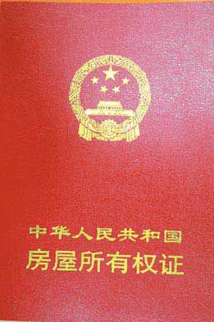

**房屋产权**由==房屋所有权==和==土地使用权==两部分组成，==房屋所有权的期限为永久，而土地使用权根据有关法规为40、50年或70年不等，届满自动续期，续费按当时的1%-10%来增收==（即土地使用权出让金）


| 产权名称 | 土地所有权 | 费用缴纳类型 | 权属证明颁发单位 | 抵押、贷款等 | 地上房屋类型                                   | 土地使用权年限                                     |
| -------- | :--------- | ------------ | :--------------: | ------------ | ---------------------------------------------- | -------------------------------------------------- |
| 大产权   | 国家所有   | 土地出让金等 |   国家，房管局   | 可办理       | 可有商业，住宅，经济适用房（经适房），限价房等 | 70年：居住用；50年：教科文体工用；40年：商旅娱用； |
| 小产权   | 集体所有   | 未缴纳       |    乡政府或村    | 不可办理     | 普通住宅                                       | 没有明确时间，可随时终止                           |

**土地使用权**

~~~
是国家向组织、机构及个人出让的土地使用权利，根据《中华人民共和国宪法》，土地的所有权归国家和集体所有。土地使用权在出让时根据开发类型分为不同的使用年限，包括：民用[住宅建筑](https://baike.baidu.com/item/住宅建筑)用地，商用建筑用地，工业用建筑用地。按建筑用类型有所不同，一般民用住宅建筑权属年限为70年，商用房屋建筑权属年限为40年。
~~~

**房屋所有权**
~~~
属于个人产权，是私有财产权的一种，是得到《[中华人民共和国宪法](https://baike.baidu.com/item/中华人民共和国宪法)》的保护的，根据《[中华人民共和国物权法](https://baike.baidu.com/item/中华人民共和国物权法)》(自2007年10月1日起施行)**第六十四条**　私人对其合法的收入、房屋、生活用品、生产工具、原材料等不动产和动产享有所有权。其年限是永久的。
~~~

**办理房屋所有权登记须带证件**
~~~
1、房屋所有权初始登记

（一）登记申请书；（二）申请人身份证明；（三）建设用地使用权证明；（四）建设工程符合规划的证明；（五）房屋已竣工的证明；（六）房屋测绘报告；（七）其他必要材料。

2、房屋所有权转移登记

（一）登记申请书；（二）申请人身份证明；（三）房屋所有权证书；（四）证明房屋所有权发生转移的材料；（五）其他必要材料。 第（四）项材料，可以是买卖合同、互换合同、赠与合同、受遗赠证明、继承证明、分割协议、合并协议、人民法院生效的法律文书，或者其他证明房屋所有权发生转移的材料。

3、房屋所有权变更登记

4、房屋所有权注销登记

5、抵押权登记

（一）登记申请书；（二）申请人的身份证明；（三）房屋所有权证书；（四）抵押合同；（五）主债权合同；（六）其他必要材料

6、抵押权注销登记

（一） 登记申请书；（二） 申请人的身份证明；（三）房屋他项权证书；（四） 证明房屋抵押权消灭的材料；（五） 其他必要材料。

7、预购商品房预告登记

（一）登记申请书；（二）申请人的身份证明；（三）已登记备案的商品房预售合同；（四）当事人关于预告登记的约定；（五）其他必要材料。

8、房屋所有权转移预告登记

（一）登记申请书；（二）申请人的身份证明；（三）房屋所有权转让合同；（四）转让方的房屋所有权证书；（五）当事人关于预告登记的约定；（六）其他必要材料。

**办理房屋所有权登记流程**

申请 受理 审核 收费 发证 记载于登记簿 归档
~~~


  房屋产权证具体又包括《[房屋所有权证](https://baike.baidu.com/item/房屋所有权证)》和《[土地使用权证](https://baike.baidu.com/item/土地使用权证)》，但有些地方也可能是由房屋管理部门和土地管理部门统一开据的《房地产权证书》。

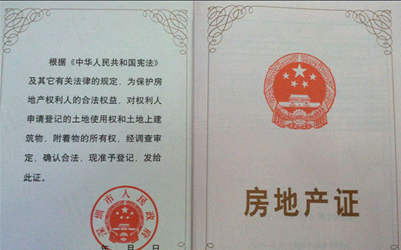

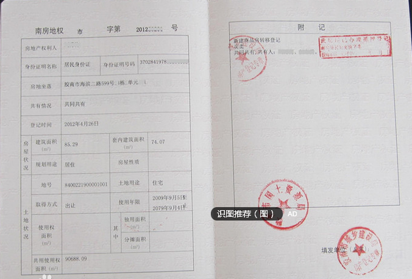

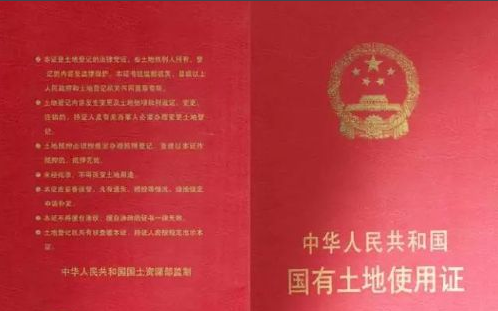

有产权证可以对房屋拥有一定的处分权，没有产权证的有些权利得不到保障。如果没有办理房地产权证，买房人即使交了房款，办了入住手续，但从法律意义讲，房子还是不属于买房者所有。

**==土地使用权和房屋所有权的区别==**

购房者大多对房屋产权问题是一知半解，混淆了==房屋产权和土地使用权==，“土地使用权”与“房屋产权”是两个不同的概念，==房屋产权是所有权，土地使用权是国家出让的。所谓房地产使用权，其实只是土地使用权。土地使用权决定了房产的使用权==。

==业主所有的住宅除了拥有房屋的所有权外,还拥有该房屋的国土土地使用权==。

也就是说如果==房屋产权到期房子还在的话，房子依旧是你的，只是要补交土地税==。房产产权期限是指房子所占的土地的使用权，而不是房子所有权本身。国家规定，城镇建设用地为国家所有，个人和企业可以有偿使用和交易使用权。

==住宅的使用权限是70年，从该地取得日算起==。购房者只要有合法的产权证，房子就是私人财产，不属于国家。只要房子还在，个人就拥有该房子的所有权。==房产权70年从开发商开始盖房就开始算了==。

==不能把土地产权70年和使用权70年混为一谈==，也不能把“房屋的所有权”和“土地的使用权”混为一谈了，正确的说法是“土地的使用权一般为70年”。

土地使用权和房屋所有权的区别在于：==房屋所有权(即房产权)是永久的，没有期限限制，只要房产没有完全毁损灭失就能一直享有;土地使用权是有期限的。国家通过土地有期出让方式，授予用地人40年、50年、70年不等的使用权==。

到期后，如国家需要收回土地，且必须连同地上建筑物一并收回时，这时会出现一个问题，由于房子在开发时有先有后，但**土地使用权的终止日期是以土地出让合同上的终止时间为准****，即土地使用权到期**，而房产还未到报废的年限。这时收回土地使用权则要给予地上建筑物所有人相应补偿;如果不收回，地上建筑物所有权人可以在届满前一年向国家申请续期，并重新缴纳土地出让金。

> 两者的区别：

1、两者的权属不同， 根据《城市房地产管理法》的规定，==房地产的买卖是指房屋的所有权和该房屋占用范围内的土地使用权同时转让，也就是说，购房者享有的是完全的房屋所有权==;但我国实行的土地全民所有制，即土地只有国家和集体所有，个人只有使用权。因此，==土地证上载明的使用终止日期一到，国家可以收回土地使用权==。 相关条例:《中华人民共和国城镇国有使用权出让和转让暂行条例》明确规定,==居住用地土地使用权出让的最高年限是70年。70年的土地使用权期满后,土地收归国有,而地上建筑物仍属业主所有。如果再次申请土地使用权,则应该根据当时的地价水平,补交土地出让金==。 

> 答疑: Q:房产证上会写上年限吗?

A:购买商品房后,由住建局发放的房产证,国土局则发放国有土地使用证,有些地区会在房产证上注明土地的使用年限,另一方面,如业主需求土地使用证,则需要开发商协助向国土局申请。

> Q:国有土地使用证和房产证有什么区别?

A:==要买房子首先要看两证,《国有土地使用权证》和《房屋产权证》==,《国有土地使用权证》上就有你所购买房屋的土地分摊面积和性质以及年限,住宅用地是指用于居住建筑的用地,非住宅用地包括“商业用地”、“工业用地”等。

==国有土地使用证是公有的,房产证是私有的,国有土地使用权50年、70年是针对该地块的土地使用年限,而商品房被购房者购买后,则属于业主所有,但业主仅拥有这块土地上对应的商品房拥有权,而没有土地的使用权。另外,只有土地才有使用年限==。

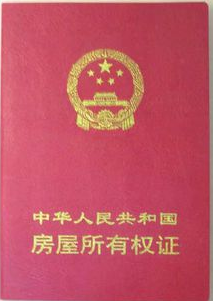

业主购买商品房, 国家没有硬性规定需要发放国土使用证, 业主如有需求, 则需要在开发商的配合下向国土局申请。

> Q:房屋产权是从什么时候算起,如何界定?

A:==住宅用地的土地使用年限是70年,从该地块取得之日起算==。70年指的是该地块的国有土地的使用年限,并不是房屋所有权的年限。==土地使用权使用起止年限以土地出让方和受让方签订的土地出让合同约定的日期为准,不考虑你和开发商签署的预售合同日期==。

比如一个开发商2006年买的土地使用权,3年的开发时间,你2008年买的房子,2009年才交房入住,那么你的产权时间从2006年算起70年。土地使用年限按土地证上的用地性质来划分。

> Q:产权到期后房子该怎么办?

A:中国自改革开放以来,才开始房屋产权年限的问题,从首批拥有房产证的业主至今也不过30多年,距离产权70年还有一段距离,国家暂无条例明确规定,产权到期后的具体处理方法。

> 查房屋产权时要注意的情况:

1、有房屋未必有产权,如单位自建、农村宅基地建房、社区配套用房、违建房等;

2.产权是否登记?如预售房、抵押商品房未登记等;

3.产权是否完整?如已抵押未解除、公房不符合上市出售条件;

4.产权有无纠纷?如拍卖竞得、婚姻或财产继承、确定为拆迁的房屋等;

5.有房地产两证未必就有产权,如伪造房产两证、被查封或强制拍卖、遗失补办后发生过转让。

#### 8、菜鸟和高手的区别

你可能没有被精美的沙盘所蒙蔽，也逃过了“超模”样板间的忽悠，但是，因为缺少实战，还是**迷失在置业顾问的连珠炮里……**


高手过招，一招见分晓。

更多时候，**你是高手还是菜鸟，一个问题就暴露了。**

职业顾问一看你是“随便就能忽悠斯基”，同一小区，你买的房子可能就会比懂行的人贵10万。

今天热巴就教你，和置业顾问交流时，**怎样问问题才能显得自己像个不好忽悠的老司机**


1

**菜鸟问面积，高手问公摊**

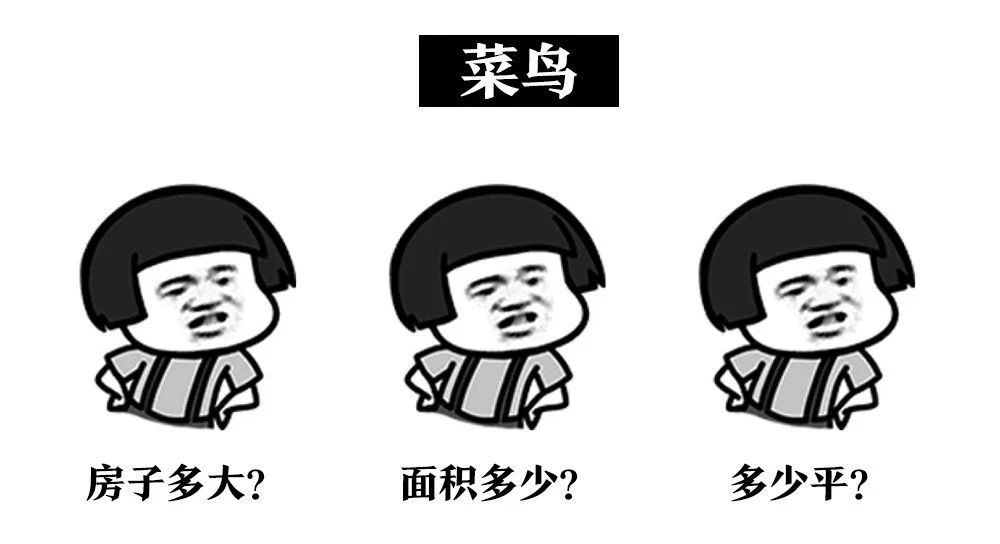

在售楼处询问房屋的面积时，菜鸟的问法往往直截了当：房子有多大？

**懵懂的可爱。**

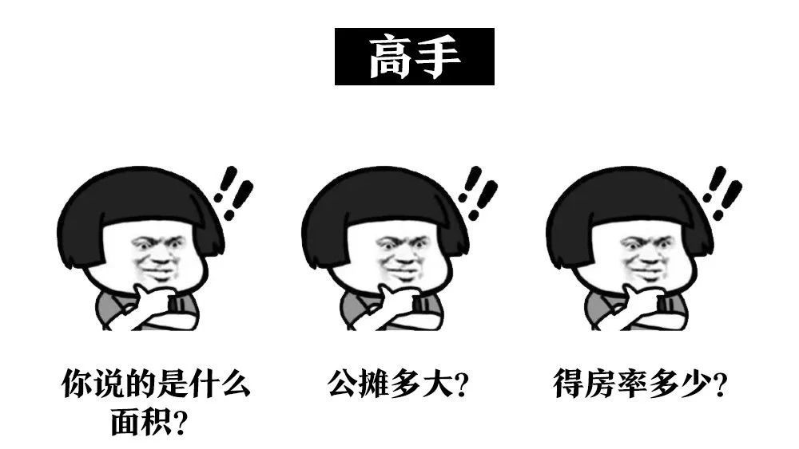

高手买房时，更关心房子的公摊面积多大。

他们会弄清楚置业顾问所说的面积，是指建筑面积还是套内建筑面积。

因为套内面积才是我们收房后可以利用的面积，**公摊越大的房子得房率越低。**

2

**菜鸟问价格，高手问差价**


置业顾问带购房者看房时，都会对房屋进行介绍，如果你直接问房屋的价格，emmmmm，他可能会觉得你不太懂行。


你能获取的有价值的信息非常有限。

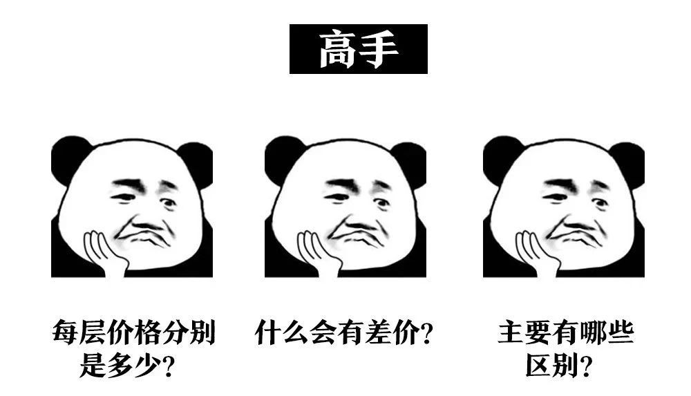

高手买房时会明确表达自己想住在哪层，**让置业顾问计算不同楼层需要付的价钱。**

并仔细询问：为什么会有这个差价？主要有哪些区别？

置业顾问必定会给你介绍清楚情况，解释存在差价的原因。

这样就能从置业顾问那里，得到更多有效的信息。

3

**菜鸟问使用年限，高手问拿地时间**

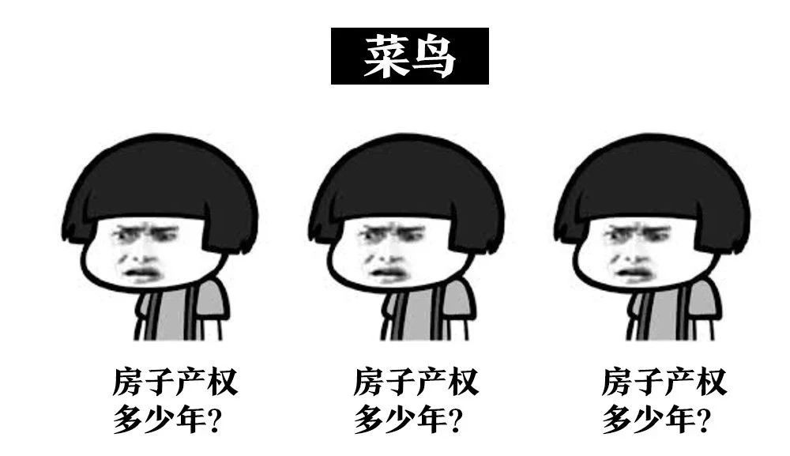

你要是直接问置业顾问房子产权多少年，他们会和你玩个文字陷阱，告诉你“这是普通住宅70年产权”或者“这是商住公寓40or50年”。

可是**实际的土地使用年限是从拿地开始计算的，**具体有多少年他们可不会主动告诉你。

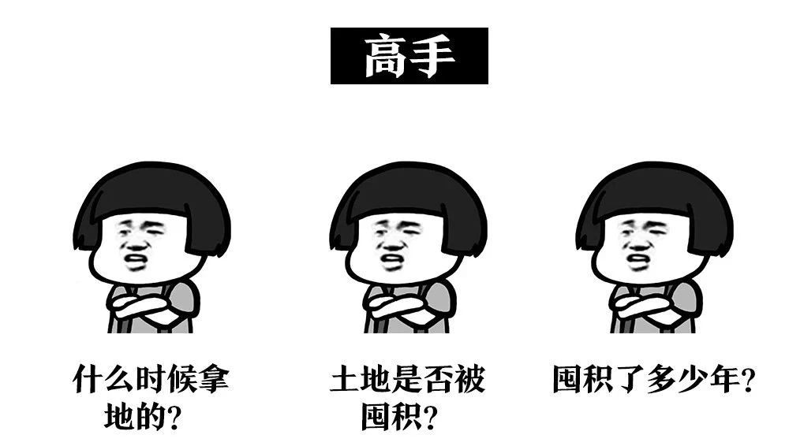

高手一般会问的深入一点，如“你们这个项目是什么时候拿地的”、“土地是否被囤积”、“囤积了多少年”，**了解实际拥有的土地使用年限。**

如果一个项目无论是户型、价格、配套还是周边环境你都很满意，经过询问发现拿地时间已经过去了20年。

虽然是普通住宅，但是你实际拥有的土地使用年限只剩下了50年，这样的房子要慎重。

4

**菜鸟问规划配套，高手会私下考察**

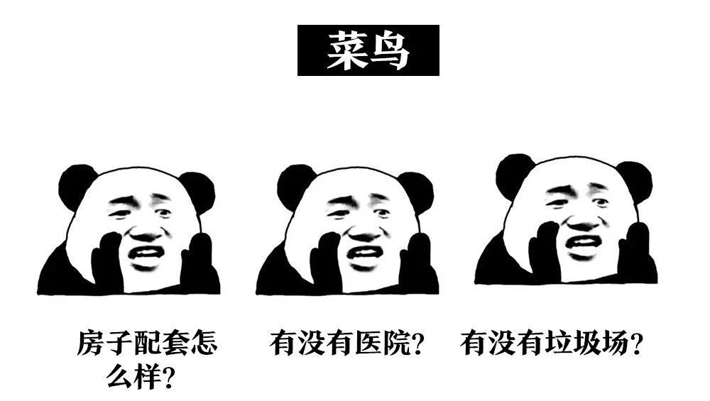

无论是菜鸟还是高手都会问规划配套。

这就是置业顾问的吹牛时间，他们**肯定会大肆吹嘘：这里未来会建设什么什么，我们预计投资多少多少。**

菜鸟通常会选择相！信！他！

要知道这些未来可能有的规划并不一定会写进购房合同及补充协议里，**能否实现是个未知数。**

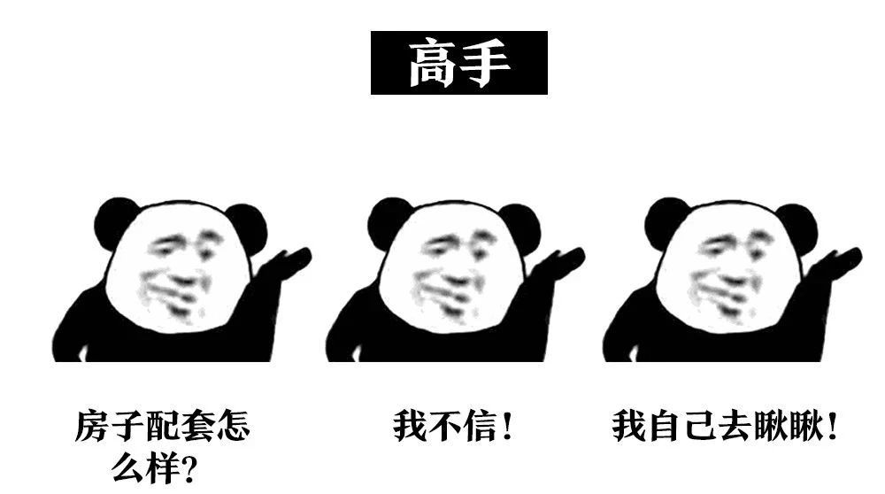

高手不会局限在置业顾问的“浅谈辄止”，还会私下进行考察，查看是否属实，**深究“会不会有变数、有无文件下达、具体什么时候实现等问题”。**

对于一些现有配套也十分注意。

置业顾问说的”离公交站、商圈很近，几步路就到了“，他们一定会去验证，实地走走，看是不是真的很近。

更严谨的，甚至会向周围的居民打听实际的住房感受……

5

**菜鸟问物业费，高手问物业归属**

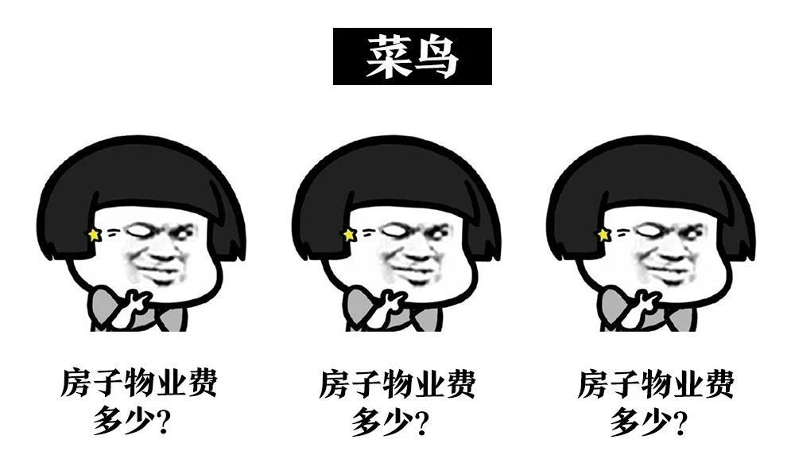

菜鸟一般会直接问物业的费用，然后置业顾问告诉你XX元/㎡每月。

但是你根本不知道，物业管理费是暂定价格还是永久的……

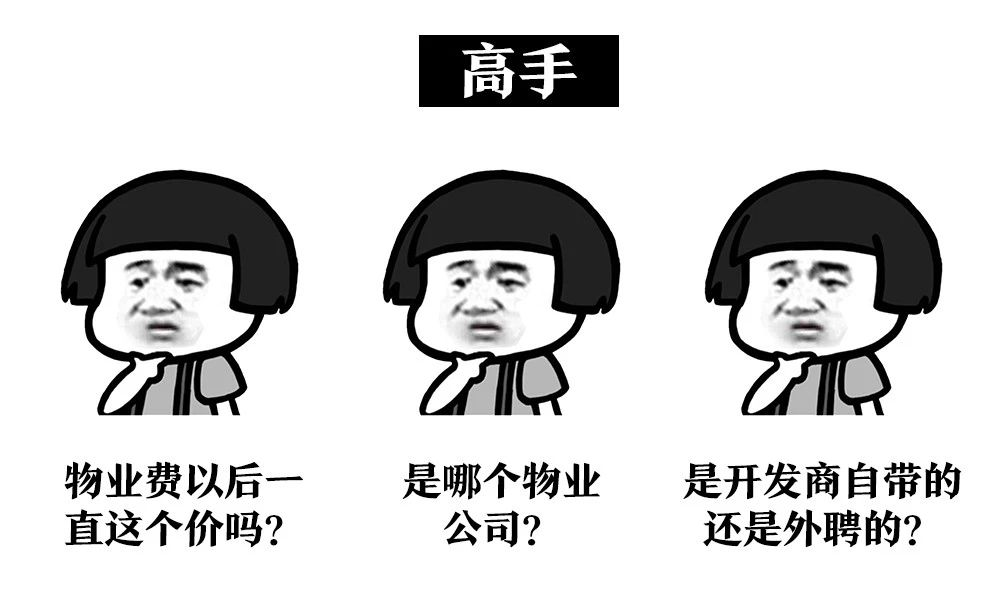

高手会问得更仔细：“这个是第一年促销的费用，还是一直这个价？”，

当然，他们更加在意的是物业公司是属于开发商自带的还是外聘的。

这点非常重要，**最好选用物业公司归属于开发商的楼盘**，例如万科、保利的楼盘都是自己的物业公司。

万一出了问题，维权也相对容易些。


#### 9、楼面价

楼面价是单位建筑面积分摊的土地出让价格。计算方法：出让土地价格除以该土地允许的最大建筑面积。最大建筑面积受政府批准的容积率控制

房价中的楼面[土地价格](https://baike.baidu.com/item/土地价格)计算和两个指标有关系,一是土地本身的价格,二是规划容积率。土地价格就不用多说了，计算时要包括各种购买土地时所发生的费用；容积率就是用规划总建筑面积除以地面总面积，比如在一万平方的土地上建15000平方的房子，那么它的容积率就是1.5。假设一个小区土地价格为40万/亩,容积率为1.8的话,两种方式得出楼面价：[楼面地价](https://baike.baidu.com/item/楼面地价)=400000*0.0015/1.8=334元/平方米（0.0015亩是1平方米）。&楼面地价=400000/（666.6*1.8）=334元/平方米（一亩约666.7平方米）
$$
楼面价 =  每平米单价 * 土地面积 / 建筑面积 = 每平米单价 / 容积率 = 每亩单价 * 0.0015
$$
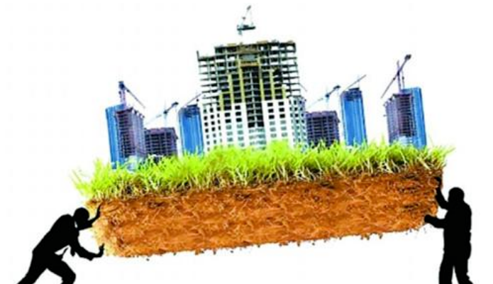


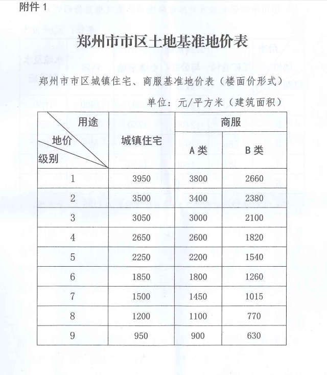

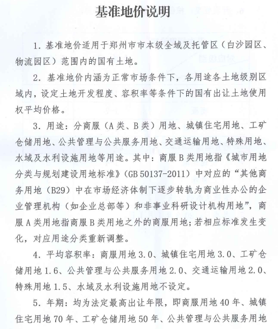

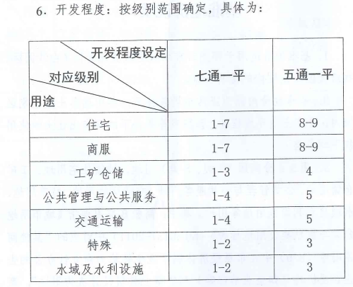

#### 10、备案价

房价备案制度是指要求开发商在首次开盘定价时，必须根据规定的时间提前到当地价格主管部门备案，然后才可以向房管部门申请销售许可证。

备案的价格将在房管部门的官方网站上向社会公布，这一价格即为该楼盘的最高售价，开发商不得擅自在销售中突破此价格卖房；

-----

一、开发商在首次开盘定价时，==必须提前15天到物价部门备案，然后才可以向房管部门申请预销售许可证==，备案的价格将在房管部门的官方网站上向社会公布，这一价格即为该楼盘的最高售价，开发商不得擅自在实际销售中突破此价格卖房。 [1] 

二、如果开发商在实际销售过程中想提高销售价格，那么必须提前15天到物价部门重新备案，并由房管部门重新在网上公布。

三、开发商在物价部门备案的价格、房管部门在网上公布的价格以及楼盘的实际销售价格,必须“三价统一”，如果开发商突破备案价和公布价随意抬价，将由主管部门进行查处。

房地产开发企业在普通商品住房销售前必须到物价部门办理价格备案手续，房地产开发企业凭备案手续才能到房管部门领取到预售许可证进行销售。

文件中规定，为保持普通商品住房价格的基本稳定，原则上半年内不得提高备案销售价格，确需调整价格的，应重新办理价格备案手续。

除了[经济适用房](https://baike.baidu.com/item/经济适用房)、[安居房](https://baike.baidu.com/item/安居房)、[限价商品房](https://baike.baidu.com/item/限价商品房)、政府项目的拆迁[安置房](https://baike.baidu.com/item/安置房)等享受政府优惠政策的住房继续实行[政府指导价](https://baike.baidu.com/item/政府指导价)或[政府定价](https://baike.baidu.com/item/政府定价)外，扬州市区的普通商品房都被纳入备案范围，也就是建筑容积率在1.0以上、单套建筑面积在144平方米以下的。

#### 11、五证

房产五证是指==《土地使用证》、《建设用地规划许可证》、《建设工程规划许可证》、《建筑工程施工许可证》、《商品房预售许可证》==

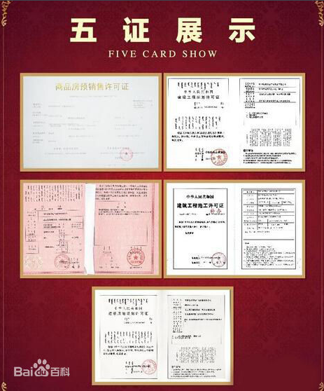

其中《建设用地规划许可证》和《建设工程规划许可证》由市规划委员会核发，《建筑工程施工许可证》由市建委核发，==《国有土地使用证》和《商品房预售许可证》由市国土资源和房屋管理局核发==

这五证最主要的应该看==两证，一个是国有土地使用证，一个是预售许可证==，这两种要合法，看准确了，一般原则上就没有问题，==特别是预售许可证==。特别要提醒的是，购房者在查看五证的时候一定要看原件，复印件很容易作弊

==签合同前，要看清楚您所预购的房屋是不是在预售范围之内，以确保将来顺利的办理产权证==


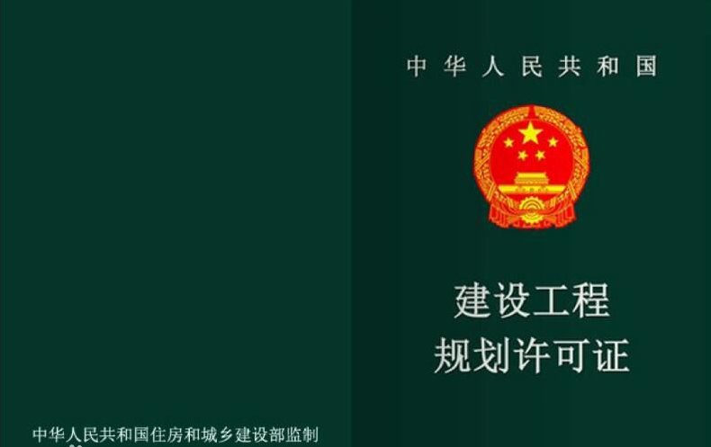


《建设工程规划许可证》包括下列内容：

⑴许可证编号； [1] 

⑵发证机关名称和发证日期；

⑶用地单位；

⑷用地项目名称、位置、宗地号以及子项目名称、建筑性质、栋数、层数、结构类型；

⑸计容积率面积及各分类面积；

⑹附件包括总平面图、各层建筑[平面图](https://baike.baidu.com/item/平面图)、各向[立面图](https://baike.baidu.com/item/立面图)和[剖面图](https://baike.baidu.com/item/剖面图)。

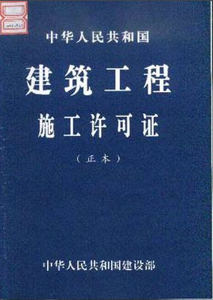

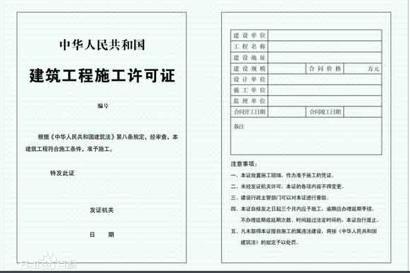

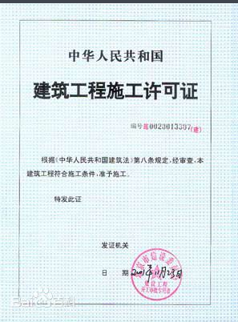

国有土地使用证

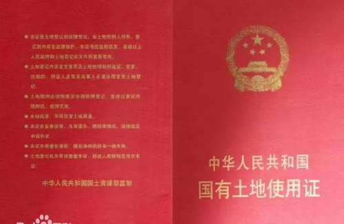

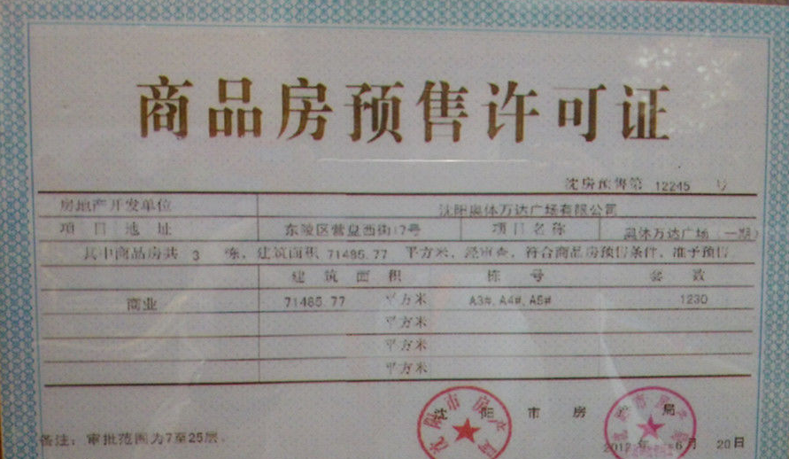

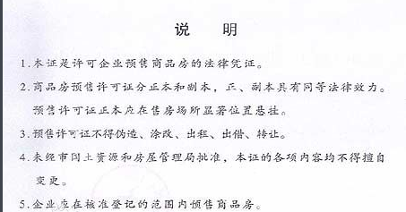

#### 12、二书

买完房以后还要查验或者叫验收"两书 。" 什么是两书呢，两书是开发商在竣工验收合格时

通知购房者入住之后提供的两份法律文件，一个是==住宅质量保证书==，第二是==住宅使用说明书==。

> 住宅质量保证书

住宅质量保证书通常包括工程质量监督部门核验的登记，在使用年限内承担的保修责任，正常使用情况下，各部件的保修期，比如说防水是三年，墙面、管道渗漏是一年，墙面抹灰脱落是一年，地面大面积起沙是一年，包括供热供冷系统等设备，卫生洁具、开关等等。其他部位或者部件的保修时间可以由房地产开发商和用户商定。

我国房地产法规规定，房地产开发企业应当在商品房交付使用时向购买人提供《[住宅质量保证书](https://baike.baidu.com/item/住宅质量保证书)》和《住宅使用说明书》。工程质量保证书是房地产开发企业对所售商品房承担质量责任的法律文件，其中应当列明工程质量监督单位核验的质量等级、保修范围、保修期和保修单位等内容。开发商应当按《住宅质量保证书》的约定，承担保修责任。

商品房保修期从开发商将竣工验收的房屋交付使用之日起计算。工程质量保证书中具体保修期限与保修范围是：地基基础和主体结构在合理使用寿命年限内；屋面防水为3年；墙面、厨房和卫生间地面为1年；《[住宅质量保证书](https://baike.baidu.com/item/住宅质量保证书)》一般约定地下室及管道渗漏为1年；墙面、顶棚抹灰层脱落为1年；地面空鼓开裂、大面积起沙为1年；门窗翘裂、五金件及卫生洁具损坏为1年；灯具、电器开关损坏为6个月；管道堵塞为2个月；供热供冷系统设备为一个采暖期或供冷期；其他部位、部件的保修期限，由买卖双方自行约定，并写在工程质量保证书中。

房屋在保修期内出现质量问题，如经保修单位维修后导致房屋使用功能受到影响，或因主体结构质量不合格给购买人造成损失的，根据工程质量保证书开发商应承担赔偿责任。购买人认为主体结构质量不合格的，可以向《住宅质量保证书》中注明的工程质量监督单位申请重新核验，经核验确属不合格的，购买人有权退房。

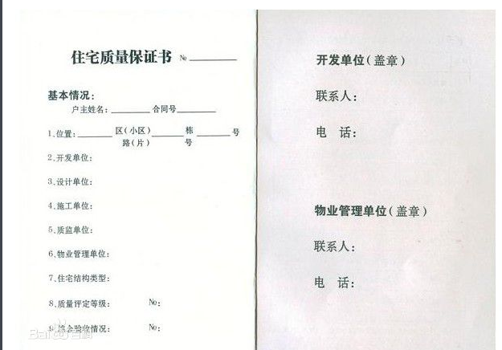

> 住宅使用说明书

住宅使用说明书，通常应该包括开发单位、设计单位、施工单位、委托监理单位、住宅的结 构类型、装修装饰注意事项、上水下水、电、燃器、消防等设施配套的说明，以及门窗类型使用事项，配电负荷，承重墙、保温墙、阳台等部位需要说明的问题以及其他需要说明的问题。生产厂家另有说明书的，应附于住宅使用说明书里。

也就是说一个房屋完整的法律文件在购房的过程中应该查验五证，同时收房的时候应该有两书。还有更重要的是产权证，拿到产权证，整个购房所有的法律文件就应该算齐备了。在购房的过程中还涉及到一个问题，在有些情况下，==在什么情况下签订房屋的现售合同，在什么情况下签订[预售合同](https://baike.baidu.com/item/预售合同)。现售合同是你想买的房屋已经竣工验收并交付使用了商品房，这个时候开发商和购房者签订的是房地产的现售合同。如果你购买的房 尚未竣工验收，就是[期房](https://baike.baidu.com/item/期房)，这个时候签订的是房屋的预售合同==。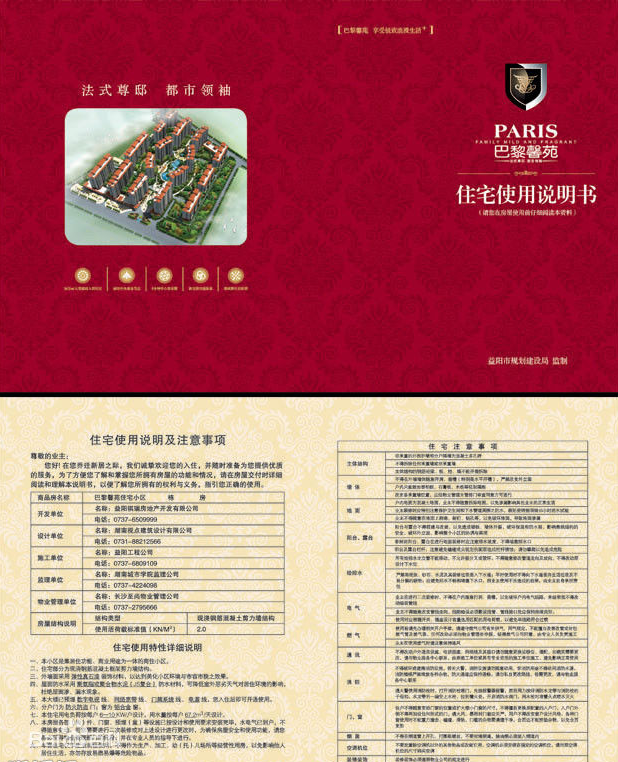

#### 13、期房

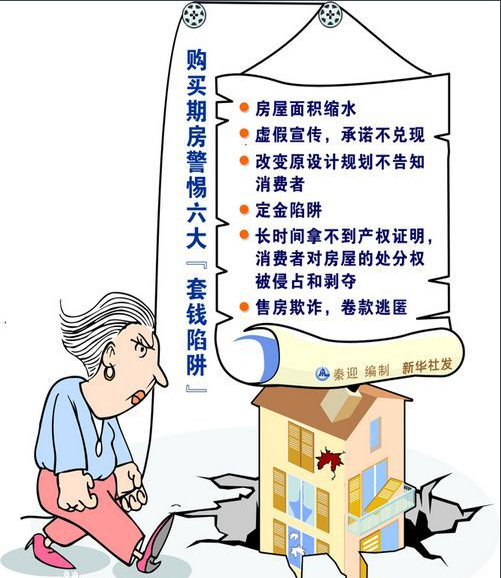

期房一般指在建的、尚未完成建设的、不能交付使用的房屋。即指开发商从取得[商品房预售](https://baike.baidu.com/item/商品房预售)许可证开始至取得[房地产权证](https://baike.baidu.com/item/房地产权证/9282276)（大产证）为止，在这一期间的商品房称为期房，消费者在这一阶段购买商品房时应签[预售合同](https://baike.baidu.com/item/预售合同/593577)。

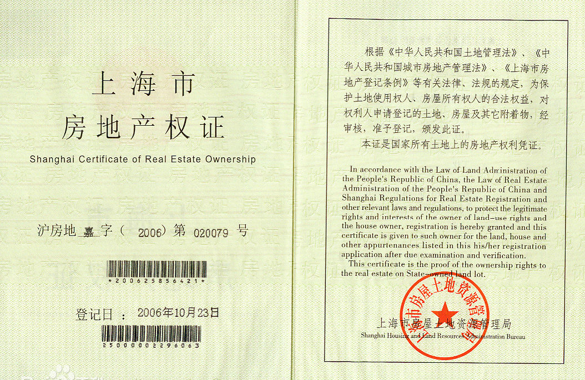

一般情况下，期房的价格较低，挑选余地较大，但由于是先付款后交房，因此[购房](https://baike.baidu.com/item/购房)消费的过程和结果要依赖于购房合同约定的权利义务的履行，而购房合同的履行，不仅受开发商自身经营的影响，还受到许多客观因素的制约。 期房制度由于有各种利弊，目前在中国有取消的趋势

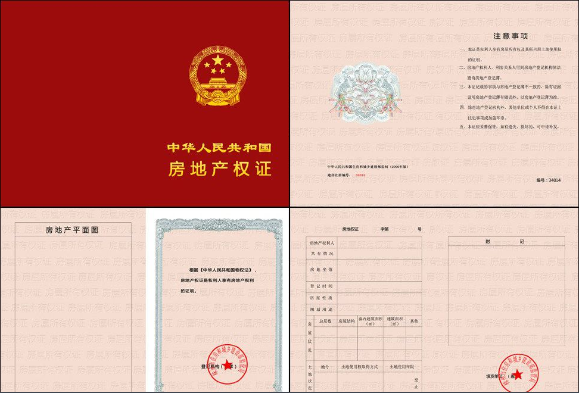

[商品房预售](https://baike.baidu.com/item/商品房预售)制度的产生与我国[房地产市场](https://baike.baidu.com/item/房地产市场)发展的进程紧密联系。长期以来，我国城镇住房供应不足，加快建设、增加住房供应是客观需要。但是，我国刚刚起步的[房地产业](https://baike.baidu.com/item/房地产业)资金严重不足，不少都接近“皮包”公司状态，自有资金的比例甚至不到10%，就连基础较好的上海房产开发企业，其[自有资金比例](https://baike.baidu.com/item/自有资金比例)一直到2001年还只有18.84%。另一方面，融资渠道和融资手段单一，从银行贷款几乎是[房地产开发企业](https://baike.baidu.com/item/房地产开发企业)的惟一选择。

由于自有资金严重不足，[房地产企业](https://baike.baidu.com/item/房地产企业)存在着严重的投机性，这引来更多的限制。1993年，国家开始进行宏观调控，房地产企业不仅贷款难度加大，[上市融资](https://baike.baidu.com/item/上市融资)之路也被堵死，国家明确提出不鼓励房地产企业上市的政策（并且，此后好几年这一限制也未有松动：1996年，证监会《关于股票发行工作若干规定的通知》，要求对[房地产业](https://baike.baidu.com/item/房地产业)“暂不考虑”，1997年，证监会《关于做好股票发行工作的通知》中重申，继续对“房地产行业企业暂不受理”。）

一方面，房地产开发企业要发展，一方面是这些企业自有资金严重不足。于是，建设部主导设立了[商品房预售制度](https://baike.baidu.com/item/商品房预售制度)。1994年出台的《[城市房地产管理法](https://baike.baidu.com/item/城市房地产管理法)》，对预售条件、监管作出了原则性规定，但是，却留下来一个巨大的漏洞，即对侵权、违规行为未制定具体的惩戒条款。商品房预售制度实行后，各主要城市商品房预售比例逐渐发展到80%以上，部分城市甚至达到90%以上，许多开发成本转嫁给了[购房](https://baike.baidu.com/item/购房)人。

 

[商品房](https://baike.baidu.com/item/商品房)预售制度的推行导致了一系列问题，首先就是对[购房](https://baike.baidu.com/item/购房)人权益的损害。由于购房人已经预交了大部分甚至全部房款，开发商提高房屋质量以吸引消费者的动力不复存在，这不仅导致了房屋质量问题连连，也导致推迟交房，甚至携款潜逃现象发生。7月25日上午，中消协发布的“2007年上半年全国受理投诉情况”显示，虽然上半年投诉总量较去年同期呈下降趋势，但[商品房](https://baike.baidu.com/item/商品房)投诉比去年同期上升了15%，增幅第一。中国社会科学院法学所所长助理[刘俊海](https://baike.baidu.com/item/刘俊海)认为，只要[房屋预售](https://baike.baidu.com/item/房屋预售)制度存在一天，消费者必然处于受掠夺与打压的被动地位。

预售制度更大的危害在于，当开发商提前拿到预收款，提前收回大部分乃至全部成本，他们就没有了后顾之忧，通过囤积居奇等方式步步推动房价上涨，而房价的上涨又为开发商更方便地收取下一个项目的预收款创造了条件，因为在房价上涨过程中，在买涨不买跌的心理推动下，人们对未来房价增值的预期会变得更为强烈，这种循环推动力促使房价屡创新高。 

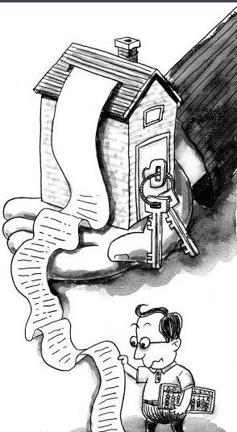

当初设立[商品房预售制度](https://baike.baidu.com/item/商品房预售制度)的条件如今都已经不复存在。从[融资渠道](https://baike.baidu.com/item/融资渠道)来看，[房地产开发企业](https://baike.baidu.com/item/房地产开发企业)有银行贷款、发行[股票融资](https://baike.baidu.com/item/股票融资)、[债券融资](https://baike.baidu.com/item/债券融资)、[信托融资](https://baike.baidu.com/item/信托融资)等等。由于普遍对[房地产业](https://baike.baidu.com/item/房地产业)的发展前景看好，开发商获取银行贷款的难度已经大为降低，不少银行甚至找上门来，降低门槛为开发商提供贷款。而且，经过十几年的快速发展，房地产开发企业的[自有资金比例](https://baike.baidu.com/item/自有资金比例)在逐渐提升，对预售房制度的依赖性逐渐减弱。

更重要的是，当初建立[商品房预售制度](https://baike.baidu.com/item/商品房预售制度)，是因为当时房地产业发展不景气，房价低迷，需要鼓励房地产的发展，而现在的情况已经与之完全相反，[房地产投资](https://baike.baidu.com/item/房地产投资)过热，房价大幅度攀升，接连两次房市调控政策都未能阻挡住房价快速上涨的势头。从某种程度上来看，[商品房](https://baike.baidu.com/item/商品房/1555)预售制度正在成为开发商囤积居奇、推动房价上涨的帮凶。把目前的期房销售制度，改为[现房](https://baike.baidu.com/item/现房)销售制度，于国于民都是大为有益的。

> 未来趋势

[中国人民银行](https://baike.baidu.com/item/中国人民银行)于2005年发布了《2004年中国房地产金融报告》。报告认为，是我国的支柱产业，应继续支持并使其得到健康发展。但存在潜在风险，目前应坚持区别对待、有保有压的调控原则。报告建议，取消制度，同时允许发达地区提高个人公积金，并成立专门机构加强公积金监管，从而进一步完善管理。央行认为，很多和交易问题都源于新房的预售制度，目前经营良好的房地产商已经积累了一定的实力，可以考虑予以取消，改期房销售为销售。其次，报告建议允许发达地区提高个人公积金缴存比例，进一步完善，提高者的能力，逐步做到所有居民都能上缴住房公积金，并成立专门机构加强公积金监管。 截至2004年底，全国住房公积金缴存余额为4893.5亿元，实际缴存职工人数为6138.5万人，占在岗职工人数的58.4%。同期个人公积金贷款余额2096.2亿元，占住房公积金缴存余额的比例为42.8%，除去和，全国仍有2086.3亿元，占缴存余额的比例为42.6%。

>  优势分析

期房

(1)先期预购，[户型](https://baike.baidu.com/item/户型)、位置利于选择。由于订的是未竣工的房屋，销售工作刚刚开始，开发项目的所有房型都有，朝向好的户型也在其中，购房者有了比较大的选择余地。

(2)价格能给予较大的优惠，一般为5%～10%，甚至更多。开发商开发一个楼盘一般需要1年～2年的时间，甚至更长。为了及时收回现金，对购买期房持极大的欢迎态度。

(3)付款轻松，随施工进度付款，一般分为三次。首次付款时间为取得预售证时，一般仅付1万元～2万元的[定金](https://baike.baidu.com/item/定金)和总房款10%左右的首期房款；第二次付款时间是工程进行到一半时，付款额约为总房款的60%；第三次付款时间为房屋已经交工或即将投入使用时，购房者将余下的款项付完，同时开发商将房屋交付给购房者，也可选择[按揭](https://baike.baidu.com/item/按揭)付款。如果是一次性交付全款，可获得更大的优惠。

(4)[工程质量](https://baike.baidu.com/item/工程质量)随时可见，便于监督和提出意见。从付完定金的那一刻起，购房者就可随时去观看工程进度，对于[房屋结构](https://baike.baidu.com/item/房屋结构)、墙体构造、水暖电等设备管路、管线、接口这些建好以后不易观察的部分，这时都可一览无余。

> 风险问题

1、根据图纸买房购房者看到的大多是[户型](https://baike.baidu.com/item/户型)的平面图、整个楼盘的效果图而不是实物，许多开发商将户型平面图做的简单而模糊，使得有关面积、户型、装修标准难以准确进行判断；而楼盘的效果图则渲染得十分精美会造成对消费者的误导。如果在交房后与开发商宣传的差距较大则会造成损失。

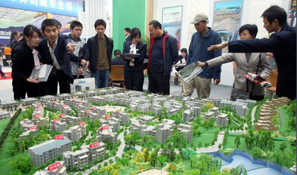

2、对于开发商的情况难以把握。如果开发商在建设过程中因为资金不足使工程停顿；或因技术实力不足造成建设质量的降低；以及在建设过程中擅自变更原来的设计或承诺尤其是对小区的[配套设施](https://baike.baidu.com/item/配套设施)和环境绿化的变更等情况，这些都会给消费者造成巨大的损失。

3、市场的行情和价格难以预测。在购房者与开发商签订合同并付款后，因为市场因素的作用，房价会产生波动。如果涨价则购房者受益；如果跌价则购房者会遭到损失。

> 影响

中国[商品房](https://baike.baidu.com/item/商品房)预售有别于其他国家和地区的特征是：商品房预售附着融资功能，即预售一般收取全部房价款，预售演变成开发企业的主要融资手段。这种做法形成的特定历史背景是[商品房](https://baike.baidu.com/item/商品房/1555) [2]  建设融资渠道不畅。预售融资带来了四方面的问题：削弱了宏观调控能力，不利于保护消费者利益，存在较大的风险隐患，不利于提高[房地产开发企业](https://baike.baidu.com/item/房地产开发企业)的竞争力。 [3] 

> 区别联系

按国家销售“[现房](https://baike.baidu.com/item/现房)”的规定，已经盖好的房子，不等于是“现房”，已经有人入住的房子也不等于是“现房”，而已领[房产证](https://baike.baidu.com/item/房产证)和土地使用证的房子才叫“现房”。现房是指开发商已办妥所售项目的《房地产权证》的[商品房](https://baike.baidu.com/item/商品房)，即整体竣工并通过验收，购房者在购买现房时签订《[商品房买卖合同](https://baike.baidu.com/item/商品房买卖合同)》，即买即可入住。

现房比期房好卖很多，这是所有玩房地产的人的共同印象。无论怎么选，现房都是拿来就用，投资风险和投资回报周期都远远优于期房，可控性要远远优于期房。频繁的加息也让投资买房的人更关注现房。

而现房比期房好卖的另一大因素则是现房尤其是二手房还有一定数量的小[户型](https://baike.baidu.com/item/户型)，位置也相对较好，交通和周边设施也经过检验。有这样靠谱的房子，干嘛要眼睁睁死盼着期房呢？

所谓期房，是指开发商已经拿到预售许可证，但还没有竣工的房屋。一般情况下，是指房地产开发商从取得商品房预售许可证开始至取得房地产大产权证为止，所出售的商品房称为期房。购房者在购买期房时，应当与开发商签订商品房预售合同。

所谓现房，是指开发商已经进行初始登记并取得大产权证的房屋。一般情况下，是指购房者在购买房屋时便具备即买即可入住的商品房，即开发商已办妥所售商品房大产权的商品房，与购房者签订商品房买卖合同后，立即可以办理入住手续并取得产权证的商品房。

期房和现房的称谓，实际上是根据楼盘建设和销售的不同时段来划分的，因此，随着时间的推移，期房都会转化为现房的。

期房与现房相比较，期房最主要的优势就是价格优势。一般情况下，期房的价格要低于相同条件下的现房价格。这是因为房地产开发商为了减少资金的投人，同时也降低投资风险，要通过降低房价来获得购房者的支持。但是这种价格的差别也是相对的，它取决于将来房价的涨幅情况，当未来房价上涨时，这种价格优势是现实存在的，而当将来房价稳定或者下降时，这种价格优势实际上就不存在了。 [4] 

**总体来说，期房的优势主要在于：**

(1)期房价格低，有些项目期、现价差近10个百分点，对自住者来说划算，对投资者来说有升值空间。

(2)对于开发商而言，滚动开发可降低成本、节省资金。现房开盘，开发商大都不愿意，因为资金投入较大，开发商需要具备较雄厚的实力。因此，当前市场上，期房仍是主流产品。

另外，期房与现房最关键的一个区别就是，期房的投资风险要远远大于现房。因为在期房销售中，房屋是否真地符合你的要求，购房者只能通过售楼书、沙盘、样板间、户型图等开发商提供的资料进行想像。但是在施工进行过程中，可能会出现种种因素导致最终的房屋与购房者预期的房屋不一致。相比之下，现房的风险就要小得多，因为房子是客观存在的，各个方面是否符合你的要求都可以得到实际的检验，无论是房屋的质量还是房屋的产权风险都比期房小得多。 [4] 

> 注意事项

由于许多[商品房](https://baike.baidu.com/item/商品房)的开发是由某一个开发公司进行，而销售则由另一家代理商负责，所以，购此类期房时要看清代理商与开发商有无委托销售协议，有售房协议的才可以放心买。当然，购买信誉好、资金雄厚的开发公司的商品房，一次性付款折扣较多，这样可以享受房屋升值带来的利益。

买[现房](https://baike.baidu.com/item/现房)时，在现场检查质量主要看以下内容：各厅室过道的地面、墙面、顶棚、门窗、各类管线设施、卫生洁具、配套的厨具、预留的电源插座、电话插孔、天线插孔、[水暖](https://baike.baidu.com/item/水暖)煤气的五金件是否有质量问题或设置不合理。对于严重的问题，如裂缝、渗漏，要请售房单位给予解释，如不满意，请专业机构给予鉴定，问题严重，不可修复则可不买或退房。

> 其他国家

**日本**

在日本，只要你获得了项目的合法建筑许可，不管你是否开工都可以预售，预售的时候签定合同，购房者交付[定金](https://baike.baidu.com/item/定金)，一般是10%左右，这个房子交付的时候购房者交付余款，不像中国的开发商一下就拿到钱了。

在韩国的情况是有样板间就可以销售了，首付款是总房款的20%到30%的样子，而且是一年内[分期付款](https://baike.baidu.com/item/分期付款)，也可以申请[按揭](https://baike.baidu.com/item/按揭)付款。


**英国**

在英国新房和二手房都是一样的，一般通过代理机构来办理，对是否开工没有什么限制的规定，而且英国还有一个特点，期房的价格要比[现房](https://baike.baidu.com/item/现房)便宜20%左右，另外购房者可以获得[按揭贷款](https://baike.baidu.com/item/按揭贷款)。


**美国**

美国的情况更具有代表性，美国的销售数量是仅次于中国的，但是他们的[期房预售](https://baike.baidu.com/item/期房预售)占的比例很高，占到75%，所以我们可以看到预售在一些国家，包括发达国家还是[商品房](https://baike.baidu.com/item/商品房)销售的主要手段，因此可以说中国采取的预售方式是与国际市场的主流销售模式是吻合的，但是国际上的预售制度是有保证的，他们要求开发商把预付款交到银行里，对于信誉好的企业就不需要这样了，另外在支付保证金以后，购房者可以申请银行贷款，一般是房价的70%。


**新加坡**

在新加坡购买期房，签订正式购房合同之后首期只需支付20%的款项，其余款项根据施工进度分10期支付，而且在签订正式购房合同之后便可获得最高80%的银行贷款。所有房地产交易款项必须存入由政府和发展商共同监管的账户，由政府按照项目的进展支付给开发商。因为所签订的购买合同必须使用政府规定的标准格式，需要开发商去政府部门进行申请，并经过双方的律师的认可后才可以进行签订。

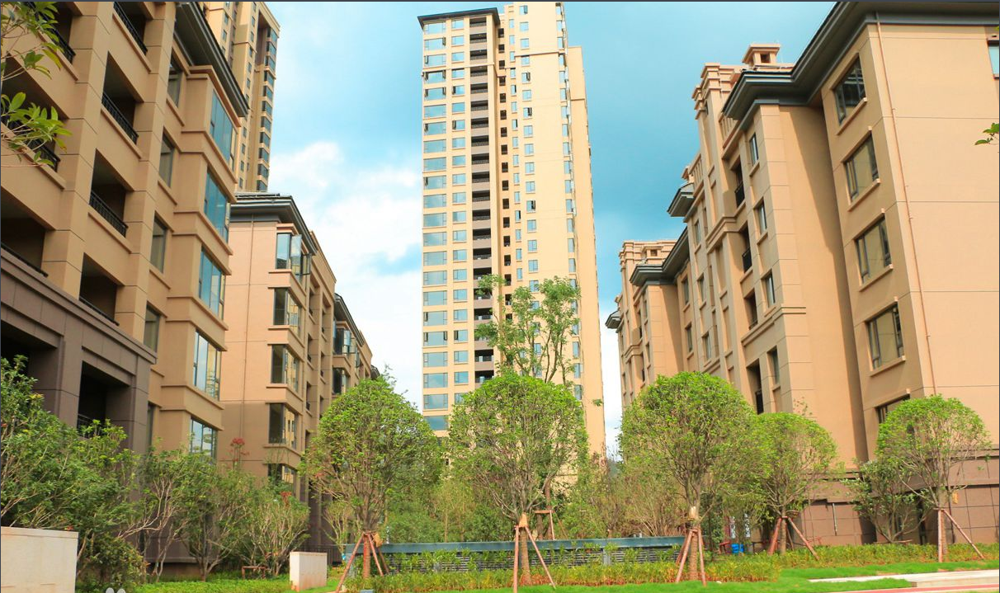

