### React v16.9  H5 template

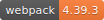  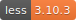 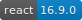  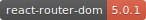

[TOC]

#### 1、前言

本项目适用于==移动端H5==混合开发的==React项目==，功能包括：

1. 采用VW，==字体自动适配==，默认按照UI设计稿==750*1334==（webpack里可以配置UI稿原始尺寸）上下适配各种手机设备;

2. 自动生成 ==sprite== 雪碧图和相关 ==sprite.less== ，无需手动创建雪碧图和手写less;

3. ==webpack4最新构建==，分离压缩代码、去除重复引用的css代码、开发环境生成sourceMap方便调试、生产环境移除console.log打印信息等构建，并生成相关==gz包==，优化页面资源加载;

4. 基于原生API ==Fetch封装 dataService 服务==，统一格式进行相关接口的GET, POST请求;

5. 统一封装中间拦截组件 ==FetchData.jsx==, 进行组件数据预加载和状态注入；

6. ==React router components== 进行 ==lazing load 懒加载==, 带有==组件预加载loading==和==加载失败error提示==，增加页面友好提示，性能也更加优化；

7. bebel7 相关配置；

8. 配置==liveServer==对生成的PROD生产环境代码，进行预先运行检查；

9. css图片相关优化，css文件生产环境自动分离；

10. 采用==browserHistory==路由模式，相关本地环境配置已经自动配置（上线时，需要在服务器配置==nginx==）

11. ==自动生成==文件夹保存当前打包生成的==tar包==, 防止线上部署失败; 有备份的话可以回滚之前的代码版本；

12. ==如果抛却相关app h5设置，可当作 PC 项目，兼容 ie9+==;

13. 增加==手机端调试面板==，功能相当于打开 PC 控制台，可以很方便地查看 console, network, cookie, localStorage 等关键调试信息；

14. 增加手势库，例如拖动（Pan）,缩放（Pinch）,旋转（Rotate）,滑动（swipe）；

15. 增加==Sentry监控代码异常错误上报==，访问 https://f5fe3d6e599849bfa1d1f0c26d1c3213@sentry.io/1729437，查看报错日志:

16. Bundle构建完成提醒和生成==Bundle分析报告report==

    


------

#### 2、命令行

> Local Server:

```shell
yarn dev 
#or
npm run dev
```

> build bundle：

```shell
yarn build
#or
npm run build
```

> 生成 tar 包
> 
```shell
# 默认生产 cdn.tar.gz
yarn tar
#or
npm run tar

# 可以自定义tar包名
yarn tar react
#or
npm run tar react
```

> 测试打包后要上线的代码：

```shell
yarn start
#or
npm run start
```

#### 3、修改UI稿尺寸原始匹配大小

> webpack.config.js

```javascript
{
    test: /\.less$/,
        use: [
            isProduction ? MiniCssExtractPlugin.loader : 'style-loader',
            'css-loader',
            'less-loader',
            // 配置相关移动端 VW 布局
            {
                loader: 'postcss-less-loader',
                options: {
                    ident: 'postcss',
                    plugins: () => [
                        postcssPxToViewport({
                            viewportWidth: 750, // (Number) The width of the viewport.
                            viewportHeight: 1334, // (Number) The height of the viewport.
                            unitPrecision: 3, // (Number) The decimal numbers to allow the REM units to grow to.
                            viewportUnit: 'vw', // (String) Expected units.
                            selectorBlackList: ['.ignore', '.hairlines'], // (Array) The selectors to ignore and leave as px.
                            minPixelValue: 1, // (Number) Set the minimum pixel value to replace.
                            mediaQuery: false // (Boolean) Allow px to be converted in media queries.
                        })
                    ]
                }
            }
        ]
}
```

#### 4、如何==自动生成雪碧图==

> icon格式需要是`png`, 把需要生成雪碧图的小icon放置在目录`src/assets/icons`下面，然后执行`yarn build`，就可以在`src\less\sprite.less`下去找自己的图标ICON的`className`;比如：

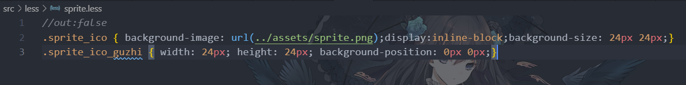

使用的时候，直接引入 `sprite_ico  sprite_ico_guzhi`即可；无需配置引入`sprite.less`文件；

```html
<span className="sprite_ico sprite_ico_guzhi"></span>
```

#### 5、React 书写规范

React 组件必须首字母大写，其他请参考官网

#### 6、当前文件目录解读

```json
cdn    --------------构建后的资源
public --------------静态资源
src    --------------所有React资源
	actions --------------- 相关action
	assets  --------------- 所有静态图片资源
	components ------------ 公共组件
	dataService-----------  请求服务
	less ------------------ less文件
	pages ----------------- 所有入口文件下的子文件
	reducers -------------- reducer
	router ---------------- 路由设置
	store ----------------- 状态存储
	utils ----------------- 公共方法
	.....其余都是App.jsx login.jsx等入口文件
tar    --------------构建备份的tar
....
```

#### 7、==sentry异常代码监控==

> index.html

```javascript
<script src="https://cdn.ravenjs.com/3.26.4/raven.min.js" crossorigin="anonymous"></script>
// 代码错误监控            Raven.config('https://f5fe3d6e599849bfa1d1f0c26d1c3213@sentry.io/1729437').install();
```

添加 ==React ErrorBoundary== 组件，具体可以参考[官方文档](https://reactjs.org/docs/error-boundaries.html) ：

```react
import React from 'react';

import oops from "@assets/oops.png";

// catch JavaScript errors anywhere in their child component tree, log those errors, and display a fallback UI
class ErrorBoundary extends React.Component {
    constructor(props) {
        super(props);
        this.state = { error: null };
    }

    componentDidCatch(error, errorInfo) {
        this.setState({ error });
        Raven.captureException(error, { extra: errorInfo });
    }

    render() {
        if (this.state.error) {
            //render fallback UI
            return (
                <div className="snap" onClick={() => Raven.lastEventId() && Raven.showReportDialog()}>
                    
                    <p>We're sorry — something's gone wrong.</p>
                    <p>Our team has been notified, but click here fill out a report.</p>
                </div>
            );
        } else {
            //when there's not an error, render children untouched
            return this.props.children;
        }
    }
}

export default ErrorBoundary;

```

此时如果我们现在故意改错一些东西，则会提示 ==fallback UI==：

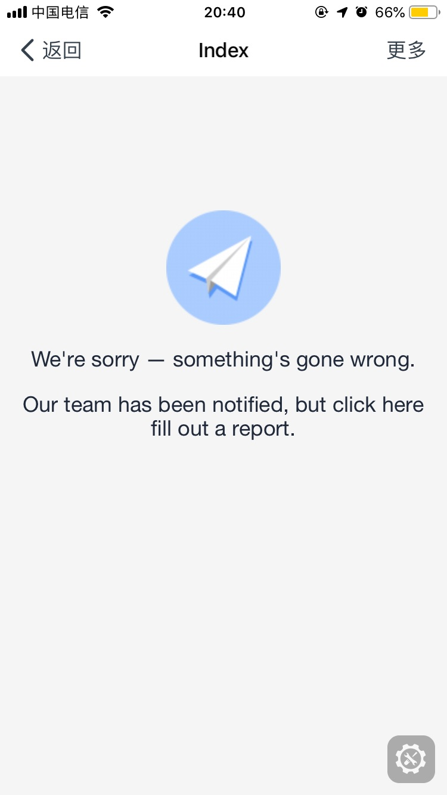

==点击文字，用户可以主动发一个 issue 给我们==：

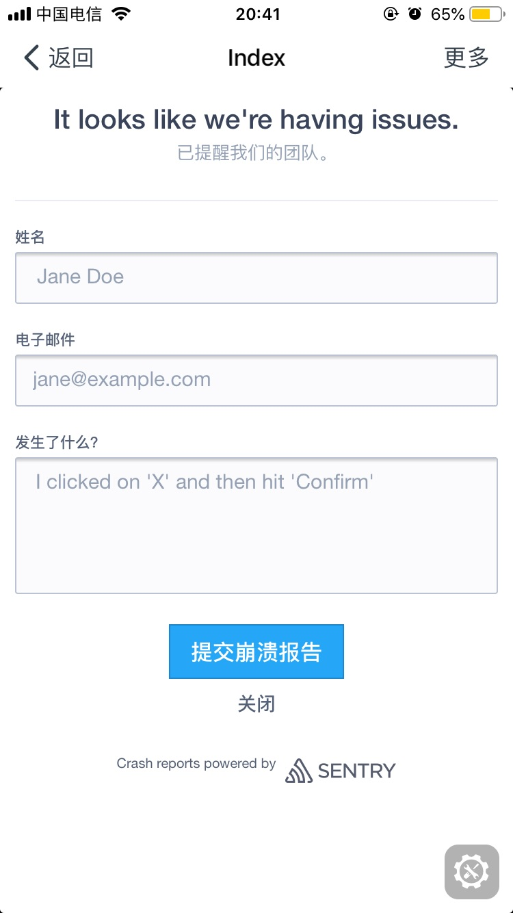

目前报错信息会上传到 [https://sentry.io](https://f5fe3d6e599849bfa1d1f0c26d1c3213@sentry.io/1729437)，也可以创建自己的==私服==；

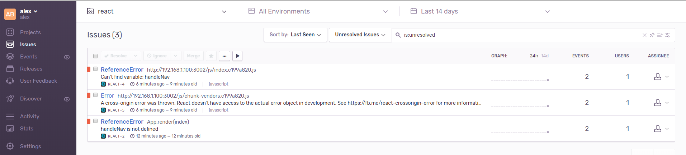

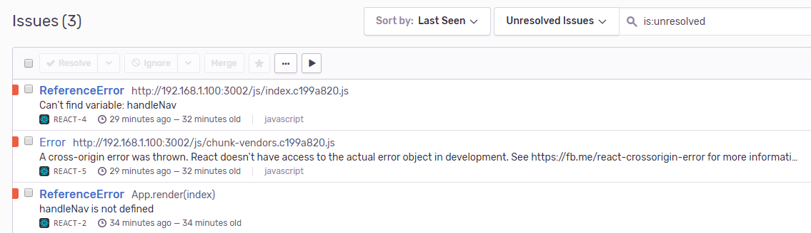

#### 8、==eruda手机端调试面板==

> index.html

```javascript
//在手机端进行查看控制台相关资源
(function () {
    //推荐 CDN 加载
    const src = 'https://cdn.jsdelivr.net/npm/eruda@1.5.8/eruda.min.js';
    // var src = 'node_modules/eruda/eruda.min.js';
    if (!/debug=true/.test(window.location) && localStorage.getItem('debug') != 'true') return;
    document.write('<scr' + 'ipt src="' + src + '"></scr' + 'ipt>');
    document.write('<scr' + 'ipt>eruda.init();</scr' + 'ipt>');
})();
```

启动项目后，访问 http://192.168.1.100:3002/?debug=true , 在手机上如图：

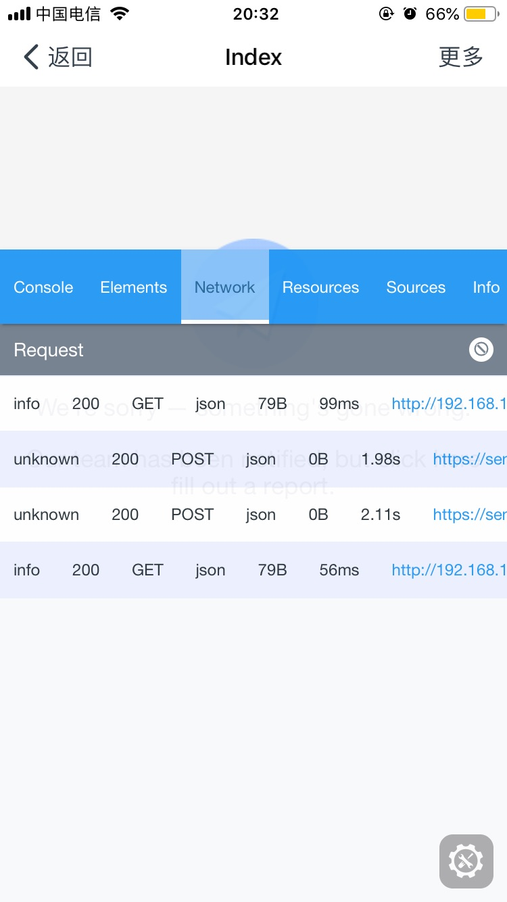

#### 9、==hammer手势库==

```html
<script src="https://hammerjs.github.io/dist/hammer.js"></script>
```

举例：

```react
import React from 'react';

class HammerPan extends React.Component {
    render() {
        return <div className="myElement">888</div>;
    }

    componentDidMount() {
        const myElement = document.querySelector('.myElement');
        // create a simple instance
        // by default, it only adds horizontal recognizers
        const mc = new Hammer(myElement);

        // let the pan gesture support all directions.
        // this will block the vertical scrolling on a touch-device while on the element
        mc.get('pan').set({ direction: Hammer.DIRECTION_ALL });

        // listen to events...
        mc.on('panleft panright panup pandown tap press', ev => {
            myElement.textContent = ev.type + ' gesture detected.';
        });
    }
}

export default HammerPan;

```

启动项目后，访问 http://192.168.1.100:3002/pan，即可查看

#### 10、生成分析报告==Report==

```shell
# NPM
npm install --save-dev webpack-bundle-analyzer
# Yarn
yarn add -D webpack-bundle-analyzer
```

```javascript
const BundleAnalyzerPlugin = require('webpack-bundle-analyzer').BundleAnalyzerPlugin;

module.exports = {
  plugins: [
    new BundleAnalyzerPlugin()
  ]
}
```

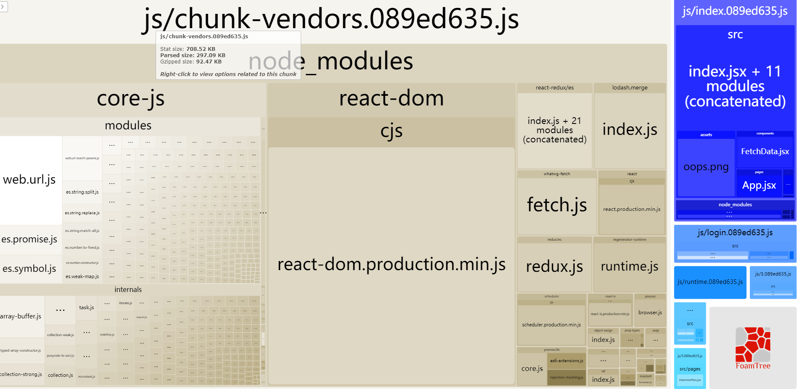

#### 11、bundle生成tar包，并备份

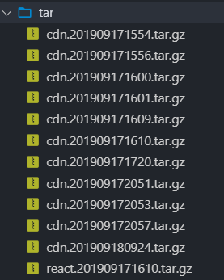

> package.json

```json
"scripts": {
        "dev": "webpack-dev-server --mode development",
        "build": "bash ./rm.sh && webpack --mode production --profile --json > stats.json && yarn tar",
        "start": "node ./server.js",
        "tar": "bash ./tar.sh"
    }
```

