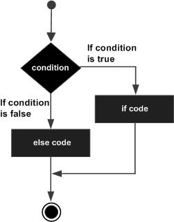

### Java - Decision making

**判断语句**

[TOC]


| NO.  | statement           |
| ---- | ------------------- |
| 1    | if statement        |
| 2    | if...else statement |
| 3    | nested if statement |
| 4    | switch statement    |

#### if statement


#### if...else statement



#### switch statement


**Example**


```java
public class Main {
    public static void main(String[] args) {
        // if
        boolean test1 = true;
        if (test1) {
            System.out.println("test1 true");
        }

        // if...else
        boolean test2 = false;
        if (test2) {
            System.out.println("test2 true");
        } else {
            System.out.println("test2 false");
        }

        // nested if
        boolean test3 = true;
        String test_3 = "3";
        if (test3) {
            if (test_3.equals("3")) {
                System.out.println("test3 passed");
            }
        }

        // switch statement

        char grade = 'A';
        switch (grade) {
            case 'A':
                System.out.println("Excellent");
                break;
            case 'B':
            case 'C':
                System.out.println("well done");
                break;
            default:
                System.out.println("invaild grade");
        }
        System.out.println("test4 is " + grade);
    }
}
```

**Output**

```java
test1 true
test2 false
test3 passed
Excellent
test4 is A
```

