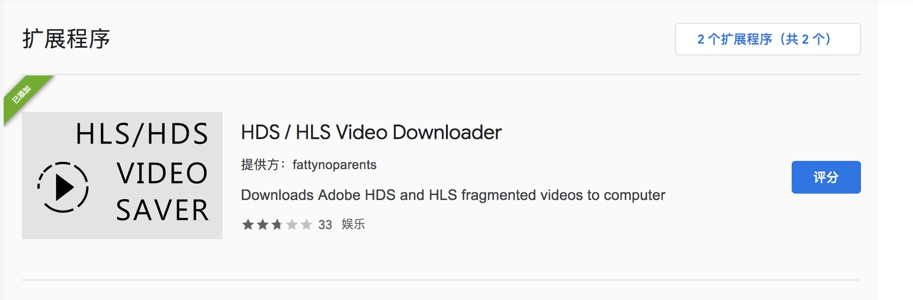
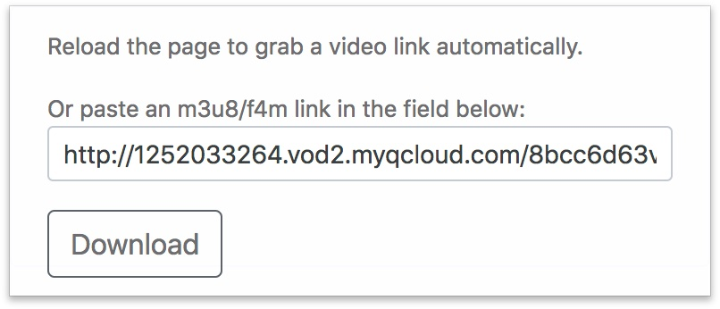
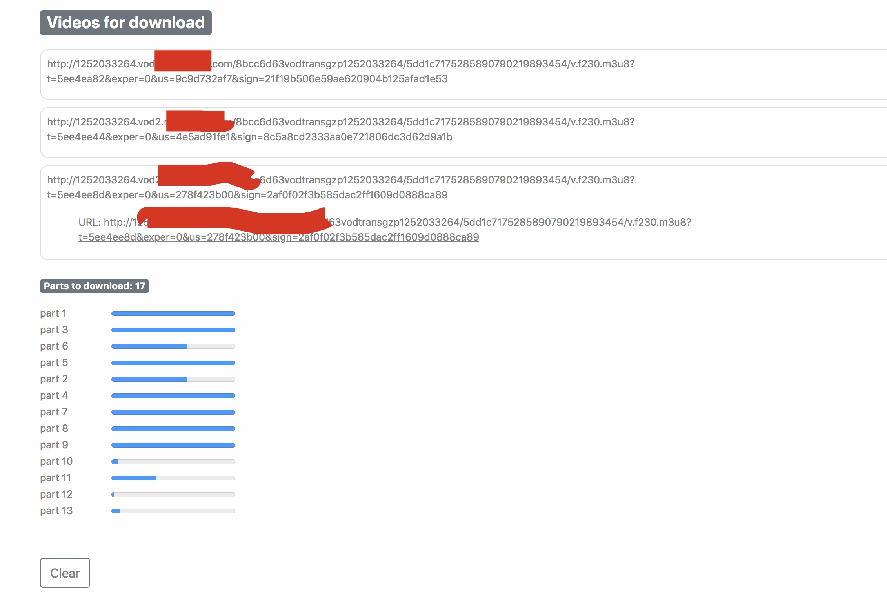
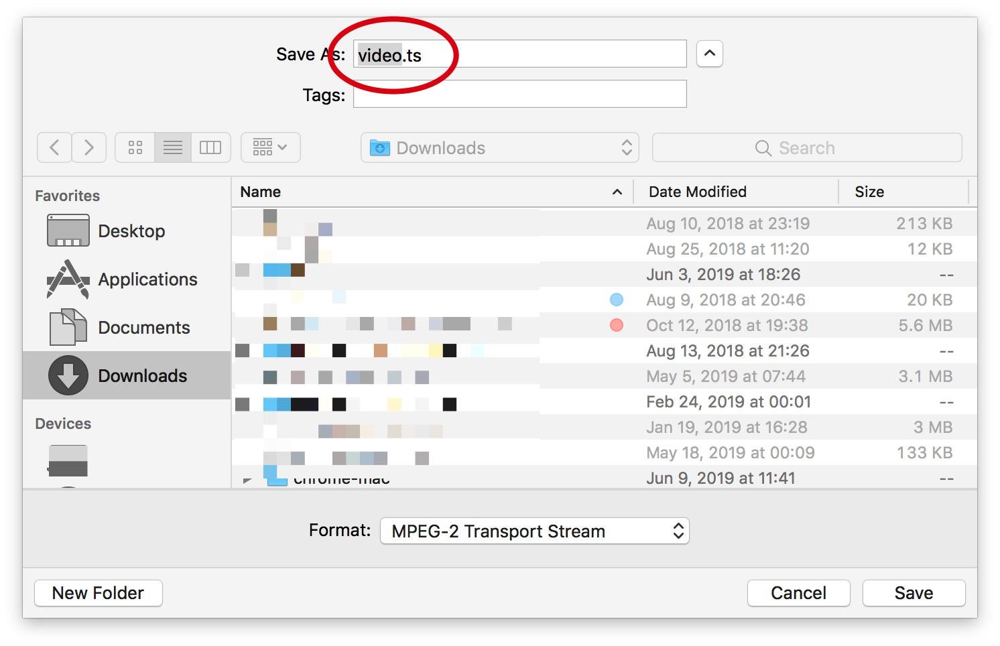
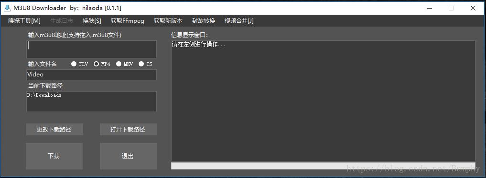
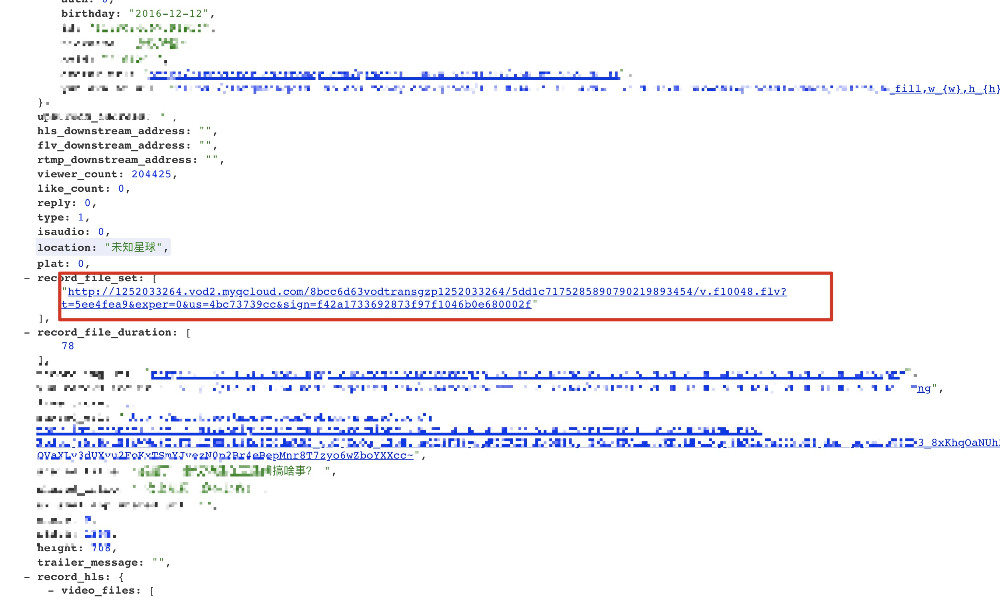

### 关于如何下载经过处理后Video带有的Blob URL的视频

我们如果使用爬虫，想爬取一些视频的时候，会发现一些网站提供的视频链接打开是 404；

```html
<video id="av-player0_html5_api" class="emav-tech js-evernote-checked" preload="meta" tabindex="-1" src="blob:http://******/8587a0ef-ef44-4dba-8f76-e134b9624772" data-evernote-id="1968"></video>
```

如上图`HTML`结构，`video` 里面的 `src` 地址格式：`blob:http://******/8587a0ef-ef44-4dba-8f76-e134b9624772`。

一些网站的视频为了`防止下载`，通常会采用`blob`加密的做法；

其实这不是特殊的视频传输协议，只是一种 `HTML5 Video Blob`格式。

并且大部分网页视频的格式都是 m3u8。

#### 1、利用Chrome 浏览器插件





刷新当前页面，插件就会自动获取后缀为`.m3u8`的地址：

`http://**.***.com/8bcc6d63vodtransgzp1252033264/5dd1c7175285890790219893454/v.f230.m3u8?t=5ee4ea82&exper=0&us=9c9d732af7&sign=21f19b506e59ae620904b125afad1e53`

点击`Download`, 进入下面的也没，点击链接，会开始进行解析：





最后生成`ts`格式的视频，同样可以打开。

#### 2、第二种方法 找到 `m38u` 文件, 使用 `window `下载工具 `M3U8下载工具`

打开chrome开发者工具，审查`Network - XHR` 搜索 `m38u`, 这样也找到了链接：



3、审查 下载的 JS 资源：



这样就找到了 `flv` 格式的视频。

