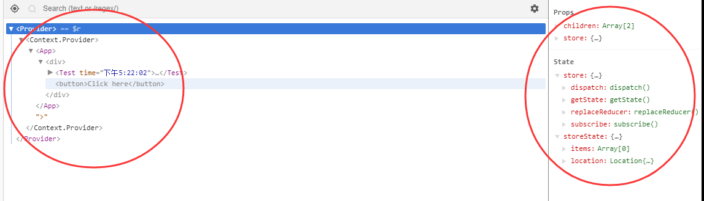
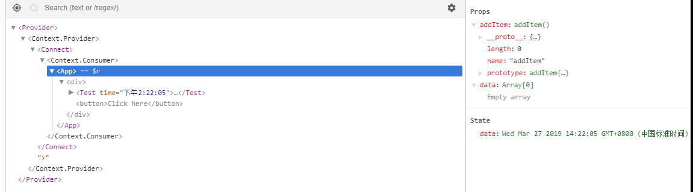

Redux
-----

虽然是react的一个状态管理库，可以单独使用，接下来我们详细讲解下底层代码。

废话不多讲，先说下基本的知识点。

### `Actions` ###

`actions` 是通过 `store.dispatch(action)`改变 `state`的唯一方法，不能直接通过 `this.state = {}` 来直接改变 `state`。

生成 `actions` 有两种方式：

> 1、单纯的 `object`

~~~js
const action = {
  type: 'ADD_TODO',
  text: 'Build my first Redux app'
}
dispatch(action)
~~~

> 2、action creator function

~~~js
function addTodo(text) {
  return {
    type: ADD_TODO,
    text
  }
}
dispatch(addTodo())
~~~

### `Reducers` ###

`Actions` 只能描述发生了什么，并不能描述状态发生了什么变化，`Reducers` 指定 `state tree` 将要发生什么。

~~~js
const items = (state = [], action) => {
  switch (action.type) {
    case "ADD_ITEM":
      return [...state, { text: action.text }]
    default:
      return state
  }
}
~~~
这就是单个 `reducer` 的格式，固定两个参数 `state` 和 `action`;

多个`reducers` 是需要使用 `combineReducers`,

~~~js
import {combineReducers} from 'redux';

const items = (state = [], action) => {
  switch (action.type) {
    case "ADD_ITEM":
      return [...state, { text: action.text }]
    default:
      return state
  }
}

export default combineReducers({
  items
});
~~~

接下来，我们看看 `combineReducers` 里面实现了什么？

### `combineReducers` ###

~~~js

function combineReducers(reducers) {
  // 多个reducer
  var reducerKeys = Object.keys(reducers);
  // 最终的 reducers
  var finalReducers = {};

  for (var i = 0; i < reducerKeys.length; i++) {
    var key = reducerKeys[i];

    if (process.env.NODE_ENV !== 'production') {
      if (typeof reducers[key] === 'undefined') {
        warning("No reducer provided for key \"" + key + "\"");
      }
    }

    if (typeof reducers[key] === 'function') {
      finalReducers[key] = reducers[key];
    }
  }

  var finalReducerKeys = Object.keys(finalReducers);
  var unexpectedKeyCache;

  if (process.env.NODE_ENV !== 'production') {
    unexpectedKeyCache = {};
  }

  var shapeAssertionError;

  try {
    //只是验证一下语法是否有错误
    assertReducerShape(finalReducers);
  } catch (e) {
    shapeAssertionError = e;
  }
  
  
  //返回一个 function(state, action){}
  // dispatch 会调用这里的 function
  return function combination(state, action) {
    if (state === void 0) {
      state = {};
    }

    if (shapeAssertionError) {
      throw shapeAssertionError;
    }

    if (process.env.NODE_ENV !== 'production') {
      var warningMessage = getUnexpectedStateShapeWarningMessage(state, finalReducers, action, unexpectedKeyCache);

      if (warningMessage) {
        warning(warningMessage);
      }
    }

    var hasChanged = false;
    var nextState = {};

    for (var _i = 0; _i < finalReducerKeys.length; _i++) {
      var _key = finalReducerKeys[_i];
      //当前 key 的 reducer
      var reducer = finalReducers[_key];
      // 当前 key 的 state
      var previousStateForKey = state[_key];
      // 即将改变后的当前key 的 state
      var nextStateForKey = reducer(previousStateForKey, action);

      if (typeof nextStateForKey === 'undefined') {
        var errorMessage = getUndefinedStateErrorMessage(_key, action);
        throw new Error(errorMessage);
      }
      // 当前 reducer 的名字作为 key 保存在 state
      // 所以 当前例子 items 会变成 state.items = []
      nextState[_key] = nextStateForKey;
      // 判断状态是否发生改变，当下一个状态不等于上一个状态，标识状态已改变
      hasChanged = hasChanged || nextStateForKey !== previousStateForKey;
    }
    
    // 返回 state
    return hasChanged ? nextState : state;
  };
}

~~~

### `Store` ###

`store`是什么？ `store` 是把 `Actions` 和 `Reducers` 通过`createStore`结合起来的一个`Object`。

打印一下：
~~~js
Store: {
  getState,
  dispatch,
  subscribe
  replaceReducer,
}
~~~

### `createStore(reducer, preloadState, enhancer)` ###

~~~js

/**
 * Creates a Redux store that holds the state tree.
 * The only way to change the data in the store is to call `dispatch()` on it.
 *
 * There should only be a single store in your app. To specify how different
 * parts of the state tree respond to actions, you may combine several reducers
 * into a single reducer function by using `combineReducers`.
 *
 * @param {Function} reducer A function that returns the next state tree, given
 * the current state tree and the action to handle.
 *
 * @param {any} [preloadedState] The initial state. You may optionally specify it
 * to hydrate the state from the server in universal apps, or to restore a
 * previously serialized user session.
 * If you use `combineReducers` to produce the root reducer function, this must be
 * an object with the same shape as `combineReducers` keys.
 *
 * @param {Function} [enhancer] The store enhancer. You may optionally specify it
 * to enhance the store with third-party capabilities such as middleware,
 * time travel, persistence, etc. The only store enhancer that ships with Redux
 * is `applyMiddleware()`.
 *
 * @returns {Store} A Redux store that lets you read the state, dispatch actions
 * and subscribe to changes.
 */
export default function createStore(reducer, preloadedState, enhancer) {
  if (
    (typeof preloadedState === 'function' && typeof enhancer === 'function') ||
    (typeof enhancer === 'function' && typeof arguments[3] === 'function')
  ) {
    throw new Error(
      'It looks like you are passing several store enhancers to ' +
        'createStore(). This is not supported. Instead, compose them ' +
        'together to a single function'
    )
  }

  if (typeof preloadedState === 'function' && typeof enhancer === 'undefined') {
    enhancer = preloadedState
    preloadedState = undefined
  }

  if (typeof enhancer !== 'undefined') {
    if (typeof enhancer !== 'function') {
      throw new Error('Expected the enhancer to be a function.')
    }

    return enhancer(createStore)(reducer, preloadedState)
  }

  if (typeof reducer !== 'function') {
    throw new Error('Expected the reducer to be a function.')
  }

  let currentReducer = reducer
  let currentState = preloadedState
  let currentListeners = []
  let nextListeners = currentListeners
  let isDispatching = false

  function ensureCanMutateNextListeners() {
    if (nextListeners === currentListeners) {
      nextListeners = currentListeners.slice()
    }
  }

  /**
   * Reads the state tree managed by the store.
   *
   * @returns {any} The current state tree of your application.
   */
  function getState() {
    if (isDispatching) {
      throw new Error(
        'You may not call store.getState() while the reducer is executing. ' +
          'The reducer has already received the state as an argument. ' +
          'Pass it down from the top reducer instead of reading it from the store.'
      )
    }

    return currentState
  }

  /**
   * Adds a change listener. It will be called any time an action is dispatched,
   * and some part of the state tree may potentially have changed. You may then
   * call `getState()` to read the current state tree inside the callback.
   *
   * You may call `dispatch()` from a change listener, with the following
   * caveats:
   *
   * 1. The subscriptions are snapshotted just before every `dispatch()` call.
   * If you subscribe or unsubscribe while the listeners are being invoked, this
   * will not have any effect on the `dispatch()` that is currently in progress.
   * However, the next `dispatch()` call, whether nested or not, will use a more
   * recent snapshot of the subscription list.
   *
   * 2. The listener should not expect to see all state changes, as the state
   * might have been updated multiple times during a nested `dispatch()` before
   * the listener is called. It is, however, guaranteed that all subscribers
   * registered before the `dispatch()` started will be called with the latest
   * state by the time it exits.
   *
   * @param {Function} listener A callback to be invoked on every dispatch.
   * @returns {Function} A function to remove this change listener.
   */
  function subscribe(listener) {
    if (typeof listener !== 'function') {
      throw new Error('Expected the listener to be a function.')
    }

    if (isDispatching) {
      throw new Error(
        'You may not call store.subscribe() while the reducer is executing. ' +
          'If you would like to be notified after the store has been updated, subscribe from a ' +
          'component and invoke store.getState() in the callback to access the latest state. ' +
          'See https://redux.js.org/api-reference/store#subscribe(listener) for more details.'
      )
    }

    let isSubscribed = true

    ensureCanMutateNextListeners()
    
    // 保存监听 回调函数 等 dispatch 时候 统一执行
    nextListeners.push(listener)

    return function unsubscribe() {
      if (!isSubscribed) {
        return
      }

      if (isDispatching) {
        throw new Error(
          'You may not unsubscribe from a store listener while the reducer is executing. ' +
            'See https://redux.js.org/api-reference/store#subscribe(listener) for more details.'
        )
      }

      isSubscribed = false

      ensureCanMutateNextListeners()
      const index = nextListeners.indexOf(listener)
      nextListeners.splice(index, 1)
    }
  }

  /**
   * Dispatches an action. It is the only way to trigger a state change.
   *
   * The `reducer` function, used to create the store, will be called with the
   * current state tree and the given `action`. Its return value will
   * be considered the **next** state of the tree, and the change listeners
   * will be notified.
   *
   * The base implementation only supports plain object actions. If you want to
   * dispatch a Promise, an Observable, a thunk, or something else, you need to
   * wrap your store creating function into the corresponding middleware. For
   * example, see the documentation for the `redux-thunk` package. Even the
   * middleware will eventually dispatch plain object actions using this method.
   *
   * @param {Object} action A plain object representing “what changed”. It is
   * a good idea to keep actions serializable so you can record and replay user
   * sessions, or use the time travelling `redux-devtools`. An action must have
   * a `type` property which may not be `undefined`. It is a good idea to use
   * string constants for action types.
   *
   * @returns {Object} For convenience, the same action object you dispatched.
   *
   * Note that, if you use a custom middleware, it may wrap `dispatch()` to
   * return something else (for example, a Promise you can await).
   */
  function dispatch(action) {
    if (!isPlainObject(action)) {
      throw new Error(
        'Actions must be plain objects. ' +
          'Use custom middleware for async actions.'
      )
    }

	 // 这里说明 actions 必须包含 type 否则报错
    if (typeof action.type === 'undefined') {
      throw new Error(
        'Actions may not have an undefined "type" property. ' +
          'Have you misspelled a constant?'
      )
    }

	 // 一次只能分派一个action
    if (isDispatching) {
      throw new Error('Reducers may not dispatch actions.')
    }

    try {
      // dispatch分配时候，设置标识
      isDispatching = true
      // 使用 combination(state, action) 获取当前 state
      currentState = currentReducer(currentState, action)
    } finally {
      // 执行完毕 设置 false
      isDispatching = false
    }

	 /**
	 * 这里的 listeners 是 subcribe 订阅的 callback
	 * 所以每次 dispatch , 都会触发 订阅的 callback
 	 */ 
    const listeners = (currentListeners = nextListeners)
    for (let i = 0; i < listeners.length; i++) {
      const listener = listeners[i]
      listener()
    }

    return action
  }

  /**
   * Replaces the reducer currently used by the store to calculate the state.
   *
   * You might need this if your app implements code splitting and you want to
   * load some of the reducers dynamically. You might also need this if you
   * implement a hot reloading mechanism for Redux.
   *
   * @param {Function} nextReducer The reducer for the store to use instead.
   * @returns {void}
   */
  function replaceReducer(nextReducer) {
    if (typeof nextReducer !== 'function') {
      throw new Error('Expected the nextReducer to be a function.')
    }

    currentReducer = nextReducer
    dispatch({ type: ActionTypes.REPLACE })
  }

  /**
   * Interoperability point for observable/reactive libraries.
   * @returns {observable} A minimal observable of state changes.
   * For more information, see the observable proposal:
   * https://github.com/tc39/proposal-observable
   */
  function observable() {
    const outerSubscribe = subscribe
    return {
      /**
       * The minimal observable subscription method.
       * @param {Object} observer Any object that can be used as an observer.
       * The observer object should have a `next` method.
       * @returns {subscription} An object with an `unsubscribe` method that can
       * be used to unsubscribe the observable from the store, and prevent further
       * emission of values from the observable.
       */
      subscribe(observer) {
        if (typeof observer !== 'object' || observer === null) {
          throw new TypeError('Expected the observer to be an object.')
        }

        function observeState() {
          if (observer.next) {
            observer.next(getState())
          }
        }

        observeState()
        const unsubscribe = outerSubscribe(observeState)
        return { unsubscribe }
      },

      [$$observable]() {
        return this
      }
    }
  }

  // When a store is created, an "INIT" action is dispatched so that every
  // reducer returns their initial state. This effectively populates
  // the initial state tree.
  dispatch({ type: ActionTypes.INIT })

  return {
    dispatch,
    subscribe,
    getState,
    replaceReducer,
    [$$observable]: observable
  }
}
~~~

这里的`createStroe`,在新建`store`的时候，会默认执行 

~~~js
dispatch({ type: ActionTypes.INIT })
~~~

然后执行,

~~~js
currentState = currentReducer(currentState, action)
~~~

这里的 `currentReducer` 就是 `createStrore(reducer)` 里面的参数 `reducer`, 也就是`combineReducers` 函数的返回函数 `combination(state, action)`, 让我们再回顾一下 `combination` 里面说的什么；

### `combination(state, action)`

~~~js

function combination(state, action) {
	// 设置 state = {}
	if (state === void 0) {
	  state = {};
	}
	
	if (shapeAssertionError) {
	  throw shapeAssertionError;
	}
	
	// 错误提示
	if (process.env.NODE_ENV !== 'production') {
	  var warningMessage = getUnexpectedStateShapeWarningMessage(state, finalReducers, action, unexpectedKeyCache);
	
	  if (warningMessage) {
	    warning(warningMessage);
	  }
	}
	
	var hasChanged = false;
	var nextState = {};// 设置下一状态
	   
	/**
	* 例子中有两个 reducer (items, location)
	* const items = (state = [], action) => {
		  switch (action.type) {
		    case "ADD_ITEM":
		      return [...state, { text: action.text }]
		    default:
		      return state
		  }
	  }
	* const location = (state = window.location, action) => state;
	* 
	* combineReducers({items, location})
	* 此时的 finalReducerKeys = [items, location]
	* finalReducers={
		 items: function items(){},
		 location: function location()
	  }
	  
	* 实现过程：
	* 
	* loop 1:
	* 	_key = items;
	* 	reducer = function items(){}
	*  previousStateForKey = undefined
	*  nextStateForKey = items(undefined, {type: '@@redux/INIT.....'}) = []
	*  nextState = {items: []}
	*  
	* loop 2:
	* 	_key = location;
	*  reducer = function location(){}
	*  previousStateForKey = undefined
	*  nextStateForKey = location(undefined, {type: '@@redux/INIT.....'}) = window.location
	*  nextState = {items: [], location: window.location}
	*  
	*/
	for (var _i = 0; _i < finalReducerKeys.length; _i++) {
	  var _key = finalReducerKeys[_i];
	  var reducer = finalReducers[_key];
	  // 读取 state 里面的上一个状态
	  var previousStateForKey = state[_key];
	  // 获取 下一个 state 状态 并且 合并数据
	  var nextStateForKey = reducer(previousStateForKey, action);
	
	  if (typeof nextStateForKey === 'undefined') {
	    var errorMessage = getUndefinedStateErrorMessage(_key, action);
	    throw new Error(errorMessage);
	  }
	
	  // 赋值返回 nextState
	  nextState[_key] = nextStateForKey;
	  hasChanged = hasChanged || nextStateForKey !== previousStateForKey;
	}
	
	return hasChanged ? nextState : state;
};
~~~

### `getState()`

`getState` 这个方法就很简单了，只是返回 `currentState`。

### `subscribe(listener)`

订阅这块，就是保持每一个`listener callback` 到 `listeners` 数组里，等到 执行 `dispatch(action)`, 再一个个循环执行。最有意思的就是返回值是一个 `unsubscribe function`, 顾名思义就是解除订阅，用法稍后再说。

### `replaceReducer(nextReducer)`

其实就替换`reducer`, 一般热加载的时候会用到。

Usage with React
----------------

我们大致已经了解了 `store` 了， 但是如何结合 `react` 使用呢？

这里需要了解一下 `react-redux` 提供的 `<Provide />` 组件，这是一个 `container component`, 用例：

~~~js
import React from 'react'
import { render } from 'react-dom'
import { Provider } from 'react-redux'
import { createStore } from 'redux'
import todoApp from './reducers'
import App from './components/App'

const store = createStore(todoApp)

render(
  <Provider store={store}>
    <App />
  </Provider>,
  document.getElementById('root')
)
~~~

### `Provider` ###

~~~js

import React, { Component } from 'react'
import PropTypes from 'prop-types'
import { ReactReduxContext } from './Context'

class Provider extends Component {
  constructor(props) {
    super(props)
    
    // 获取 stroe
    const { store } = props
    this.state = {
      // 当前 state
      storeState: store.getState(),
      store
    }
  }

  componentDidMount() {
    this._isMounted = true
    this.subscribe()
  }

  componentWillUnmount() {
    if (this.unsubscribe) this.unsubscribe()

    this._isMounted = false
  }

  componentDidUpdate(prevProps) {
    if (this.props.store !== prevProps.store) {
      if (this.unsubscribe) this.unsubscribe()

      this.subscribe()
    }
  }

  subscribe() {
    const { store } = this.props

    this.unsubscribe = store.subscribe(() => {
      const newStoreState = store.getState()

      if (!this._isMounted) {
        return
      }

      this.setState(providerState => {
        // If the value is the same, skip the unnecessary state update.
        if (providerState.storeState === newStoreState) {
          return null
        }

        return { storeState: newStoreState }
      })
    })

    // Actions might have been dispatched between render and mount - handle those
    const postMountStoreState = store.getState()
    if (postMountStoreState !== this.state.storeState) {
      this.setState({ storeState: postMountStoreState })
    }
  }

  render() {
    const Context = this.props.context || ReactReduxContext

    return (
      <Context.Provider value={this.state}>
        {this.props.children}
      </Context.Provider>
    )
  }
}

Provider.propTypes = {
  store: PropTypes.shape({
    subscribe: PropTypes.func.isRequired,
    dispatch: PropTypes.func.isRequired,
    getState: PropTypes.func.isRequired
  }),
  context: PropTypes.object,
  children: PropTypes.any
}

export default Provider

~~~

如图:

`Provide` 可以传递 `Store` 给子组件, 但是此时 `<App />`

~~~js
<App />
  props: {}
  state: {}
~~~

如果获取`state` 到 `<App />`呢? 此时我们需要了解一下 `connect`

### `connect` ###

~~~js
function connect(
  mapStateToProps,
  mapDispatchToProps,
  mergeProps,
  {
    pure = true,
    areStatesEqual = strictEqual,
    areOwnPropsEqual = shallowEqual,
    areStatePropsEqual = shallowEqual,
    areMergedPropsEqual = shallowEqual,
    ...extraOptions
  } = {}
) {
  const initMapStateToProps = match(
    mapStateToProps,
    mapStateToPropsFactories,
    'mapStateToProps'
  )
  const initMapDispatchToProps = match(
    mapDispatchToProps,
    mapDispatchToPropsFactories,
    'mapDispatchToProps'
  )
  const initMergeProps = match(mergeProps, mergePropsFactories, 'mergeProps')
  
  /**
  * 默认：
  * connectHOC = connectAdvanced
    mapStateToPropsFactories = defaultMapStateToPropsFactories
    mapDispatchToPropsFactories = defaultMapDispatchToPropsFactories
    mergePropsFactories = defaultMergePropsFactories
    selectorFactory = defaultSelectorFactory
  */
  return connectHOC(selectorFactory, {
    // used in error messages
    methodName: 'connect',

    // used to compute Connect's displayName from the wrapped component's displayName.
    getDisplayName: name => `Connect(${name})`,

    // if mapStateToProps is falsy, the Connect component doesn't subscribe to store state changes
    shouldHandleStateChanges: Boolean(mapStateToProps),

    // passed through to selectorFactory
    initMapStateToProps,
    initMapDispatchToProps,
    initMergeProps,
    pure,
    areStatesEqual,
    areOwnPropsEqual,
    areStatePropsEqual,
    areMergedPropsEqual,

    // any extra options args can override defaults of connect or connectAdvanced
    ...extraOptions
  })
}

~~~

~~~js
// 在子组件
export default connect(
  ((state, ownProps) => {
    return {
      data: state.items
    }
  }),
  (dispatch, ownProps) => {
    return {
      addItem: () => {
        dispatch(addItem(ownProps.name))
      }
    }
  }
)(App);

~~~

`connet(mapStateToProps, mapDispatchToProps, mapProps)(App)` => `connectHoc(App, {...opts})` => `connectAdvanced(App)`

关于 `initMapStateToProps`、`initMapDispatchToProps`、`wrapMapToPropsFunc` 初始化的方法稍微讲解一下

~~~js

function match(arg, factories, name) {
  for (let i = factories.length - 1; i >= 0; i--) {
    const result = factories[i](arg)
    if (result) return result
  }

  return (dispatch, options) => {
    throw new Error(
      `Invalid value of type ${typeof arg} for ${name} argument when connecting component ${
        options.wrappedComponentName
      }.`
    )
  }
}

~~~

### initMapStateToProps ###

~~~js

 mapStateToProps: (state, ownProp)=> {return {state}}
 mapStateToPropsFactories: [whenMapStateToPropsIsFunction, whenMapStateToPropsIsMissing]
 
 //此时mapStateToProps 是个 function, 所以执行 whenMapStateToPropsIsFunction
  
~~~
### `whenMapStateToPropsIsFunction` | `whenMapStateToPropsIsMissing` ###
~~~js
export function whenMapStateToPropsIsFunction(mapStateToProps) {
  return typeof mapStateToProps === 'function'
    ? wrapMapToPropsFunc(mapStateToProps, 'mapStateToProps')
    : undefined
}

export function whenMapStateToPropsIsMissing(mapStateToProps) {
  return !mapStateToProps ? wrapMapToPropsConstant(() => ({})) : undefined
}

// Used by whenMapStateToPropsIsFunction and whenMapDispatchToPropsIsFunction,
// this function wraps mapToProps in a proxy function which does several things:
//
//  * Detects whether the mapToProps function being called depends on props, which
//    is used by selectorFactory to decide if it should reinvoke on props changes.
//
//  * On first call, handles mapToProps if returns another function, and treats that
//    new function as the true mapToProps for subsequent calls.
//
//  * On first call, verifies the first result is a plain object, in order to warn
//    the developer that their mapToProps function is not returning a valid result.
//
export function wrapMapToPropsFunc(mapToProps, methodName) {
  return function initProxySelector(dispatch, { displayName }) {
    const proxy = function mapToPropsProxy(stateOrDispatch, ownProps) {
      return proxy.dependsOnOwnProps
        ? proxy.mapToProps(stateOrDispatch, ownProps)
        : proxy.mapToProps(stateOrDispatch)
    }

    // allow detectFactoryAndVerify to get ownProps
    proxy.dependsOnOwnProps = true

    proxy.mapToProps = function detectFactoryAndVerify(
      stateOrDispatch,
      ownProps
    ) {
      proxy.mapToProps = mapToProps
      //判断是否 带有 props 作为参数
      proxy.dependsOnOwnProps = getDependsOnOwnProps(mapToProps)
      let props = proxy(stateOrDispatch, ownProps)

      if (typeof props === 'function') {
        proxy.mapToProps = props
        proxy.dependsOnOwnProps = getDependsOnOwnProps(props)
        props = proxy(stateOrDispatch, ownProps)
      }

      if (process.env.NODE_ENV !== 'production')
        verifyPlainObject(props, displayName, methodName)

      return props
    }

    return proxy
  }
}
~~~

`wrapMapToPropsFunc` 返回一个 `initProxySelector(dispatch, {displayName}) => proxy(stateOrDispatch, ownProps)`

其余两个不再赘述，有空再讲解。

### `connectAdvanced` ###

~~~js

function connectAdvanced(
 
  selectorFactory,
  // 默认参数
  {
    // the func used to compute this HOC's displayName from the wrapped component's displayName.
    // probably overridden by wrapper functions such as connect()
    getDisplayName = name => `ConnectAdvanced(${name})`,

    // shown in error messages
    // probably overridden by wrapper functions such as connect()
    methodName = 'connectAdvanced',

    // REMOVED: if defined, the name of the property passed to the wrapped element indicating the number of
    // calls to render. useful for watching in react devtools for unnecessary re-renders.
    renderCountProp = undefined,

    // determines whether this HOC subscribes to store changes
    shouldHandleStateChanges = true,

    // REMOVED: the key of props/context to get the store
    storeKey = 'store',

    // REMOVED: expose the wrapped component via refs
    withRef = false,

    // use React's forwardRef to expose a ref of the wrapped component
    forwardRef = false,

    // the context consumer to use
    context = ReactReduxContext,

    // additional options are passed through to the selectorFactory
    ...connectOptions
  } = {}
) {

  /**
  * connectHOC 之前代码 一一对应
  * {
      // used in error messages
      methodName: 'connect',

      // used to compute Connect's displayName from the wrapped component's displayName.
      // connect(App)
      getDisplayName: name => `Connect(${name})`,

      // if mapStateToProps is falsy, the Connect component doesn't subscribe to store state changes
      shouldHandleStateChanges: Boolean(mapStateToProps),

      // passed through to selectorFactory
      initMapStateToProps,
      initMapDispatchToProps,
      initMergeProps,
      pure,
      areStatesEqual,
      areOwnPropsEqual,
      areStatePropsEqual,
      areMergedPropsEqual,

      // any extra options args can override defaults of connect or connectAdvanced
      ...extraOptions
    }
  */
  
  //React.createContext(null)
  const Context = context

  return function wrapWithConnect(WrappedComponent) {
    ....
    
    // 结果是 App
    const wrappedComponentName =
      WrappedComponent.displayName || WrappedComponent.name || 'Component'

    // Connect(App)
    const displayName = getDisplayName(wrappedComponentName)
    
    
    /**
    * 合并 options:
    * 
    * WrappedComponent: ƒ App(props)
      areMergedPropsEqual: ƒ shallowEqual(objA, objB)
      areOwnPropsEqual: ƒ shallowEqual(objA, objB)
      areStatePropsEqual: ƒ shallowEqual(objA, objB)
      areStatesEqual: ƒ strictEqual(a, b)
      displayName: "Connect(App)"
      getDisplayName: ƒ getDisplayName(name)
      initMapDispatchToProps: ƒ initProxySelector(dispatch, _ref)
      initMapStateToProps: ƒ initProxySelector(dispatch, _ref)
      initMergeProps: ƒ ()
      methodName: "connect"
      pure: true
      renderCountProp: undefined
      shouldHandleStateChanges: true
      storeKey: "store"
      wrappedComponentName: "App"  
    */
    const selectorFactoryOptions = {
      ...connectOptions,
      getDisplayName,
      methodName,
      renderCountProp,
      shouldHandleStateChanges,
      storeKey,
      displayName,
      wrappedComponentName,
      WrappedComponent
    }
    
    // true
    const { pure } = connectOptions

    let OuterBaseComponent = Component

    if (pure) {
      OuterBaseComponent = PureComponent
    }

    // 合并 props
    function makeDerivedPropsSelector() {
      let lastProps
      let lastState
      let lastDerivedProps
      let lastStore
      let lastSelectorFactoryOptions
      let sourceSelector

      return function selectDerivedProps(
        state,
        props,
        store,
        selectorFactoryOptions
      ) {
        if (pure && lastProps === props && lastState === state) {
          return lastDerivedProps
        }

        if (
          store !== lastStore ||
          lastSelectorFactoryOptions !== selectorFactoryOptions
        ) {
          lastStore = store
          lastSelectorFactoryOptions = selectorFactoryOptions
          sourceSelector = selectorFactory(
            store.dispatch,
            selectorFactoryOptions
          )
        }

        lastProps = props
        lastState = state

        const nextProps = sourceSelector(state, props)

        lastDerivedProps = nextProps
        return lastDerivedProps
      }
    }

    // 合并 props 到 组件 App 上
    function makeChildElementSelector() {
      let lastChildProps, lastForwardRef, lastChildElement, lastComponent

      return function selectChildElement(
        WrappedComponent,
        childProps,
        forwardRef
      ) {
        if (
          childProps !== lastChildProps ||
          forwardRef !== lastForwardRef ||
          lastComponent !== WrappedComponent
        ) {
          lastChildProps = childProps
          lastForwardRef = forwardRef
          lastComponent = WrappedComponent
          lastChildElement = (
            <WrappedComponent {...childProps} ref={forwardRef} />
          )
        }

        return lastChildElement
      }
    }

    class Connect extends OuterBaseComponent {
      constructor(props) {
        super(props)
        invariant(
          forwardRef ? !props.wrapperProps[storeKey] : !props[storeKey],
          'Passing redux store in props has been removed and does not do anything. ' +
            customStoreWarningMessage
        )
        this.selectDerivedProps = makeDerivedPropsSelector()
        this.selectChildElement = makeChildElementSelector()
        this.indirectRenderWrappedComponent = this.indirectRenderWrappedComponent.bind(
          this
        )
      }

      indirectRenderWrappedComponent(value) {
        // calling renderWrappedComponent on prototype from indirectRenderWrappedComponent bound to `this`
        return this.renderWrappedComponent(value)
      }
      
      // 此时value = {storeState, store} 
      renderWrappedComponent(value) {
        invariant(
          value,
          `Could not find "store" in the context of ` +
            `"${displayName}". Either wrap the root component in a <Provider>, ` +
            `or pass a custom React context provider to <Provider> and the corresponding ` +
            `React context consumer to ${displayName} in connect options.`
        )
        const { storeState, store } = value

        let wrapperProps = this.props
        let forwardedRef

        if (forwardRef) {
          wrapperProps = this.props.wrapperProps
          forwardedRef = this.props.forwardedRef
        }
        
        // 派生混合 props = {dataa: {}, items = {}}
        let derivedProps = this.selectDerivedProps(
          storeState,
          wrapperProps,
          store,
          selectorFactoryOptions
        )
        
        // 植入到 childElement
        return this.selectChildElement(
          WrappedComponent,
          derivedProps,
          forwardedRef
        )
      }

      render() {
        // 这里 ContextToUse == Context
        const ContextToUse =
          this.props.context &&
          this.props.context.Consumer &&
          isContextConsumer(<this.props.context.Consumer />)
            ? this.props.context
            : Context

        return (
          <ContextToUse.Consumer>
            {this.indirectRenderWrappedComponent}
          </ContextToUse.Consumer>
        )
      }
    }

    Connect.WrappedComponent = WrappedComponent
    Connect.displayName = displayName

    if (forwardRef) {
      const forwarded = React.forwardRef(function forwardConnectRef(
        props,
        ref
      ) {
        return <Connect wrapperProps={props} forwardedRef={ref} />
      })

      forwarded.displayName = displayName
      forwarded.WrappedComponent = WrappedComponent
      return hoistStatics(forwarded, WrappedComponent)
    }

    return hoistStatics(Connect, WrappedComponent)
  }
}

~~~

wrapWithConnect 这里最终生成的也是一个`connect组件`。

### 现在我们从头梳理一下整个过程 ###

首先通过 `<Provider></Provider> `包裹 `<App />`,
~~~js
<Provider store={store}>
  <App />
</Provider>
~~~
在 `Provider` 中首先通过`Props` 获取到 `store`,
~~~js
const { store } = props
this.state = {
  storeState: store.getState(),
  store
}
~~~
在`componentDidMount` 之后发布了一个订阅去同步更新 `state.storeState`,
~~~js
subscribe() {
  const { store } = this.props

  this.unsubscribe = store.subscribe(() => {
    const newStoreState = store.getState()

    if (!this._isMounted) {
      return
    }
    //同步更新state 然后同步 context value 更新后代组件
    this.setState(providerState => {
      // If the value is the same, skip the unnecessary state update.
      if (providerState.storeState === newStoreState) {
        return null
      }

      return { storeState: newStoreState }
    })
  })

  // Actions might have been dispatched between render and mount - handle those
  const postMountStoreState = store.getState()
  if (postMountStoreState !== this.state.storeState) {
    this.setState({ storeState: postMountStoreState })
  }
}
~~~
最后重点部分，`state` 是如何下传给后代组件`<App />`,
~~~js
import { ReactReduxContext } from './Context'
render() {
  // this.props.context 显然为空，所以 Context = React.createContext(null)
  const Context = this.props.context || ReactReduxContext

  return (
    <Context.Provider value={this.state}>
       // 后代组件可以通过 value 去获取 state
      {this.props.children}
    </Context.Provider>
  )
}
~~~

此时的`React Dom` 结构是：

~~~js
/**
* Provider:
*   props: {
*     store: {getState, dispatch, replaceReducer, subscribe},
*     chilren: ...
*   }
*   state: {
*     store: {getState, dispatch, replaceReducer, subscribe},
*     storeState: {item, location}
*   }
*   
*/
<Provider>
  /**
  * Context.Provider: 
  *    props:{
  *      children,
  *      value: {store, storeState}
  *    }
  */
  <Context.Provider>
    <App />
  </Context.Provider>
</Provider>
~~~

`Provider`组件的作用到此结束，接下就要说明 `connect` 是如何把 `state` 变成后代组件的 `props`。

首先，需要调用 `connect` 方法把当前组件`<App />` 进行包装处理：

~~~js
export default connect(
  ((state, ownProps) => {
    return {
      data: state.items
    }
  }),
  (dispatch, ownProps) => {
    return {
      addItem: () => {
        dispatch(addItem(ownProps.name))
      }
    }
  }
)(App);
~~~

`connet(mapStateToProps, mapDispatchToProps)(App)`, 最终经过一系列中间过程最终执行的其实就是 `wrapWithConnect`，这时候
~~~js
import { ReactReduxContext } from './Context'
context = ReactReduxContext
~~~

### 注意： ### 

此处的`context`和 `Provider` 里面引用的 `ReactReduxContext` 是同一个，所以该组件将可以和 `Provider` 关联起来，可以获取最近的 `<Context.Provider>` 里面的 `value = {store, storeState}` 值。

### `wrapWithConnect` ###

所以在 `react-redux/src/components/connectAdvanced.js` 中 wrapWithConnect 里面有这样的一个 render:

~~~js

class Connect extends OuterBaseComponent {
  constructor(props) {
    super(props)
    ...
    this.selectDerivedProps = makeDerivedPropsSelector()
    this.selectChildElement = makeChildElementSelector()
    this.indirectRenderWrappedComponent = this.indirectRenderWrappedComponent.bind(
      this
    )
  }

  indirectRenderWrappedComponent(value) {
    // calling renderWrappedComponent on prototype from indirectRenderWrappedComponent bound to `this`
    return this.renderWrappedComponent(value)
  }

  renderWrappedComponent(value) {
    ....
    const { storeState, store } = value

    let wrapperProps = this.props
    let forwardedRef

    if (forwardRef) {
      wrapperProps = this.props.wrapperProps
      forwardedRef = this.props.forwardedRef
    }

    let derivedProps = this.selectDerivedProps(
      storeState,
      wrapperProps,
      store,
      selectorFactoryOptions
    )

    //生成新的组件
    return this.selectChildElement(
      WrappedComponent,
      derivedProps,
      forwardedRef
    )
  }

  render() {
    // 这里明显是 Context 还是刚才的那个 ReactReduxContext
    const ContextToUse =
      this.props.context &&
        this.props.context.Consumer &&
        isContextConsumer(<this.props.context.Consumer />)
        ? this.props.context
        : Context

    return (
      //Context.Consumer 可以绑定 value 到 component function 里面，也就是this.indirectRenderWrappedComponent(value)
      <ContextToUse.Consumer>
        {this.indirectRenderWrappedComponent}
      </ContextToUse.Consumer>
    )
  }
}
~~~

简单看下 `this.indirectRenderWrappedComponent` :

~~~js
//生成新的组件
return this.selectChildElement(
  WrappedComponent,// <App />
  derivedProps,// {data, items}
  forwardedRef
)
~~~

~~~js
function selectChildElement(
  WrappedComponent,
  childProps,
  forwardRef
) {
  if (
    childProps !== lastChildProps ||
    forwardRef !== lastForwardRef ||
    lastComponent !== WrappedComponent
  ) {
    lastChildProps = childProps
    lastForwardRef = forwardRef
    lastComponent = WrappedComponent
    lastChildElement = (
      <WrappedComponent {...childProps} ref={forwardRef} />
    )
  }

  return lastChildElement
}
~~~
前面经过一系列 mapStateToProps 和 mapDispatchToProps 的处理，最终:

~~~js
<WrappedComponent {...childProps} ref={forwardRef} />
也就是
<App {...childProps} ref={forwardRef} />
~~~

到现在为止，`state` 怎么变成 `props` 已经很明显了。

最终 `React Dom` 结构如下：

~~~js

/**
* Provider:
*   props: {
*     store: {getState, dispatch, replaceReducer, subscribe},
*     chilren: ...
*   }
*   state: {
*     store: {getState, dispatch, replaceReducer, subscribe},
*     storeState: {item, location}
*   }
*   
*/
<Provider>
  /**
  * Context.Provider: 
  *    props:{
  *      children,
  *      value: {store, storeState}
  *    }
  */
  <Context.Provider>
    // props: {}
    <Connect>
      // props:{children:bound indirectRenderWrappedComponent()}
      <Context.Consumer>
        // props: {data, items}
        <App />
      </Context.Consumer>
    </Connect>
  </Context.Provider>
</Provider>

~~~

`Redux`暂时完结，以后再详细讲解其中的一些部分。

