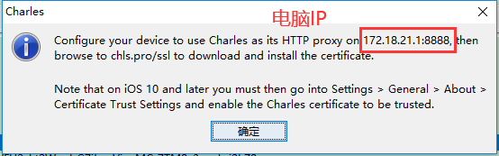

## Charles手机抓包

[TOC]

### 1、前言

Charles是一款代理服务器，通过成为电脑或者浏览器的代理，然后捕获各种网络请求和请求结果达到分析抓包的目的；

一般可用来做抓包分析使用的。

Charles支持：

支持SSL代理。可以截取分析SSL的请求；

支持重发网络请求；

支持修改网络请求参数；

支持网络请求的截获并动态修改；

等等功能。

### 2、下载

[下载地址](https://www.charlesproxy.com/latest-release/download.do)

下载之后完成安装；

注册激活

[Charles授权码在线生成](https://www.charles.ren/)

### 3、手机抓包

#### 3.1、安装证书

> 点击安装手机证书

> 手机和电脑连接同一个局域网，手机端开启HTTP代理

> 手机浏览器输入：chls.pro/ssl

#### 3.2、捕获数据

到此，手机代理配置完成。