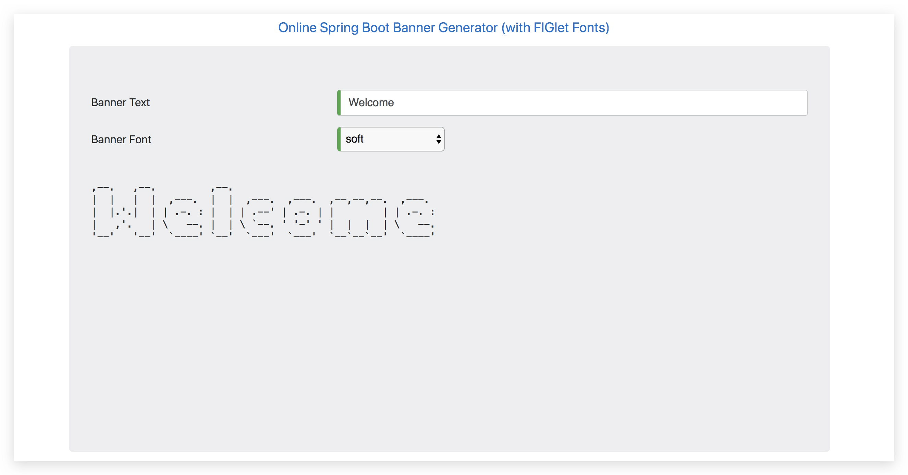
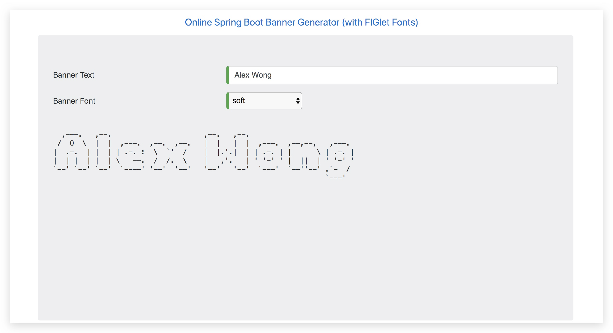

相信很多小伙伴，都喜欢好看的开篇动画。spring boot 默认也提供了一个如此的功能。
我们只要在 `src>resources>banner.txt`， 里面输入任何东西都可以在启动程序的时候在控制台看到；

那如何生成这样的`banner`呢？

有个自动生成banner的网站 [https://devops.datenkollektiv.de/banner.txt/index.html](https://devops.datenkollektiv.de/banner.txt/index.html)

🆗闲话不多说，好了，这一小章到此结束；

代码仓库地址：[点击进入](https://gitee.com/master2011zhao/knowledge)