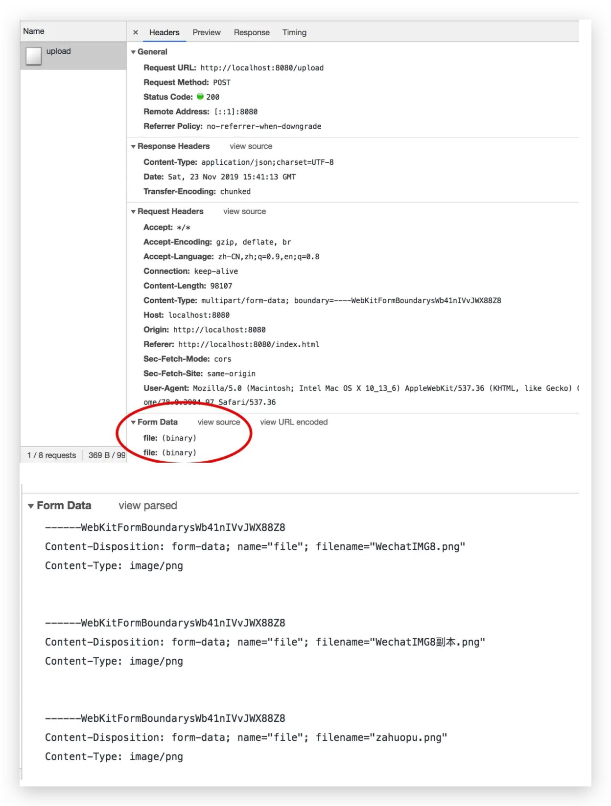
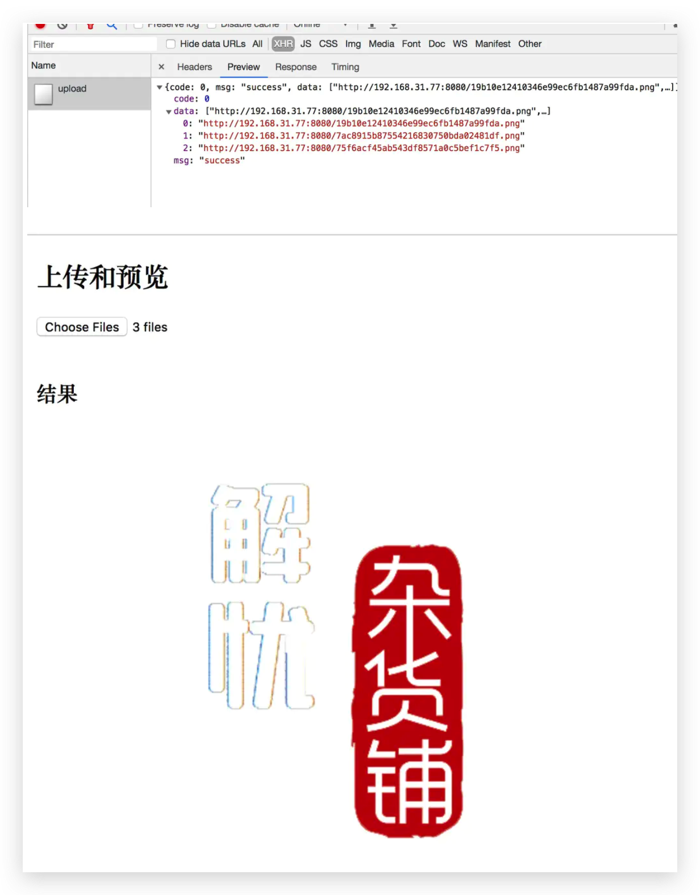

## spring boot解决如何同时上传多个图片和下载的问题

[TOC]

在平时的业务场景中，避免不了，要搭建文件上传服务器，作为公共服务。一般情况，只做了单个文件的上传，实际业务场景中，却发现单个文件上传，并不能满足一些业务需求，因此我们需要解决如何写一个同时上传多个文件的借口，并返回可下载的文件地址；


废话不多讲，不再从头建立一个`Spring boot`项目，如果不知道的话，请直接前往官网查看实例。


下面我们以上传图片为例，示例相对简单，仅供参考：

### 1 后端上传图片接口逻辑

> UploadController.java

```java
package com.zz.controllers.fileUpload;

import com.zz.Application;
import com.zz.model.Response;
import org.slf4j.Logger;
import org.slf4j.LoggerFactory;
import org.springframework.beans.factory.annotation.Value;
import org.springframework.boot.web.server.LocalServerPort;
import org.springframework.context.annotation.Configuration;
import org.springframework.web.bind.annotation.PostMapping;
import org.springframework.web.bind.annotation.RequestParam;
import org.springframework.web.bind.annotation.RestController;
import org.springframework.web.multipart.MultipartFile;

import java.io.*;
import java.net.Inet4Address;
import java.net.InetAddress;
import java.nio.file.Path;
import java.util.ArrayList;
import java.util.UUID;

import static com.zz.config.ConfigConstants.getFileDir;

@RestController
@Configuration
public class UploadController {
    
    private static final Logger log = LoggerFactory.getLogger(Application.class);
    
    @Value("${server.port}")
    private String port;
    
  	//获取当前IP地址
    public String getIp() {
        InetAddress localhost = null;
        try {
            localhost = Inet4Address.getLocalHost();
        } catch (Exception e) {
            log.error(e.getMessage());
            e.printStackTrace();
        }
        return localhost.getHostAddress();
    }
    
    @PostMapping(value = "/upload", consumes = {"multipart/form-data"})
    public Response upload(@RequestParam("file") MultipartFile[] files, Response response) {
        log.info("上传多个文件");
        StringBuilder builder = new StringBuilder();
        // file address
        String fileAddress ="http://"+ getIp()+ ":" + port + File.separator;
    
        ArrayList<String> imgUrls = new ArrayList<String>();
        try {
            for (int i = 0; i < files.length; i++) {
                // old file name
                String fileName = files[i].getOriginalFilename();
                // new filename
                String generateFileName = UUID.randomUUID().toString().replaceAll("-", "") + fileName.substring(fileName.lastIndexOf("."));
                // store filename
                String distFileAddress = fileAddress + generateFileName;
                builder.append(distFileAddress+",");
                imgUrls.add(distFileAddress);
                // generate file to disk
                files[i].transferTo(new File(getFileDir() + generateFileName));
            }
        } catch (Exception e) {
            e.printStackTrace();
        }
        response.setMsg("success");
        log.info(builder.toString());
        response.setData(imgUrls);
        return response;
    }
}

```

相对于单个文件的接收，我们这里直接接受多个`file`对象，然后遍历生成每个对应的地址。

其中：

> getFileDir 设置存放图片的地址，我选择存在项目外的其他地方
>
> com.zz.config.ConfigConstants.getFileDir

```
package com.zz.config;

public class ConfigConstants {
    
    public static String fileDir;
    
    public static String getFileDir() {
        fileDir = "/Users/wz/projects/blog/uploadFile/";
        return fileDir;
    }
}

```

> 当我们把文件生成到指定的文件夹后，我们如何配置在当前server下访问项目外的静态文件图片资源呢？

这个我们就要利用`spring boot配置文件 application.yml,` 当前还有其他方法比如 `WebMvcConfigurer`   这里不再赘述。

> application.yml

```yaml
pring:
  jpa:
    show-sql: true
    hibernate:
      ddl-auto: update

  servlet:
    multipart:
      max-file-size: 10MB
      max-request-size: 10MB

  profiles:
    active: dev

  # 静态资源配置
  mvc:
    static-path-pattern: /**
  resources:
    static-locations: file:/Users/wz/projects/blog/uploadFile/,classpath:/static/,classpath:/resources/,classpath:/file/,classpath:/templates/

server:
  use-forward-headers: true
  tomcat:
    remote-ip-header: X-Real-IP
    protocol-header: X-Forwarded-Proto

#自定义
my:
  tokenURL: "55555"
  authURL: "88888"


```


这样之后我们在生成的结果中的 `http://192.168.31.77:8080/a7ef32e3922b46aea256a93dd53de288.png`,这样的地址就可以把文件实质性的指向了`file:/Users/wz/projects/blog/uploadFile/`,这样大致就是一个简单文件服务器的配置了，当然远不及此，还有压缩一类的功能，后续再聊。


后端逻辑已经很清晰；

那前端如何向后端同时发送多个`file`对象呢？

### 2 前端多个文件上传如何传参

> html

```html
<input type="file" multiple class="el-upload" accept="image/*" name="file">
```

> js

```javascript
//upload
var uploadBtn = document.querySelector('.el-upload');

uploadBtn.onchange = function (e) {
    let files = this.files;
    console.log(this.files);

    const xhr = new XMLHttpRequest();
    xhr.open("post", "/upload", true);
    // xhr.setRequestHeader("Content-Type", "application/x-www-form-urlencoded");
    xhr.onreadystatechange = function () {
        if (this.readyState === XMLHttpRequest.DONE && this.status === 200) {
            console.log(JSON.parse(this.responseText));
            const {data} = JSON.parse(this.responseText);
            if(!data) return;
            const imageList = data.slice(0);
            let imageStr = '';
            imageList.forEach(img=>{
                imageStr += ``;
            });
            document.getElementById("result").innerHTML = imageStr;
        }
    };

    const formData = new FormData();

    // 多个file 同时上传
    if(files && files.length){
        for (let i=0;i<files.length;i++) {
            formData.append("file", files[i])
        }
    }

    console.log(formData);

    xhr.send(formData);
};
```

前端通过`FormData`传参数发送POST请求；

区别于之前的单个`formData.append();` 这里我们可以同时`append`多个相同名字的文件二进制文件流；



cu

如图结果正常显示，当我们部署到服务器的时候，这个就可以当作一个web服务器供大家使用。