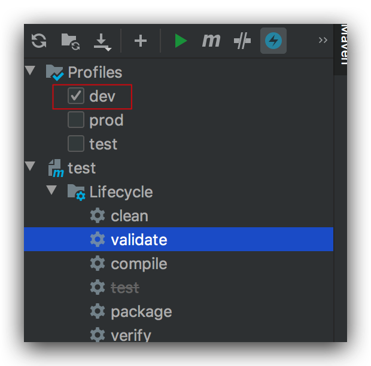
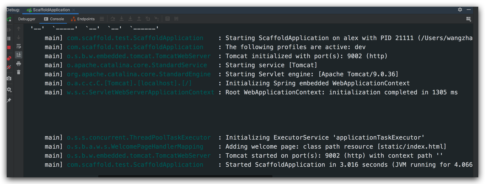
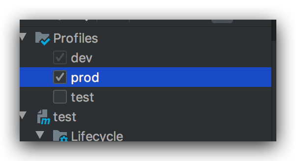
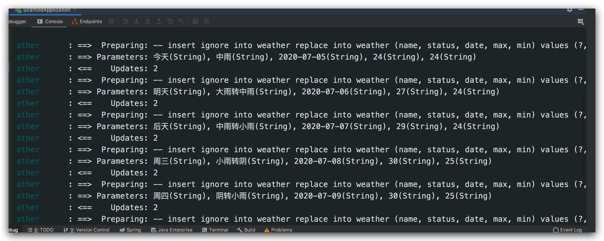
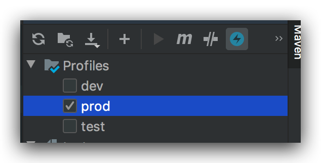
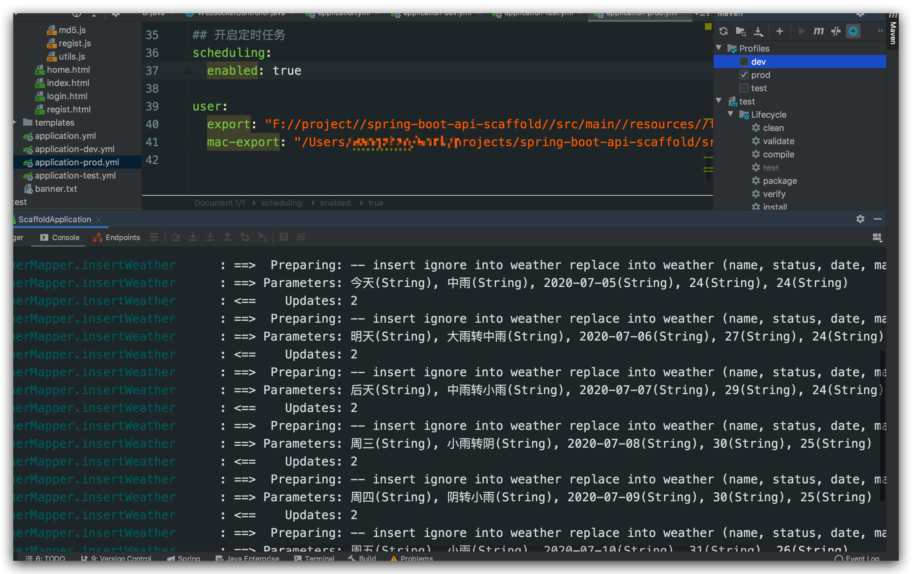

[TOC]

## 1、前言

前面我们讲了定时任务，并且实例说明如何利用爬虫获取天气信息并定时发邮件提醒；

`那么假设我们有三种环境分别是：dev（本地开发环境）、test（UAT测试环境） 和 prod（生产环境）;`

那么如何根据不同环境决定是否激活定时任务呢？

如果不知道如何自定义三种环境，请参考之前的文章；[Spring Boot手把手教学(2)：使用yml多环境配置和创建多环境profile打包](https://juejin.im/post/5e21f51051882521414ae5e2)

## 2、添加自定义属性

> Pom.xml

`默认Dev环境`

~~~xml
<profiles>
        <profile>
            <!-- 开发环境 -->
            <id>dev</id>
            <properties>
                <profileActive>dev</profileActive>
            </properties>
            <!-- 默认激活的环境 -->
            <activation>
                <activeByDefault>true</activeByDefault>
            </activation>
        </profile>
        <profile>
            <!-- 测试环境 -->
            <id>test</id>
            <properties>
                <profileActive>test</profileActive>
            </properties>
        </profile>
        <profile>
            <!-- 生产环境 -->
            <id>prod</id>
            <properties>
                <profileActive>prod</profileActive>
            </properties>
        </profile>
    </profiles>
~~~

> src/main/resources/application.yml

~~~yaml
spring:
  profiles:
    active: @profileActive@
~~~

> src/main/resources/application-dev.yml

~~~yaml
## 开启定时任务
scheduling:
  enabled: false
~~~

> src/main/resources/application-test.yml

~~~yaml
## 开启定时任务
scheduling:
  enabled: true
~~~

> src/main/resources/application-prod.yml

~~~yaml
## 开启定时任务
scheduling:
  enabled: true
~~~

三种环境，分别添加自定义属性；

## 3、定时任务开关

> com.scaffold.test.config.SchedulingConfig

`添加定时任务配置`

~~~java
package com.scaffold.test.config;

import org.springframework.boot.autoconfigure.condition.ConditionalOnProperty;
import org.springframework.context.annotation.Configuration;
import org.springframework.scheduling.annotation.EnableScheduling;

/**
 * 定时任务开关
 */

@Configuration
//启用定时任务
@EnableScheduling
//配置文件读取是否启用此配置
@ConditionalOnProperty(prefix = "scheduling", name = "enabled", havingValue = "true")
public class SchedulingConfig {
}

~~~

这个时候我们把启动类上的`@EnableScheduling`单独移到了新建的配置类中，这样方便自定义控制；然后通过`@ConditionalOnProperty`启动自动获取配置属性`scheduling`,默认为true, 定时任务默认开启；

到此为止，如果在预想正确的情况：

~~~java

dev环境：不开启

test环境：开启

prod环境：开启

~~~

那么如何判定呢？我们在之前的例子中，定时获取天气信息，间隔是1个小时，在启动server的时候，默认第一次执行，

所以，我们以此为依据进行判定是否生效；

## 4、切换不同环境

### 4.1、 dev

没有执行爬虫插入的sql, 所以，dev环境没有开启定时任务，``验证通过``；

### 4.2、test

有sql执行，定时任务生效，``验证通过``；

### 4.3、prod

`验证通过`；

到此为止，说明自定义激活定时任务的配置已经成功了，感兴趣的小伙伴赶紧去试试吧。