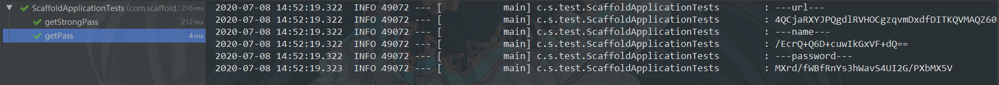
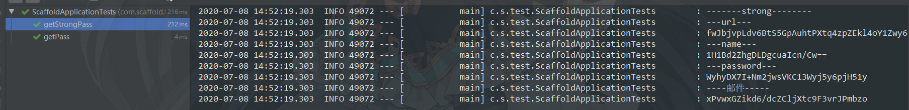
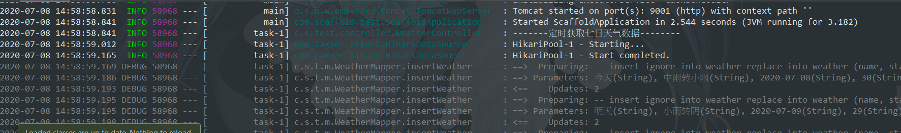
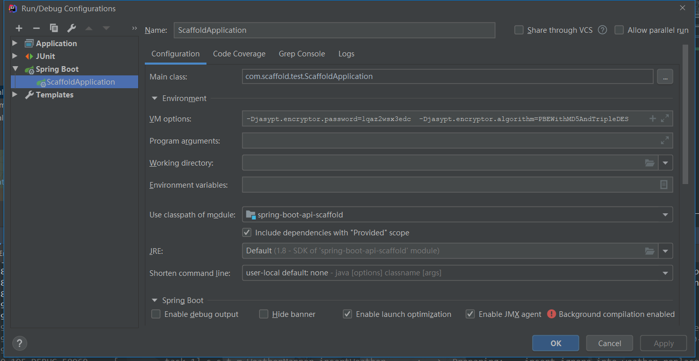

[TOC]

## 1、前言

如果`Spring boot` 的配置文件大多是明文 ，这样是不安全的；

如果Mysql数据库的账号密码都是明文，安全性就降低了，就像是在裸奔一样，所以有必要对相关比较隐秘的数据进行加密，这样的话相对安全性高一点；

这里我们采用`jasypt`对数据库的连接、账号和名称进行加密处理；

## 2、`jasypt`加密

> 依赖

~~~xml
<!-- 配置文件内容加密-->
<dependency>
    <groupId>com.github.ulisesbocchio</groupId>
    <artifactId>jasypt-spring-boot-starter</artifactId>
    <version>2.1.0</version>
</dependency>
~~~

> jasypt中加密方法的类有两个：BasicTextEncryptor  和   StrongTextEncryptor

~~~java
public final class BasicTextEncryptor implements TextEncryptor {
    private final StandardPBEStringEncryptor encryptor = new StandardPBEStringEncryptor();

    public BasicTextEncryptor() {
        this.encryptor.setAlgorithm("PBEWithMD5AndDES");
    }

    public void setPassword(String password) {
        this.encryptor.setPassword(password);
    }

    public void setPasswordCharArray(char[] password) {
        this.encryptor.setPasswordCharArray(password);
    }

    public String encrypt(String message) {
        return this.encryptor.encrypt(message);
    }

    public String decrypt(String encryptedMessage) {
        return this.encryptor.decrypt(encryptedMessage);
    }
}

~~~

`BasicTextEncryptor 对应的加密方式是 PBEWithMD5AndDES（默认方式）`

~~~java
public final class StrongTextEncryptor implements TextEncryptor {
    private final StandardPBEStringEncryptor encryptor = new StandardPBEStringEncryptor();

    public StrongTextEncryptor() {
        this.encryptor.setAlgorithm("PBEWithMD5AndTripleDES");
    }

    public void setPassword(String password) {
        this.encryptor.setPassword(password);
    }

    public void setPasswordCharArray(char[] password) {
        this.encryptor.setPasswordCharArray(password);
    }

    public String encrypt(String message) {
        return this.encryptor.encrypt(message);
    }

    public String decrypt(String encryptedMessage) {
        return this.encryptor.decrypt(encryptedMessage);
    }
}
~~~

`StrongTextEncryptor对应的加密方式是 PBEWithMD5AndTripleDES`

假设我们的配置文件如下：

> src/main/resources/application.yml

~~~yaml
server:
  port: 9002

spring:
  datasource:
    driver-class-name: com.mysql.cj.jdbc.Driver
    url: jdbc:mysql://127.0.0.1:3306/test?useUnicode=true&characterEncoding=UTF-8&serverTimezone=UTC
    username: admin
    password: test2011

#jasypt加密的密匙
jasypt:
  encryptor:
    # 加密所需的salt(盐)
    # 加密方式和算法一定要对应一致
    # BasicTextEncryptor 对应加密方式：PBEWithMD5AndDES，StrongTextEncryptor 对应加密方式： PBEWithMD5AndTripleDES
    # 部署时配置salt(盐)值 java -jar -Djasypt.encryptor.password=1qaz2wsx3edc -Djasypt.encryptor.algorithm=PBEWithMD5AndDES xxx.jar
    # 或者在服务器的环境变量里配置,进一步提高安全性
    # 打开/etc/profile文件 vim /etc/profile
    # 文件末尾插入 export JASYPT_PASSWORD = SALT
    # 文件末尾插入 export JASYPT_ALGORITHM = ALGORITHM
    # 编译 source /etc/profile
    # 运行 java -jar -Djasypt.encryptor.password=${JASYPT_PASSWORD} -Djasypt.encryptor.algorithm=${JASYPT_ALGORITHM} xxx.jar
    password: 1qaz2wsx3edc
    # 默认加密方式PBEWithMD5AndDES,可以更改为PBEWithMD5AndTripleDES
    algorithm: PBEWithMD5AndTripleDES


~~~

> 下面我们写一个测试类进行加密: com.scaffold.test.ScaffoldApplicationTests

~~~java
package com.scaffold.test;


import com.scaffold.test.constants.BaseApplication;
import lombok.extern.slf4j.Slf4j;
import org.jasypt.util.text.BasicTextEncryptor;
import org.jasypt.util.text.StrongTextEncryptor;
import org.junit.Test;
import org.junit.runner.RunWith;
import org.springframework.beans.factory.annotation.Autowired;
import org.springframework.boot.test.context.SpringBootTest;
import org.springframework.test.context.junit4.SpringRunner;

@Slf4j
@RunWith(SpringRunner.class)
@SpringBootTest(classes = ScaffoldApplication.class, webEnvironment = SpringBootTest.WebEnvironment.RANDOM_PORT)
public class ScaffoldApplicationTests {


    @Autowired
    private BaseApplication baseApplication;

    /**
     * 基础加密
     */
    @Test
    public void getPass() {
        BasicTextEncryptor basicTextEncryptor = new BasicTextEncryptor();
        //加密所需的salt(盐)
        basicTextEncryptor.setPassword("1qaz2wsx3edc");
        // 加密数据库相关连接数据
        String url = basicTextEncryptor.encrypt(baseApplication.getDataSourceUrl());
        String name = basicTextEncryptor.encrypt(baseApplication.getDataSourceUserName());
        String password = basicTextEncryptor.encrypt(baseApplication.getDataSourcePassword());
        log.info("---url---");
        log.info(url);
        log.info("---name---");
        log.info(name);
        log.info("---password---");
        log.info(password);
    }

    /**
     * 强加密
     */
    @Test
    public void getStrongPass() {
        StrongTextEncryptor strongTextEncryptor = new StrongTextEncryptor();
        //加密所需的salt(盐)
        strongTextEncryptor.setPassword("1qaz2wsx3edc");
        // 加密数据库相关连接数据
        String url = strongTextEncryptor.encrypt(baseApplication.getDataSourceUrl());
        String name = strongTextEncryptor.encrypt(baseApplication.getDataSourceUserName());
        String password = strongTextEncryptor.encrypt(baseApplication.getDataSourcePassword());
        String senderAddr = strongTextEncryptor.encrypt(baseApplication.getMailSenderAddr());
        log.info("-------strong--------");
        log.info("---url---");
        log.info(url);
        log.info("---name---");
        log.info(name);
        log.info("---password---");
        log.info(password);
    }
}
~~~





`每次运行得到的加密字符串是不一样的`;

在这里我们采用 强加密 的方式作为示例说明；

我们把生成后的加密内容拷贝到配置文件进行替换；

> src/main/resources/application.yml

~~~yaml
server:
  port: 9002

spring:
  datasource:
    driver-class-name: com.mysql.cj.jdbc.Driver
    url: ENC(fwJbjvpLdv6BtS5GpAuhtPXtq4zpZEkl4oY1Zwy6NjvWkmMXEaV4nwDJlU3PuMLgrlMDBm13TDNZVFN+UH5YJmP62Ichojq9oWfZQBxfIMBDB4O13VbJ5L5VqwXiyH474YPBRzK9wKU=)
    username: ENC(1H1Bd2ZhgDLDgcuaIcn/Cw==)
    password: ENC(WyhyDX7I+Nm2jwsVKC13Wyj5y6pjH51y)

#jasypt加密的密匙
jasypt:
  encryptor:
    # 加密所需的salt(盐)
    # 加密方式和算法一定要对应一致
    # BasicTextEncryptor 对应加密方式：PBEWithMD5AndDES，StrongTextEncryptor 对应加密方式： PBEWithMD5AndTripleDES
    # 部署时配置salt(盐)值 java -jar -Djasypt.encryptor.password=1qaz2wsx3edc -Djasypt.encryptor.algorithm=PBEWithMD5AndDES xxx.jar
    # 或者在服务器的环境变量里配置,进一步提高安全性
    # 打开/etc/profile文件 vim /etc/profile
    # 文件末尾插入 export JASYPT_PASSWORD = SALT
    # 文件末尾插入 export JASYPT_ALGORITHM = ALGORITHM
    # 编译 source /etc/profile
    # 运行 java -jar -Djasypt.encryptor.password=${JASYPT_PASSWORD} -Djasypt.encryptor.algorithm=${JASYPT_ALGORITHM} xxx.jar
    password: 1qaz2wsx3edc
    # 默认加密方式PBEWithMD5AndDES,可以更改为PBEWithMD5AndTripleDES
    algorithm: PBEWithMD5AndTripleDES


~~~

`ENC 是固定内部方法，一定要记得加上`；

此时重启项目，连接数据库成功；



## 3、安全性

如果说明文不加密是裸奔，把加密配置写在文件里，也相当于是皇帝的新衣，依然没有什么安全性可言，所以一定要把秘钥和算法加密方式，从配置文件中移除；

此时配置文件应该是：

~~~yaml
server:
  port: 9002

spring:
  datasource:
    driver-class-name: com.mysql.cj.jdbc.Driver
    url: ENC(fwJbjvpLdv6BtS5GpAuhtPXtq4zpZEkl4oY1Zwy6NjvWkmMXEaV4nwDJlU3PuMLgrlMDBm13TDNZVFN+UH5YJmP62Ichojq9oWfZQBxfIMBDB4O13VbJ5L5VqwXiyH474YPBRzK9wKU=)
    username: ENC(1H1Bd2ZhgDLDgcuaIcn/Cw==)
    password: ENC(WyhyDX7I+Nm2jwsVKC13Wyj5y6pjH51y)
~~~

那么移除秘钥后，我们如何正常运行项目呢？

### 3.1 本地运行

在环境变量中添加：

~~~shell
-Djasypt.encryptor.password=1qaz2wsx3edc  -Djasypt.encryptor.algorithm=PBEWithMD5AndTripleDES
~~~

如图：



### 3.2  服务器部署

有两种方式：

> 第一种

~~~shell
java -jar -Djasypt.encryptor.password=1qaz2wsx3edc -Djasypt.encryptor.algorithm=PBEWithMD5AndDES xxx.jar
~~~

> 第二种：安全性高点

```shell
# 或者在服务器的环境变量里配置,进一步提高安全性
# 打开/etc/profile文件 vim /etc/profile
# 文件末尾插入 export JASYPT_PASSWORD = SALT
# 文件末尾插入 export JASYPT_ALGORITHM = ALGORITHM
# 编译 source /etc/profile
# 运行 java -jar -Djasypt.encryptor.password=${JASYPT_PASSWORD} -Djasypt.encryptor.algorithm=${JASYPT_ALGORITHM} xxx.jar
```

以上就是加密的方法，第二种比较安全；

加密不仅仅可以加密数据库连接信息，也可以加密你认为比较隐私的数据；

内容到此 结束，感兴趣的小伙伴，赶紧去试试吧；