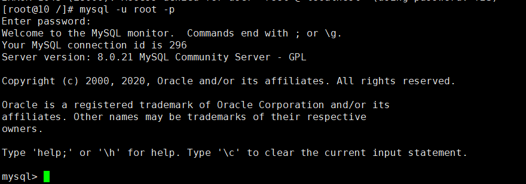
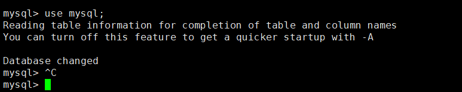
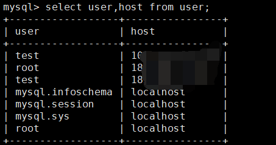
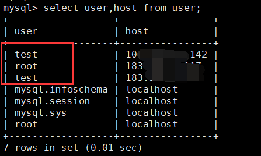

## Spring Boot手把手教学(16)：mysql8限制IP远程登录

[TOC]

### 1、前言

`mysql`的连接，为了安全，一般都需要限制IP登录，无论是内网IP端，或者某些固定的IP；接下来让我们说下 如何限制IP登录；

我们这里使用的`Mysql8.0版本`，其他版本的命令或许有所不同

### 2、操作

#### 2.1  服务器登录mysql

~~~shell
[root@10 /]# mysql -u root -p
~~~

> 输入你的密码

> 切换到mysql库

~~~shell
mysql> use mysql;
~~~

> 查看用户

~~~shell
mysql> select user,host from user;
~~~

这里可以看到所有用户。

~~~mysql
user  host
root  localhost  		   # 代表只能本机连接，不能远程连接
root  %         		   # 代表允许所有IP远程连接
root  192.168.66.31         # 代表允许IP：192.168.66.31 远程连接
root  192.168.66.32         # 代表允许IP：192.168.66.32 远程连接
~~~

以上已经说明了所有设置登录账户权限的场景；

#### 2.2 允许所有人连接

~~~mysql
# 更新host为'%'
UPDATE `user` SET `Host`='%' WHERE `user`='root' AND `Host`='localhost';

# Mysql 8 赋权： *.*代表所有库权限，test.* 代表test库的权限
GRANT ALL ON *.* to 'root'@'%';

# 更新配置并使之生效
flush privileges;
~~~

其他Mysql版本：

~~~mysql
# 更新host为'%'
UPDATE `user` SET `Host`='%' WHERE `user`='root' AND `Host`='localhost';

# Mysql5.7 赋权
GRANT ALL PRIVILEGES ON *.* to 'root'@'%' IDENTIFIED by '密码' WITH GRANT OPTION;

# 更新配置并使之生效
flush privileges;
~~~

#### 2.3 允许单个IP登录，赋权全权限

~~~mysql
drop user 'test'@'183.195.13.117';

CREATE user 'test'@'183.195.13.117' IDENTIFIED by '你的密码';

GRANT ALL on *.* TO 'test'@'183.195.13.117';

flush privileges;
~~~

#### 2.4 允许单个IP登录，赋权test库权限

~~~mysql
drop user 'test'@'183.195.13.117';

CREATE user 'test'@'183.195.13.117' IDENTIFIED by '你的密码';

GRANT ALL on test.* TO 'test'@'183.195.13.117';

flush privileges;
~~~

#### 2.5 允许多个IP登录，赋权test库权限

~~~mysql
# 第一个IP

CREATE user 'test'@'183.195.13.117' IDENTIFIED by '你的密码';

GRANT ALL on test.* TO 'test'@'183.195.13.117';

flush privileges;

# 第二个IP

CREATE user 'test'@'183.195.13.118' IDENTIFIED by '你的密码';

GRANT ALL on test.* TO 'test'@'183.195.13.118';

flush privileges;

# 有几个IP，就创建多少个用户

~~~

### 3、 重置密码

~~~mysql
1.在 [/etc/my.cnf]最后加上如下语句 并保持退出文件；
skip-grant-tables

2.重启mysql
service mysql restart

3.输入以下命令，点击enter键可以跳过密码直接进入mysql
mysql -u root -p

4.查看root用户的相关信息
select host, user, authentication_string, plugin from user;可以看到root用户中authentication_string就是你之前的密码的散列值。

5.当前root用户authentication_string字段下有内容，先将其设置为空
use mysql;
update user set authentication_string='' where user='root';

6.使用ALTER修改root用户密码
ALTER user 'root'@'localhost' IDENTIFIED BY '你的新密码'
~~~
