## websocket

[TOC]

### 1、前言

websocket一般用途为消息提醒，股票行情数据推送等等，有很多用途。

我们这里简单举例理解websocket和如何前后端接入websocket；

我们这里使用`WireShark进行抓包分析`；

`WireShark`是一个网络抓包分析软件。主要是截取网络封包，并尽可能显示出最为详细的网络封包资料。`WireShark`抓包是根据`TCP/IP`五层协议来的，也就是物理层、数据链路层、网络层、传输层、应用层。我们主要关注传输层和应用层。

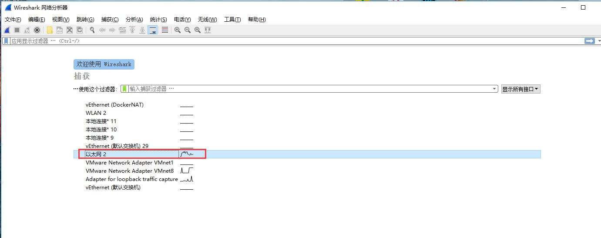

### 2、TCP三次握手

`TCP`建立连接时，会有三次握手过程。下图是`WireShar`k截获到的三次握手的三个数据包（虽然叫数据包，但是三次握手包是没有数据的）

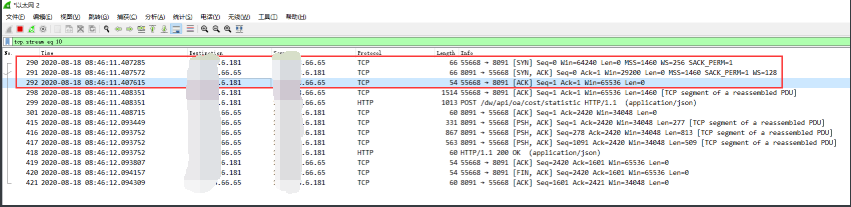

**SYN**：**同步比特**，建立连接;
**ACK**：**确认比特**，置1表示这是一个确认的TCP包，0则不是;
**PSH**：**推送比特**，当发送端PSH=1时，接收端应尽快交付给应用进程;

> 刚开始客户端和服务端都处于Closed状态，此时客户端向服务端发起主动连接：

> 第一次握手
>
> SYN=1 客户端（192.168.66.65），发包到服务端（192.168.6.***）
>
>  请求建立连接。

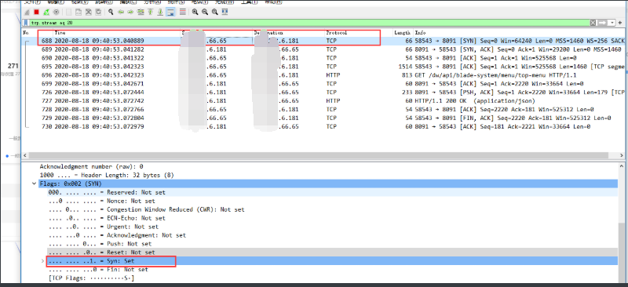

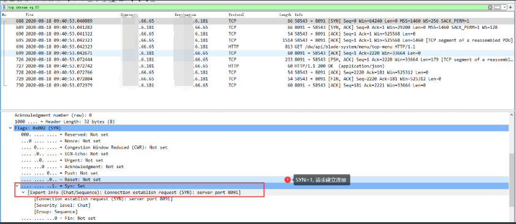

> 第二次握手
>
> 服务端收到客户端发的TCP报文之后，通过SYN=1得知客户端请求建立连接，将ACK（确认序列号）设置为客户端的序列号seq加1，并向客户端发起一个ACK=1，SYN=1的报文，进行确认是否要建立连接。

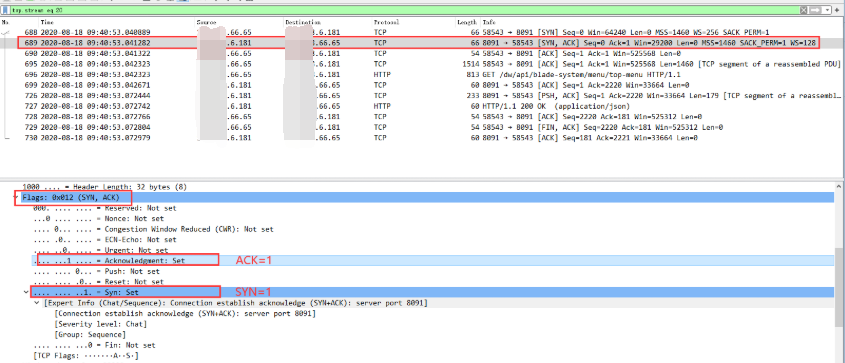

> 第三次握手
>
> 客户端接收到服务器发过来的包后检查确认序列号是否正确，即第一次发送的序号+1，以及标志位ACK是否为1。若正确则再次发送确认包，ACK标志为1。链接建立成功，可以发送数据了

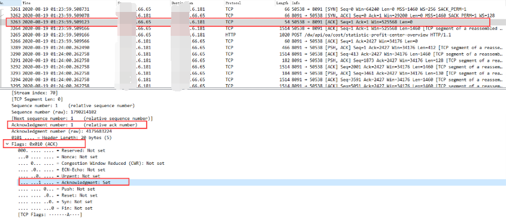

接下应该是HTTP请求了，不过发现这里有个TCP segment of a reassembled PDU，查阅相关资料是因为报文长度超过了能够传输的最大数据分段为**MSS**（Maximum Segment Size），所以进行了分段传输。

> HTTP 请求
>
> 传输层（Tcp）: PSH（推送比特）置1，ACK置1，PSH置1说明开始发送数据，同时发送数据ACK要置1，因为需要接收到这个数据包的端给予确认。PSH为1的情况，一般只出现在 DATA内容不为0的包中，也就是说PSH为1表示的是有真正的TCP数据包内容被传递

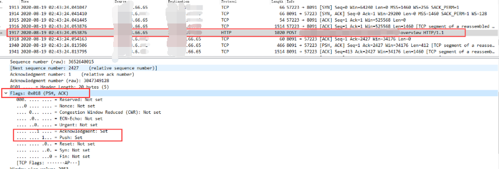

> TCP的6种标志位的分别代表：
>
> SYN(synchronous建立联机)
>
> ACK(acknowledgement 确认)
>
> PSH(push传送)
>
> FIN(finish结束)
>
> RST(reset重置)
>
> URG(urgent紧急)
>
> Sequence number(顺序号码)
>
> Acknowledge number(确认号码)

`下面时序图中，SYN指的的是SYN(synchronous建立联机)、ACK指的是ACK(acknowledgement 确认)，ack指的是Acknowledge number(确认号码)，seq指的是Sequence number(顺序号码)`

~~~sequence
Title: TCP三次握手
Note left of 客户端: 主动打开
Note right of 服务端: 被动打开进入LISTEN状态
Note over 客户端,服务端: SYN
客户端-->服务端: 发起请求，SYN=1,seq=x(客户端序列号)
Note left of 客户端: 客户端进入SYN_SENT状态
Note right of 服务端: 服务端被动打开进入LISTEN状态
Note over 客户端,服务端: SYN+ACK
服务端-->客户端: 同意连接，确认ACK=1,SYN=1,ack=x+1,seq=y(服务端序列号)
Note right of 服务端: 服务端进入SYN-RCVD(同步收到)状态
Note over 客户端,服务端: ACK
客户端-->服务端: 收到确认后,ACK=1,ack=y+1,seq=x+1
Note over 客户端,服务端: 连接建立
Note left of 客户端: 客户端进入ESTABLISHED状态
Note right of 服务端: 服务端进入ESTABLISHED状态
Note over 客户端,服务端: 传输数据
~~~

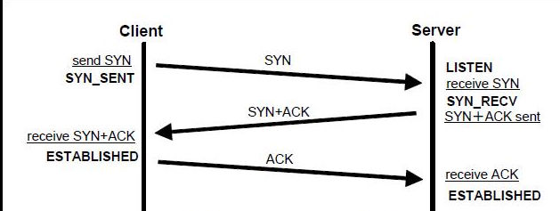

刚开始, 客户端和服务器都处于 CLOSE 状态.
此时, 客户端向服务器主动发出连接请求, 服务器被动接受连接请求.

1, TCP服务器进程先创建传输控制块TCB, 时刻准备接受客户端进程的连接请求, 此时服务器就进入了 LISTEN（监听）状态

2, TCP客户端进程也是先创建传输控制块TCB, 然后向服务器发出连接请求报文，此时报文首部中的同步标志位SYN=1, 同时选择一个初始序列号 seq = x, 此时，TCP客户端进程进入了 SYN-SENT（同步已发送状态）状态。TCP规定, SYN报文段（SYN=1的报文段）不能携带数据，但需要消耗掉一个序号。

3, TCP服务器收到请求报文后, 如果同意连接, 则发出确认报文。确认报文中的 ACK=1, SYN=1, 确认序号是 x+1, 同时也要为自己初始化一个序列号 seq = y, 此时, TCP服务器进程进入了SYN-RCVD（同步收到）状态。这个报文也不能携带数据, 但是同样要消耗一个序号。

4, TCP客户端进程收到确认后还, 要向服务器给出确认。确认报文的ACK=1，确认序号是 y+1，自己的序列号是 x+1.

5, 此时，TCP连接建立，客户端进入ESTABLISHED（已建立连接）状态。当服务器收到客户端的确认后也进入ESTABLISHED状态，此后双方就可以开始通信了。

> 为什么不用两次?

- 主要是为了防止已经失效的连接请求报文突然又传送到了服务器，从而产生错误。如果使用的是两次握手建立连接，假设有这样一种场景，客户端发送的第一个请求连接并且没有丢失，只是因为在网络中滞留的时间太长了，由于TCP的客户端迟迟没有收到确认报文，以为服务器没有收到，此时重新向服务器发送这条报文，此后客户端和服务器经过两次握手完成连接，传输数据，然后关闭连接。此时之前滞留的那一次请求连接，因为网络通畅了, 到达了服务器，这个报文本该是失效的，但是，两次握手的机制将会让客户端和服务器再次建立连接，这将导致不必要的错误和资源的费。
  如果采用的是三次握手，就算是那一次失效的报文传送过来了，服务端接受到了那条失效报文并且回复了确认报文，但是客户端不会再次发出确认。由于服务器收不到确认，就知道客户端并没有请求连接。

> 为什么不用四次?

- 因为三次已经可以满足需要了, 四次就多余了.

### 3、TCP四次挥手

数据传输完毕后，没有后续数据请求后，双方就会释放连接。

~~~sequence
Title: TCP四次挥手
Note over 客户端,服务端: 传输数据
Note left of 客户端: 处于ESTABLISHED状态
Note right of 服务端: 处于ESTABLISHED状态
Note over 客户端,服务端: 客户端关闭连接
Note left of 客户端: 主动断开
Note right of 服务端: 被动断开

Note over 客户端,服务端: FIN
客户端-->服务端: 发起请求，FIN=1,seq=u(客户端序列号)
Note left of 客户端: 客户端进入FIN-WAIT-1状态

Note over 客户端,服务端: ACK
服务端-->客户端: 确认断开,ACK=1,ack=u+1,seq=v(服务端序列号)
Note right of 服务端: 服务端被动进入CLOSE-WAIT状态
Note left of 客户端: 客户端进入FIN-WAIT-2状态

Note over 客户端,服务端: 传输数据
Note over 客户端,服务端: FIN
服务端-->客户端: 发送数据完毕后确认断开,FIN=1, ACK=1,ack=u+1,seq=w(服务端序列号)
Note right of 服务端: 服务端进入LAST-ACK（最后确认）

Note over 客户端,服务端: ACK
客户端-->服务端: 收到释放报文后后,ACK=1,ack=w+1,seq=u+1
Note left of 客户端: 客户端进入TIME-WAIT状态
Note over 客户端,服务端: 连接释放成功
Note right of 服务端: 服务端进入ClOSED状态

~~~

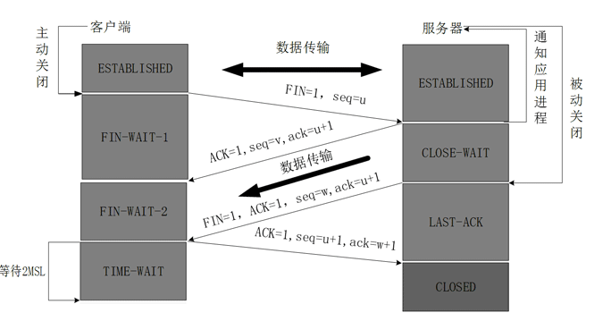

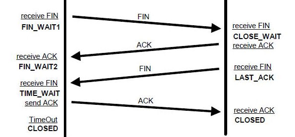

数据传输完毕后，双方都可以释放连接.
此时客户端和服务器都是处于ESTABLISHED状态，然后客户端主动断开连接，服务器被动断开连接.

1, 客户端进程发出连接释放报文，并且停止发送数据。
释放数据报文首部，FIN=1，其序列号为seq=u（等于前面已经传送过来的数据的最后一个字节的序号加1），此时客户端进入FIN-WAIT-1（终止等待1）状态。 TCP规定，FIN报文段即使不携带数据，也要消耗一个序号。

2, 服务器收到连接释放报文，发出确认报文，ACK=1，确认序号为 u+1，并且带上自己的序列号seq=v，此时服务端就进入了CLOSE-WAIT（关闭等待）状态。
TCP服务器通知高层的应用进程，客户端向服务器的方向就释放了，这时候处于半关闭状态，即客户端已经没有数据要发送了，但是服务器若发送数据，客户端依然要接受。这个状态还要持续一段时间，也就是整个CLOSE-WAIT状态持续的时间。

3, 客户端收到服务器的确认请求后，此时客户端就进入FIN-WAIT-2（终止等待2）状态，等待服务器发送连接释放报文（在这之前还需要接受服务器发送的最终数据）

4, 服务器将最后的数据发送完毕后，就向客户端发送连接释放报文，FIN=1，确认序号为v+1，由于在半关闭状态，服务器很可能又发送了一些数据，假定此时的序列号为seq=w，此时，服务器就进入了LAST-ACK（最后确认）状态，等待客户端的确认。

5, 客户端收到服务器的连接释放报文后，必须发出确认，ACK=1，确认序号为w+1，而自己的序列号是u+1，此时，客户端就进入了TIME-WAIT（时间等待）状态。注意此时TCP连接还没有释放，必须经过2∗MSL（最长报文段寿命）的时间后，当客户端撤销相应的TCB后，才进入CLOSED状态。

6, 服务器只要收到了客户端发出的确认，立即进入CLOSED状态。同样，撤销TCB后，就结束了这次的TCP连接。可以看到，服务器结束TCP连接的时间要比客户端早一些。

这里不再赘述，只是简单介绍下TCP；

### 4、 websocket

> 我们发起一个websocket连接请求

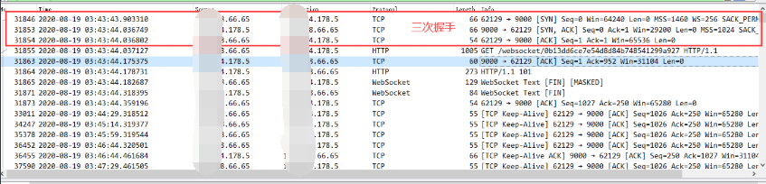

发现依然存在三次握手，之后有一个HTTP请求

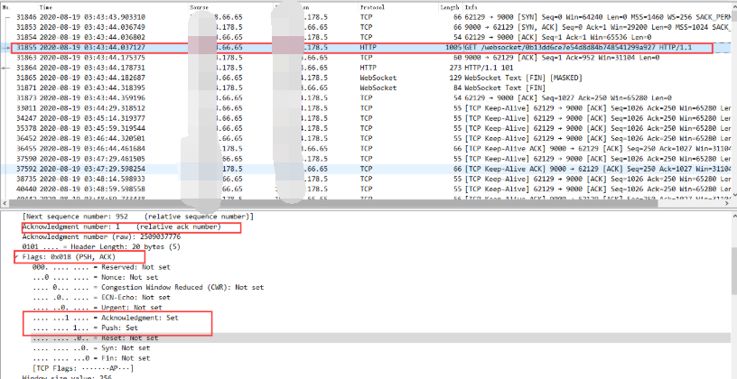

这次的HTTP请求，不同于之前的请求。

Http请求头中`Connection:Upgrade ``Upgrade:websocket``,

`Upgrade`代表升级到较新的Http协议或者切换到不同的协议；

`WebSocket`使用此机制以兼容的方式与HTTP服务器建立连接。WebSocket协议有两个部分：握手建立升级后的连接，然后进行实际的数据传输。首先，客户端通过使用Upgrade: WebSocket和Connection: Upgrade头部以及一些特定于协议的头来请求WebSocket连接，以建立正在使用的版本并设置握手。服务器，如果它支持协议，回复与相同Upgrade: WebSocket和Connection: Upgrade标题，并完成握手。握手完成后，数据传输开始

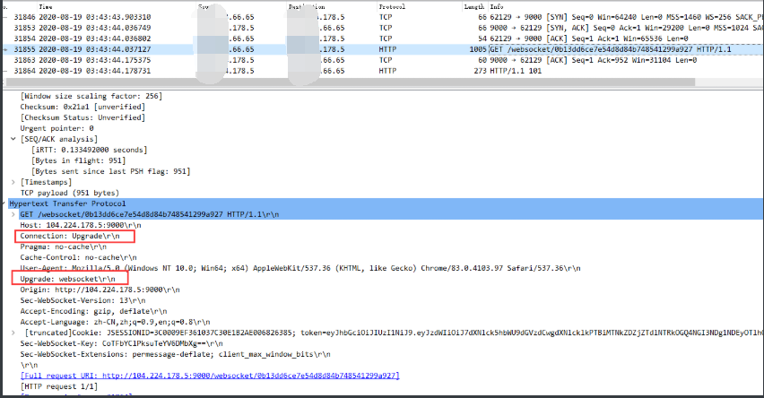

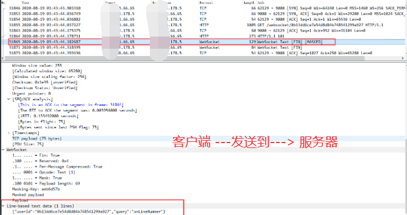

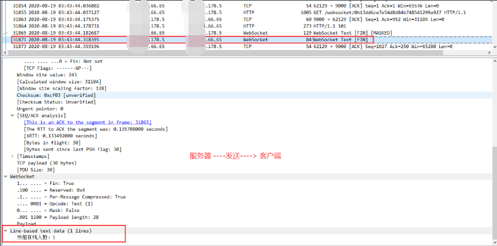

如图所示，Websocket协议本质上是一个基于TCP的协议。建立连接需要握手，客户端（浏览器）首先向服务器（web server）发起一条特殊的http请求，web server解析后生成应答到浏览器，这样子一个websocket连接就建立了，直到某一方关闭连接。

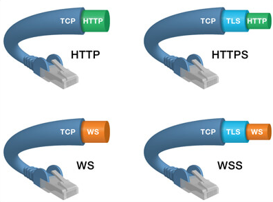

### 5 、客户端连接websocket

~~~javascript
var ws = new WebSocket(socketUrl);

ws.onopen = function(evt) {
  console.log("Connection open ...");
  ws.send("Hello");
};

ws.onmessage = function(evt) {
  console.log( "Received Message: " + evt.data);
  ws.close();
};

ws.onclose = function(evt) {
  console.log("Connection closed.");
};

~~~

### 6、服务端创建websocket代码实现

> maven安装依赖

~~~xml
        <!-- websocket-->
        <dependency>
            <groupId>org.springframework.boot</groupId>
            <artifactId>spring-boot-starter-websocket</artifactId>
        </dependency>
~~~

> 开启websocket
>
> com.scaffold.test.config.WebsocketConfig

~~~java
package com.scaffold.test.config;

import org.springframework.context.annotation.Bean;
import org.springframework.context.annotation.Configuration;
import org.springframework.web.socket.server.standard.ServerEndpointExporter;

/**
 * websocket 自动装配
 */

@Configuration
public class WebsocketConfig {

    // 开启WebSocket支持
    @Bean
    public ServerEndpointExporter serverEndpointExporter(){
        return new ServerEndpointExporter();
    }
}

~~~

> websocket对应也有以下几个方法：

~~~java
package com.scaffold.test.websocket;

import com.alibaba.fastjson.JSON;
import com.alibaba.fastjson.JSONObject;
import com.scaffold.test.utils.SystemUtils;
import lombok.extern.slf4j.Slf4j;
import org.apache.commons.lang3.StringUtils;
import org.springframework.stereotype.Component;

import javax.websocket.*;
import javax.websocket.server.ServerEndpoint;
import java.io.IOException;
import java.util.ArrayList;
import java.util.HashMap;
import java.util.Map;
import java.util.concurrent.ConcurrentHashMap;

@Slf4j
@Component
@ServerEndpoint("/message")
public class WebSocketServer {

    // 存放当前连接的客户端的Websocket对象
    private static ConcurrentHashMap<String, WebSocketServer> webSocketMap = new ConcurrentHashMap<>();
    // 与客户端的连接会话，通过它来给客户端发送数据
    private Session session;

    /**
     * 连接打开时调用
     *
     * @param session 会话
     */
    @OnOpen
    public void onOpen(Session session) { }

    /**
     * 连接关闭时调用
     */
    @OnClose
    public void onClose(Session session) {}

    /**
     * 收到客户端信息时调用
     *
     * @param message 接收消息
     * @param session session
     */
    @OnMessage
    public void onMessage(String message, Session session) {}

    /**
     * 连接出错时调用
     *
     * @param session session
     * @param err
     */
    @OnError
    public void onError(Session session, Throwable err) {}

}

~~~

这里我们要实现的的是`实时推送当前在线人数的一个需求，包括两种场景`：

>1、同一个账户，在不同的客户端（浏览器登录）登录，实时推送当前在线人数(+1账户，同一个账户再次登录应该是不增加)；
>
>2、不同的账户，在不同的户端（浏览器登录）登录，实时推送当前在线人数（多一个不同账户登录，就会+1）；

用户登录注册功能在实现在之前的文章中[Spring Boot手把手教学(15)：RESTful api接口如何开启登录鉴权拦截和放行](https://juejin.im/post/6854573218917777415)，已经有实现的过程，这里不再赘述;

> 我们这里讲下需要修改的地方：

由于有同一个账户在不同客户端登录的场景存在，我们就能把userId作为websocket的sessionId标识，只能在登录的时候，为这个账户，生成一个唯一ID标识，我们这里生成一个UUID返回到前端；

~~~java
    /**
     * 登录
     * @param user 用户信息
     * @return Result
     */
    @PassToken
    @PostMapping("/login")
    public Result userLogin(User user) {
        //验证码校验
        if (!userService.checkCode(user.getCode())) {
            return ResultGenerator.setFailResult("登录失败, 验证码不正确");
        }
        User userInfo = userService.findUser(user);
        if (userInfo != null) {
            HashMap<Object, Object> result = new HashMap<>();
            // 生成UUID
            String uuid = UUIDUtils.getUUID();
            String token = JWTUtils.createToken(userInfo);
            result.put("token", token);
            result.put("uuid", uuid);
            return ResultGenerator.setSuccessResult(result);
        } else {
            return ResultGenerator.setFailResult("登录失败, 请检查用户名和密码");
        }
    }
~~~

> 流程如下：

~~~mermaid
graph TB
A[用户登录] --> B[后端生成UUID和UserId返回]
B --> C[用户利用UUID发起websocket请求]
C --> D[后端监听websocket会话接收UUID和UserId参数]
D --> E[每个UUID产生一个websocket会话,存储UserId判断在线人数,通过各自UUID通知web做出在线人数提醒]

~~~

> 用户登录返回信息如下：

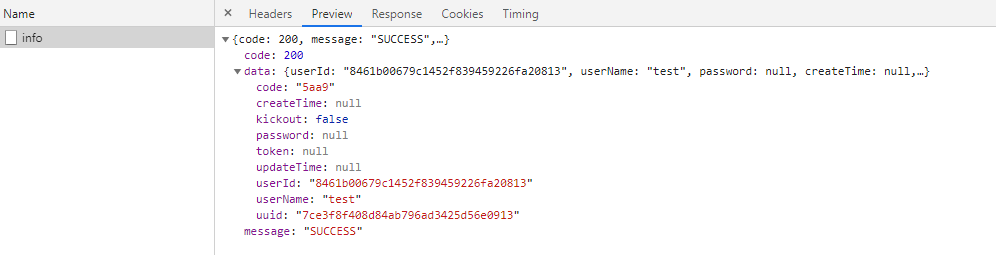

> websocket服务端逻辑代码：
>
> com.scaffold.test.websocket.WebSocketServer

~~~java
package com.scaffold.test.websocket;

import com.alibaba.fastjson.JSON;
import com.alibaba.fastjson.JSONObject;
import com.scaffold.test.utils.SystemUtils;
import lombok.extern.slf4j.Slf4j;
import org.apache.commons.lang3.StringUtils;
import org.springframework.stereotype.Component;

import javax.websocket.*;
import javax.websocket.server.ServerEndpoint;
import java.io.IOException;
import java.util.ArrayList;
import java.util.HashMap;
import java.util.Map;
import java.util.concurrent.ConcurrentHashMap;

@Slf4j
@Component
@ServerEndpoint("/message")
public class WebSocketServer {

    // 存放当前连接的客户端的Websocket对象
    private static ConcurrentHashMap<String, WebSocketServer> webSocketMap = new ConcurrentHashMap<>();
    // 与客户端的连接会话，通过它来给客户端发送数据
    private Session session;
    // 当前用户id
    private String userId;
    // 当前会话连接id
    private String sessionId;
    // 在线用户ID
    private static ArrayList<String> userList = new ArrayList<>();
    // 记录同一个用户UserID开启了几个会话
    private static Map<String, Object> userMap = new HashMap<>();

    /**
     * 连接打开时调用
     *
     * @param session 会话
     */
    @OnOpen
    public void onOpen(Session session) {
        this.session = session;
        JSONObject query = getSessionQuery(session);
        String userId = query.getString("userId");
        String sessionId = query.getString("sessionId");
        // 用户列表
        setUserMap(userId, sessionId);

        this.userId = userId;
        this.sessionId = sessionId;
        // 判断连接是否已经成立
        if (webSocketMap.containsKey(sessionId)) {
            // 已存在，先移除再添加
            webSocketMap.remove(sessionId);
            webSocketMap.put(sessionId, this);
        } else {
            // 不存在，直接添加
            webSocketMap.put(sessionId, this);
            // 增加在线人数
            if (!userList.contains(userId)) {
                userList.add(userId);
            }
            // 通知所有人
            String message = generateMessage(200, "当前连接人数为：" + getOnlineNumber());
            sendMessageAll(message);
        }

        log.info("连接用户：" + userId + ",当前连接人数为：" + getOnlineNumber());

    }

    /**
     * 连接关闭时调用
     */
    @OnClose
    public void onClose(Session session) {
        JSONObject query = getSessionQuery(session);
        String userId = query.getString("userId");
        String sessionId = query.getString("sessionId");

        if (webSocketMap.containsKey(sessionId)) {
            webSocketMap.remove(sessionId);
            deleteFromUserMap(userId, sessionId);
            // 判断当前UserId是否有会话存在，不存在，用户数据减一
            if (!checkUserExist(userId, sessionId)) {
                userList.remove(userId);
                log.info("用户退出：" + userId + ", 当前连接人数为：" + getOnlineNumber());
            }
            // 通知所有人
            String message = generateMessage(200, "当前连接人数为：" + getOnlineNumber());
            sendMessageAll(message);
        }
    }

    /**
     * 收到客户端信息时调用
     *
     * @param message 接收消息
     * @param session session
     */
    @OnMessage
    public void onMessage(String message, Session session) throws IOException {
        log.info("用户消息:" + userId + ",报文:" + message);

        // 判断消息是否非空
        if (StringUtils.isNotBlank(message)) {
            //解析消息
            JSONObject messageInfo = JSON.parseObject(message);
            String sessionId = messageInfo.getString("sessionId");
            // 用户查询内容
            String query = messageInfo.getString("query");
            // 验证UserId, 如果存在，发送消息
            if (StringUtils.isNoneBlank(sessionId) && webSocketMap.containsKey(sessionId)) {
                String msg = null;
                /*
                 * 查询人数
                 */
                if (query.equals("onLineNumber")) {
                    msg = generateMessage(200, "当前在线人数：" + getOnlineNumber());
                }
                webSocketMap.get(sessionId).sendMessage(msg);
            } else {
                log.error("用户不存在");
            }
        }
    }

    /**
     * 连接出错时调用
     *
     * @param session session
     * @param err
     */
    @OnError
    public void onError(Session session, Throwable err) {
        JSONObject sessionQuery = getSessionQuery(session);
        log.error(sessionQuery.getString("sessionId") + "连接出错，" + err.getMessage());
        err.printStackTrace();
    }

    /**
     * 单发消息
     * 服务端向客户端发送消息
     *
     * @param message
     * @throws IOException
     */
    public void sendMessage(String message) throws IOException {
        this.session.getBasicRemote().sendText(message);
    }

    /**
     * 单发消息
     * 发送自定义消息给客户端
     *
     * @param message
     * @param sessionId
     * @throws IOException
     */
    public static void sendInfo(String message, String sessionId) throws IOException {
        log.info("发送消息给" + sessionId + ",内容为：" + message);
        if (StringUtils.isNoneBlank(message) && webSocketMap.containsKey(sessionId)) {
            webSocketMap.get(sessionId).sendMessage(message);
        } else {
            log.error("用户" + sessionId + "不在线");
        }
    }

    /**
     * 群发消息
     *
     * @param message 消息
     */
    public void sendMessageAll(String message) {
        // 遍历 HashMap
        for (String key : webSocketMap.keySet()) {
            // 排除当前连接用户
            try {
                webSocketMap.get(key).sendMessage(message);
            } catch (Exception e) {
                log.error(e.getMessage());
            }
        }
    }

    // 获取在线人数，锁定线程
    public static synchronized int getOnlineNumber() {
        return userList.size();
    }

    /**
     * 获取参数
     *
     * @param session session
     * @return JSONObject
     */
    public static JSONObject getSessionQuery(Session session) {
        String queryString = session.getQueryString();
        JSONObject query = SystemUtils.getQuery(queryString);
        return query;
    }

    /**
     * 记录当前UserId，产生了多少个会话链接
     *
     * @param userId    用户Id
     * @param sessionId 会话ID
     */
    public void setUserMap(String userId, String sessionId) {
        if (userMap.get(userId) != null) {
            ArrayList<String> sessionIds = (ArrayList<String>) userMap.get(userId);
            if (!sessionIds.contains(sessionId)) {
                sessionIds.add(sessionId);
            }
        } else {
            ArrayList<String> sessionIds = new ArrayList<>();
            sessionIds.add(sessionId);
            userMap.put(userId, sessionIds);
        }
    }

    /**
     * 从记录当前UserId的会话链接移除当前会话
     *
     * @param userId    用户Id
     * @param sessionId 会话ID
     */
    public void deleteFromUserMap(String userId, String sessionId) {
        if (userMap.get(userId) != null) {
            ArrayList<String> sessionIds = (ArrayList<String>) userMap.get(userId);
            sessionIds.remove(sessionId);
        }
    }

    /**
     * 检查当前UserId 是否还有会话存在，不存在用户数减一
     *
     * @param userId    用户Id
     * @param sessionId 会话ID
     * @return true
     */
    public Boolean checkUserExist(String userId, String sessionId) {
        if (userMap.get(userId) != null) {
            ArrayList<String> sessionIds = (ArrayList<String>) userMap.get(userId);
            return sessionIds.size() > 0;
        }
        return false;
    }

    /**
     * 生成消息
     *
     * @param code
     * @param message
     * @return
     */
    public String generateMessage(int code, String message) {
        Map<Object, Object> wsResult = new HashMap<>();
        wsResult.put("message", message);
        wsResult.put("code", code);
        return JSONObject.toJSONString(wsResult);
    }
}
~~~

### 7、前端发起websocket代码实现

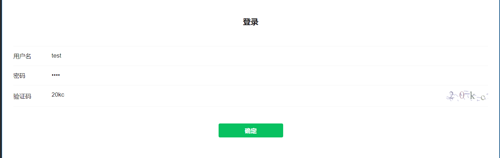

~~~javascript
// 获取相关用户信息

const titleDom = document.querySelector(".weui-form__title");
const result = document.getElementById("result");

// getUserInfo
function getUserInfo() {
    dataService.getUserInfo().then(res => {
        const {code, data} = res;
        if (code === 401) {
            location.href = location.origin + "/login.html";
            return;
        }
        if (data) {
            titleDom.innerHTML = 'Hello ' + data.userName + ', 欢迎登录追梦空间';
            // 发起websocket
            createSocket({
                sessionId: data.uuid,
                userId: data.userId
            })
        }
    })
}

// websocket 连接

let socket;

const createSocket = (params) => {
    if (typeof WebSocket == 'undefined') {
        console.log("浏览器不支持websocket");
    } else {
        const paramsArr = [];
        Object.keys(params).forEach(m => {
            paramsArr.push(`${m}=${params[m]}`);
        });
        const sessionId = params['sessionId'];
        const userId = params['userId'];
        let socketUrl = location.origin + "/message?" + paramsArr.join("&");
        socketUrl = socketUrl.replace(/http|https/g, 'ws');
        console.log(socketUrl);
        if (socket != null) {
            socket.close();
            socket = null;
        }
        socket = new WebSocket(socketUrl);
        // 建立连接
        socket.onopen = () => {
            console.log("建立连接", sessionId);

            socket.send(JSON.stringify({
                sessionId: sessionId,
                query: 'onLineNumber'
            }));

        };
        // 获取消息
        socket.onmessage = message => {
            console.log(sessionId, message);
            const data = JSON.parse(message.data);
            if(data.code == 200) {
                result.innerText = data.message;
            }
        };

    }
};

//关闭连接
function closeWebSocket() {
    socket.close();
}

getUserInfo();
~~~

登录注册相关代码，请参考之前文章，这里不再赘述。

我们目前的逻辑是在登录成功后，获取用户信息时发起websocket，然后接收服务端返回的websocket信息；

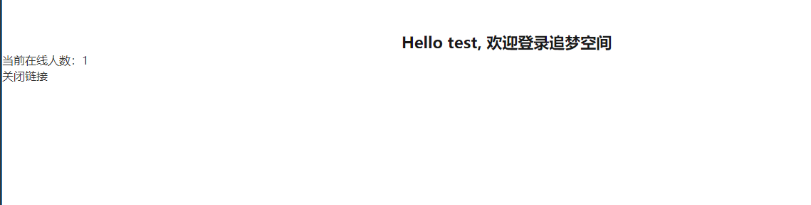

### 8、总结

以上仅为一个简单的示例，websocket是不同于HTTP的特殊报文请求，有很多其他用途，下次，我们将讲解如何控制单用户登录，当同一个账户多客户端登录的时候，实现互踢，仅保持一个客户端登录并使用websocket做出用户踢出提醒。
