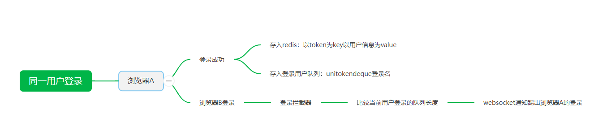
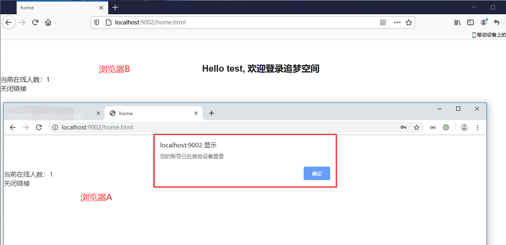

## 基于Redis和Redession的用户互踢功能，一个用户只能在一个浏览器登录

[TOC]

### 1、前言

在项目中，同一个账户有时候会在多个地方登录，这个时候需要`限制一个账户只能在一个客户端/浏览器登录`，并在被踢出的`浏览器/客户端`作出消息通知；

比如用户A在`浏览器A`登录成功后，他又在`浏览器B`登录该账户，这个情况，我们需要在`浏览器A`提示“`当前账户已在别的地方登录`”，并退出登录。

消息通知是基于`websocket`的，互踢功能基于`Redis+Redisson消息队列`;

那么该如何实现呢？

### 2、实现思路

> 思路

> 消息通知

消息通知是基于`websocket`的，具体代码可参考上一篇文章：[Spring Boot手把手教学(17)：websocket分析和前后端如何接入websocket](https://juejin.im/post/6865070438243008520)

> 互踢实现
>
> redisson 消息队列

用户登录时，会通过一个API鉴权拦截器，通过后，会把当前用户信息存在以`token为key`的redis中，同时也会在`redis中存一个redisson队列`，队列中存储的是`同一个登录账户生成的token`, 当超过限制登录的客户端数也就是队列长度时，执行踢出逻辑；

> 举例说明
>
> 账户名：TEST   登录浏览器A 和 浏览器B

`当用户

在`浏览器A`登录时，通过API权限拦截器后，生成token为`Token_A`；

然后在`redis`中存入成一个`Token_A为key，UserInfo为value`；

同时生成一个队列`uni_token_deque_TEST`，存入当前`Token_A`;

在`浏览器B`登录时，通过API权限拦截器后，生成token为`Token_B`；

然后在`redis`中存入成一个`Token_B为key，UserInfo为value`；

同时生成一个队列`uni_token_deque_TEST` ，存入当前`Token_B`;

之后每次客户端接口请求，都会经过这层逻辑，当前用户队列`uni_token_deque_TEST`超过设定的长度（限制登录客户端个数），就可以执行浏览器A踢出通知等相关逻辑`；

### 3、Redisson 消息队列

[Redisson](https://redisson.org/)是架设在[Redis](http://redis.cn/)基础上的一个Java驻内存数据网格（In-Memory Data Grid）。充分的利用了Redis键值数据库提供的一系列优势，基于Java实用工具包中常用接口，为使用者提供了一系列具有分布式特性的常用工具类。使得原本作为协调单机多线程并发程序的工具包获得了协调分布式多机多线程并发系统的能力，大大降低了设计和研发大规模分布式系统的难度。同时结合各富特色的分布式服务，更进一步简化了分布式环境中程序相互之间的协作

> Mevan

~~~xml
<!-- redisson  -->
<dependency>
    <groupId>org.redisson</groupId>
    <artifactId>redisson</artifactId>
    <version>3.10.7</version>
</dependency>
~~~

> com.scaffold.test.config.RedissonConfig

~~~java
package com.scaffold.test.config;

import org.redisson.Redisson;
import org.redisson.api.RedissonClient;
import org.redisson.codec.JsonJacksonCodec;
import org.redisson.config.Config;
import org.springframework.context.annotation.Bean;
import org.springframework.context.annotation.Configuration;

@Configuration
public class RedissonConfig {

    /**
     * 单机模式
     */
    @Bean
    RedissonClient RedissonSingle() {
        Config config = new Config();
        config.setCodec(new JsonJacksonCodec())
                .useSingleServer()
                .setAddress("redis://localhost:6379");
        return Redisson.create(config);
    }

}

~~~

> 踢出逻辑

~~~java
/**
     * 用户单登录
     * 队列踢出
     *
     * @param token 令牌
     */
public Boolean kickOut(String token, HttpServletResponse response) {
    // 踢出之前登录的或者之后登录的用户 默认踢出之前登录的用户
    boolean KICKOUT_AFTER = false;

    // 同一个帐号最大会话数 默认1
    int MAX_SESSION = 1;

    String PREFIX = "uni_token_";

    String PREFIX_LOCK = "uni_token_lock_";

    // 从redis中获取用户信息
    RBucket<User> redisBucket = redissonClient.getBucket(token);
    User currentUser = redisBucket.get();
    String username = currentUser.getUserName();
    String userKey = PREFIX + "deque_" + username;

    // 锁定
    String lockKey = PREFIX_LOCK + username;
    RLock lock = redissonClient.getLock(lockKey);
    lock.lock(2, TimeUnit.SECONDS);

    try {
        RDeque<String> deque = redissonClient.getDeque(userKey);
        // 如果队列里没有此token，且用户没有被踢出；放入队列
        if (!deque.contains(token) && !currentUser.getKickout().equals(Boolean.TRUE)) {
            // 队列是先入后出，后来居上
            deque.push(token);
        }

        // 如果队列里的sessionId数超出最大会话数，开始踢人
        while (deque.size() > MAX_SESSION) {

            String kickoutSessionId;
            if (KICKOUT_AFTER) {
                // 踢出最后一个
                kickoutSessionId = deque.removeFirst();
            } else {
                // 踢出第一个
                kickoutSessionId = deque.removeLast();
            }

            try {
                RBucket<User> bucket = redissonClient.getBucket(kickoutSessionId);
                User kickOutUser = bucket.get();

                if (kickOutUser != null) {
                    // 设置会话的kickout属性表示踢出了
                    kickOutUser.setKickout(true);
                    bucket.set(kickOutUser);

                    // 获取redis更新后数据
                    currentUser = redisBucket.get();
                    token = kickoutSessionId;

                    // 推送消息
                    Map<Object, Object> wsResult = new HashMap<>();
                    wsResult.put("message", "您的账号已在其他设备登录");
                    wsResult.put("code", "1001");
                    log.info("用户踢出通知");
                    WebSocketServer.sendInfo(JSONObject.toJSONString(wsResult), kickOutUser.getUuid());
                }

            } catch (Exception e) {
                e.printStackTrace();
            }

        }
        // 如果被踢出了，提示退出

        if (currentUser.getKickout()) {
            try {
                // 注销
                userService.logout(token);
                Result result = ResultGenerator.setFailResult(ResultCode.ALREADY_EXIST, "您的账号已在其他设备登录");
                response.getWriter().write(getJSONObject(result));
            } catch (Exception e) {
                e.printStackTrace();
            }
            return false;
        }

    } finally {
        if (lock.isHeldByCurrentThread()) {
            lock.unlock();
            log.info("用户 " + currentUser.getUserName() + " unlock");

        } else {
            log.info("用户 " + currentUser.getUserName() + " already automatically release lock");
        }
    }

    return true;

}
~~~

> 拦截器
>
> com.scaffold.test.config.interceptor.AuthenticationInterceptor

~~~java
package com.scaffold.test.config.interceptor;

import com.alibaba.fastjson.JSONObject;
import com.scaffold.test.base.Result;
import com.scaffold.test.base.ResultCode;
import com.scaffold.test.base.ResultGenerator;
import com.scaffold.test.config.annotation.PassToken;
import com.scaffold.test.entity.User;
import com.scaffold.test.service.UserService;
import com.scaffold.test.utils.BaseUtils;
import com.scaffold.test.utils.JWTUtils;
import com.scaffold.test.websocket.WebSocketServer;
import lombok.extern.slf4j.Slf4j;
import org.redisson.api.*;
import org.springframework.beans.factory.annotation.Autowired;
import org.springframework.web.method.HandlerMethod;
import org.springframework.web.servlet.HandlerInterceptor;

import javax.servlet.http.HttpServletRequest;
import javax.servlet.http.HttpServletResponse;
import java.lang.reflect.Method;
import java.util.HashMap;
import java.util.Map;
import java.util.concurrent.TimeUnit;

/**
 * 拦截器
 *
 * @author alex
 */

@Slf4j
public class AuthenticationInterceptor implements HandlerInterceptor {

    @Autowired
    UserService userService;

    @Autowired
    public RedissonClient redissonClient;

    @Autowired
    WebSocketServer webSocketServer;

    @Override
    public boolean preHandle(HttpServletRequest request, HttpServletResponse response, Object handler) throws Exception {

        // token
        String token = BaseUtils.getToken();

        // 如果不是响应方法，静态资源直接放行
        if (!(handler instanceof HandlerMethod)) {
            return true;
        }

        // 带 @PassToken 注解放行
        HandlerMethod handlerMethod = (HandlerMethod) handler;
        Method method = handlerMethod.getMethod();
        if (method.isAnnotationPresent(PassToken.class)) {
            PassToken annotation = method.getAnnotation(PassToken.class);
            if (annotation.required()) {
                return true;
            }
        }

        // 设置响应格式
        response.setContentType("application/json;charset=UTF-8");

        // 验证token非空
        if (token == null || token.equals("null")) {
            Result result = ResultGenerator.setFailResult(ResultCode.UNAUTHORIZED, "无token,请重新登录");
            response.getWriter().write(getJSONObject(result));
            return false;
        }

        // 验证 redis中是否存在
        RBucket<User> bucket = redissonClient.getBucket(token);
        User rUser = bucket.get();
        if (rUser == null) {
            Result result = ResultGenerator.setFailResult(ResultCode.UNAUTHORIZED, "无效token,请重新登录");
            response.getWriter().write(getJSONObject(result));
            return false;
        }

        // 验证TOKEN有效
        String currentUserId = BaseUtils.getCurrentUserId();
        if (currentUserId == null || currentUserId.equals("null")) {
            Result result = ResultGenerator.setFailResult(ResultCode.UNAUTHORIZED, "访问异常，token不正确,请重新登录");
            response.getWriter().write(getJSONObject(result));
            return false;
        }

        // 验证用户是否存在
        User userQuery = new User();
        userQuery.setUserId(currentUserId);
        User user = userService.findUser(userQuery);
        if (user == null) {
            Result result = ResultGenerator.setFailResult(ResultCode.UNAUTHORIZED, "用户不存在，token不正确,请重新登录");
            response.getWriter().write(getJSONObject(result));
            return false;
        }

        //jwt再次校验
        Boolean verify = JWTUtils.verify(token, user);
        if (!verify) {
            Result result = ResultGenerator.setFailResult(ResultCode.UNAUTHORIZED, "非法访问,请重新登录");
            response.getWriter().write(getJSONObject(result));
            return false;
        }

        // 验证是否用户多地点登录
        return kickOut(token, response);
    }

    /**
     * 用户单登录
     * 队列踢出
     *
     * @param token 令牌
     */
    public Boolean kickOut(String token, HttpServletResponse response) {
        // 踢出之前登录的||之后登录的用户 默认踢出之前登录的用户
        boolean KICKOUT_AFTER = false;

        // 同一个帐号最大会话数 默认1
        int MAX_SESSION = 1;

        String PREFIX = "uni_token_";

        String PREFIX_LOCK = "uni_token_lock_";

        // 从redis中获取用户信息
        RBucket<User> redisBucket = redissonClient.getBucket(token);
        User currentUser = redisBucket.get();
        String username = currentUser.getUserName();
        String userKey = PREFIX + "deque_" + username;

        // 锁定
        String lockKey = PREFIX_LOCK + username;
        RLock lock = redissonClient.getLock(lockKey);
        lock.lock(2, TimeUnit.SECONDS);

        try {
            RDeque<String> deque = redissonClient.getDeque(userKey);
            // 如果队列里没有此token，且用户没有被踢出；放入队列
            if (!deque.contains(token) && !currentUser.getKickout().equals(Boolean.TRUE)) {
                // 队列是先入后出，后来居上
                deque.push(token);
            }

            // 如果队列里的sessionId数超出最大会话数，开始踢人
            while (deque.size() > MAX_SESSION) {

                String kickoutSessionId;
                if (KICKOUT_AFTER) {
                    // 踢出最后一个
                    kickoutSessionId = deque.removeFirst();
                } else {
                    // 踢出第一个
                    kickoutSessionId = deque.removeLast();
                }

                try {
                    RBucket<User> bucket = redissonClient.getBucket(kickoutSessionId);
                    User kickOutUser = bucket.get();

                    if (kickOutUser != null) {
                        // 设置会话的kickout属性表示踢出了
                        kickOutUser.setKickout(true);
                        bucket.set(kickOutUser);

                        // 获取redis更新后数据
                        currentUser = redisBucket.get();
                        token = kickoutSessionId;

                        // 推送消息
                        Map<Object, Object> wsResult = new HashMap<>();
                        wsResult.put("message", "您的账号已在其他设备登录");
                        wsResult.put("code", "1001");
                        log.info("用户踢出通知");
                        WebSocketServer.sendInfo(JSONObject.toJSONString(wsResult), kickOutUser.getUuid());
                    }

                } catch (Exception e) {
                    e.printStackTrace();
                }

            }
            // 如果被踢出了，提示退出

            if (currentUser.getKickout()) {
                try {
                    // 注销
                    userService.logout(token);
                    Result result = ResultGenerator.setFailResult(ResultCode.ALREADY_EXIST, "您的账号已在其他设备登录");
                    response.getWriter().write(getJSONObject(result));
                } catch (Exception e) {
                    e.printStackTrace();
                }
                return false;
            }

        } finally {
            if (lock.isHeldByCurrentThread()) {
                lock.unlock();
                log.info("用户 " + currentUser.getUserName() + " unlock");

            } else {
                log.info("用户 " + currentUser.getUserName() + " already automatically release lock");
            }
        }

        return true;

    }

    /**
     * 响应结果转化格式
     *
     * @param result
     * @return
     */
    private static String getJSONObject(Result result) {
        JSONObject jsonObject = new JSONObject();
        jsonObject.put("code", result.getCode());
        jsonObject.put("message", result.getMessage());
        return jsonObject.toJSONString();
    }
}

~~~

API权限鉴权拦截器在之前的文章中，已有讲解，不明白的可以翻看之前的文章。

[Spring Boot手把手教学(15)：RESTful api接口如何开启登录鉴权拦截和放行](https://juejin.im/post/6854573218917777415)

> 登录
>
> com.scaffold.test.controller.UserController

~~~java
 /**
     * 登录
     * @param user 用户信息
     * @return Result
     */
    @PassToken
    @PostMapping("/login")
    public Result userLogin(User user) {
        //验证码校验
        if (!userService.checkCode(user.getCode())) {
            return ResultGenerator.setFailResult("登录失败, 验证码不正确");
        }
        User userInfo = userService.findUser(user);
        if (userInfo != null) {
            HashMap<Object, Object> result = new HashMap<>();
            String uuid = UUIDUtils.getUUID();
            String token = JWTUtils.createToken(userInfo);
            result.put("token", token);
            result.put("uuid", uuid);
            // 存储到 Redis
            RBucket<User> bucket = redissonClient.getBucket(token);
            user.setUserId(userInfo.getUserId());
            user.setUuid(uuid);
            bucket.set(user, JWTUtils.EXPIRATION_DATE, TimeUnit.SECONDS);

            return ResultGenerator.setSuccessResult(result);
        } else {
            return ResultGenerator.setFailResult("登录失败, 请检查用户名和密码");
        }
    }

    /**
     * 获取用户信息
     * @return Result
     */
    @GetMapping("/info")
    public Result getUserInfo(){
        // 从redis中获取
        HttpServletRequest request = HttpUtils.getRequest();
        String token = request.getHeader("token");
        // 客户端需要用到登录生成的UUID发起websocket请求，所以直接读取redis缓存数据
        RBucket<User> bucket = redissonClient.getBucket(token);
        User currentUser = bucket.get();
        currentUser.setPassword(null);
        return ResultGenerator.setSuccessResult(currentUser);
    }

~~~

`同一个用户，每次登录都会成一个不同UUID，这个UUID来区分同一账号登录的不同客户端，届时也是通过这个UUID作为websocket的sessionID发起请求和获取通知`, 详细内容，请参考之前的文章[Spring Boot手把手教学(17)：websocket分析和前后端如何接入websocket](https://juejin.im/post/6865070438243008520)；

我设定在登录成功后，跳转到首页获取用户信息，也就是发起`/login/info`请求的时候，才发起`websocket`，所以我这里需要读取redis的用户缓存数据。

### 4、前端实现

> src/main/resources/static/home.html

~~~
<!DOCTYPE html>
<html lang="en">
<head>
    <meta charset="UTF-8">
    <meta name="viewport" content="width=device-width,initial-scale=1,user-scalable=0">
    <title>home</title>
    <!-- 引入样式 -->
    <link rel="stylesheet" href="css/regist.css"/>
    <link rel="stylesheet" href="https://res.wx.qq.com/open/libs/weui/2.1.3/weui.min.css">

</head>
<body>

    

        

            

                <h2 class="weui-form__title">Hello</h2>
            

            

        

    

</body>

</html>
~~~

>src/main/resources/static/js/home.js

~~~javascript
// 获取相关用户信息

const titleDom = document.querySelector(".weui-form__title");
const result = document.getElementById("result");

// getUserInfo
function getUserInfo() {
    dataService.getUserInfo().then(res => {
        const {code, data} = res;
        if (code === 401) {
            location.href = location.origin + "/login.html";
            return;
        } else if (code == 1001) {
            alert("你的账户已经在别的设备登录");
            location.href = location.origin + "/login.html";
            return;
        }
        if (data) {
            titleDom.innerHTML = 'Hello ' + data.userName + ', 欢迎登录追梦空间';
            createSocket({
                sessionId: data.uuid,
                userId: data.userId
            })
        }

    })
}

// websocket 连接

let socket;

const createSocket = (params) => {
    if (typeof WebSocket == 'undefined') {
        console.log("浏览器不支持websocket");
    } else {
        const paramsArr = [];
        Object.keys(params).forEach(m => {
            paramsArr.push(`${m}=${params[m]}`);
        });
        const sessionId = params['sessionId'];
        const userId = params['userId'];
        let socketUrl = location.origin + "/message?" + paramsArr.join("&");
        socketUrl = socketUrl.replace(/http|https/g, 'ws');
        console.log(socketUrl);
        if (socket != null) {
            socket.close();
            socket = null;
        }
        socket = new WebSocket(socketUrl);
        // 建立连接
        socket.onopen = () => {
            console.log("建立连接", sessionId);

            socket.send(JSON.stringify({
                sessionId: sessionId,
                query: 'onLineNumber'
            }));

        };
        // 获取消息
        socket.onmessage = message => {
            console.log(sessionId, message);
            const data = JSON.parse(message.data);
            if (data.code == 1001) {
                // 踢出通知
                alert(data.message);
                location.href = location.origin + "/login.html";
            } else if (data.code == 200) {
                result.innerText = data.message;
            }
        };

    }
};

//关闭连接
function closeWebSocket() {
    socket.close();
}

getUserInfo();
~~~

### 5、总结

以上就为所有用户队列踢出的代码逻辑，这里只贴出主要代码逻辑。

由于目前没有贴出的代码，大多存在于之前的文章，所以，前往对应文章，去看对应代码。

