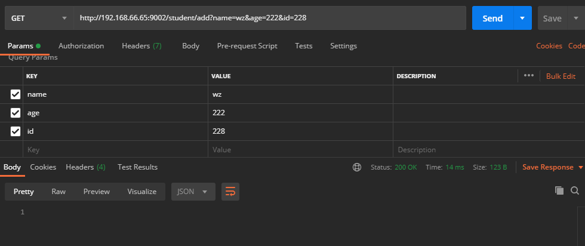

## 数据缓存

[TOC]

### 1、前言

在实际项目中，我们不仅需要实现应用的功能，也需要考虑整个应用的性能问题。当大量用户访问相同数据时，对数据库是个很大的考验。这时候如果使用数据缓存技术了，同样的数据就不需要通过访问数据库获取处理，在应用层面就可以拿到缓存数据，可以减轻数据库的压力、同时也能提高数据的响应速度。

> 那么在Spring Boot中提供哪些缓存支持呢？

`Spring Framework`中提供了对缓存数据的支持，核心是通过在方法中应用缓存方法，然后根据缓存中的已有可用信息来减少大量的执行次数。`Spring Boot`自动携带了缓存的基础配置，我们只需要使用注解`@EnableCaching`即可开启缓存功能。

举例说明;

~~~java
import org.springframework.cache.annotation.Cacheable;
import org.springframework.stereotype.Component;

@Component
public class MathService {

	@Cacheable("piDecimals")
	public int computePiDecimal(int i) {
		// ...
	}

}
~~~

上述的举例是，缓存一个需要复杂计算的计算方法，那么具体是怎么执行的呢？

在`computePiDecimal`方法执行之前，会查找`piDecimals`的缓存，并从中取匹配`i`这个参数，如果数据存在，立刻把数据返回给调用者，然后这个方法`computePiDecimal`并不会执行。否则执行方法，在返回数据给调用者之前就更新数据到缓存中。

如果没有添加指定的缓存库，`Spring Boot`自动配置了一个简单的`Simple Provider`，通过`concurrent maps`保存缓存数据。比如上面的`piDecimals`缓存，当缓存存在时，调用方法时，会通过`simple provider` 直接返回。`simple provider` 不建议应用于正式生产环境，如果只是测试熟悉缓存技术还是不错的。

### 2、**CacheManager**缓存分类

`Spring` 定义 `CacheManager` 和 `Cache` 接口用来统一不同的缓存技术。例如 `JCache、 EhCache、 Hazelcast、 Guava、 Redis` 等。在使用 `Spring` 集成 `Cache` 的时候，我们需要注册实现的 `CacheManager` 的 `Bean。Spring Boot 默认使用的是 SimpleCacheConfiguration，即使用 ConcurrentMapCacheManager 来实现的缓存。`

`CacheManager`是专门用来缓存管理器，管理各种缓存组件的；

针对不同的缓存技术，实现了不同的 `CacheManager` ，`Spring` 定义了下表所示的 `CacheManager`：

| CacheManager              | 描述                                                         |
| ------------------------- | :----------------------------------------------------------- |
| SimpleCacheManager        | 使用简单的 Collection 来存储缓存，主要用于测试               |
| ConcurrentMapCacheManager | 使用 ConcurrentMap 来存储缓存                                |
| NoOpCacheManager          | 仅测试用途，不会实际缓存数据                                 |
| EhCacheCacheManager       | 使用 EhCache 作为缓存技术                                    |
| GuavaCacheManager         | 使用 Google Guava 的 GuavaCache 作为缓存技术                 |
| HazelcastCacheManager     | 使用 Hazelcast 作为缓存技术                                  |
| JCacheCacheManager        | 支持 JCache(JSR-107) 标准的实现作为缓存技术，如 ApacheCommonsJCS |
| RedisCacheManager         | 使用 Redis 作为缓存技术                                      |

缓存接口有以下分类：

1. [Generic](https://docs.spring.io/spring-boot/docs/2.1.6.RELEASE/reference/html/boot-features-caching.html#boot-features-caching-provider-generic)
2. [JCache (JSR-107)](https://docs.spring.io/spring-boot/docs/2.1.6.RELEASE/reference/html/boot-features-caching.html#boot-features-caching-provider-jcache) (EhCache 3, Hazelcast, Infinispan, and others)
3. [EhCache 2.x](https://docs.spring.io/spring-boot/docs/2.1.6.RELEASE/reference/html/boot-features-caching.html#boot-features-caching-provider-ehcache2)
4. [Hazelcast](https://docs.spring.io/spring-boot/docs/2.1.6.RELEASE/reference/html/boot-features-caching.html#boot-features-caching-provider-hazelcast)
5. [Infinispan](https://docs.spring.io/spring-boot/docs/2.1.6.RELEASE/reference/html/boot-features-caching.html#boot-features-caching-provider-infinispan)
6. [Couchbase](https://docs.spring.io/spring-boot/docs/2.1.6.RELEASE/reference/html/boot-features-caching.html#boot-features-caching-provider-couchbase)
7. [Redis](https://docs.spring.io/spring-boot/docs/2.1.6.RELEASE/reference/html/boot-features-caching.html#boot-features-caching-provider-redis)
8. [Caffeine](https://docs.spring.io/spring-boot/docs/2.1.6.RELEASE/reference/html/boot-features-caching.html#boot-features-caching-provider-caffeine)
9. [Simple](https://docs.spring.io/spring-boot/docs/2.1.6.RELEASE/reference/html/boot-features-caching.html#boot-features-caching-provider-simple)

详细列举，请进入[Spring Boot Cache](https://docs.spring.io/spring-boot/docs/2.1.6.RELEASE/reference/html/boot-features-caching.html#boot-features-caching-provider-infinispan)

我们在这里将只讲解`Simple`和`Redis`，`Simple`用于测试，`Redis`用于实际用途。其他的平时不多用，可以自行了解。

### 3、具体实现

#### 3.1、自定义是否开启缓存

`是否开启缓存，有两种方法:`

> 方法一：

在不同环境的配置文件中如application-dev.yml、application-test.yml、application-prod.yml，修改 spring.cache.type = none;

~~~yml
spring:
  cache:
  	type: none	
~~~

> 方法二：
>
> 自定义配置

> application.yml

~~~yml
## 开启数据缓存
caching:
  enabled: true

~~~

> com.scaffold.test.config.CacheConfig
>
> 缓存配置文件

~~~java
@Configuration
@EnableCaching
//配置文件读取是否启用此配置
@ConditionalOnProperty(prefix = "caching", name = "enabled", havingValue = "true")
public class CacheConfig {

}
~~~

#### 3.2、simpleCacheManage

##### 3.2.1、概要介绍

`simpleCacheManage` 基于`ConcurrentHashMap` 实现，不依赖其他库，如果增加了注解`@EnableCaching`，默认开启缓存，可以通过设置`cache-names`限制缓存列表

> 设置缓存列表

> application.yml

~~~yaml
spring:
  cache:
  	type: simple
  	cache-names: cache1,cache2
~~~

> 或者
>
> 增加配置文件 cacheConfig

~~~java
@Configuration
public class CacheConfig {
   @Bean
   public CacheManager cacheManager() {
       return new ConcurrentMapCacheManager("cache1", "cache2");
   }
}
~~~

> maven依赖

~~~xml
<!-- cache 依赖 -->
<dependency>
    <groupId>org.springframework.boot</groupId>
    <artifactId>spring-boot-starter-cache</artifactId>
</dependency>
~~~

==注意：所有的注解是加到实现类方法上的==

| 注解        | 描述                                                         |
| ----------- | :----------------------------------------------------------- |
| @Cacheable  | 在方法执行前 Spring 先查看缓存中是否有数据，若有，则直接返回缓存数据；若无数据，调用方法将方法返回值放入缓存中 |
| @CachePut   | 无论怎样，都会将方法的返回值放到缓存中。                     |
| @CacheEvict | 将一条或多条数据从缓存中删除                                 |
| @Caching    | 可以通过 @Caching 注解组合多个注解策略在一个方法             |

`@Cacheable、@CachePut、@CacheEvict 都有 value 属性`，指定的是要使用的缓存名称；`key 属性指定的是数据在缓存中存储的键`。

##### 3.2.2、代码实现

> 配置类

~~~java
package com.scaffold.test.config;

import org.springframework.boot.autoconfigure.condition.ConditionalOnProperty;
import org.springframework.cache.CacheManager;
import org.springframework.cache.annotation.EnableCaching;
import org.springframework.cache.concurrent.ConcurrentMapCacheManager;
import org.springframework.context.annotation.Bean;
import org.springframework.context.annotation.Configuration;

import java.time.Duration;

/**
 * 缓存配置文件
 * 配置文件读取是否启用此配置
 * @author alex
 */
@Configuration
@EnableCaching
@ConditionalOnProperty(prefix = "caching", name = "enabled", havingValue = "true")
public class CacheConfig {

    @Bean
    public CacheManager cacheManager() {
        return new ConcurrentMapCacheManager("cacheData");
    }
  }
~~~

> 实体类
>
> com.scaffold.test.entity.Student

~~~java
package com.scaffold.test.entity;

import lombok.Data;
import lombok.EqualsAndHashCode;

import java.io.Serializable;

/**
 * @author alex wong
 */
@Data
@EqualsAndHashCode(callSuper = false)
public class Student implements Serializable {

    private static final long serialVersionUID=1L;

    private int id;

    private String name;

    private Integer age;

}

~~~

> service层
>
> com.scaffold.test.service.StudentService

~~~java
package com.scaffold.test.service;

import com.scaffold.test.entity.Student;
import com.baomidou.mybatisplus.extension.service.IService;

import java.util.List;

/**
 * <p>
 * 服务类
 * </p>
 *
 * @author alex wong
 */
public interface StudentService extends IService<Student> {

    List<Student> findAll();

    Student findStudent(Student student);

    Student testStudent(String text);

    void deleteStudent(Student student);

    void saveStudent(Student student);

}

~~~

> service实现类
>
> com.scaffold.test.service.StudentService

~~~java
package com.scaffold.test.service.impl;

import com.baomidou.mybatisplus.extension.service.impl.ServiceImpl;
import com.scaffold.test.entity.Student;
import com.scaffold.test.mapper.StudentMapper;
import com.scaffold.test.service.StudentService;
import lombok.extern.slf4j.Slf4j;
import org.springframework.cache.annotation.CacheEvict;
import org.springframework.cache.annotation.CachePut;
import org.springframework.cache.annotation.Cacheable;
import org.springframework.stereotype.Service;

import javax.annotation.Resource;
import java.util.List;

/**
 * <p>
 *  服务实现类
 * </p>
 *
 * @author alex wong
 */

@Slf4j
@Service
public class StudentServiceImpl extends ServiceImpl<StudentMapper, Student> implements StudentService {

    @Resource
    private StudentMapper studentMapper;

    @Override
    @Cacheable(value = "cacheData")
    public List<Student> findAll(){
        return studentMapper.selectAll();
    }

    /**
     * 缓存查询数据
     * @Cacheable 缓存数据到缓存 student 中
     * 其中缓存名称为 student 数据的 key 是 student 的 id
     * @param student s
     * @return
     */
    @Override
    @Cacheable(value = "cacheData", key = "#student.id")
    public Student findStudent(Student student) {
        log.warn("增加了student为{}的数据缓存", student);
        int id = student.getId();
        if(id == 0){
            return null;
        }
        return studentMapper.findStudent(student);
    }

    /**
     * 删除缓存
     * @CacheEvict 从缓存 student 中删除
     * 其中缓存名称为 student 数据的 key 是 student 的 id
     * @param student s
     */
    @Override
    @CacheEvict(value = "cacheData", key = "#student.id")
    public void deleteStudent(Student student) {
        log.warn("删除了student为{}的数据缓存", student);
    }

    /**
     * @CachePut 缓存新增的或更新的数据到缓存
     * 其中缓存名称为 student 数据的 key 是 student 的 id
     * @param student
     */
    @Override
    @CachePut(value = "cacheData", key = "#student.id")
    public void saveStudent(Student student) {
        log.warn("保存了id、key 为{}的数据缓存", student);
        studentMapper.insertStudent(student);
    }


    @Override
    @Cacheable(value = "cacheData", key = "#text")
    public Student testStudent(String text) {
        System.out.println("test" + text);
        Student student = new Student();
        student.setName(text);
        return student;
    }
}

~~~

> dao层（data access object数据访问层）
>
> com.scaffold.test.mapper.StudentMapper

~~~java
package com.scaffold.test.mapper;

import com.baomidou.mybatisplus.core.mapper.BaseMapper;
import com.scaffold.test.entity.Student;

import java.util.List;

/**
 * <p>
 * Mapper 接口
 * </p>
 *
 * @author alex wong
 */
public interface StudentMapper extends BaseMapper<Student> {

    List<Student> selectAll();

    Student findStudent(Student student);

    int insertStudent(Student student);
}

~~~

> src/main/resources/mapper/StudentMapper.xml

~~~xml
<?xml version="1.0" encoding="UTF-8"?>
<!DOCTYPE mapper PUBLIC "-//mybatis.org//DTD Mapper 3.0//EN" "http://mybatis.org/dtd/mybatis-3-mapper.dtd">
<mapper namespace="com.scaffold.test.mapper.StudentMapper">

    <!-- 通用查询映射结果 -->
    <resultMap id="BaseResultMap" type="com.scaffold.test.entity.Student">
        <result column="id" property="id"/>
        <result column="name" property="name"/>
        <result column="age" property="age"/>
    </resultMap>

    <!-- 通用查询结果列 -->
    <sql id="Base_Column_List">
        id,
        name, age
    </sql>

    <sql id="Where_Condition">
        <where>
            <if test="id != null and id != ''">
                id=#{id}
            </if>
            <if test="name != null and name != ''">
                and name=#{name}
            </if>
            <if test="age != null and age != ''">
                and age=#{age}
            </if>
        </where>
    </sql>

    <insert id="insertStudent">
        insert student
        (id, name, age)
        values
        (#{id}, #{name}, #{age})
    </insert>

    <select id="selectAll" resultMap="BaseResultMap">
        select * from student
    </select>

    <select id="findStudent" resultType="com.scaffold.test.entity.Student">
        select * from student
        <include refid="Where_Condition"></include>
    </select>
</mapper>
~~~

> sql

~~~sql

SET NAMES utf8mb4;
SET FOREIGN_KEY_CHECKS = 0;

-- ----------------------------
-- Table structure for student
-- ----------------------------
DROP TABLE IF EXISTS `student`;
CREATE TABLE `student` (
  `id` int(11) NOT NULL,
  `name` varchar(255) CHARACTER SET utf8mb4 COLLATE utf8mb4_0900_ai_ci NOT NULL,
  `age` int(11) DEFAULT NULL,
  PRIMARY KEY (`id`)
) ENGINE=InnoDB DEFAULT CHARSET=utf8mb4 COLLATE=utf8mb4_0900_ai_ci;

-- ----------------------------
-- Records of student
-- ----------------------------
INSERT INTO `student` VALUES (1, '1', 2323);
INSERT INTO `student` VALUES (2, '2', 2323);
INSERT INTO `student` VALUES (3, '3', 2323);

SET FOREIGN_KEY_CHECKS = 1;
~~~

> Controller层
>
> com.scaffold.test.controller.StudentController

~~~java
package com.scaffold.test.controller;


import com.scaffold.test.entity.Student;
import com.scaffold.test.service.StudentService;
import org.springframework.beans.factory.annotation.Autowired;
import org.springframework.web.bind.annotation.GetMapping;
import org.springframework.web.bind.annotation.RequestMapping;
import org.springframework.web.bind.annotation.RequestParam;
import org.springframework.web.bind.annotation.RestController;

import java.util.List;

/**
 * <p>
 *  前端控制器
 * </p>
 *
 * @author alex wong
 */
@RestController
@RequestMapping("/student")
public class StudentController {

    @Autowired
    private StudentService studentService;

    @GetMapping("list")
    public List<Student> getAll(){
        return studentService.findAll();
    }

    @GetMapping("add")
    public void addStudent(Student student){
        studentService.saveStudent(student);
    }

    @GetMapping("find")
    public Student findStudent(Student student){
        return studentService.findStudent(student);
    }

    @GetMapping("delete")
    public void deleteStudent(Student student){
        studentService.deleteStudent(student);
    }

    @GetMapping("test")
    public Student test(@RequestParam String text){
        return studentService.testStudent(text);
    }
}
~~~

> 接下来测试一下缓存

> ==@Cacheable==
>
> 在方法执行前 Spring 先查看缓存中是否有数据，若有，则直接返回缓存数据；若无数据，调用方法将方法返回值放入缓存中；


第一次执行日志：


第二次执行日志：


日志没有增加，说明没有查询数据库；

我们添加Debuger，测试下方法有没有执行？


结果`findStudent`方法并没有执行，`说明数据全部取自缓存`。

==其他方法测试：==

> ==@CacheEvict==
>
> 将一条或多条数据从缓存中删除

> 添加实现类方法

~~~java
 @Override
 @CacheEvict(value = "cacheData")
 	public void deleteStudent(Student student) {
 	log.warn("删除了student为{}的数据缓存", student);
 }
~~~

> 添加控制器路由

~~~java
@GetMapping("delete")
public void deleteStudent(Student student){
    studentService.deleteStudent(student);
}
~~~


删除缓存后，再次查询会查询Sql库；

> ==@CachePut==
>
> 缓存==新增的或更新的数据==到缓存

> 新增数据

~~~java
/**
     * @CachePut 缓存新增的或更新的数据到缓存
     * 其中缓存名称为 student 数据的 key 是 student 的 id
     * @param student
     */
    @Override
    @CachePut(value = "cacheData", key = "#student.id")
    public void saveStudent(Student student) {
        log.warn("保存了id、key 为{}的数据缓存", student);
        studentMapper.insertStudent(student);
    }
~~~

~~~java
@GetMapping("add")
public void addStudent(Student student){
	studentService.saveStudent(student);
}
~~~

> 先插入一条数据到数据库
>
> 这条数据会被立马缓存起来




> 测试缓存数据，看到并没有查询数据库
>
> ==无sql执行==，说明从缓存里面成功拿到了数据


> 然后删除缓存，重新获取，正确的结果应该是有Sql查询；
>
> postman访问 http://192.168.66.65:9002/student/delete?id=228 删除了id=288的缓存
>
> postman访问 http://192.168.66.65:9002/student/find?id=228 重新查询数据库获取数据


这个流程走下来，三个缓存方法，各自对应的功能都被验证成功。

==缺点：==

缓存数据并不持久，如果当前的服务关闭重启了，所有的缓存数据都会丢失了。

#### 3.3、RedisCacheManage

在实际项目中，大多使用是`Redis`数据库，把所有的缓存数据存储在`Redis`中。

并且可以设置缓存的存活时间，超过一定时间后，自动获取最新数据。

缓存的方法同上, 不再赘述。

> 配置文件

~~~yaml
server:
  port: 9002

spring:
  redis:
    # Redis服务器地址
    host: 127.0.0.1
    # Redis服务器连接端口
    port: 6379
    # Redis服务器连接密码（默认为空）
    password:
    # 连接超时时间（毫秒）
    timeout: 0
    jedis:
      pool:
        # 连接池最大连接数（使用负值表示没有限制）
        max-active: 8
        # 连接池最大阻塞等待时间（使用负值表示没有限制）
        max-wait: -1
        # 连接池中的最大空闲连接
        max-idle: 8
        # 连接池中的最小空闲连接
        min-idle: 0
    # Redis数据库索引（默认为0）
    database: 0
  # 缓存数据
#  cache:
##    type: simple
#    type: redis
#    cache-names: cacheData
#    redis:
#      time-to-live: 600000
#      use-key-prefix: false
#      cache-null-values: off
#      key-prefix: test
~~~

~~~xml
<!-- redisson 分布锁  -->
<dependency>
    <groupId>org.redisson</groupId>
    <artifactId>redisson</artifactId>
    <version>3.13.3</version>
</dependency>
~~~

> 修改配置文件 cacheConfig

~~~java
package com.scaffold.test.config;

import org.springframework.boot.autoconfigure.condition.ConditionalOnProperty;
import org.springframework.cache.annotation.EnableCaching;
import org.springframework.context.annotation.Configuration;

/**
 * 缓存配置文件
 * 配置文件读取是否启用此配置
 * @author alex
 */
@Configuration
@EnableCaching
@ConditionalOnProperty(prefix = "caching", name = "enabled", havingValue = "true")
public class CacheConfig {

//    @Bean
//    public CacheManager cacheManager() {
//        return new ConcurrentMapCacheManager("cacheData");
//    }

}

~~~

> `RedisConf`
>
> 添加`CacheManage`配置

~~~java
package com.scaffold.test.config;

import com.fasterxml.jackson.annotation.JsonAutoDetect;
import com.fasterxml.jackson.annotation.PropertyAccessor;
import com.fasterxml.jackson.databind.ObjectMapper;
import org.redisson.Redisson;
import org.redisson.api.RedissonClient;
import org.redisson.codec.JsonJacksonCodec;
import org.redisson.config.Config;
import org.springframework.cache.CacheManager;
import org.springframework.context.annotation.Bean;
import org.springframework.context.annotation.Configuration;
import org.springframework.data.redis.cache.RedisCacheConfiguration;
import org.springframework.data.redis.cache.RedisCacheManager;
import org.springframework.data.redis.connection.RedisConnectionFactory;
import org.springframework.data.redis.core.RedisTemplate;
import org.springframework.data.redis.serializer.Jackson2JsonRedisSerializer;
import org.springframework.data.redis.serializer.RedisSerializationContext;
import org.springframework.data.redis.serializer.RedisSerializer;
import org.springframework.data.redis.serializer.StringRedisSerializer;

import javax.annotation.Resource;
import java.time.Duration;

@Configuration
public class RedisConfig {

    @Resource
    private RedisTemplate<String, Object> redisTemplate;

    /**
     * 单机模式
     */
    @Bean
    RedissonClient RedissonSingle() {
        Config config = new Config();
        config.setCodec(new JsonJacksonCodec())
                .useSingleServer()
                .setAddress("redis://localhost:6379");
        return Redisson.create(config);
    }

    @Bean
    public RedisTemplate<String, Object> setRedisTemplate() {
        // 使用 Jackson2JsonRedisSerialize 替换默认序列化
        Jackson2JsonRedisSerializer jackson2JsonRedisSerializer = new Jackson2JsonRedisSerializer(Object.class);
        ObjectMapper objectMapper = new ObjectMapper();
        objectMapper.setVisibility(PropertyAccessor.ALL, JsonAutoDetect.Visibility.ANY);
        objectMapper.enableDefaultTyping(ObjectMapper.DefaultTyping.NON_FINAL);
        jackson2JsonRedisSerializer.setObjectMapper(objectMapper);
        // 字符串序列化
        RedisSerializer stringSerializer = new StringRedisSerializer();
        redisTemplate.setKeySerializer(stringSerializer);
        // value 使用 Jackson2JsonRedisSerialize 序列化
        redisTemplate.setValueSerializer(jackson2JsonRedisSerializer);
        redisTemplate.setHashKeySerializer(stringSerializer);
        redisTemplate.setHashValueSerializer(stringSerializer);
        return redisTemplate;
    }

    private Duration timeToLive = Duration.ofSeconds(600);

    @Bean
    public CacheManager cacheManager(RedisConnectionFactory factory) {
        // RedisSerializer<String> redisSerializer = new StringRedisSerializer();
        // 解决从redis数据缓存value使用Jackson2JsonRedisSerialize序列化
        Jackson2JsonRedisSerializer jackson2JsonRedisSerializer = new Jackson2JsonRedisSerializer(Object.class);

        //解决查询缓存转换异常的问题
        ObjectMapper om = new ObjectMapper();
        om.setVisibility(PropertyAccessor.ALL, JsonAutoDetect.Visibility.ANY);
        om.enableDefaultTyping(ObjectMapper.DefaultTyping.NON_FINAL);
        jackson2JsonRedisSerializer.setObjectMapper(om);

        // 配置序列化（解决乱码的问题）
        RedisCacheConfiguration config = RedisCacheConfiguration.defaultCacheConfig()
                // 设置缓存的存活时间
                .entryTtl(timeToLive)
                // 设置缓存名字的前缀
                .prefixCacheNameWith("test")
                // 禁止缓存名字的前缀
                .disableKeyPrefix()
                // 序列化value数据
                .serializeValuesWith(RedisSerializationContext.SerializationPair.fromSerializer(jackson2JsonRedisSerializer))
                // 禁止缓存 Null 数据
                .disableCachingNullValues();

        RedisCacheManager cacheManager = RedisCacheManager.builder(factory).cacheDefaults(config).build();
        return cacheManager;
    }
}
~~~

一般情况，可以在配置中，修改配置，我们这里增加配置文件全权控制的原因是，==需要格式化存储的数据，否则看到的不是JSON格式的数据==。

以上配置等同于以下配置：

~~~yaml
  spring: 
    cache:
      type: redis
      cache-names: cacheData
      redis:
        time-to-live: 600000
        use-key-prefix: false
        cache-null-values: off
        key-prefix: test
~~~

其余代码同 `3.2.2`，切换缓存方式，只需要更改配置即可。

> 接下来让我们测试一下Redis存储缓存数据。
>
> postman访问  http://192.168.66.65:9002/student/find?id=228


在`600s`的时间范围内，即使重启项目，依然能否获取到缓存数据。

> .prefixCacheNameWith("test")


> 移除序列化的代码
>
> ```
> .serializeValuesWith(RedisSerializationContext.SerializationPair.fromSerializer(jackson2JsonRedisSerializer))
> ```


> 删除缓存
>
> postman 访问 http://192.168.66.65:9002/student/delete?id=228
>
> 删除redis中的缓存数据


==删除成功==

### 4、总结

以上就是简单的数据缓存案例，Springboot集成Redis缓存是比较常用的。其他缓存方法这里不再说明。

