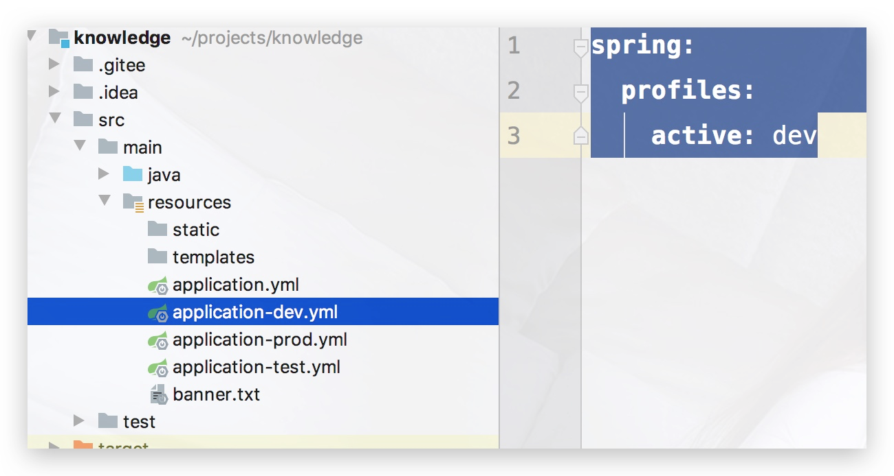
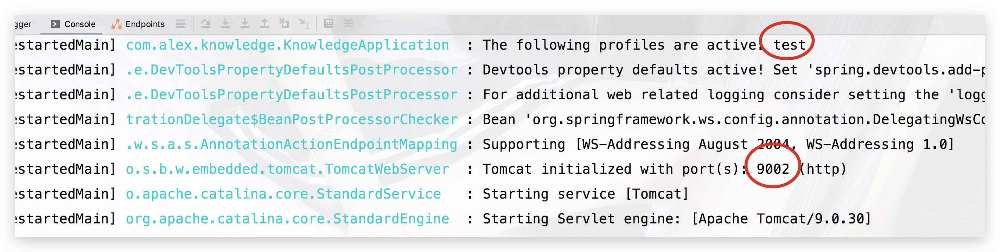
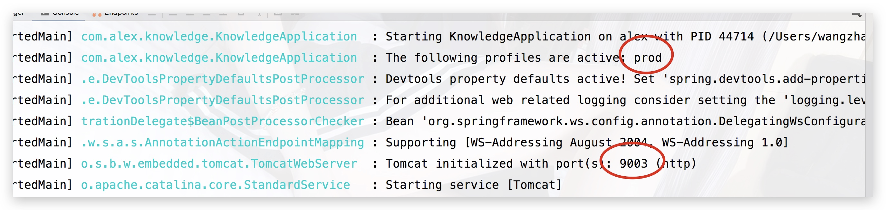
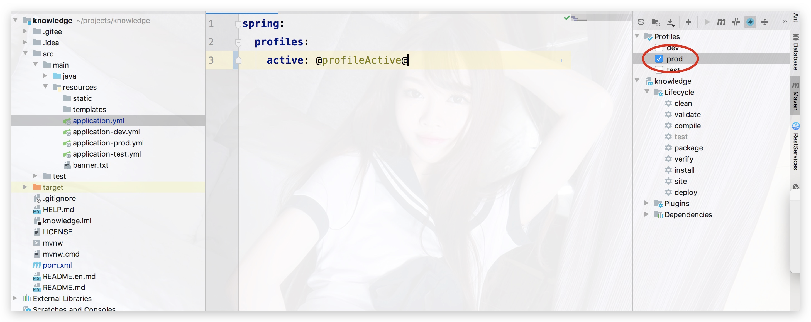
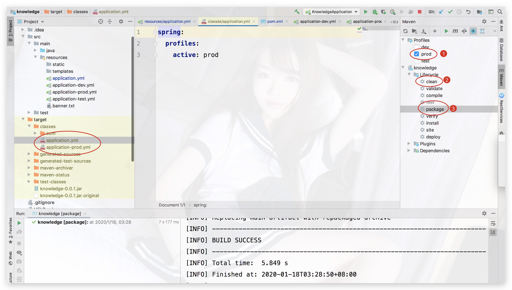

## 1、yml多环境配置

在`Spring Boot`中多环境配置文件名需要满足`application-{profile}.yml`的格式，其中`{profile}`对应你的环境标识;

```yml
application-dev 开发环境
application-test 测试环境
application-prod 生产环境
```
如果我们要激活某一个环境，只需要在 `application.yml`里：

```yml
spring:
  profiles:
    active: dev
```




此外，假设我们配置一些基本设置如：

`application-dev.yml`
```yml
server:
  port: 9001
```

`application-test.yml`
```yml
server:
  port: 9002
```

`application-prod.yml`
```yml
server:
  port: 9003
```

此时，当我们去修改`application.yml`：

1) 改为 `dev`


2) 改为 `test`




3) 改为 `prod`




## 2、创建多环境profile打包

通过上述步骤，可以轻松切换当前环境，不过也稍微有些麻烦，那是否有一些配置文件可以`代替手动更改profile并且能创建多环境profile打包呢`？
```
答案是肯定的
```
> pom.xml

pom文件中添加profile节点，并在build下的resources节点添加打包过滤的配置文件规则

```xml
    <profiles>
        <profile>
            <!--	开发环境		-->
            <id>dev</id>
            <properties>
                <profileActive>dev</profileActive>
            </properties>
            <!--	默认激活的环境		-->
            <activation>
                <activeByDefault>true</activeByDefault>
            </activation>
        </profile>
        <profile>
            <!--	测试环境		-->
            <id>test</id>
            <properties>
                <profileActive>test</profileActive>
            </properties>
        </profile>
        <profile>
            <!--	生产环境		-->
            <id>prod</id>
            <properties>
                <profileActive>prod</profileActive>
            </properties>
        </profile>
    </profiles>
    
    <build>
        <resources>
            <resource>
                <directory>src/main/resources</directory>
                <includes>
                    <include>application-${profileActive}.yml</include>
                    <include>application.yml</include>
                    <include>**/*.xml</include>
                </includes>
                <filtering>true</filtering>
            </resource>
            <resource>
                <directory>src/main/java</directory>
                <includes>
                    <include>**/*.xml</include>
                </includes>
            </resource>
        </resources>
    </build>

```

在`application.yml`中配置一个动态属性进行占位，默认的分隔符是@属性名@，这个属性会通过maven打包时传入参数进行替换;

```
spring:
  profiles:
    active: @profileActive@
```




右侧的可视化选择环境，让工作更加变得高效；

> maven 多环境打包

打包过滤配置文件规则也是用一个占位符进行占位，打包时也会通过maven传入参数进行替换。

* 1、`通过 -D命令传入属性值profileActive`，如：

```
clean install -Dmaven.test.skip=true -DprofileActive=dev
```

* 2、`通过-P命令指定profile环境`，如：

```
clean package -P prod
```

右侧可视化选择更加方便：





🆗闲话不多说，好了，这一小章到此结束；

代码仓库地址：[点击进入](https://gitee.com/master2011zhao/knowledge)