## 参数校验

[TOC]

### 1、前言

在业务系统，参数校验是比较头疼的事情，有些实体类长达几十个字段，大篇幅的`if-else`，不仅让写代码的童鞋头疼，后续接收这个项目的人， 看到这些代码，估计更加头疼。

那么如何避免这些冗余的代码呢？

在`Spring Boot`我们可以使用`Validation`校验参数；

~~~xml
<!-- 参数校验 -->
<dependency>
    <groupId>org.springframework.boot</groupId>
    <artifactId>spring-boot-starter-validation</artifactId>
</dependency>
~~~

> 约束性注解如下：

| 注解         | 功能                                                         |
| ------------ | ------------------------------------------------------------ |
| @AssertFalse | 可以为null,如果不为null的话必须为false                       |
| @AssertTrue  | 可以为null,如果不为null的话必须为true                        |
| @DecimalMax  | 设置不能超过最大值                                           |
| @DecimalMin  | 设置不能超过最小值                                           |
| @Digits      | 设置必须是数字且数字整数的位数和小数的位数必须在指定范围内   |
| @Future      | 日期必须在当前日期的未来                                     |
| @Past        | 日期必须在当前日期的过去                                     |
| @Max         | 最大不得超过此最大值                                         |
| @Min         | 最大不得小于此最小值                                         |
| @NotNull     | 不能为null，可以是空                                         |
| @Null        | 必须为null                                                   |
| @Pattern     | 必须满足指定的正则表达式                                     |
| @Size        | 集合、数组、map等的size()值必须在指定范围内                  |
| @Email       | 必须是email格式                                              |
| @Length      | 长度必须在指定范围内                                         |
| @NotBlank    | 字符串不能为null,字符串trim()后也不能等于“”                  |
| @NotEmpty    | 不能为null，集合、数组、map等size()不能为0；字符串trim()后可以等于“” |
| @Range       | 值必须在指定范围内                                           |
| @URL         | 必须是一个URL                                                |

### 2、代码实现

#### 2.1、valiation校验

> Student实体类

~~~java
package com.scaffold.test.entity;

import lombok.Data;
import lombok.EqualsAndHashCode;
import org.hibernate.validator.constraints.Range;

import javax.validation.constraints.NotBlank;
import javax.validation.constraints.NotNull;
import java.io.Serializable;

/**
 * @author alex wong
 */
@Data
@EqualsAndHashCode(callSuper = false)
public class Student implements Serializable {

    private static final long serialVersionUID=1L;

    @Range(min = 1, message = "id不能为空")
    private int id;

    @NotBlank(message = "name不能为空")
    private String name;

    @NotNull(message = "age不能为空")
    private Integer age;

}
~~~

> com.scaffold.test.controller.StudentController

~~~java
package com.scaffold.test.controller;

import com.scaffold.test.entity.Student;
import com.scaffold.test.service.StudentService;
import lombok.extern.slf4j.Slf4j;
import org.springframework.beans.factory.annotation.Autowired;
import org.springframework.validation.BindingResult;
import org.springframework.validation.ObjectError;
import org.springframework.validation.annotation.Validated;
import org.springframework.web.bind.annotation.GetMapping;
import org.springframework.web.bind.annotation.RequestMapping;
import org.springframework.web.bind.annotation.RequestParam;
import org.springframework.web.bind.annotation.RestController;

import java.util.List;

/**
 * <p>
 *  前端控制器
 * </p>
 *
 * @author alex wong
 */

@Slf4j
@RestController
@RequestMapping("/student")
public class StudentController {
    
    @GetMapping("add")
    public String addStudent(@Validated Student student, BindingResult bindingResult){
        if(bindingResult.hasErrors()){
            if(bindingResult.hasErrors()){
                for (ObjectError error: bindingResult.getAllErrors()) {
                    log.error(error.getDefaultMessage());
                    return error.getDefaultMessage();
                }
            }
        }
        return "add";
    }
}
~~~

> postman 访问 http://192.168.66.65:9002/student/add

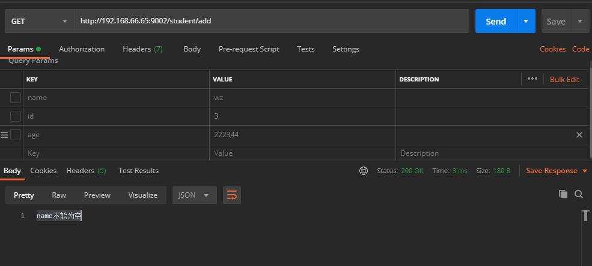

> postman 访问 http://192.168.66.65:9002/student/add?name=wz

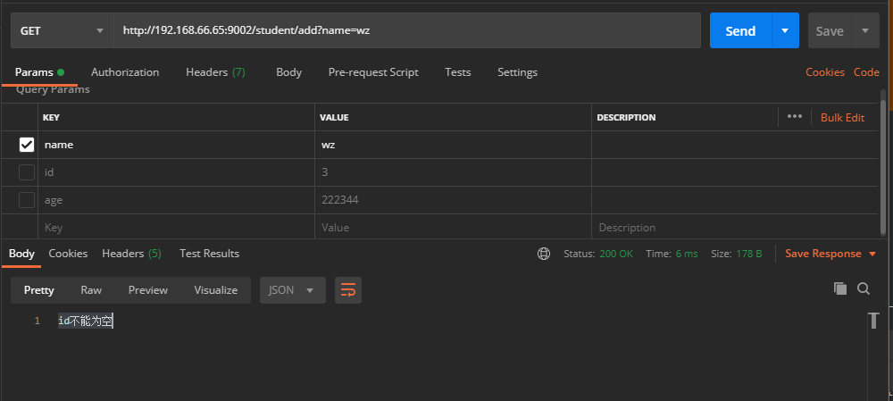

> postman 访问 http://192.168.66.65:9002/student/add?name=wz&id=3

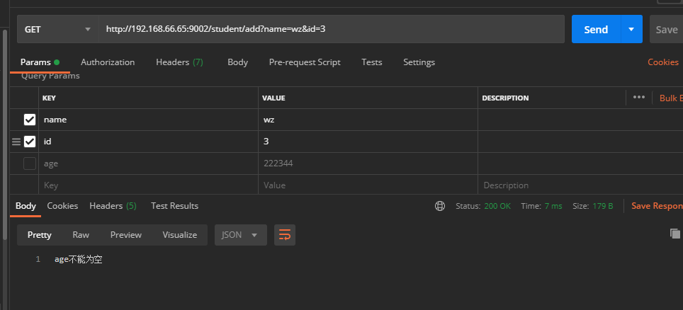

所有的错误提醒都是通过`bindingResult`以下代码实现的：

~~~java
if(bindingResult.hasErrors()){
    if(bindingResult.hasErrors()){
        for (ObjectError error: bindingResult.getAllErrors()) {
            log.error(error.getDefaultMessage());
            return error.getDefaultMessage();
        }
    }
}
~~~

使用`BindingResult`类来容纳异常信息，当校验不通过时，我们只需要处理`BindingResult`中的异常信息即可；

如果每个接口代码都加这段代码，似乎依旧有些麻烦，那么该怎么做呢？

能否通过全局错误捕捉呢？

#### 2.2、添加全局异常处理

`我们修改代码添加 @Validated：`

~~~java
@RestController
@RequestMapping("/student")
public class StudentController {    
    
	@GetMapping("add")
    public String addStudent(@Validated Student student){
        return studentService.saveStudent(student);
    }
}
~~~


> 添加全局异常处理
>
> com.scaffold.test.config.WebMvcConfig

~~~java
package com.scaffold.test.config;

import com.alibaba.fastjson.JSON;
import com.scaffold.test.base.Result;
import com.scaffold.test.base.ResultCode;
import com.scaffold.test.base.ServiceException;
import com.scaffold.test.config.interceptor.AuthenticationInterceptor;
import org.slf4j.Logger;
import org.slf4j.LoggerFactory;
import org.springframework.context.annotation.Bean;
import org.springframework.context.annotation.Configuration;
import org.springframework.web.method.HandlerMethod;
import org.springframework.web.servlet.HandlerExceptionResolver;
import org.springframework.web.servlet.ModelAndView;
import org.springframework.web.servlet.config.annotation.InterceptorRegistry;
import org.springframework.web.servlet.config.annotation.WebMvcConfigurer;

import javax.servlet.ServletException;
import javax.servlet.http.HttpServletResponse;
import java.io.IOException;
import java.util.List;

/**
 * @author alex
 */

@Configuration
public class WebMvcConfig implements WebMvcConfigurer {

    private final Logger logger = LoggerFactory.getLogger(WebMvcConfigurer.class);

    /**
     * 统一异常处理
     * @param exceptionResolvers
     */
    @Override
    public void configureHandlerExceptionResolvers(List<HandlerExceptionResolver> exceptionResolvers) {
        exceptionResolvers.add((request, response, handler, e) -> {
            Result result = new Result();
            // 异常处理
            if (e instanceof ServiceException) {
                // 1、业务失败的异常，如“账号或密码错误”
                result.setCode(ResultCode.FAIL).setMessage(e.getMessage());
                logger.info(e.getMessage());
            }else if (e instanceof ServletException) {
                // 2、调用失败
                result.setCode(ResultCode.FAIL).setMessage(e.getMessage());
            } else {
                // 3、内部其他错误
                result.setCode(ResultCode.INTERNAL_SERVER_ERROR).setMessage("接口 [" + request.getRequestURI() + "] 内部错误，请联系管理员");
                String message;
                if (handler instanceof HandlerMethod) {
                    HandlerMethod handlerMethod = (HandlerMethod) handler;
                    message = String.format("接口 [%s] 出现异常，方法：%s.%s，异常摘要：%s",
                            request.getRequestURI(),
                            handlerMethod.getBean().getClass().getName(),
                            handlerMethod.getMethod().getName(),
                            e.getMessage());
                } else {
                    message = e.getMessage();
                }
                result.setMessage(message);
                logger.error(message, e);
            }
            responseResult(response, result);
            return new ModelAndView();
        });
    }

    // 处理响应数据格式
    private void responseResult(HttpServletResponse response, Result result) {
        response.setCharacterEncoding("UTF-8");
        response.setHeader("Content-type", "application/json;charset=UTF-8");
        response.setStatus(200);
        try {
            response.getWriter().write(JSON.toJSONString(result));
        } catch (IOException ex) {
            logger.error(ex.getMessage());
        }
    }

}
~~~

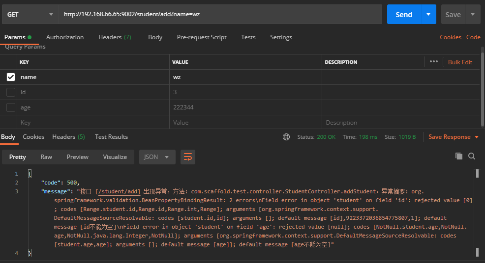

但是, 这样的错误`message`看起来是还是比较乱。

~~~java
org.springframework.validation.BeanPropertyBindingResult: 2 errors\nField error in object 'student' on field 'id': rejected value [0]; codes [Range.student.id,Range.id,Range.int,Range]; arguments [org.springframework.context.support.DefaultMessageSourceResolvable: codes [student.id,id]; arguments []; default message [id],9223372036854775807,1]; default message [id不能为空]\nField error in object 'student' on field 'age': rejected value [null]; codes [NotNull.student.age,NotNull.age,NotNull.java.lang.Integer,NotNull]; arguments [org.springframework.context.support.DefaultMessageSourceResolvable: codes [student.age,age]; arguments []; default message [age]]; default message [age不能为空]
~~~

理想中的`message`应该是：

~~~json
{
    "code": 500,
    "message": "id不能为空, age不能为空"
}
~~~

`那么该如何处理呢？`

~~~java
package com.scaffold.test.config;

import com.alibaba.fastjson.JSON;
import com.scaffold.test.base.Result;
import com.scaffold.test.base.ResultCode;
import com.scaffold.test.base.ServiceException;
import com.scaffold.test.config.interceptor.AuthenticationInterceptor;
import org.slf4j.Logger;
import org.slf4j.LoggerFactory;
import org.springframework.context.annotation.Bean;
import org.springframework.context.annotation.Configuration;
import org.springframework.validation.BindingResult;
import org.springframework.validation.ObjectError;
import org.springframework.web.method.HandlerMethod;
import org.springframework.web.servlet.HandlerExceptionResolver;
import org.springframework.web.servlet.ModelAndView;
import org.springframework.web.servlet.config.annotation.InterceptorRegistry;
import org.springframework.web.servlet.config.annotation.WebMvcConfigurer;

import javax.servlet.ServletException;
import javax.servlet.http.HttpServletResponse;
import java.io.IOException;
import java.util.List;

/**
 * @author alex
 */

@Configuration
public class WebMvcConfig implements WebMvcConfigurer {

    private final Logger logger = LoggerFactory.getLogger(WebMvcConfigurer.class);

    /**
     * 统一异常处理
     *
     * @param exceptionResolvers
     */
    @Override
    public void configureHandlerExceptionResolvers(List<HandlerExceptionResolver> exceptionResolvers) {
        exceptionResolvers.add((request, response, handler, e) -> {
            Result result = new Result();
            // 异常处理
            // 参数异常判断
            if (e instanceof BindingResult) {
                StringBuilder errorMessage = new StringBuilder();
                List<ObjectError> allErrors = ((BindingResult) e).getAllErrors();
                for (int i = 0; i < allErrors.size(); i++) {
                    errorMessage.append(allErrors.get(i).getDefaultMessage());
                    if (i != allErrors.size() - 1) {
                        errorMessage.append(",");
                    }
                }
                result.setCode(ResultCode.FAIL).setMessage(errorMessage.toString());
                logger.error(errorMessage.toString());
            } else if (e instanceof ServiceException) {
                // 1、业务失败的异常，如“账号或密码错误”
                result.setCode(ResultCode.FAIL).setMessage(e.getMessage());
                logger.info(e.getMessage());
            } else if (e instanceof ServletException) {
                // 2、调用失败
                result.setCode(ResultCode.FAIL).setMessage(e.getMessage());
            } else {
                // 3、内部其他错误
                result.setCode(ResultCode.INTERNAL_SERVER_ERROR).setMessage("接口 [" + request.getRequestURI() + "] 内部错误，请联系管理员");
                String message;
                if (handler instanceof HandlerMethod) {
                    HandlerMethod handlerMethod = (HandlerMethod) handler;
                    message = String.format("接口 [%s] 出现异常，方法：%s.%s，异常摘要：%s",
                            request.getRequestURI(),
                            handlerMethod.getBean().getClass().getName(),
                            handlerMethod.getMethod().getName(),
                            e.getMessage());
                } else {
                    message = e.getMessage();
                }
                result.setMessage(message);
                logger.error(message, e);
            }
            responseResult(response, result);
            return new ModelAndView();
        });
    }

    // 处理响应数据格式
    private void responseResult(HttpServletResponse response, Result result) {
        response.setCharacterEncoding("UTF-8");
        response.setHeader("Content-type", "application/json;charset=UTF-8");
        response.setStatus(200);
        try {
            response.getWriter().write(JSON.toJSONString(result));
        } catch (IOException ex) {
            logger.error(ex.getMessage());
        }
    }
}
~~~

新增一个`BindingResult判断逻辑`：

~~~java
// 参数异常判断
if (e instanceof BindingResult) {
    StringBuilder errorMessage = new StringBuilder();
    List<ObjectError> allErrors = ((BindingResult) e).getAllErrors();
    for (int i = 0; i < allErrors.size(); i++) {
        errorMessage.append(allErrors.get(i).getDefaultMessage());
        if (i != allErrors.size() - 1) {
            errorMessage.append(",");
        }
    }
    result.setCode(ResultCode.FAIL).setMessage(errorMessage.toString());
    logger.error(errorMessage.toString());
}
~~~

`效果如下：`

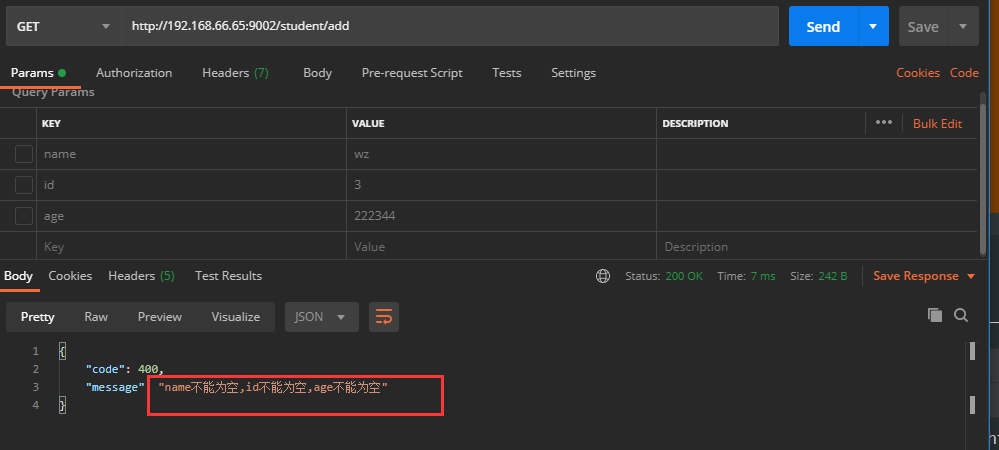

`这样的错误Message返回，显得优美了许多`。

`我们上面一直使用是HTTP的Get请求，那么POST请求会不会有问题呢`？

我们新增一个路由`/student/post`：

~~~java
    /**
     * 添加学生
     * @param student
     * @return
     */
    @PostMapping("post")
    public Result postStudent(@Validated Student student) {
        return ResultGenerator.setSuccessResult(student);
    }
~~~

当前接收方式，需要前端使用`FromData`或者`xxx-www-form-urlencoded`的格式传递参数。我们使用`Postman`模拟一下：

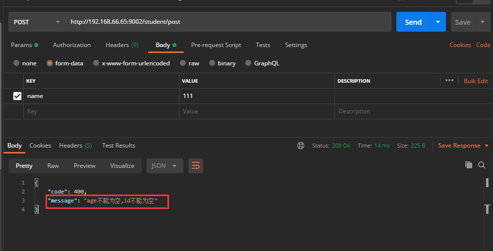

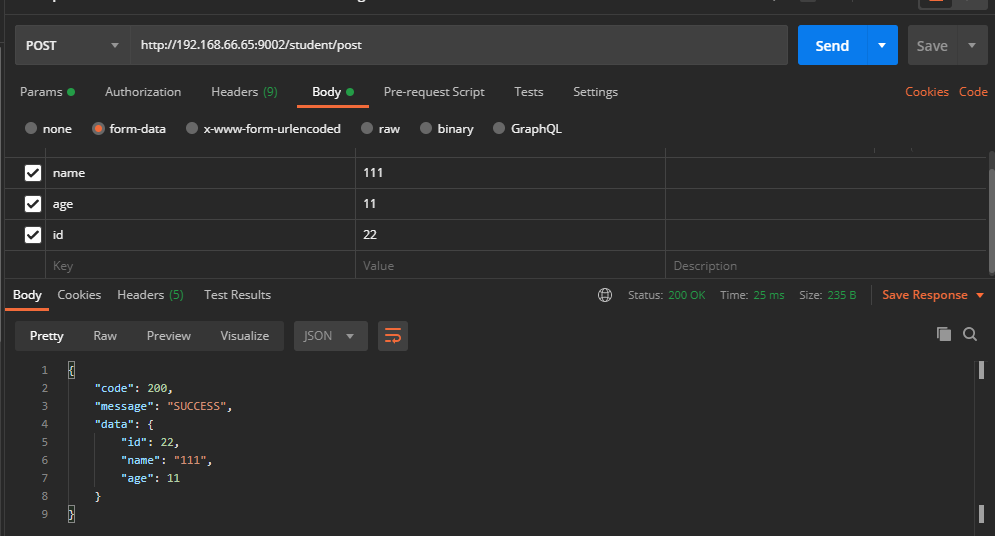

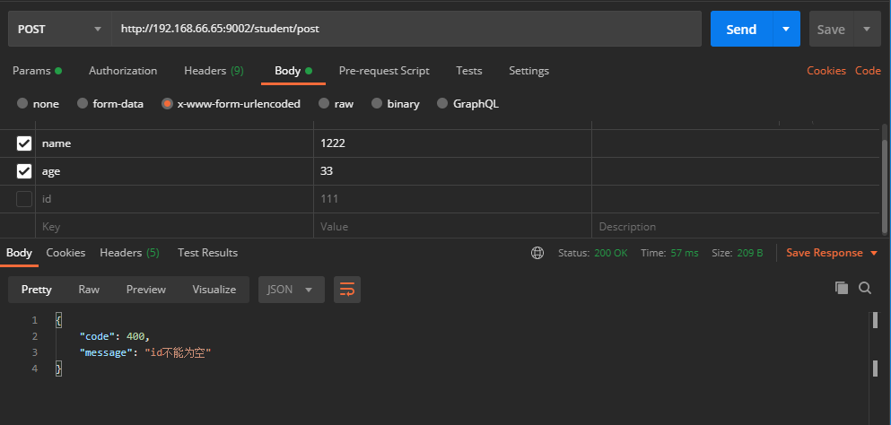

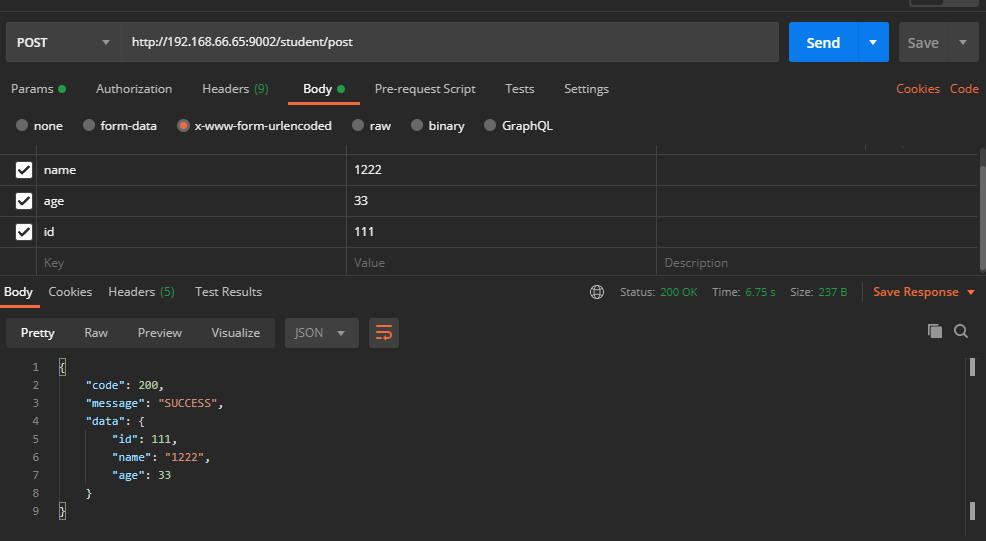

`参数校验正常；`

那么使用`@RequestBody`，接收数据呢？

`@RequestBody`主要用来接收前端传递给后端的json字符串中的数据的(请求体中的数据的)；

~~~java
    /**
     * 添加学生
     * @param student
     * @return
     */
    @PostMapping("post")
    public Result postStudent(@Validated @RequestBody Student student) {
        return ResultGenerator.setSuccessResult(student);
    }
~~~

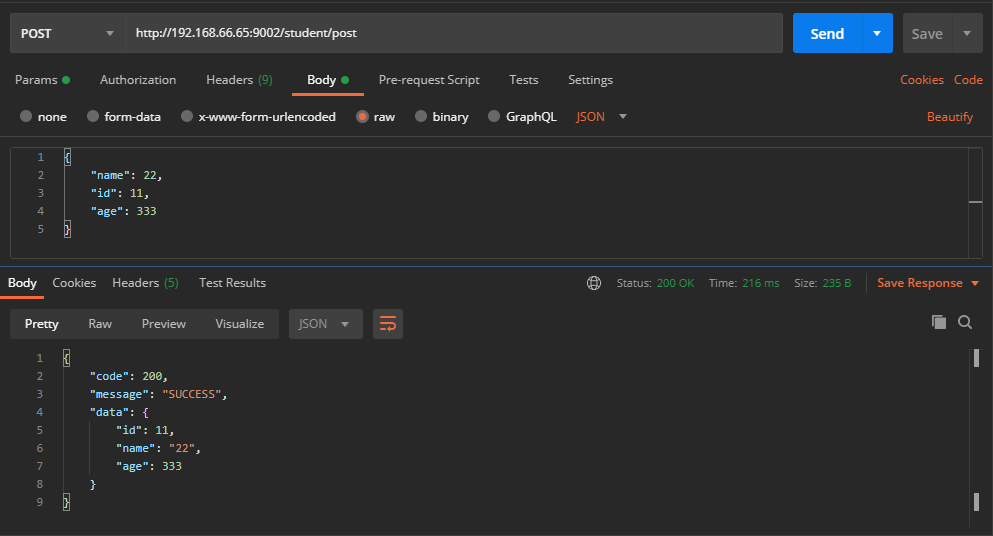

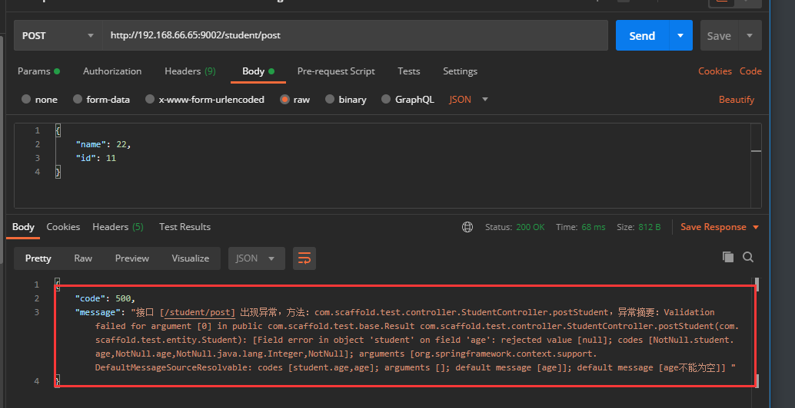

问题来了，返回的`message`并没有被格式化，那说明返回的`Exception`不是继承于`BindResult`;

使用`@RequestBody`注解，对应的`Excepiton`类型为`MethodArgumentNotValidException`；

所以我们需要修改下全局异常判断代码：

~~~java
package com.scaffold.test.config;

import com.alibaba.fastjson.JSON;
import com.scaffold.test.base.Result;
import com.scaffold.test.base.ResultCode;
import com.scaffold.test.base.ServiceException;
import com.scaffold.test.config.interceptor.AuthenticationInterceptor;
import org.slf4j.Logger;
import org.slf4j.LoggerFactory;
import org.springframework.context.annotation.Bean;
import org.springframework.context.annotation.Configuration;
import org.springframework.validation.BindingResult;
import org.springframework.validation.ObjectError;
import org.springframework.web.bind.MethodArgumentNotValidException;
import org.springframework.web.method.HandlerMethod;
import org.springframework.web.servlet.HandlerExceptionResolver;
import org.springframework.web.servlet.ModelAndView;
import org.springframework.web.servlet.config.annotation.InterceptorRegistry;
import org.springframework.web.servlet.config.annotation.WebMvcConfigurer;

import javax.servlet.ServletException;
import javax.servlet.http.HttpServletResponse;
import java.io.IOException;
import java.util.List;

/**
 * @author alex
 */

@Configuration
public class WebMvcConfig implements WebMvcConfigurer {

    private final Logger logger = LoggerFactory.getLogger(WebMvcConfigurer.class);

    /**
     * 统一异常处理
     *
     * @param exceptionResolvers
     */
    @Override
    public void configureHandlerExceptionResolvers(List<HandlerExceptionResolver> exceptionResolvers) {
        exceptionResolvers.add((request, response, handler, e) -> {
            Result result = new Result();
            // 异常处理
            // 参数异常判断
            if (e instanceof BindingResult || e instanceof MethodArgumentNotValidException) {
                StringBuilder errorMessage = new StringBuilder();
                List<ObjectError> allErrors;
                if (e instanceof BindingResult) {
                    allErrors = ((BindingResult) e).getAllErrors();
                } else {
                    BindingResult bindingResult = ((MethodArgumentNotValidException) e).getBindingResult();
                    allErrors = bindingResult.getAllErrors();
                }
                for (int i = 0; i < allErrors.size(); i++) {
                    errorMessage.append(allErrors.get(i).getDefaultMessage());
                    if (i != allErrors.size() - 1) {
                        errorMessage.append(",");
                    }
                }
                result.setCode(ResultCode.FAIL).setMessage(errorMessage.toString());
                logger.error(errorMessage.toString());
            } else if (e instanceof ServiceException) {
                // 1、业务失败的异常，如“账号或密码错误”
                result.setCode(ResultCode.FAIL).setMessage(e.getMessage());
                logger.info(e.getMessage());
            } else if (e instanceof ServletException) {
                // 2、调用失败
                result.setCode(ResultCode.FAIL).setMessage(e.getMessage());
            } else {
                // 3、内部其他错误
                result.setCode(ResultCode.INTERNAL_SERVER_ERROR).setMessage("接口 [" + request.getRequestURI() + "] 内部错误，请联系管理员");
                String message;
                if (handler instanceof HandlerMethod) {
                    HandlerMethod handlerMethod = (HandlerMethod) handler;
                    message = String.format("接口 [%s] 出现异常，方法：%s.%s，异常摘要：%s",
                            request.getRequestURI(),
                            handlerMethod.getBean().getClass().getName(),
                            handlerMethod.getMethod().getName(),
                            e.getMessage());
                } else {
                    message = e.getMessage();
                }
                result.setMessage(message);
                logger.error(message, e);
            }
            responseResult(response, result);
            return new ModelAndView();
        });
    }

    // 处理响应数据格式
    private void responseResult(HttpServletResponse response, Result result) {
        response.setCharacterEncoding("UTF-8");
        response.setHeader("Content-type", "application/json;charset=UTF-8");
        response.setStatus(200);
        try {
            response.getWriter().write(JSON.toJSONString(result));
        } catch (IOException ex) {
            logger.error(ex.getMessage());
        }
    }

}
~~~

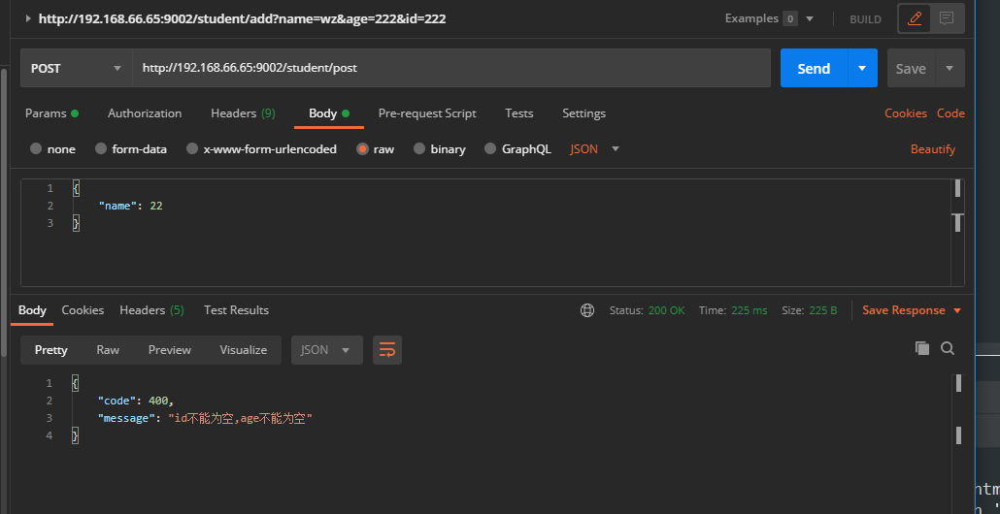

`message`格式如图所示，已经转换正确。

#### 2.3、@Validated 和 @Valid

我们上面使用的是`@Validated`注解，其实还有一个注解`@Valid`；

`那么他们之间的区别是什么呢？`

`Validator接口`有两个接口，一个是位于`javax.validation`包下，另一个位于`org.springframework.validation`包下。注意`@Valid`是前者`javax.validation`，`@Validated`是`Spring`内置的校验接口;

`@Validated`或者`@Valid`在基本验证功能上差不多。但是在`注解`、`嵌套验证`、`分组`等功能上两个有不同的地方。

##### 2.3.1、注解的不同之处

> `@Validated`：
>
> 可以用在`类型`、`方法`和`方法参数`上。但是`不能用在成员属性（字段）上`；
>
> `用在方法入参上无法单独提供嵌套验证功能;`
>
> `不能`用在成员属性（字段）上，也无法提示框架进行嵌套验证;
>
> `能配合嵌套验证注解@Valid进行嵌套验证`；

> `@Valid`：
>
> 可以用在`方法、构造函数、方法参数`和`成员属性（字段）`上；
>
> `用在方法入参上无法单独提供嵌套验证功能`;
>
> `能`够用在`成员属性（字段）`上，提示验证框架进行`嵌套验证`;
>
> `能配合嵌套验证注解 @Valid 进行嵌套验证;`

##### 2.3.2、嵌套功能的不同之处

假设`Student`实体类中有一个嵌套实体`Mate`，如下：

~~~java
package com.scaffold.test.entity;

import lombok.Data;
import lombok.EqualsAndHashCode;
import org.hibernate.validator.constraints.Range;
import org.springframework.data.annotation.Id;

import javax.validation.Valid;
import javax.validation.constraints.NotBlank;
import javax.validation.constraints.NotNull;
import javax.validation.constraints.Size;
import java.io.Serializable;
import java.util.List;

/**
 *
 * @author alex wong
 */
@Data
@EqualsAndHashCode(callSuper = false)
public class Student implements Serializable {

    private static final long serialVersionUID=1L;

    @Id
    @Range(min = 1, message = "id不能为空")
    private int id;

    @NotBlank(message = "name不能为空")
    private String name;

    @NotNull(message = "age不能为空")
    private Integer age;

    // 伙伴列表
    @NotNull(message = "mateList不能为空")
    @Size(min = 1, message = "至少需要一个小伙伴")
    private List<Mate> mateList;

}
~~~

~~~java
package com.scaffold.test.entity;

import lombok.Data;
import lombok.EqualsAndHashCode;

import javax.validation.constraints.NotBlank;
import javax.validation.constraints.NotNull;
import java.io.Serializable;

/**
 * 伙伴
 * @author alex wong
 */
@Data
@EqualsAndHashCode(callSuper = false)
public class Mate implements Serializable {

    private static final long serialVersionUID=1L;

    @NotBlank(message = "小伙伴的name不能为空")
    private String name;

    @NotNull(message = "小伙伴的age不能为空")
    private Integer age;
}
~~~

~~~java
    /**
     * 添加学生
     * @param student
     * @return
     */
    @PostMapping("post")
    public Result postStudent(@Validated @RequestBody Student student) {
        return ResultGenerator.setSuccessResult(student);
    }
~~~

此时我们不修改其他代码，使用PostMan访问http://192.168.66.65:9002/student/post：

> ```java
> @NotNull(message = "mateList不能为空")
> ```

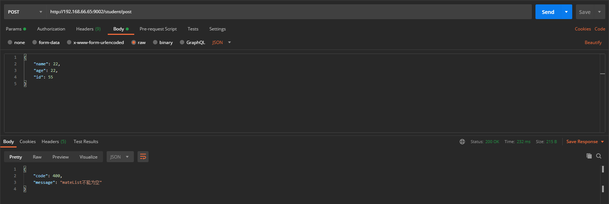

> ```java
> @Size(min = 1, message = "至少需要一个小伙伴")
> ```

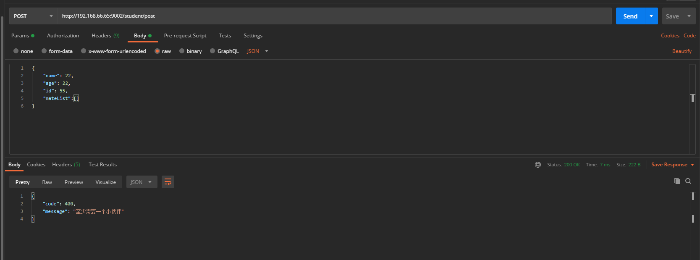

如上面两个图所示，无论是`@Validated或者`@Valid`，对字段的校验都是正确的；

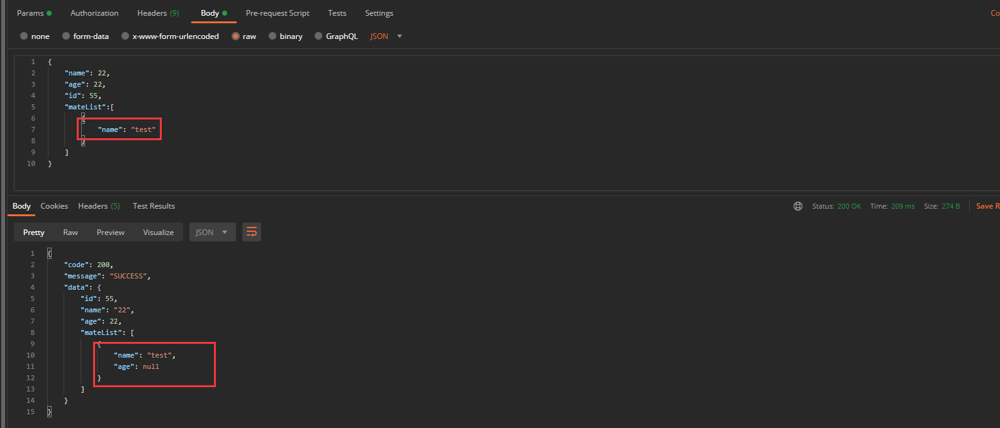

上图说明，无论是`@Validated或者`@Valid`，在目前的代码中，都是无法对`Mate实体`中的字段进行校验。

那么该怎么做呢？

`@Valid`，可以对嵌套字段进行校验，所以加上这个注解。`@Validated`是不可以的。

`嵌套验证必须用@Valid`

~~~java
package com.scaffold.test.entity;

import lombok.Data;
import lombok.EqualsAndHashCode;
import org.hibernate.validator.constraints.Range;
import org.springframework.data.annotation.Id;

import javax.validation.Valid;
import javax.validation.constraints.NotBlank;
import javax.validation.constraints.NotNull;
import javax.validation.constraints.Size;
import java.io.Serializable;
import java.util.List;

/**
 *
 * @author alex wong
 */
@Data
@EqualsAndHashCode(callSuper = false)
public class Student implements Serializable {

    private static final long serialVersionUID=1L;

    @Id
    @Range(min = 1, message = "id不能为空")
    private int id;

    @NotBlank(message = "name不能为空")
    private String name;

    @NotNull(message = "age不能为空")
    private Integer age;

    // 伙伴列表
    @Valid // 嵌套验证必须用@Valid
    @NotNull(message = "mateList不能为空")
    @Size(min = 1, message = "至少需要一个小伙伴")
    private List<Mate> mateList;

}
~~~

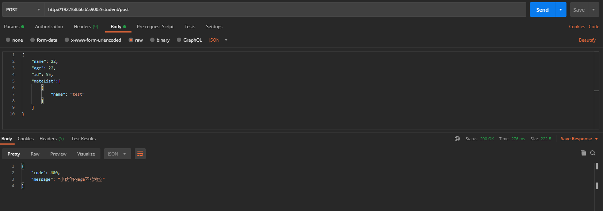

`@Valid嵌套验证生效成功`

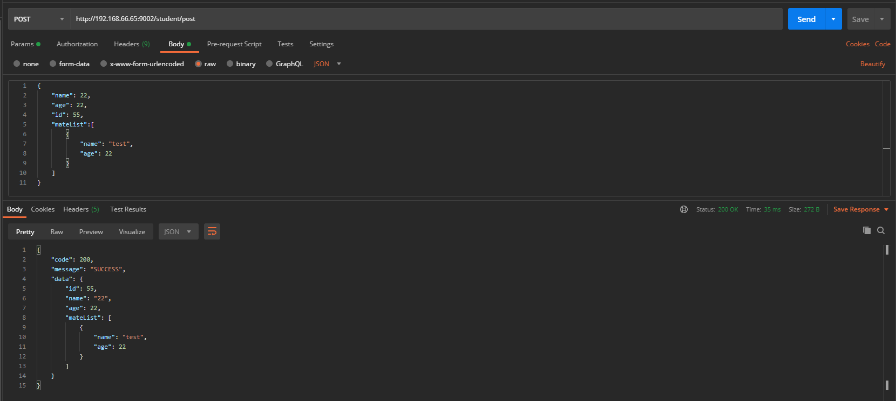

##### 2.3.3、分组

`@Validated`：支持分组功能，可以在入参验证时，根据不同的分组采用不同的验证机制；

`@Valid`：不支持分组；

> 举例：
>
> 当更新一个Student时需要校验ID，当新增一个Student时，不需要校验ID，所以这种情况，需要有不同的验证机制。

那么该如何做呢？

> 定义两个接口

~~~java
package com.scaffold.test.entity;

import javax.validation.groups.Default;

/**
 * 插入数据分组
 */
public interface Insert extends Default {

}

~~~

~~~java
package com.scaffold.test.entity;

import javax.validation.groups.Default;

/**
 * 更新数据分组
 */
public interface Update extends Default {

}

~~~

然后后在需要校验的字段上加入分组:

~~~java
@Id
@Range(min = 1, message = "id不能为空", groups = Update.class)
private int id;
~~~
最后根据需要,在`Controller`处理请求中加入`@Validated注解并引入需要校验的分组`
~~~java
 /**
     * 添加学生
     * @param student
     * @return
     */
    @PostMapping("post")
    public Result postStudent(@Validated(Insert.class) @RequestBody Student student) {
        return ResultGenerator.setSuccessResult(student);
    }

    /**
     * 更新学生
     * @param student
     * @return
     */
    @PostMapping("update")
    public Result updateStudent(@Validated(Update.class) @RequestBody Student student) {
        return ResultGenerator.setSuccessResult(student);
    }
~~~

> http://192.168.66.65:9002/student/post

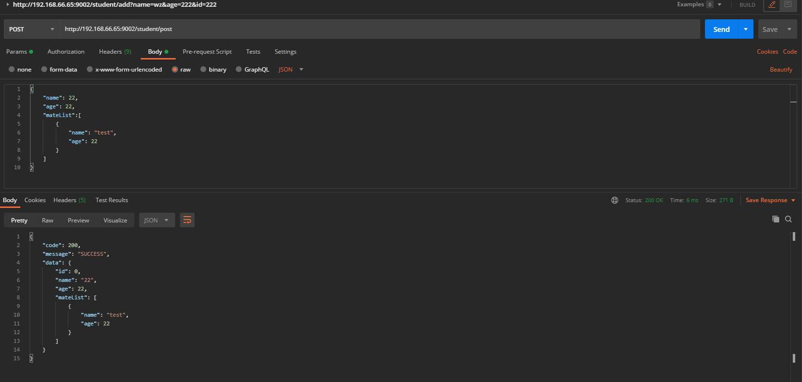

> http://192.168.66.65:9002/student/update

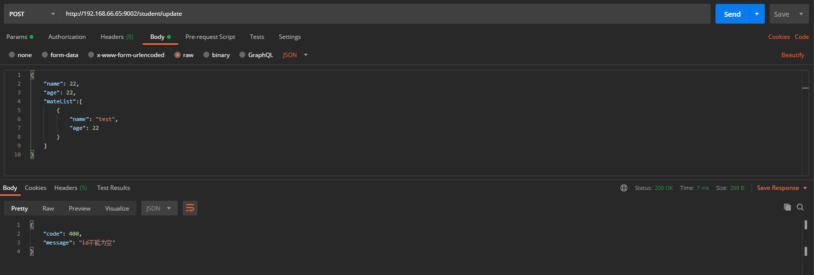

到此为止，分组验证成功。

### 3、总结

整体项目的参数校验统一设计，是基础架构重要的一部分，避免各个写业务的同事，各自增加冗余的代码去判断参数。统一的上层设计，是不错的选择。


