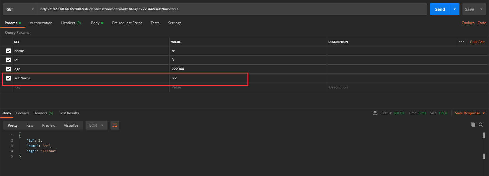
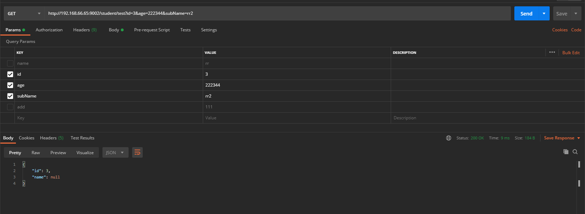
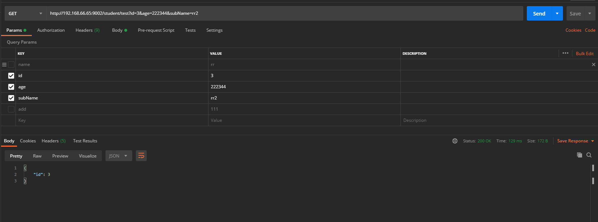
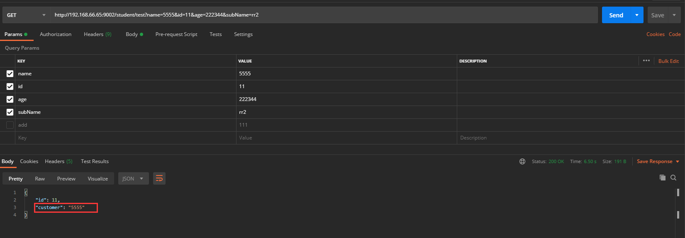
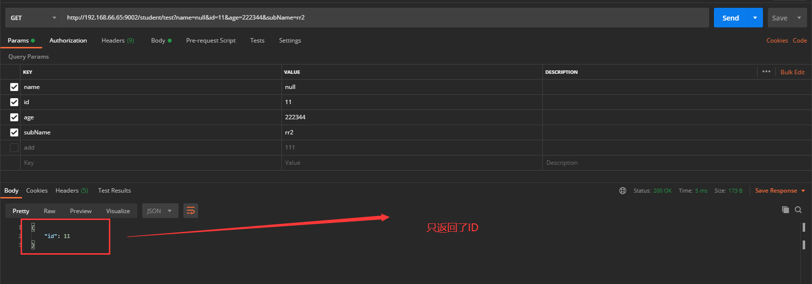
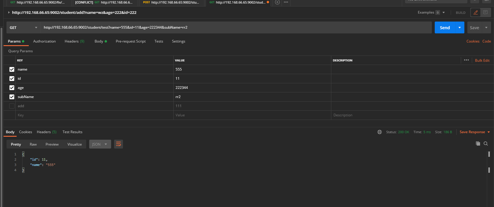
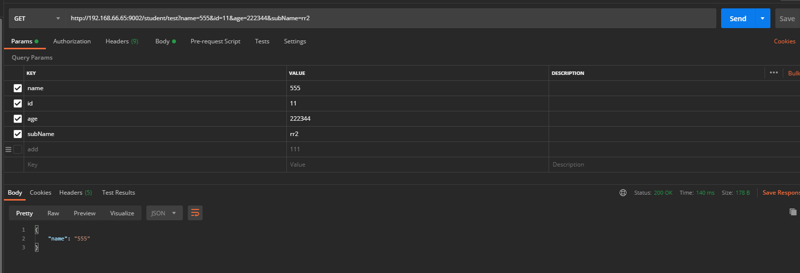
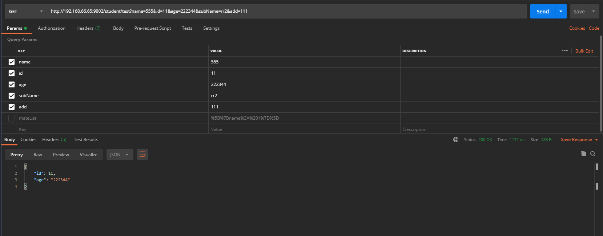

## 过滤对象属性

[TOC]

### 1、前言

在实际的项目中，我们从数据库查出的数据并不是所有的字段要返回到前台，但是一般都是 统一的实体，这个时候，就需要过滤一些不需要返回的对象属性。

### 2、实现

#### 2.1、@JsonIgnore

> 在实体中字段添加`@JsonIgnore`可以注释不需要的字段；
>
> @JsonIgnore注解用来忽略某些字段，可以用在变量或者Getter方法上，用在Setter方法时，和变量效果一样。这个注解一般用在我们要忽略的字段上

~~~java
@Data
@EqualsAndHashCode(callSuper = false)
public class Test implements Serializable {

    private static final long serialVersionUID=1L;

    @TableId(value = "id", type = IdType.AUTO)
    private Integer id;

    private String name;

    private String age;

    @JsonIgnore
    private String subName;
}
~~~

~~~java
@GetMapping("test")
public Test test(Test test) {
    return test;
}
~~~

#### 2.2、@JsonIgnoreProperties

>@JsonIgnoreProperties
>
>@JsonIgnoreProperties(ignoreUnknown = true)，将这个注解写在类上之后，就会忽略类中不存在的字段。这个注解还可以指定要忽略的字段，例如@JsonIgnoreProperties({ “password”, “secretKey” })

~~~java
@Data
@EqualsAndHashCode(callSuper = false)
@JsonIgnoreProperties(value = {"subName", "age"})
public class Test implements Serializable {

    private static final long serialVersionUID=1L;

    @TableId(value = "id", type = IdType.AUTO)
    private Integer id;

    private String name;

    private String age;

    private String subName;
}
~~~

> 顺带扩展一下其他内容

> @JsonInclude(JsonInclude.Include.NON_NULL)
>
> 该注解也是放在类名上面，作用是：忽略类中字段值为null的对象属性

~~~java
@Data
@EqualsAndHashCode(callSuper = false)
@JsonIgnoreProperties(value = {"subName", "age"})
@JsonInclude(JsonInclude.Include.NON_NULL)
public class Test implements Serializable {

    private static final long serialVersionUID=1L;

    @TableId(value = "id", type = IdType.AUTO)
    private Integer id;

    private String name;

    private String age;

    private String subName;
}

~~~

不添加注解前：

添加注解后：

> @JsonProperty("customer")
>
> 该注解是放在字段上面，作用是：当`返回前端`时字段为`customer`（注解里定义的属性）, 接收字段不会受到影响

~~~java
@Data
@EqualsAndHashCode(callSuper = false)
@JsonIgnoreProperties(value = {"subName", "age"})
@JsonInclude(JsonInclude.Include.NON_NULL)
public class Test implements Serializable {

    private static final long serialVersionUID=1L;

    @TableId(value = "id", type = IdType.AUTO)
    private Integer id;
    
    @JsonProperty("customer")
    private String name;

    private String age;

    private String subName;
}
~~~

#### 2.3、@JsonView

@JsonView注解也可以用来过滤序列化对象的字段属性。

比如同一个`Test实体类`，我在一个方法上需要返回`name`，在另外一个方法上不需要返回`name`，这个时候就需要`@JsonView`了；

> 首先需要再实体类中定义两个接口，作用就是做标记，标记那个字段需要返回
>
> TestInfo和TestDetail；
>
> `TestDetail继承了TestInfo, 会把有TestInfo的字段一起返回`

~~~java
@Data
@EqualsAndHashCode(callSuper = false)
public class Test implements Serializable {

    private static final long serialVersionUID = 1L;

    public interface TestInfo {
    }

    public interface TestDetail extends TestInfo {
    }

    // 在 TestInfo 中显示 Id
    @JsonView(TestInfo.class)
    @TableId(value = "id", type = IdType.AUTO)
    private Integer id;

    // 在 TestDetail 中显示名字
    @JsonView(TestDetail.class)
    private String name;

    private String age;

    private String subName;
}
~~~
> 在方法上添加标记
> @JsonView(Test.TestInfo.class)
~~~java
    @GetMapping("test")
    @JsonView(Test.TestInfo.class)
    public Test test(Test test) {
        return test;
    }
~~~

> 在方法上添加
>
> @JsonView(Test.TestDetail.class)

~~~java
    @GetMapping("test")
    @JsonView(Test.TestDetail.class)
    public Test test(Test test) {
        return test;
    }
~~~

返回的有`ID`，是因为`TestDetail`接口是继承`TestInfo`，如果不想返回`ID`，就不要继承`TestInfo`即可。

~~~java
@Data
@EqualsAndHashCode(callSuper = false)
//@JsonIgnoreProperties(value = {"subName", "age"})
//@JsonInclude(JsonInclude.Include.NON_NULL)
public class Test implements Serializable {

    private static final long serialVersionUID = 1L;

    public interface TestInfo {
    }

    public interface TestDetail {
    }

    // 在 TestInfo 中显示 Id
    @JsonView(TestInfo.class)
    @TableId(value = "id", type = IdType.AUTO)
    private Integer id;

    // 在 TestDetail 中显示名字
    @JsonView(TestDetail.class)
    private String name;

    private String age;

    private String subName;
}
~~~

--------------------------

从上面的例子可以看出了，一旦使用了@JsonView, 只会返回有注解的字段，其他字段被忽略的，不是很好用，不是很灵活。

#### 2.4、自定义过滤方法

> com.scaffold.test.config.CustomFilterConfig

~~~java
package com.scaffold.test.config;

import com.fasterxml.jackson.databind.ObjectMapper;
import com.fasterxml.jackson.databind.ser.FilterProvider;
import com.fasterxml.jackson.databind.ser.impl.SimpleBeanPropertyFilter;
import com.fasterxml.jackson.databind.ser.impl.SimpleFilterProvider;
import org.springframework.context.annotation.Bean;
import org.springframework.http.converter.json.MappingJackson2HttpMessageConverter;
import org.springframework.stereotype.Component;

import java.util.HashSet;
import java.util.Set;

/**
 * 自定义过滤对象属性
 */

@Component
public class CustomFilterConfig {
    private static final Set<String> ignorableFieldNames = new HashSet<>();

    static {
        ignorableFieldNames.add("name");
        ignorableFieldNames.add("subName");
    }

    @Bean
    public MappingJackson2HttpMessageConverter messageConverter(){

        MappingJackson2HttpMessageConverter jacksonConverter = new MappingJackson2HttpMessageConverter();
        ObjectMapper objectMapper = new ObjectMapper();

        SimpleFilterProvider simpleFilterProvider = new SimpleFilterProvider().setFailOnUnknownId(false);
        FilterProvider filters = simpleFilterProvider.addFilter("customFilter", SimpleBeanPropertyFilter.serializeAllExcept(ignorableFieldNames));
        objectMapper.setFilterProvider(filters);

        jacksonConverter.setObjectMapper(objectMapper);

        return jacksonConverter;
    }
}

~~~

> 然后再实体类上添加`@JsonFilter("customFilter")`

~~~java
@Data
@EqualsAndHashCode(callSuper = false)
@JsonInclude(JsonInclude.Include.NON_NULL)
@JsonFilter("customFilter")
public class Test implements Serializable {

    private static final long serialVersionUID = 1L;

    @TableId(value = "id", type = IdType.AUTO)
    private Integer id;

    private String name;

    private String age;

    private String subName;

    private List<Mate> mateList;
}

~~~

当前方法，其实并不太灵活，`ignorableFieldNames`并不能被动态传递；

### 3、总结

未完待续，2.4的自定义方法并非很好，最好的应该是可以在`Controller`方法上直接添加自定义的注解，比如`@JsonFilter(value={"name", "subName"})`, 后续继续探讨这个方法，码字不易，不喜勿喷。

