## 如何从零搭建一个FastDFS分布式文件系统

[TOC]

### 1、前言

在实际项目中，上传下载文件是很平常的事情，大多都是上传到项目本地，每个项目都是如此，繁琐且不方便。

那么是否应该考虑建立一个独立的文件系统，供所有项目共用呢？

这个章节我们介绍如何搭建一个FastDFS分布式文件系统。

`FastDFS` 是一个开源的高性能分布式文件系统（`DFS`）。 它的主要功能包括：文件存储，文件同步和文件访问，以及高容量和负载平衡。主要解决了海量数据存储问题，特别适合以中小文件（建议范围：4KB < file_size <500MB）为载体的在线服务。

`FastDFS` 系统有三个角色：跟踪服务器(`Tracker Server`)、存储服务器(`Storage Server`)和客户端(`Client`)。

　　**Tracker Server**：跟踪服务器，主要做调度工作，起到均衡的作用；负责管理所有的 `storage server`和 `group`，每个 storage 在启动后会连接 Tracker，告知自己所属 group 等信息，并保持周期性心跳。

　　**Storage Server**：存储服务器，主要提供容量和备份服务；以 `group` 为单位，每个 `group` 内可以有多台 `storage` server，数据互为备份。

　　**Client**：客户端，上传下载数据的服务器。


### 2、安装 `fastDFS`

#### 2.1、下载资源

[https://github.com/happyfish100](https://github.com/happyfish100)


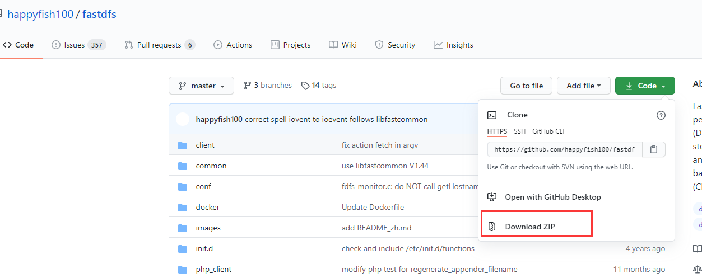

下载`zip`文件，然后上传到服务器`/usr/local/lib/fastDFS`中。

`libfastcommon`：从 `fastdfs` 项目和 `fastdht` 项目中提取出来的公共 C 函数库；

`fastdfs`：FastDFS 核心项目；

`fastdfs-nginx-module`：Nginx 整合 FastDFS 时 Nginx 需要添加的模块资源；

#### 2.2、安装 `fastDFS`

> 安装C++环境依赖

~~~shell
yum install -y make cmake gcc gcc-c++
~~~

> 安装 `unzip` 用于解压

~~~shell
yum install -y unzip
~~~

> 解压`libfastcommon`编译并安装

~~~shell
[root@test fastDFS]# unzip libfastcommon.zip
[root@test fastDFS]# cd libfastcommon-master
[root@test libfastcommon-master]# ./make.sh && ./make.sh install
~~~

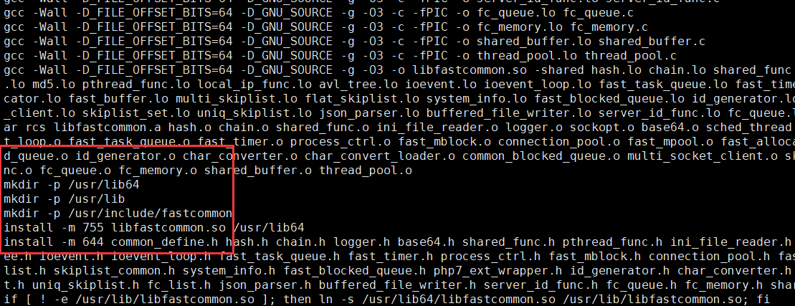

`libfastcommon` 默认安装在以下位置：

- `/usr/lib64`

- `/usr/include/fastcommon`

- `/usr/lib`：创建软链接


> 解压 `fastdfs` 编译并安装

~~~shell
[root@test fastDFS]# unzip zip
[root@test fastDFS]# cd fastdfs-master
[root@test fastdfs-master]# ./make.sh && ./make.sh install
~~~

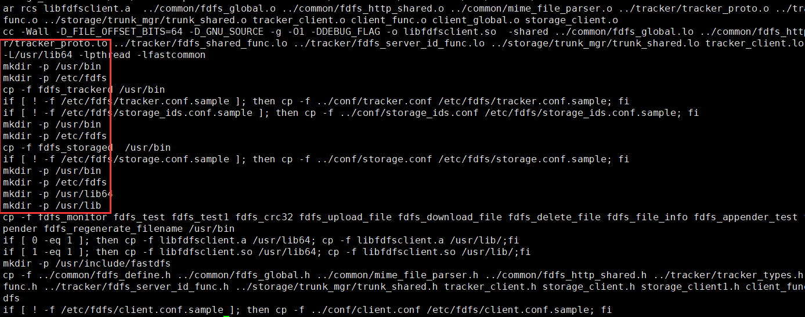

`fastdfs` 默认安装在以下位置：

- `/usr/bin`：可执行文件
- `/etc/fdfs`：配置文件
- `/etc/init.d`：主程序代码
- `/usr/include/fastdfs`：插件组

#### 2.3、启动 `Tracker`

~~~shell
[root@test /]# cd /etc/fdfs
[root@test fdfs]# ll
总用量 32
-rw-r--r-- 1 root root  1909 10月  9 17:20 client.conf.sample
-rw-r--r-- 1 root root 10246 10月  9 17:20 storage.conf.sample
-rw-r--r-- 1 root root   620 10月  9 17:20 storage_ids.conf.sample
-rw-r--r-- 1 root root  9138 10月  9 17:20 tracker.conf.sample
[root@test fdfs]# cp tracker.conf.sample tracker.conf
总用量 44
-rw-r--r-- 1 root root  1909 10月  9 17:20 client.conf.sample
-rw-r--r-- 1 root root 10246 10月  9 17:20 storage.conf.sample
-rw-r--r-- 1 root root   620 10月  9 17:20 storage_ids.conf.sample
-rw-r--r-- 1 root root  9138 10月  9 17:32 tracker.conf
-rw-r--r-- 1 root root  9138 10月  9 17:20 tracker.conf.sample
~~~

- `client.conf.sample`：客户端的配置文件
- `storage.conf.sample`：存储器的配置文件
- `tracker.conf.sample`：跟踪器的配置文件

> 修改`tracker.conf`
>
> 只修改几项

~~~shell
# 允许访问 tracker 服务器的 IP 地址，为空则表示不受限制
bind_addr =

# tracker 服务监听端口
port = 22122

# tracker 服务器的运行数据和日志的存储父路径（需要提前创建好）
base_path = /home/fastdfs/tracker

# tracker 服务器 HTTP 协议下暴露的端口
http.server_port = 9080
~~~

~~~shell
# 创建 tracker 服务器的运行数据和日志的存储父路径
mkdir -p /home/fastdfs/tracker
# 启动 tracker 服务
service fdfs_trackerd start
# 查看 tracker 服务状态
service fdfs_trackerd status
# 重启 tracker 服务
service fdfs_trackerd restart
# 停止 tracker 服务
service fdfs_trackerd stop
~~~

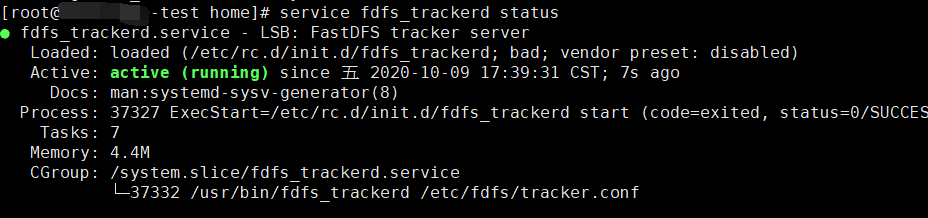

#### 2.4、启动 `Storage`

~~~shell
[root@test home]# cd /etc/fdfs/
[root@test fdfs]# cp storage.conf.sample storage.conf
[root@test fdfs]# ll
总用量 56
-rw-r--r-- 1 root root  1909 10月  9 17:20 client.conf.sample
-rw-r--r-- 1 root root 10246 10月  9 17:44 storage.conf
-rw-r--r-- 1 root root 10246 10月  9 17:20 storage.conf.sample
-rw-r--r-- 1 root root   620 10月  9 17:20 storage_ids.conf.sample
-rw-r--r-- 1 root root  9139 10月  9 17:37 tracker.conf
-rw-r--r-- 1 root root  9138 10月  9 17:20 tracker.conf.sample
[root@knowledge-test fdfs]# vim storage.conf
~~~
> 修改 storage.conf
~~~~shell
# storage 组名/卷名，默认为 group1
group_name = group1

# 允许访问 storage 服务器的 IP 地址，为空则表示不受限制
bind_addr =

# storage 服务器的运行数据和日志的存储父路径（需要提前创建好）
base_path = /home/fastdfs/storage/base

# storage 服务器中客户端上传的文件的存储父路径（需要提前创建好）
store_path0 = /home/fastdfs/storage/store

# storage 服务器 HTTP 协议下暴露的端口
http.server_port = 8888

# tracker 服务器的 IP 和端口
tracker_server = 192.168.66.96:22122
~~~~

> 启动 `storage` 服务

~~~shell
# 创建 storage 服务器的运行数据和日志的存储父路径
mkdir -p /home/fastdfs/storage/base
# 创建 storage 服务器中客户端上传的文件的存储父路径
mkdir -p /home/fastdfs/storage/store
# 启动 storage 服务
service fdfs_storaged start
# 查看 storage 服务状态
service fdfs_storaged status
# 重启 storage 服务
service fdfs_storaged restart
# 停止 storage 服务
service fdfs_storaged stop
~~~

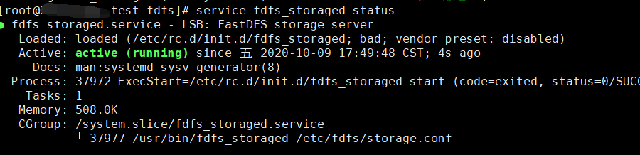

上面所用到的端口 `22122`， `23000` 在部署集群的时候均需要在`防火墙`上设置放行。

#### 2.5、创建`Client`

~~~shell
[root@test /]# cd /etc/fdfs/
[root@test fdfs]# cp client.conf.sample client.conf
[root@test fdfs]# ll
总用量 60
-rw-r--r-- 1 root root  1909 10月  9 17:55 client.conf
-rw-r--r-- 1 root root  1909 10月  9 17:20 client.conf.sample
-rw-r--r-- 1 root root 10259 10月  9 17:47 storage.conf
-rw-r--r-- 1 root root 10246 10月  9 17:20 storage.conf.sample
-rw-r--r-- 1 root root   620 10月  9 17:20 storage_ids.conf.sample
-rw-r--r-- 1 root root  9139 10月  9 17:37 tracker.conf
-rw-r--r-- 1 root root  9138 10月  9 17:20 tracker.conf.sample
[root@test fdfs]# vim client.conf
~~~

> 修改`Client.conf`

~~~shell
# client 客户端的运行数据和日志的存储父路径（需要提前创建好）
base_path = /home/fastdfs/client

# tracker 服务器的 IP 和端口
tracker_server = 192.168.66.96:22122
~~~

~~~shell
[root@test fdfs]# mkdir -p /home/fastdfs/client
[root@test fdfs]# ll /home/fastdfs/
总用量 0
drwxr-xr-x 2 root root  6 10月  9 17:58 client
drwxr-xr-x 4 root root 31 10月  9 17:48 storage
drwxr-xr-x 4 root root 30 10月  9 17:39 tracker
~~~

### 3、`Client`实际操作

#### 3.1、上传

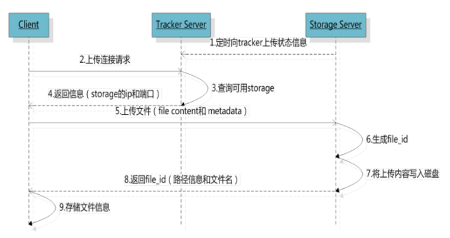

> 1、**同步状态信息**
>
> `Storage Server` 会定期向 `Tracker Server` 上传自己的状态信息。如果 `Tracker Server` 是集群环境，因为各个 `Tracker` 之间的关系是对等的，所以客户端上传时可以选择任意一个 `Tracker`
>
> 2、**客户端发起上传请求**
>
> `Tracker Server`收到请求后，查询可用的`Storage`, 为当前文件分配一个可用的`group`；
>
> 
>
> 如上图的`tracker.conf`的`group`分配原则：`0：轮询group, 1: 指定group, 2: 负载均衡，自动比较选择空间剩余比较大的group`。
>
> 当选好了 `group` 就可以决定给客户端分配 `group` 中的哪个 `Storage Server`。
>
> 3、**选择storage Server**
>
> 分配好 `Storage Server` 以后，客户端向 Storage Server 发送上传文件请求，`Storage Server` 会为文件分配一个具体的数据存储目录
>
> 
>
> 如上图`storage.conf`中，文件目录分配原则：`0：轮询，1：根据haseCode随机`
>
> 4、**生成`file_id`**
>
> 选定存储目录以后，`Storage` 会为文件生一个 `file_id`，由 `Storage Server IP、文件创建时间、文件大小、文件 crc32 和一个随机数`组成，然后将这个二进制串进行 `base64` 编码，转换为字符串。
>
> 5、**路径信息和文件名**
>
> 文件名由 `group名称/存储目录/二级子目录/file_id.后缀名` 拼接而成
>
> 类似：`group1/M00/00/00/wKgGxF-BB-yATpVhABBaV0WhZ9w109.png`
>
> `group1`：**组名**/**卷名**。文件上传成功以后所在的 Storage 组名称，由 Storage 服务器返回。
>
> `M00`：**虚拟磁盘路径**。与 Storage 配置文件中磁盘选项 `store_path*` 对应。如果配置了 `store_path0` 则是 `M00`，如果配置了 `store_path1` 则是 `M01`，以此类推。比如：`store_path0 = /home/fastdfs/storage/store`，`M00` 则表示：`/home/fastdfs/storage/store/data`。
>
> `/02/44`：**数据两级目录**。Storage 服务器在每个虚拟磁盘路径下创建的两级目录，用于存储数据文件。
>
> `wKgDrE34E8wAAAAAAAAGkEIYJK42378`：file_id，由 Storage Server IP、文件创建时间、文件大小、文件 crc32 和一个随机数组成，然后将这个二进制串进行 base64 编码，转换为字符串。

> 上传文件
>
> ~~~shell
> fdfs_test /etc/fdfs/client.conf upload /home/file/test.png
> ~~~
>
> 或者
>
> ~~~shell
> fdfs_upload_file /etc/fdfs/client.conf /home/file/test.png
> ~~~
>
>

~~~shell
[root@test /]# fdfs_test /etc/fdfs/client.conf upload  /home/file/test.png
This is FastDFS client test program v6.07

Copyright (C) 2008, Happy Fish / YuQing

FastDFS may be copied only under the terms of the GNU General
Public License V3, which may be found in the FastDFS source kit.
Please visit the FastDFS Home Page http://www.fastken.com/
for more detail.

[2020-10-10 10:56:24] DEBUG - base_path=/home/fastdfs/client, connect_timeout=5, network_timeout=60, tracker_server_count=1, anti_steal_token=0, anti_steal_secret_key length=0, use_connection_pool=0, g_connection_pool_max_idle_time=3600s, use_storage_id=0, storage server id count: 0

tracker_query_storage_store_list_without_group:
	server 1. group_name=, ip_addr=192.168.66.96, port=23000

group_name=group1, ip_addr=192.168.66.96, port=23000
storage_upload_by_filename
group_name=group1, remote_filename=M00/00/00/wKgGxF-BItiAIGBqABBaV0WhZ9w144.png
source ip address: 192.168.66.96
file timestamp=2020-10-10 10:56:24
file size=1071703
file crc32=1168205788
example file url: http://192.168.66.96/group1/M00/00/00/wKgGxF-BItiAIGBqABBaV0WhZ9w144.png
storage_upload_slave_by_filename
group_name=group1, remote_filename=M00/00/00/wKgGxF-BItiAIGBqABBaV0WhZ9w144_big.png
source ip address: 192.168.66.96
file timestamp=2020-10-10 10:56:24
file size=1071703
file crc32=1168205788
example file url: http://192.168.66.96/group1/M00/00/00/wKgGxF-BItiAIGBqABBaV0WhZ9w144_big.png
~~~

当前的`http://192.168.66.96/group1/M00/00/00/wKgGxF-BItiAIGBqABBaV0WhZ9w144_big.png`是无法直接访问，后续可配置`Nginx`访问；

`group_name`：Storage 组名/卷名

`remote_filename`：上传成功文件的存储路径及文件名

`source_ip address`：上传成功文件所在的 Storage 服务器的 IP 地址

`file timestamp`：上传成功文件时的时间戳

` file size`：上传成功文件的文件大小

`example file url`：上传成功文件的 url 地址，**配合 Nginx 可以直接访问**

`storage_upload_slave_by_filename`：FastDFS 的文件主/从特性，由主文件产生从文件

~~~shell
[root@test /]# ll /home/fastdfs/storage/store/data/00/00
总用量 4200
-rw-r--r-- 1 root root 1071703 10月 10 10:56 wKgGxF-BItiAIGBqABBaV0WhZ9w144_big.png
-rw-r--r-- 1 root root      49 10月 10 10:56 wKgGxF-BItiAIGBqABBaV0WhZ9w144_big.png-m
-rw-r--r-- 1 root root 1071703 10月 10 10:56 wKgGxF-BItiAIGBqABBaV0WhZ9w144.png
-rw-r--r-- 1 root root      49 10月 10 10:56 wKgGxF-BItiAIGBqABBaV0WhZ9w144.png-m
~~~

由此说明文件上传成功。

附另外一种上传方法：

~~~shell
[root@test fastdfs]# fdfs_upload_file /etc/fdfs/client.conf /home/file/test.png
group1/M00/00/00/wKgGxF-BKSuAKDk6ABBaV0WhZ9w485.png
[root@test fastdfs]# ll /home/fastdfs/storage/store/data/00/00
-rw-r--r-- 1 root root 1071703 10月 10 11:23 wKgGxF-BKSuAKDk6ABBaV0WhZ9w485.png
~~~

#### 3.2、下载

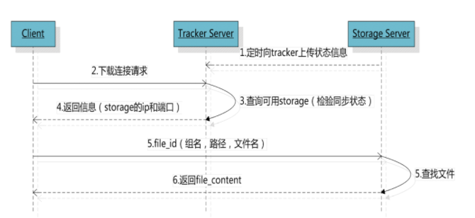

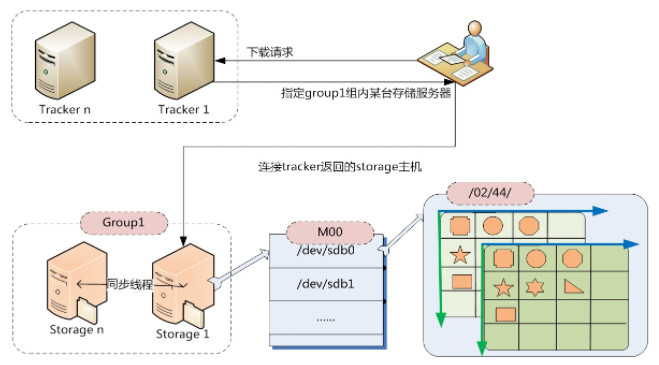

客户端上传成功后，会拿到一个文件名如：`group1/M00/00/00/wKgGxF-BItiAIGBqABBaV0WhZ9w144.png`，客户端向任何一个`Track Server`发起下载请求，`Track Server`根据当前文件名从文件名中解析出`该文件的 group、大小、创建时间`等信息，该请求选择一个 `Storage` 找到对应的文件然后进行下载。

> 下载
>
> `fdfs_test /etc/fdfs/client.conf download group_name remote_filename`
>
> 或者
>
> `fdfs_download_file /etc/fdfs/client.conf group_name/remote_filename`

~~~~shell
[root@test fastdfs]# fdfs_test /etc/fdfs/client.conf download group1 M00/00/00/wKgGxF-BItiAIGBqABBaV0WhZ9w144.png
This is FastDFS client test program v6.07

Copyright (C) 2008, Happy Fish / YuQing

FastDFS may be copied only under the terms of the GNU General
Public License V3, which may be found in the FastDFS source kit.
Please visit the FastDFS Home Page http://www.fastken.com/
for more detail.

[2020-10-10 11:16:02] DEBUG - base_path=/home/fastdfs/client, connect_timeout=5, network_timeout=60, tracker_server_count=1, anti_steal_token=0, anti_steal_secret_key length=0, use_connection_pool=0, g_connection_pool_max_idle_time=3600s, use_storage_id=0, storage server id count: 0

storage=192.168.66.96:23000
download file success, file size=1071703, file save to wKgGxF-BItiAIGBqABBaV0WhZ9w144.png
[root@test fastdfs]# ll
总用量 1048
drwxr-xr-x 2 root root       6 10月  9 17:58 client
drwxr-xr-x 4 root root      31 10月  9 17:48 storage
drwxr-xr-x 4 root root      30 10月  9 17:39 tracker
-rw-r--r-- 1 root root 1071703 10月 10 11:16 wKgGxF-BItiAIGBqABBaV0WhZ9w144.png
~~~~

~~~shell
[root@test fastdfs]# fdfs_download_file /etc/fdfs/client.conf group1/M00/00/00/wKgGxF-BItiAIGBqABBaV0WhZ9w144.png
[root@test fastdfs]# ll
总用量 1048
drwxr-xr-x 2 root root       6 10月  9 17:58 client
drwxr-xr-x 4 root root      31 10月  9 17:48 storage
drwxr-xr-x 4 root root      30 10月  9 17:39 tracker
-rw-r--r-- 1 root root 1071703 10月 10 11:21 wKgGxF-BItiAIGBqABBaV0WhZ9w144.png
~~~

#### 3.3、删除

> fdfs_test /etc/fdfs/client.conf delete group_name remote_filename
>
> 或者
>
> fdfs_delete_file /etc/fdfs/client.conf 要删除的文件

~~~shell
[root@test 00]# ll
总用量 3152
-rw-r--r-- 1 root root 1071703 10月 10 10:56 wKgGxF-BItiAIGBqABBaV0WhZ9w144_big.png
-rw-r--r-- 1 root root      49 10月 10 10:56 wKgGxF-BItiAIGBqABBaV0WhZ9w144_big.png-m
-rw-r--r-- 1 root root 1071703 10月 10 10:56 wKgGxF-BItiAIGBqABBaV0WhZ9w144.png
-rw-r--r-- 1 root root      49 10月 10 10:56 wKgGxF-BItiAIGBqABBaV0WhZ9w144.png-m
-rw-r--r-- 1 root root 1071703 10月 10 11:23 wKgGxF-BKSuAKDk6ABBaV0WhZ9w485.png
[root@test 00]# fdfs_test /etc/fdfs/client.conf delete group1 M00/00/00/wKgGxF-BKSuAKDk6ABBaV0WhZ9w485.png
This is FastDFS client test program v6.07

Copyright (C) 2008, Happy Fish / YuQing

FastDFS may be copied only under the terms of the GNU General
Public License V3, which may be found in the FastDFS source kit.
Please visit the FastDFS Home Page http://www.fastken.com/
for more detail.

[2020-10-10 11:28:37] DEBUG - base_path=/home/fastdfs/client, connect_timeout=5, network_timeout=60, tracker_server_count=1, anti_steal_token=0, anti_steal_secret_key length=0, use_connection_pool=0, g_connection_pool_max_idle_time=3600s, use_storage_id=0, storage server id count: 0

storage=192.168.66.96:23000
delete file success
[root@test 00]# ll
总用量 2104
-rw-r--r-- 1 root root 1071703 10月 10 10:56 wKgGxF-BItiAIGBqABBaV0WhZ9w144_big.png
-rw-r--r-- 1 root root      49 10月 10 10:56 wKgGxF-BItiAIGBqABBaV0WhZ9w144_big.png-m
-rw-r--r-- 1 root root 1071703 10月 10 10:56 wKgGxF-BItiAIGBqABBaV0WhZ9w144.png
-rw-r--r-- 1 root root      49 10月 10 10:56 wKgGxF-BItiAIGBqABBaV0WhZ9w144.png-m
~~~

另外一种方式：

~~~shell
[root@test 00]# ll
总用量 2104
-rw-r--r-- 1 root root 1071703 10月 10 10:56 wKgGxF-BItiAIGBqABBaV0WhZ9w144_big.png
-rw-r--r-- 1 root root      49 10月 10 10:56 wKgGxF-BItiAIGBqABBaV0WhZ9w144_big.png-m
-rw-r--r-- 1 root root 1071703 10月 10 10:56 wKgGxF-BItiAIGBqABBaV0WhZ9w144.png
-rw-r--r-- 1 root root      49 10月 10 10:56 wKgGxF-BItiAIGBqABBaV0WhZ9w144.png-m
[root@test 00]# fdfs_delete_file /etc/fdfs/client.conf group1/M00/00/00/wKgGxF-BItiAIGBqABBaV0WhZ9w144.png
[root@test 00]# ll
总用量 1052
-rw-r--r-- 1 root root 1071703 10月 10 10:56 wKgGxF-BItiAIGBqABBaV0WhZ9w144_big.png
-rw-r--r-- 1 root root      49 10月 10 10:56 wKgGxF-BItiAIGBqABBaV0WhZ9w144_big.png-m
~~~

### 4、nginx相关配置

截止目前，单机版的`FastDFS`，搭建成功。但是还是不能通过`Http`访问，接下来需要结合`Nginx`进行配置，才可以直接通过`Http`访问生成后的文件地址。

说到`nginx`也许很多人并不陌生，假设你的机器上已经有Nginx，安装过程不再赘述。

我们这里使用的模块是`fastdfs-nginx-module`，为什么要使用这个呢？

因为 `FastDFS` 是通过 **Tracker** 服务器将文件存储在 `Storage` 服务器中，而且`同组存储服务器之间还需要进行文件复制`，会有同步时间延迟的问题。

　　假设 `Tracker` 服务器将文件上传到了 `192.168.66.96`，上传成功以后文件相关信息已经返回给客户端了。此时 `FastDFS` 的集群存储机制会将这个文件同步到同组中的其他机器上进行存储 `192.168.66.97`，在文件还没有复制完成的情况下，客户端如果用这个文件的相关信息在 `192.168.66.97` 上进行获取，就会出现文件无法访问的错误。

　　解决办法就是使用 `fastdfs-nginx-module`，它可以重定向文件链接到源服务器进行获取，避免客户端由于复制延迟导致的文件无法访问的错误。

> 配置 `fastdfs-nginx-module`
>
> zip包我们之前已经下载了

~~~shell
[root@test fastDFS]# unzip fastdfs-nginx-module.zip
# 复制配置文件 mod_conf 到 /etc/fdfs 目录中
[root@test /]# cp /usr/local/lib/fastDFS/fastdfs-nginx-module-master/src/mod_conf /etc/fdfs/
[root@test /]# ll /etc/fdfs
总用量 64
-rw-r--r-- 1 root root  1872 10月  9 18:02 client.conf
-rw-r--r-- 1 root root  1909 10月  9 17:20 client.conf.sample
-rw-r--r-- 1 root root  3725 10月 10 13:14 mod_conf
-rw-r--r-- 1 root root 10218 10月  9 18:02 storage.conf
-rw-r--r-- 1 root root 10246 10月  9 17:20 storage.conf.sample
-rw-r--r-- 1 root root   620 10月  9 17:20 storage_ids.conf.sample
-rw-r--r-- 1 root root  9139 10月  9 17:37 tracker.conf
-rw-r--r-- 1 root root  9138 10月  9 17:20 tracker.conf.sample
# 修改配置文件
[root@test fastdfs-nginx-module-master]# vim /etc/fdfs/mod_conf
~~~

~~~shell
# tracker 服务器的 IP 和端口
tracker_server = 192.168.66.99:22122
# url 地址是否包含组名/卷名
url_have_group_name = true
# 数据组/卷对应的路径地址
store_path0 = /home/fastdfs/storage/store
~~~

> 复制 `fastdfs` 安装包中的两个配置文件 `http.conf` 和 `mime.types` 到 `/etc/fdfs` 目录中

~~~shell
[root@test fastDFS]# cp /usr/local/lib/fastDFS/fastdfs-master/conf/http.conf /etc/fdfs
[root@test fastDFS]# cp /usr/local/lib/fastDFS/fastdfs-master/conf/mime.types /etc/fdfs
[root@test fastDFS]# cd /etc/fdfs/
[root@test fdfs]# ll /etc/fdfs
总用量 100
-rw-r--r-- 1 root root  1872 10月  9 18:02 client.conf
-rw-r--r-- 1 root root  1909 10月  9 17:20 client.conf.sample
-rw-r--r-- 1 root root   965 10月 10 13:25 http.conf
-rw-r--r-- 1 root root 31172 10月 10 13:25 mime.types
-rw-r--r-- 1 root root  3762 10月 10 13:22 mod_conf
-rw-r--r-- 1 root root 10218 10月  9 18:02 storage.conf
-rw-r--r-- 1 root root 10246 10月  9 17:20 storage.conf.sample
-rw-r--r-- 1 root root   620 10月  9 17:20 storage_ids.conf.sample
-rw-r--r-- 1 root root  9139 10月  9 17:37 tracker.conf
-rw-r--r-- 1 root root  9138 10月  9 17:20 tracker.conf.sample
~~~

默认本机已经安装了`Nginx`。

接下来配置`nginx`添加 `fastdfs-nginx-module` 模块

~~~shell
# 添加 fastdfs-nginx-module 模块，指定 nginx 的安装路径
[root@test nginx]# ./configure --prefix=/usr/local/nginx --add-module=/usr/local/lib/fastDFS/fastdfs-nginx-module-master/src
 # 编译并安装, 如果已经安装过不要用make && make intall，否则之前的安装模块会被覆盖
 [root@test nginx]# make
~~~

> 配置nginx Server

~~~nginx
server {
  listen 8888;
  server_name localhost;

  location / {
    index index.html;
  }

  location ~/group[0-9]/ {
    ngx_fastdfs_module;
  }
}
~~~
> 重启nginx

~~~shell
nginx -s reload
~~~


> 上传一个图片

~~~shell
[root@test /]# fdfs_upload_file /etc/fdfs/client.conf /home/file/test.png
group1/M00/00/00/wKgGxF-BVFiADTVtAAARgn1D8Qw913.png
~~~

浏览器访问`http://192.168.66.96:8888/group1/M00/00/00/wKgGxF-BVFiADTVtAAARgn1D8Qw913.png`


目前为止，一个单机的`FastDFS`搭建成功。如果想实现`高可用`，需要`增加多台机器，增加`Tracker和Storage`集群`。

### 5、`FastDFS` 集群

之前的内容都在单节点的，我们这次多增加一台机器`192.168.66.81`，进行测试下`FastDFS` 的集群环境，多 Tracker 多 `Storage`；

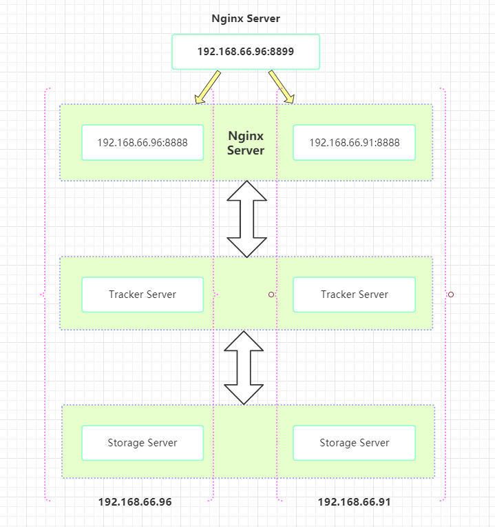

首先重复之前的操作在`192.168.66.91`上安装`FastDFS`;

`安装过程不再赘述;`

安装完成后修改两台机器的 `storage.conf`和`Client.conf(测试用)`，

~~~
tracker_server = 192.168.66.91:22122
tracker_server = 192.168.66.96:22122
~~~

然后重启

~~~shell
service fdfs_trackerd restart
service fdfs_storaged restart
~~~

增加多个`TrackerServer`，在一`台机器上上传完成后，会自动同步到另外一个机器`；

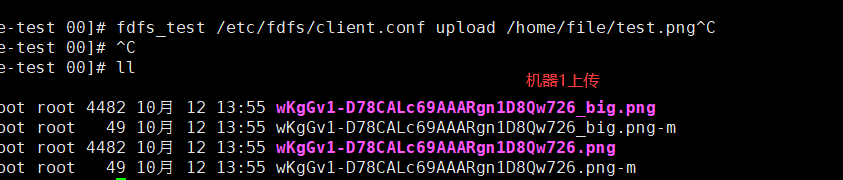

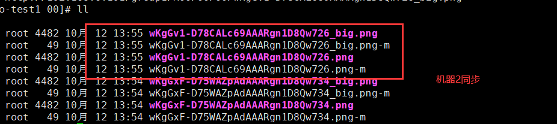

在`96`机器上新增一个`nginx Server`，然后重启`nginx`

~~~nginx
# 负载均衡
upstream fastdfs_storage_server {
    server 192.168.66.91:8888;
    server 192.168.66.96:8888;
}

server {
  listen 8899;
  server_name localhost;

  location / {
    index index.html;
  }

  location ~/group[0-9]/ {
    proxy_pass http://fastdfs_storage_server;
  }
}

~~~


如上我们上传文件到任何一个服务器后，都可以通过`8899`这个server访问到文件。

目前为止一个简单的集群环境部署完毕；

### 6、Java 客户端

集群部署完毕后，我们怎么创建一个java版本的客户端，来实现上传文件呢？实现完成以后就可以当做一个独立的文件上传服务了。

`FastDFS` 的`java SDK`不在中央仓库里面，需要下载[源码(https://github.com/happyfish100/fastdfs-client-java](https://github.com/happyfish100/fastdfs-client-java)后，通过命令` mvn clean install`打包，然后导入到本地仓库里面；

> 使用maven从源码安装

~~~shell
mvn clean install
~~~


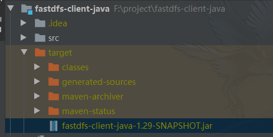

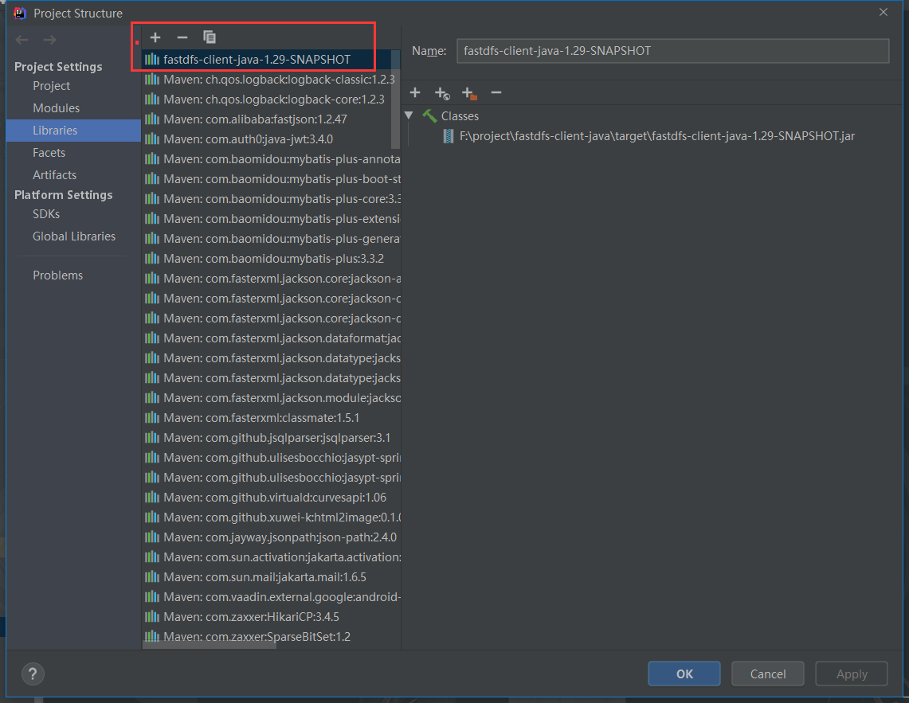

> 然后在maven项目pom.xml中添加依赖

```xml
<dependency>
    <groupId>org.csource</groupId>
    <artifactId>fastdfs-client-java</artifactId>
    <version>1.29-SNAPSHOT</version>
</dependency>
```

> 配置信息
>
> src/main/resources/fastDFS/fastClient.conf

```xml
# 超时时间
connect_timeout = 30
network_timeout = 30

# 编码字符集
charset = UTF-8

# tracker 服务器 HTTP 协议下暴露的端口
http.tracker_http_port = 9080

# tracker 服务器的 IP 和端口
tracker_server = 192.168.66.91:22122
tracker_server = 192.168.66.96:22122
```

> FastDFSClient工具类

```java
package fastDFS;

import jodd.util.StringUtil;
import org.csource.common.NameValuePair;
import org.csource.*;
import org.springframework.web.multipart.MultipartFile;

import java.io.FileInputStream;
import java.io.InputStream;

/**
 * FastDFS分布式文件系统
 */
public class FastDFSClient {

    // 配置信息
    private static final String client_conf = Thread.currentThread().getContextClassLoader().getResource("fastDFS/fastClient.conf").getPath();

    // 客户端
    private static StorageClient storageClient = null;

    static {
        try {
            // 加载配置文件
            ClientGlobal.init(client_conf);
            // 初始化Tracker客户端
            TrackerClient trackerClient = new TrackerClient(ClientGlobal.g_tracker_group);
            // 初始化Tracker服务端
            TrackerServer trackerServer = trackerClient.getTrackerServer();
            // 初始化Storage客户端
            StorageServer storageServer = trackerClient.getStoreStorage(trackerServer);
            // 初始化Storage客户端
            storageClient = new StorageClient(trackerServer, storageServer);

        } catch (Exception e) {
            e.printStackTrace();
        }
    }

    /**
     * 文件上传
     *
     * @param file
     * @return
     */
    public static String uploadFile(MultipartFile file) {
        try {
            InputStream inputStream = file.getInputStream();
            FileInputStream fileInputStream = (FileInputStream) inputStream;
            String fileName = file.getOriginalFilename();
            String fileExtName = fileName.split("\\.")[1];
            // 准备字节数组
            byte[] fileBuff = null;
            // 文件元数据
            NameValuePair[] metaList = null;
            // 查看文件的长度
            int len = fileInputStream.available();
            // 初始化元数据数组
            metaList = new NameValuePair[2];
            // 第一组元数据，文件的原始名称
            metaList[0] = new NameValuePair("file_name", fileName);
            // 第二组元数据，文件的长度
            metaList[1] = new NameValuePair("file_length", String.valueOf(len));
            // 创建对应长度的字节数组
            fileBuff = new byte[len];
            // 将输入流中的字节内容，读到字节数组中
            fileInputStream.read(fileBuff);
            String[] fileids = storageClient.upload_file(fileBuff, fileExtName, metaList);
            return StringUtil.join(fileids, "/");
        } catch (Exception e) {
            e.printStackTrace();
        }
        return null;
    }

}
```

> com.scaffold.test.controller.FastController

```java
package com.scaffold.test.controller;

import FastDFSClient;
import org.springframework.web.bind.annotation.PostMapping;
import org.springframework.web.bind.annotation.RequestMapping;
import org.springframework.web.bind.annotation.RequestParam;
import org.springframework.web.bind.annotation.RestController;
import org.springframework.web.multipart.MultipartFile;

@RestController
@RequestMapping("fastdfs")
public class FastController {

    @PostMapping("upload")
    public String uploadFIle(@RequestParam MultipartFile file) {
        return FastDFSClient.uploadFile(file);
    }
}

```

> Postman 访问 http://192.168.66.65:9002/fastdfs/upload?file

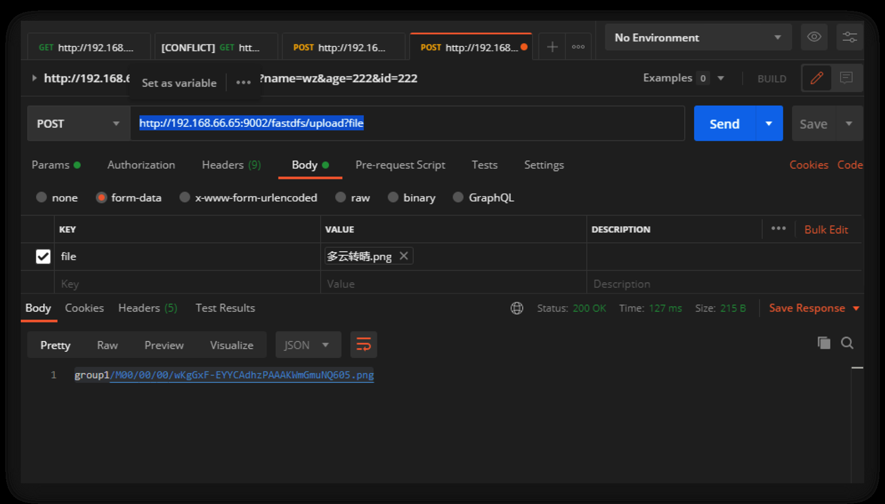

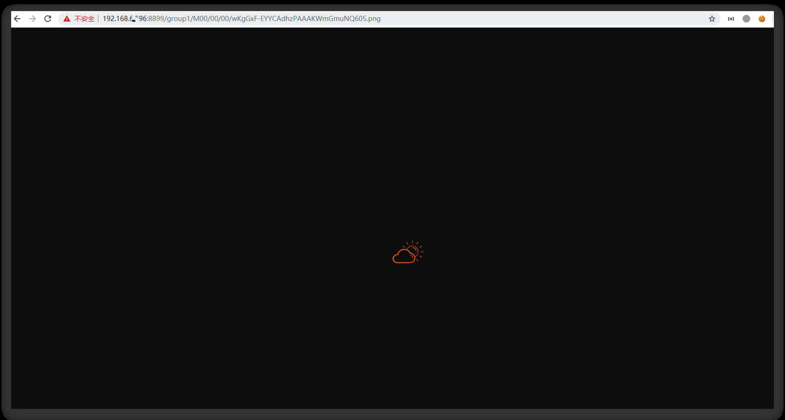

如图，已经上传成功；

【负载均衡】http://192.168.66.96:8899/group1/M00/00/00/wKgGxF-EYYCAdhzPAAAKWmGmuNQ605.png

【机器1】http://192.168.66.96:8888/group1/M00/00/00/wKgGxF-EYYCAdhzPAAAKWmGmuNQ605.png

【机器2】http://192.168.66.91:8888/group1/M00/00/00/wKgGxF-EYYCAdhzPAAAKWmGmuNQ605.png

上传成功后，三个地址均可以通过HTTP访问；

以上就是一个简单的例子；

在上述的例子中，如果单独把这个项目打包，然后独立部署在需要的机器上，当作一个独立的服务，当某一个系统需要的时候，就可以在当前的机器上部署一个单独的fastDFS服务，不必再上传文件到项目本地；

同时文件服务的IP无需对外暴露，只需要在设置一下代理地址即可，暴露当前服务的ip和端口，隐藏真正的`192.168.66.96:8899`

```java
package com.scaffold.test.config;

import org.springframework.context.annotation.Configuration;
import org.springframework.web.servlet.config.annotation.ResourceHandlerRegistry;
import org.springframework.web.servlet.config.annotation.WebMvcConfigurerAdapter;

@Configuration
public class FastDFSConfig extends WebMvcConfigurerAdapter {

    // 代理文件资源到文件服务器
    @Override
    public void addResourceHandlers(ResourceHandlerRegistry registry) {
        registry.addResourceHandler("/group*/**").addResourceLocations("http://192.168.66.96:8899/");
        super.addResourceHandlers(registry);
    }
}
```

```java
package com.scaffold.test.controller;

import com.scaffold.test.utils.IpUtils;
import FastDFSClient;
import org.springframework.web.bind.annotation.PostMapping;
import org.springframework.web.bind.annotation.RequestMapping;
import org.springframework.web.bind.annotation.RequestParam;
import org.springframework.web.bind.annotation.RestController;
import org.springframework.web.multipart.MultipartFile;

@RestController
@RequestMapping("fastdfs")
public class FastController {

    @PostMapping("upload")
    public String uploadFIle(@RequestParam MultipartFile file) {
        String ipAddress = IpUtils.getIpAddress();
        String port = "9002";
        String path = FastDFSClient.uploadFile(file);
        return "http://"+ipAddress+":"+port + "/"+path;
    }
}
```

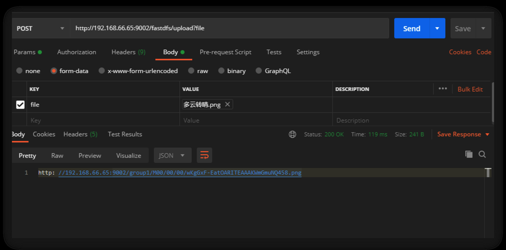


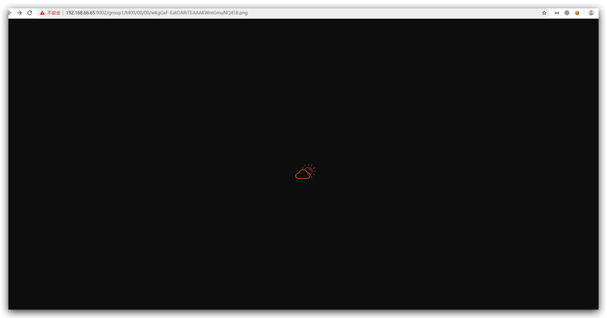

本机地址访问成功；

## 4、总结

独立的文件系统架构，可服务于各个系统，达到复用的目的。以上只是个简单的例子，相关代码需要自行添加。