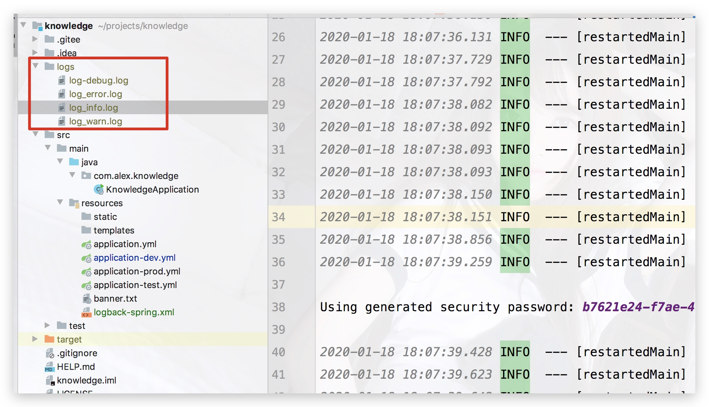

### 前言

使用logback我们可以自定义控制台日志输出，可以实现对不同日志不同级别打印到不同的文件中，可以对日志进行归档保存，并定时删除；

对于一个应用来讲，一个好的日志系统，对于对问题的追溯有很大的帮助，也有助于线上问题的查找和解决，所以我们来配置下`logback日志`。

我们在初始化`Spring Boot`项目的时候，默认安装了`spring-boot-starter-web`,另外`Spring Boot`默认使用的就是`logback日志管理`，所以只需要配置一下即可开箱即用。

### 1、配置 pom

> pom.xml 新增配置

```xml
<?xml version="1.0" encoding="UTF-8"?>
<project xmlns="http://maven.apache.org/POM/4.0.0" xmlns:xsi="http://www.w3.org/2001/XMLSchema-instance"
         xsi:schemaLocation="http://maven.apache.org/POM/4.0.0 https://maven.apache.org/xsd/maven-4.0.0.xsd">
    <modelVersion>4.0.0</modelVersion>
    <parent>
        <groupId>org.springframework.boot</groupId>
        <artifactId>spring-boot-starter-parent</artifactId>
        <version>2.2.3.RELEASE</version>
        <relativePath/>
        <!-- lookup parent from repository -->
    </parent>
    <groupId>com.alex</groupId>
    <artifactId>knowledge</artifactId>
    <version>1.0.0</version>
    <name>knowledge</name>
    <description>knowledge share project for Spring Boot</description>
    
    <properties>
        <!-- 配置java版本 -->
        <java.version>1.8</java.version>
    </properties>
    
    <dependencies>
    
        <!-- Spring Boot web依赖，Spring Boot默认使用的就是logback日志管理 -->
        <dependency>
            <groupId>org.springframework.boot</groupId>
            <artifactId>spring-boot-starter-web</artifactId>
        </dependency>

    </dependencies>
    
</project>
```


### 2、在resource下创建logback-spring.xml文件

```md
logback配置文件中属性说明
logback默认有五个日志级别，从低到高分别为(大小写无所谓)：
trace < debug < info < warn < error

SpringBoot默认为我们输出的日志级别为info、warn、error，如果还使用其他级别的日志，可以在配置中进行配置

<configuration>：用来配置logback
scan：表示配置文件如果发生改变，是否会被重新加载，默认为true
scanPeriod：设置监测配置文件是否有修改的时间间隔，如果没有给出时间单位，默认单位是秒；当scan为true时，此属性生效。默认的时间间隔为1分钟
debug：当此属性设置为true时，将打印出logback内部日志信息，实时查看logback运行状态。默认值为false
<include>：用来引入外部资源文件
resource：表示资源路径
<contextName>：每个logger都关联到logger上下文，默认上下文名称为default，但可以使用设置成其他名字，用于区分不同应用程序的记录，一旦设置，不能修改，可以通过%contextName来打印日志上下文名称
<property>：自定义变量，使用${}来使用变量
name：变量名
value：变量值
<appender>：日志输出策略
name：策略名称
class：何种策略。ch.qos.logback.core.ConsoleAppender是对应的控制台输出策略；ch.qos.logback.core.rolling.RollingFileAppender是对应的文件输出策略
<filter>：可以输出指定日志输出级别以上的日志输出，日志输出级别以下的将不输出
class：何种过滤器，ch.qos.logback.classic.filter.ThresholdFilter为系统自带的过滤器
<level>：日志输出级别
<encoder>：设置日志输出的格式
charset：日志输出的编码
<pattern>：日志输出的格式
<file>：日志输出的路径及文件名
<rollingPolicy>：设置日志切割策略
class：日志切割策略
<fileNamePattern>：定义了日志的切割方式，把每一天的日志归档到一个文件中
<timeBasedFileNamingAndTriggeringPolicy>：定义日志切割文件
<maxFileSize>：用于指定日志文件的上限大小，到了这个上限值，就会删除旧的日志
<maxHistory>：表示只保存最近多少天的日志，以防止日志填满整个磁盘空间
<logger>：用来指定某一个包或者具体的类的日志打印级别
name：某一个包或者具体的类
level：指定日志输出级别
additivity：是否向上传递
<level>：指定日志输出级别
value：指定日志输出级别
<appender-ref>：引用自定义的日志输出策略，就是<appender>
ref：引用日志输出策略
<root>：用来指定最基础的日志输出级别
level：指定日志输出级别
<appender-ref>：引用自定义的日志输出策略，就是<appender>
ref：引用日志输出策略
<springProfile>：用来指定不同环境来使不同的日志输出
name：使用的环境名称，多个环境使用,分开，需在application.yml文件中通过spring.profiles.active来指定当前使用的环境，!pro表示当为环境为pro时禁用以下配置
<root>：和上面的root配置一致
<logger>：和上面的root配置一致

```

> logback-spring.xml

```xml
<?xml version="1.0" encoding="UTF-8"?>
<!-- 日志级别从低到高分为TRACE < DEBUG < INFO < WARN < ERROR < FATAL，如果设置为WARN，则低于WARN的信息都不会输出 -->
<!-- scan:当此属性设置为true时，配置文件如果发生改变，将会被重新加载，默认值为true -->
<!-- scanPeriod:设置监测配置文件是否有修改的时间间隔，如果没有给出时间单位，默认单位是毫秒。当scan为true时，此属性生效。默认的时间间隔为1分钟。 -->
<!-- debug:当此属性设置为true时，将打印出logback内部日志信息，实时查看logback运行状态。默认值为false。 -->
<configuration scan="true" scanPeriod="10 seconds">

    <contextName>logback</contextName>
    <!-- name的值是变量的名称，value的值时变量定义的值。通过定义的值会被插入到logger上下文中。定义变量后，可以使“${}”来使用变量。 -->
    <property name="log.path" value="./logs"/>
    <property name="log_pattern" value="%d{yyyy-MM-dd HH:mm:ss.SSS} %-5level --- [%thread] %logger{50} - %msg%n"/>
    <property name="log_fileNamePattern" value="-%d{yyyy-MM-dd}.%i.log"/>
    <property name="log_maxFileSize" value="100MB"/>
    <property name="log_maxHistory" value="15"/>

    <!--输出到控制台-->
    <appender name="CONSOLE" class="ch.qos.logback.core.ConsoleAppender">
        <!--此日志appender是为开发使用，只配置最底级别，控制台输出的日志级别是大于或等于此级别的日志信息-->
        <filter class="ch.qos.logback.classic.filter.ThresholdFilter">
            <level>INFO</level>
        </filter>
        <encoder charset="UTF-8">
            <pattern>${log_pattern}</pattern>
        </encoder>
    </appender>


    <!--输出到文件-->

    <!-- 时间滚动输出 level为 DEBUG 日志 -->
    <appender name="DEBUG_FILE" class="ch.qos.logback.core.rolling.RollingFileAppender">
        <!-- 正在记录的日志文件的路径及文件名 -->
        <file>${log.path}/log-debug.log</file>
        <!--日志文件输出格式-->
        <encoder>
            <pattern>${log_pattern}</pattern>
            <charset>UTF-8</charset> <!-- 设置字符集 -->
        </encoder>
        <!-- 日志记录器的滚动策略，按日期，按大小记录 -->
        <rollingPolicy class="ch.qos.logback.core.rolling.TimeBasedRollingPolicy">
            <!-- 日志归档 -->
            <fileNamePattern>${log.path}/log-debug-${log_fileNamePattern}</fileNamePattern>
            <timeBasedFileNamingAndTriggeringPolicy class="ch.qos.logback.core.rolling.SizeAndTimeBasedFNATP">
                <maxFileSize>${log_maxFileSize}</maxFileSize>
            </timeBasedFileNamingAndTriggeringPolicy>
            <!--日志文件保留天数-->
            <maxHistory>${log_maxHistory}</maxHistory>
        </rollingPolicy>
        <!-- 此日志文件只记录debug级别的 -->
        <filter class="ch.qos.logback.classic.filter.LevelFilter">
            <level>debug</level>
            <onMatch>ACCEPT</onMatch>
            <onMismatch>DENY</onMismatch>
        </filter>

    </appender>

    <!-- 时间滚动输出 level为 INFO 日志 -->
    <appender name="INFO_FILE" class="ch.qos.logback.core.rolling.RollingFileAppender">
        <!-- 正在记录的日志文件的路径及文件名 -->
        <file>${log.path}/log_info.log</file>
        <!--日志文件输出格式-->
        <encoder>
            <pattern>${log_pattern}</pattern>
            <charset>UTF-8</charset> <!-- 设置字符集 -->
        </encoder>
        <!-- 日志记录器的滚动策略，按日期，按大小记录 -->
        <rollingPolicy class="ch.qos.logback.core.rolling.TimeBasedRollingPolicy">
            <!-- 日志归档 -->
            <fileNamePattern>${log.path}/log-info-${log_fileNamePattern}</fileNamePattern>
            <timeBasedFileNamingAndTriggeringPolicy class="ch.qos.logback.core.rolling.SizeAndTimeBasedFNATP">
                <maxFileSize>${log_maxFileSize}</maxFileSize>
            </timeBasedFileNamingAndTriggeringPolicy>
            <!--日志文件保留天数-->
            <maxHistory>${log_maxHistory}</maxHistory>
        </rollingPolicy>
        <!-- 此日志文件只记录info级别的 -->
        <filter class="ch.qos.logback.classic.filter.LevelFilter">
            <level>info</level>
            <onMatch>ACCEPT</onMatch>
            <onMismatch>DENY</onMismatch>
        </filter>
    </appender>

    <!-- 时间滚动输出 level为 WARN 日志 -->
    <appender name="WARN_FILE" class="ch.qos.logback.core.rolling.RollingFileAppender">
        <!-- 正在记录的日志文件的路径及文件名 -->
        <file>${log.path}/log_warn.log</file>
        <!--日志文件输出格式-->
        <encoder>
            <pattern>${log_pattern}</pattern>
            <charset>UTF-8</charset> <!-- 设置字符集 -->
        </encoder>
        <!-- 日志记录器的滚动策略，按日期，按大小记录 -->
        <rollingPolicy class="ch.qos.logback.core.rolling.TimeBasedRollingPolicy">
            <!-- 日志归档 -->
            <fileNamePattern>${log.path}/log-warn-${log_fileNamePattern}</fileNamePattern>
            <timeBasedFileNamingAndTriggeringPolicy class="ch.qos.logback.core.rolling.SizeAndTimeBasedFNATP">
                <maxFileSize>${log_maxFileSize}</maxFileSize>
            </timeBasedFileNamingAndTriggeringPolicy>
            <!--日志文件保留天数-->
            <maxHistory>${log_maxHistory}</maxHistory>
        </rollingPolicy>
        <!-- 此日志文件只记录warn级别的 -->
        <filter class="ch.qos.logback.classic.filter.LevelFilter">
            <level>warn</level>
            <onMatch>ACCEPT</onMatch>
            <onMismatch>DENY</onMismatch>
        </filter>
    </appender>

    <!-- 时间滚动输出 level为 ERROR 日志 -->
    <appender name="ERROR_FILE" class="ch.qos.logback.core.rolling.RollingFileAppender">
        <!-- 正在记录的日志文件的路径及文件名 -->
        <file>${log.path}/log_error.log</file>
        <!--日志文件输出格式-->
        <encoder>
            <pattern>${log_pattern}</pattern>
            <charset>UTF-8</charset> <!-- 设置字符集 -->
        </encoder>
        <!-- 日志记录器的滚动策略，按日期，按大小记录 -->
        <rollingPolicy class="ch.qos.logback.core.rolling.TimeBasedRollingPolicy">
            <!-- 日志归档 -->
            <fileNamePattern>${log.path}/log-error-${log_fileNamePattern}</fileNamePattern>
            <timeBasedFileNamingAndTriggeringPolicy class="ch.qos.logback.core.rolling.SizeAndTimeBasedFNATP">
                <maxFileSize>${log_maxFileSize}</maxFileSize>
            </timeBasedFileNamingAndTriggeringPolicy>
            <!--日志文件保留天数-->
            <maxHistory>${log_maxHistory}</maxHistory>
        </rollingPolicy>
        <!-- 此日志文件只记录ERROR级别的 -->
        <filter class="ch.qos.logback.classic.filter.LevelFilter">
            <level>ERROR</level>
            <onMatch>ACCEPT</onMatch>
            <onMismatch>DENY</onMismatch>
        </filter>
    </appender>
    

    <!--开发环境:打印控制台-->
    <springProfile name="dev">
        <logger name="com.nmys.view" level="debug"/>
    </springProfile>

    <root level="info">
        <appender-ref ref="CONSOLE"/>
        <appender-ref ref="DEBUG_FILE"/>
        <appender-ref ref="INFO_FILE"/>
        <appender-ref ref="WARN_FILE"/>
        <appender-ref ref="ERROR_FILE"/>
    </root>

    <!--测试环境:输出到文件-->
    <springProfile name="test">
        <root level="info">
            <appender-ref ref="CONSOLE"/>
            <appender-ref ref="DEBUG_FILE"/>
            <appender-ref ref="INFO_FILE"/>
            <appender-ref ref="ERROR_FILE"/>
            <appender-ref ref="WARN_FILE"/>
        </root>
    </springProfile>

    <!--生产环境:输出到文件-->
    <springProfile name="pro">
        <root level="info">
            <appender-ref ref="CONSOLE"/>
            <appender-ref ref="DEBUG_FILE"/>
            <appender-ref ref="INFO_FILE"/>
            <appender-ref ref="ERROR_FILE"/>
            <appender-ref ref="WARN_FILE"/>
        </root>
    </springProfile>


</configuration>
```
生成四种不同级别的日志如图：



🆗闲话不多说，好了，这一小章到此结束；

代码仓库地址：[点击进入](https://gitee.com/master2011zhao/knowledge)