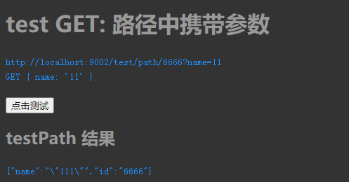

[TOC]

## 1、前言

实际项目中，大多数项目，前后端是分离的。`前端发HTTP请求到后端Server`，然后后端接收参数做相应业务逻辑。

> 首先先说下请求类型:

~~~http

GET
GET方法请求一个指定资源的表示形式. 使用GET的请求应该只被用于获取数据.

HEAD
HEAD方法请求一个与GET请求的响应相同的响应，但没有响应体.

POST
POST方法用于将实体提交到指定的资源，通常导致在服务器上的状态变化或副作用.

PUT
PUT方法用请求有效载荷替换目标资源的所有当前表示。

DELETE
DELETE方法删除指定的资源。

CONNECT
CONNECT方法建立一个到由目标资源标识的服务器的隧道。

OPTIONS
OPTIONS方法用于描述目标资源的通信选项。

TRACE
TRACE方法沿着到目标资源的路径执行一个消息环回测试。

PATCH
PATCH方法用于对资源应用部分修改。
~~~

实际上常用的类型也就是`GET和POST，GET是从服务器获取资源，POST是提交资料到服务器`；

不过很多开发的同学，都不区分两者的区别，最好还是区分一下，两者毕竟有所不同；

那么HTTP 请求都有什么类型的参数呢？

## 2、请求参数

大多有这三类请求参数类型：

1.  (GET)请求路径参数用`@PathVariable` : http://localhost:9002/test/user/{userId}
2.  (GET)URL中存在查询参数用`@RequestParam`:  http://localhost:9002/test/get?name=11&age=22
3. (POST) 参数存在于request body中用 `@RequestBody`: 参数可能是Object， 也可能是List

## 3、实例分析

`我们这里不使用前端的任何框架，以纯JS的形式，去封装一个HTTP方法，发送HTTP请求`；

> src/main/resources/templates/js/test.js

~~~javascript
//封装HTTP请求方法
const http = {
    // 请求方法
    request: (params = {}) => {
        // 默认参数和参数合并
        const requestParams = Object.assign({
            type: 'GET',
            url: '',
            dateType: 'json',//请求返回结果类型
            data: {
                // 请求参数
            },
            headers: {
                // 请求头
            },
            callback0: () => {
                // 报文成功返回后回调
            }
        }, params);
        // 请求
        const xhr = new XMLHttpRequest();
        // 请求方法
        const {type, data, url, headers} = requestParams;
        const requestMethod = ('' + type).toLocaleLowerCase();
        // url 是否携带参数
        const urlHasParams = requestMethod === 'get';
        const requestUrl = urlHasParams ? http.getUrlString(url, data) : url;

        // 参数类型
        const dataType = Object.prototype.toString.apply(data);

        xhr.open(type, requestUrl);
        if (dataType === '[object Array]') {
            xhr.setRequestHeader("Content-type", "application/json; charset=utf-8");
        }

        // 自定义表头
        Object.keys(headers).forEach(m => {
            xhr.setRequestHeader(m, headers[m]);
        });

        xhr.addEventListener("load", e => {
            const status = xhr.status;
            if (status === 200) {
                requestParams.callback0(xhr.response);
            } else {
                console.log(e);
            }
        });
        xhr.send(urlHasParams ? null : http.getFormData(data));
    },
    // Object 转化为 String
    getQueryString: (data = {}) => {
        let _r = [];
        Object.keys(data).forEach(m => {
            _r.push(`${m}=${JSON.stringify(data[m])}`);
        });
        _r = _r.join('&');
        return _r;
    },
    // GET 请求，参数合并到URL上
    getUrlString: (url, data) => {
        return url.includes('?') ? url + '&' + http.getQueryString(data) : url + '?' + http.getQueryString(data);
    },
    // formData
    getFormData: data => {
        const dataType = Object.prototype.toString.apply(data);
        // Object
        if (dataType === '[object Object]') {
            const formData = new FormData();
            Object.keys(data).forEach(m => {
                formData.append(m, data[m]);
            });
            return formData;
        } else {
            // Array
            return JSON.stringify(data);
        }
    }

};
~~~

### 3.1  GET 路径参数

> com.scaffold.test.controller.TestController

~~~java
    // 路径
    @GetMapping("/path/{id}")
    public Object testId(@PathVariable String id, @RequestParam String name) {
        Map<String, Object> map = new HashMap<>();
        map.put("id", id);
        map.put("name", name);
        return map;
    }
~~~

`@PathVariable`去接收路径参数；

> html

~~~html
<!--GET: 路径中携带参数-->
<h1>test GET: 路径中携带参数</h1>
<code>http://localhost:9002/test/path/6666?name=11</code>
 
<code>
    GET
    {
        name: '11'
    }
</code>
 
 
<button onclick="testPath()">点击测试</button>
<h2>testPath 结果</h2>
<code class="testPathResult"></code>
~~~

> js

~~~javascript
// Get 参数存在于路径中
const testPath = () => {
    http.request({
        url: '/test/path/6666',
        type: 'get',
        data: {
            name: '111',
        },
        callback0: data => {
            document.querySelector('.testPathResult').innerHTML = data;
        }
    })
};
~~~

> 结果

### 3.2 GET 单个参数

`GET请求，参数都会附加到URL上`，如： `http://localhost:9002/test/get?name=11&age=22`

~~~java
@GetMapping("/get")
public Object testGet(@RequestParam String name, @RequestParam int age) {
    Map<String, Object> result = new HashMap<>();
    // 数据处理
    result.put("name", name);
    result.put("age", age);
    return result;
}
~~~

> html

~~~html
<!--GET: 单个参数-->
<h1>test GET传参: 单个参数</h1>
<code>http://localhost:9002/test/get?name=11&age=22</code>
 
<code>
    GET
    {
        name: 'get',
        age: 22
    }
</code>
 
 
<button onclick="test1()">点击测试</button>
<h2>test1 结果</h2>
<code class="test1Result"></code>
 
~~~

> js

~~~javascript
// GET 参数类型为 Object
const test1 = () => {
    http.request({
        url: '/test/get',
        type: 'get',
        data: {
            name: 'get',
            age: 22
        },
        callback0: data => {
            document.querySelector('.test1Result').innerHTML = data;
        }
    })
};
~~~

> 结果

### 3.3 GET 接收参数为List

有时候前端需要传多个ID，如 `productId=1,2,3`

~~~java
// 数组接收
@GetMapping("/getList")
public Object testGet4(@RequestParam String[] productId) {
    ArrayList<Object> list = new ArrayList<>();
    for (String id : productId) {
        // 数据处理
        list.add(id);
    }
    return list;
}
~~~

> html

~~~html
<!--GET: 参数数组-->
<h1>test GET传参: 数组</h1>
<code>http://localhost:9002/test/getList?productId=1,2,3</code>
 
<code>
    GET
    {
    productId: 1,2,3
    }
</code>
 
 
<button onclick="test4()">点击测试</button>
<h2>test4 结果</h2>
<code class="test4Result"></code>
 
~~~

> js

~~~javascript
// GET 获取数组ID
const test4 = () => {
    http.request({
        url: '/test/getList',
        type: 'get',
        data: {
            productId: '1,2,3'
        },
        callback0: data => {
            document.querySelector('.test4Result').innerHTML = data;
        }
    })
};
~~~

> 结果

### 3.4 POST单个接收参数

POST请求和GET请求不同，POST请求一般是是在response body里面的；

> POST请求参数处理：

~~~javascript
// formData
getFormData: data => {
    const dataType = Object.prototype.toString.apply(data);
    // Object
    if (dataType === '[object Object]') {
        const formData = new FormData();
        Object.keys(data).forEach(m => {
            formData.append(m, data[m]);
        });
        return formData;
    } else {
        // Array
        return JSON.stringify(data);
    }
}
~~~

如果参数是Object，`用FromData的格式进行传参`，用`@RequestParam`接收；

如果参数是Object，`序列化数据直接进行传参（需指定Content-type：application/json; charset=utf-8）`；

> 这里我们先说，POST单个接收参数，也就是POST的参数是Object, 一个个接收;

~~~java
// 单个参数接收
@PostMapping("/post")
public Object testPost(@RequestParam String name, @RequestParam int age) {
    Map<String, Object> result = new HashMap<>();
    // 数据处理
    result.put("name", name);
    result.put("age", age);
    return result;
}
~~~

> 注意：
>
> 当前接收方式，前端必须是FromData格式进行传参；
>
> 当前Content-type是 Content-Type: multipart/form-data; boundary=----WebKitFormBoundaryNB8kMuHgB1nEVjBz

单个接收参数，在参数过多时，不适合这种写法；

> 这时，我们可以用实体类接收：

~~~java
    // 实体类接收：不加注解
    @PostMapping("/post22")
    public Object testPost22(Test data) {
        Map<String, Object> result = new HashMap<>();
        // 数据处理
        result.put("name", data.getName());
        result.put("age", data.getAge());
        return result;
    }
~~~

我们可以用`不加注解的方式用实体类接收`，这时候一定不能加注解 `@RequestBody`；

> 实体类Test

~~~java
public class Test implements Serializable {

    private static final long serialVersionUID=1L;

    @TableId(value = "id", type = IdType.AUTO)
    private Integer id;

    private String name;

    private String age;

}
~~~

`FromData参数形式Content-type是multipart/form-data；而 @RequestBody，一般是接收Content-type是application/json的参数，如果你在这里使用了@RequestBody，一定会报一下错误`：

~~~json
{"code":400,"message":"Content type 'multipart/form-data;boundary=----WebKitFormBoundarymrp2iCvqhwa3oMaR;charset=UTF-8' not supported"}
~~~

如果我们一定要使用`@RequestBody`接收参数，一定要记得设置Content-Type为application/json;

~~~java
// @RequestBody 实体类接收
@PostMapping("/post23")
public Object testPost2(@RequestBody Test data) {
    Map<String, Object> result = new HashMap<>();
    // 数据处理
    result.put("name", data.getName());
    result.put("age", data.getAge());
    return result;
}
~~~

所以，

为了方便测试，我们对HTTP请求方法做出了以下更改：

~~~javascript
 // formData
getFormData: data => {
    const dataType = Object.prototype.toString.apply(data);
    // Object
    // isFromData标注是否使用FromData方式发送参数
    if (dataType === '[object Object]' && data.isFromData) {
        const formData = new FormData();
        Object.keys(data).forEach(m => {
            formData.append(m, data[m]);
        });
        return formData;
    } else {
        // Array || Object(JSON格式传参)
        return JSON.stringify(data);
    }
}

// @ResponseBody注解，接收参数时，必须是application/json
// POST请求不以FromData格式时
if (dataType === '[object Array]' || (requestMethod == 'post' && !data.isFromData)) {
    xhr.setRequestHeader("Content-type", "application/json; charset=utf-8");
}
~~~

> 同时测试三种方法接受参数：

~~~java
    // @RequestParam 单个参数接收------前端使用FromData
    @PostMapping("/post")
    public Object testPost(@RequestParam String name, @RequestParam int age) {
        Map<String, Object> result = new HashMap<>();
        // 数据处理
        result.put("name", name);
        result.put("age", age);
        return result;
    }

    // 实体类接收：不加注解------前端使用FromData
    @PostMapping("/post22")
    public Object testPost22(Test data) {
        Map<String, Object> result = new HashMap<>();
        // 数据处理
        result.put("name", data.getName());
        result.put("age", data.getAge());
        return result;
    }

    // @RequestBody 实体类接收------前端不使用FromData
    @PostMapping("/post23")
    public Object testPost2(@RequestBody Test data) {
        Map<String, Object> result = new HashMap<>();
        // 数据处理
        result.put("name", data.getName());
        result.put("age", data.getAge());
        return result;
    }
~~~

> html

~~~html
<!--POST：单个参数，FromData格式-->
<h1>test POST：单个参数，FromData格式</h1>
<code>
    POST
    {
    name: 'post',
    age: 22
    }
</code>
 
 
<button onclick="test2()">点击测试</button>
<h2>test2 结果</h2>
<code class="test2Result"></code>
 

<!--POST：单个参数，以JSON格式发送-->
<h1>test POST：单个参数，以JSON格式发送</h1>
<code>
    POST
    {
        name: 'post',
        age: 23
    }
</code>
 
 
<button onclick="test23()">点击测试</button>
<h2>test23 结果</h2>
<code class="test23Result"></code>
 

~~~

> js

~~~javascript
// post 参数类型为 Object, FromData格式发送
const test2 = () => {
    http.request({
        url: '/test/post',
        type: 'post',
        data: {
            name: 'post',
            age: 22,
            isFromData: true
        },
        callback0: data => {
            document.querySelector('.test2Result').innerHTML = data;
        }
    })
};

// post 参数类型为 Object, FromData格式发送
const test22 = () => {
    http.request({
        url: '/test/post22',
        type: 'post',
        data: {
            name: 'post',
            age: 22,
            isFromData: true
        },
        callback0: data => {
            document.querySelector('.test2Result').innerHTML = data;
        }
    })
};

// post 参数类型为 Object, 以JSON格式发送
const test23 = () => {
    http.request({
        url: '/test/post23',
        type: 'post',
        data: {
            name: 'post',
            age: 23,
            isFromData: false
        },
        callback0: data => {
            document.querySelector('.test23Result').innerHTML = data;
        }
    })
};
~~~

> 结果

### 3.5 POST参数为List

`参数类型List时候，请求头Content-Type设置为application/json;使用@RequestBody注解；`

#### 3.5.1  List 类型1

> 当参数类型List为：此时单个list中有单个Map, Map里面没有List

~~~json
[
    {
        name: 'post2',
        age: 22
    },
    {
        name: 'post3',
        age: 23
    }
]
~~~

~~~java
// 数组接收
@PostMapping("/post3")
public Object testPost3(@RequestBody List<Test> data) {
    ArrayList<Object> result = new ArrayList<>();
    Map<String, Object> testMap = new HashMap<>();
    for (Test test : data) {
        // 逻辑处理在这里
        testMap.put("name", test.getName());
        testMap.put("age", test.getAge());
        result.add(testMap);
    }
    return result;
}
~~~

`此时的实体类：com.scaffold.test.entity.Test`

~~~java
@Data
@EqualsAndHashCode(callSuper = false)
@JsonInclude(JsonInclude.Include.NON_NULL)
public class Test implements Serializable {

    private static final long serialVersionUID=1L;

    @TableId(value = "id", type = IdType.AUTO)
    private Integer id;

    private String name;

    private String age;

}
~~~

`此时的html`:

~~~html
<!--POST: 数组（纯数组）-->
<h1>test POST: 数组（纯数组）</h1>
<code>
    POST
    [
        {
            name: 'post2',
            age: 22
        },
        {
            name: 'post3',
            age: 23
        }
    ]
</code>
 
 
<button onclick="test3()">点击测试</button>
<h2>test3 结果</h2>
<code class="test3Result"></code>
 

~~~

`此时的Js`:

~~~javascript
// POST 参数类型为 list
const test3 = () => {
    http.request({
        url: '/test/post3',
        type: 'post',
        data: [
            {
                name: 'post2',
                age: 22
            },
            {
                name: 'post3',
                age: 23
            }
        ],
        callback0: data => {
            document.querySelector('.test3Result').innerHTML = data;
        }
    })
};
~~~

> 结果

#### 3.5.2 list 类型2

~~~json
[
    {
        "name": "post2",
        "age": 22,
        "list": [
            {
                "name": "post22",
                "age": 2233
            }
        ]
    },
    {
        "name": "post3",
        "age": 23,
        "list": [
            {
                "name": "post33",
                "age": 2233
            }
        ]
    }
]
~~~

> 此时我们的实体类：com.scaffold.test.entity.TestList

~~~java
@Data
@JsonInclude(JsonInclude.Include.NON_NULL)
public class TestList {

    private String name;

    private int age;

    private List<Test> list;

}
~~~

~~~java
    // 数组接收, map里面还有数组类型
    @PostMapping("/post5")
    public Object testPost5(@RequestBody List<TestList> testList) {
        return testList;
    }
~~~

> html

~~~html

<!--POST传参: 数组中有map, map中还包括数组-->
<h1>test POST传参: 数组中有map, map中还包括数组</h1>
<code>
    POST
    [
        {
            name: 'post2',
            age: 22,
            list: [
                {
                    name: 'post22',
                    age: 2233,
                }
            ]
        },
        {
            name: 'post3',
            age: 23,
            list: [
                {
                    name: 'post33',
                    age: 2233,
                }
            ]
        }
    ]
</code>
 
 
<button onclick="test5()">点击测试</button>
<h2>test5 结果</h2>
<code class="test5Result"></code>
 

~~~

> js

~~~javascript
// 测试方法5
const test5 = () => {
    http.request({
        url: '/test/post5',
        type: 'post',
        data: [
            {
                name: 'post2',
                age: 22,
                list: [
                    {
                        name: 'post22',
                        age: 2233,
                    }
                ]
            },
            {
                name: 'post3',
                age: 23,
                list: [
                    {
                        name: 'post33',
                        age: 2233,
                    }
                ]
            }
        ],
        callback0: data => {
            document.querySelector('.test5Result').innerHTML = data;
        }
    })
};
~~~

> 结果

## 4、完整代码

> src/main/resources/templates/js/test.js

~~~javascript
//封装HTTP请求方法
const http = {
    // 请求方法
    request: (params = {}) => {
        // 默认参数和参数合并
        const requestParams = Object.assign({
            type: 'GET',
            url: '',
            dateType: 'json',//请求返回结果类型
            data: {
                // 请求参数
            },
            headers: {
                // 请求头
            },
            callback0: () => {
                // 报文成功返回后回调
            }
        }, params);
        // 请求
        const xhr = new XMLHttpRequest();
        // 请求方法
        const {type, data, url, headers} = requestParams;
        const requestMethod = ('' + type).toLocaleLowerCase();
        // url 是否携带参数
        const urlHasParams = requestMethod === 'get';
        const requestUrl = urlHasParams ? http.getUrlString(url, data) : url;

        // 参数类型
        const dataType = Object.prototype.toString.apply(data);

        xhr.open(type, requestUrl);

        // @ResponseBody注解，接收参数时，必须是application/json
        // POST请求不以FromData格式时
        if (dataType === '[object Array]' || (requestMethod == 'post' && !data.isFromData)) {
            xhr.setRequestHeader("Content-type", "application/json; charset=utf-8");
        }

        // 自定义表头
        Object.keys(headers).forEach(m => {
            xhr.setRequestHeader(m, headers[m]);
        });

        xhr.addEventListener("load", e => {
            const status = xhr.status;
            if (status === 200) {
                requestParams.callback0(xhr.response);
            } else {
                console.log(e);
            }
        });
        xhr.send(urlHasParams ? null : http.getFormData(data));
    },
    // Object 转化为 String
    getQueryString: (data = {}) => {
        let _r = [];
        Object.keys(data).forEach(m => {
            _r.push(`${m}=${JSON.stringify(data[m])}`);
        });
        _r = _r.join('&');
        return _r;
    },
    // GET 请求，参数合并到URL上
    getUrlString: (url, data) => {
        return url.includes('?') ? url + '&' + http.getQueryString(data) : url + '?' + http.getQueryString(data);
    },
    // formData
    getFormData: data => {
        const dataType = Object.prototype.toString.apply(data);
        // Object
        // isFromData标注是否使用FromData方式发送参数
        if (dataType === '[object Object]' && data.isFromData) {
            const formData = new FormData();
            Object.keys(data).forEach(m => {
                formData.append(m, data[m]);
            });
            return formData;
        } else {
            // Array || Object(JSON格式传参)
            return JSON.stringify(data);
        }
    }

};

// GET 参数类型为 Object
const test1 = () => {
    http.request({
        url: '/test/get',
        type: 'get',
        data: {
            name: 'get',
            age: 22
        },
        callback0: data => {
            document.querySelector('.test1Result').innerHTML = data;
        }
    })
};

// Get 参数存在于路径中
const testPath = () => {
    http.request({
        url: '/test/path/6666',
        type: 'get',
        data: {
            name: '111',
        },
        callback0: data => {
            document.querySelector('.testPathResult').innerHTML = data;
        }
    })
};

// post 参数类型为 Object, FromData格式发送
const test2 = () => {
    http.request({
        url: '/test/post',
        type: 'post',
        data: {
            name: 'post',
            age: 22,
            isFromData: true
        },
        callback0: data => {
            document.querySelector('.test2Result').innerHTML = data;
        }
    })
};

// post 参数类型为 Object, FromData格式发送
const test22 = () => {
    http.request({
        url: '/test/post22',
        type: 'post',
        data: {
            name: 'post',
            age: 22,
            isFromData: true
        },
        callback0: data => {
            document.querySelector('.test2Result').innerHTML = data;
        }
    })
};

// post 参数类型为 Object, 以JSON格式发送
const test23 = () => {
    http.request({
        url: '/test/post23',
        type: 'post',
        data: {
            name: 'post',
            age: 23,
            isFromData: false
        },
        callback0: data => {
            document.querySelector('.test23Result').innerHTML = data;
        }
    })
};

// POST 参数类型为 list
const test3 = () => {
    http.request({
        url: '/test/post3',
        type: 'post',
        data: [
            {
                name: 'post2',
                age: 22
            },
            {
                name: 'post3',
                age: 23
            }
        ],
        callback0: data => {
            document.querySelector('.test3Result').innerHTML = data;
        }
    })
};

// GET 获取数组ID
const test4 = () => {
    http.request({
        url: '/test/getList',
        type: 'get',
        data: {
            productId: '1,2,3'
        },
        callback0: data => {
            document.querySelector('.test4Result').innerHTML = data;
        }
    })
};

// 获取请求头数据
const testHeader = () => {
    http.request({
        url: '/test/header',
        type: 'post',
        headers: {
            privateHeader: "test88888",
            privateHeader2: "test888882",
        },
        callback0: data => {
            document.querySelector('.testHeaderResult').innerHTML = data;
        }
    })
};

// 获取所有请求头数据
const testHeaders = () => {
    http.request({
        url: '/test/headers',
        type: 'get',
        headers: {
            privateHeader: "test888881",
            privateHeader2: "test888882",
            privateHeader3: "test888883",
        },
        callback0: data => {
            document.querySelector('.testHeadersResult').innerHTML = data;
        }
    })
};

// 测试方法5
const test5 = () => {
    http.request({
        url: '/test/post5',
        type: 'post',
        data: [
            {
                name: 'post2',
                age: 22,
                list: [
                    {
                        name: 'post22',
                        age: 2233,
                    }
                ]
            },
            {
                name: 'post3',
                age: 23,
                list: [
                    {
                        name: 'post33',
                        age: 2233,
                    }
                ]
            }
        ],
        callback0: data => {
            document.querySelector('.test5Result').innerHTML = data;
        }
    })
};
~~~

> src/main/resources/templates/test.html

~~~html
<!DOCTYPE html>
<html lang="en">
<head>
    <meta charset="UTF-8">
    <title>Test</title>
    
</head>
<body>
<!--GET: 单个参数-->
<h1>test GET传参: 单个参数</h1>
<code>http://localhost:9002/test/get?name=11&age=22</code>
 
<code>
    GET
    {
        name: 'get',
        age: 22
    }
</code>
 
 
<button onclick="test1()">点击测试</button>
<h2>test1 结果</h2>
<code class="test1Result"></code>
 

<!--GET: 路径中携带参数-->
<h1>test GET: 路径中携带参数</h1>
<code>http://localhost:9002/test/path/6666?name=11</code>
 
<code>
    GET
    {
    name: '11'
    }
</code>
 
 
<button onclick="testPath()">点击测试</button>
<h2>testPath 结果</h2>
<code class="testPathResult"></code>
 

<!--GET: 参数数组-->
<h1>test GET传参: 数组</h1>
<code>http://localhost:9002/test/getList?productId=1,2,3</code>
 
<code>
    GET
    {
    productId: 1,2,3
    }
</code>
 
 
<button onclick="test4()">点击测试</button>
<h2>test4 结果</h2>
<code class="test4Result"></code>
 

<!--GET || POST : 获取请求头中数据-->
<h1>test GET || POST : 获取请求头中数据</h1>
<code>http://localhost:9002/test/header</code>
 
<code>
    GET || POST

    headers: {
    privateHeader: "test88888",
    privateHeader2: "test888882",
    }
</code>
 
 
<button onclick="testHeader()">点击测试</button>
<h2>testHeader 结果</h2>
<code class="testHeaderResult"></code>
 

<!--GET || POST: 获取请求头中所有的数据-->
<h1>test GET || POST : 获取请求头中所有的数据</h1>
<code>http://localhost:9002/test/headers</code>
 
<code>
    GET || POST

    headers: {
    privateHeader: "test888881",
    privateHeader2: "test888882",
    privateHeader3: "test888883",
    }
</code>
 
 
<button onclick="testHeaders()">点击测试</button>
<h2>testHeaders 结果</h2>
<code class="testHeadersResult"></code>
 

<!--POST：单个参数，FromData格式-->
<h1>test POST：单个参数，FromData格式</h1>
<code>
    POST
    {
    name: 'post',
    age: 22
    }
</code>
 
 
<button onclick="test2()">点击测试</button>
<h2>test2 结果</h2>
<code class="test2Result"></code>
 

<!--POST：单个参数，以JSON格式发送-->
<h1>test POST：单个参数，以JSON格式发送</h1>
<code>
    POST
    {
        name: 'post',
        age: 23
    }
</code>
 
 
<button onclick="test23()">点击测试</button>
<h2>test23 结果</h2>
<code class="test23Result"></code>
 

<!--POST: 数组（纯数组）-->
<h1>test POST: 数组（纯数组）</h1>
<code>
    POST
    [
        {
            name: 'post2',
            age: 22
        },
        {
            name: 'post3',
            age: 23
        }
    ]
</code>
 
 
<button onclick="test3()">点击测试</button>
<h2>test3 结果</h2>
<code class="test3Result"></code>
 

<!--POST传参: 数组中有map, map中还包括数组-->
<h1>test POST传参: 数组中有map, map中还包括数组</h1>
<code>
    POST
    [
    {
    name: 'post2',
    age: 22,
    list: [
    {
    name: 'post22',
    age: 2233,
    }
    ]
    },
    {
    name: 'post3',
    age: 23,
    list: [
    {
    name: 'post33',
    age: 2233,
    }
    ]
    }
    ]
</code>
 
 
<button onclick="test5()">点击测试</button>
<h2>test5 结果</h2>
<code class="test5Result"></code>
 

</body>
</html>
~~~

> com.scaffold.test.controller.TestController

~~~java
package com.scaffold.test.controller;

import com.scaffold.test.entity.Test;
import com.scaffold.test.entity.TestList;
import org.slf4j.Logger;
import org.slf4j.LoggerFactory;
import org.springframework.web.bind.annotation.*;

import javax.servlet.http.HttpServletRequest;
import java.util.ArrayList;
import java.util.HashMap;
import java.util.List;
import java.util.Map;

/**
 * 

 * 前端控制器
 * 

 *
 * @author alex wong
 * @since 2020-06-23
 */
@RestController
@RequestMapping("/test")
public class TestController {

    private static final Logger log = LoggerFactory.getLogger(TestController.class);

    @GetMapping("/get")
    public Object testGet(@RequestParam String name, @RequestParam int age) {
        Map<String, Object> result = new HashMap<>();
        // 数据处理
        result.put("name", name);
        result.put("age", age);
        return result;
    }

    // 数组接收
    @GetMapping("/getList")
    public Object testGet4(@RequestParam String[] productId) {
        ArrayList<Object> list = new ArrayList<>();
        for (String id : productId) {
            // 数据处理
            list.add(id);
        }
        return list;
    }

    // 路径
    @GetMapping("/path/{id}")
    public Object testId(@PathVariable String id, @RequestParam String name) {
        Map<String, Object> map = new HashMap<>();
        map.put("id", id);
        map.put("name", name);
        return map;
    }

    // @RequestParam 单个参数接收------前端使用FromData
    @PostMapping("/post")
    public Object testPost(@RequestParam String name, @RequestParam int age) {
        Map<String, Object> result = new HashMap<>();
        // 数据处理
        result.put("name", name);
        result.put("age", age);
        return result;
    }

    // 实体类接收：不加注解------前端使用FromData
    @PostMapping("/post22")
    public Object testPost22(Test data) {
        Map<String, Object> result = new HashMap<>();
        // 数据处理
        result.put("name", data.getName());
        result.put("age", data.getAge());
        return result;
    }

    // @RequestBody 实体类接收
    @PostMapping("/post23")
    public Object testPost23(@RequestBody Test data) {
        Map<String, Object> result = new HashMap<>();
        // 数据处理
        result.put("name", data.getName());
        result.put("age", data.getAge());
        return result;
    }

    // 数组接收
    @PostMapping("/post3")
    public Object testPost3(@RequestBody List<Test> data) {
        ArrayList<Object> result = new ArrayList<>();
        Map<String, Object> testMap = new HashMap<>();
        for (Test test : data) {
            // 逻辑处理在这里
            testMap.put("name", test.getName());
            testMap.put("age", test.getAge());
            result.add(testMap);
        }
        return result;
    }

    // 数组接收, map里面还有数组类型
    @PostMapping("/post5")
    public Object testPost5(@RequestBody List<TestList> testList) {
        return testList;
    }

    // 获取请求头
    @RequestMapping("/header")
    public Object getHeader(@RequestHeader(name = "privateHeader") String privateHeader, @RequestHeader(name = "privateHeader2") String privateHeader2) {
        HashMap<Object, Object> map = new HashMap<>();
        map.put("privateHeader", privateHeader);
        map.put("privateHeader2", privateHeader2);
        return map;
    }

    // 获取所有的请求头
    @RequestMapping("/headers")
    public Object getAllHeader(HttpServletRequest request) {
        Map<Object, Object> resultHeader = new HashMap<>();
        resultHeader.put("privateHeader", request.getHeader("privateHeader"));
        resultHeader.put("privateHeader2", request.getHeader("privateHeader2"));
        resultHeader.put("privateHeader3", request.getHeader("privateHeader3"));
        return resultHeader;
    }

    // 获取Cookie
    @RequestMapping("/cookie")
    public Object getCookie(@CookieValue(name = "token") String token) {
        return token;
    }

}
~~~

> 实体类

> com.scaffold.test.entity.Test

~~~java
package com.scaffold.test.entity;

import com.baomidou.mybatisplus.annotation.IdType;
import com.baomidou.mybatisplus.annotation.TableId;
import com.fasterxml.jackson.annotation.JsonInclude;
import lombok.Data;
import lombok.EqualsAndHashCode;

import java.io.Serializable;

/**
 * @author alex wong
 * @since 2020-06-23
 */
@Data
@EqualsAndHashCode(callSuper = false)
@JsonInclude(JsonInclude.Include.NON_NULL)
public class Test implements Serializable {

    private static final long serialVersionUID=1L;

    @TableId(value = "id", type = IdType.AUTO)
    private Integer id;

    private String name;

    private String age;

}

~~~

> com.scaffold.test.entity.TestList

~~~java
package com.scaffold.test.entity;

import com.fasterxml.jackson.annotation.JsonInclude;
import lombok.Data;

import java.util.List;

@Data
@JsonInclude(JsonInclude.Include.NON_NULL)
public class TestList {

    private String name;

    private int age;

    private List<Test> list;

}

~~~
