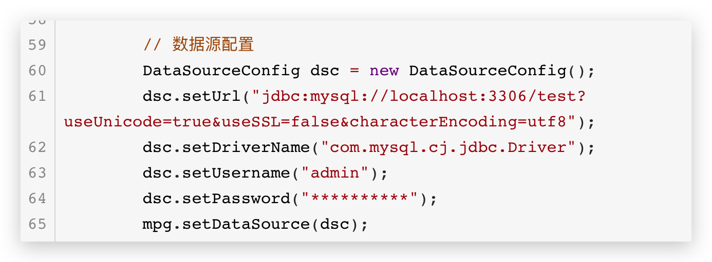

# spring Boot手把手教学: mybatis-plus 代码生成器

[TOC]

## 1、前言

俗话说：工欲善其事，必先利其器。

我们在使用`springBoot`开发项目的，刚开始的时候，肯定会手动去创建`Contoller`、`entity`、

、`Service`、`ServiceImpl`、`Mapper` 甚至 `xml`文件，手动效率实在是慢。

这里我们介绍，如何去利用代码生成器，帮我去新建各个模块代码；

`MyBatis-Plus` 的代码生成器，通过 `AutoGenerator` 可以快速生成 `Entity、Mapper、Mapper XML、Service、Controller `等各个模块的代码，极大的提升了开发效率。

> 效果预览:

> 代码预览

~~~java
package com.scaffold.test.base;

import com.baomidou.mybatisplus.core.exceptions.MybatisPlusException;
import com.baomidou.mybatisplus.core.toolkit.StringPool;
import com.baomidou.mybatisplus.core.toolkit.StringUtils;
import com.baomidou.mybatisplus.generator.AutoGenerator;
import com.baomidou.mybatisplus.generator.InjectionConfig;
import com.baomidou.mybatisplus.generator.config.*;
import com.baomidou.mybatisplus.generator.config.po.TableInfo;
import com.baomidou.mybatisplus.generator.config.rules.NamingStrategy;
import com.baomidou.mybatisplus.generator.engine.FreemarkerTemplateEngine;
import com.baomidou.mybatisplus.generator.engine.VelocityTemplateEngine;

import java.util.ArrayList;
import java.util.List;
import java.util.Scanner;

public class CodeGenerator {
    /**
     * 

     * 读取控制台内容
     * 

     */
    public static String scanner(String tip) {
        Scanner scanner = new Scanner(System.in);
        StringBuilder help = new StringBuilder();
        help.append("请输入" + tip + "：");
        System.out.println(help.toString());
        if (scanner.hasNext()) {
            String ipt = scanner.next();
            if (StringUtils.isNotEmpty(ipt)) {
                return ipt;
            }
        }
        throw new MybatisPlusException("请输入正确的" + tip + "！");
    }

    public static void main(String[] args) {
        // 代码生成器
        AutoGenerator mpg = new AutoGenerator();

        // 全局配置
        GlobalConfig gc = new GlobalConfig();
        String projectPath = System.getProperty("user.dir");
        gc.setOutputDir(projectPath + "/src/main/java");
        gc.setAuthor("alex wong");
        gc.setOpen(false);
        // 设置名字
        gc.setControllerName("%sController");
        gc.setServiceName("%sService");
        gc.setServiceImplName("%sServiceImpl");
        gc.setMapperName("%sMapper");
        // 设置 resultMap
        gc.setBaseResultMap(true);
        gc.setBaseColumnList(true);
//        gc.setFileOverride(true);
        // gc.setSwagger2(true); 实体属性 Swagger2 注解
        mpg.setGlobalConfig(gc);

        // 数据源配置
        DataSourceConfig dsc = new DataSourceConfig();
        dsc.setUrl("jdbc:mysql://localhost:3306/test?useUnicode=true&useSSL=false&characterEncoding=utf8");
        dsc.setDriverName("com.mysql.cj.jdbc.Driver");
        dsc.setUsername("admin");
        dsc.setPassword("你的mysql密码");
        mpg.setDataSource(dsc);

        // 自定义配置
        InjectionConfig cfg = new InjectionConfig() {
            @Override
            public void initMap() {
                // to do nothing
            }
        };

        // 包配置
        PackageConfig pc = new PackageConfig();
        //  pc.setModuleName(scanner("模块名"));
        pc.setParent("com.scaffold.test");
        mpg.setPackageInfo(pc);

        // 如果模板引擎是 velocity
         String templatePath = "/templates/mapper.xml.vm";

        // 自定义输出配置
        List<FileOutConfig> focList = new ArrayList<>();
        // 自定义配置会被优先输出
        focList.add(new FileOutConfig(templatePath) {
            @Override
            public String outputFile(TableInfo tableInfo) {
                // 自定义输出文件名 ， 如果你 Entity 设置了前后缀、此处注意 xml 的名称会跟着发生变化！！
                return projectPath + "/src/main/resources/mapper/" + pc.getModuleName()
                        + "/" + tableInfo.getEntityName() + "Mapper" + StringPool.DOT_XML;
            }
        });
        cfg.setFileOutConfigList(focList);
        mpg.setCfg(cfg);

        // 配置模板
        TemplateConfig templateConfig = new TemplateConfig();

        templateConfig.setXml(null);
        mpg.setTemplate(templateConfig);

        // 策略配置
        StrategyConfig strategy = new StrategyConfig();
        strategy.setNaming(NamingStrategy.underline_to_camel);
        strategy.setColumnNaming(NamingStrategy.underline_to_camel);
        strategy.setEntityLombokModel(true);
        strategy.setRestControllerStyle(true);
        // 写于父类中的公共字段
//        strategy.setSuperEntityColumns("id");
        strategy.setInclude(scanner("表名，多个英文逗号分割").split(","));
        strategy.setControllerMappingHyphenStyle(true);
        strategy.setTablePrefix(pc.getModuleName() + "_");
        mpg.setStrategy(strategy);
        mpg.setTemplateEngine(new VelocityTemplateEngine());
        mpg.execute();，
    }
}

~~~

## 2、安装依赖

初始一个spring boot项目我就不再多说了，可以参考以下：

引入 `spring-boot-starter`、`spring-boot-starter-test`、`mybatis-plus-boot-starter`、`lombok`、`mysql-connector` 依赖：

~~~xml
<dependencies>
        <dependency>
            <groupId>org.springframework.boot</groupId>
            <artifactId>spring-boot-starter</artifactId>
        </dependency>

        <dependency>
            <groupId>org.springframework.boot</groupId>
            <artifactId>spring-boot-starter-web</artifactId>
        </dependency>

        <dependency>
            <groupId>org.springframework.boot</groupId>
            <artifactId>spring-boot-starter-test</artifactId>
            <scope>test</scope>
            <exclusions>
                <exclusion>
                    <groupId>org.junit.vintage</groupId>
                    <artifactId>junit-vintage-engine</artifactId>
                </exclusion>
            </exclusions>
        </dependency>

        <!-- lombok 简化代码-->
        <dependency>
            <groupId>org.projectlombok</groupId>
            <artifactId>lombok</artifactId>
            <optional>true</optional>
        </dependency>

        <!--    mybatis-plus启动器    -->
        <dependency>
            <groupId>com.baomidou</groupId>
            <artifactId>mybatis-plus-boot-starter</artifactId>
            <version>3.3.2</version>
        </dependency>

        <!--  mysql jdbc -->
        <dependency>
            <groupId>mysql</groupId>
            <artifactId>mysql-connector-java</artifactId>
        </dependency>

        <!--   生成器  -->
        <dependency>
            <groupId>com.baomidou</groupId>
            <artifactId>mybatis-plus-generator</artifactId>
            <version>3.3.2</version>
        </dependency>

  			<!--   生成器默认版本依赖  -->
        <dependency>
            <groupId>org.apache.velocity</groupId>
            <artifactId>velocity-engine-core</artifactId>
            <version>2.0</version>
        </dependency>

    </dependencies>
~~~

## 3、配置

在 `application.yml` 配置文件中添加mysql数据库的相关配置

~~~yaml

server:
  port: 9002

spring:
  datasource:
    driver-class-name: com.mysql.cj.jdbc.Driver
    url: jdbc:mysql://127.0.0.1:3306/test
    username: admin
    password: ************

logging:
  level:
    root: warn
    com.mp.test.mapper: trace

~~~

## 4、生成器代码

新建 com.scaffold.test.base.CodeGenerator 类

~~~java
package com.scaffold.test.base;

import com.baomidou.mybatisplus.core.exceptions.MybatisPlusException;
import com.baomidou.mybatisplus.core.toolkit.StringPool;
import com.baomidou.mybatisplus.core.toolkit.StringUtils;
import com.baomidou.mybatisplus.generator.AutoGenerator;
import com.baomidou.mybatisplus.generator.InjectionConfig;
import com.baomidou.mybatisplus.generator.config.*;
import com.baomidou.mybatisplus.generator.config.po.TableInfo;
import com.baomidou.mybatisplus.generator.config.rules.NamingStrategy;
import com.baomidou.mybatisplus.generator.engine.VelocityTemplateEngine;

import java.util.ArrayList;
import java.util.List;
import java.util.Scanner;

public class CodeGenerator {
    /**
     * 

     * 读取控制台内容
     * 

     */
    public static String scanner(String tip) {
        Scanner scanner = new Scanner(System.in);
        StringBuilder help = new StringBuilder();
        help.append("请输入" + tip + "：");
        System.out.println(help.toString());
        if (scanner.hasNext()) {
            String ipt = scanner.next();
            if (StringUtils.isNotEmpty(ipt)) {
                return ipt;
            }
        }
        throw new MybatisPlusException("请输入正确的" + tip + "！");
    }

    public static void main(String[] args) {
        // 代码生成器
        AutoGenerator mpg = new AutoGenerator();

        // 全局配置
        GlobalConfig gc = new GlobalConfig();
        String projectPath = System.getProperty("user.dir");
        gc.setOutputDir(projectPath + "/src/main/java");
        gc.setAuthor("alex wong");
        gc.setOpen(false);
        // 设置名字
        gc.setControllerName("%sController");
        gc.setServiceName("%sService");
        gc.setServiceImplName("%sServiceImpl");
        gc.setMapperName("%sMapper");
        // 设置 resultMap
        gc.setBaseResultMap(true);
        gc.setBaseColumnList(true);
//        gc.setFileOverride(true);
        // gc.setSwagger2(true); 实体属性 Swagger2 注解
        mpg.setGlobalConfig(gc);

        // 数据源配置
        DataSourceConfig dsc = new DataSourceConfig();
        dsc.setUrl("jdbc:mysql://localhost:3306/test?useUnicode=true&useSSL=false&characterEncoding=utf8");
        dsc.setDriverName("com.mysql.cj.jdbc.Driver");
        dsc.setUsername("admin");
        dsc.setPassword("**********");
        mpg.setDataSource(dsc);

        // 自定义配置
        InjectionConfig cfg = new InjectionConfig() {
            @Override
            public void initMap() {
                // to do nothing
            }
        };

        // 包配置
        PackageConfig pc = new PackageConfig();
        //  pc.setModuleName(scanner("模块名"));
        pc.setParent("com.scaffold.test");
        mpg.setPackageInfo(pc);

        // 如果模板引擎是 velocity
         String templatePath = "/templates/mapper.xml.vm";

        // 自定义输出配置
        List<FileOutConfig> focList = new ArrayList<>();
        // 自定义配置会被优先输出
        focList.add(new FileOutConfig(templatePath) {
            @Override
            public String outputFile(TableInfo tableInfo) {
                // 自定义输出文件名 ， 如果你 Entity 设置了前后缀、此处注意 xml 的名称会跟着发生变化！！
                return projectPath + "/src/main/resources/mapper/" + pc.getModuleName()
                        + "/" + tableInfo.getEntityName() + "Mapper" + StringPool.DOT_XML;
            }
        });
        cfg.setFileOutConfigList(focList);
        mpg.setCfg(cfg);

        // 配置模板
        TemplateConfig templateConfig = new TemplateConfig();

        templateConfig.setXml(null);
        mpg.setTemplate(templateConfig);

        // 策略配置
        StrategyConfig strategy = new StrategyConfig();
        strategy.setNaming(NamingStrategy.underline_to_camel);
        strategy.setColumnNaming(NamingStrategy.underline_to_camel);
        strategy.setEntityLombokModel(true);
        strategy.setRestControllerStyle(true);
        // 写于父类中的公共字段
//        strategy.setSuperEntityColumns("id");
        strategy.setInclude(scanner("表名，多个英文逗号分割").split(","));
        strategy.setControllerMappingHyphenStyle(true);
        strategy.setTablePrefix(pc.getModuleName() + "_");
        mpg.setStrategy(strategy);
        mpg.setTemplateEngine(new VelocityTemplateEngine());
        mpg.execute();
    }
}

~~~

> 第一步：修改为你的数据源

> 第二步：修改包

> 第三步：执行 main 方法

这里输入的表名，必须是你数据库真是存在的表，否则不生效；

## 5、代码展示

以`job表`为例：

> jobController

~~~java
package com.scaffold.test.controller;

import org.springframework.web.bind.annotation.RequestMapping;

import org.springframework.web.bind.annotation.RestController;

/**
 * 

 *  前端控制器
 * 

 *
 * @author alex wong
 * @since 2020-06-14
 */
@RestController
@RequestMapping("/job")
public class JobController {

}

~~~

> job entity 实体类

~~~java
package com.scaffold.test.entity;

import com.baomidou.mybatisplus.annotation.IdType;
import com.baomidou.mybatisplus.annotation.TableId;
import java.io.Serializable;
import lombok.Data;
import lombok.EqualsAndHashCode;

/**
 * 

 * 
 * 

 *
 * @author alex wong
 * @since 2020-06-14
 */
@Data
@EqualsAndHashCode(callSuper = false)
public class Job implements Serializable {

    private static final long serialVersionUID=1L;

      @TableId(value = "id", type = IdType.AUTO)
    private Integer id;

    private String name;

    private Integer age;

    private String position;

}

~~~

> Job mapper

~~~java
package com.scaffold.test.mapper;

import com.scaffold.test.entity.Job;
import com.baomidou.mybatisplus.core.mapper.BaseMapper;

/**
 * 

 *  Mapper 接口
 * 

 *
 * @author alex wong
 * @since 2020-06-14
 */
public interface JobMapper extends BaseMapper<Job> {

}

~~~

> Job Service 服务类接口

~~~java
package com.scaffold.test.service;

import com.scaffold.test.entity.Job;
import com.baomidou.mybatisplus.extension.service.IService;

/**
 * 

 *  服务类
 * 

 *
 * @author alex wong
 * @since 2020-06-14
 */
public interface JobService extends IService<Job> {

}

~~~

> Job ServiceImpl 服务类的实现方法

~~~java
package com.scaffold.test.service.impl;

import com.scaffold.test.entity.Job;
import com.scaffold.test.mapper.JobMapper;
import com.scaffold.test.service.JobService;
import com.baomidou.mybatisplus.extension.service.impl.ServiceImpl;
import org.springframework.stereotype.Service;

/**
 * 

 *  服务实现类
 * 

 *
 * @author alex wong
 * @since 2020-06-14
 */
@Service
public class JobServiceImpl extends ServiceImpl<JobMapper, Job> implements JobService {

}

~~~

> Mapper XML

~~~xml
<?xml version="1.0" encoding="UTF-8"?>
<!DOCTYPE mapper PUBLIC "-//mybatis.org//DTD Mapper 3.0//EN" "http://mybatis.org/dtd/mybatis-3-mapper.dtd">
<mapper namespace="com.scaffold.test.mapper.JobMapper">

    <!-- 通用查询映射结果 -->
    <resultMap id="BaseResultMap" type="com.scaffold.test.entity.Job">
        <id column="id" property="id" />
        <result column="name" property="name" />
        <result column="age" property="age" />
        <result column="position" property="position" />
    </resultMap>

    <!-- 通用查询结果列 -->
    <sql id="Base_Column_List">
        id, name, age, position
    </sql>

</mapper>

~~~

## 6、代码测试

我们依然以 job 表为例，虽然单表操作执行，一般不用Mapper XML，可以使用Mybatis-plus的CRUD , 不过 我们接下来依然是用XML来做数据库操作。

### 6.1 添加工作

> 1、Mapper XML 增加sql语句 mapper/JobMapper.xml

~~~xml
<insert id="insertJob">
        insert into job
        (name, age, position)
        values
        (#{name}, #{age}, #{position})
    </insert>
~~~

> 2、com.scaffold.test.mapper.JobMapper

~~~java
package com.scaffold.test.mapper;

import com.scaffold.test.entity.Job;
import com.baomidou.mybatisplus.core.mapper.BaseMapper;
import org.springframework.beans.factory.annotation.Autowired;

/**
 * 

 *  Mapper 接口
 * 

 *
 * @author alex wong
 * @since 2020-06-14
 */
public interface JobMapper extends BaseMapper<Job> {

    public void insertJob(Job job);

}

~~~

> 3、增加Service接口和实现方法

> Service接口:  com.scaffold.test.service.JobService

~~~java
package com.scaffold.test.service;

import com.scaffold.test.entity.Job;
import com.baomidou.mybatisplus.extension.service.IService;

/**
 * 

 *  服务类
 * 

 *
 * @author alex wong
 * @since 2020-06-14
 */
public interface JobService extends IService<Job> {

    public String addJob(Job job);

}

~~~

> JobServiceImpl接口实现方法：com.scaffold.test.service.impl.JobServiceImpl

~~~java
package com.scaffold.test.service.impl;

import com.scaffold.test.entity.Job;
import com.scaffold.test.mapper.JobMapper;
import com.scaffold.test.service.JobService;
import com.baomidou.mybatisplus.extension.service.impl.ServiceImpl;
import org.springframework.beans.factory.annotation.Autowired;
import org.springframework.stereotype.Service;

/**
 * 

 * 服务实现类
 * 

 *
 * @author alex wong
 * @since 2020-06-14
 */
@Service
public class JobServiceImpl extends ServiceImpl<JobMapper, Job> implements JobService {

    @Autowired
    private JobMapper jobMapper;

    @Override
    public String addJob(Job job) {
        jobMapper.insertJob(job);
        return "添加成功";
    }
}

~~~

> JobController控制层：com.scaffold.test.controller.JobController

~~~java
package com.scaffold.test.controller;

import com.scaffold.test.entity.Job;
import com.scaffold.test.service.JobService;
import org.springframework.beans.factory.annotation.Autowired;
import org.springframework.web.bind.annotation.PostMapping;
import org.springframework.web.bind.annotation.RequestMapping;

import org.springframework.web.bind.annotation.RestController;

/**
 * 

 *  前端控制器
 * 

 *
 * @author alex wong
 * @since 2020-06-14
 */
@RestController
@RequestMapping("/job")
public class JobController {

    @Autowired
    private JobService jobService;

    @PostMapping("/add")
    public String add(){
        Job job = new Job();
        job.setAge(20);
        job.setPosition("总经理");
        job.setName("汪汪");
        return jobService.addJob(job);
    }
}

~~~

添加结果如下：

