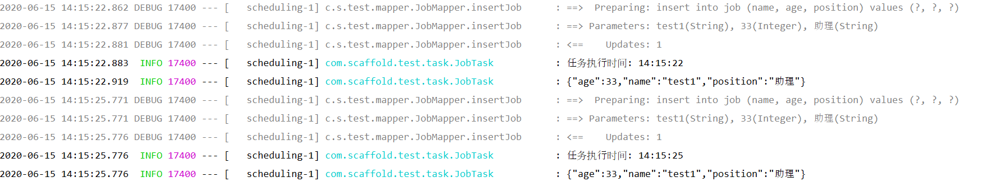
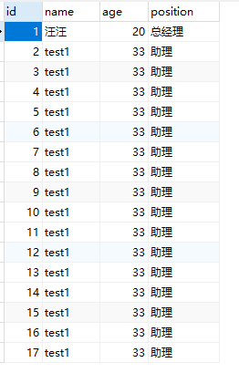
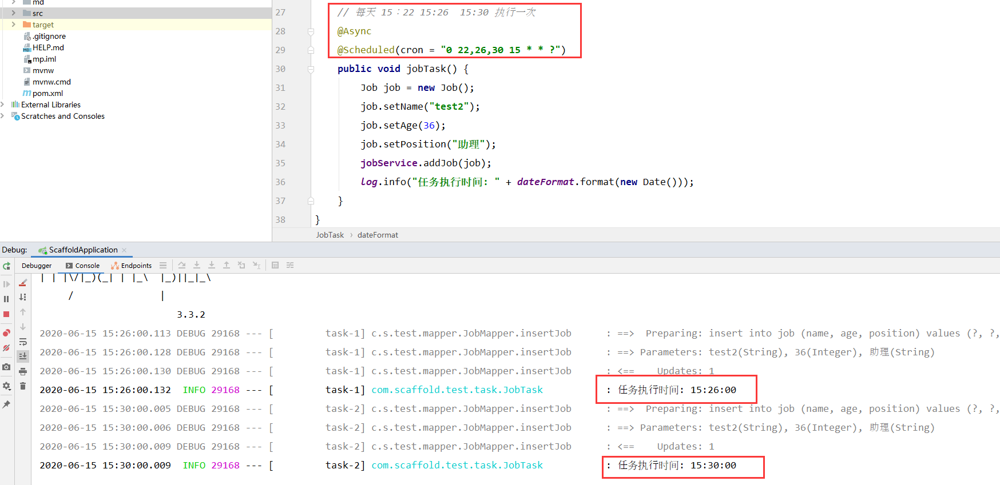

[TOC]

## 1、前言

项目开发中经常需要执行一些定时任务，比如在每天凌晨三点，需要动态分析处理一些数据后存入到 MySQL 数据库中，然后同步一些数据等等；

总之定时任务，对于项目数据的及时性处理，很重要；

这里我们讲解`Spring Boot` 定时任务 `@Scheduled`，这是Spring 提供的一个注解，使用比较简单。

## 2、开启定时任务

我们需要首先在启动类上添加`@EnableScheduling`注解，启动自动任务，保证定时任务在后台可以正常运行。

```java
@SpringBootApplication
@MapperScan("com.scaffold.test.mapper")
@RestController
@EnableScheduling
public class ScaffoldApplication {

    public static void main(String[] args) {
        SpringApplication.run(ScaffoldApplication.class, args);
    }

}
```

`@EnableScheduling注解的作用是发现注解@Scheduled的任务并后台执行`

## 3、新建一个定时任务

由于我们已经在启动类上开启了定时任务，所以我们现在可以新建一个定时任务。

编写定时任务类和方法，`定时任务类使用 @Component 注解，定时方法使用 @Scheduled 注解`

> com.scaffold.test.task.JobTask

```java
package com.scaffold.test.task;

import com.alibaba.fastjson.JSON;
import com.scaffold.test.entity.Job;
import com.scaffold.test.service.JobService;
import org.slf4j.Logger;
import org.slf4j.LoggerFactory;
import org.springframework.beans.factory.annotation.Autowired;
import org.springframework.scheduling.annotation.Scheduled;
import org.springframework.stereotype.Component;

import java.text.SimpleDateFormat;
import java.util.Date;

@Component
public class JobTask {

    @Autowired
    private JobService jobService;

    // 打印
    private static final Logger log = LoggerFactory.getLogger(JobTask.class);
    // 时间格式化
    private static final SimpleDateFormat dateFormat = new SimpleDateFormat("HH:mm:ss");

    // 每三秒执行一次
    @Scheduled(fixedRate = 3000)
    public void jobTask() {
        Job job = new Job();
        job.setName("test1");
        job.setAge(33);
        job.setPosition("助理");
        jobService.addJob(job);
        log.info("任务执行时间: " + dateFormat.format(new Date()));
        log.info(JSON.toJSONString(job));
    }
}


```

重启服务，每三秒将会在 `job` 表中新加一个数据。

> 结果如图：







## 4、@Scheduled 其他使用介绍

上面例子中，我们使用`@Scheduled(fixedRate = 3000)`，fixedRate 是 long 类型，表示任务执行的间隔毫秒数，以上代码中的定时任务每 3 秒执行一次

那么除了这个，还有其他参数或者用法吗？

> @Scheduled(fixedDelay = 3000)

上一次`执行完毕`时间点之后 3 秒再执行（`fixedDelay` 属性：定时任务`执行完成`后再次执行定时任务的延时（`需等待上次定时任务完成`），单位毫秒）

> @Scheduled(initialDelay = 3000, fixedRate = 5000) 

第一次延迟3秒后执行，之后按`fixedRate`的规则每 5秒执行一次（`initialDelay` 属性：第一次执行定时任务的延迟时间，需配合`fixedDelay或者fixedRate`来使用）

> @Scheduled(cron="*/5 * * * * MON-FRI")

通过cron表达式定义规则。

```java
Cron表达式是一个字符串，字符串以5或6个空格隔开，分为6或7个域，每一个域代表一个含义，Cron有如下两种语法格式： 

Seconds Minutes Hours DayofMonth Month DayofWeek Year

或

Seconds Minutes Hours DayofMonth Month DayofWeek

一个cron表达式有至少6个（也可能7个）有空格分隔的时间元素。
按顺序依次为
秒（0~59）
分钟（0~59）
小时（0~23）
天（月）（0~31，但是你需要考虑你月的天数）
月（0~11）
天（星期）（1~7 1=SUN 或 SUN，MON，TUE，WED，THU，FRI，SAT）
年份（1970－2099)

0 0 10,14,16 * * ? 每天上午10点，下午2点，4点
0 0/30 9-17 * * ? 朝九晚五工作时间内每半小时
0 0 12 ? * WED 表示每个星期三中午12点
"0 0 12 * * ?" 每天中午12点触发
"0 15 10 ? * *" 每天上午10:15触发
"0 15 10 * * ?" 每天上午10:15触发
"0 15 10 * * ? *" 每天上午10:15触发
"0 15 10 * * ? 2005" 2005年的每天上午10:15触发
"0 * 14 * * ?" 在每天下午2点到下午2:59期间的每1分钟触发
"0 0/5 14 * * ?" 在每天下午2点到下午2:55期间的每5分钟触发
"0 0/5 14,18 * * ?" 在每天下午2点到2:55期间和下午6点到6:55期间的每5分钟触发
"0 0-5 14 * * ?" 在每天下午2点到下午2:05期间的每1分钟触发
"0 10,44 14 ? 3 WED" 每年三月的星期三的下午2:10和2:44触发
"0 15 10 ? * MON-FRI" 周一至周五的上午10:15触发
"0 15 10 15 * ?" 每月15日上午10:15触发
"0 15 10 L * ?" 每月最后一日的上午10:15触发
"0 15 10 ? * 6L" 每月的最后一个星期五上午10:15触发
"0 15 10 ? * 6L 2002-2005" 2002年至2005年的每月的最后一个星期五上午10:15触发
"0 15 10 ? * 6#3" 每月的第三个星期五上午10:15触发
```


