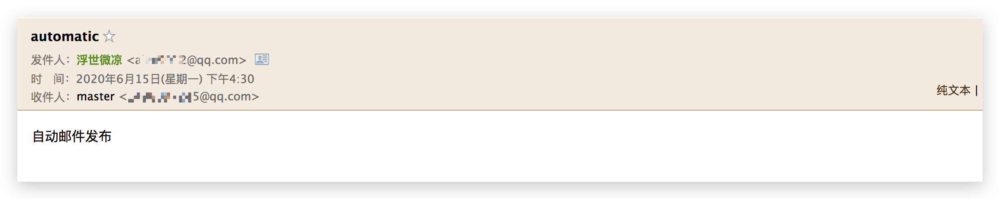
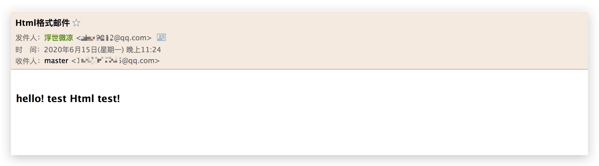
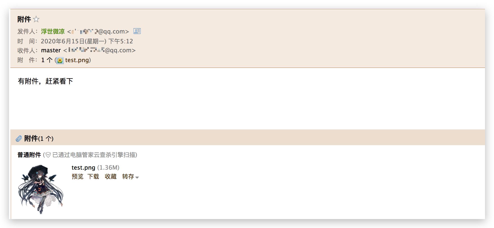

# spring Boot手把手教学(6)：发送邮件

[TOC]

## 1、前言

发送邮件应该是常用功能之一，无论是注册激活用户、账户会员到期提醒，还是业务营销信息提示，系统都需要自动向用户发邮件；

那么`Spring Boot`怎么发邮件呢？

`Spring` 推出了 `JavaMailSender` 简化了邮件发送的过程，现在 `Spring Boot`又对此进行了封装。

那就是 `spring-boot-starter-mail` 这个依赖包。

## 2、安装依赖

~~~xml
<!-- 邮件 -->
<dependency>
	<groupId>org.springframework.boot</groupId>
	<artifactId>spring-boot-starter-mail</artifactId>
</dependency>
~~~

## 3、添加配置信息

> src/main/resources/application.yml

~~~yaml

server:
  port: 9002

spring:
  mail:
    host: smtp.qq.com
    username: 149807666@qq.com
    password: sputxytreefvxrgoihef
  resources:
    static-locations: classpath:/resources/, classpath:/static/ ,classpath:/templates/

mail:
  fromMail:
    addr: alex@qq.com # 发邮件者

# 日志级别
logging:
  level:
    root: warn
    com.scaffold.test.mapper: trace
    com.scaffold.test.task: trace

~~~

我们这里以`QQ邮箱`为例，`smtp.qq.com 是邮箱服务器地址`；

`username` 就是你的邮箱地址，`password` 就是你的邮箱密码；

`mai.fromMail.addr` 就是发邮件人的邮箱地址。

## 4、代码实现

> Entity---邮件信息实体类：com.scaffold.test.entity.Mail

~~~java
package com.scaffold.test.entity;

import lombok.Data;

@Data
public class Mail {

    // 发送给谁
    private String to;

    // 发送主题
    private String subject;

    // 发送内容
    private String content;

    // 附件地址
    private String filePath;
}

~~~

> Service---邮件服务接口：com.scaffold.test.service.MailService

~~~java
package com.scaffold.test.service;

import com.scaffold.test.entity.Mail;

public interface MailService {
    // 发送邮件
    public void sendMail(Mail mail);
}

~~~

> ServiceImpl---邮件服务接口实现类：com.scaffold.test.service.impl.MailServiceImpl

~~~java
package com.scaffold.test.service.impl;

import com.scaffold.test.entity.Mail;
import com.scaffold.test.service.MailService;
import org.slf4j.Logger;
import org.slf4j.LoggerFactory;
import org.springframework.beans.factory.annotation.Autowired;
import org.springframework.beans.factory.annotation.Value;
import org.springframework.core.io.FileSystemResource;
import org.springframework.mail.SimpleMailMessage;
import org.springframework.mail.javamail.JavaMailSender;
import org.springframework.mail.javamail.MimeMessageHelper;
import org.springframework.stereotype.Service;

import javax.mail.internet.MimeMessage;
import java.io.File;

@Service
public class MailServiceImpl implements MailService {

    Logger logger = LoggerFactory.getLogger(this.getClass());

    @Autowired
    private JavaMailSender mailSender;

    @Value("${mail.fromMail.addr}")
    private String mailFrom;

    // 只发送文本
    @Override
    public void sendMail(Mail mail) {
        SimpleMailMessage message = new SimpleMailMessage();
        message.setFrom(mailFrom);
        message.setTo(mail.getTo());
        message.setSubject(mail.getSubject());
        message.setText(mail.getContent());
        mailSender.send(message);
        logger.info("发送完毕");
    }

}
~~~

> Controller---发邮件控制器：com.scaffold.test.controller.MailController

~~~java
package com.scaffold.test.controller;

import com.scaffold.test.base.Result;
import com.scaffold.test.base.ResultGenerator;
import com.scaffold.test.entity.Mail;
import com.scaffold.test.service.MailService;
import org.springframework.beans.factory.annotation.Autowired;
import org.springframework.scheduling.annotation.Async;
import org.springframework.web.bind.annotation.GetMapping;
import org.springframework.web.bind.annotation.RequestMapping;
import org.springframework.web.bind.annotation.RestController;
import org.thymeleaf.TemplateEngine;
import org.thymeleaf.context.Context;

import javax.mail.MessagingException;

@RestController
@RequestMapping("/mail")
public class MailController {

    @Autowired
    private MailService mailService;

    // 发送不带格式的文本
    @Async
    @GetMapping("post")
    public Result postMail() {
        Mail mail = new Mail();
        mail.setTo("******@qq.com");
        mail.setSubject("automatic");
        mail.setContent("自动邮件发布");
        mailService.sendMail(mail);
        return ResultGenerator.getSuccessResult().setMessage("发送成功");
    }
}

~~~

需要注意的一点就是：我们这里的代码都是用了`@Async`注解，代表这是异步操作，所以返回的`Result`也会无效了，无效代码我就不再注释了，原来写的时候写的是同步执行。

`其实这里，用异步是对的，业务代码中，邮件发送不是业务关注的重点，可以延迟或者失败，所以没必要占用主进程`；

结果如图：

到此为止，简单的发送邮件功能完成了，如果要自动发布，就要加入定时任务了，可以参考上一篇文章：

[spring Boot手把手教学（5）: 定时任务](https://juejin.im/post/5ee72373f265da76db2c3671)

这里就不再赘述；

## 5、功能扩展

### 5.1、发送HTML格式邮件

发送纯文本，有时候不是那么满足我们的业务要求，我们需要发送带HTML格式的邮件如下：

> 在 `MailService` 中添加 `sendHtmlMail` 方法：com.scaffold.test.service.MailService

~~~java
package com.scaffold.test.service;

import com.scaffold.test.entity.Mail;

import javax.mail.MessagingException;

public interface MailService {
    // 发送邮件
    public void sendMail(Mail mail);

    // 发送Html邮件
    public void sendHtmlMail(Mail mail) throws MessagingException;

}
~~~

> 对应实现方法：com.scaffold.test.service.impl.MailServiceImpl

~~~java
		// 发送Html邮件
    @Override
    public void sendHtmlMail(Mail mail) {
        MimeMessage message = mailSender.createMimeMessage();
        try {
            MimeMessageHelper helper = new MimeMessageHelper(message, true);
            message.setFrom(mailFrom);
            helper.setTo(mail.getTo());
            helper.setSubject(mail.getSubject());
            helper.setText(mail.getContent(), true);

            mailSender.send(message);
            logger.info("发送Html邮件成功");
        } catch (Exception e) {
            e.printStackTrace();
            logger.error("发送Html邮件失败");
        }
    }
~~~

> 控制器调用：com.scaffold.test.controller.MailController

~~~java
		// 发送Html邮件
    @Async
    @GetMapping("postHtml")
    public Result postHtmlMail() throws MessagingException {
        String content = "<html>\n" +
                "<body>\n" +
                "<h3>hello! test Html test!</h3>\n" +
                "</body>\n" +
                "</html>";
        Mail mail = new Mail();
        mail.setTo("******@qq.com");
        mail.setSubject("Html格式邮件");
        mail.setContent(content);
        mailService.sendHtmlMail(mail);
        return ResultGenerator.getSuccessResult().setMessage("发送成功");
    }
~~~

结果如图：

### 5.2、发送带附件的邮件

有时候我们需要发送带附件的邮件；

> 在 `MailService` 中添加 sendAttachmentsMail 方法：com.scaffold.test.service.MailService

~~~java
package com.scaffold.test.service;

import com.scaffold.test.entity.Mail;

import javax.mail.MessagingException;

public interface MailService {
    // 发送邮件
    public void sendMail(Mail mail);

    // 发送Html邮件
    public void sendHtmlMail(Mail mail) throws MessagingException;

    // 发送带附件的邮件
    public void sendAttachmentsMail(Mail mail) throws MessagingException;
}

~~~

> 对应实现类方法：com.scaffold.test.service.impl.MailServiceImpl

~~~java
    // 发送带附件的邮件
    @Override
    public void sendAttachmentsMail(Mail mail) {
        MimeMessage message = mailSender.createMimeMessage();
        try {
            MimeMessageHelper helper = new MimeMessageHelper(message, true);
            message.setFrom(mailFrom);
            helper.setTo(mail.getTo());
            helper.setSubject(mail.getSubject());
            helper.setText(mail.getContent(), true);

            // 附件
            FileSystemResource resourse = new FileSystemResource(new File(mail.getFilePath()));
            // 添加附件
            helper.addAttachment("test.png", resourse);

            mailSender.send(message);
            logger.info("发送邮件成功");
        } catch (Exception e) {
            e.printStackTrace();
            logger.error("发送邮件失败");
        }
    }
~~~

> 控制器调用：com.scaffold.test.controller.MailController

~~~java
    // 发送带附件的邮件
    @Async
    @GetMapping("postAttachment")
    public Result postAttachmentsMail() throws MessagingException {
        Mail mail = new Mail();
        mail.setTo("***@qq.com");
        mail.setSubject("附件");
        mail.setContent("有附件，赶紧看下");
        mail.setFilePath("E:\\test.png");
        mailService.sendAttachmentsMail(mail);
        return ResultGenerator.getSuccessResult().setMessage("发送成功");
    }
~~~

效果如图：

## 6、完整代码

> Entity---邮件信息实体类：com.scaffold.test.entity.Mail

~~~java
package com.scaffold.test.entity;

import lombok.Data;

@Data
public class Mail {

    // 发送给谁
    private String to;

    // 发送主题
    private String subject;

    // 发送内容
    private String content;

    // 附件地址
    private String filePath;
}

~~~

> Service---邮件服务接口：com.scaffold.test.service.MailService

~~~java
package com.scaffold.test.service;

import com.scaffold.test.entity.Mail;

import javax.mail.MessagingException;

public interface MailService {
    // 发送邮件
    public void sendMail(Mail mail);

    // 发送Html邮件
    public void sendHtmlMail(Mail mail) throws MessagingException;

    // 发送带附件的邮件
    public void sendAttachmentsMail(Mail mail) throws MessagingException;
}
~~~

> ServiceImpl---邮件服务接口实现类：com.scaffold.test.service.impl.MailServiceImpl

~~~java
package com.scaffold.test.service.impl;

import com.scaffold.test.entity.Mail;
import com.scaffold.test.service.MailService;
import org.slf4j.Logger;
import org.slf4j.LoggerFactory;
import org.springframework.beans.factory.annotation.Autowired;
import org.springframework.beans.factory.annotation.Value;
import org.springframework.core.io.FileSystemResource;
import org.springframework.mail.SimpleMailMessage;
import org.springframework.mail.javamail.JavaMailSender;
import org.springframework.mail.javamail.MimeMessageHelper;
import org.springframework.stereotype.Service;

import javax.mail.internet.MimeMessage;
import java.io.File;

@Service
public class MailServiceImpl implements MailService {

    Logger logger = LoggerFactory.getLogger(this.getClass());

    @Autowired
    private JavaMailSender mailSender;

    @Value("${mail.fromMail.addr}")
    private String mailFrom;

    // 只发送文本
    @Override
    public void sendMail(Mail mail) {
        SimpleMailMessage message = new SimpleMailMessage();
        message.setFrom(mailFrom);
        message.setTo(mail.getTo());
        message.setSubject(mail.getSubject());
        message.setText(mail.getContent());
        mailSender.send(message);
        logger.info("发送完毕");
    }

    // 发送Html邮件
    @Override
    public void sendHtmlMail(Mail mail) {
        MimeMessage message = mailSender.createMimeMessage();
        try {
            MimeMessageHelper helper = new MimeMessageHelper(message, true);
            message.setFrom(mailFrom);
            helper.setTo(mail.getTo());
            helper.setSubject(mail.getSubject());
            helper.setText(mail.getContent(), true);

            mailSender.send(message);
            logger.info("发送Html邮件成功");
        } catch (Exception e) {
            e.printStackTrace();
            logger.error("发送Html邮件失败");
        }
    }

    // 发送带附件的邮件
    @Override
    public void sendAttachmentsMail(Mail mail) {
        MimeMessage message = mailSender.createMimeMessage();
        try {
            MimeMessageHelper helper = new MimeMessageHelper(message, true);
            message.setFrom(mailFrom);
            helper.setTo(mail.getTo());
            helper.setSubject(mail.getSubject());
            helper.setText(mail.getContent(), true);

            // 附件
            FileSystemResource resourse = new FileSystemResource(new File(mail.getFilePath()));
            // 添加附件
            helper.addAttachment("test.png", resourse);

            mailSender.send(message);
            logger.info("发送邮件成功");
        } catch (Exception e) {
            e.printStackTrace();
            logger.error("发送邮件失败");
        }
    }
}
~~~

> Controller---发邮件控制器：com.scaffold.test.controller.MailController

~~~java
package com.scaffold.test.controller;

import com.scaffold.test.base.Result;
import com.scaffold.test.base.ResultGenerator;
import com.scaffold.test.entity.Mail;
import com.scaffold.test.service.MailService;
import org.springframework.beans.factory.annotation.Autowired;
import org.springframework.scheduling.annotation.Async;
import org.springframework.web.bind.annotation.GetMapping;
import org.springframework.web.bind.annotation.RequestMapping;
import org.springframework.web.bind.annotation.RestController;
import org.thymeleaf.TemplateEngine;
import org.thymeleaf.context.Context;

import javax.mail.MessagingException;

@RestController
@RequestMapping("/mail")
public class MailController {

    @Autowired
    private MailService mailService;

    // 发送不带格式的文本
    @Async
    @GetMapping("post")
    public Result postMail() {
        Mail mail = new Mail();
        mail.setTo("******@qq.com");
        mail.setSubject("automatic");
        mail.setContent("自动邮件发布");
        mailService.sendMail(mail);
        return ResultGenerator.getSuccessResult().setMessage("发送成功");
    }
  

    // 发送Html邮件
    @Async
    @GetMapping("postHtml")
    public Result postHtmlMail() throws MessagingException {
        String content = "<html>\n" +
                "<body>\n" +
                "<h3>hello! test Html test!</h3>\n" +
                "</body>\n" +
                "</html>";
        Mail mail = new Mail();
        mail.setTo("1498097245@qq.com");
        mail.setSubject("Html格式邮件");
        mail.setContent(content);
        mailService.sendHtmlMail(mail);
        return ResultGenerator.getSuccessResult().setMessage("发送成功");
    }

    // 发送带附件的邮件
    @Async
    @GetMapping("postAttachment")
    public Result postAttachmentsMail() throws MessagingException {
        Mail mail = new Mail();
        mail.setTo("1498097245@qq.com");
        mail.setSubject("附件");
        mail.setContent("有附件，赶紧看下");
        mail.setFilePath("E:\\test.png");
        mailService.sendAttachmentsMail(mail);
        return ResultGenerator.getSuccessResult().setMessage("发送成功");
    }    
}

~~~

