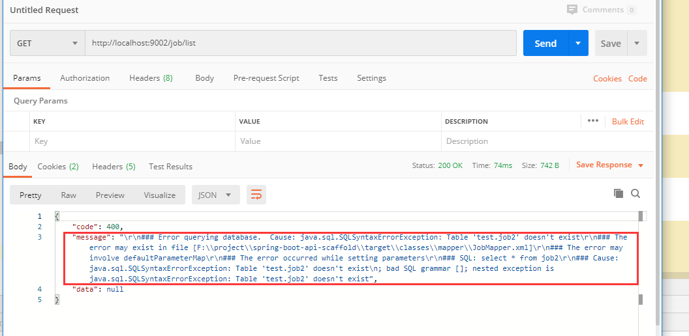
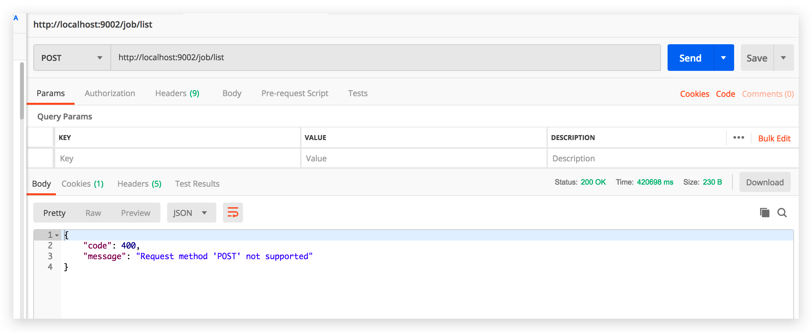
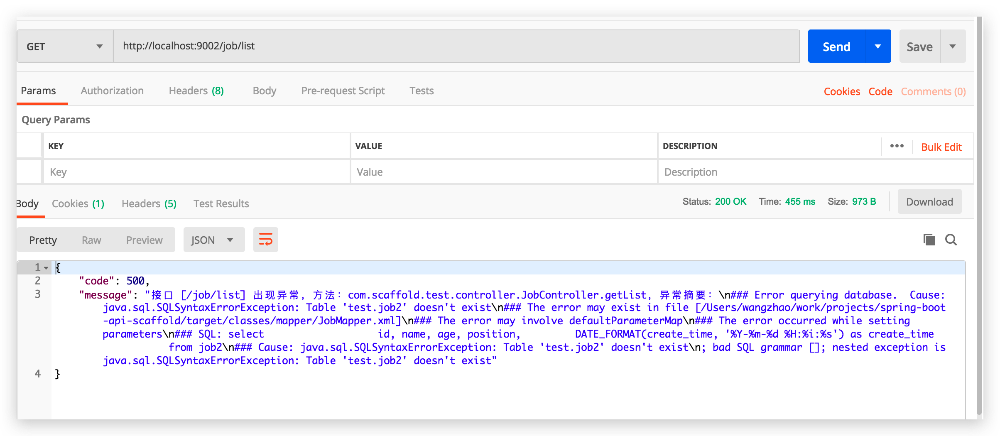
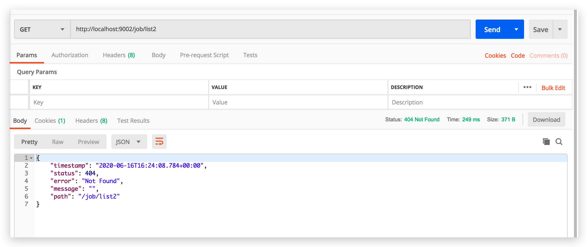
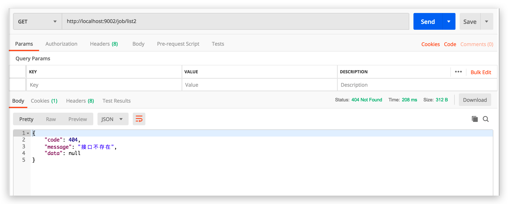

[TOC]

## 1、前言

我们在项目开发中，难免碰到业务代码异常，无论是`server 500`, 还是其他异常。
我们这里简单说一下，如果抛弃`try-catch`，统一进行异常响应处理；

> 错误类型：
>
> 1、自定义业务服务代码异常（根据各自项目需求）
>
> 2、ServletException HTTP请求异常
>
> 3、内部代码异常：比如 mysql 查询表名错误
>
> 4、请求接口404：这个在统一异常中无法获取，需要额外处理

正常情况下，我们需要这么写：

> JobController

~~~
 // 查询所有
    @GetMapping("/list")
    public Result getList() {
        Result result;
        try {
            List<Job> jobList = jobService.findAll();
            result = ResultGenerator.getSuccessResult(jobList);
        } catch (Exception e) {
            e.printStackTrace();
            result = ResultGenerator.getFailResult(e.getMessage());
        }
        return result;
    }
~~~

结果如图：

这样比较麻烦，要写很多try-catch.

那么有没有一种办法，帮我们自动拦截错误呢？

## 2、自定义异常处理

`HandlerExceptionResolver`, 就是处理异常的类；

> 源码：

~~~java
public interface HandlerExceptionResolver {
    @Nullable
    ModelAndView resolveException(HttpServletRequest var1, HttpServletResponse var2, @Nullable Object var3, Exception var4);
}
~~~

以上有`四个参数`其实相当于：`request`（请求）、`response`（响应）、`hendler`（处理器）、`exception`（异常）;

接下来我们重写 `WebMvcConfigurer.configureHandlerExceptionResolvers `来处理异常：

> com.scaffold.test.config.WebMvcConfig

~~~java
package com.scaffold.test.config;

import com.alibaba.fastjson.JSON;
import com.scaffold.test.base.Result;
import com.scaffold.test.base.ResultCode;
import com.scaffold.test.base.ServiceException;
import org.slf4j.Logger;
import org.slf4j.LoggerFactory;
import org.springframework.context.annotation.Configuration;
import org.springframework.web.method.HandlerMethod;
import org.springframework.web.servlet.HandlerExceptionResolver;
import org.springframework.web.servlet.ModelAndView;
import org.springframework.web.servlet.NoHandlerFoundException;
import org.springframework.web.servlet.config.annotation.WebMvcConfigurer;

import javax.servlet.ServletException;
import javax.servlet.http.HttpServletResponse;
import java.io.IOException;
import java.util.List;

@Configuration
public class WebMvcConfig implements WebMvcConfigurer {

    private final Logger logger = LoggerFactory.getLogger(WebMvcConfigurer.class);

    // 统一异常处理
    @Override
    public void configureHandlerExceptionResolvers(List<HandlerExceptionResolver> exceptionResolvers) {
        exceptionResolvers.add((request, response, handler, e) -> {
            Result result = new Result();
            // 错误处理
            if (e instanceof ServiceException) {
                // 1、业务失败的异常，如“账号或密码错误”
                result.setCode(ResultCode.FAIL).setMessage(e.getMessage());
                logger.info(e.getMessage());
            } else if (e instanceof ServletException) {
                // 2、调用失败
                result.setCode(ResultCode.FAIL).setMessage(e.getMessage());
            } else {
               // 3、内部错误
                result.setCode(ResultCode.INTERNAL_SERVER_ERROR).setMessage("接口 [" + request.getRequestURI() + "] 内部错误，请联系管理员");
                String message;
                if (handler instanceof HandlerMethod) {
                    HandlerMethod handlerMethod = (HandlerMethod) handler;
                    message = String.format("接口 [%s] 出现异常，方法：%s.%s，异常摘要：%s",
                            request.getRequestURI(),
                            handlerMethod.getBean().getClass().getName(),
                            handlerMethod.getMethod().getName(),
                            e.getMessage());
                } else {
                    message = e.getMessage();
                }
                result.setMessage(message);
                logger.error(message, e);
            }
            responseResult(response, result);
            return new ModelAndView();
        });
    }

		// 处理返回数据格式
    private void responseResult(HttpServletResponse response, Result result) {
        response.setCharacterEncoding("UTF-8");
        response.setHeader("Content-type", "application/json;charset=UTF-8");
        response.setStatus(200);
        try {
            response.getWriter().write(JSON.toJSONString(result));
        } catch (IOException ex) {
            logger.error(ex.getMessage());
        }
    }

}
~~~

> 1、业务失败的异常：  ServiceException 服务异常类

~~~java
package com.scaffold.test.base;

/**
 * 服务（业务）异常如“ 账号或密码错误 ”，该异常只做INFO级别的日志记录 @see WebMvcConfigurer
 */
public class ServiceException extends RuntimeException {
    public ServiceException() {
    }

    public ServiceException(String message) {
        super(message);
    }

    public ServiceException(String message, Throwable cause) {
        super(message, cause);
    }
}

~~~

~~~java
// 部分代码
if (e instanceof ServiceException) {
  // 1、业务失败的异常，如“账号或密码错误”
  result.setCode(ResultCode.FAIL).setMessage(e.getMessage());
  logger.info(e.getMessage());
}
~~~

报错400代码;

> 2、调用失败: Servlet异常

~~~java
if (e instanceof ServletException) {
	// 3、调用失败
	result.setCode(ResultCode.FAIL).setMessage(e.getMessage());
}
~~~

​	结果如图：

> 3、内部代码异常：比如 mysql 查询表名错误

~~~java
String message;
if (handler instanceof HandlerMethod) {
	HandlerMethod handlerMethod = (HandlerMethod) handler;
	message = String.format("接口 [%s] 出现异常，方法：%s.%s，异常摘要：%s",
	request.getRequestURI(),
	handlerMethod.getBean().getClass().getName(),
	handlerMethod.getMethod().getName(),
	e.getMessage());
} else {
	message = e.getMessage();
}
result.setMessage(message);
logger.error(message, e);
~~~

结果如图：

> 4、请求接口404：这个在统一异常中无法获取，需要额外处理

`404进入不了统一异常处理，如下图：`

所以，`全局异常处理捕获不到404错误，需要专门写一个类用来处理404异常`

> com.scaffold.test.base.NotFoundException

~~~java
package com.scaffold.test.base;

import org.springframework.boot.web.servlet.error.ErrorController;
import org.springframework.web.bind.annotation.RequestMapping;
import org.springframework.web.bind.annotation.RestController;

@RestController
public class NotFoundException implements ErrorController {

    private static final String ERROR_PATH = "/error";

    @RequestMapping(ERROR_PATH)
    public Result error() {
        Result result = new Result();
        // 2、接口不存在
        result.setCode(ResultCode.NOT_FOUND).setMessage("接口不存在");
        return result;
    }

    @Override
    public String getErrorPath() {
        return ERROR_PATH;
    }
}
~~~

到此，基本上大概的异常处理，就可以满足了。我们也就不用在业务代码中，一直写try-catch。

## 3、完整代码

> com.scaffold.test.base.Result: 统一返回实体类

~~~java
package com.scaffold.test.base;

import lombok.Data;

/**
 * 统一API响应结果封装
 */

@Data
public class Result {

    private int code;

    private String message = "success";

    private Object data;

    public Result setCode(ResultCode resultCode){
        this.code = resultCode.code;
        return this;
    }

    public Result setMessage(String message){
        this.message = message;
        return this;
    }

    public Result setData(Object data){
        this.data = data;
        return this;
    }

}
~~~

> com.scaffold.test.base.ResultCode:  统一返回响应码枚举，参考HTTP状态码

~~~java
package com.scaffold.test.base;

/**
 * 响应码枚举，参考HTTP状态码的语义
 */

public enum ResultCode {
    SUCCESS(200),//成功
    FAIL(400),//失败
    UNAUTHORIZED(401),//未认证（签名错误）
    NOT_FOUND(404),//接口不存在
    INTERNAL_SERVER_ERROR(500);//服务器内部错误

    public int code;

    ResultCode(int code) {
        this.code = code;
    }
}
~~~

> 统一异常拦截：com.scaffold.test.config.WebMvcConfig

~~~java
package com.scaffold.test.config;

import com.alibaba.fastjson.JSON;
import com.scaffold.test.base.Result;
import com.scaffold.test.base.ResultCode;
import com.scaffold.test.base.ServiceException;
import org.slf4j.Logger;
import org.slf4j.LoggerFactory;
import org.springframework.context.annotation.Configuration;
import org.springframework.web.method.HandlerMethod;
import org.springframework.web.servlet.HandlerExceptionResolver;
import org.springframework.web.servlet.ModelAndView;
import org.springframework.web.servlet.config.annotation.WebMvcConfigurer;

import javax.servlet.ServletException;
import javax.servlet.http.HttpServletResponse;
import java.io.IOException;
import java.util.List;

@Configuration
public class WebMvcConfig implements WebMvcConfigurer {

    private final Logger logger = LoggerFactory.getLogger(WebMvcConfigurer.class);

    // 统一异常处理
    @Override
    public void configureHandlerExceptionResolvers(List<HandlerExceptionResolver> exceptionResolvers) {
        exceptionResolvers.add((request, response, handler, e) -> {
            Result result = new Result();
            // 异常处理
            if (e instanceof ServiceException) {
                // 1、业务失败的异常，如“账号或密码错误”
                result.setCode(ResultCode.FAIL).setMessage(e.getMessage());
                logger.info(e.getMessage());
            }else if (e instanceof ServletException) {
                // 2、调用失败
                result.setCode(ResultCode.FAIL).setMessage(e.getMessage());
            } else {
                // 3、内部其他错误
                result.setCode(ResultCode.INTERNAL_SERVER_ERROR).setMessage("接口 [" + request.getRequestURI() + "] 内部错误，请联系管理员");
                String message;
                if (handler instanceof HandlerMethod) {
                    HandlerMethod handlerMethod = (HandlerMethod) handler;
                    message = String.format("接口 [%s] 出现异常，方法：%s.%s，异常摘要：%s",
                            request.getRequestURI(),
                            handlerMethod.getBean().getClass().getName(),
                            handlerMethod.getMethod().getName(),
                            e.getMessage());
                } else {
                    message = e.getMessage();
                }
                result.setMessage(message);
                logger.error(message, e);
            }
            responseResult(response, result);
            return new ModelAndView();
        });
    }

 		 // 处理响应数据格式
    private void responseResult(HttpServletResponse response, Result result) {
        response.setCharacterEncoding("UTF-8");
        response.setHeader("Content-type", "application/json;charset=UTF-8");
        response.setStatus(200);
        try {
            response.getWriter().write(JSON.toJSONString(result));
        } catch (IOException ex) {
            logger.error(ex.getMessage());
        }
    }
}
~~~

> 404拦截处理：com.scaffold.test.base.NotFoundException

~~~java
package com.scaffold.test.base;

import org.springframework.boot.web.servlet.error.ErrorController;
import org.springframework.web.bind.annotation.RequestMapping;
import org.springframework.web.bind.annotation.RestController;

@RestController
public class NotFoundException implements ErrorController {

    private static final String ERROR_PATH = "/error";

    @RequestMapping(ERROR_PATH)
    public Result error() {
        Result result = new Result();
        // 4、接口不存在
        result.setCode(ResultCode.NOT_FOUND).setMessage("接口不存在");
        return result;
    }

    @Override
    public String getErrorPath() {
        return ERROR_PATH;
    }
}

~~~

