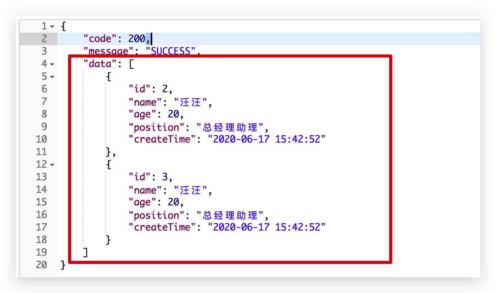

[Toc]

## 1、前言

> 前情回顾：

- [Spring Boot手把手教学(1)：如何生成优美的开篇banner.txt](https://juejin.im/post/5e21edf45188252ca0763611)
- [Spring Boot手把手教学(2)：使用yml多环境配置和创建多环境profile打包](https://juejin.im/post/5e21f51051882521414ae5e2)
- [Spring Boot手把手教学(3)：从零配置logback日志](https://juejin.im/post/5e22c6c66fb9a02ffc3762d0)
- [spring Boot手把手教学(4):  mybatis-plus 代码生成器，自动帮你生成代码](https://juejin.im/post/5ee58f19f265da77186a7b94)
- [spring Boot手把手教学(5):  定时任务](https://juejin.im/post/5ee72373f265da76db2c3671)
- [spring Boot手把手教学(6)：发送邮件](https://juejin.im/post/5ee7948751882542e647a5f3)
- [spring Boot手把手教学(7):  抛弃try-catch, 如何优雅统一处理异常（包含404处理）](https://juejin.im/post/5ee8f6d06fb9a047ec3fb00b)

目前为止，已经写了七篇关于 Spring boot 的文章，大多是都一些基础配置服务，工欲善其事，必先利其器。

在实际项目中，很多同事，总是忽略基础项目建设，觉得基础项目建设不重要，没有写业务代码重要。

个人觉得，基础服务也是很重要的，这是个人整体从上而下的知识积累，业务代码CRUD，写完也没有多大的能力提升，贵在总结吧。

文章写得或许有些许粗糙，望来往同学，切莫在意，不喜勿喷哈哈，欢迎多多指导。

废话不多说，

返回实体类的封装，今天就简单的介绍一下吧。

## 2、返回实体类

> 统一API响应结果封装：com.scaffold.test.base.Result

```java
package com.scaffold.test.base;

import lombok.Data;

/**
 * 统一API响应结果封装
 */

@Data
public class Result {

    private int code;

    private String message = "success";

    private Object data;

    // 后面result生成器需要以下方法
    public Result setCode(ResultCode resultCode){
        this.code = resultCode.code;
        return this;
    }

    public Result setMessage(String message){
        this.message = message;
        return this;
    }

    public Result setData(Object data){
        this.data = data;
        return this;
    }

}
```

这里我们是用 `lombok`, `@Data` 注解，简化了实体类的`Getter`和`Setter`；

~~~xml
<!-- lombok 简化代码-->
<dependency>
	<groupId>org.projectlombok</groupId>
	<artifactId>lombok</artifactId>
	<optional>true</optional>
</dependency>
~~~

在实际项目中：

一般 `Response` 包含三个 KEY : `code、message 和 data`，固定的数据结构约定，方便和其他同事联调测试。


1. code： 

   > `HTTP状态码（500 Server Error, 404 Not Fund 等等 1XX，2XX，3XX，4XX，5XX的各类错误 ）`
   >
   > 也有业务系统自定义的一些非标准状态码比如000000，999999，比较乱，建议还是以标准为好；

   > `HTTP 状态码大全`：

   

   ~~~http
   
   1 消息
   ▪ 100 Continue
   ▪ 101 Switching Protocols
   ▪ 102 Processing
   
   2 成功
   ▪ 200 OK
   ▪ 201 Created
   ▪ 202 Accepted
   ▪ 203 Non-Authoritative Information
   ▪ 204 No Content
   ▪ 205 Reset Content
   ▪ 206 Partial Content
   ▪ 207 Multi-Status
   
   3 重定向
   ▪ 300 Multiple Choices
   ▪ 301 Moved Permanently
   ▪ 302 Move Temporarily
   ▪ 303 See Other
   ▪ 304 Not Modified
   ▪ 305 Use Proxy
   ▪ 306 Switch Proxy
   ▪ 307 Temporary Redirect
   
   4 请求错误
   ▪ 400 Bad Request
   ▪ 401 Unauthorized
   ▪ 402 Payment Required
   ▪ 403 Forbidden
   ▪ 404 Not Found
   ▪ 405 Method Not Allowed
   ▪ 406 Not Acceptable
   ▪ 407 Proxy Authentication Required
   ▪ 408 Request Timeout
   ▪ 409 Conflict
   ▪ 410 Gone
   ▪ 411 Length Required
   ▪ 412 Precondition Failed
   ▪ 413 Request Entity Too Large
   ▪ 414 Request-URI Too Long
   ▪ 415 Unsupported Media Type
   ▪ 416 Requested Range Not Satisfiable
   ▪ 417 Expectation Failed
   ▪ 418 I'm a teapot
   ▪ 421 Misdirected Request
   ▪ 422 Unprocessable Entity
   ▪ 423 Locked
   ▪ 424 Failed Dependency
   ▪ 425 Too Early
   ▪ 426 Upgrade Required
   ▪ 449 Retry With
   ▪ 451 Unavailable For Legal Reasons
   
   5 服务器错误
   ▪ 500 Internal Server Error
   ▪ 501 Not Implemented
   ▪ 502 Bad Gateway
   ▪ 503 Service Unavailable
   ▪ 504 Gateway Timeout
   ▪ 505 HTTP Version Not Supported
   ▪ 506 Variant Also Negotiates
   ▪ 507 Insufficient Storage
   ▪ 509 Bandwidth Limit Exceeded
   ▪ 510 Not Extended
   ▪ 600 Unparseable Response Headers
   ~~~

2. data

   > data 返回的就是我们所需的数据，无论是 List 还是 Map， 都在这里返回；

   

 3. message

> message 返回的就是提示语，以便于作出友好提示

## 3、自定义响应码枚举

> com.scaffold.test.base.ResultCode

~~~java
package com.scaffold.test.base;

/**
 * 响应码枚举，参考HTTP状态码的语义
 */

public enum ResultCode {
    SUCCESS(200),//成功
    FAIL(400),//失败
    UNAUTHORIZED(401),//未认证（签名错误）
    NOT_FOUND(404),//接口不存在
    INTERNAL_SERVER_ERROR(500);//服务器内部错误

    public int code;

    ResultCode(int code) {
        this.code = code;
    }

}

~~~

## 4、响应结果生成类

~~~java
package com.scaffold.test.base;

/**
 * 响应结果生成工具
 */

public class ResultGenerator {
    private static final String DEFAULT_SUCCESS_MESSAGE = "SUCCESS";

    // 只返回状态
    public static Result getSuccessResult() {
        return new Result()
                .setCode(ResultCode.SUCCESS)
                .setMessage(DEFAULT_SUCCESS_MESSAGE);
    }

    // 成功返回数据
    public static Result getSuccessResult(Object data) {
        return new Result()
                .setCode(ResultCode.SUCCESS)
                .setMessage(DEFAULT_SUCCESS_MESSAGE)
                .setData(data);
    }

    // 失败
    public static Result getFailResult(String message) {
        return new Result()
                .setCode(ResultCode.FAIL)
                .setMessage(message);
    }
}

~~~

这里有三种状态的方法，大抵是够用了；

> 第一种，是无需返回data, 比如只查询状态

~~~java
// 无需data
@GetMapping("/status")
public Result status() {
  // 模拟无需data
  return ResultGenerator.getSuccessResult();
}
~~~


> 第二种是，请求获取数据成功

~~~java
// 查询所有
@GetMapping("/list")
public Result getList() {
  Result result;
  List<Job> jobList = jobService.findAll();
  result = ResultGenerator.getSuccessResult(jobList);
  return result;
}
~~~


> 第三种是，请求获取失败信息

~~~java
// 错误
@GetMapping("/err")
public Result err() {
  // 模拟错误
  return ResultGenerator.getFailResult("模拟错误");
}
~~~


## 5、完整代码

> com.scaffold.test.base.Result: 统一API响应结果封装

~~~java
package com.scaffold.test.base;

import com.fasterxml.jackson.databind.annotation.JsonSerialize;
import lombok.Data;

/**
 * 统一API响应结果封装
 */

@Data
// 非空返回
@JsonSerialize(include = JsonSerialize.Inclusion.NON_NULL)
public class Result {

    private int code;

    private String message = "success";

    private Object data;

    public Result setCode(ResultCode resultCode){
        this.code = resultCode.code;
        return this;
    }

    public Result setMessage(String message){
        this.message = message;
        return this;
    }

    public Result setData(Object data){
        this.data = data;
        return this;
    }

}

~~~

> com.scaffold.test.base.ResultCode: 响应码枚举

~~~java
package com.scaffold.test.base;

/**
 * 响应码枚举，参考HTTP状态码的语义
 */

public enum ResultCode {
    SUCCESS(200),//成功
    FAIL(400),//失败
    UNAUTHORIZED(401),//未认证（签名错误）
    NOT_FOUND(404),//接口不存在
    INTERNAL_SERVER_ERROR(500);//服务器内部错误

    public int code;

    ResultCode(int code) {
        this.code = code;
    }

}

~~~

> com.scaffold.test.base.ResultGenerator

~~~java
package com.scaffold.test.base;

/**
 * 响应结果生成工具
 */

public class ResultGenerator {
    private static final String DEFAULT_SUCCESS_MESSAGE = "SUCCESS";

    // 只返回状态
    public static Result getSuccessResult() {
        return new Result()
                .setCode(ResultCode.SUCCESS)
                .setMessage(DEFAULT_SUCCESS_MESSAGE);
    }

    // 成功返回数据
    public static Result getSuccessResult(Object data) {
        return new Result()
                .setCode(ResultCode.SUCCESS)
                .setMessage(DEFAULT_SUCCESS_MESSAGE)
                .setData(data);
    }

    // 失败
    public static Result getFailResult(String message) {
        return new Result()
                .setCode(ResultCode.FAIL)
                .setMessage(message);
    }
}

~~~

