[TOC]

## 1、前言

> 前情回顾：

- [Spring Boot手把手教学(1)：如何生成优美的开篇banner.txt](https://juejin.im/post/5e21edf45188252ca0763611)
- [Spring Boot手把手教学(2)：使用yml多环境配置和创建多环境profile打包](https://juejin.im/post/5e21f51051882521414ae5e2)
- [Spring Boot手把手教学(3)：从零配置logback日志](https://juejin.im/post/5e22c6c66fb9a02ffc3762d0)
- [spring Boot手把手教学(4):  mybatis-plus 代码生成器，自动帮你生成代码](https://juejin.im/post/5ee58f19f265da77186a7b94)
- [spring Boot手把手教学(5):  定时任务](https://juejin.im/post/5ee72373f265da76db2c3671)
- [spring Boot手把手教学(6)：发送邮件](https://juejin.im/post/5ee7948751882542e647a5f3)
- [spring Boot手把手教学(7):  抛弃try-catch, 如何优雅统一处理异常（包含404处理）](https://juejin.im/post/5ee8f6d06fb9a047ec3fb00b)
- [spring Boot手把手教学(8): 封装统一返回实体类](https://juejin.im/post/5eea34816fb9a0586179d634)

本篇文章，在前几篇文章的基础上，我们实战练习；

> 使用的知识点为：

1. 代码生成器，自动生成`Controller`、 `Service`、`serviceImpl`、`entity`、`mapper`和 `mapper xml`代码;
2. 定时任务，定时获取最新天气数据和定时自动发送天气预报邮件
3. 使用`jsoup`写爬虫爬取天气预报数据，并存入mysql;

## 2、安装依赖

> pom.xml

~~~xml
<!-- HTML解析器 -->
<dependency>
	<groupId>org.jsoup</groupId>
	<artifactId>jsoup</artifactId>
	<version>1.10.3</version>
</dependency>

<!-- 邮件 -->
<dependency>
  <groupId>org.springframework.boot</groupId>
  <artifactId>spring-boot-starter-mail</artifactId>
</dependency>

<!-- thymeleaf 模板 -->
<dependency>
  <groupId>org.springframework.boot</groupId>
  <artifactId>spring-boot-starter-thymeleaf</artifactId>
</dependency>

<dependency>
  <groupId>ognl</groupId>
  <artifactId>ognl</artifactId>
  <version>3.2.14</version>
</dependency>
~~~

使用 `jsoup` 爬取页面，并做`HTML结构解析`。

-------

## 3、mysql数据库建表

~~~mysql
/*
 Navicat Premium Data Transfer

 Source Server         : local_mysql
 Source Server Type    : MySQL
 Source Server Version : 80018
 Source Host           : localhost:3306
 Source Schema         : test

 Target Server Type    : MySQL
 Target Server Version : 80018
 File Encoding         : 65001

 Date: 19/06/2020 22:40:01
*/

SET NAMES utf8mb4;
SET FOREIGN_KEY_CHECKS = 0;

-- ----------------------------
-- Table structure for weather
-- ----------------------------
DROP TABLE IF EXISTS `weather`;
CREATE TABLE `weather` (
  `id` int(11) NOT NULL AUTO_INCREMENT COMMENT 'id',
  `name` varchar(255) CHARACTER SET utf8mb4 COLLATE utf8mb4_0900_ai_ci NOT NULL COMMENT '名字',
  `status` varchar(255) CHARACTER SET utf8mb4 COLLATE utf8mb4_0900_ai_ci DEFAULT NULL COMMENT '天气状态',
  `date` varchar(255) CHARACTER SET utf8mb4 COLLATE utf8mb4_0900_ai_ci NOT NULL COMMENT '当前日期',
  `max` varchar(255) CHARACTER SET utf8mb4 COLLATE utf8mb4_0900_ai_ci DEFAULT NULL COMMENT '最高气温',
  `min` varchar(255) CHARACTER SET utf8mb4 COLLATE utf8mb4_0900_ai_ci DEFAULT NULL COMMENT '最低气温',
  `create_time` datetime NOT NULL DEFAULT CURRENT_TIMESTAMP ON UPDATE CURRENT_TIMESTAMP COMMENT '创建时间',
  PRIMARY KEY (`id`) USING BTREE,
  UNIQUE KEY `date` (`date`) USING BTREE
) ENGINE=InnoDB AUTO_INCREMENT=1759 DEFAULT CHARSET=utf8mb4 COLLATE=utf8mb4_0900_ai_ci ROW_FORMAT=DYNAMIC;

SET FOREIGN_KEY_CHECKS = 1;

~~~

设置 `id` 为主键`PRIMARY KEY`，`date` 为唯一约束 `UNIQUE KEY`，这样的话，我每次定时爬取数据，存入数据库的时候，就能避免重复数据。

## 4、生成器生成代码

执行 `com.scaffold.test.base.CodeGenerator `中的 `main` 方法：

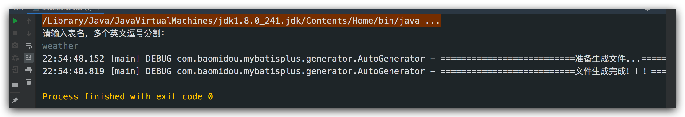

如果有同学对生成器不知道怎么配置的，请前往前面的文章看一下；

[spring Boot手把手教学(4):  mybatis-plus 代码生成器，自动帮你生成代码](https://juejin.im/post/5ee58f19f265da77186a7b94)

> com.scaffold.test.entity.Weather：实体类

~~~java
package com.scaffold.test.entity;

import com.baomidou.mybatisplus.annotation.IdType;
import com.baomidou.mybatisplus.annotation.TableId;
import lombok.Data;
import lombok.EqualsAndHashCode;

import java.io.Serializable;
import java.time.LocalDateTime;

/**
 * 

 * 实体类
 * 

 *
 * @author alex wong
 * @since 2020-06-18
 */
@Data
@EqualsAndHashCode(callSuper = false)
public class Weather implements Serializable {

    private static final long serialVersionUID = 1L;

    @TableId(value = "id", type = IdType.AUTO)
    private Integer id;

    private String name;

    private String status;

    private String date;

    // 最高气温
    private String max;

    // 最低气温
    private String min;

    private LocalDateTime createTime;

}

~~~

> com.scaffold.test.service.WeatherService:  服务类接口

~~~java
package com.scaffold.test.service;

import com.baomidou.mybatisplus.extension.service.IService;
import com.scaffold.test.entity.Weather;
import org.jsoup.nodes.Document;

import java.util.List;

/**
 * 

 * 服务类
 * 

 *
 * @author alex wong
 * @since 2020-06-18
 */
public interface WeatherService extends IService<Weather> {

}

~~~

> com.scaffold.test.service.impl.WeatherServiceImpl: 服务实现类

~~~java
package com.scaffold.test.service.impl;

import com.baomidou.mybatisplus.extension.service.impl.ServiceImpl;
import com.scaffold.test.entity.Weather;
import com.scaffold.test.mapper.WeatherMapper;
import com.scaffold.test.service.WeatherService;
import org.jsoup.nodes.Document;
import org.jsoup.nodes.Element;
import org.jsoup.select.Elements;
import org.springframework.beans.factory.annotation.Autowired;
import org.springframework.stereotype.Service;

import java.text.SimpleDateFormat;
import java.util.ArrayList;
import java.util.Date;
import java.util.List;

/**
 * 

 * 服务实现类
 * 

 *
 * @author alex wong
 * @since 2020-06-18
 */
@Service
public class WeatherServiceImpl extends ServiceImpl<WeatherMapper, Weather> implements WeatherService {

}

~~~

> com.scaffold.test.mapper.WeatherMapper: Mapper 接口

~~~java
package com.scaffold.test.mapper;

import com.scaffold.test.entity.Weather;
import com.baomidou.mybatisplus.core.mapper.BaseMapper;

import java.util.List;

/**
 * 

 *  Mapper 接口
 * 

 *
 * @author alex wong
 * @since 2020-06-18
 */
public interface WeatherMapper extends BaseMapper<Weather> {

}

~~~

> src/main/resources/mapper/WeatherMapper.xml

~~~xml
<?xml version="1.0" encoding="UTF-8"?>
<!DOCTYPE mapper PUBLIC "-//mybatis.org//DTD Mapper 3.0//EN" "http://mybatis.org/dtd/mybatis-3-mapper.dtd">
<mapper namespace="com.scaffold.test.mapper.WeatherMapper">

    <!-- 通用查询映射结果 -->
    <resultMap id="BaseResultMap" type="com.scaffold.test.entity.Weather">
        <id column="id" property="id" />
        <result column="name" property="name" />
        <result column="status" property="status" />
        <result column="date" property="date" />
        <result column="max" property="max" />
        <result column="min" property="min" />
        <result column="create_time" property="createTime" />
    </resultMap>

    <!-- 通用查询结果列 -->
    <sql id="Base_Column_List">
        id, name, status, max, min, date
    </sql>

</mapper>

~~~

> com.scaffold.test.controller.WeatherController： 

~~~java
package com.scaffold.test.controller;

import com.scaffold.test.entity.Mail;
import com.scaffold.test.entity.Weather;
import com.scaffold.test.service.MailService;
import com.scaffold.test.service.WeatherService;
import com.scaffold.test.task.JobTask;
import org.jsoup.Jsoup;
import org.jsoup.nodes.Document;
import org.slf4j.Logger;
import org.slf4j.LoggerFactory;
import org.springframework.beans.factory.annotation.Autowired;
import org.springframework.scheduling.annotation.Async;
import org.springframework.scheduling.annotation.Scheduled;
import org.springframework.web.bind.annotation.GetMapping;
import org.springframework.web.bind.annotation.RequestMapping;
import org.springframework.web.bind.annotation.RestController;
import org.thymeleaf.context.Context;
import org.thymeleaf.spring5.SpringTemplateEngine;

import javax.mail.MessagingException;
import java.text.SimpleDateFormat;
import java.util.Date;
import java.util.List;

@RestController
@RequestMapping("/weather")
public class WeatherController {

}
~~~

## 5、制作爬虫

制作爬虫我们使用 Jsoup 获取远程URL地址的页面结构，并进行HTML解析；

这需要你对javascript有所了解，方法类似；

> com.scaffold.test.controller.WeatherController

~~~java
    // 获取七日天气数据
		@GetMapping("/weather/get")
    public void getDataFromHtml() {
        String url = "http://www.weather.com.cn/weather/101020100.shtml";
        try {
            Document document = Jsoup.connect(url).get();
            weatherService.getWeekList(document);
        } catch (Exception e) {
            log.error(e.getMessage());
        }
    }
~~~

我们获取数据的来源是中国天气预报网站，如图。

> 获取完 document 之后，html解析是放在service里面实现的

> com.scaffold.test.service.WeatherService

~~~java
package com.scaffold.test.service;

import com.baomidou.mybatisplus.extension.service.IService;
import com.scaffold.test.entity.Weather;
import org.jsoup.nodes.Document;

import java.util.List;

/**
 * 

 * 服务类
 * 

 *
 * @author alex wong
 * @since 2020-06-18
 */
public interface WeatherService extends IService<Weather> {

    // HTML解析获取七日天气预报数据
    List<Weather> getWeekList(Document document);
}

~~~

> com.scaffold.test.service.impl.WeatherServiceImpl

HTML 解析需要你去网站查看页面HTML DOM结构，并查找获取你想要的数据的过程；

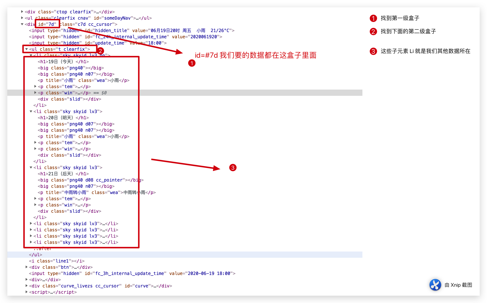

~~~java
package com.scaffold.test.service.impl;

import com.baomidou.mybatisplus.extension.service.impl.ServiceImpl;
import com.scaffold.test.entity.Weather;
import com.scaffold.test.mapper.WeatherMapper;
import com.scaffold.test.service.WeatherService;
import org.jsoup.nodes.Document;
import org.jsoup.nodes.Element;
import org.jsoup.select.Elements;
import org.springframework.beans.factory.annotation.Autowired;
import org.springframework.stereotype.Service;

import java.text.SimpleDateFormat;
import java.util.ArrayList;
import java.util.Date;
import java.util.List;

/**
 * 

 * 服务实现类
 * 

 *
 * @author alex wong
 * @since 2020-06-18
 */
@Service
public class WeatherServiceImpl extends ServiceImpl<WeatherMapper, Weather> implements WeatherService {

    @Autowired
    private WeatherMapper weatherMapper;

    @Override
    public List<Weather> getWeekList(Document document) {

        ArrayList<Weather> weathers = new ArrayList<>();

        // 数据提取
        Elements sevenBox = document.getElementById("7d").getElementsByClass("t");
        Elements liColumns = sevenBox.get(0).getElementsByTag("li");
        for (Element column : liColumns) {
            Weather weather = new Weather();
            // 获取 name
            String name = column.getElementsByTag("h1").text().split("（")[1].split("）")[0];
            String day = column.getElementsByTag("h1").text().split("\\D{1,2}")[0];
            String date = getDate(day);
            // 今日天气状态
            String status = column.getElementsByClass("wea").text();
            // 温度
            String tem = column.getElementsByClass("tem").text();
            String[] temArr = tem.split("\\D{1,2}");
            // 最高气温
            String maxTem;
            // 最低气温
            String minTem;
            if (temArr.length == 2) {
                maxTem = tem.split("\\D{1,2}")[0];
                minTem = tem.split("\\D{1,2}")[1];
            } else {
                maxTem = tem.split("\\D{1,2}")[0];
                minTem = tem.split("\\D{1,2}")[0];
            }
            weather.setName(name);
            weather.setStatus(status);
            weather.setDate(date);
            weather.setMax(maxTem);
            weather.setMin(minTem);
            weathers.add(weather);
        }

        // 插入数据库
        for (Weather weather : weathers) {
            weatherMapper.insertWeather(weather);
        }

        return weathers;
    }

    // 获取对应日期
    public String getDate(String day) {
        Date date = new Date();
        //格式日期
        SimpleDateFormat dateFormat = new SimpleDateFormat("yyyy-MM-dd");
        date.setDate(Integer.parseInt(day));
        return dateFormat.format(date);
    }
}
~~~

> com.scaffold.test.mapper.WeatherMapper:  mapper接口, 数据插入

~~~java
package com.scaffold.test.mapper;

import com.scaffold.test.entity.Weather;
import com.baomidou.mybatisplus.core.mapper.BaseMapper;

import java.util.List;

/**
 * 

 *  Mapper 接口
 * 

 *
 * @author alex wong
 * @since 2020-06-18
 */
public interface WeatherMapper extends BaseMapper<Weather> {

    void insertWeather(Weather weather);
}
~~~

> Mapper XML

~~~xml
 <insert id="insertWeather">
   insert ignore into weather
   (name, status, date, max, min)
   values
   (#{name}, #{status}, #{date}, #{max}, #{min})
 </insert>
~~~

接下来我们用POSTMAN，发送请求，手动调取数据

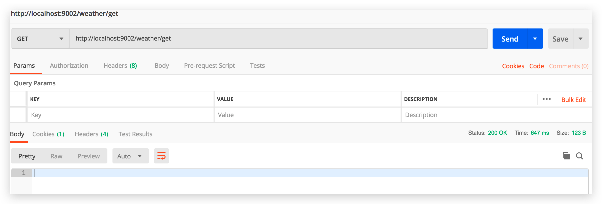

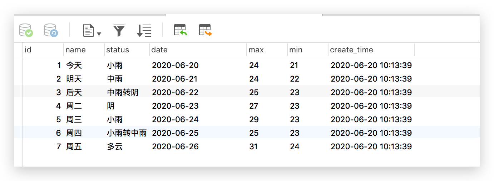

解下来，我们需要用定时任务定时获取天气实时信息，这样我们获取的数据才会有效和使用，一切源于实际应用，没有什么用也没必要做；

~~~java
// 定时获取七日天气数据
@Async
@Scheduled(fixedRate = 60*60*1000)
public void getDataFromHtml() {
  String url = "http://www.weather.com.cn/weather/101020100.shtml";
  try {
    Document document = Jsoup.connect(url).get();
    weatherService.getWeekList(document);
  } catch (Exception e) {
    log.error(e.getMessage());
  }
}
~~~

我们这里是设置 `一小时` 获取一次天气信息；

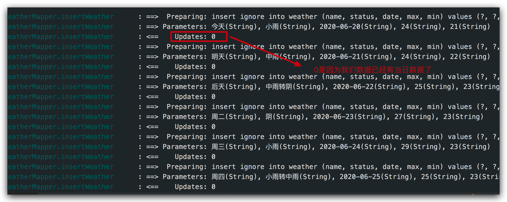

这样的话，我们就定时获取到数据了；

如果细心一点会发现有个问题，虽然这是按天为维度进行的数据统计，但是天气气象台会定时更新当天的数据，比如7：30更新数据，之后在当天的一个时间点还是会更新，而我们的SQL语句用的是insert into（加ignore, 是为了忽略警告，如图返回Updates: 0）, 意味着只要当天date是存在的，就不会再次更新数据；

因此我们需要使用 mysql replace into , 这是 insert into 的增加版；

~~~markdown
Mysql提供了replace into 跟 insert into 的功能一样, 不同点在于：

　　如果发现表中已经有此行数据（根据主键或者唯一索引判断）则先删除此行数据，然后插入新的数据。否则，直接插入新数据。
　　
　　不过有点要注意，操作的表必须要有主键或者是唯一索引。因为要根据主键或者是唯一索引判断是否有重复数据；如果没有的话，replace into 会直接插入数据

~~~

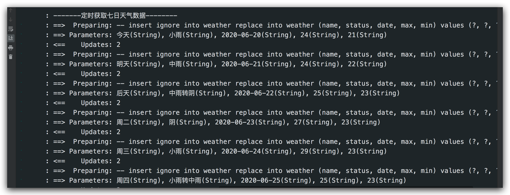

~~~xml
  <insert id="insertWeather">
    --  insert ignore into weather
    replace into weather
    (name, status, date, max, min)
    values
    (#{name}, #{status}, #{date}, #{max}, #{min})
   </insert>
~~~

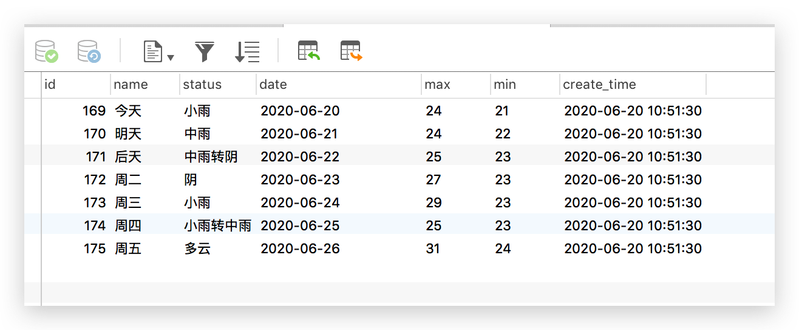

id 会递增，所以保证你的字段长度是要满足的；

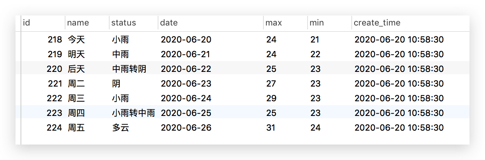

其实还有很多要做，比如历史数据如何处理，是逻辑删除还是物理删除。我这里获取七日数据只做了数据日期过滤，取当天日期之后的数据；

## 6、发邮件

> 获取七日数据: src/main/resources/mapper/WeatherMapper.xml

~~~xml
<select id="selectAll" resultType="com.scaffold.test.entity.Weather">
  select
  <include refid="Base_Column_List"></include>
  from weather
  WHERE STR_TO_DATE(date, '%Y-%m-%d') >= CURRENT_DATE
</select>
~~~

> com.scaffold.test.service.WeatherService: 增加方法

~~~java
public interface WeatherService extends IService<Weather> {

    // 获取数据
    List<Weather> selectAll();
}
~~~

> com.scaffold.test.service.impl.WeatherServiceImpl

~~~java
@Service
public class WeatherServiceImpl extends ServiceImpl<WeatherMapper, Weather> implements WeatherService {

    @Override
    public List<Weather> selectAll() {
        return weatherMapper.selectAll();
    }

}
~~~

> com.scaffold.test.controller.WeatherController

~~~java
    
    @Autowired
    private SpringTemplateEngine templateEngine;
	
		// 定时发送邮件
    @Async
    @GetMapping("post")
    public void sendMail() throws MessagingException {
        Context context = new Context();
        // 获取七日天气
        List<Weather> weathers = weatherService.selectAll();
        context.setVariable("resultList", weathers);
        String emailTemplate = templateEngine.process("weatherTemplate", context);

        //获取当前时间
        SimpleDateFormat simpleDateFormat = new SimpleDateFormat("yyyy-MM-dd HH:mm:ss");
        String currentTime = simpleDateFormat.format(new Date());

        // 邮件发送, 多人接收
				String[] addressList = {"****@qq.com", "***@qq.com"};
        for (String address : addressList) {
            Mail mail = new Mail();
            mail.setTo(address);
            mail.setSubject("天气预报小助手-" + currentTime);
            mail.setContent(emailTemplate);
            mailService.sendHtmlMail(mail);
        }
    }
~~~

> 邮件模版：src/main/resources/templates/weatherTemplate.html

~~~html
<!DOCTYPE html>
<html lang="en"
      xmlns="http://www.w3.org/1999/xhtml"
      xmlns:th="http://www.thymeleaf.org">
<head>
    <meta http-equiv="Content-Type" content="text/html; charset=UTF-8"/>
    <meta name="viewport" content="width=device-width, initial-scale=1.0"/>
    <title>天气预报</title>
    
</head>
<body>

    <h1>
        上海最近7日天气预报
    </h1>

<table class="table">
    <thead>
    <tr>
        <th>日期</th>
        <th>天气状态</th>
        <th>最高气温</th>
        <th>最低气温</th>
    </tr>
    </thead>
    <tbody>
    <tr th:each="entries,stat:${resultList}">
        <td th:text="${entries['date']}"></td>
        <td th:text="${entries['status']}"></td>
        <td th:text="${entries['max']}"></td>
        <td th:text="${entries['min']}"></td>
    </tr>
    </tbody>

</table>
</body>
</html>
~~~

> 测试发邮件

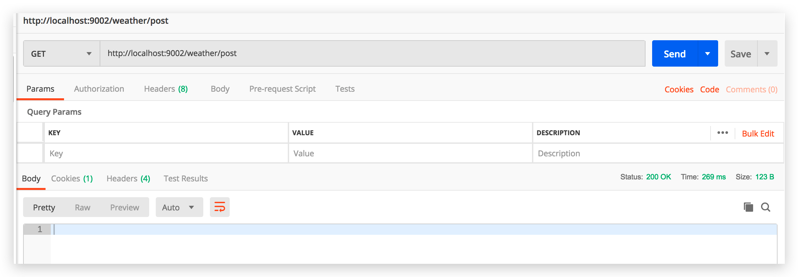

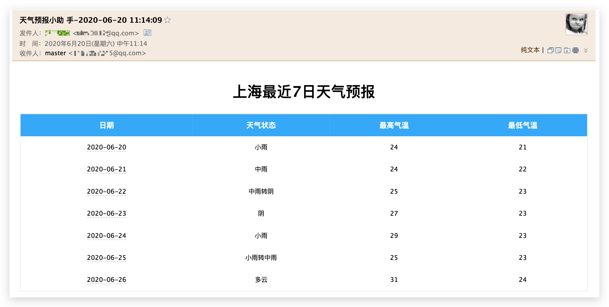

> 定时发送

~~~java
    // 定时发送邮件
    @Async
//  @GetMapping("post")
    @Scheduled(fixedRate = 60*1000)
    public void sendMail() throws MessagingException {
        Context context = new Context();
        // 获取七日天气
        List<Weather> weathers = weatherService.selectAll();
        context.setVariable("resultList", weathers);
        String emailTemplate = templateEngine.process("weatherTemplate", context);

        //获取当前时间
        SimpleDateFormat simpleDateFormat = new SimpleDateFormat("yyyy-MM-dd HH:mm:ss");
        String currentTime = simpleDateFormat.format(new Date());

        // 邮件发送, 多人接收
        String[] addressList = {"***@qq.com", "***@qq.com"};
        for (String address : addressList) {
            Mail mail = new Mail();
            mail.setTo(address);
            mail.setSubject("天气预报小助手-" + currentTime);
            mail.setContent(emailTemplate);
            mailService.sendHtmlMail(mail);
        }
    }
~~~

	>  测试代码：一分钟发一次邮件

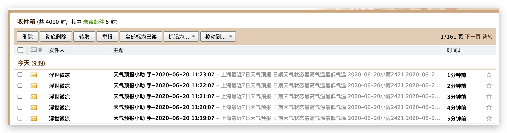

## 7、完整代码

> com.scaffold.test.entity.Weather

~~~java
package com.scaffold.test.entity;

import com.baomidou.mybatisplus.annotation.IdType;
import com.baomidou.mybatisplus.annotation.TableId;
import lombok.Data;
import lombok.EqualsAndHashCode;

import java.io.Serializable;
import java.time.LocalDateTime;

/**
 * 

 *
 * 

 *
 * @author alex wong
 * @since 2020-06-18
 */
@Data
@EqualsAndHashCode(callSuper = false)
public class Weather implements Serializable {

    private static final long serialVersionUID = 1L;

    @TableId(value = "id", type = IdType.AUTO)
    private Integer id;

    private String name;

    private String status;

    private String date;

    // 最高气温
    private String max;

    // 最低气温
    private String min;

    private LocalDateTime createTime;

}
~~~

> com.scaffold.test.controller.WeatherController

~~~java
package com.scaffold.test.controller;

import com.scaffold.test.entity.Mail;
import com.scaffold.test.entity.Weather;
import com.scaffold.test.service.MailService;
import com.scaffold.test.service.WeatherService;
import com.scaffold.test.task.JobTask;
import org.jsoup.Jsoup;
import org.jsoup.nodes.Document;
import org.slf4j.Logger;
import org.slf4j.LoggerFactory;
import org.springframework.beans.factory.annotation.Autowired;
import org.springframework.scheduling.annotation.Async;
import org.springframework.scheduling.annotation.Scheduled;
import org.springframework.web.bind.annotation.RequestMapping;
import org.springframework.web.bind.annotation.RestController;
import org.thymeleaf.context.Context;
import org.thymeleaf.spring5.SpringTemplateEngine;

import javax.mail.MessagingException;
import java.text.SimpleDateFormat;
import java.util.Date;
import java.util.List;

@RestController
@RequestMapping("/weather")
public class WeatherController {

    private static final Logger log = LoggerFactory.getLogger(JobTask.class);

    @Autowired
    private WeatherService weatherService;

    @Autowired
    private MailService mailService;

    @Autowired
    private SpringTemplateEngine templateEngine;

    // 定时获取七日天气数据
    @Async
    @Scheduled(fixedRate = 60*60*1000)
//    @GetMapping("/get")
    public void getDataFromHtml() {
        String url = "http://www.weather.com.cn/weather/101020100.shtml";
        log.info("-------定时获取七日天气数据--------");
        try {
            Document document = Jsoup.connect(url).get();
            weatherService.getWeekList(document);
        } catch (Exception e) {
            log.error(e.getMessage());
        }
    }

    // 定时发送邮件
    @Async
//    @GetMapping("post")
    @Scheduled(fixedRate = 60*1000)
    public void sendMail() throws MessagingException {
        Context context = new Context();
        // 获取七日天气
        List<Weather> weathers = weatherService.selectAll();
        context.setVariable("resultList", weathers);
        String emailTemplate = templateEngine.process("weatherTemplate", context);

        //获取当前时间
        SimpleDateFormat simpleDateFormat = new SimpleDateFormat("yyyy-MM-dd HH:mm:ss");
        String currentTime = simpleDateFormat.format(new Date());

        // 邮件发送, 多人接收
        String[] addressList = {"***@qq.com", "****@qq.com"};
        for (String address : addressList) {
            Mail mail = new Mail();
            mail.setTo(address);
            mail.setSubject("天气预报小助手-" + currentTime);
            mail.setContent(emailTemplate);
            mailService.sendHtmlMail(mail);
        }
    }
}
~~~

> com.scaffold.test.service.WeatherService

~~~java
package com.scaffold.test.service;

import com.baomidou.mybatisplus.extension.service.IService;
import com.scaffold.test.entity.Weather;
import org.jsoup.nodes.Document;

import java.util.List;

/**
 * 

 * 服务类
 * 

 *
 * @author alex wong
 * @since 2020-06-18
 */
public interface WeatherService extends IService<Weather> {

    // HTML解析获取七日天气预报数据
    List<Weather> getWeekList(Document document);

    // 获取数据
    List<Weather> selectAll();
}

~~~

> com.scaffold.test.service.impl.WeatherServiceImpl

~~~java
package com.scaffold.test.service.impl;

import com.baomidou.mybatisplus.extension.service.impl.ServiceImpl;
import com.scaffold.test.entity.Weather;
import com.scaffold.test.mapper.WeatherMapper;
import com.scaffold.test.service.WeatherService;
import org.jsoup.nodes.Document;
import org.jsoup.nodes.Element;
import org.jsoup.select.Elements;
import org.springframework.beans.factory.annotation.Autowired;
import org.springframework.stereotype.Service;

import java.text.SimpleDateFormat;
import java.util.ArrayList;
import java.util.Date;
import java.util.List;

/**
 * 

 * 服务实现类
 * 

 *
 * @author alex wong
 * @since 2020-06-18
 */
@Service
public class WeatherServiceImpl extends ServiceImpl<WeatherMapper, Weather> implements WeatherService {

    @Autowired
    private WeatherMapper weatherMapper;

    @Override
    public List<Weather> getWeekList(Document document) {

        ArrayList<Weather> weathers = new ArrayList<>();

        // 数据提取
        Elements sevenBox = document.getElementById("7d").getElementsByClass("t");
        Elements liColumns = sevenBox.get(0).getElementsByTag("li");
        for (Element column : liColumns) {
            Weather weather = new Weather();
            // 获取 name
            String name = column.getElementsByTag("h1").text().split("（")[1].split("）")[0];
            String day = column.getElementsByTag("h1").text().split("\\D{1,2}")[0];
            String date = getDate(day);
            // 今日天气状态
            String status = column.getElementsByClass("wea").text();
            // 温度
            String tem = column.getElementsByClass("tem").text();
            String[] temArr = tem.split("\\D{1,2}");
            // 最高气温
            String maxTem;
            // 最低气温
            String minTem;
            if (temArr.length == 2) {
                maxTem = tem.split("\\D{1,2}")[0];
                minTem = tem.split("\\D{1,2}")[1];
            } else {
                maxTem = tem.split("\\D{1,2}")[0];
                minTem = tem.split("\\D{1,2}")[0];
            }
            weather.setName(name);
            weather.setStatus(status);
            weather.setDate(date);
            weather.setMax(maxTem);
            weather.setMin(minTem);
            weathers.add(weather);
        }

        // 插入数据库
        for (Weather weather : weathers) {
            weatherMapper.insertWeather(weather);
        }

        return weathers;
    }

    @Override
    public List<Weather> selectAll() {
        return weatherMapper.selectAll();
    }

    // 获取对应日期
    public String getDate(String day) {
        Date date = new Date();
        //格式日期
        SimpleDateFormat dateFormat = new SimpleDateFormat("yyyy-MM-dd");
        date.setDate(Integer.parseInt(day));
        return dateFormat.format(date);
    }
}

~~~

> com.scaffold.test.mapper.WeatherMapper

~~~java
package com.scaffold.test.mapper;

import com.scaffold.test.entity.Weather;
import com.baomidou.mybatisplus.core.mapper.BaseMapper;

import java.util.List;

/**
 * 

 *  Mapper 接口
 * 

 *
 * @author alex wong
 * @since 2020-06-18
 */
public interface WeatherMapper extends BaseMapper<Weather> {

    void insertWeather(Weather weather);

    List<Weather> selectAll();
}

~~~

> src/main/resources/mapper/WeatherMapper.xml

~~~xml
<?xml version="1.0" encoding="UTF-8"?>
<!DOCTYPE mapper PUBLIC "-//mybatis.org//DTD Mapper 3.0//EN" "http://mybatis.org/dtd/mybatis-3-mapper.dtd">
<mapper namespace="com.scaffold.test.mapper.WeatherMapper">

    <!-- 通用查询映射结果 -->
    <resultMap id="BaseResultMap" type="com.scaffold.test.entity.Weather">
        <id column="id" property="id" />
        <result column="name" property="name" />
        <result column="status" property="status" />
        <result column="date" property="date" />
        <result column="max" property="max" />
        <result column="min" property="min" />
        <result column="create_time" property="createTime" />
    </resultMap>

    <!-- 通用查询结果列 -->
    <sql id="Base_Column_List">
        id, name, status, max, min, date
    </sql>

    <insert id="insertWeather">
--         insert ignore into weather
        replace into weather
        (name, status, date, max, min)
        values
        (#{name}, #{status}, #{date}, #{max}, #{min})

    </insert>
    <select id="selectAll" resultType="com.scaffold.test.entity.Weather">
        select
        <include refid="Base_Column_List"></include>
        from weather
        WHERE STR_TO_DATE(date, '%Y-%m-%d') >= CURRENT_DATE
    </select>

</mapper>

~~~

以上代码是基于之前文章的知识点实现的，如果有不清楚的同学，请前往前面的文章查看，这里不能一一详细说明；

码字不易，喜欢的点个赞。