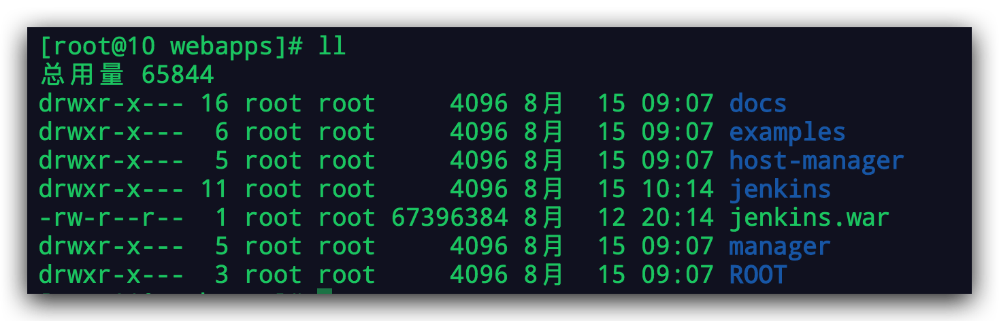

## Liunx服务器：安装tomcat并部署war应用

[TOC]

### 1 前言

现在一般情况下，很少需要单独部署``tomcat`，毕竟`Spring boot`打的`jar包，可以用自带的内置tomcat`，用这个不香吗？

不过有些项目还是使用`Spring MVC`的，所以还是需要`Tomcat安装和部署`。

> war包

`War包是在进行Java Web开发时打包的格式，里面包括java代码还可能有有html,css和javascript等前端代码`；

开发完成后，都需要把源码打包成War到Linux服务器上进行发布。

`War包一般放在Tomcat下的webapps下，随着tomcat服务器的启动，它可以自动被解压`。

### 2 Tomcat安装

`Tomcat服务器是一个免费的开放源代码的Web应用服务器`，属于轻量级应用服务器，在中小型系统和并发访问用户不是很多的场合下被普遍使用；

Tomcat是其中一个开源的且免费的java Web服务器，是Apache软件基金会的项目，所以安装Tomcat之前要安装java JDk。

默认我们的服务器是有JDK，没有的话，请自行安装，这里不再赘述；

> 下载tomcat

我们这里使用的是Tomcat9, [下载地址](https://tomcat.apache.org/download-90.cgi)

这里我们使用的是`apache-tomcat-9.0.37.tar.gz`

可以手动下载，也可以在服务器上使用``wget命令下载``；

~~~shell
[root@10 opt]# wget http://apache.mirrors.pair.com/tomcat/tomcat-9/v9.0.37/bin/apache-tomcat-9.0.37.tar.gz
~~~

> 解压

~~~shell
[root@10 opt]# tar -xvf apache-tomcat-9.0.37.tar.gz
~~~

> 进入 apache-tomcat-9.0.37

~~~shell
[root@10 apache-tomcat-9.0.37]# ll
总用量 144
drwxr-x--- 2 root root  4096 8月  15 09:07 bin
-rw-r----- 1 root root 18982 7月   1 04:14 BUILDING.txt
drwx------ 2 root root  4096 7月   1 04:14 conf
-rw-r----- 1 root root  5409 7月   1 04:14 CONTRIBUTING.md
drwxr-x--- 2 root root  4096 8月  15 09:07 lib
-rw-r----- 1 root root 57092 7月   1 04:14 LICENSE
drwxr-x--- 2 root root  4096 7月   1 04:09 logs
-rw-r----- 1 root root  2333 7月   1 04:14 NOTICE
-rw-r----- 1 root root  3255 7月   1 04:14 README.md
-rw-r----- 1 root root  6898 7月   1 04:14 RELEASE-NOTES
-rw-r----- 1 root root 16262 7月   1 04:14 RUNNING.txt
drwxr-x--- 2 root root  4096 8月  15 09:07 temp
drwxr-x--- 7 root root  4096 7月   1 04:12 webapps
drwxr-x--- 2 root root  4096 7月   1 04:09 work
~~~

> 进入 bin 目录

~~~shell
[root@10 apache-tomcat-9.0.37]# cd bin/
[root@10 bin]# ll
总用量 876
-rw-r----- 1 root root  35926 7月   1 04:11 bootstrap.jar
-rw-r----- 1 root root  16608 7月   1 04:11 catalina.bat
-rwxr-x--- 1 root root  25245 7月   1 04:12 catalina.sh
-rw-r----- 1 root root   1664 7月   1 04:14 catalina-tasks.xml
-rw-r----- 1 root root   2123 7月   1 04:11 ciphers.bat
-rwxr-x--- 1 root root   1997 7月   1 04:12 ciphers.sh
-rw-r----- 1 root root  25197 7月   1 04:11 commons-daemon.jar
-rw-r----- 1 root root 206895 7月   1 04:12 commons-daemon-native.tar.gz
-rw-r----- 1 root root   2040 7月   1 04:11 configtest.bat
-rwxr-x--- 1 root root   1922 7月   1 04:12 configtest.sh
-rwxr-x--- 1 root root   9100 7月   1 04:12 daemon.sh
-rw-r----- 1 root root   2091 7月   1 04:11 digest.bat
-rwxr-x--- 1 root root   1965 7月   1 04:12 digest.sh
-rw-r----- 1 root root   3606 7月   1 04:11 makebase.bat
-rwxr-x--- 1 root root   3382 7月   1 04:12 makebase.sh
-rw-r----- 1 root root   3460 7月   1 04:11 setclasspath.bat
-rwxr-x--- 1 root root   3708 7月   1 04:12 setclasspath.sh
-rw-r----- 1 root root   2020 7月   1 04:11 shutdown.bat
-rwxr-x--- 1 root root   1902 7月   1 04:12 shutdown.sh
-rw-r----- 1 root root   2022 7月   1 04:11 startup.bat
-rwxr-x--- 1 root root   1904 7月   1 04:12 startup.sh
-rw-r----- 1 root root  49301 7月   1 04:11 tomcat-juli.jar
-rw-r----- 1 root root 419572 7月   1 04:12 tomcat-native.tar.gz
-rw-r----- 1 root root   4574 7月   1 04:11 tool-wrapper.bat
-rwxr-x--- 1 root root   5540 7月   1 04:12 tool-wrapper.sh
-rw-r----- 1 root root   2026 7月   1 04:11 version.bat
-rwxr-x--- 1 root root   1908 7月   1 04:12 version.sh
~~~

> 启动 tomcat

~~~shell
[root@10 bin]# sh startup.sh 
Using CATALINA_BASE:   /opt/apache-tomcat-9.0.37
Using CATALINA_HOME:   /opt/apache-tomcat-9.0.37
Using CATALINA_TMPDIR: /opt/apache-tomcat-9.0.37/temp
Using JRE_HOME:        /usr
Using CLASSPATH:       /opt/apache-tomcat-9.0.37/bin/bootstrap.jar:/opt/apache-tomcat-9.0.37/bin/tomcat-juli.jar
Tomcat started.
~~~

> 开启防火墙

默认端口是8080，防火墙开启8080端口

~~~shell
cd /etc/sysconfig
vim iptables

#添加
-A INPUT -p tcp -m state --state NEW -m tcp --dport 8080 -j ACCEPT

#重启
service iptables restart

#若不想修改iptables表，可以直接输入下面命令
# linux iptables开放端口命令
iptables -I INPUT -p tcp --dport 8080 -j ACCEPT  
~~~

OK，Tomcat部署成功, 访问正常；

> 小知识扩展：如何通过端口，找出执行程序所在位置

~~~shell
[root@10 bin]# lsof -i:8080
COMMAND   PID USER   FD   TYPE DEVICE SIZE/OFF NODE NAME
java    26236 root   56u  IPv6 795405      0t0  TCP *:webcache (LISTEN)
[root@10 bin]# netstat -antlp|grep 8080
tcp        0      0 :::8080                     :::*                        LISTEN      26236/java          
[root@10 bin]# cd /proc/26236
[root@10 26236]# ll
总用量 0
dr-xr-xr-x  2 root root 0 8月  15 09:16 attr
-rw-r--r--  1 root root 0 8月  15 09:17 autogroup
-r--------  1 root root 0 8月  15 09:17 auxv
-r--r--r--  1 root root 0 8月  15 09:17 cgroup
--w-------  1 root root 0 8月  15 09:17 clear_refs
-r--r--r--  1 root root 0 8月  15 09:13 cmdline
-rw-r--r--  1 root root 0 8月  15 09:17 comm
-rw-r--r--  1 root root 0 8月  15 09:17 coredump_filter
-r--r--r--  1 root root 0 8月  15 09:17 cpuset
lrwxrwxrwx  1 root root 0 8月  15 09:17 cwd -> /opt/apache-tomcat-9.0.37/bin
...
...
~~~

### 3 部署war应用

我们以Jenkins为例：

> FTP上传到服务器

我这里使用wget直接下载

~~~shell
wget http://mirrors.jenkins-ci.org/war/2.252/jenkins.war
~~~

> 重启服务

~~~shell
[root@10 apache-tomcat-9.0.37]# cd bin/
[root@10 bin]# sh shutdown.sh
[root@10 bin]# sh startup.sh
~~~

> 默认访问路径是 Ip:8080/productName

> 如何去掉productName 这层路径

~~~xml
<Context path="" docBase="jenkins" reloadable="true"></Context>

#docBase要改成你的项目目录。
#path为虚拟路径,访问时的路径，注意:不是根目录的，如果是其他路径比如"/test"一定要加"/"" debug建议设置为0
#reloadable设置为true

<Context path="/test" docBase="jenkins" reloadable="true"></Context>
~~~

`然后，重启Tomcat`

~~~shell
[root@10 bin]# sh shutdown.sh 
Using CATALINA_BASE:   /opt/apache-tomcat-9.0.37
Using CATALINA_HOME:   /opt/apache-tomcat-9.0.37
Using CATALINA_TMPDIR: /opt/apache-tomcat-9.0.37/temp
Using JRE_HOME:        /usr
Using CLASSPATH:       /opt/apache-tomcat-9.0.37/bin/bootstrap.jar:/opt/apache-tomcat-9.0.37/bin/tomcat-juli.jar
[root@10 bin]# sh startup.sh 
Using CATALINA_BASE:   /opt/apache-tomcat-9.0.37
Using CATALINA_HOME:   /opt/apache-tomcat-9.0.37
Using CATALINA_TMPDIR: /opt/apache-tomcat-9.0.37/temp
Using JRE_HOME:        /usr
Using CLASSPATH:       /opt/apache-tomcat-9.0.37/bin/bootstrap.jar:/opt/apache-tomcat-9.0.37/bin/tomcat-juli.jar
Tomcat started.
~~~

