##最新判断IP是国内外的多种方式

[TOC]

### 1 、前言

如何根据IP判断是国内的IP还是国外的IP呢？

应用场景大多是网站开发时中英文版本的自动判断。

相信大多数人肯定会推荐淘宝的免费API，但是目前已经无法访问，并且也很不稳定。

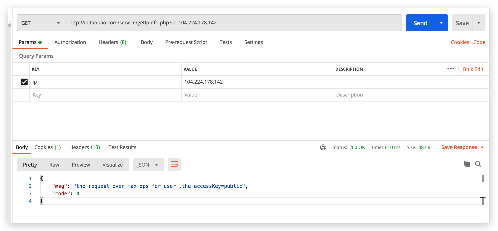

也会有人推荐跳过IP判断，根据当前系统语言判断，虽然速度快，但不准确：

~~~javascript
var Browser_Agent = navigator.userAgent;
    // 浏览器为IE的情况 
    if (Browser_Agent.indexOf(" MSIE ") !=- 1 ){
        var a = navigator.browserLanguage;
        if (a != " zh-cn " ){
            // 英文网站
            console.log("英文网站");
        }
    }
    // 浏览器非IE的情况 
    else {
        var b = navigator.language;
        if (b != " zh-CN " ){
            // 英文网站
            console.log("英文网站");
        }
    }
}
~~~

那么，问题来了，除了这些看起来不太靠谱的方法，还有其他实现方法或者第三方方法吗？

答案是当然有，付费的有，我们这里只讲一些免费第三方的方法和可以自己实现的方法。

我们的需求是只需要判断IP是国内外，而不需要判断IP的具体城市，所以问题变得简单了许多。

### 2、实现方法

#### 2.1、第三方库

比较强大的第三库，不得不推荐MaxMind的GeoIP®Databases and Services，他们有自己的IP库，提供各种准确的接口，付费的可以根据定位很准确，不付费的只可以模糊定位到国家，不过已经符合我们的需求。

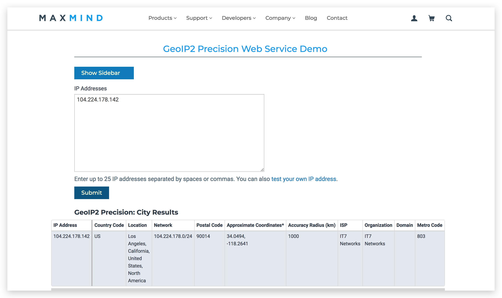

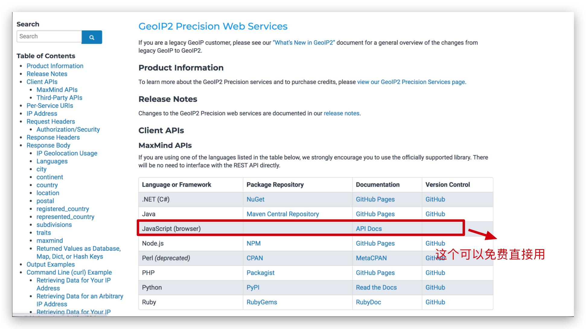

> 基于javaScript实现
>
> https://dev.maxmind.com/geoip/geoip2/javascript/tutorial/

~~~html
<!DOCTYPE html>
<html lang="en">

<head>
  <meta charset="UTF-8">
  <meta name="viewport" content="width=device-width, initial-scale=1.0">
  <title>Document</title>
</head>

<body>
  

    目前所在：
  

  
  
</body>

</html>
~~~

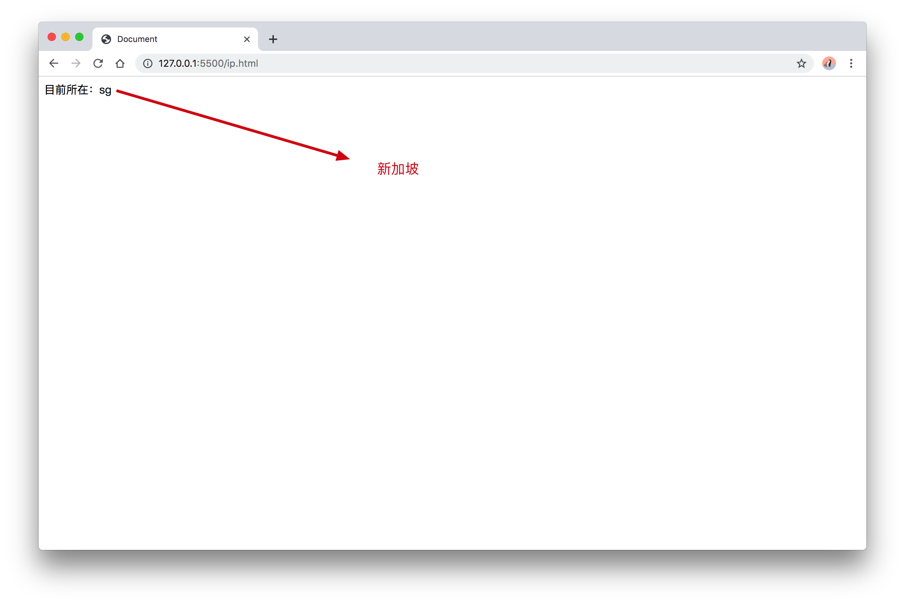

通过这个免费的`javascript API`，就可以判断当前IP是否是国内外，因为我开代理测试的，所以显示当前IP是新加坡。

`MaxMind`的其他实现方式，有的是需要付费，按次收费，获取到的数据也会更加详细更加准确。

#### 2.2、自己实现

上一个方式是借助第三方免费API判断IP所在国家，那么如果是我们做，该怎么做呢？

我们只需要判断IP所在国家是国内外即可。

首先我们需要获取IP库，通过IP库判断；

> IP库
>
> ip库在apnic的官方网站上可以下载
>
> http://ftp.apnic.net/apnic/stats/apnic/delegated-apnic-latest

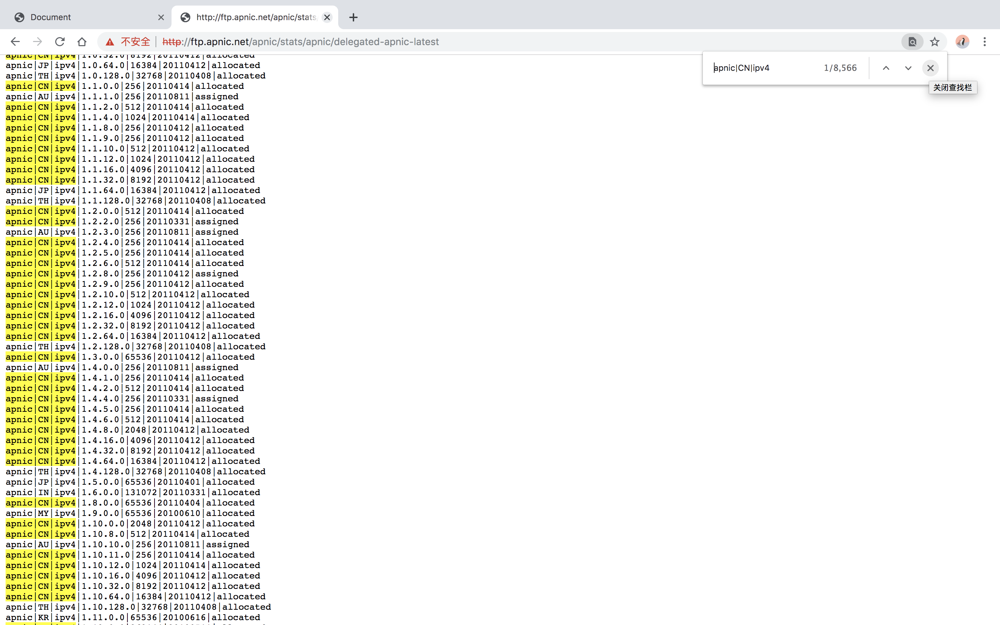

> 那么我们该如何处理呢？总体上分为以下几个部分：

1、使用脚本定期从`apnic``下载IP库`，筛选出所有`apnic|CN|ipv4`, 生成`china_ip.txt`（`其实这里如果只判断CN不太准确，HK、MO和TW被apnic分成单独的，他们都是中国的领土不可被分割，不过我们这里不增加这个逻辑了，所以确切这个文本内的IP是中国大陆的IP`）;

2、基于`java`解析生成的`china_ip.txt`，这样的话相比解析全部IP，解析的成本就低了不少；

3、解析IP列表，存储到`Redis`, 定时N小时过期，保证实时IP库的更新；

4、根据IP到`Redis`中存储的数据做判断，如果在各个地址段范围内，表示是国内ip, 否则是国外ip；

5、判断过的IP也会保存在`Redis`，避免重复的判断。

##### 2.2.1 定时更新下载IP库

> download.sh
>
> 每次下载耗时10mins
>
> 每次生成时，会先生成一个china_ip_new文件，成功之后才会替换原来文件china_ip

~~~shell
ip_url=http://ftp.apnic.net/apnic/stats/apnic/delegated-apnic-latest
ip_txt=china_ip.txt
ip_txt_new=china_ip_new.txt
ip_backup_folder=backup
cur_date=$(date +'%Y%m%d%H%M%S')
cur_path=/home/project/ip

# 删除上一个ip_txt_new文本
if [ -f ${ip_txt_new} ]; then
	rm -rf ${ip_txt_new}
fi

# 除第一个生成ip.txt 文本外，第二次更新，要先生成新的ip_new.txt，不能直接删除ip.text, 文本下载需要12min，以免此期间影响业务代码访问该文本
curl ${ip_url} | grep ipv4 | grep CN | awk -F\| '{ printf("%s/%d\n", $4, log($5)/log(2)) }' > ${ip_txt_new}

echo 'download ip text complete'

echo 'start backup and replace'

# 生成ip_new.txt后, 加上日期后缀备份上一份ip.txt, 然后替换当前ip.txt为最新的 ip_new.txt
if [ ! -d ${ip_backup_folder} ]; then
	mkdir ${ip_backup_folder}
fi

if [ -f ${ip_txt} ]; then
	mv ${ip_txt} ${cur_path}/${ip_backup_folder}/${ip_txt}_${cur_date}
fi

if [ -f ${ip_txt_new} ]; then
	mv ${ip_txt_new} ${ip_txt}
fi

echo 'generate new ip text complete'

~~~

> 加上定时任务

~~~shell
[root@10 ip]# crontab -e
~~~

~~~shell
0 0 * * * sh /home/project/ip/download.sh >> /home/project/ip/download.log 2>&1
~~~

`0 0 * * *`为cron表达式，代表着每天凌晨0:00更新下载

~~~shell
    cron表达式	
	*    *    *    *    *    
	-    -    -    -    -    
	|    |    |    |    |    
	|    |    |    |    +----- 星期几 (0 - 7) (Sunday=0 or 7)
	|    |    |    +---------- 月份 (1 - 12)
	|    |    +--------------- 几号 (1 - 31)
	|    +-------------------- 小时 (0 - 23)
	+------------------------- 分钟 (0 - 59)
~~~

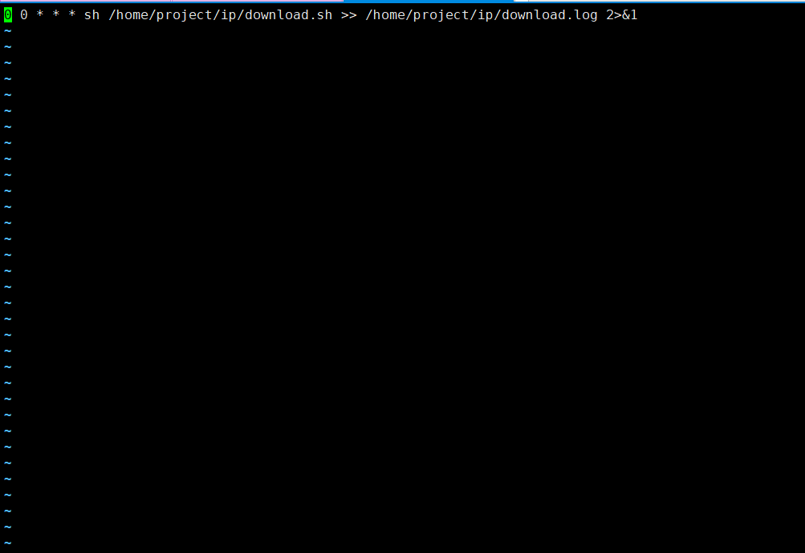

保存即可；

查询定时任务：

~~~shell
crontab -l
~~~

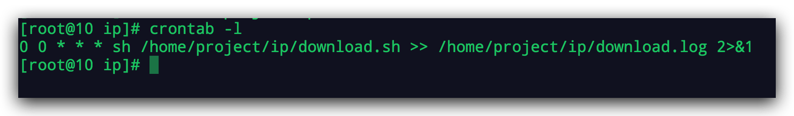

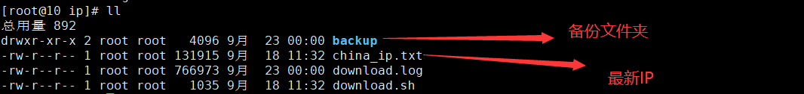

> china_ip.txt
>
> 保存文件格式类似为 `222.126.128.0/15`

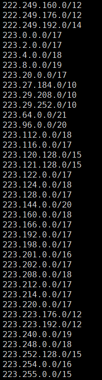

在IP库中：

比如`222.126.128.0/15`对应的文本应该是`apnic|CN|ipv4|222.126.128.0|32768|20060830|allocated`中的`222.126.128.0|32768`;

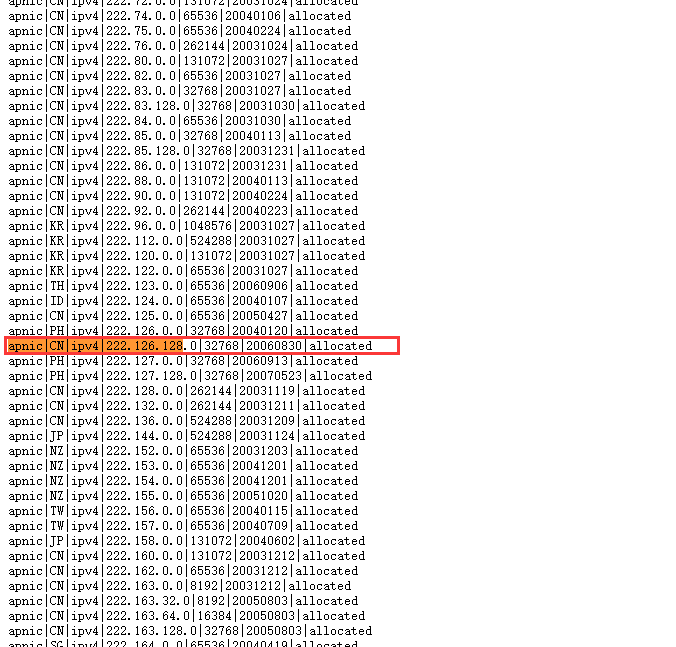

在IP库中，所有的IP不分国家，按照IP的顺序从上而下排列着；

~~~shell
   apnic|CN|ipv4|222.126.128.0|32768|20060830|allocated
	-    -    -        -         -    
	|    |    |        |         |    
	|    |    |        |         +----- 代表着该IP段下有32768个地址
	|    |    |        +--------------- IP地址
	|    |    +------------------------ ipv4
	|    +----------------------------- CN代表中国
	+---------------------------------- 代表apnic
	
那么为什么`222.126.128.0`下有`32768`个地址呢，是怎么计算的呢？
那么我们需要根据下一个IP判断，如上图所示下一个IP是    
`apnic|PH|ipv4|222.127.0.0|32768|20060913|allocated`
PH是菲律宾，说明这个IP就是菲律宾了。

`apnic|CN|ipv4|222.126.128.0|32768|20060830|allocated`
`apnic|PH|ipv4|222.127.0.0|32768|20060913|allocated`

IP：
IP是Internet Protocol（网际互连协议）的缩写，是TCP/IP体系中的网络层协议；
`IP地址是一个32位的二进制数，通常被分割为4个“8位二进制数”（也就是4个字节）。IP地址通常用“点分十进制”表示成（a.b.c.d）的形式，其中，a,b,c,d都是0~255之间的十进制整数`；
所有a,b,c,d都有2的32次方随机匹配地址数。
所以：
从`222.126.128.0`到`222.127.0.0`，有多少种可能？
`a相同，b=126到b=127地址数加1,c=128到c=0剩余128个选择,d有256种选择`
`计算公式=1*128*256=32768个地址`

我们还可以这么假设，
由于c*d=256*256=65536，当`apnic|CN|ipv4|222.160.0.0|131072|20031212|allocated`中`131072`大于65536说明，a.b.*.*也就是222.160.*.*无论都两个整数是什么，都属于中国IP; 并且由于131072=65536*2，说明b+1后的a.b+1.*.*也就是222.161.*.*全部是中国IP；
那么这个结果正确吗，让我们从IP库数据看下：
`apnic|CN|ipv4|222.160.0.0|131072|20031212|allocated`
`apnic|CN|ipv4|222.162.0.0|65536|20031212|allocated`
下一条数据222.162.0.0，所以我们的假设是正确的。虽然不知道为什么Apnic没有把222.162.0.0一并合并到222.160.0.0，但是我们的假设是正确的，第五位的数字代表着基于当前IP按正顺序下的地址数。

所以我们可以这么处理数据：
`首先判断第五位的数字，`

`如果第五位数字超过65536,` 
`代表a.b.*.*都是中国IP，如果是65536的N倍，那么代表着`
a.b.*.*
a.b+1.*.*
....
a.b+n-1.*.*
`全部都是中国IP，可以标记为ALL, 后续比较前两位就可以判断是否是中国IP`。
存储数据结构为：
{
  a: {
    b: "all",
    b+1: "all",
    ....
    b+n-1: "all"
  }
}

`如果第五位数字不超过65536呢？`
apnic|CN|ipv4|1.2.16.0|4096|20110412|allocated
apnic|CN|ipv4|1.2.32.0|8192|20110412|allocated
apnic|CN|ipv4|1.2.64.0|16384|20110412|allocated

IP转换十进制（a.b.c.d）= a*256^3+b*256^2+c*256+d
这里以当前IP转化为十进制为起始范围，加上第五位地址书为终止范围。
如果要判断的IP转化的十进制数后，判断是否在这个范围内，范围内则为中国IP；
并且同一个a.b，后面会有多端地址，如：
apnic|CN|ipv4|14.1.0.0|1024|20110414|allocated
apnic|JP|ipv4|14.1.4.0|1024|20100910|allocated
apnic|JP|ipv4|14.1.8.0|2048|20100910|allocated
apnic|AU|ipv4|14.1.16.0|1024|20100916|allocated
apnic|HK|ipv4|14.1.20.0|1024|20100920|allocated
apnic|CN|ipv4|14.1.24.0|1024|20151214|allocated
中间还掺杂着其他国家的IP，所以需要分段存储如下：
存储数据结构为：
{
  a: {
    b: [
    	"16777472-16777728"
			"16777728-16778240"
			"16779264-16781312"
			"16785408-16793600"
    ]
    
  }
}

`全部数据存储在Redis里面，2小时有效期（再次读取自动生成的IP库更新数据），结构如下：`
{
  a: {
    b: "all",
    b+1: "all",
    ....
    b+n-1: "all",
    b: [
    	"16777472-16777728"
			"16777728-16778240"
			"16779264-16781312"
			"16785408-16793600"
    ]
  }
}
那么如何根据以上的数据判断一个IP是否属于国内IP呢？
`首先根据a查询是否存在，再根据b查询是否存在;`
`如果b存在，如果是all, 直接返回true;`
`如果是数组，需要判断地址是否存在于数组中的某一个范围内，存在就返回true;`
`其他返回false;`

这样的话，查询效率变得快了很多。
每次被查询的IP结果也会被存储在redis中，下次查询同样的IP，可以直接返回结果。
~~~

##### 2.2.2、代码实现

> com.scaffold.test.utils.IpUtils
>
> 工具类

~~~java
package com.scaffold.test.utils;

import com.alibaba.fastjson.JSONArray;
import com.alibaba.fastjson.JSONObject;
import org.apache.commons.io.IOUtils;
import org.apache.commons.lang3.StringUtils;
import org.jsoup.Jsoup;
import org.jsoup.nodes.Document;

import javax.servlet.http.HttpServletRequest;
import java.io.InputStream;
import java.net.Inet4Address;
import java.net.InetAddress;
import java.net.NetworkInterface;
import java.nio.charset.StandardCharsets;
import java.util.*;

public class IpUtils {

    public static final String IPURL = "http://ftp.apnic.net/apnic/stats/apnic/delegated-apnic-latest";

    /**
     * 获取客户端IP
     * @return
     */
    public static String getIpAddress() {
        String UNKNOWN = "unknown";
        String LOCALHOST = "127.0.0.1";
        String LOCALHOST2 = "0:0:0:0:0:0:0:1";
        String SEPARATOR = ",";
        String ipAddress = "";
        try {
            HttpServletRequest request = HttpUtils.getRequest();
            ipAddress = request.getHeader("x-forwarded-for");
            if (ipAddress == null || ipAddress.length() == 0 || UNKNOWN.equalsIgnoreCase(ipAddress)) {
                ipAddress = request.getHeader("Proxy-Client-IP");
            }
            if (ipAddress == null || ipAddress.length() == 0 || UNKNOWN.equalsIgnoreCase(ipAddress)) {
                ipAddress = request.getHeader("WL-Proxy-Client-IP");
            }
            if (ipAddress == null || ipAddress.length() == 0 || UNKNOWN.equalsIgnoreCase(ipAddress)) {
                ipAddress = request.getRemoteAddr();
                if (LOCALHOST.equalsIgnoreCase(ipAddress) || LOCALHOST2.equalsIgnoreCase(ipAddress)) {
                    InetAddress inetAddress = null;
                    try {
                        inetAddress = InetAddress.getLocalHost();
                    } catch (Exception e) {
                        e.printStackTrace();
                    }
                    ipAddress = inetAddress.getHostAddress();
                }
            }

        } catch (Exception e) {
            e.printStackTrace();
        }
        return ipAddress;
    }

    /**
     * 获取IP Map数据
     */
    public static Map<String, Object> getIpList() {
        // 集合存放Ip第一段
        Map<String, Object> ipMap = new HashMap<>();
        try {
            InputStream input = Thread.currentThread().getContextClassLoader().getResourceAsStream("static/china_ip.txt");
            List<String> lines = IOUtils.readLines(input, StandardCharsets.UTF_8);
            // 读取文件内所有的中国IP
            for (String line : lines) {
                if (!StringUtils.isEmpty(line)) {
                    JSONObject parentObj = new JSONObject();
                    String[] ips = line.split("\\.");
                    // 得到一个ip地址段的起始范围 101
                    int ip1 = Integer.parseInt(ips[0]);
                    int ip2 = Integer.parseInt(ips[1]);
                    /*
                     * 101.80.0.0/20 等于  apnic|CN|ipv4|101.80.0.0|1048576(2的20次方)
                     * 101.96.0.0/11 等于  apnic|CN|ipv4|101.96.0.0|2048(2的11次方)
                     * 类似如此数据，IP网端每个地址数256也就是2的8次方，总共是2的32次方
                     * 所以如果最后一个数值超过 16，意味着后两个网络被占满，前面的网段需要递增
                     * 101.80.0.0/20 中 20 意味着后两个网段已满, 第二个网络端递增 2的(20-16)次方等于16
                     * 101.80.0.0/20 = 以下IP从 80 ~ 95 全网端都是中国IP
                     * 101.80.0.0
                     * 101.81.0.0
                     * 101.82.0.0
                     * ...
                     * 101.95.0.0
                     */
                    // 获取从当前IP段开始的总地址数
                    String[] strs = line.split("\\/");
                    long addressCount = Long.parseLong(strs[1]);
                    // 存储各个网络段
                    JSONObject object = new JSONObject();
                    if (ipMap.get(String.valueOf(ip1)) != null) {
                        object = (JSONObject) ipMap.get(String.valueOf(ip1));
                    }
                    // 判断是否后两个字段被占满
                    if (addressCount > 16) {
                        // 后两个字段被占满时，也就是地址数大于 256*256=65536=2的16次方
                        double pow = Math.pow(2, addressCount - 16);
                        for (int i = 0; i < pow; i++) {
                            object.put(String.valueOf(ip2 + i), "all");
                        }
                    } else {
                        /**
                         * apnic CN三个连续数据如下
                         * 101.96.0.0/11
                         * 101.96.8.0/10
                         * 101.96.16.0/12
                         * ---------------------
                         * 如上在第二网段相同的情况
                         * 101.96.0.0/11 等于
                         * 101.96.0.0
                         * ...
                         * 101.96.7.0
                         * 共8个
                         *----------------------
                         * 101.96.8.0/10 等于
                         * 101.96.8.0
                         * ...
                         * 101.96.11.0
                         * 共4个
                         *----------------------
                         * 101.96.16.0/12 等于
                         * 101.96.16.0
                         * ...
                         * 101.96.31.0
                         * 共16个
                         * ---------------------
                         * 从上述数据中看到 101.96.11.0 到 101.96.16.0 出现了断层，中间内容不属于中国的IP
                         * 所以都需要被记录下来，多个IPRange 我们使用数组存储
                         */
                        // 转换IP为long
                        long start_ip = ipv4ToLong(strs[0]);
                        long ip_range = (long) Math.pow(2, addressCount);
                        long end_ip = start_ip + ip_range;
                        String ipRange = start_ip + "-" + end_ip;
                        // 判断是否已存在已有数据
                        JSONArray ipRangeExist = (JSONArray) object.get(String.valueOf(ip2));
                        if (ipRangeExist == null) {
                            ipRangeExist = new JSONArray();
                        }
                        ipRangeExist.add(ipRange);
                        object.put(String.valueOf(ip2), ipRangeExist);
                    }
                    ipMap.put(String.valueOf(ip1), object);
                }
            }
            System.out.println(ipMap);
        } catch (Exception e) {
            e.printStackTrace();
        }
        return ipMap;
    }

    // 求出 IPV4 IP地址所对应的整数，比如 192.168.66.6 对应整数 3232252422
    // 192*256*256*256 + 168*256*256 + 66*256 + 6 = 3232252422
    // IP转换十进制（a.b.c.d）= a*256^3+b*256^2+c*256+d
    public static long ipv4ToLong(String ip) {
        String[] ips = ip.split("\\.");
        long result = 0;
        for (int i = 0; i < ips.length; i++) {
            result += Long.parseLong(ips[i]) * Math.pow(256, 3 - i);
        }
        return result;
    }

    /**
     * 判断IP是不是在中国
     *
     * @param ipMap 中国ip集合
     * @param ip    传入的ip
     * @return true
     */
    public static boolean ipInChina(Map<String, Object> ipMap, String ip) {
        if (ipMap == null) {
            ipMap = getIpList();
        }
        // 判断 IP 是否存在
        if (StringUtils.isEmpty(ip)) {
            return false;
        }
        // 第一个IP端作为key
        String[] ipArr = ip.split("\\.");
        String key = ipArr[0];
        String childKey = ipArr[1];
        // 当前IP转换为整数
        long ip_long = ipv4ToLong(ip);

        // 判断第一个IP端存在
        if (ipMap.containsKey(key)) {
            JSONObject parentObj = (JSONObject) ipMap.get(key);
            // 判断第二个IP段是否存在
            if (parentObj.getString(childKey) != null) {
                String ipRange = parentObj.getString(childKey);
                if (ipRange.equals("all")) {
                    // 整个其余网段都是中国IP
                    return true;
                } else {
                    JSONArray ipRangeArray = JSONArray.parseArray(ipRange);
                    for (Object range : ipRangeArray) {
                        String[] ipRanges = String.valueOf(range).split("\\-");
                        if (ipRanges.length == 2) {
                            long ipRange_start = Long.parseLong(ipRanges[0]);
                            long ipRange_end = Long.parseLong(ipRanges[1]);
                            // 判断是否在范围内
                            return ip_long >= ipRange_start && ip_long <= ipRange_end;
                        }
                    }
                }
            }
        }
        return false;
    }

}

~~~

> com.scaffold.test.redis.RedisUtils
>
> redis工具类

~~~java
package com.scaffold.test.redis;

import org.springframework.data.redis.core.RedisTemplate;
import org.springframework.stereotype.Component;

import javax.annotation.Resource;
import java.util.Arrays;
import java.util.List;
import java.util.concurrent.TimeUnit;

/**
 * @author alex
 * Redis工具类
 */

@Component
public class RedisUtils {

    @Resource
    private RedisTemplate<String, Object> redisTemplate;

    /**
     * 设置key value
     *
     * @param key key
     * @param value value
     */
    public void set(String key, Object value) {
        redisTemplate.opsForValue().set(key, value);
    }

    /**
     * 设置key value，并设置过期时间
     *
     * @param key key
     * @param value value
     * @param timeout 过期时间
     * @param unit 时间单位, 天:TimeUnit.DAYS 小时:TimeUnit.HOURS 分钟:TimeUnit.MINUTES
     *            秒:TimeUnit.SECONDS 毫秒:TimeUnit.MILLISECONDS
     */
    public void set(String key, Object value, long timeout, TimeUnit unit) {
        redisTemplate.opsForValue().set(key, value, timeout, unit);
    }

    /**
     * 获取
     *
     * @param key
     * @return
     */
    public Object get(String key) {
        return redisTemplate.opsForValue().get(key);
    }

    /**
     * 删除一个
     *
     * @param key 键 可以是一个，也可以是','连接的多个，比如1,2,3,4
     * @return true
     */
    public Object delete(String key) {
        String splitChar = ",";
        if (key.contains(splitChar)) {
            String[] keys = key.split(splitChar);
            List<String> keyList = Arrays.asList(keys);
            return redisTemplate.delete(keyList);
        } else {
            return redisTemplate.delete(key);
        }
    }

    /**
     * 是否存在key
     *
     * @param key
     * @return
     */
    public Boolean hasKey(String key) {
        return redisTemplate.hasKey(key);
    }
}
~~~

> redis配置
>
> com.scaffold.test.config.RedissonConfig
>
> 可以存储list

~~~java
package com.scaffold.test.config;

import com.fasterxml.jackson.annotation.JsonAutoDetect;
import com.fasterxml.jackson.annotation.PropertyAccessor;
import com.fasterxml.jackson.databind.ObjectMapper;
import org.redisson.Redisson;
import org.redisson.api.RedissonClient;
import org.redisson.codec.JsonJacksonCodec;
import org.redisson.config.Config;
import org.springframework.context.annotation.Bean;
import org.springframework.context.annotation.Configuration;
import org.springframework.data.redis.core.RedisTemplate;
import org.springframework.data.redis.serializer.Jackson2JsonRedisSerializer;
import org.springframework.data.redis.serializer.RedisSerializer;
import org.springframework.data.redis.serializer.StringRedisSerializer;

import javax.annotation.Resource;

@Configuration
public class RedissonConfig {

    @Resource
    private RedisTemplate<String, Object> redisTemplate;

    @Bean
    public RedisTemplate<String, Object> setRedisTemplate(){
        // 使用 Jackson2JsonRedisSerialize 替换默认序列化
        Jackson2JsonRedisSerializer jackson2JsonRedisSerializer = new Jackson2JsonRedisSerializer(Object.class);
        ObjectMapper objectMapper = new ObjectMapper();
        objectMapper.setVisibility(PropertyAccessor.ALL, JsonAutoDetect.Visibility.ANY);
        objectMapper.enableDefaultTyping(ObjectMapper.DefaultTyping.NON_FINAL);
        jackson2JsonRedisSerializer.setObjectMapper(objectMapper);
        // 字符串序列化
        RedisSerializer stringSerializer = new StringRedisSerializer();
        redisTemplate.setKeySerializer(stringSerializer);
        // value 使用 Jackson2JsonRedisSerialize 序列化
        redisTemplate.setValueSerializer(jackson2JsonRedisSerializer);
        redisTemplate.setHashKeySerializer(stringSerializer);
        redisTemplate.setHashValueSerializer(stringSerializer);
        return redisTemplate;
    }

}
~~~

> com.scaffold.test.controller.RedisController
>
> 控制层

~~~java
package com.scaffold.test.controller;

import com.alibaba.fastjson.JSONObject;
import com.scaffold.test.base.Result;
import com.scaffold.test.base.ResultGenerator;
import com.scaffold.test.config.annotation.PassToken;
import com.scaffold.test.redis.RedisUtils;
import com.scaffold.test.utils.IpUtils;
import org.springframework.beans.factory.annotation.Autowired;
import org.springframework.web.bind.annotation.GetMapping;
import org.springframework.web.bind.annotation.RequestMapping;
import org.springframework.web.bind.annotation.RequestParam;
import org.springframework.web.bind.annotation.RestController;

import java.util.List;
import java.util.Map;
import java.util.concurrent.TimeUnit;

/**
 * @author alex
 */

@RestController
@RequestMapping("redis")
public class RedisController {

    @Autowired
    private RedisUtils redisUtils;

    /**
     * (耗时1~2S）
     * 获取IP并存入redis, 判断是国内外IP
     *
     * @return
     */
    @GetMapping("ip")
    public Result setIp(String ip) {
        if (ip == null) {
            ip = IpUtils.getIpAddress();
        }
        // 判断IP判断结果是否在缓存数据中
        Object exist = redisUtils.get(ip);
        JSONObject object = new JSONObject();
        object.put("ip", ip);
        if (exist == null) {
            Map<String, Object> ipData;
            // 从缓存中获取数据
            Object ip_map = redisUtils.get("ip_map");
            if (ip_map != null) {
                ipData = (Map<String, Object>) ip_map;
            } else {
                ipData = IpUtils.getIpList();
                redisUtils.set("ip_map", ipData, 2, TimeUnit.HOURS);
            }
            Boolean inChina = IpUtils.ipInChina(ipData, ip);
            object.put("country", inChina ? "CN" : "other");
            redisUtils.set(ip, inChina);

        } else {
            object.put("country", exist.equals(true) ? "CN" : "other");
        }
        return ResultGenerator.setSuccessResult(object);
    }
}

~~~

以上方案代码实现，初次只需2s，再次查询会更快。

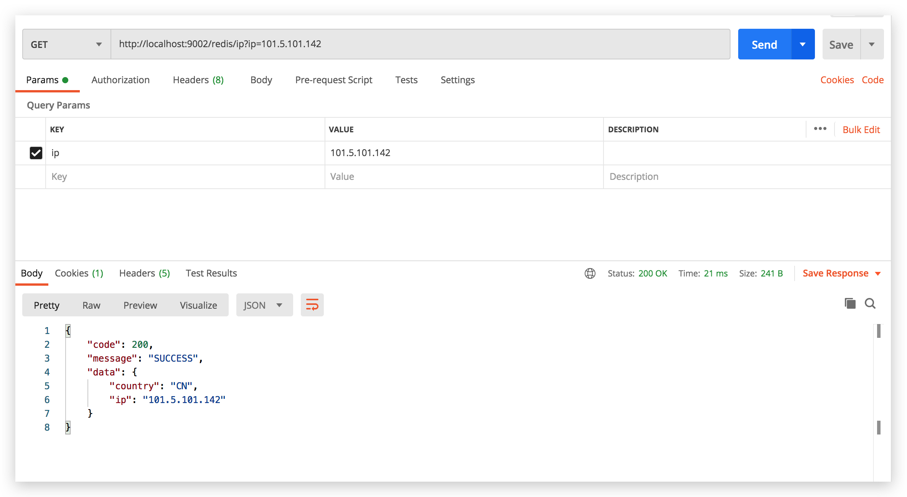

## 3、总结

以上代码算是比较准确计算IP位置，但是目前只获取了CN。如果更加准确的话，应该加上HK、MO和TW的数据。

他们都是中国的领土，不可分割。