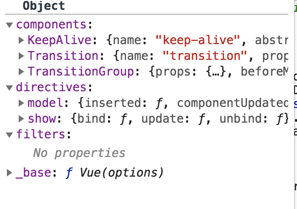

## example

这里我们只是引用js, 不利用`vue-cli`去生成一个demo，这样我们可以更加清晰了解这是怎么的一个过程：

~~~html
<!-- development version, includes helpful console warnings -->

      {{ message }}
    

~~~
    
首先 必须使用 new Vue() 这个原因不再赘述，接下来让我们从 Vue 最初的构造函数开始讲起

~~~javascript
function Vue (options) {
  if (process.env.NODE_ENV !== 'production' &&
    !(this instanceof Vue)
  ) {
    warn('Vue is a constructor and should be called with the `new` keyword')
  }
  this._init(options)
}
~~~

	
## `this._init`

~~~js
//this._init
Vue.prototype._init = function (options?: Object) {
    const vm: Component = this
    // a uid
    vm._uid = uid++
	
    let startTag, endTag
    /* istanbul ignore if */
    if (process.env.NODE_ENV !== 'production' && config.performance && mark) 		{
      startTag = `vue-perf-start:${vm._uid}`
      endTag = `vue-perf-end:${vm._uid}`
      mark(startTag)
    }
	
    // a flag to avoid this being observed
    vm._isVue = true
    // merge options
    if (options && options._isComponent) {
      // optimize internal component instantiation
      // since dynamic options merging is pretty slow, and none of the
      // internal component options needs special treatment.
      initInternalComponent(vm, options)
    } else {
      vm.$options = mergeOptions(
        resolveConstructorOptions(vm.constructor),
        options || {},
        vm
      )
    }
    /* istanbul ignore else */
    if (process.env.NODE_ENV !== 'production') {
      initProxy(vm)
    } else {
      vm._renderProxy = vm
    }
    // expose real self
    vm._self = vm
    initLifecycle(vm)
    initEvents(vm)
    initRender(vm)
    callHook(vm, 'beforeCreate')
    initInjections(vm) // resolve injections before data/props
    initState(vm)
    initProvide(vm) // resolve provide after data/props
    callHook(vm, 'created')
	
    /* istanbul ignore if */
    if (process.env.NODE_ENV !== 'production' && config.performance && mark) 		{
      vm._name = formatComponentName(vm, false)
      mark(endTag)
      measure(`vue ${vm._name} init`, startTag, endTag)
    }
	
    if (vm.$options.el) {
      vm.$mount(vm.$options.el)
    }
}
~~~

`vm._uid` vue 给当前的 vm 赋予了唯一的 `_uid` ，然后设置`vue._isVue`(监听对象变化时过滤vm)。
`options._isComponent`在内部创建子组件的时候才是`true`，目前例子中走`else`里面的逻辑。`mergeOptions`是用来合并两个对象，并且对数据做了一定的操作，不只是`Object.assign`的简单合并。

## `resolveConstructorOptions`

`resolveConstructorOptions`方法在`Vue.extend`中做了详细的解释，它的作用是合并构造器及构造器父级上定义的`options`。

~~~js
export function resolveConstructorOptions (Ctor: Class<Component>) {
  let options = Ctor.options;
  //有super属性，说明是Ctor是通过`Vue.extend()`创建的子类
  if (Ctor.super) {
    const superOptions = resolveConstructorOptions(Ctor.super)
    const cachedSuperOptions = Ctor.superOptions
    if (superOptions !== cachedSuperOptions) {
      // super option changed,
      // need to resolve new options.
      Ctor.superOptions = superOptions
      // check if there are any late-modified/attached options (#4976)
      const modifiedOptions = resolveModifiedOptions(Ctor)
      // update base extend options
      if (modifiedOptions) {
        extend(Ctor.extendOptions, modifiedOptions)
      }
      options = Ctor.options = mergeOptions(superOptions, Ctor.extendOptions)
      if (options.name) {
        options.components[options.name] = Ctor
      }
    }
  }
  return options
}
~~~

`Ctor == vm.constructor == Vue对象`，`ctor.options`正是我们在`src/core/index.js`里面`initGlobalApi(Vue)`产生的，代码如下在`src/core/global-api/index.js`中：

### `Ctor.options == Vue.options`

~~~js
 Vue.options = Object.create(null)
 // ASSET_TYPES = [
 // 'component',
 // 'directive',
 // 'filter'
 // ]

  //Vue.options.components | Vue.options.directivea | Vue.options.filters
  ASSET_TYPES.forEach(type => {
    Vue.options[type + 's'] = Object.create(null)
  })

  // this is used to identify the "base" constructor to extend all plain-object
  // components with in Weex's multi-instance scenarios.
  
  //Vue.options._base 等于本身
  Vue.options._base = Vue
  
  //builtInComponents == keepAlive
  //Vue.options.components.KeepAlive
  extend(Vue.options.components, builtInComponents)
  
~~~

so, `Ctor.options` 如图

`Ctor.super`是在调用`Vue.extend`时，才会添加的属性，这里先直接跳过。所以`mergeOptions`的第一个参数就是上面的`Ctor.options`，第二个参数是我们传入的`options`，第三个参数是当前对象`vm`。

## `mergeOptions`

`mergeOptions`是`Vue`中处理属性的合并策略的

~~~js
/**
 * Merge two option objects into a new one.
 * Core utility used in both instantiation and inheritance.
 */
export function mergeOptions (
  parent: Object,
  child: Object,
  vm?: Component
): Object {
  if (process.env.NODE_ENV !== 'production') {
  	 //如果有options.components, 判断组件是否合法
    checkComponents(child)
  }

  //第一次child === {el, data, props} 如果不是Object, 则走下面
  //如果 vue.extend 扩展子类组件的时候 type 就是function
  if (typeof child === 'function') {
    child = child.options
  }

  /**
  * 格式化 props
  * 只能是 Array or Object
  * props: [propName] 
  * or
  * props: {propName:{handle:function(), deep: Boolean}}
  */
  normalizeProps(child, vm)
  
  /**
  * 格式化 inject
  * 
  */
  normalizeInject(child, vm)
  
  /**
  * 格式化指令 directive
  * directives:{
      //object
      focus: {
        inserted: function(el){
          el.focus()
        }
      },
      //function
      color: function(el, binding){
        console.log(binding); 
        el.style.color = binding.value;
      }
    }
    
    ===格式化后===
    
    directives:{
      //object
      focus: {
        inserted: function(el){
          el.focus()
        }
      },
      //function
      color: {
      	bind:function(el, binding){
    		console.log(binding); 
    		el.style.color = binding.value;
      	},
      	update:function(el, binding){
    		console.log(binding); 
    		el.style.color = binding.value;
      	},
      }
    }
  */
  normalizeDirectives(child)

  // Apply extends and mixins on the child options,
  // but only if it is a raw options object that isn't
  // the result of another mergeOptions call.
  // Only merged options has the _base property.
  
  //只有合并过的options才有_base, 初始化对象才可以有以下处理
  if (!child._base) {
    if (child.extends) {
      parent = mergeOptions(parent, child.extends, vm)
    }
    if (child.mixins) {
      for (let i = 0, l = child.mixins.length; i < l; i++) {
        parent = mergeOptions(parent, child.mixins[i], vm)
      }
    }
  }

  const options = {}
  let key
  for (key in parent) {
    mergeField(key)
  }
  for (key in child) {
    if (!hasOwn(parent, key)) {
      mergeField(key)
    }
  }
  function mergeField (key) {
    const strat = strats[key] || defaultStrat
    options[key] = strat(parent[key], child[key], vm, key)
  }
  return options
}
~~~

前面和`components`、`props`、`directives`、`extends`、`mixins`相关的内容我们暂且忽略，我们知道`Vue`提供了配置`optionMergeStrategies`对象，来让我们手动去控制属性的合并策略，这里的`strats[key]`就是key属性的合并方法。

~~~js
 *
 * When a vm is present (instance creation), we need to do
 * a three-way merge between constructor options, instance
 * options and parent options.
 */
function mergeAssets (
  parentVal: ?Object,
  childVal: ?Object,
  vm?: Component,
  key: string
): Object {
  const res = Object.create(parentVal || null)
  if (childVal) {
    process.env.NODE_ENV !== 'production' && assertObjectType(key, childVal, vm)
    return extend(res, childVal)
  } else {
    return res
  }
}

ASSET_TYPES.forEach(function (type) {
  strats[type + 's'] = mergeAssets
})
~~~

`ASSET_TYPES`就是`components`、`directives`、`filters`，这三个的合并策略都一样，这里我们都返回了`parentVal`的一个子对象。

data属性的合并策略，是也是Vue内置的，如下：

~~~js
/**
 * Helper that recursively merges two data objects together.
 */
function mergeData (to: Object, from: ?Object): Object {
  if (!from) return to
  let key, toVal, fromVal

  const keys = hasSymbol
    ? Reflect.ownKeys(from)
    : Object.keys(from)

  for (let i = 0; i < keys.length; i++) {
    key = keys[i]
    // in case the object is already observed...
    if (key === '__ob__') continue
    toVal = to[key]
    fromVal = from[key]
    if (!hasOwn(to, key)) {
      set(to, key, fromVal)
    } else if (
      toVal !== fromVal &&
      isPlainObject(toVal) &&
      isPlainObject(fromVal)
    ) {
      mergeData(toVal, fromVal)
    }
  }
  return to;
}
~~~

~~~js
strats.data = function (
  parentVal: any,
  childVal: any,
  vm?: Component
): ?Function {
  if (!vm) {
    if (childVal && typeof childVal !== 'function') {
      process.env.NODE_ENV !== 'production' && warn(
        'The "data" option should be a function ' +
        'that returns a per-instance value in component ' +
        'definitions.',
        vm
      )

      return parentVal
    }
    return mergeDataOrFn(parentVal, childVal)
  }

  return mergeDataOrFn(parentVal, childVal, vm)
}
~~~
### `mergeDataOrFn`

~~~js
/**
* Data
*/
function mergeDataOrFn(
	parentVal,
	childVal,
	vm
) {
	if (!vm) {
	  // in a Vue.extend merge, both should be functions
	  if (!childVal) {
	    return parentVal
	  }
	  if (!parentVal) {
	    return childVal
	  }
	  // when parentVal & childVal are both present,
	  // we need to return a function that returns the
	  // merged result of both functions... no need to
	  // check if parentVal is a function here because
	  // it has to be a function to pass previous merges.
	  return function mergedDataFn() {
	    return mergeData(
	      typeof childVal === 'function' ? childVal.call(this, this) : childVal,
	      typeof parentVal === 'function' ? parentVal.call(this, this) : parentVal
	    )
	  }
	} else {
	  return function mergedInstanceDataFn() {
	    // instance merge
	    var instanceData = typeof childVal === 'function'
	      ? childVal.call(vm, vm)
	      : childVal;
	    var defaultData = typeof parentVal === 'function'
	      ? parentVal.call(vm, vm)
	      : parentVal;
	    if (instanceData) {
	      return mergeData(instanceData, defaultData)
	    } else {
	      return defaultData
	    }
	  }
	}
}
~~~
这里`vm`且`data`都不为空，所以会走到 else if，返回的是`mergedInstanceDataFn`方法。关于`mergedInstanceDataFn`方法，我们都知道，子组件中定义`data`时，必须是一个函数，这里简单的判断了是函数就执行，不是就返回自身的值。然后通过`mergeData`去合并，其实就是递归把`defaultData`合并到`instanceData`，并观察。

~~~js

vue.$options:

	components: {}
	created: [ƒ]
	data: ƒ mergedInstanceDataFn()
	directives: {focus: {…}, color: {…}}
	el: "#app"
	filters: {}
	props: {name: {…}}
	render: ƒ anonymous( )
	staticRenderFns: []
	_base: ƒ Vue(options)
	_propKeys: ["name"]
	__proto__: Object
	
~~~

## `proxy`

_init()里面接下来代码是判断是否走代理，开发环境，则vm._renderProxy值为一个Proxy代理对象，生产环境就是vm自身,稍后再讲解proxy

~~~js
/* istanbul ignore else */
    if (process.env.NODE_ENV !== 'production') {
      initProxy(vm)
    } else {
      vm._renderProxy = vm
    }
    
    //initProxy
    initProxy = function initProxy (vm) {
    if (hasProxy) {
      // determine which proxy handler to use
      const options = vm.$options
      const handlers = options.render && options.render._withStripped
        ? getHandler
        : hasHandler
      vm._renderProxy = new Proxy(vm, handlers)
    } else {
      vm._renderProxy = vm
    }
  }
~~~

接下来就是初始化生命周期

## `initLifecycle`

~~~js

export function initLifecycle (vm: Component) {
  const options = vm.$options

  // locate first non-abstract parent
  let parent = options.parent
  if (parent && !options.abstract) {
    while (parent.$options.abstract && parent.$parent) {
      parent = parent.$parent
    }
    parent.$children.push(vm)
  }

  vm.$parent = parent
  vm.$root = parent ? parent.$root : vm

  vm.$children = []
  vm.$refs = {}

  vm._watcher = null
  vm._inactive = null
  vm._directInactive = false
  vm._isMounted = false
  vm._isDestroyed = false
  vm._isBeingDestroyed = false
}
~~~

该过程主要就是给vm对象添加了`$parent`、`$root`、`$children`属性，以及一些其它的生命周期相关的标识。

`options.abstract`用于判断是否是抽象组件，组件的父子关系建立会跳过抽象组件，抽象组件比如`keep-alive`、`transition`等。所有的子组件`$root`都指向顶级组件。

## `initEvents `

~~~js
export function initEvents (vm: Component) {
  vm._events = Object.create(null)
  vm._hasHookEvent = false
  // init parent attached events
  const listeners = vm.$options._parentListeners
  if (listeners) {
    updateComponentListeners(vm, listeners)
  }
}
~~~

该方法初始化事件相关的属性，_parentListeners是父组件中绑定在自定义标签上的事件，供子组件处理

~~~js
export function initRender (vm: Component) {
  vm._vnode = null // the root of the child tree
  vm._staticTrees = null // v-once cached trees
  const options = vm.$options
  const parentVnode = vm.$vnode = options._parentVnode // the placeholder node in parent tree
  const renderContext = parentVnode && parentVnode.context
  vm.$slots = resolveSlots(options._renderChildren, renderContext)
  vm.$scopedSlots = emptyObject
  // bind the createElement fn to this instance
  // so that we get proper render context inside it.
  // args order: tag, data, children, normalizationType, alwaysNormalize
  // internal version is used by render functions compiled from templates
  vm._c = (a, b, c, d) => createElement(vm, a, b, c, d, false)
  // normalization is always applied for the public version, used in
  // user-written render functions.
  vm.$createElement = (a, b, c, d) => createElement(vm, a, b, c, d, true)

  // $attrs & $listeners are exposed for easier HOC creation.
  // they need to be reactive so that HOCs using them are always updated
  const parentData = parentVnode && parentVnode.data

  /* istanbul ignore else */
  if (process.env.NODE_ENV !== 'production') {
    defineReactive(vm, '$attrs', parentData && parentData.attrs || emptyObject, () => {
      !isUpdatingChildComponent && warn(`$attrs is readonly.`, vm)
    }, true)
    defineReactive(vm, '$listeners', options._parentListeners || emptyObject, () => {
      !isUpdatingChildComponent && warn(`$listeners is readonly.`, vm)
    }, true)
  } else {
    defineReactive(vm, '$attrs', parentData && parentData.attrs || emptyObject, null, true)
    defineReactive(vm, '$listeners', options._parentListeners || emptyObject, null, true)
  }
}
~~~

这里给vm添加了一些虚拟dom、slot等相关的属性和方法

然后开始调用`beforeCreate`钩子方法

~~~js

callHook(vm, 'beforeCreate')

~~~

接下来在 data / props 处理之前，进行 `注入` 操作

## `initInjections `

~~~js

//initProvide
export function initProvide (vm: Component) {
  const provide = vm.$options.provide
  if (provide) {
    vm._provided = typeof provide === 'function'
      ? provide.call(vm)
      : provide
  }
}

//initInjections
export function initInjections (vm: Component) {
  const result = resolveInject(vm.$options.inject, vm)
  if (result) {
    //不会被观察到
    toggleObserving(false)
    Object.keys(result).forEach(key => {
      /* istanbul ignore else */
      if (process.env.NODE_ENV !== 'production') {
        defineReactive(vm, key, result[key], () => {
          warn(
            `Avoid mutating an injected value directly since the changes will be ` +
            `overwritten whenever the provided component re-renders. ` +
            `injection being mutated: "${key}"`,
            vm
          )
        })
      } else {
        defineReactive(vm, key, result[key])
      }
    })
    toggleObserving(true)
  }
}
~~~
这两个配套使用，用于将父组件_provided中定义的值，通过inject注入到子组件，且这些属性不会被观察。简单的例子如下：

~~~js
  

  	<Demo /> /** demo bar bar1 **/
  

  
  var app = new Vue({
    el: '#app',
    data: {
      message: '88',
      color:'red',
    },
    created(){
      console.log('component hook called');    
    },
    provide:{
      foo: 'bar',
      foo1: 'bar1',
    },
    components:{
      Demo: {
        inject:['foo', 'foo1'],
        template: '
demo {{foo}} {{foo1}}
'
      }
    }
  })

</script>
~~~

## `initState(vm)`
~~~js
export function initState (vm: Component) {
  vm._watchers = []
  const opts = vm.$options
  if (opts.props) initProps(vm, opts.props)
  if (opts.methods) initMethods(vm, opts.methods)
  if (opts.data) {
    initData(vm)
  } else {
    observe(vm._data = {}, true /* asRootData */)
  }
  if (opts.computed) initComputed(vm, opts.computed)
  if (opts.watch && opts.watch !== nativeWatch) {
    initWatch(vm, opts.watch)
  }
}
~~~

这里主要就是操作数据了，`props`、`methods`、`data`、`computed`、`watch`，从这里开始就涉及到了`Observer`、`Dep`和`Watcher`，网上讲解双向绑定的文章很多，之后我也会单独去讲解这一块。而且，这里对数据操作也比较多，在讲完双向绑定的内容后，有时间我们再来说一说`Vue`对我们传入的数据都进行了什么操作。

到这一步，我们看看我们的`vm`对象变成了什么样：

~~~js
$attrs: (...)
$children: [VueComponent]
$createElement: ƒ (a, b, c, d)
$el: div#app
$listeners: (...)
$options:
components: {Demo: {…}}
created: (2) [ƒ, ƒ]
data: ƒ mergedInstanceDataFn()
directives: {focus: {…}, color: {…}}
el: "#app"
filters: {}
methods: {hello: ƒ}
mixins: [{…}]
provide: ƒ mergedInstanceDataFn()
render: ƒ anonymous( )
staticRenderFns: []
_base: ƒ Vue(options)
__proto__: Object
$parent: undefined
$refs: {}
$root: Vue {_uid: 0, _isVue: true, $options: {…}, _renderProxy: Proxy, _self: Vue, …}
$scopedSlots: {}
$slots: {}
$vnode: undefined
color: (...)
hello: ƒ ()
message: (...)
mixins: (...)
__VUE_DEVTOOLS_ROOT_UID__: 1
__VUE_DEVTOOLS_UID__: "1:0"
_c: ƒ (a, b, c, d)
_data: {__ob__: Observer}
_directInactive: false
_events: {hook:beforeDestroy: Array(1)}
_hasHookEvent: true
_inactive: null
_isBeingDestroyed: false
_isDestroyed: false
_isMounted: true
_isVue: true
_provided: {foo: "bar", foo1: "bar1"}
_renderProxy: Proxy {_uid: 0, _isVue: true, $options: {…}, _renderProxy: Proxy, _self: Vue, …}
_self: Vue {_uid: 0, _isVue: true, $options: {…}, _renderProxy: Proxy, _self: Vue, …}
_staticTrees: null
_uid: 0
_vnode: VNode {tag: "div", data: {…}, children: Array(7), text: undefined, elm: div#app, …}
_watcher: Watcher {vm: Vue, deep: false, user: false, lazy: false, sync: false, …}
_watchers: [Watcher]
$data: (...)
$isServer: (...)
$props: (...)
$ssrContext: (...)
get $attrs: ƒ reactiveGetter()
set $attrs: ƒ reactiveSetter(newVal)
get $listeners: ƒ reactiveGetter()
set $listeners: ƒ reactiveSetter(newVal)
get color: ƒ proxyGetter()
set color: ƒ proxySetter(val)
get message: ƒ proxyGetter()
set message: ƒ proxySetter(val)
get mixins: ƒ proxyGetter()
set mixins: ƒ proxySetter(val)
__proto__: Object

~~~

~~~js
每个阶段产物不同：
//_init
vm._uid = 0
vm._isVue = true
vm.$options = {
	components:{Demo:{...}},
	filters:{},
	directives:{focus:{...}, color:{...}},
	el:'#app',
	_base: Vue,
	....	
}

vm._renderProxy = vm
vm._self = vm;

// initLifeCycle
vm.$parent = parent;
vm.$root = parent ? parent.$root : vm;

vm.$children = [];
vm.$refs = {};

vm._watcher = null;
vm._inactive = null;
vm._directInactive = false;
vm._isMounted = false;
vm._isDestroyed = false;
vm._isBeingDestroyed = false;

// initEvents
vm._events = Object.create(null);
vm._hasHookEvent = false;

// initRender
vm._vnode = null; // the root of the child tree
vm._staticTrees = null; // v-once cached trees
vm.$slots = resolveSlots(options._renderChildren, renderContext);
vm.$scopedSlots = emptyObject;
// bind the createElement fn to this instance
// so that we get proper render context inside it.
// args order: tag, data, children, normalizationType, alwaysNormalize
// internal version is used by render functions compiled from templates
vm._c = function (a, b, c, d) { return createElement(vm, a, b, c, d, false); };
// normalization is always applied for the public version, used in
// user-written render functions.
vm.$createElement = function (a, b, c, d) { return createElement(vm, a, b, c, d, true); };

// initState
vm._data
vm._watchers = []

~~~
然后，就会调用我们的`created`钩子函数。

我们看到`create`阶段，基本就是对传入数据的格式化、数据的双向绑定、以及一些属性的初始化。

## `$mount`
~~~js
 var mount = Vue.prototype.$mount;
  Vue.prototype.$mount = function (
    el,
    hydrating
  ) {
    el = el && query(el);

    /* istanbul ignore if */
    if (el === document.body || el === document.documentElement) {
      warn(
        "Do not mount Vue to <html> or <body> - mount to normal elements instead."
      );
      return this
    }

    var options = this.$options;
    // resolve template/el and convert to render function
    if (!options.render) {
      var template = options.template;
      if (template) {
        if (typeof template === 'string') {
          if (template.charAt(0) === '#') {
            template = idToTemplate(template);
            /* istanbul ignore if */
            if (!template) {
              warn(
                ("Template element not found or is empty: " + (options.template)),
                this
              );
            }
          }
        } else if (template.nodeType) {
          template = template.innerHTML;
        } else {
          {
            warn('invalid template option:' + template, this);
          }
          return this
        }
      } else if (el) {
        template = getOuterHTML(el);
      }
      if (template) {
        /* istanbul ignore if */
        if (config.performance && mark) {
          mark('compile');
        }

        var ref = compileToFunctions(template, {
          outputSourceRange: "development" !== 'production',
          shouldDecodeNewlines: shouldDecodeNewlines,
          shouldDecodeNewlinesForHref: shouldDecodeNewlinesForHref,
          delimiters: options.delimiters,
          comments: options.comments
        }, this);
        var render = ref.render;
        var staticRenderFns = ref.staticRenderFns;
        options.render = render;
        options.staticRenderFns = staticRenderFns;

        /* istanbul ignore if */
        if (config.performance && mark) {
          mark('compile end');
          measure(("vue " + (this._name) + " compile"), 'compile', 'compile end');
        }
      }
    }
    return mount.call(this, el, hydrating)
  };
~~~

首先，通过`mount = Vue.prototype.$mount`保存之前定义的`$mount`方法，然后重写。

这里的`query`可以理解为`document.querySelector`，只不过内部判断了一下el是不是字符串，不是的话就直接返回，所以我们的el也可以直接传入dom元素。

之后判断是否有`render`函数，如果有就不做处理直接执行`mount.call(this, el, hydrating)`。如果没有`render`函数，则获取`template`，`template`可以是#id、模板字符串、dom元素，如果没有`template`，则获取el以及其子内容作为模板。

`compileToFunctions`是对我们最后生成的模板进行解析，生成`render`。这里的内容也比较多，简单说一下：

~~~js

// `createCompilerCreator` allows creating compilers that use alternative
// parser/optimizer/codegen, e.g the SSR optimizing compiler.
// Here we just export a default compiler using the default parts.
export const createCompiler = createCompilerCreator(function baseCompile (
  template: string,
  options: CompilerOptions
): CompiledResult {
  const ast = parse(template.trim(), options)
  if (options.optimize !== false) {
    optimize(ast, options)
  }
  const code = generate(ast, options)
  return {
    ast,
    render: code.render,
    staticRenderFns: code.staticRenderFns
  }
})

//createCompilerCreator
function createCompilerCreator(baseCompile) {
    return function createCompiler(baseOptions) {
      function compile(
        template,
        options
      ) {
        var finalOptions = Object.create(baseOptions);
        var errors = [];
        var tips = [];

        var warn = function (msg, range, tip) {
          (tip ? tips : errors).push(msg);
        };

        if (options) {
          if (options.outputSourceRange) {
            // $flow-disable-line
            var leadingSpaceLength = template.match(/^\s*/)[0].length;

            warn = function (msg, range, tip) {
              var data = { msg: msg };
              if (range) {
                if (range.start != null) {
                  data.start = range.start + leadingSpaceLength;
                }
                if (range.end != null) {
                  data.end = range.end + leadingSpaceLength;
                }
              }
              (tip ? tips : errors).push(data);
            };
          }
          // merge custom modules
          if (options.modules) {
            finalOptions.modules =
              (baseOptions.modules || []).concat(options.modules);
          }
          // merge custom directives
          if (options.directives) {
            finalOptions.directives = extend(
              Object.create(baseOptions.directives || null),
              options.directives
            );
          }
          // copy other options
          for (var key in options) {
            if (key !== 'modules' && key !== 'directives') {
              finalOptions[key] = options[key];
            }
          }
        }

        finalOptions.warn = warn;

        var compiled = baseCompile(template.trim(), finalOptions);
        {
          detectErrors(compiled.ast, warn);
        }
        compiled.errors = errors;
        compiled.tips = tips;
        return compiled
      }

      return {
        compile: compile,
        compileToFunctions: createCompileToFunctionFn(compile)
      }
    }
  }
  
  //createCompileToFunctionFn
  function createCompileToFunctionFn(compile) {
    var cache = Object.create(null);

    return function compileToFunctions(
      template,
      options,
      vm
    ) {
      options = extend({}, options);
      var warn$$1 = options.warn || warn;
      delete options.warn;

      /* istanbul ignore if */
      {
        // detect possible CSP restriction
        try {
          new Function('return 1');
        } catch (e) {
          if (e.toString().match(/unsafe-eval|CSP/)) {
            warn$$1(
              'It seems you are using the standalone build of Vue.js in an ' +
              'environment with Content Security Policy that prohibits unsafe-eval. ' +
              'The template compiler cannot work in this environment. Consider ' +
              'relaxing the policy to allow unsafe-eval or pre-compiling your ' +
              'templates into render functions.'
            );
          }
        }
      }

      // check cache
      var key = options.delimiters
        ? String(options.delimiters) + template
        : template;
      if (cache[key]) {
        return cache[key]
      }

      // compile
      var compiled = compile(template, options);

      // check compilation errors/tips
      {
        if (compiled.errors && compiled.errors.length) {
          if (options.outputSourceRange) {
            compiled.errors.forEach(function (e) {
              warn$$1(
                "Error compiling template:\n\n" + (e.msg) + "\n\n" +
                generateCodeFrame(template, e.start, e.end),
                vm
              );
            });
          } else {
            warn$$1(
              "Error compiling template:\n\n" + template + "\n\n" +
              compiled.errors.map(function (e) { return ("- " + e); }).join('\n') + '\n',
              vm
            );
          }
        }
        if (compiled.tips && compiled.tips.length) {
          if (options.outputSourceRange) {
            compiled.tips.forEach(function (e) { return tip(e.msg, vm); });
          } else {
            compiled.tips.forEach(function (msg) { return tip(msg, vm); });
          }
        }
      }

      // turn code into functions
      var res = {};
      var fnGenErrors = [];
      res.render = createFunction(compiled.render, fnGenErrors);
      res.staticRenderFns = compiled.staticRenderFns.map(function (code) {
        return createFunction(code, fnGenErrors)
      });

      // check function generation errors.
      // this should only happen if there is a bug in the compiler itself.
      // mostly for codegen development use
      /* istanbul ignore if */
      {
        if ((!compiled.errors || !compiled.errors.length) && fnGenErrors.length) {
          warn$$1(
            "Failed to generate render function:\n\n" +
            fnGenErrors.map(function (ref) {
              var err = ref.err;
              var code = ref.code;

              return ((err.toString()) + " in\n\n" + code + "\n");
            }).join('\n'),
            vm
          );
        }
      }

      return (cache[key] = res)
    }
  }
~~~
`compileToFunctions`中调用了`compile`，`compile`中调用了`baseCompile`。主要的操作就是`baseCompile`中的三步:

第一步， `const ast = parse(template.trim(), options)`。这里是解析`template`，生成`ast`。我们的例子生成的`ast`如下：

~~~js
type: 1,
tag: 'div',
plain: false,
parent: false,
attrs:[{name: 'id', value: 'app'}],
attrsList: [{name: 'id', value: 'app'}],
attrMap:{id: 'app'},
children:[
	{
		type: 2,
		text: "{{message}}",
		expression: "_s(message)"
	}
]
~~~

第二步，optimize(ast, options)主要是对ast进行优化，分析出静态不变的内容部分，增加了部分属性：

~~~js

type: 1,
tag: 'div',
plain: false,
parent: false,
attrs:[{name: 'id', value: 'app'}],
attrsList: [{name: 'id', value: 'app'}],
attrMap:{id: 'app'},
children:[
	{
		type: 2,
		text: "{{message}}",
		expression: "_s(message)",
		static: false
	}
],
static: false,
staticRoot: false

这里是动态的 {{message}} 所以都是 false

假如是：

{{message}}555

type: 1,
tag: 'div',
plain: false,
parent: false,
attrs:[{name: 'id', value: 'app'}],
attrsList: [{name: 'id', value: 'app'}],
attrMap:{id: 'app'},
children:[
	{
		type: 2,
		text: "{{message}}",
		expression: "_s(message)",
		static: false
	},
	{
		...
		static: true
		staticClass: ""test""
		staticInFor: false
		staticRoot: false
		tag: "span"
		type: 1
	}
],
static: false,
staticRoot: false

~~~

最后生成的render如下：

~~~js
render = "with(this){return _c('div',{attrs:{"id":"app"}},[_v(_s(message)),_c('span',{staticClass:"test"},[_v("555")])])}"

~~~

在`src/core/instance/render-helper/index.js`中，我们曾经添加过如下多个函数，这里和render内返回值调用一一对应。

~~~js
export function installRenderHelpers (target: any) {
  target._o = markOnce
  target._n = toNumber
  target._s = toString
  target._l = renderList
  target._t = renderSlot
  target._q = looseEqual
  target._i = looseIndexOf
  target._m = renderStatic
  target._f = resolveFilter
  target._k = checkKeyCodes
  target._b = bindObjectProps
  target._v = createTextVNode
  target._e = createEmptyVNode
  target._u = resolveScopedSlots
  target._g = bindObjectListeners
  target._d = bindDynamicKeys
  target._p = prependModifier
}
~~~

## `mountComponent `
~~~js
function mountComponent(
    vm,
    el,
    hydrating
  ) {
    vm.$el = el;
    if (!vm.$options.render) {
      vm.$options.render = createEmptyVNode;
      {
        /* istanbul ignore if */
        if ((vm.$options.template && vm.$options.template.charAt(0) !== '#') ||
          vm.$options.el || el) {
          warn(
            'You are using the runtime-only build of Vue where the template ' +
            'compiler is not available. Either pre-compile the templates into ' +
            'render functions, or use the compiler-included build.',
            vm
          );
        } else {
          warn(
            'Failed to mount component: template or render function not defined.',
            vm
          );
        }
      }
    }
    callHook(vm, 'beforeMount');

    var updateComponent;
    /* istanbul ignore if */
    if (config.performance && mark) {
      updateComponent = function () {
        var name = vm._name;
        var id = vm._uid;
        var startTag = "vue-perf-start:" + id;
        var endTag = "vue-perf-end:" + id;

        mark(startTag);
        var vnode = vm._render();
        mark(endTag);
        measure(("vue " + name + " render"), startTag, endTag);

        mark(startTag);
        vm._update(vnode, hydrating);
        mark(endTag);
        measure(("vue " + name + " patch"), startTag, endTag);
      };
    } else {
      updateComponent = function () {
        vm._update(vm._render(), hydrating);
      };
    }

    // we set this to vm._watcher inside the watcher's constructor
    // since the watcher's initial patch may call $forceUpdate (e.g. inside child
    // component's mounted hook), which relies on vm._watcher being already defined
    new Watcher(vm, updateComponent, noop, {
      before: function before() {
        if (vm._isMounted && !vm._isDestroyed) {
          callHook(vm, 'beforeUpdate');
        }
      }
    }, true /* isRenderWatcher */);
    hydrating = false;

    // manually mounted instance, call mounted on self
    // mounted is called for render-created child components in its inserted hook
    if (vm.$vnode == null) {
      vm._isMounted = true;
      callHook(vm, 'mounted');
    }
    return vm
  }
~~~
