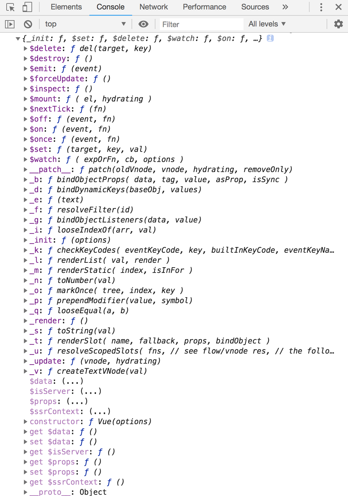
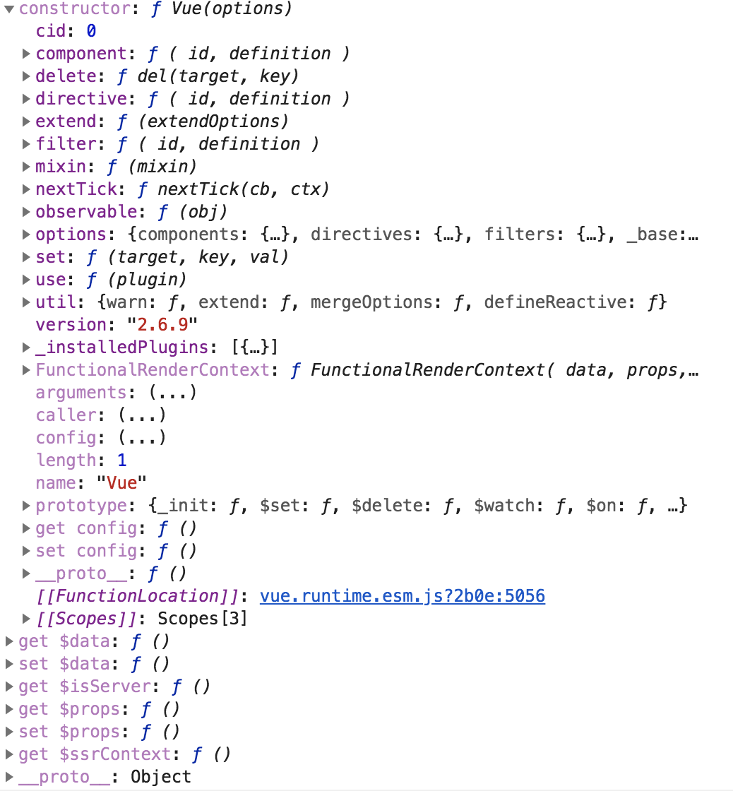

>入口文件就是`vue`的主文件，这里`exprot default Vue` 导出一个 `Vue constructor` 构造函数。

	import Vue from './instance/index'
	import { initGlobalAPI } from './global-api/index'
	import { isServerRendering } from 'core/util/env'
	import { FunctionalRenderContext } from 'core/vdom/create-functional-component'
	
	initGlobalAPI(Vue)
	
	Object.defineProperty(Vue.prototype, '$isServer', {
	  get: isServerRendering
	})
	
	Object.defineProperty(Vue.prototype, '$ssrContext', {
	  get () {
	    /* istanbul ignore next */
	    return this.$vnode && this.$vnode.ssrContext
	  }
	})
	
	// expose FunctionalRenderContext for ssr runtime helper installation
	Object.defineProperty(Vue, 'FunctionalRenderContext', {
	  value: FunctionalRenderContext
	})
	
	Vue.version = '__VERSION__'
	
	export default Vue

>当你在浏览器控制台打印 `console.log(Vue.prototype)`, 大概会看到Vue的所有方法属性：

>入口文件这里引用了 `src/core/instance/index` vue 接口， init全局的方法，定义`$isServer`、`$ssrContext `、`$FunctionalRenderContext `等关于服务端渲染的ssr属性。

接下来让我们看看 `./instance/index` vue的原本构造函数是什么样子的：

	import { initMixin } from './init'
	import { stateMixin } from './state'
	import { renderMixin } from './render'
	import { eventsMixin } from './events'
	import { lifecycleMixin } from './lifecycle'
	import { warn } from '../util/index'
	
	//注意：这里声明 只能使用 `new Vue(）`去调用，否则触发警告
	function Vue (options) {
	  if (process.env.NODE_ENV !== 'production' &&
	    !(this instanceof Vue)
	  ) {
	    warn('Vue is a constructor and should be called with the `new` keyword')
	  }
	  this._init(options)
	}
	
	//构造函数调用的 this._init(options) 来源于此
	initMixin(Vue)
	
	//这里定义了 $set $delete $watch 并且声明$props readOnly, $data不能在root被替换
	stateMixin(Vue)
	
	//Event: $on $off $once $emit
	eventsMixin(Vue)
	
	//生命周期方法 _update $forceUpdate $destory
	lifecycleMixin(Vue)
	
	//$nextTick, _render 等多个内部调用的方法
	renderMixin(Vue)
	
	export default Vue

>再让我们看下 `initGlobalAPI` 方法：
>

	/* @flow */
	
	import config from '../config'
	import { initUse } from './use'
	import { initMixin } from './mixin'
	import { initExtend } from './extend'
	import { initAssetRegisters } from './assets'
	import { set, del } from '../observer/index'
	import { ASSET_TYPES } from 'shared/constants'
	import builtInComponents from '../components/index'
	import { observe } from 'core/observer/index'
	
	import {
	  warn,
	  extend,
	  nextTick,
	  mergeOptions,
	  defineReactive
	} from '../util/index'
	
	export function initGlobalAPI (Vue: GlobalAPI) {
	  // config
	  const configDef = {}
	  configDef.get = () => config
	  if (process.env.NODE_ENV !== 'production') {
	    configDef.set = () => {
	      warn(
	        'Do not replace the Vue.config object, set individual fields instead.'
	      )
	    }
	  }
	  Object.defineProperty(Vue, 'config', configDef)
	
	  // exposed util methods.
	  // NOTE: these are not considered part of the public API - avoid relying on
	  // them unless you are aware of the risk.
	  Vue.util = {
	    warn,
	    extend,
	    mergeOptions,
	    defineReactive
	  }
	
	  Vue.set = set
	  Vue.delete = del
	  Vue.nextTick = nextTick
	
	  // 2.6 explicit observable API
	  Vue.observable = <T>(obj: T): T => {
	    observe(obj)
	    return obj
	  }
	
	  Vue.options = Object.create(null)
	  ASSET_TYPES.forEach(type => {
	    Vue.options[type + 's'] = Object.create(null)
	  })
	
	  // this is used to identify the "base" constructor to extend all plain-object
	  // components with in Weex's multi-instance scenarios.
	  Vue.options._base = Vue
	
	  extend(Vue.options.components, builtInComponents)
	
	
	  //Vue.use()
	  initUse(Vue)
	  
	  //Vue.mixin()
	  initMixin(Vue)
	  
	  //Vue.extend()
	  initExtend(Vue)
	  
	  //Vue.component | Vue.filter | Vue.directive
	  initAssetRegisters(Vue)
	}

这里大概讲，我们不可能用 `Vue.config = {}` 去直接重置config，必须用单独的field 去重置默认参数， 如 `Vue.config.productionTip = false`. 还定义了构造函数内部的一些静态方法如 `set \ delete \ nextTick \ observable \ util(方法集合)`。还暴露了一些公共api, 如 `Vue.use() | Vue.mixin() | Vue.extend() | Vue.component | Vue.filter | Vue.directive`

接下来，我们将以一个examle,来看 Vue 从创建对象 ，到挂载，到修改都经历来什么样子的过程：

[举例说明vue整个生命周期](./举例说明vue整个生命周期.md)

