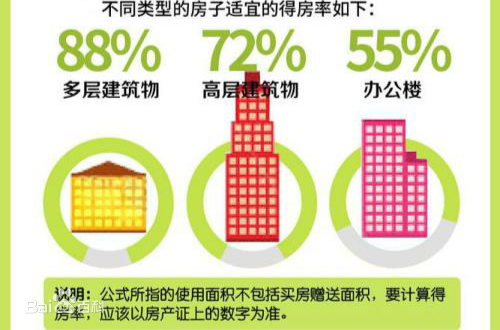
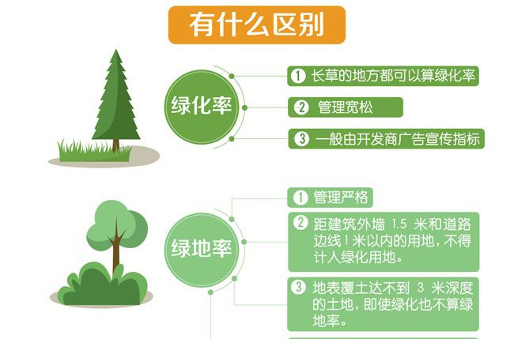
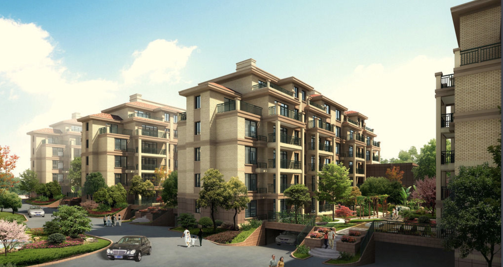
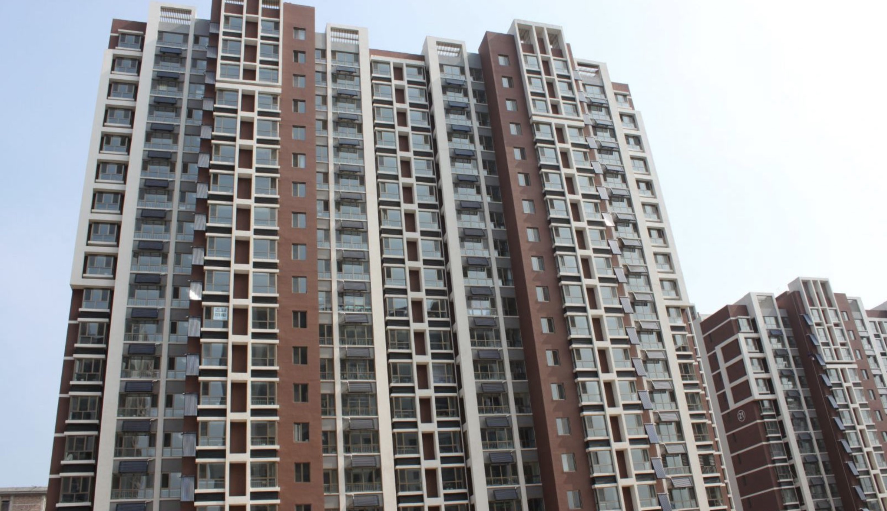
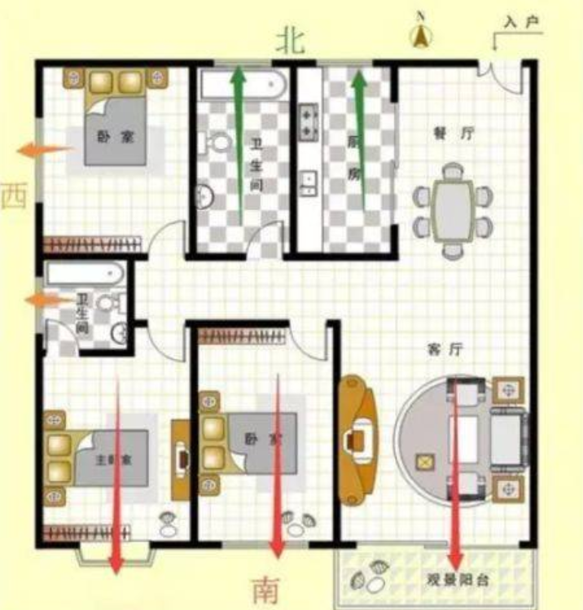
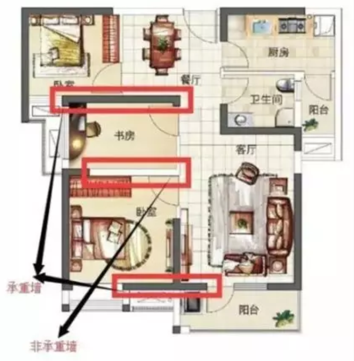
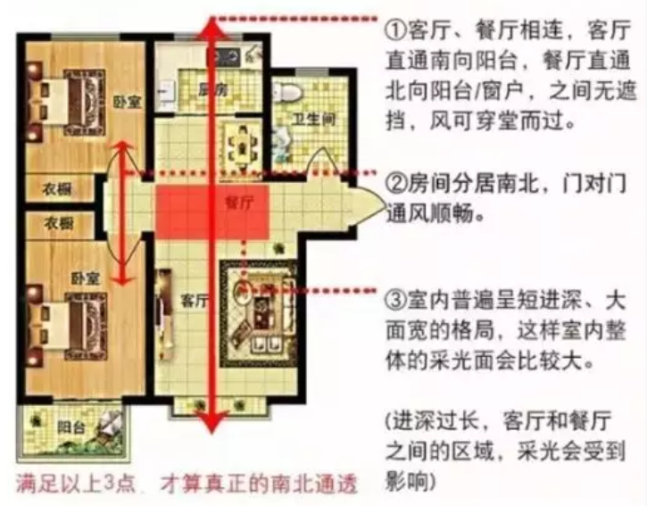
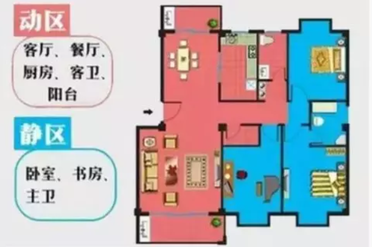
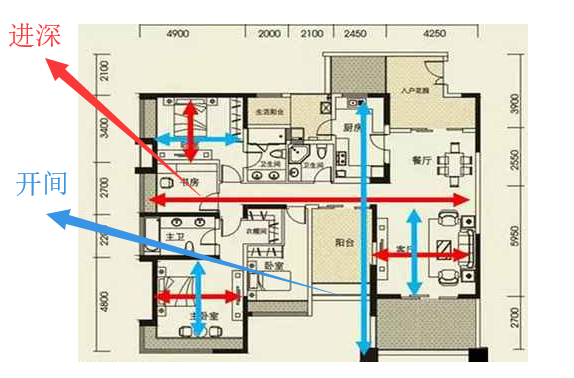

### 买房必问的几大问题：

[TOC]

#### 1、得房率

> 得房率是套内可供住户支配、使用的建筑面积（不包括墙体、管道井等部分面积）与销售面积（建筑面积）的比率

得房率是指可供住户支配的建筑面积与每户建筑面积之比。一般多层的建筑物得房率为`88%`，高层的建筑物得房率为`72%`，而办公楼为`55%`

**计算方法**

> `得房率`=`套内建筑面积`/`套型建筑面积`
>
> `套内建筑面积`=`套内使用面积`+`套内墙体面积`+`阳台面积`
>
> `销售面积`（也称套型建筑面积）=`套内建筑面积` +分摊的[公用建筑面积](https://baike.baidu.com/item/公用建筑面积)（俗说“[公摊面积](https://baike.baidu.com/item/公摊面积)”）

`得房率`是买房比较重要的一个指标。计算房屋面积时，计算的是建筑面积，所以得房率太低，不实惠；太高，不方便。因为得房率越高，公共部分的面积就越少，住户也会感到压抑。一般，得房率在==80%==左右比较合适，公共部分既宽敞气派，分摊的面积也不会太多，比较实惠




**影响因素**

`公摊面积`包括两部分，其一是[电梯井](https://baike.baidu.com/item/电梯井)、楼梯间、垃圾道、变电室以及其他功能上为整栋建筑服务的公用用房和管理用房建筑面积。其二是套（单元）与公用建筑空间之间的分隔墙以及[外墙](https://baike.baidu.com/item/外墙)（包括[山墙](https://baike.baidu.com/item/山墙)）墙体水平[投影面积](https://baike.baidu.com/item/投影面积)的一半。 具体说来主要体现在几个方面：

> ①房型结构（几梯几户）。例如一梯多户可能与一梯二户需要分摊的公用面积相差无几，可户数增加了，总套内建筑面积增加了，则每户需要分摊的公用面积就会减小。

> ②楼盘形态。一般来说高层得房率最低，小高层次之，多层则得房率较高。

> ③物业类型。一般来说板式得房率最高，叠式次之，[点式](https://baike.baidu.com/item/点式)则较低。

> ④公共活动区域大小。一般来说，高品质的物业多建有高挑大堂，宽敞电梯、室内车库，这些都会占用到大量公摊面积，故得房率相对较低。

> ⑤何种面积不算做公摊面积？
>
> 车库、会所等具备独立使用功能的空间；售楼单位自营、自用的房屋；为多栋房屋服务的警卫室、管理用房、设备房等

#### 2、绿化率

> 绿化率没有法律和法规依据。规范中用绿地率，是指绿化用地面积与总用地面积之比；而与之相近的绿化覆盖率是指绿化[垂直投影面积](https://baike.baidu.com/item/垂直投影面积)之和与总用地面积的比率，这是两个不同的概念

**概念**

> 项目规划[建设用地](https://baike.baidu.com/item/建设用地)范围内的绿化面积与规划建设[用地面积](https://baike.baidu.com/item/用地面积)之比。`绿化率只是开发商宣传楼盘绿化时用的概念，并没有法律和法规依据`。

> 法律法规中明确规定的衡量楼盘绿化状况的国家标准是[绿地率](https://baike.baidu.com/item/绿地率)， 绿地率是指小区用地范围内各类绿地的总和与小区用地的比率,主要包括公共绿地、[宅旁绿地](https://baike.baidu.com/item/宅旁绿地)、配套公建所属绿地和道路绿地等，其计算要比绿化率严格很多

**绿化率 ！= 绿地率**

> ==绿地率==和==绿化覆盖率==是两个不同概念的用语，绿地率与绿化覆盖率都是衡量居住区绿化状况的经济技术指标，但绿地率不等同于绿化覆盖率，二者的区别主要是对“居住区用地范围内各类绿地”这一概念的不同理解上。

> ==绿地率==是规划指标，描述的是居住区用地范围内各类绿地的总和与居住区用地的比率（%）。绿化覆盖率是绿化垂直投影面积之和与占地面积的百分比，比如一棵树的影子很大，但它的占地面积是很小的，两者的具体技术指标是不相同的。

> 在计算绿地率时，对绿地的要求非常严格，并不是所有长草的地方都能算做绿地率。绿地率所指的“居住区用地范围内各类绿地”主要包括公共绿地、宅旁绿地等。其中，公共绿地，又包括居住区公园、小游园、组团绿地及其他的一些块状、带状化公共绿地。而宅旁绿地等庭院绿化的用地面积，在设计计算时也要求距==建筑外墙1.5米和道路边线1米以内的用地，不得计入绿化用地==。此外，还有几种情况也不能计入绿地率的绿化面积，如地下车库、化粪池。==这些设施的地表覆土一般达不到3米的深度，在上面种植大型乔木，成活率较低，所以计算绿地率时不能计入“居住区用地范围内各类绿化”中==；而屋顶绿化等装饰性绿化地，按当前国家的技术规范，也算正式绿地。

> 在房地产开发过程中，政府相关部门在最初项目规划要求的就是绿地率这一指标。因此，买房除了对==地税、户型设计的挑选==外，还要关注“三率”，即==容积率、绿化率、房屋使用率==。对于发展商来说，容积率决定地价成本在房屋中占的比例；而对于住户来说，容积率直接涉及到居住的舒适度。绿化率也是如此，绿化率较高，建筑密度较低，发展商可用于回收资金的面积就越少，而住户就越舒服。这两个比例决定了这个项目是从人的居住需求角度，还是从纯粹赚钱的角度来设计一个。

> ==绿化覆盖率是指绿化垂直投影面积之和小区用地的比率。像地下车库这样大面积的底下设施，它的地表虽然种不了树，但可以种草==；像距建筑外墙 1.5 米这样的范围，虽然不算正式绿地，但若能种一些草，总比地砖铺砌更吸引人……在小区规划设计中，计算绿化覆盖率所指的绿地，简单地说，就是有块草皮便可以计入，如树的影子、露天停车场可以中间种草的方砖都可算入绿化覆盖率，所以绿化覆盖率有时能做到60%以上。==在开发商销售楼盘的时候，开发商当然喜欢引用绿化覆盖率的概念，甚至是在售楼书上印制出“绿化率”一词，其实这是不准确、不规范的用词，国家有关园林绿化用语根本就没有这个用语，准确的只有“绿地率”和“绿化覆盖率”两种说法。购房人要注意房地产商在销售楼盘时宣传的绿化率实际不少是绿化覆盖率==



#### 3、容积率


> 容积率（Plot Ratio/Floor Area Ratio/Volume Fraction）是指一个小区的地上总建筑面积与净用地面积的比率。又称建筑面积毛密度。对于开发商来说，容积率决定地价成本在房屋中占的比例，而对于住户来说，容积率直接涉及到居住的舒适度。
>
> 一个良好的居住小区，==高层住宅容积率应不超过5，多层住宅应不超过3，绿地率应不低于30%==。但由于受土地成本的限制，并不是所有项目都能做得到;

> 容积率是衡量建设用地使用强度的一项重要指标。容积率的值是无量纲的比值，通常==以地块面积为1，地块内地上建筑物的总建筑面积对地块面积的倍数，即为容积率的值==

举例：

> 在面积为100平方米的地块上建房，每层建筑面积100平方米，建2层，总建筑面积200平方米，容积率就是2.0；如果建3层，每层建筑面积50平方米，总建筑面积150平方米，容积率就是1.5，依次类推。
>
> 总用地面积10万平方米，总建筑面积8万平方米，容积率为0.8
>
> 总用地面积10万平方米，总建筑面积10万平方米，容积率为1

提示：

> ==容积率越低，居民的舒适度越高，反之则舒适度越低==

> ==容积率超过5就不建议购买了==

容积率的规定：

>现行城市规划法规体系下编制的各类居住用地的控制性详细规划，一般而言，容积率分为：

>独立别墅为0.2~0.5,

>联排别墅为0.4~0.7,

>6层以下多层住宅为0.8~1.2,

>11层小高层住宅为==1.5~2.0==,

>18层高层住宅为1.8~2.5,

>19层以上住宅为==2.4~4.5==,

>住宅小区容积率小于1.0的，为非普通住宅

**关于选购楼盘类型扩展知识：**

> 多层住宅一般指==六层及以下的小区==，多数户型为东西两户



> ==十层及以上住宅为高层住宅==




> ==大量的有毒气体和可吸入颗粒物主要集中在离地表层20米以上的空中==;
>
> 现代科学表明，人类的住宅建筑结构应当在20米以下，这有利于能源的节约和人类寿命的延长;
>
> ==人类最佳的居住空间是离地面20米（最好为10米）以内==。对于可吸入颗粒物来说，离地面越近可吸入颗粒物的直径越大，否则越小；可吸入颗粒物的直径越大人体吸入的数量就越少;
>
> 注意观察景观，尤其是在挑选顶层或较高楼层时，不仅要特别注意==朝向景观==，还要考虑周边地区未来规划，如果您现在风景不错的窗前还要再建几幢高楼，风景将会被遮挡;
>
> 向发展商咨询楼层的==供水、水压、夏季是否会断水==等多方面情况。一般高层住宅在顶层都建有水箱，先将水抽到顶层再往下供，使高层住户不会因==压力不足用不上水==;
>
> 注意整幢楼的总户数与电梯数量，电梯的质量与运行速度也很重要。一般情况下，==24层以上住宅都就需要配备3部电梯==；
>
> 高层物业管理不能忽视，尤其是监控保安措施。大楼底层==是否设置值班警卫室==，是否有保安在楼内巡视；
>
> 考虑==车位问题==。在购房时，即使是目前无车的住户也应做好提前打算，因为未来很有可能车位比房价还贵；

==高层的缺点：==

> 每年夏季，高层建筑暴露在炎炎烈日之下，强烈的阳光辐射使建筑物的墙面温度达到数十度，从而导致室内温度不断上升，超过了人类生存能够适应的温度。人们为了降低室内温度，利用风扇、空调等设备降温，把室内的高温气体排到室外。此时，室外的温度会随之升高。恶性循环的温差效应造成了巨大的电能浪费。
>
> 冬季，由于太阳光照射的距离加长，地表温度下降，高层住宅的室内温度将低于低层住宅的室内温度。这是由于地球表面在白天接受阳光的照射，其地球表面的温度增高，而温度随着空间高度的不断增加而下降。也就是说，低层建筑的室内温度高于高层建筑的室内温度。冬季取暖采用的是电加热以及燃煤的方式，楼层越高消耗的能量就越大。因此对于人类来说，高层建筑是一种弊大于利的住宅结构;

==高容积率的缺点：==

> 高容积率的住宅项目意味着小区内房子建得多，而高容积率的住宅必定会带来高密度的居住人口，最终导致小区中业主的生活舒适度下降。另外，高密度的居住人口还会对小区内的健身场所、儿童活动区域、娱乐中心以及楼宇内的电梯、消防通道形成比较大的压力;

>由于高容积率住宅对土地使用率的过分追求，小区内的楼层会比较高、==绿地==的比例也会相应的减少，从而影响居住区内的生活环境与品质。另外，楼间距过近、小区内道路狭窄、==停车位置不足==也是高容积率小区经常遇到的问题;

>由于居住密度大，所以出入的人会较多，外来人员混入其中的难度也会相应地降低很多。这就对高容积率住宅的安防系统提出了更高的要求。所以高容积率的住宅安防系统一定要跟上(当然这不是说低容积率的小区安防就不重要)，不仅要加大监控设备的密度，而且也需要更多的巡逻人员来保证住户的安全;

#### 4、户型

房屋朝向指房屋各个功能分布，比如客厅、卧室、厨房、餐厅、卫生间等的朝向。如下图：




**一般来说：**

~~~

朝南的房屋采光充足，具有冬暖夏凉的特点；

东南朝向的房屋采光相对来说比较好，然而通风却一般；

东朝向的房屋采光是较好，但是通风比较差；

西南朝向的房屋采光比较好，只是有一定西晒的困扰；

北朝向房屋的采光是差的，但是夏日会感觉比较凉爽，不过冬季则会较阴冷；

西朝向的房屋采光时间比较短，夏日午后室内会出现暴晒的情况。

**户型动线**

户型动线包括居住动线、来客动线、家务动线。3条动线之间交叉的部分越少越好，尽量避免不想打扰。

居住动线：主要涉及的区域有卧室、书房、卫生间。

来客动线：主要涉及的区域有客厅、餐厅、公共卫生间。

家务动线：主要涉及的区域有厨房、卫生间、阳台等做家务、洗晒衣物的地方。

~~~


**承重墙和非承重墙**

~~~
一般来说，承重墙不可拆，非承重墙可拆。

但像厨房、卫生间等这些区域的非承重墙墙体可能涉及到水路管道、电路以及防水等，不可随意拆除。

如果买房时想要对户型加以改造，那么就一定要在看户型图或样板间的时候留意承重墙和非承重墙的位置，以及非承重墙是否易于拆除。
~~~



**南北通透**

并不是南北都有窗就叫南北通透，要看窗户之间是否能形成对流。

真正的南北通透需要满足以下3个条件：



```
一般来说，客厅的阳台能够和厨房的窗户或者餐厅的窗户之间形成对流，就算南北通透。

全明户型

全明户型指的是各个功能分区，如卧室、客厅、厨房、卫生间都有窗户，均可以自然采光。

全明户型不一定要求南北通透，即使全朝南的房子，也可以做到全明。
```


**开间和进深**

```
开间指户型东西之间的距离。

进深指户型南北之间的距离。

开间太小，进深过大，则房屋的采光不好，影响房屋的采光通风效果；

开间过大，进深太小，采光通风非常好，但容易让室内的温度、湿度不稳定。

开间和进深的比例为4:6较为合适。（即开间如果为4米，则进深为6米比较合适。）
```


**动静分区**

```
户型的动静分区指的是客厅、厨房、餐厅等主要用来供人活动的场所与卧室、书房等需要安静的场所分开，并且互不干扰。
```



**采光通风**

影响户型采光通风的因素有户型的朝向、开间与进深比例、窗户的数量及大小、周边因素的遮挡（如建筑物、相邻户型的遮挡）等。

因此，判断房型采光时，还要看看户型的楼层平面图，看所选户型是否处于凹槽内，采光是否受到影响。

#### 5、进深

惯上，我们把房间的主采光面成为==开间（面宽），与其垂直的称为进深。也可根据房间门的朝向来确定开间和进深，房门进入的方向的距离为进深，左右两边距离为开间。根据《住宅建筑模数协调标准》（GBJ100-87）规定：住宅建筑的开间常采用下列参数：2.1米、2.4米、2.7米、3.0米、3.3米、3.6米、3.9米、 4.2米==。（卧室以床顺着摆放的方向为开间，床头依靠的墙宽度为“进深”，卧室内布置床时，床头一般不靠窗台摆放）




一般意义上的户型方正就是指户型的进深与开间之比合理。进深与开间之比一般介于1：1.5之间较好。进深过大，开间过小，会影响户型采光通风，房间内会显得比较暗；而进深偏小，开间过大不利于房间保温，浪费能源，北方尤其如此。比较方正的户型能做到采光通风与保温两者间的平衡。

所以，进深和面宽到底多大合理是没有统一的答案，不同楼型、不同户型，进深和面宽的设计思路不一样，主要还是看具体户型的分布。为了保证住宅具有良好的天然采光和通风条件，从理论上讲，住宅的进深不宜过大。

对一个单独的房间来讲，当然是面宽越宽、进深越短越好，因为目前除了别墅能够做到四面都有窗户采光、或者双拼别墅能够做到三面采光，一般的普通住宅只有两面或者一面可以采光，对这种住宅来讲，当然是采光面越大越好。


1、==板楼（多层住宅）==的进深12.5米比较合理

南北通透的板式住宅楼为了避免黑房间，包括客厅和餐厅在内的起居室的进深在12.5米左右比较合理，进深超过15米，中间就会有黑厅。

2、卧室和书房的进深在6米左右比较合理

超过7米就显过于狭长。如果一个房间的进深是12.5米，实际就是两个6米长的房间长度。如果进深是15米，可能就是两个6米长的房间，中间夹着一个卫生间，这个卫生间可能没有办法采光，会是个黑房间。

3、==塔楼（高层住宅）==进深各异宜设“采光槽”

塔式住宅楼一梯从4户到6户、8户不等，甚至有的塔楼是一梯十几户，大多数房间肯定不能做到南北都有窗户，可能只有一个方向采光。而且因为塔楼的楼型特点，有的房间进深大一些，所以，在塔楼的楼型设计中，会有一些“槽”，外墙很曲折，形成一些采光井、采光槽，使塔楼里的房间采光面更多，这些采光井和采光槽同时也使单个房间的进深似乎变短了。

==塔楼户型==中，每个房间进深的方向不同，有的是南北向，有的是东西向，而且每个房间进深的长度也不同，这取决于几个因素：一栋塔楼里总共设计了多少套住宅、每套住宅面积多大、在这个塔楼中设计了几处采光井或采光槽、采光井或者采光槽是怎么开的，等等。

对塔楼来讲，进深的设计比较复杂，因此，在买塔楼住宅时，一定注意看清要购买的住宅里，有没有黑房间。在一些住宅楼中，有的面积较大的户型，为了气派，会设计一个进深大、面宽大的客厅，如果是南北通透，朝南的一定是客厅，朝北的一定是餐厅，中间可以安放一个小型会客厅

--------------------------


**一个好的户型，除了户型方正外，还有其他一些原则，主要有：**

1.动静分区

2.干湿分区

3.公私分区

4.通透良好

5.动线合理

6.尺寸合理


**1.动静分区**

动区：客厅、餐厅、厨房、次卫等。

静区：卧室、书房、主卫等。

动区是人们活动较为频繁的区域，应该靠近入户门设置，尤其是厨房；而静区主要供居住者休息，相对比较安静，应当尽量布置在户型内侧。两者分离，一方面使会客、娱乐或者进行家务的人能够放心活动，另一方面也不会过多打扰休息、学习的人，减少相互之间的干扰。

动静分区合理户型（卧室布置在户型深侧，距离入户门较远）

**2.干湿分区**

干湿分区是指厨房、卫生间这两个湿气较重且较容易产生脏污的房间应与精心装修的怕水怕脏的卧室等尽量分离。厨房是家居生活中最主要的污染源，噪声、油烟油污、清洗污水等集中于此，因此厨房的布置要尽可能的靠近进户门，远离卧室、客厅；其次厨房与卫生间是住宅中水管的集中地，从施工成本、能源利用、热水器安装等角度考虑，厨房应与一个卫生间贴邻而处。目前市面上的大部分户型还是考虑到了干湿分区，厨房一般也是设置在入户门最近的位置，但仍有少量灾难级户型，户型完全没有考虑厨房应当如何合理布置。

**3.公私分区**

户型具有私密性的要求，能够适当保护居住者隐私。户型的私密性主要需做到两点：首先在入户门外向户型内望去时，玄关处应当有所遮挡，避免站在门外就能对屋内一览无余；其次是户型内部客厅、餐厅等公共活动空间与卧室等较为私密的空间有视觉上的遮挡，避免在公共区间就能对私密空间一览无余，做到一定程度的“公私分区”。

**4.通透良好**

通透性主要是指户型的通风和采光性能。要保证户型具有良好的通透性能，首先要求户型要有良好的进深开间比，即户型比较方正；其次户型最好有两面可以采光和通风，相对两面采光通风最佳（如南北、东西），其次是相邻两面采光（如东和南、南和西、西和北等），只有一面采光通风效果最差。另外厨房厕所是湿气比较重的两个区域，要尽量做到独立采光通风，也就是避免暗厨暗卫。

**5.动线合理**

动线是指人们在户内活动的路线，动线流畅与否将影响人们进行各种活动时能否实现顺利转换。户型的设计影响到动线的走向，而动线的走向会影响到居住的品质。好的动线能够提升小户型利用率，而差的动线会使大户型变得“大而无当”，浪费空间。户内主要动线有三类，分别是居住动线、家务动线、来客动线。

动线良好（从入户门进客厅、卧室、厨房的三条条线不会交叉)。

#### 6、**买房须知的常识**

1、查看五证，所谓五证就是指《国有土地使用证》、《建筑用地规划许可证》、《[建筑工程](http://www.fang.com/juhe/31651/)规划许可证》、《建筑工程施工许可证》和《商品房预售许可证》。

2、买房其实选择口碑好的开发商很有必要。一般好的开发商资质高、资金充足。开

3、评估购房能力，对于刚需族来说，由于他们的经济能力有限，所以都会采取贷款的方式买房。而贷款每个月需要交一定数额的月供，为了保证生活质量不受影响，避免断供的风险，小编建议月供的数额最好控制在总收入的50%以内。

4、选[户型](http://www.fang.com/juhe/31520/)，挑选户型时，首先要看户型的朝向。朝向优劣的顺序依次为：正南、东南、东、西南、北、西。

5、选楼层，中间层房屋的空气质量相较于低层更好，出行较高层更方便，可以说是折中。

6、很多购房者认为，当下房价过高，所以买房时，一般会在同等区域、同等地段选择价位便宜的楼盘。正确的做法是多学习选房知识，关注户型好坏，房屋质量等干货。

7、看优惠，对于开发商给出的优惠，要多打听，多分析，多判断，不要盲目追风。

8、莫心急，年轻人置业时，不宜好大喜贵，应抛弃置业必须一步到位的思想，根据自身所能承受的范围，作出合理的决策。

9、不可一味买大，看房一定要综合考虑，不可片面。首先是面积，面积以适用为原则，不可为大而大。


10、看规划，买房当然要挑楼盘，挑小区，挑户型，但是也不能只看房子，还要看房子的位置。毕竟，决定房子价值最大的因素便是地段，建议在购置房产时，要切记紧跟城市发展的方向。

11、看价格，价格挑选比较个人承受范围、交通状况、社区环境、户型结构等条件衡量楼盘价格。

12、小区环境，小区景观、绿化、配套等与生活密切相关，更是楼盘质量的体现。

13、避免极端层，顶层和底层不建议买，底层不仅容易潮湿，发霉，滋生蚊子，光线也不好，顶层一到大夏天，不仅闷热，不透气，还容易漏水。

14、远离设备层，设备层是专门供水，供电的中间楼层，要是常年居住在设备层的附近的话，不仅机器设备的噪音把人折磨得无法休息，连机器的辐射也会影响人的身体健康。

15、物业，不同的[物业公司](http://www.fang.com/juhe/32796/)所做的服务千差万别，物业公司能否尽善尽美地完成自己的任务牵扯到小区的整体质量。

16、考虑孩子问题，买地产要考虑孩子路上的安全问题，尽量选择距离近的房子。这样可以给孩子节约大量的时间，让孩子有充裕的时间学习和休息。

17、购房定金，定金对买受人是极为不利的，使买受人在签约的时候处于不利的境地，买受人往往在定金不退的压力下，违心地接受开发商的不平等条款。

18、签[认购](http://www.fang.com/juhe/32316/)书，认购书基本条款要约定详细，对所要购买的房屋的主要情况在认购书中予以约定。条款内容约定要合法有效，要求开发商提供作为正式签约的商品房买卖合同文本。

以上就是关于买房须知的18个常识以及新手买房注意哪些坑的介绍了，其实买房的过程中要细细说来的话，注意事项和常识性的问题可不止这18个，如果有自己亲手办理过买房手续，那就一定清楚买房流程的复杂性，在办理房屋买卖手续的过程中最重要的还是要自己小心谨慎一些

-------

 **哪些楼盘不能买？准确判断楼盘利弊做决定**

**一、看开发商：不良开发商的房屋不能买**

经常会有人这样建议：买房子一定要选大开发商。从现实情况来看，同一地段大开发商的房价也是要比小开发商贵一点的。这是因为大开发商在品牌实力、施工质量、配套设施等方面都更有保障。当然，买大开发商的房子，付出的成本更高，需要量力而为。但无论大开发商还是小开发商都应当选择正规的、五证齐全的。

而一些不良开发商在开发完[房产](http://www.fang.com/juhe/31310/)后，遇到销售业绩不佳，会直接把项目转让他人，自己却抽身走人。这样的开发商不仅口碑不好，如果房子出现问题，购房者都找不到人，居住生活没有保证。

**二、看媒体报道：“负面”楼盘不要买**

烂尾楼应该是购房者很害怕遇到的情况，出现之后购房者往往面临维权艰难的困境。随着网络的日益发达，购房者对于楼盘的信息了解的途径也逐渐增多，因此购房者可以透过网络或媒体的报道提前获取房屋各类信息。对于一些负面新闻很多的楼盘，购房者应该精挑细选，谨慎购买。而对于有漏水、外墙脱落、墙体开裂等质量问题的房屋，购房者也不要购买，以免影响生活。

**三、看土地前身：有问题的房屋不要买**

什么是土地前身不好呢？常见的“不好的土地前身”主要是指化工厂和坟场。由于化工厂污染极大，遗留下的土壤含磷、硫和硫化钠污泥，对居住者的身体健康是不利的。土地前身为坟场主要影响购房者的心理，这就看购房者的心态。

**四、看楼盘环境：治安不好的房屋不要买**

楼盘的治安情况不稳会对居住者的人身安全造成隐患。而如何看治安环境呢？主要看周边是否有破破烂烂的民房、色情场所、垃圾堆、停满黑车等等。

**五、看污染情况：临近污染源的房子不要买**

噪音、灰尘、尾气污染等一系列问题会严重影响到居住者的日常起居。因此在选房时，要注意观察楼盘附近是否有污染源。

一般而言如楼盘距离高架桥、厂房、轨道交通过近会产生受污染严重。高架桥旁边的房屋和距离轨道交通过近的房屋存在噪音、灰尘、尾气污染等一系列问题。厂房附近房屋不仅污染严重，而且存在安全隐患。

------

 **如何准确判断房价涨跌？五招即可轻松判断**

**一、分析地价走势**

熟知楼市的人都知道，土地与房子的关系就跟面粉与面包的关系一样，为什么一样？即面粉贵了，面包自然也会涨价。因此要判断房价走势，不妨先分析一下地价走势，如果你看到地价呈走高[趋势](http://www.fang.com/juhe/32291/)，那么房价的大概率也是有可能会上涨的。

**二、观察人口流动**

对于楼市而言，供需关系一直都是决定价格的一大因素。当楼市库存一定的情况下，购房者越多，那么房价就会越高，因此要判断房价走势，不妨先观察一下人口流动情况，如果当地人口呈净流入趋势，那么房价很有可能要上涨了。

总的来说就是，人口流动直接反映了这个城市未来发展前景，也决定了该城市的房价走势。某城市人口流入量大，意味着该城市对于人才具有较大的吸引力，该城市发展势头良好、前景可观，房子涨价的空间大，而人口大量流入也意味着给该城市[房地产](http://www.fang.com/juhe/31324/)市场带来了大量的需求。

一线城市房价居高不下的一个重要原因就是外来人口的大量流入，房子是外来人口在新城市立足的基础，房[地产](http://www.fang.com/juhe/31154/)市场供不应求，房价上涨合情合理。反之，如果该城市人口净流失量大，该城市经济发展必然不景气，[房价下跌](http://www.fang.com/juhe/116/)可以预见。

**三、银行网点多少**

在通常情况下，银行网点的数量是由当地居民的收入情况来决定的。也就是说，当当地居民收入较多时，那么他们的理财意愿就会比较强烈，而银行自然就会多开网点。

换言之，当银行网点比较多的时候，就意味着当地居民收入比较多，那么此时买房的人也就会增加，而房价自然也就会上涨了。

**四、城市交通规划**

正所谓“地铁一响，黄金万两”，这是楼市行内的一句俗话，但同时也是正理。如果当地有建设地铁的规划，那么房价必然会迎来一波大涨，而且地铁沿线的房价也将会涨得特别快。

**五、中小房企动向**

一般来说，房企对于房价的敏感性要远高于普通购房者，因此，从房企的动向就可以判断房价的走势。如果房企热衷于在当地建房，那么就意味着他们看到当地的[房地产市场](http://www.fang.com/juhe/795/)，此时房价也就很可能会上涨。

----

 **选大开发商有什么好处？如何挑选好的开发商**

**一、选大开发商有什么好处？**

**1****、质量有保障**

大开发商在资金和资源方面的实力通常比较强大，房子的质量会相对有保证一些。大品牌的开发商有足够的实力为业主提供质量可靠、安全稳固的房屋，有足够的能力为楼盘提供完备的配套设施，还有贴心的物业服务。可以说，从建筑材料的选择，到楼盘的施工，再到后的质量监控，品牌开发商有完善的、科学的一套流程。

**2****、大开发商具前瞻性眼光**

一般情况下，大开发商在买地前都会做相关的调研工作。大品牌开发商都已经有了十几年甚至几十年的开发经验，这一方面的话会比小开发商拥有更加完善和专业的调研团队，并且和政府有过多次合作，可能会比小开发商更早知道政府的布局，知道政策会向哪里倾斜，哪个地段会更有上升的空间。

**3****、物业管理有保障**

由于大开发商的实力比较雄厚，一般情况下[物业公司](http://www.fang.com/juhe/32796/)都是自己的，这样会更加负责、敬业。出了问题保修也更加方便。换做第三方物业，我们则不能将矛头对准他们了，毕竟物业公司是外来户，跟房子质量没有直接关系，他们能做的就是沟通协调。如果再加上几户不交物业费，物业公司或许还会懈怠。

**二、如何挑选好的开发商？**

**1****、搜索网上评价**

现在网络十分发达，购房者在买房前可以上网查询开发商的一些资料，如开发商的发展历史、最新楼盘、拿地情况等等。另外，对于开发商的一些报道也可以多加关注，看看有没有出现过与业主之间的纠纷，尤其要关注开发商对于旗下楼盘出现过的问题的解决办法。

**2****、查询开发商资质等级**

在我国，开发商的一般是分等级的，目前是一级到四级，开发商经营年限、注册资本、建筑质量合格率、开发面积等是定级的标准。一级资质的开发商通常有着一个国企大背景，信誉度高，实力相较于其他几级要强很不少。

-----

**小区买房子风水主要看什么？**

1、首先是看河流和道路，如果有河流和道路弯环抱着楼房为吉，如果有河流或道路的弯弓顶向着楼房，是反弓水不吉，道路或河流笔直地冲来是为箭煞，不吉。

2、看建筑物或山体，后面有高大平整的建筑物或者方、园、尖的秀丽山体做后托为吉，后面低矮或后面零乱、空缺、有尖射、过于逼压等不吉，前方避压、闭塞、有屋箭、屋角等形如凶器的建筑物冲射不吉，前方开旷、景色秀美吉；左边的建筑物高于右边一般为吉，右边的建筑物比左边的高，是有奇形怪状的建筑物一般不吉。

3、看地形地势，楼房不宜建在孤山顶上，不宜建在水体上，建在山脉的脊线上和水体上是不好的选择。不能建在悬崖峭壁的下面等。

4、看周围有没有寺庙、军警部门、火葬场、公墓、监狱、神坛等，阳宅应该远离这类建筑物。总体来说，周围山清水秀，后有高靠，前有秀水，环境整洁优美，没有明显的形煞，[采光](http://www.fang.com/juhe/30597/)通风良好，祥和安静，是为好的环境了。

-----

1、房屋选择不缺角：看房的时候都会有图纸，整体看房规划，不可以有缺角，或者三角形，而是选择正方型或者矩形的房屋。因房屋有天方地圆一说，因此在风水学说上：房屋应方方正正。具体缺哪一角则代表主人缺的运势。这个说来就话长了，有兴趣的可以去看下风水说的细节。

2、入门第一眼：进入一个屋子，除了露天大院，进门后应该看到的大厅。如果房屋设置是厕所或者厨房，那么运势都不会太好。因为厕所即为湿气和浊气所在，厨房则为火旺地，若厕所厨房对立，那更是风水之大忌。水火不容也。因此，看设计图也应明确，进屋第一眼帘应该是温馨宽敞的待客大厅。

3、卧室门对位问题：一卧室门不对正大门，否则将造成偏头痛的产生。二卧室门不对厕所，温气以及浊气重地。三双卧室门不对立，造成穿心，不聚财。看风水者第二会看各房间门的对向，如果双门的对立则相克，即可造成身心不便。

4、横梁压顶之说：这条知识相对于其它是比较常识的，不管是什么房间，都不可横梁压顶，如睡铺上方有横梁，则影响人身体健康，长久以往，将导致重病缠身。如在书屋上有横梁压顶，定造成头痛严重。不利于学习。现在可以通过吊顶的做法将横梁档住。