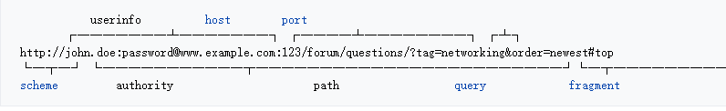
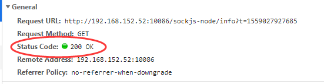

## HTTP

[TOC]

`Hypertext transfer protocol`（简称：`HTTP`）`超文本传输协议`。`HTTP`是`WWW`(world wide web 万维网)在一个`超文本`里面包含`超链接`的数据通信的基础。

`HTTP`的发展起始于1989年被 `Tim Berners-Lee` 在 `CERN `创立。HTTP标准的发展是被`IEIF(Internet Engineering Task Force) `和` W3C (world wide web consortium)`调整，并在提出 `RFCs(request for comments)`后达到了顶点。

`HTTP`的第一个修订版`HTTP/1.1`,在1997被广泛应用，不过 在 1999 年被 `RFC 2616`废弃，之后在2014年又出现了 `RFC 7230`；

稍后，在2015年，提出了 继任者HTTP/2（之后的继任者是HTTP/3, 建立在 HTTP/2之上）,现在被大部分主要的web服务器和浏览器通过 `TSL(Transport Layer Security 传输层安全协议) `使用` ALPN (Application-Layer Protocol Negotiation 应用层协议协商)`扩展支持的。

### 1、技术介绍

`HTTP`方法作为一个`请求-响应`在`客户端-服务器`计算模式。举例，比如一个`web浏览器`,或者是一个`客户端`或`应用程序`运行在拥有网站域名的`电脑主机上`。客户端发起一个 `HTTP request` 请求，提供资源比如 HTML或者其他资源或代表客户机执行其他行为的`一个服务器`，返回一个`response message`响应的消息给客户端。返回的`响应信息`包含了请求的完整信息状态和或许会包含`请求的内容`。

浏览器就是一个用户代理（`user agent 简称 UA`)。其他的用户代理包括，搜索提供服务的索引浏览器（web爬虫），语音浏览器，移动`apps`和其他软件，访问、消耗或者展示 网页内容。

HTTP被设计去允许网络中间件元素去提高或者加强客户端和服务器之间的通信。高并发的网站经常受益在那些传递在上层服务器提高响应时间的`web cache(网页缓存)`上。网页浏览器缓存之前获取到的资源然后再减少网络拥堵的时候重复使用这些资源。在私有网络边界的HTTP代理服务器能够促进和通过额外的服务器传递消息的客户端的通信。

`HTTP `是一个设计在`互联网协议套件`（`Internet protocol suite`）里的一个应用层协议。它的定义内容假一个潜在的可靠的`传输层协议`（`transport layer protocol 简称 TLP` ）和 `传输控制协议`（`Transmission Control Protocol 简称 TCP`）被普遍应用。然而，HTTP可以被适用于不可靠额协议比如`用户数据报协议` `（User Dategram Protocol 简称 UDP）`,比如，`HTTPU 通用即用即插` 和`简单的服务发现协议` [(Simple Service  Discovery Protocol 简称 SSDP)](https://en.wikipedia.org/wiki/Simple_Service_Discovery_Protocol)。

HTTP资源利用URLs 统一资源存放器（Uniform Resource Locators）定义和存放在网络上，利用URL‘s（Uniform Resource identifiers）统一资源标识符 http 和 https。比如：包含所有的可选择的组件：

URLs在HTML 文档中被解码为超链接，所以成为了相关联的超文本文档。

HTTP/1.1是在原来HTTP(HTTP/1.0)的一次版本更新，在HTTP/1.0，每一次请求服务器资源，都要单独发一次请求连接。在HTTP/1.1,可以在页面被发布后，重复使用一个请求连接去请求下载图片，脚本和样式表等。

### 2、历史

术语 `hypertext `最早在1985年被` Ted Nelson` 提出，反而在1930年的 `vannevar Bush` 的基于微缩胶卷的信息检索和管理的“`memex`”系统所激励。后来` Berners-Lee `和他的团队发明的最初的`HTTP`, 还有`Html`和相关的网页服务器和基于文本的网页浏览器的相关的技术，终于被认可。

`Broners-lee`在1989年 第一次提出了 “`worldWideWeb`”项目，也就是现在著名的 `World Wide Web`。第一个版本的协议只有一个方法：`GET`, 可以从一个服务器请一个页面，从服务器返回的一直是一个页面。

第一个注明的HTTP版本是 `HTTP V0.9,` `Dave Ragget`t 创建HTTP工作小组(`HTTP WG`)，打算扩大协议扩展业务，扩大谈判，丰富媒体元信息，尝试使用一个安全协议，后来通过增加额外的方法和消息头变得更加有效率。`RFC 1945 `官方介绍和发布认证`HTTP V1.0` 在1996；

`HTTP WG` 打算在1995年12月发布一些新的标准和对基于开发中的` RFC2068`的预标准HTTP/1.1提供支持，并在1996早期就被大部分浏览器开发者适用认可。同年三月，预标准 HTTP/1.1 被大部分浏览器支持。

发展历程：

* `RFC 7230`, HTTP/1.1: Message Syntax and Routing
* `RFC 7231`, HTTP/1.1: Semantics and Content
* `RFC 7232`, HTTP/1.1: Conditional Requests
* `RFC 7233`, HTTP/1.1: Range Requests
* `RFC 7234`, HTTP/1.1: Caching
* `RFC 7235`, HTTP/1.1: Authentication

`HTTP/2` 作为 `RFC 7540` 在2015年五月发布。

| 年份 | HTTP 版本 |
| ---- | --------- |
| 1991 | 0.9       |
| 1996 | 1.0       |
| 1997 | 1.1       |
| 2015 | 2.0       |
| 2018 | 3.0       |

### 3、HTTP session 会话

一个HTTP回话是一系列网络请求-响应失误。一个HTTP客户端通过一个特殊的服务器端口（一般是80，偶尔是8080）建立一个[TCP 连接](https://en.wikipedia.org/wiki/Transmission_Control_Protocol) 。一个HTTP server 监听这个端口等待客户端发出请求信息。一旦是收到请求，服务器返回一个状态码：比如 `“HTTP/1.1 200 OK”`和它自己的消息。此消息的正文一般是请求的资源，或者也许可能是一些错误消息或者其他信息。

#### 3.1 持续连接

在 `HTTP/0.9` 和 `1.0`，每一次单独请求/响应后，连接会被关闭。在 `HTTP/1.`1，一个 `keep-alive-mechanism` 保持存活机制被介绍，多次单个请求可以共用一个连接通道。这样的持续的连接明显地减少请求延迟时间，因为客户端在第一个请求发出去之后不需要重新谈判和T`CP进行三次握手`的连接。一般的，连接因为`TCP`的`slow-start`机制变得更加快速。

#### 3.2 HTTP 会话状态

HTTP是一个`无状态协议`。一个无状态的协议不会要求HTTP 服务器在多个请求中去保存每一个用户的信息或者状态。但是，一些网页应用程序实现状态或者服务器端会话用做`HTTP cookie` 或者隐藏在`网页表单`里的变量。

### 4、HTTP authentication 认证

HTTP 提供多种验证方案如：基本的 `访问验证` 和 `消化访问验证`，通过质问-验证机制凭借服务器标识符和在提供其请求内容之前提出一个质问权限的操作。

**Authentication realms 身份验证领域**

`HTTP`身份验证规范提供了一个任意的，实现指定的构造，用于划分单独的资源到一个公共的给定的`Root URL`; 这个`realm `值是一个字符串，如果存在，一定是和规范的`root URL`结合来保护空间抵抗挑战。在一个根目录下，可以单独定义不同的认证作用域。

### 5、Message format 消息格式

客户端和服务器之间的通信靠发送纯文本消息（ASCII）。客户端发送到服务器，服务器发送响应信息；

#### 5.1 request message 请求消息

请求的消息有以下组成部分：

* 一个 请求命令行 ，比如 （GET /images/logo.png HTTP/1.1）
* 请求头 [request header fields](./List-of-HTTP-header-fields.md)
* 一个空行
* 一个可选择的消息正文

