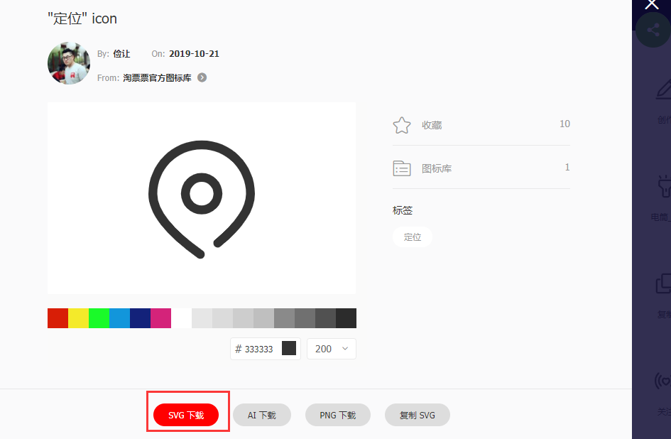
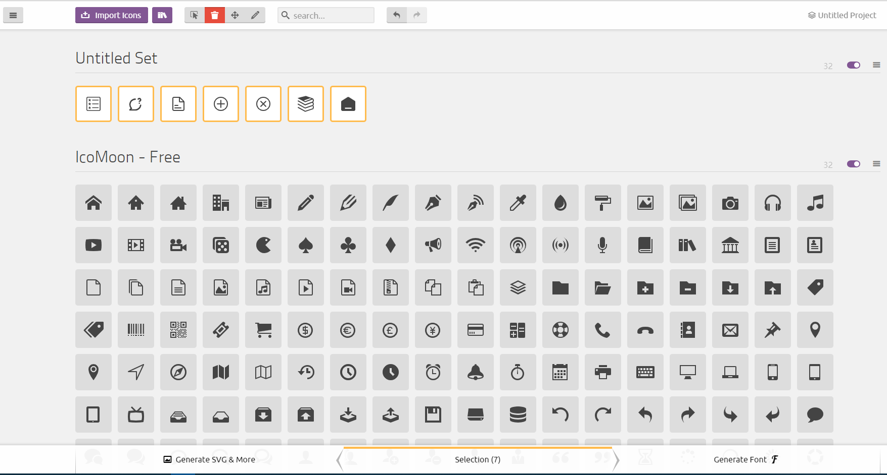
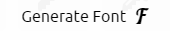
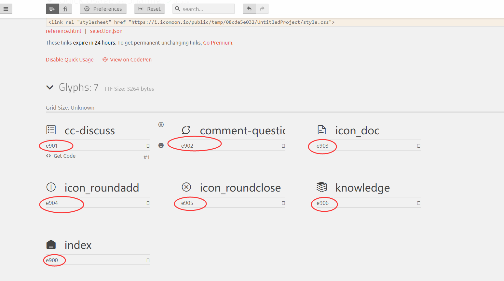
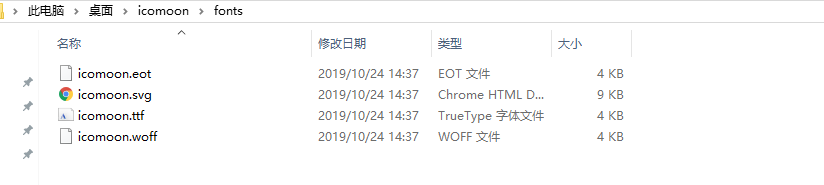
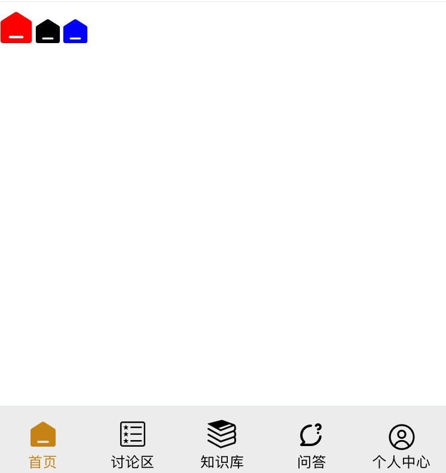

### 三分钟教会你自制IconFont字体图标库

`app`开发的时候，我们大多会用到字体`icon`，下面我们就讲解一下，如何自定义生成 `iconFont`

一般情况，我们优先选择在 [Iconfont-阿里巴巴矢量图标库](https://www.iconfont.cn/collections/index?spm=a313x.7781069.1998910419.4&type=1) 下载我们需要的矢量icon的svg格式, 如果这里没有你需要的icon，也可以自己切图把png格式的图片转化为svg;



#### svg 导入并生成 font

网址：https://icomoon.io/app/#/select 


导入多个`svg`图片



点击右下角



记好每个icon的`code`



然后点击 `download`

如图：



然后我们写 less（或者css），定义这些icon的样式：

```less
@assets: '../assets/fonts';
@version: '?v=1.1.0';

@font-face {
    font-family: 'icomoon';
    /* 自行安装第三方字体图标库 */
    src: url('@{assets}/icomoon.eot@{version}');
    src: url('@{assets}/icomoon.woff@{version}') format('woff'),
    url('@{assets}/icomoon.ttf@{version}') format('truetype'),
    url('@{assets}/icomoon.svg@{version}') format('svg');
    font-weight: normal;
    font-style: normal;
}

/* 根据第三方字体图标库编写 */
/* 举例：fa 就是 prefixClass 的值，下面的的图标 css class 命名都要用 fa- 开头  */
.fa {
    display: inline-block;
    /* 以下的 font 与上面 @font-face 的 font-family 要一致*/
    font: normal normal normal 14px/1 icomoon;
    font-size: inherit;
    text-rendering: auto;
    -webkit-font-smoothing: antialiased;
    -moz-osx-font-smoothing: grayscale;
}

.fa-home:before {
    content: "\e900";
}

.fa-doc:before {
    content: "\e903";
}

.fa-knowledge:before {
    content: "\e906";
}

.fa-discuss:before {
    content: "\e901";
}

.fa-question:before {
    content: "\e902";
}

```

然后就可以把这个less引入到我们的入口文件里面；

调用举例：

```html
<span className="fa fa-home"></span>
/**更改大小和颜色**/
 <span className="fa fa-home" style="font-size:30;color: blue"></span>
```

实际效果：



