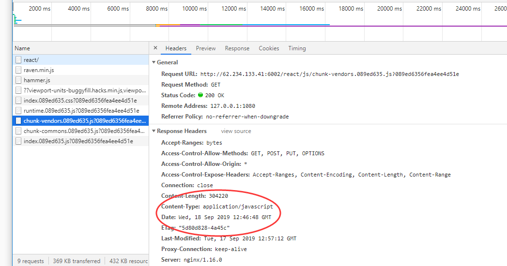
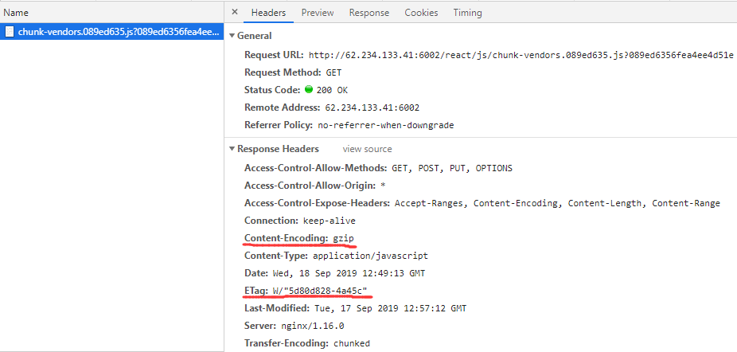
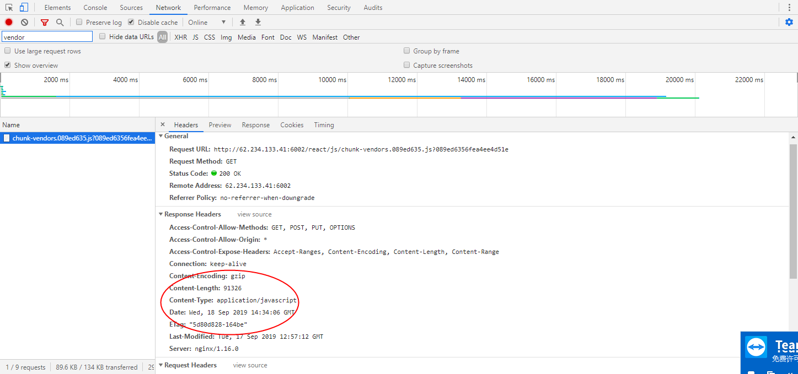
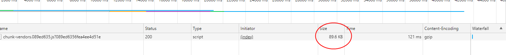

### nginx开启gzip、gzip_static 加速你的应用

[TOC]

#### gzip

`gzip`属于在线压缩，在资源通过`http`发送报文给客户端的过程中，进行压缩，可以减少客户端带宽占用，减少文件传输大小。

一般写在`server`或者`location`均可；
~~~nginx

server {
	listen 6002;
	server_name **.234.133.**;

	gzip on;
	gzip_proxied any;
	gzip_types
		text/css
		text/javascript
		text/xml
		text/plain
		image/x-icon
		application/javascript
		application/x-javascript
		application/json;
}

~~~

> 不开启gzip:



这个时候 `298KB` 左右；

> 开启gzip:




开启之后，`Content-Encoding: gzip; ETag: W/"~~~";`
这里的`ETag`中的 `W\` 就是区分是否是在线写入压缩的标识；

开启`gzip`，`298KB` 可以减少到 `104KB`，效率还是不错的；
只是在线`gzip`比较占用`CPU`，相比`gzip_static`还是不太好。

#### gzip_static

在前端代码打包构建`bundle`的时候，一般都有根据一定的算法自动压缩代码成`gz`文件的`webpack`插件;

当我们不在 `nginx` 开启 `gzip_static`的时候，发现生产的`gz`文件并没有被运行；

`gzip_static`是会自动执行`gz`文件的，这样的就避免了通过`gzip`自动压缩；

比如上面图片的资源：


我们上面讲到通过`gzip`自动压缩是 `104KB`，而我们自己压缩的是`90KB`，所有如果运行了我们自己的`gz`文件，会更好。

```nginx
gzip_static on;
```





`ETag`里面没有 `\W`, 就是使用的是我们自己的`gz`文件的，比`gzip`自动压缩的还减少了`10KB`；