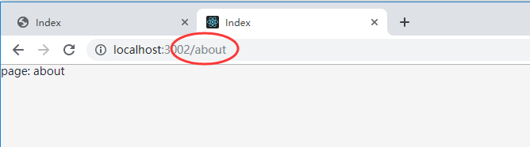

### nginx服务器配置React的Browser路由模式，并避免出现404

[TOC]

#### 前言

React路由模式分为两种：

> hashHistory:
>
> 比如 http://localhost:8080/#/login
>
> browserHistory
>
> 比如 http://localhost:8080/login

`browserHistory`的好处大于`hashHistory`, 但是麻烦的地方就是，`browserHistory`路由模式，需要服务器的配置：

请求 http://localhost:8080/login 上的资源的时候，服务器会默认搜索当前目录下的` login `文件夹里的资源。但是`logIn`这个目录其实是不存在的，往往在刷新浏览器的时候，会==404Not fund==；

所以需要利用 nginx 里面的 `try_files` 去指定一个 `fall back  `资源；

#### 1、React router配置

```javascript
import React from 'react';
import { Route, Switch, BrowserRouter as Router } from 'react-router-dom';

import App from '@pages/App';

function About(props) {
    console.log('about', props);
    return <div>page: about</div>;
}

// 路由配置
const routerConfig = [
    {
        path: '/',
        component: App
    },
    {
        path: '/about',
        component: About
    }
];

function AppRouter() {
    return (
        // 只有当你的应用部署到服务器的二级目录的时候，才需要设置basename
        <Router basename="/react">
            <Switch>
                {routerConfig.map(n => {
                    return <Route path={n.path} exact component={n.component}></Route>;
                })}
            </Switch>
        </Router>
    );
}

export default AppRouter;

```

我这里在服务器配置了二级目录 `react`	作为请求目录，所以这里的 basename 需要配置成  `/react`。如果你的静态资源已经是在根目录是不需要设置这个的。

启动本地服务：



这个时候从首页点击跳到 `about` ，就能看到这种路由模式的路径了；

此时如果你刷新了浏览器，将会提示找不到`about`目录：


此时可以在`webpack.config.js`里面增加：

```javascript
devServer {
	historyApiFallback: true
}
```

`webpack` 里面的 `historyApiFallback` 使用的是`connect-history-api-fallback`:

重启本地服务，再次刷新正常。


> 关于 connect-history-api-fallback
>
> 单页应用(SPA)一般只有一个index.html, 导航的跳转都是基于[HTML5 History API](http://www.w3.org/html/wg/drafts/html/master/single-page.html#the-history-interface)，当用户在越过index.html 页面直接访问这个地址或是通过浏览器的刷新按钮重新获取时，就会出现404问题；
>
> 比如 直接访问` /login`,  `/login/online`，这时候越过了index.html，去查找这个地址下的文件。由于这是个一个单页应用，最终结果肯定是查找失败，返回一个404错误。
>
> **这个中间件就是用来解决这个问题的**；
>
> 只要满足下面四个条件之一，这个中间件就会改变请求的地址，指向到默认的` index.html`:
>
> > 1 `GET请求`
> >
> > 2  接受内容格式为` text/html`
> >
> > 3 不是一个直接的文件请求，比如路径中不带有 `.`
> >
> > 4 没有 `options.rewrites` 里的正则匹配


#### 2、nginx 配置

```nginx
location /react {
    alias /project/react/;
    # browserHistory模式 404问题
    try_files $uri $uri/ /react/index.html;
    index index.html;
    autoindex on;
    gzip on;
    add_header Access-Control-Allow-Origin '*';
    add_header Access-Control-Allow-Methods 'GET, POST, PUT, OPTIONS';
    add_header Access-Control-Expose-Headers 'Accept-Ranges, Content-Encoding, Content-Length, Content-Range';
  }
```

> autoindex on; 开启这个，输入到/react 会直接定向到index.html;
>
> try_files 主要解决的是，如果在一些目录下找不到 index.html， 会最终有一个保底资源的路径就是 /react/index.html；

```nginx
try_files $uri $uri/ /react/index.html;
```

> 浏览器输入 http://62.234.133.41:6002/react/about
>
> 会先查找 http://62.234.133.41:6002/react/about 是否有文件about.html存在；再查找`/about/`下是否有文件存在，如果都不存在，启动 `/react/index.html`;

==try_files 增加 $uri/ 可以解决 `try_files` 和` autoindex`同时存在的时候，再输入`/react `不会自动定向到`index.html`的问题==；

#### 参考文档

1. https://github.com/bripkens/connect-history-api-fallback

2. http://nginx.org/en/docs/http/ngx_http_core_module.html#try_files

   

