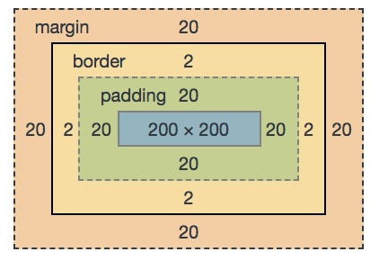

### window和document各种宽高计算

[TOC]

#### 1、盒子模型


所谓`CSS`盒子模型是：

`margin` + `border` + `padding` + `content`

举例说明：

```html
<style>
  *{
    margin: 0;
    padding: 0;
  }
  .box{
    width: 200px;
    height: 200px;
    padding: 20px;
    margin: 20px;
    border: 2px solid red;
  }
  .boxItem{
    width: 100%;
    height: 100%;
    background: green;
  }
</style>
<div class="box">
   <div class="boxItem"></div>
</div>
```



如图所示：

> 可视区域高度： clientHeight = height + padding = 240;
>
> 正文全文高度：scrollHeight = height + padding = 240;
>
> 可见区域偏移高度：offsetHeight = height + padding + border = 244;

此时 `scrollHeight` 和 `clientHeight` 好像看起来并没有什么区别。

如果我们上面的代码做以下修改：

```css
.box{
    width: 200px;
    height: 200px;
    padding: 20px;
    margin: 20px;
    border: 2px solid red;
    overflow:auto;
  }
  .boxItem{
    width: 100%;
    height: 1000px;
    background: green;
  }
```

> 可视区域高度： clientHeight = height + padding = 240;

> 正文全文高度：scrollHeight = height + padding = 1040;

> 可见区域偏移高度：offsetHeight = height + padding + border = 244;

这下就可以看到之间的区别了，其他计算属性如下：

```js
clientLeft: 2;
clinetTop: 2;
offsetLeft: 20;
offsetTop: 20;
scrollLeft:0;
scrollTop:0;
```

总结：

当前`div.box`元素的称为当前元素，当前元素的`offsetParent`（父类节点）在这里是 `body`；

`Client`

> `clientleft`:元素的内边距的`外边缘`和元素边框的`外边缘`的距离，实际就是边框的左边框宽度
>
> `clienttop`:同理边框的上边框的宽度
>
> `clientwidth`:用于描述元素内尺寸宽度，是指 `元素内容`+`内边距` 大小，`不包括边框、外边距、滚动条部分`
>
> `clientheight`:同理 用于描述元素内尺寸高度，是指 `元素内容`+`内边距` 大小，不包括边框、外边距、滚动条部分

`Offset`

> `offsetleft`: 元素的边框的外边缘距离与已定位的父容器（`offsetparent`）的左边距离（不包括元素的边框和父容器的边框）。
>
> `offsettop`:同理是指元素的边框的外边缘距离与已定位的父容器（`offsetparent`）的上边距离（不包括元素的边框和父容器的边框）。
>
> `offsetwidth`:描述元素外尺寸宽度，是指 元素内容宽度+内边距宽度(左右两个)+边框(左右两个)，不包括外边距和滚动条部分。
>
> `offsetheight`:同理 描述元素外尺寸高度，是指 元素内容高度+内边距高度(上下两个)+边框(上下两个)，不包括外边距和滚动条部分

