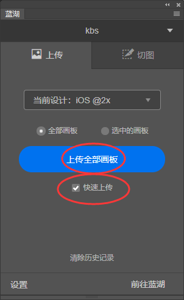

### 求人不如求已系列工具：如何PSD文件自动标注切图和真机预览

[TOC]

#### 前言

在很多时候，UI会给一部分切图，当你使用一个新的技术，需要的不再是png而是webp或者SVG时候，沟通变得异常复杂，沟通成本急剧增加。

很多时候在想，是否有一些工具，可以帮助我们解决这个尴尬的问题，也可以减少沟通成本；

当然很多公司专业的UI会通过专业工具Stetch帮你生成一套完成的UI备注文件。

可惜，有些时候，并没有。

所以，经过一些摸索，发现了一些比较不错的工具，来提高我们工作的效率；

废话不多说，开始介绍。

#### 蓝湖工具

如上所有，如果没有UI帮你做或者没时间做UI备注，我们就采取其他的在线模式；

在线工具就是`蓝湖`

##### 注册账号

注册一个免费账号

##### 下载插件

ps应用商店下载蓝湖插件

[Adobe Photoshop 插件下载](https://lanhuapp.com/ps?comeFrom=%E9%A1%B9%E7%9B%AE%E5%88%97%E8%A1%A8_%E5%8F%B3%E4%B8%8A)

ps中点击蓝湖工具，然后登陆

##### 自动备注

>当我们只需要获取自动备注的时候，点击上传面板

点击去web端查看按钮，可以跳转到蓝湖网页版

右边的各种备注信息一览无余，很是方便。

##### 切图

> 当你需要生成切图时候，如下图一步步操作

双击psd源文件，选中ICON图层，点击标记为切图

##### 手机预览psd源文件

当你之前都已经把PSD文件上传到蓝湖后，appstore下载蓝湖APP，之后就可以直接预览psd文件了

#### Design Mirror

[下载地址](http://www.psmirror.net/en/install)

首先下载 photoshop 插件, 然后下载 app，然后在ps里面登录注册好的账号，通过wifi或者USB，就可以app里面预览

这个预览和上一个蓝湖预览最大的不同就是这个完全是本地预览，不需要上传，比较方便。

`甚至还可以点击上传图片，把手机上的图片同步到photoshop`, 这个挺不错的

