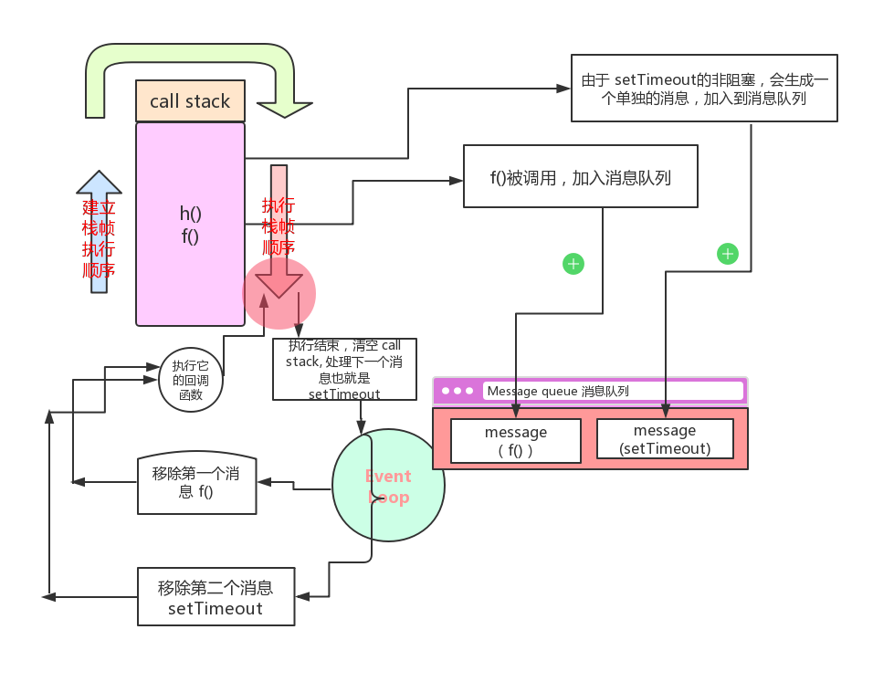

## JavaScript - 并发模式和 Event Loop 事件循环解读

[TOC]

### 1、Runtime concepts 执行相关的概念

`Javascript` 有一个基于` Event Loop` 事件循环的并发模型；

下面讲解一个理论模型，讲解现代浏览器`javascript` 引擎实现机制和讲解一下描述的一些语义词；

可视模型代表：


#### 1.1、stack 栈

函数调用形成了一个栈帧

```js
function foo(b) {
  var a = 10;
  return a + b + 11;
}

function bar(x) {
  var y = 3;
  return foo(x * y);
}

console.log(bar(7)); // 返回 42
```


简单介绍下函数调用的过程：

当调用`bar(7)`时，建立了第一个 `stack frame` 是 `bar` (包含参数` 7 `和本地变量)；当 `bar` 调用 `foo` 时候，建立了第二个 `stack frame` 是 `foo`(包含参数 `3* 7` 和本地变量), 并且放置在 `bar` 的`上方`，也就是`栈的顶部`了。

当 `foo（21）` 执行完毕 返回 42 的时候，`foo` 这个栈帧会被移除掉，只剩下了 `bar（7）`；然后再执行 `bar`, 有返回后，整个栈都是空的。

#### 1.2、Heap 堆

对象都被关联在`Heap`里面，即用于表示一大块非结构化的内存区域。

#### 1.3、Queue 消息队列

一个 `Javascript` 运行时使用一系列待处理消息的消息队列。每个消息关联一个函数去处理消息。

`如果一个消息，比如click事件却没有回调函数，是不会被加入消息队列的`；

在事件循环的一些时刻，`运行时从最先进入队列的消息开始处理队列中的消息`。这样做的话，消息从队列中被移除，并作为输入参数调用与之关联的函数。就如上面所说，调用一个函数总是为其创造一个的栈帧。

函数的执行一直会持续到 `stack` 变成 空的。然后如果消息队列还有消息的话，事件循环将会执行消息队列的下一个消息。

总之就是：

Queue队列中的消息，会以一个个执行；首先会判断 stack 会不会为空，如果为空就执行下一个消息；如果不为空，等待上一个消息处理完。

### 2、Event Loop 事件循环

之所以称为事件循环，是因为他的执行实现的方式如下：

```js
while (queue.waitForMessage()) {
  queue.processNextMessage();
}
```

如果当前没有消息，`queue.waitForMessage() `会同步等待消息的到达。

事件循环是指等待队列同步接收消息的过程的术语。 事件循环移入的增量称为'tick'，每次'ticks'时它检查调用堆栈是否为空，如果是，它将事件队列中的top函数添加到调用堆栈并执行它。 完成处理此功能后，它会再次开始计时。

```js
function init() {
  var link = document.getElementById("foo");

  link.addEventListener("click", function changeColor() {
    this.style.color = "burlywood";
  });
}

init();
```


在这个例子中：

当用户点击 元素 `foo` 和 触发 `onClick` 事件时，一个 `message` (and `callback`, `changeColor`) 被添加到消息队列中。

当这个消息被移除时，它的回调函数 changeColor 被调用，当 changeColor returns 时（哪怕返回的是一个错误)，`call stack` 清空，事件循环再次开始；

只要 `changeColor` 方法存在，然后指定为元素 `foo` 的点击回调函数，后续的点击元素会引起更多的消息（关联到回调函数 `changeColor`）被加入到消息队列。

#### 2.1、Run-to-completion 运行到结束

每一个消息都被完全执行结束后，才回去执行下一个消息的处理。

这为程序的分析提供了一些优秀的特性，包括：无论何时执行一个函数，都不会被抢占，并且会在其他代码执行之前就已经被完全执行（并且可以修改函数操作的数量）。

这个和 C语言不太一样，比如，如果一个函数运行在一个线程中，一些时候，会被执行系统因在别的线程执行其他代码中断。

这个模型的缺点时，当一个消息需要太长时间去执行的时候，web用户就无法处理一些，比如`click`, `srcoll`的交互。浏览器会弹出一个 `“a script is taking too long to run”` 这样的对话框来缓解这个情况。一个好的解决办法就是，`缩短消息处理的时间，或者把一个消息分割成多个消息`。

#### 2.2、Adding messages 添加消息

在web浏览器里面，`只要有事件发生并且有监听器绑定的时候，一定会增加一个消息`。如果没有监听器，则事件消失。所以，一个元素的点击并且带有点击事件处理，一定会增加一个消息到消息队列中去。

setTimeout 函数有两个参数：`添加队列的消息` 和 `时间（默认 0 ）`，这个时间值代表着这个消息被添加到消息队列最小的延迟时间。如果消息队列中，没有别的消息，这个消息会在延迟时间达到之后，立马会被处理。如果消息队列有别的消息，`setTimeout` 这个消息一定要等到别的消息被处理完后才能执行。由于这个原因，所以第二参数表明了`最小的时间间隔`，而`非确切的时间`。

举例说明，当第二个参数的时间过期后，setTimeout 不会被执行：

```js
const s = new Date().getSeconds();

setTimeout(function() {
  // prints out "2", meaning that the callback is not called immediately after 500 milliseconds.
  console.log("Ran after " + (new Date().getSeconds() - s) + " seconds");
}, 500);

while(true) {
  if(new Date().getSeconds() - s >= 2) {
    console.log("Good, looped for 2 seconds");
    break;
  }
}
```

举例说明添加消息的顺序：

```js
function f() {
  console.log("foo");
  setTimeout(g, 0);
  console.log("baz");
  h();
}

function g() {
  console.log("bar");
}

function h() {
  console.log("blix");
}

f();
```

由于 `setTimeout` 的非阻塞特性，它的回调函数将在 0 毫米后触发，并且不会作为 `f() `这个消息的一部分来处理。

在这个例子中，调用 `setTimeout` ，传递回调函数 `g` 和 时间延迟 `0` ms; 当指定的延迟时间到了的时候，一个以 `g` 为回调函数的单独的消息会被加入到消息队列中。

生成结果的控制台活动是 `“foo”, “baz”, “bilx”` 和在下一个事件循环中产生的结果：`“bar”`;

如果`同一个调用帧`，对 `setTimeout` 进行两次调用，并且 `timeout` 时间相同，则按执行顺序进行处理。



#### 2.3、Zero delays 零延迟

零延迟不是真实代表着在0毫秒后回调函数会执行。

setTimeout 的零延迟，在给定的时间间隔后不会执行回调函数。

是否执行决定于消息队列中的等待任务的数量。

举例说明：

```js
(function() {

  console.log('this is the start');

  setTimeout(function cb() {
    console.log('Callback 1: this is a msg from call back');
  });

  console.log('this is just a message');

  setTimeout(function cb1() {
    console.log('Callback 2: this is a msg from call back');
  }, 0);

  console.log('this is the end');

})();

// "this is the start"
// "this is just a message"
// "this is the end"
// 当前函数 note that function return, which is undefined, happens here 
// "Callback 1: this is a msg from call back"
// "Callback 2: this is a msg from call back"
```

`this is just a message` 虽然在回调之后，却会在回调之前输出到打印台上，这是因为这个零延迟只是处理请求的最小延迟，并非一个保证的精确的时间。

一般地，`setTimeout` 需要等待所有其他消息队列的代码执行完之后，才会执行，即时你设置了特殊的时间间隔。


