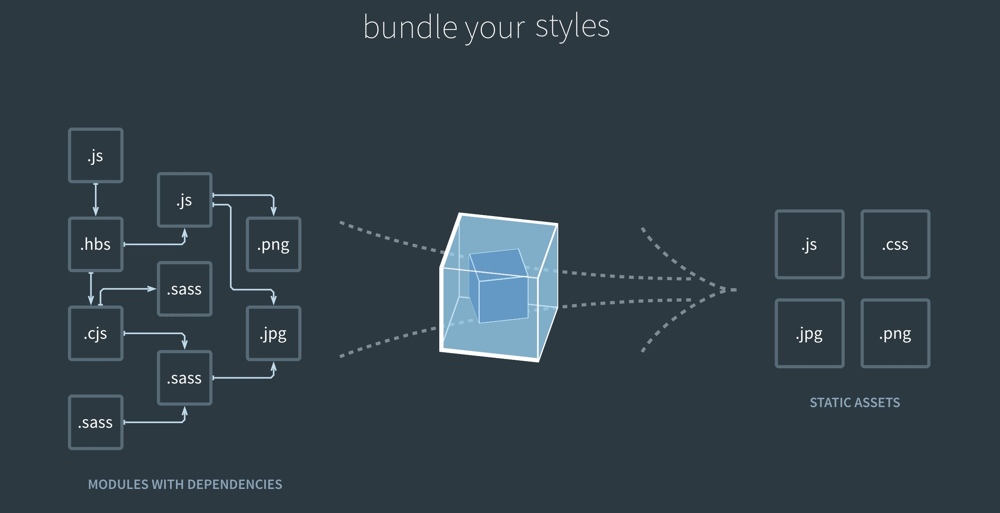

### 构建工具之webpack

[TOC]

#### 入门小试牛刀

本章节我们讲解一下 webpack 构建详细过程。

作为 `module bundle`，越来越多的人使用`webpack`。

不需要像 `gulp grunt` 一样了解每个`task`过程，只需要配置入口文件等即可。



这里使用`yarn`：

```bash
yarn init -y
yarn add webpack webpack-cli -D
```

假如使用 `npm`:

```shell
npm init -y
npm install webpack webpack-cli --save-dev
```

现在，我们将创建以下目录结构、文件和内容：

**project**

```diff
  webpack4
  |- package.json
  |- yarn.lock
+ |- index.html
+ |- /src
+   |- index.js
```

**`package.json`**中，去除 `main`, 增加 `private`，防止被误提交：

```json
{
  "name": "webpack4",
  "version": "1.0.0",
  "private": true,
  "license": "MIT",
  "devDependencies": {
    "webpack": "^4.33.0",
    "webpack-cli": "^3.3.4"
  }
}
```

我们接下来的代码需要用到 lodash ，所以事先安装一下：

```bash
yarn add lodash

这里有一个小知识点：
yarn add lodash ==VS== yarn add lodash -D
抑或
npm install lodash --save ==VS== npm install lodash --save-dev
的区别：

在安装一个 package，而此 package 要打包到生产环境 bundle 中时，你应该使用 
npm install --save。
如果你在安装一个用于开发环境目的的 package 时（例如，linter, 测试库等），你应该使用 
npm install --save-dev

```

`index.html`

```html
<!DOCTYPE html>
<html lang="en">
<head>
  <meta charset="UTF-8">
  <meta name="viewport" content="width=device-width, initial-scale=1.0">
  <meta http-equiv="X-UA-Compatible" content="ie=edge">
  <title>webpack</title>
</head>
<body>
<script src="src/index.js"></script>
</body>
</html>
```

src/index.js

```javascript
import _ from 'lodash';

function Component() {

  let element = document.createElement('div');
  element.innerText = _.join(['Hello', 'World']);

  return element;
}

document.body.appendChild(Component());
```

这时候运行，肯定不能显示，我们要先打包编译一下。

执行 `npx webpack`，会将我们的脚本 `src/index.js` 作为 入口起点，也会生成 `dist/main.js`作为 输出。

```bash
alex:webpack4 $ npx webpack
Hash: 918b00f8361c58df4bff
Version: webpack 4.33.0
Time: 2673ms
Built at: 2019-06-12 23:49:02
  Asset      Size  Chunks             Chunk Names
main.js  70.4 KiB       0  [emitted]  main
Entrypoint main = main.js
[1] ./src/index.js 199 bytes {0} [built]
[2] (webpack)/buildin/global.js 472 bytes {0} [built]
[3] (webpack)/buildin/module.js 497 bytes {0} [built]
    + 1 hidden module

WARNING in configuration
The 'mode' option has not been set, webpack will fallback to 'production' for this value. Set 'mode' option to 'development' or 'production' to enable defaults for each environment.
You can also set it to 'none' to disable any default behavior. Learn more: https://webpack.js.org/configuration/mode/
```

把 `html` 中 `js` 的引用地址改为 ‘’`dist/main.js`”；

浏览器打开就能看到“`Hello World`”。

为了更加方便的配置项目，我们还是需要配置 `webpack.config.js`:

```javascript
const path = require('path')；
module.exports = {
  entry:{
    index: './src/index.js'
    //记得加 ./ 不然报错 ERROR in Entry module not found: Error: Can't resolve 'src/index.js' in '/webpack4'
  },
  output:{
    filename: 'main.js',
    path: path.resolve(__dirname, 'dist')
  }
}
```

package.json 配置:

```json
"scripts": {
    "build": "webpack"
 }
```

打包：

```bash
yarn build
```

> *通过在* `npm run build` *命令和你的参数之间添加两个中横线，可以将自定义参数传递给 webpack，例如：*`npm run build -- --colors`*。*


#### loadsh 小插曲

不知道大家有没有注意到一个事情：我们只使用了`lodash`的一个`join`方法，却打包进去了整个版本  `70K`。

这对于优化来说，是个极其不划算的事情。

```javascript
 Asset      Size  Chunks             Chunk Names
main.js  70.4 KiB       0  [emitted]  main
```

当然我们首先

`第一种方法`：

可以只引用 `join` 方法：

```javascript
// import _ from 'lodash';
import join from 'lodash/join';

function component() {

  let element = document.createElement('div');
  // element.innerHTML = _.join(['Hello', 'World']);
  element.innerHTML = join(['Hello', 'World']);

  return element;

}

const div = component();

document.body.append(div);
```


```javascript
Hash: e68d39f2999aafcdc772
Version: webpack 4.33.0
Time: 304ms
Built at: 2019-06-13 00:42:35
  Asset      Size  Chunks             Chunk Names
main.js  1.17 KiB       0  [emitted]  index
```

`70.4 KiB —> 1.17 KiB `效果显著。

但是一般情况，我们需要很多方法要用，不想如此麻烦，那么我们又该如何是好呢？

`第二种方法：`

