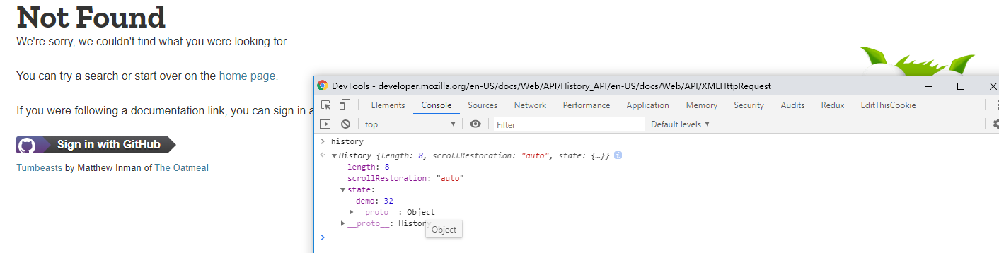

### 深入了解 HTML5 History API，解读 webpack-dev-server 的 historyApiFallback 原理

[TOC]

#### history

`History` 接口，允许操作浏览器的 `session history`，比如在当前`tab`下浏览的所有页面或者当前页面的会话记录。

> history属性

1、`length`(只读)
	
   返回一个总数，`代表当前窗口下的所有会话记录数量`，包括当前页面。如果你在新开的一个`tab`里面输入一个地址，当前的`length`是`1`，如果再输入一个地址，就会变成`2`；

   假设当前总数已经是`6`，无论是浏览器的返回还是 `history.back()`, 当前总数都不会改变。

`2、scrollRestoration`(实验性API)

   允许`web`应用在`history`导航下指定一个默认返回的页面滚动行为，就是是否自动滚动到页面顶部；默认是 `auto`, 另外可以是 `manual`(手动)

3、 `state` (当前页面状态)

	返回一个任意的状态值，代表当前处在历史记录`栈`里最高的状态。其实就是返回当前页面的`state`，默认是 null

> history 方法

History不继承任何方法；

1、 ``back()``

返回历史记录会话的上一个页面，同浏览器的返回，同 `history.go(-1)`

2、`forward()`

前进到历史会话记录的下一个页面，同浏览器的前进，同 `history.go(1)`

3、`go()`

从`session history`里面加载页面，取决于当前页面的相对位置，比如 `go(-1)` 是返回上一页，`go(1)`是前进到下一个页面。
如果你直接一个超过当前总`length`的返回，比如初始页面，没有前一个页面，也没有后一个页面，这个时候 `go(-1)` 和 `go(1)`,都不会有任何作用；
如果你不指定`任何参数`或者`go(0)`,将会重新加载当前页面；

4、`pushState(StateObj, title, url)`

把提供的状态数据放到当前的会话栈里面，如果有参数的话，一般第二个是`title`，第三个是`UR`L。
这个数据被DOM当做透明数据；你可以传任何可以序列号的数据。不过火狐现在忽略 `title` 这个参数；
这个方法`会`引起会话记录`length`的增长。

5、`replaceState(StateObj, title, url)`

把提供的状态数据更新到当前的会话栈里面最近的入口，如果有参数的话，一般第二个是`title`，第三个是`URL`。
这个数据被DOM当做透明数据；你可以传任何可以序列号的数据。不过火狐现在忽略 `title` 这个参数；
这个方法`不会`引起会话记录`length`的增长。

------------
`综上所述，pushState` 和 `replaceState` 是修改当前`session history`的两个方法，他们都会触发一个方法 `onpopstate` 事件;

~~~
history.pushState({demo: 12}, "8888", "en-US/docs/Web/API/XMLHttpRequest")
~~~

如图 `pushState` 会改变当你在后面建立的页面发起XHR请求的时候，`请求header`里面的 `referrer；这个地址就是你在pushState里面的URL；`

另外URL `en-US/docs/Web/API/XMLHttpRequest（并非真实存在的URL）`, 在`pushState`完成之后，`并不触发页面的重新加载或者检查当前URL的目录是否存在`。

只有当你此刻从这个页面跳转到 `google.com`, 然后再点击返回按钮，此时的页面就是你现在pushState的页面，state也会是当前的state, `也同时会加载当前的页面资源，oops，此刻会显示不存在；`

replaceState 同理；

关于 `onpopstate`:

~~~javascript

window.onpopstate = function(event) {
  alert("location: " + document.location + ", state: " + JSON.stringify(event.state));
};

history.pushState({page: 1}, "title 1", "?page=1");
history.pushState({page: 2}, "title 2", "?page=2");
history.replaceState({page: 3}, "title 3", "?page=3");
history.back(); // alerts "location: http://example.com/example.html?page=1, state: {"page":1}"
history.back(); // alerts "location: http://example.com/example.html, state: null
history.go(2);  // alerts "location: http://example.com/example.html?page=3, state: {"page":3}

~~~

------

#### historyApiFallback

以下说明仅存在于当前路由是 `history` 模式；
说道 `webpack-dev-server`的 `historyApiFallback` 就不得不说下 VUE 前端路由，路由跳转原理；

传统的web开发中，大多是多页应用，每个模块对应一个页面，在浏览器输入相关页面的路径，然后服务端处理相关浏览器的请求，通过HTTP
把资源返回给客户端浏览器进行渲染。

