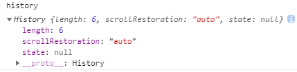

### 深入了解 HTML5 History API，前端路由的生成，解读 webpack-dev-server 的 historyApiFallback 原理

[TOC]

#### 1、history

`History` 接口，允许操作浏览器的 `session history`，比如在当前`tab`下浏览的所有页面或者当前页面的会话记录。

> history属性



1、`length`(只读)
	
   返回一个总数，`代表当前窗口下的所有会话记录数量`，包括当前页面。如果你在新开的一个`tab`里面输入一个地址，当前的`length`是`1`，如果再输入一个地址，就会变成`2`；

   假设当前总数已经是`6`，无论是浏览器的返回还是 `history.back()`, 当前总数都不会改变。

`2、scrollRestoration`(实验性API)

   允许`web`应用在`history`导航下指定一个默认返回的页面滚动行为，就是是否自动滚动到页面顶部；默认是 `auto`, 另外可以是 `manual`(手动)

3、 `state` (当前页面状态)

	返回一个任意的状态值，代表当前处在历史记录`栈`里最高的状态。其实就是返回当前页面的`state`，默认是 null

> history 方法

History不继承任何方法；

1、 ``back()``

返回历史记录会话的上一个页面，同浏览器的返回，同 `history.go(-1)`

2、`forward()`

前进到历史会话记录的下一个页面，同浏览器的前进，同 `history.go(1)`

3、`go()`

从`session history`里面加载页面，取决于当前页面的相对位置，比如 `go(-1)` 是返回上一页，`go(1)`是前进到下一个页面。
如果你直接一个超过当前总`length`的返回，比如初始页面，没有前一个页面，也没有后一个页面，这个时候 `go(-1)` 和 `go(1)`,都不会有任何作用；
如果你不指定`任何参数`或者`go(0)`,将会重新加载当前页面；

4、`pushState(StateObj, title, url)`

把提供的状态数据放到当前的会话栈里面，如果有参数的话，一般第二个是`title`，第三个是`UR`L。
这个数据被DOM当做透明数据；你可以传任何可以序列号的数据。不过火狐现在忽略 `title` 这个参数；
这个方法`会`引起会话记录`length`的增长。

5、`replaceState(StateObj, title, url)`

把提供的状态数据更新到当前的会话栈里面最近的入口，如果有参数的话，一般第二个是`title`，第三个是`URL`。
这个数据被DOM当做透明数据；你可以传任何可以序列号的数据。不过火狐现在忽略 `title` 这个参数；
这个方法`不会`引起会话记录`length`的增长。

------------
`综上所述，pushState` 和 `replaceState` 是修改当前`session history`的两个方法，他们都会触发一个方法 `onpopstate` 事件;

~~~javascript
history.pushState({demo: 12}, "8888", "en-US/docs/Web/API/XMLHttpRequest")
~~~


如图 `pushState` 会改变当你在后面建立的页面发起XHR请求的时候，`请求header`里面的 `referrer；这个地址就是你在pushState里面的URL；`

另外URL `en-US/docs/Web/API/XMLHttpRequest（并非真实存在的URL）`, 在`pushState`完成之后，`并不触发页面的重新加载或者检查当前URL的目录是否存在`。

只有当你此刻从这个页面跳转到 `google.com`, 然后再点击返回按钮，此时的页面就是你现在pushState的页面，state也会是当前的state, `也同时会加载当前的页面资源，oops，此刻会显示不存在；`


`replaceState` 同理；

关于 `onpopstate`:

~~~javascript

window.onpopstate = function(event) {
  alert("location: " + document.location + ", state: " + JSON.stringify(event.state));
};

history.pushState({page: 1}, "title 1", "?page=1");
history.pushState({page: 2}, "title 2", "?page=2");
history.replaceState({page: 3}, "title 3", "?page=3");
history.back(); // alerts "location: http://example.com/example.html?page=1, state: {"page":1}"
history.back(); // alerts "location: http://example.com/example.html, state: null
history.go(2);  // alerts "location: http://example.com/example.html?page=3, state: {"page":3}

~~~

------

#### 2、两种路由模式的生成

以下说明仅存在于当前路由是 `history` 模式；
说道 `webpack-dev-server`的 `historyApiFallback` 就不得不说下 VUE 前端路由，路由跳转原理；

传统的web开发中，大多是多页应用，每个模块对应一个页面，在浏览器输入相关页面的路径，然后服务端处理相关浏览器的请求，通过HTTP把资源返回给客户端浏览器进行渲染。

传统开发，后端定义好路由的路径和请求数据的地址；

随着前端的发展，前端也承担着越来越大的责任，比如Ajax局部刷新数据，前端可以操控一些历史会话，而不用每次都从服务端进行数据交互。

`history.pushState` 和 `history.replaceState` ，这两个`history`新增的`api`，为前端操控浏览器历史栈提供了可能性

~~~javascript

/**
* @data {object} state对象 最大640KB, 如果需要存很大的数据，考虑 sessionStorage localStorage
* @title {string} 标题
* @url {string} 必须同一个域下，相对路径和绝对路径都可以
*/
history.pushState(data, title, url) //向浏览器历史栈中增加一条记录。
history.replaceState(data, title, url) //替换历史栈中的当前记录。

~~~

这两个Api都会操作浏览器的历史栈，而不会引起页面的刷新。不同的是，`pushState`会增加一条新的历史记录，而`replaceState`则会替换当前的历史记录。所需的参数相同，在将新的历史记录存入栈后，会把传入的`data`（即state对象）同时存入，以便以后调用。同时，这俩api都会更新或者覆盖当前浏览器的`title`和`url`为对应传入的参数。

~~~javascript

// 假设当前的URL： http://test.com

history.pushState(null, null, "/login");
// http://test.com ---->>>  http://test.com/login

history.pushState(null, null, "http://test.com/regiest");
// http://test.com ---->>>  http://test.com/regiest


// 错误用法
history.pushState(null, null, "http://baidu.com/regiest");
// error 跨域报错

~~~

也正是基于浏览器的`hitroy`，慢慢的衍生出来现在的前端路由比如`vue`的`history`路由，`react`的`BrowseHistory`：

==现在让我们手动写一个history路由模式==：

> Html

```html
<div>
		<a href="javascript:;" data-link="/">login</a>
		<a href="javascript:;" data-link="/news">news</a>
		<a href="javascript:;" data-link="/contact">contact</a>
</div>
```

> js

```javascript
// history 路由
class HistoryRouter {
  constructor(options = {}) {
    // store all router
    this.routers = {};
    // 遍历路由参数，保存到 this.routers
    if (options.router) {
      options.router.forEach(n => {
        this.routers[n.path] = () => {
          document.getElementById("content").innerHTML = n.component;
        }
      });
    }
    // 绑定到 this.routers
    this.updateContent = this.updateContent.bind(this);
    // 初始化事件
    this.init();
    this.bindClickEvent();
  }
  init() {
    // 页面初始化的时候，初始化当前匹配路由
    // 监听 load
    window.addEventListener('load', this.updateContent, false);
    // pushState replaceState 不能触发 popstate 事件
    // 当浏览器返回前进或者刷新，都会触发 popstate 更新
    window.addEventListener("popstate", this.updateContent, false);
  }
  // 更新内容
  updateContent(e) {
    alert(e ? e.type : "click");
    const currentPath = location.pathname || "/";
    this.routers[currentPath] && this.routers[currentPath]();
  }
  // 绑定点击事件
  bindClickEvent() {
    const links = document.querySelectorAll('a');
    Array.prototype.forEach.call(links, link => {
      link.addEventListener('click', e => {
        const path = e.target.getAttribute("data-link");
        // 添加到session history
        this.handlePush(path);
      })
    });
  }
  // pushState 不会触发 popstate
  handlePush(path){
    window.history.pushState({path}, null, path);
    this.updateContent();
  }
}
// 实例
new HistoryRouter({
  router: [{
    name: "index",
    path: "/",
    component: "Index"
  }, {
    name: "news",
    path: "/news",
    component: "News"
  }, {
    name: "contact",
    path: "/contact",
    component: "Contact"
  }]
});
```

第一次渲染的时候，会根据当前的 `pathname` 进行更新对应的 `callback` 事件，然后更新 `content` , 这个时候无需服务器的请求；

如果这个时候，我们点击`浏览器的返回🔙前进按钮`，发现依然会依次渲染相关 `content` ，这就是`history历史堆栈`的魅力所在。


最后我们发现当我们切换到非loading page的时候，我们刷新页面，会报出 Get 404，这个时候就是请求了server , 却发现不存在这个目录的资源；

这个时候我们就需要 `historyApiFallback` 。

--------------------

#### 3、historyApiFallback

`Webpack-dev-server` 的背后的是`connect-history-api-fallback`；

> 关于 connect-history-api-fallback 中间件，解决这个404问题

单页应用(SPA)一般只有一个`index.html`, 导航的跳转都是基于[HTML5 History API](http://www.w3.org/html/wg/drafts/html/master/single-page.html#the-history-interface)，当用户在越过`index.html` 页面直接访问这个地址或是通过浏览器的刷新按钮重新获取时，就会出现404问题；

比如 直接访问` /login`,  `/login/online`，这时候越过了`index.html`，去查找这个地址下的文件。由于这是个一个单页应用，最终结果肯定是查找失败，返回一个`404错误`。

**这个中间件就是用来解决这个问题的**；

只要满足下面四个条件之一，这个中间件就会改变请求的地址，指向到默认的` index.html`:

> 1 `GET请求`
>
> 2  接受内容格式为` text/html`
>
> 3 不是一个直接的文件请求，比如路径中不带有 `.`
>
> 4 没有 `options.rewrites` 里的正则匹配

-------

> connect-history-api-fallback 源码：

```javascript
'use strict';

var url = require('url');

exports = module.exports = function historyApiFallback(options) {
  options = options || {};
  var logger = getLogger(options);

  return function(req, res, next) {
    var headers = req.headers;
    if (req.method !== 'GET') {
      logger(
        'Not rewriting',
        req.method,
        req.url,
        'because the method is not GET.'
      );
      return next();
    } else if (!headers || typeof headers.accept !== 'string') {
      logger(
        'Not rewriting',
        req.method,
        req.url,
        'because the client did not send an HTTP accept header.'
      );
      return next();
    } else if (headers.accept.indexOf('application/json') === 0) {
      logger(
        'Not rewriting',
        req.method,
        req.url,
        'because the client prefers JSON.'
      );
      return next();
    } else if (!acceptsHtml(headers.accept, options)) {
      logger(
        'Not rewriting',
        req.method,
        req.url,
        'because the client does not accept HTML.'
      );
      return next();
    }

    var parsedUrl = url.parse(req.url);
    var rewriteTarget;
    options.rewrites = options.rewrites || [];
    for (var i = 0; i < options.rewrites.length; i++) {
      var rewrite = options.rewrites[i];
      var match = parsedUrl.pathname.match(rewrite.from);
      if (match !== null) {
        rewriteTarget = evaluateRewriteRule(parsedUrl, match, rewrite.to);
        logger('Rewriting', req.method, req.url, 'to', rewriteTarget);
        req.url = rewriteTarget;
        return next();
      }
    }

    if (parsedUrl.pathname.indexOf('.') !== -1 &&
        options.disableDotRule !== true) {
      logger(
        'Not rewriting',
        req.method,
        req.url,
        'because the path includes a dot (.) character.'
      );
      return next();
    }

    rewriteTarget = options.index || '/index.html';
    logger('Rewriting', req.method, req.url, 'to', rewriteTarget);
    req.url = rewriteTarget;
    next();
  };
};

function evaluateRewriteRule(parsedUrl, match, rule) {
  if (typeof rule === 'string') {
    return rule;
  } else if (typeof rule !== 'function') {
    throw new Error('Rewrite rule can only be of type string of function.');
  }

  return rule({
    parsedUrl: parsedUrl,
    match: match
  });
}

function acceptsHtml(header, options) {
  options.htmlAcceptHeaders = options.htmlAcceptHeaders || ['text/html', '*/*'];
  for (var i = 0; i < options.htmlAcceptHeaders.length; i++) {
    if (header.indexOf(options.htmlAcceptHeaders[i]) !== -1) {
      return true;
    }
  }
  return false;
}

function getLogger(options) {
  if (options && options.logger) {
    return options.logger;
  } else if (options && options.verbose) {
    return console.log.bind(console);
  }
  return function(){};
}
```

其实代码也挺简单的，最主要先符合上面四个原则，然后先匹配自定义rewrites规则，再匹配点文件规则；

> `getLogger`, 默认不输出，`options.verbose`如果为true，则输出，默认`console.log.bind(console)`

> 如果`req.method != 'GET'`，结束
> 如果`!headers || !headers.accept != 'string'` ，结束
> 如果`headers.accept.indexOf('application/json') === 0` 结束

> `acceptsHtml`函数a判断`headers.accept`字符串是否含有['text/html', '*/*']中任意一个
> 当然不够这两个不够你可以自定义到选项`options.htmlAcceptHeaders`中
> `!acceptsHtml(headers.accept, options)`，结束

> 然后根据你定义的选项`rewrites`, 没定义就相当于跳过了
> 按定义的数组顺序，字符串依次匹配路由rewrite.from，匹配成功则走rewrite.to，to可以是字符串也可以是函数，结束

> 判断dot file，即pathname中包含`.`(点)，并且选项`disableDotRule !== true`，即没有关闭点文件限制规则, 结束

> `rewriteTarget = options.index || '/index.html'`

大致如此；