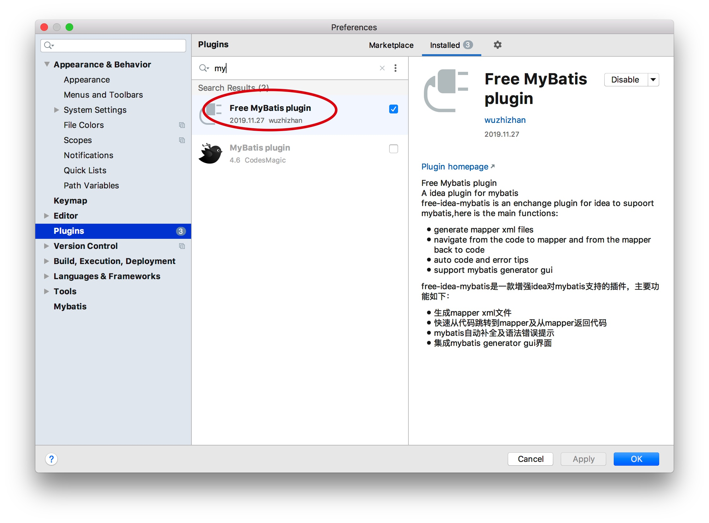
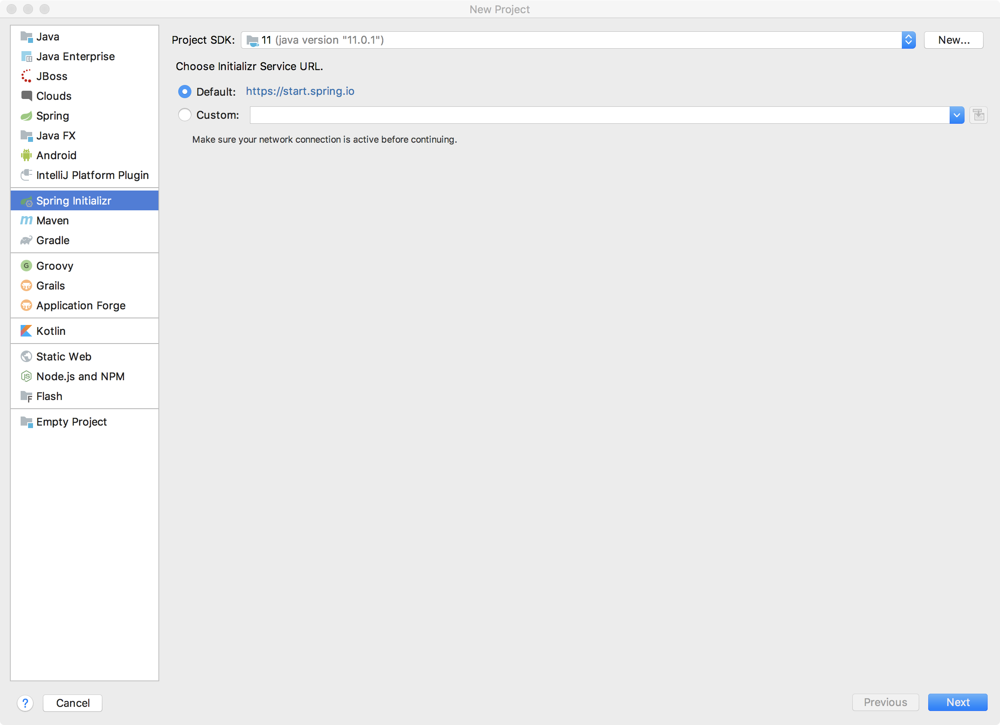

### spring boot从零搭建登录注册功能并进行所有接口验证

[TOC]

目前大多项目是前后端分离。在后台接口服务开发过程中，往往我们需要先搭建一个基础服务，比如登录注册功能、自动对所有的接口进行token的安全校验等，这样可以防范安全问题的出现。并且这样后续的同事可以只关注业务代码的开发，不需要关心基础架构服务的实现。


这次我准备搭建一个简单的后台服务，用的是`spring boot + mysql + mybatis`。

#### 1、搭建Spring boot项目

首先我们使用IDEA自带的初始化项目功能，创建一个Spring boot项目，如图：



> pom.xml

```xml
<?xml version="1.0" encoding="UTF-8"?>
<project xmlns="http://maven.apache.org/POM/4.0.0" xmlns:xsi="http://www.w3.org/2001/XMLSchema-instance"
         xsi:schemaLocation="http://maven.apache.org/POM/4.0.0 https://maven.apache.org/xsd/maven-4.0.0.xsd">
    <modelVersion>4.0.0</modelVersion>
    <parent>
        <groupId>org.springframework.boot</groupId>
        <artifactId>spring-boot-starter-parent</artifactId>
        <version>2.1.6.RELEASE</version>
    </parent>
    <groupId>com.zz</groupId>
    <artifactId>rest-api</artifactId>
    <version>0.0.1-SNAPSHOT</version>
    <name>rest-api</name>
    <description>Demo project for Spring Boot</description>

    <properties>
        <java.version>1.8</java.version>
    </properties>

    <dependencies>
        <dependency>
            <groupId>org.springframework.boot</groupId>
            <artifactId>spring-boot-starter-web</artifactId>
        </dependency>

        <dependency>
            <groupId>com.baomidou</groupId>
            <artifactId>mybatis-plus-boot-starter</artifactId>
            <version>3.1.0</version>
        </dependency>

        <dependency>
            <groupId>org.springframework.boot</groupId>
            <artifactId>spring-boot-starter-data-jpa</artifactId>
        </dependency>

        <dependency>
            <groupId>org.springframework.boot</groupId>
            <artifactId>spring-boot-starter-test</artifactId>
            <scope>test</scope>
        </dependency>
        <dependency>
            <groupId>com.jayway.jsonpath</groupId>
            <artifactId>json-path</artifactId>
            <scope>test</scope>
        </dependency>
        <dependency>
            <groupId>org.springframework.boot</groupId>
            <artifactId>spring-boot-autoconfigure</artifactId>
            <version>2.1.6.RELEASE</version>
        </dependency>
        <dependency>
            <groupId>org.springframework.boot</groupId>
            <artifactId>spring-boot-starter-data-rest</artifactId>
        </dependency>
        <dependency>
            <groupId>org.springframework.boot</groupId>
            <artifactId>spring-boot-starter-data-mongodb</artifactId>
        </dependency>

        <dependency>
            <groupId>org.springframework.boot</groupId>
            <artifactId>spring-boot-configuration-processor</artifactId>
            <optional>true</optional>
        </dependency>

        <dependency>
            <groupId>com.google.code.gson</groupId>
            <artifactId>gson</artifactId>
            <version>2.8.5</version>
            <scope>compile</scope>
        </dependency>

        <!-- Use MySQL Connector-J -->

        <dependency>
            <groupId>mysql</groupId>
            <artifactId>mysql-connector-java</artifactId>
        </dependency>


        <!-- image to base64 -->

        <dependency>
            <groupId>commons-io</groupId>
            <artifactId>commons-io</artifactId>
            <version>2.6</version>
        </dependency>

        <!-- jjwt支持 -->

        <dependency>
            <groupId>io.jsonwebtoken</groupId>
            <artifactId>jjwt</artifactId>
            <version>0.9.1</version>
        </dependency>

        <dependency>
            <groupId>com.auth0</groupId>
            <artifactId>java-jwt</artifactId>
            <version>3.4.0</version>
        </dependency>

        <!--commons-codec -->
        <dependency>
            <groupId>commons-codec</groupId>
            <artifactId>commons-codec</artifactId>
        </dependency>

        <dependency>
            <groupId>com.github.terran4j</groupId>
            <artifactId>terran4j-commons-api2doc</artifactId>
            <version>1.0.2</version>
        </dependency>

        <dependency>
            <groupId>org.springframework.boot</groupId>
            <artifactId>spring-boot-devtools</artifactId>
            <optional>true</optional>
        </dependency>

        <dependency>
            <groupId>org.springframework.boot</groupId>
            <artifactId>spring-boot-starter-thymeleaf</artifactId>
        </dependency>

        <dependency>
            <groupId>com.itextpdf.tool</groupId>
            <artifactId>xmlworker</artifactId>
            <version>5.5.10</version>
        </dependency>

        <dependency>
            <groupId>org.apache.poi</groupId>
            <artifactId>poi-ooxml</artifactId>
            <version>3.15</version>
        </dependency>

        <dependency>
            <groupId>org.apache.poi</groupId>
            <artifactId>poi-scratchpad</artifactId>
            <version>3.15</version>
        </dependency>


    </dependencies>

    <build>
        <plugins>
            <plugin>
                <groupId>org.springframework.boot</groupId>
                <artifactId>spring-boot-maven-plugin</artifactId>
            </plugin>
        </plugins>
    </build>

</project>

```

> Mybatis 推荐插件如下：


