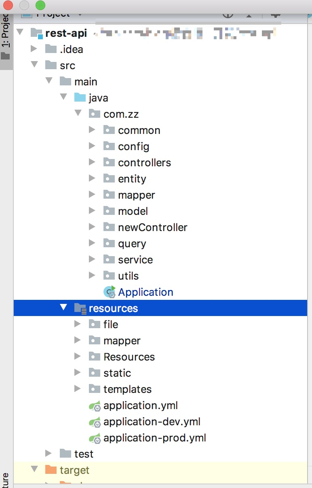
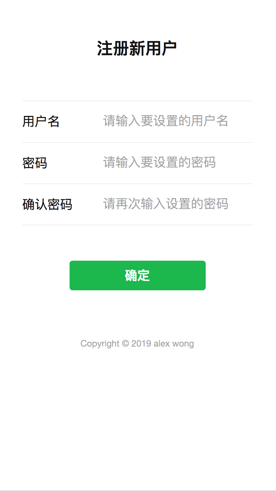

### spring boot从零搭建登录注册功能并进行所有接口验证

[TOC]

目前大多项目是前后端分离。在后台接口服务开发过程中，往往我们需要先搭建一个基础服务，比如登录注册功能、自动对所有的接口进行token的安全校验等，这样可以防范安全问题的出现。并且这样后续的同事可以只关注业务代码的开发，不需要关心基础架构服务的实现。


这次我准备搭建一个简单的后台服务，用的是`spring boot + mysql + mybatis`。

#### 1、搭建Spring boot项目

首先我们使用IDEA自带的初始化项目功能，创建一个Spring boot项目，如图：


> pom.xml

```xml
<?xml version="1.0" encoding="UTF-8"?>
<project xmlns="http://maven.apache.org/POM/4.0.0" xmlns:xsi="http://www.w3.org/2001/XMLSchema-instance"
         xsi:schemaLocation="http://maven.apache.org/POM/4.0.0 https://maven.apache.org/xsd/maven-4.0.0.xsd">
    <modelVersion>4.0.0</modelVersion>
    <parent>
        <groupId>org.springframework.boot</groupId>
        <artifactId>spring-boot-starter-parent</artifactId>
        <version>2.1.6.RELEASE</version>
    </parent>
    <groupId>com.zz</groupId>
    <artifactId>rest-api</artifactId>
    <version>0.0.1-SNAPSHOT</version>
    <name>rest-api</name>
    <description>Demo project for Spring Boot</description>

    <properties>
        <java.version>1.8</java.version>
    </properties>

    <dependencies>
        <dependency>
            <groupId>org.springframework.boot</groupId>
            <artifactId>spring-boot-starter-web</artifactId>
        </dependency>

        <dependency>
            <groupId>com.baomidou</groupId>
            <artifactId>mybatis-plus-boot-starter</artifactId>
            <version>3.1.0</version>
        </dependency>

        <dependency>
            <groupId>org.springframework.boot</groupId>
            <artifactId>spring-boot-starter-data-jpa</artifactId>
        </dependency>

        <dependency>
            <groupId>org.springframework.boot</groupId>
            <artifactId>spring-boot-starter-test</artifactId>
            <scope>test</scope>
        </dependency>
        <dependency>
            <groupId>com.jayway.jsonpath</groupId>
            <artifactId>json-path</artifactId>
            <scope>test</scope>
        </dependency>
        <dependency>
            <groupId>org.springframework.boot</groupId>
            <artifactId>spring-boot-autoconfigure</artifactId>
            <version>2.1.6.RELEASE</version>
        </dependency>
        <dependency>
            <groupId>org.springframework.boot</groupId>
            <artifactId>spring-boot-starter-data-rest</artifactId>
        </dependency>
        <dependency>
            <groupId>org.springframework.boot</groupId>
            <artifactId>spring-boot-starter-data-mongodb</artifactId>
        </dependency>

        <dependency>
            <groupId>org.springframework.boot</groupId>
            <artifactId>spring-boot-configuration-processor</artifactId>
            <optional>true</optional>
        </dependency>

        <dependency>
            <groupId>com.google.code.gson</groupId>
            <artifactId>gson</artifactId>
            <version>2.8.5</version>
            <scope>compile</scope>
        </dependency>

        <!-- Use MySQL Connector-J -->

        <dependency>
            <groupId>mysql</groupId>
            <artifactId>mysql-connector-java</artifactId>
        </dependency>


        <!-- image to base64 -->

        <dependency>
            <groupId>commons-io</groupId>
            <artifactId>commons-io</artifactId>
            <version>2.6</version>
        </dependency>

        <!-- jjwt支持 -->

        <dependency>
            <groupId>io.jsonwebtoken</groupId>
            <artifactId>jjwt</artifactId>
            <version>0.9.1</version>
        </dependency>

        <dependency>
            <groupId>com.auth0</groupId>
            <artifactId>java-jwt</artifactId>
            <version>3.4.0</version>
        </dependency>

        <!--commons-codec -->
        <dependency>
            <groupId>commons-codec</groupId>
            <artifactId>commons-codec</artifactId>
        </dependency>

        <dependency>
            <groupId>com.github.terran4j</groupId>
            <artifactId>terran4j-commons-api2doc</artifactId>
            <version>1.0.2</version>
        </dependency>

        <dependency>
            <groupId>org.springframework.boot</groupId>
            <artifactId>spring-boot-devtools</artifactId>
            <optional>true</optional>
        </dependency>

        <dependency>
            <groupId>org.springframework.boot</groupId>
            <artifactId>spring-boot-starter-thymeleaf</artifactId>
        </dependency>

        <dependency>
            <groupId>com.itextpdf.tool</groupId>
            <artifactId>xmlworker</artifactId>
            <version>5.5.10</version>
        </dependency>

        <dependency>
            <groupId>org.apache.poi</groupId>
            <artifactId>poi-ooxml</artifactId>
            <version>3.15</version>
        </dependency>

        <dependency>
            <groupId>org.apache.poi</groupId>
            <artifactId>poi-scratchpad</artifactId>
            <version>3.15</version>
        </dependency>


    </dependencies>

    <build>
        <plugins>
            <plugin>
                <groupId>org.springframework.boot</groupId>
                <artifactId>spring-boot-maven-plugin</artifactId>
            </plugin>
        </plugins>
    </build>

</project>

```

> Mybatis 推荐插件如下：


> application.yml

```yaml
# mysql
spring:
  jpa:
    show-sql: true
    hibernate:
      ddl-auto: update
  servlet:
    multipart:
      max-file-size: 10MB
      max-request-size: 10MB
  profiles:
    active: dev
  # 静态资源配置
  mvc:
    static-path-pattern: /**
  resources:
    static-locations: file:/Users/wz/projects/blog/uploadFile/,classpath:/static/,classpath:/resources/,classpath:/file/,classpath:/templates/

mybatis-plus:
  mapper-locations: classpath:/mapper/*.xml
  type-aliases-package: com.zz.entity
#自定义
my:
  tokenURL: "55555"
  authURL: "88888"

```

> application-dev.yml

```yaml
# mysql
spring:
  datasource:
    driver-class-name: com.mysql.cj.jdbc.Driver
    url: jdbc:mysql://127.0.0.1:3306/test?useUnicode=true&characterEncoding=utf8&zeroDateTimeBehavior=convertToNull&useSSL=true&serverTimezone=GMT%2B8
    username: root
    password: ******
server:
  port: 8080

```

> 大概目录结构如下



搭建细节不再赘述；

#### 2、读取自定义配置文件

> com.zz.config.MyConfiguration

```java
package com.zz.config;

import org.springframework.boot.context.properties.ConfigurationProperties;
import org.springframework.context.annotation.Configuration;

@Configuration
@ConfigurationProperties(prefix = "my")
public class MyConfiguration {

    private String tokenURL;

    private String authURL;

    public String getAuthURL() {
        return this.authURL;
    }

    public void setAuthURL(String authURL) {
        this.authURL = authURL;
    }

    public String getTokenURL() {
        return this.tokenURL;
    }

    public void setTokenURL(String tokenURL) {
        this.tokenURL = tokenURL;
    }
}

```

#### 3、web服务配置

> com.zz.config.MyConfiguration

```java
package com.zz.config;

import com.zz.common.interceptor.AuthenticationInterceptor;
import org.springframework.context.annotation.Bean;
import org.springframework.context.annotation.Configuration;
import org.springframework.web.servlet.config.annotation.InterceptorRegistry;
import org.springframework.web.servlet.config.annotation.WebMvcConfigurer;


@Configuration
public class WebConfig implements WebMvcConfigurer {
    
    @Override
    public void addInterceptors(InterceptorRegistry registry) {
        // 拦截所有请求，通过判断是否有 @passToken 注解 决定是否需要跳过登录
        registry.addInterceptor(authenticationInterceptor())
                .addPathPatterns("/**");
    }
    
    @Bean
    public AuthenticationInterceptor authenticationInterceptor() {
        return new AuthenticationInterceptor();
    }
    
}

```

#### 4、自定义返回统一的实体类Response

> com.zz.model.Response

```java
package com.zz.model;


public class Response {

    private int code;
    private String msg;
    private Object data;
    
    public Object getData() {
        return data;
    }
    
    public void setData(Object data) {
        this.data = data;
    }
    
    public int getCode() {
        return code;
    }
    
    public void setCode(int code) {
        this.code = code;
    }
    
    public String getMsg() {
        return msg;
    }
    
    public void setMsg(String msg) {
        this.msg = msg;
    }
}

```

#### 5、Utils公共方法类

> com.zz.utils.HttpUtils 
>
> 获取Request、 Response、session

```java
package com.zz.utils;

import org.springframework.web.context.request.RequestContextHolder;
import org.springframework.web.context.request.ServletRequestAttributes;

import javax.servlet.http.HttpServletRequest;
import javax.servlet.http.HttpServletResponse;
import javax.servlet.http.HttpSession;

/**
 * 获取 Request 和 Response
 */
public class HttpUtils {
    
    // 获取 request
    public static HttpServletRequest getRequest() {
        ServletRequestAttributes requestAttributes = (ServletRequestAttributes)RequestContextHolder.getRequestAttributes();
        if (requestAttributes == null) return null;
        return requestAttributes.getRequest();
    }
    
    // 获取 response
    public static HttpServletResponse getResponse() {
        ServletRequestAttributes requestAttributes = (ServletRequestAttributes)RequestContextHolder.getRequestAttributes();
        if (requestAttributes == null) return null;
        return requestAttributes.getResponse();
    }
    
    // 获取 session
    public static HttpSession getSession(){
        HttpServletRequest request = getRequest();
        if(request == null) return null;
        return request.getSession();
    }
}

```

> com.zz.utils.JWTUtils
>
> JWT 生成token, 验证token

```java
package com.zz.utils;

import com.zz.entity.User;
import io.jsonwebtoken.*;
import org.apache.commons.codec.binary.Base64;

import javax.crypto.SecretKey;
import javax.crypto.spec.SecretKeySpec;
import java.util.Date;
import java.util.HashMap;
import java.util.Map;
import java.util.UUID;

public class JWTUtils {
    
    // 生成签名的时候使用的秘钥secret
    private static final String SECRETKEY = "KJHUhjjJYgYUllVbXhKDHXhkSyHjlNiVkYzWTBac1Yxkjhuad";
    
    // expirationDate 生成jwt的有效期，单位秒
    private static long expirationDate = 2 * 60 * 60;
    
    
    /**
     * 由字符串生成加密key
     *
     * @return SecretKey
     */
    private static SecretKey generalKey(String stringKey) {
        byte[] encodedKey = Base64.decodeBase64(stringKey);
        return new SecretKeySpec(encodedKey, 0, encodedKey.length, "AES");
    }
    
    /**
     * 创建 jwt
     *
     * @param user 登录成功后的用户信息
     * @return jwt token
     */
    public static String createToken(User user) {
        
        // 指定签名的时候使用的签名算法，也就是header那部分，jwt已经将这部分内容封装好了
        SignatureAlgorithm signatureAlgorithm = SignatureAlgorithm.HS256;
        
        // 生成JWT的时间
        long nowMillis = System.currentTimeMillis();
        Date now = new Date(nowMillis);
        
        // 创建payload的私有声明（根据特定的业务需要添加，如果要拿这个做验证，一般是需要和jwt的接收方提前沟通好验证方式的）
        Map<String, Object> claims = new HashMap<>();
        claims.put("userId", user.getUserId());
        claims.put("userName", user.getUserName());
        claims.put("password", user.getPassword());
        
        // 生成签名的时候使用的秘钥secret,这个方法本地封装了的，一般可以从本地配置文件中读取，切记这个秘钥不能外露哦。它就是你服务端的私钥，在任何场景都不应该流露出去。一旦客户端得知这个secret, 那就意味着客户端是可以自我签发jwt了
        SecretKey key = generalKey(SECRETKEY + user.getPassword());
        
        // 生成签发人
        // json形式字符串或字符串，增加用户非敏感信息存储，如用户id或用户账号，与token解析后进行对比，防止乱用
        HashMap<String, Object> storeInfo = new HashMap<String, Object>();
        storeInfo.put("userId", user.getUserId());
        storeInfo.put("userName", user.getUserName());
        String subject = storeInfo.toString();
        
        // 下面就是在为payload添加各种标准声明和私有声明了
        // 这里其实就是new一个JwtBuilder，设置jwt的body
        JwtBuilder builder = Jwts.builder()
                // 如果有私有声明，一定要先设置这个自己创建的私有的声明，这个是给builder的claim赋值，一旦写在标准的声明赋值之后，就是覆盖了那些标准的声明的
                .setClaims(claims)
                // 唯一随机UUID
                // 设置JWT ID：是JWT的唯一标识，根据业务需要，这个可以设置为一个不重复的值，主要用来作为一次性token,从而回避重放攻击
                .setId(UUID.randomUUID().toString())
                // jwt的签发时间
                .setIssuedAt(now)
                // 代表这个JWT的主体，即它的所有人，这个是一个json格式的字符串，可以存放什么userid，roldid之类的，作为什么用户的唯一标志
                .setSubject(subject)
                // 设置签名使用的签名算法和签名使用的秘钥
                .signWith(signatureAlgorithm, key);
        
        if (expirationDate >= 0) {
            long expMillis = nowMillis + expirationDate * 1000;
            Date exp = new Date(expMillis);
            builder.setExpiration(exp);
        }
        return builder.compact();
    }
    
    /**
     * 解密token，获取声明的实体
     *
     * @param token 加密后的token
     * @return claims
     */
    public static Claims parseToken(String token, User user) {
        // 签名秘钥，和生成的签名的秘钥要保持一模一样
        SecretKey key = generalKey(SECRETKEY + user.getPassword());
        
        // 获取私有声明
        Claims claims = Jwts.parser()
                // 设置签名的秘钥
                .setSigningKey(key)
                // 设置需要解析的token
                .parseClaimsJws(token).getBody();
        
        return claims;
    }
    
    
    /**
     * 校验token
     *
     * @param token 加密后的token
     * @param user  用户信息
     * @return true|false
     */
    public static Boolean verify(String token, User user) {
        
        // 获取私有声明的实体
        Claims claims = parseToken(token, user);
        
        return claims.get("password").equals(user.getPassword());
    }      
}
```

#### 6、查询实体类 query

所有的服务查询都采用统一的各自的实体类

比如：

> com.zz.query.UserQuery
>
> 用户查询实体

```java
package com.zz.query;

public class UserQuery {
    
    private String userName;
    
    private String password;
    
    private long userId;
    
    private boolean showPassword;
    
    public boolean isShowPassword() {
        return showPassword;
    }
    
    public void setShowPassword(boolean showPassword) {
        this.showPassword = showPassword;
    }
    
    public long getUserId() {
        return userId;
    }
    
    public void setUserId(long userId) {
        this.userId = userId;
    }
    
    public String getUserName() {
        return userName;
    }
    
    public void setUserName(String userName) {
        this.userName = userName;
    }
    
    public String getPassword() {
        return password;
    }
    
    public void setPassword(String password) {
        this.password = password;
    }
}

```

#### 7、查询后返回实体类

所有的服务查询返回都采用统一的各自的实体类

比如：

> com.zz.entity.User
>
> 用户数据返回实体

```java
package com.zz.entity;

public class User {
    
    private long userId;
    
    private String userName;
    
    private String token;
    
    private String password;
    
    public String getPassword() {
        return password;
    }
    
    public void setPassword(String password) {
        this.password = password;
    }
    
    public String getToken() {
        return token;
    }
    
    public void setToken(String token) {
        this.token = token;
    }
    
    public long getUserId() {
        return userId;
    }
    
    public void setUserId(long userId) {
        this.userId = userId;
    }
    
    public String getUserName() {
        return userName;
    }
    
    public void setUserName(String userName) {
        this.userName = userName;
    }
    
}

```

#### 8 、接口实现三层架构

我们这采取的是三层架构：controller —> service —> mapper;

如果我们要写一个User类接口，先声明一个UserController路由控制层，然后这个里调用UserService实现类方法，然后再调用mapper持久层去CRUD（mysql增查删改）。

#### 9、开始搭建注册用户功能

基础搭建先暂停，开始实质业务的推演；

mysql的连接就不多说啦；

让我们开始实现之旅吧；

> com.zz.newController.UserController
>
> 用户注册

```java
package com.zz.newController;

import com.auth0.jwt.JWT;
import com.auth0.jwt.interfaces.DecodedJWT;
import com.zz.common.annotation.PassToken;
import com.zz.common.base.BaseApplicationController;
import com.zz.entity.User;
import com.zz.model.Response;
import com.zz.query.UserQuery;
import com.zz.service.UserService;
import com.zz.utils.JWTUtils;
import org.springframework.beans.factory.annotation.Autowired;
import org.springframework.web.bind.annotation.*;

import java.util.Map;


/**
 * 登录
 * author: wz
 */
@RestController
@RequestMapping("/user")
public class UserController {
    
    @Autowired
    private UserService userService;
    
    /*
     * @param userName
     * @param password
     * @return response
     */
    @PostMapping("/add")
    @PassToken
    public Response addUser(@RequestParam String userName, @RequestParam String password, Response response) {
        UserQuery query = new UserQuery();
        User userData = null;
        
        query.setUserName(userName);
        query.setPassword(password);
        
        int result;
        String message = "";
        
        // 判断用户是否已经存在
        UserQuery findUserQuery = new UserQuery();
        findUserQuery.setUserName(userName);
        User existUser = this.userService.findUserByName(findUserQuery);
        if (existUser == null) {
            
            // 插入用户
            try {
                result = this.userService.addUser(query);
                message = "success";
            } catch (Exception e) {
                result = 0;
                message = "error";
                e.printStackTrace();
            }
            
            // 插入用户成功后返回用户信息
            if (result == 1) {
                userData = this.userService.findUserByName(findUserQuery);
                
                // 生成token
                String token = null;
                
                // 当前用户
                User currentUser = new User();
                if (userData != null) {
                    currentUser.setUserId(userData.getUserId());
                    currentUser.setUserName(userData.getUserName());
                    currentUser.setPassword(password);
                    token = JWTUtils.createToken(currentUser);
                }
                
                if (token != null) {
                    userData.setToken(token);
                    
                    // 获取token用户信息
                    // Claims userDataFromToken = JWTUtils.parseToken(token, currentUser);
                }
            }
            
        } else {
            message = "用户已经存在";
        }
        
        response.setData(userData);
        response.setMsg(message);
        return response;
    }
    
}

```

> com.zz.service.UserService
>
> Interface 用户接口

```java
package com.zz.service;

import com.zz.entity.User;
import com.zz.query.UserQuery;

import java.util.List;
import java.util.Map;

public interface UserService {
    
    // 添加用户
    int addUser(UserQuery query);
    
    
}

```

> com.zz.service.impl.UserServiceImpl
>
> 用户接口实现类

```java
package com.zz.service.impl;

import com.zz.entity.User;
import com.zz.mapper.UserMapper;
import com.zz.query.UserQuery;
import com.zz.service.UserService;
import org.springframework.beans.factory.annotation.Autowired;
import org.springframework.stereotype.Service;

import java.util.List;
import java.util.Map;

@Service
public class UserServiceImpl implements UserService {
    
    @Autowired
    private UserMapper userMapper;
    
    @Override
    public int addUser(UserQuery query){
        return this.userMapper.insert(query);
    }
    
}

```

> com.zz.mapper.UserMapper
>
> mapper

```java
package com.zz.mapper;

import com.zz.entity.User;
import com.zz.query.UserQuery;

import java.util.List;

public interface UserMapper {
    
    int insert(UserQuery query);
    
}

```

> resources/mapper/UserMapper.xml
>
> 前后名字一定对应

```xml
<?xml version="1.0" encoding="UTF-8" ?>
<!DOCTYPE mapper PUBLIC "-//mybatis.org//DTD Mapper 3.0//EN" "http://mybatis.org/dtd/mybatis-3-mapper.dtd" >
<mapper namespace="com.zz.mapper.UserMapper">

    <resultMap id="BaseResult" type="com.zz.entity.User">
        <id column="user_id" property="userId"></id>
        <id column="user_name" property="userName"></id>
    </resultMap>

    <sql id="base">
        user_id,
        user_name
        <if test="showPassword">
            , password
        </if>
    </sql>

    <sql id="base_condition">
        <where>
            <if test="userName!=null and userName!=''">
                user_name=#{userName}
            </if>
            <if test="password!=null and password!=''">
                and password=#{password}
            </if>
        </where>

    </sql>

    <insert id="insert">
        INSERT INTO user(
        user_name,
        password
        ) VALUES (
        #{userName},
        #{password}
        )
    </insert>


</mapper>

```

到此，整个接口书写过程已全部完成，这就是在当前架构下写一个接口的全部过程。

#### 10、搭建web实例

由于我们在配置文件里已经配置静态资源的路径，所以我们可以在resources里面写一个不分离的we b实例进行访问。

> resources/static/regist.html
>
> 注册页面

```html
<!DOCTYPE html>
<html lang="en">
<head>
    <meta charset="UTF-8">
    <meta name="viewport" content="width=device-width,initial-scale=1,user-scalable=0">
    <title>注册用户</title>
    <!-- 引入样式 -->
    <link rel="stylesheet" href="css/regist.css"/>
    <link rel="stylesheet" href="https://res.wx.qq.com/open/libs/weui/2.1.3/weui.min.css">
    
</head>
<body>
<div class="container">
    <div class="page form_page js_show">
        <div class="weui-form">
            <div class="weui-form__text-area">
                <h2 class="weui-form__title">注册新用户</h2>
            </div>
            <div class="weui-form__control-area">
                <div class="weui-cells__group weui-cells__group_form">
                    <div class="weui-cells weui-cells_form">
                        <div class="weui-cell">
                            <div class="weui-cell__hd"><label class="weui-label">用户名</label></div>
                            <div class="weui-cell__bd">
                                <input id="js_input——user" class="weui-input" placeholder="请输入要设置的用户名">
                            </div>
                        </div>
                        <div class="weui-cell">
                            <div class="weui-cell__hd"><label class="weui-label">密码</label></div>
                            <div class="weui-cell__bd">
                                <input id="js_input——pwd" type="password" class="weui-input" placeholder="请输入要设置的密码">
                            </div>
                        </div>
                        <div class="weui-cell">
                            <div class="weui-cell__hd"><label class="weui-label">确认密码</label></div>
                            <div class="weui-cell__bd">
                                <input id="js_input——pwd2" type="password" class="weui-input" placeholder="请再次输入设置的密码" type="number" pattern="[0-9]*">
                            </div>
                        </div>
                    </div>
                </div>
            </div>
<!--            <div class="weui-form__tips-area">-->
<!--                <p class="weui-form__tips">-->
<!--                    表单页提示，居中对齐-->
<!--                </p>-->
<!--            </div>-->
            <div class="weui-form__opr-area">
                <a class="weui-btn weui-btn_primary" href="javascript:" id="submit">确定</a>
            </div>

            <div class="weui-form__extra-area">
                <div class="weui-footer">
<!--                    <p class="weui-footer__links">-->
<!--                        <a href="javascript:void(0);" class="weui-footer__link">底部链接文本</a>-->
<!--                    </p>-->
                    <p class="weui-footer__text">Copyright © 2019 alex wong</p>
                </div>
            </div>
        </div>
        <div id="js_toast" style="display: none;">
            <div class="weui-mask_transparent"></div>
            <div class="weui-toast">
                <i class="weui-icon-success-no-circle weui-icon_toast"></i>
                <p class="weui-toast__content">已完成</p>
            </div>
        </div>
    </div>
</div>
</body>
<script src="js/md5.js"></script>
<script src="js/utils.js"></script>
<script src="js/dataService.js"></script>
<script type="text/javascript" src="https://res.wx.qq.com/open/libs/weuijs/1.2.1/weui.min.js"></script>
<script src="js/regist.js"></script>
</html>
```

> static/js/dataService.js

```javascript
const APIURL = '/';

window.dataService = {

	//GET
	get: (url, params = {}) => {

		const searchArr = [];

		Object.keys(params).forEach(n => {
			searchArr.push(`${n}=${params[n]}`);
		});

		const searchStr = searchArr.length ? '?' + searchArr.join('&') : '';
		const token = utils.getCookie('token');

		return fetch(APIURL + url + searchStr, {
			method: 'GET',
			headers: {
				token
			}
		}).then(res => res.json());
	},

	//POST
	post: (url, params = {}) => {

		const formData = new FormData();

		Object.keys(params).forEach(n => {
			formData.append(n, params[n]);
		});

		const token = utils.getCookie('token');

		return fetch(APIURL + url, {
			method: 'POST',
			headers: {
				token
			},
			body: formData
		}).then(res => res.json());
	},

	// 注册
	addUser(params) {
		return this.post('user/add', params);
	},

	// 登录
	login(params) {
		return this.post('user/login', params);
	},

	// 用户信息
	getUserInfo(params) {
		return this.get('user/info', params);
	},

};
```

> static/js/utils.js

```javascript
window.utils = {

	// md5
	generateMd5(userName, password) {
		const salt = "1qaz2wsx3edc4rfv5tgb6yhn7ujm8ik9ol0p@!.";
		const asciStr = userName + salt + password;
		const asciArr = asciStr.split('');
		const asciResult = [];
		asciArr.forEach(n => {
			asciResult.push(n.charCodeAt());
		});
		const ascireusltStr = asciResult.join(salt);
		return hex_md5(ascireusltStr);
	},

	// setCookie
	setCookie(name, value) {
		var time = 2 * 60 * 60 * 1000;
		var exp = new Date();
		exp.setTime(exp.getTime() + time);
		document.cookie = name + "=" + escape(value) + ";expires=" + exp.toGMTString();
	},

	// getCookie
	getCookie(name) {
		var arr, reg = new RegExp("(^| )" + name + "=([^;]*)(;|$)");
		if (arr = document.cookie.match(reg))
			return unescape(arr[2]);
		else
			return null;
	}

};
```

> static/js/regist.js

```javascript
// 获取相关用户信息
const userNameInput = document.getElementById("js_input——user");
const passwordInput = document.getElementById("js_input——pwd");
const passwordConfirmInput = document.getElementById("js_input——pwd2");
const submitBtn = document.getElementById("submit");

// submit
submitBtn.onclick = () => {

	const userName = userNameInput.value;
	const password = passwordInput.value;
	const confirmPassword = passwordConfirmInput.value;

	// verify
	if (!userName) {
		weui.topTips('用户姓名不能为空');
		return;
	} else if (!password) {
		weui.topTips('用户密码不能为空');
		return;
	} else if (confirmPassword !== password) {
		weui.topTips('前后密码不一致，请重试');
		return;
	}

	// 加密密码
	const newPassword = utils.generateMd5(userName, password);

	// 注册
	dataService.addUser({
		userName,
		password: newPassword,
	}).then(res => {
		const {code, data, msg} = res;
		if (!data) {
			weui.topTips(msg);
		} else {
			weui.topTips(`注册成功，欢迎 ${data.userName}`);
			window.location.href = location.origin + '/login.html';
		}
	})
};
```

效果如图：



