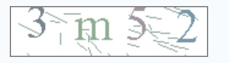
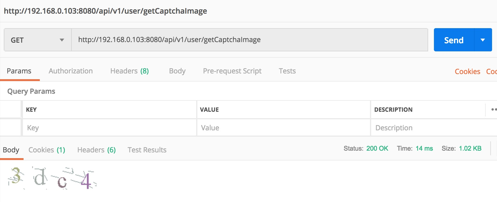
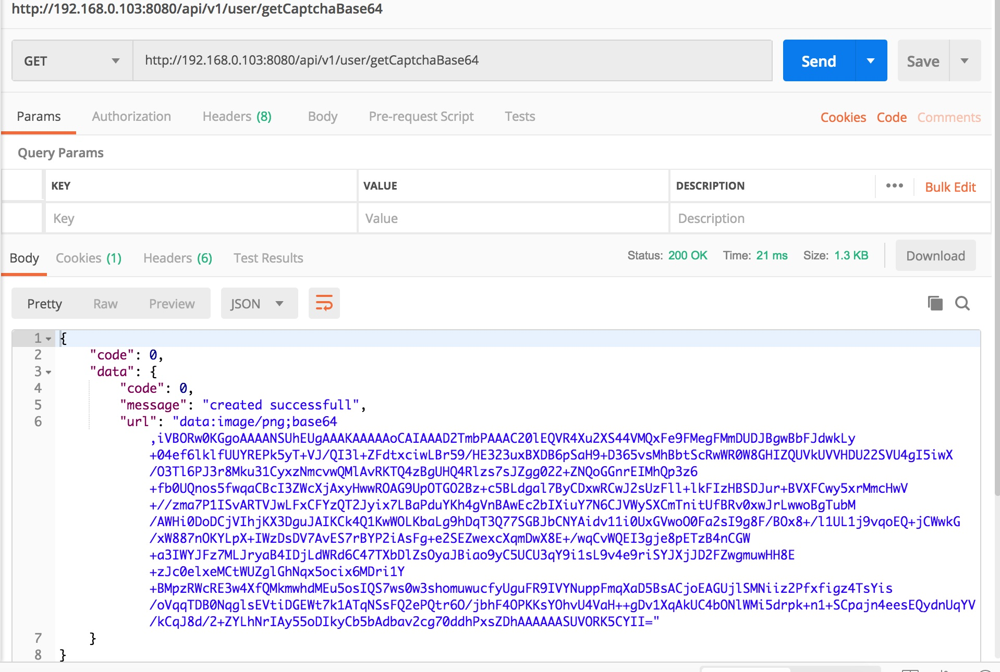
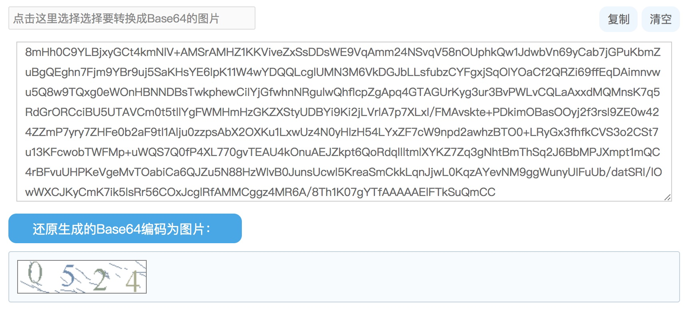

## Spring boot 生成动态验证码并前后端校验

[TOC]

最近需要生成一个动态的验证码，在登录页面使用，并在前后端进行校验；



实现原理：

> 后端生成动态二维码，存储在 session 里面；
>
> 前端调取接口，展示在登录页面；
>
> 前端登录时候，把验证码传给后端，后端和 session 里面的值进行对比。

### 1 生成动态验证码图片

新建一个 `class`类 `ValidateCode`:

```java
package hello;

import org.apache.commons.io.FileUtils;

import javax.imageio.ImageIO;
import javax.servlet.http.HttpServletRequest;
import javax.servlet.http.HttpServletResponse;
import javax.servlet.http.HttpSession;
import java.awt.*;
import java.awt.image.BufferedImage;
import java.io.ByteArrayOutputStream;
import java.io.IOException;
import java.util.Base64;
import java.util.HashMap;
import java.util.Map;
import java.util.Random;

//  生成随机验证码
public class ValidateCode {
    
    private static Random random = new Random();
    private int width = 160;// 宽
    private int height = 40;// 高
    private int lineSize = 30;// 干扰线数量
    private int stringNum = 4;//随机产生字符的个数
    
    private String randomString = "0123456789abcdefghijklmnopqrstuvwxyz";
    
    private final String sessionKey = "RANDOMKEY";
    
    
    /*
     *  获取字体
     */
    private Font getFont() {
        return new Font("Times New Roman", Font.ROMAN_BASELINE, 40);
    }
    
    /*
     *  获取颜色
     */
    private static Color getRandomColor(int fc, int bc) {
        
        fc = Math.min(fc, 255);
        bc = Math.min(bc, 255);
        
        int r = fc + random.nextInt(bc - fc - 16);
        int g = fc + random.nextInt(bc - fc - 14);
        int b = fc + random.nextInt(bc - fc - 12);
        
        return new Color(r, g, b);
    }
    
    /*
     *  绘制干扰线
     */
    private void drawLine(Graphics g) {
        int x = random.nextInt(width);
        int y = random.nextInt(height);
        int xl = random.nextInt(20);
        int yl = random.nextInt(10);
        g.drawLine(x, y, x + xl, y + yl);
    }
    
    /*
     *  获取随机字符
     */
    private String getRandomString(int num) {
        num = num > 0 ? num : randomString.length();
        return String.valueOf(randomString.charAt(random.nextInt(num)));
    }
    
    /*
     *  绘制字符串
     */
    private String drawString(Graphics g, String randomStr, int i) {
        g.setFont(getFont());
        g.setColor(getRandomColor(108, 190));
        System.out.println(random.nextInt(randomString.length()));
        String rand = getRandomString(random.nextInt(randomString.length()));
        randomStr += rand;
        g.translate(random.nextInt(3), random.nextInt(6));
        g.drawString(rand, 40 * i + 10, 25);
        return randomStr;
    }
    
    /*
     *  生成随机图片
     */
     public void getRandomCodeImage(HttpServletRequest request, HttpServletResponse response) {
        HttpSession session = request.getSession();
        // BufferedImage类是具有缓冲区的Image类,Image类是用于描述图像信息的类
        BufferedImage image = new BufferedImage(width, height, BufferedImage.TYPE_INT_BGR);
        Graphics g = image.getGraphics();
        g.fillRect(0, 0, width, height);
        g.setColor(getRandomColor(105, 189));
        g.setFont(getFont());
        
        // 绘制干扰线
        for (int i = 0; i < lineSize; i++) {
            drawLine(g);
        }
        
        // 绘制随机字符
        String random_string = "";
        for (int i = 0; i < stringNum; i++) {
            random_string = drawString(g, random_string, i);
        }
        
        System.out.println(random_string);
        
        g.dispose();
        
        session.removeAttribute(sessionKey);
        session.setAttribute(sessionKey, random_string);
        
        String base64String = "";
        try {
            //  直接返回图片
           ImageIO.write(image, "PNG", response.getOutputStream());   
            
        } catch (Exception e) {
            e.printStackTrace();
        }
    }  
    
}
```

接下来写个 `Controller` ,	提供个接口给前端：

```java
package hello;

import org.springframework.web.bind.annotation.RequestMapping;
import org.springframework.web.bind.annotation.ResponseBody;
import org.springframework.web.bind.annotation.RestController;

import javax.servlet.http.HttpServletRequest;
import javax.servlet.http.HttpServletResponse;
import java.util.HashMap;
import java.util.Map;

@RestController
@RequestMapping("/api/v1/user")
public class ValidateCodeController {
        
    
    // 生成验证码图片
    @RequestMapping("/getCaptchaImage")
    @ResponseBody
    public void getCaptcha(HttpServletRequest request, HttpServletResponse response) {
        
        try {
            
            response.setContentType("image/png");
            response.setHeader("Cache-Control", "no-cache");
            response.setHeader("Expire", "0");
            response.setHeader("Pragma", "no-cache");
            
            ValidateCode validateCode = new ValidateCode();
            
            // 直接返回图片
            validateCode.getRandomCodeImage(request, response);
            
        } catch (Exception e) {
            System.out.println(e);
        }
        
    }
    
}

```

### 2 前端调取接口


结果如图：




### 3 返回 base64 字符串

有时候我们不能直接返回图片，需要返回一个 json 的数据比如：




这时候我们就需要把 `image` 转化为 `base64`；

具体代码如下：

在之前的 `ValidateCode`	类中添加一个方法：

```java
		/*
     *  生成随机图片，返回 base64 字符串
     */
    public String getRandomCodeBase64(HttpServletRequest request, HttpServletResponse response) {
        HttpSession session = request.getSession();
        // BufferedImage类是具有缓冲区的Image类,Image类是用于描述图像信息的类
        BufferedImage image = new BufferedImage(width, height, BufferedImage.TYPE_INT_BGR);
        Graphics g = image.getGraphics();
        g.fillRect(0, 0, width, height);
        g.setColor(getRandomColor(105, 189));
        g.setFont(getFont());
        
        // 绘制干扰线
        for (int i = 0; i < lineSize; i++) {
            drawLine(g);
        }
        
        // 绘制随机字符
        String random_string = "";
        for (int i = 0; i < stringNum; i++) {
            random_string = drawString(g, random_string, i);
        }
        
        System.out.println(random_string);
        
        g.dispose();
        
        session.removeAttribute(sessionKey);
        session.setAttribute(sessionKey, random_string);
        
        String base64String = "";
        try {
            //  直接返回图片
            //  ImageIO.write(image, "PNG", response.getOutputStream());
            //返回 base64
            ByteArrayOutputStream bos = new ByteArrayOutputStream();
            ImageIO.write(image, "PNG", bos);
            
            byte[] bytes = bos.toByteArray();
            Base64.Encoder encoder = Base64.getEncoder();
            base64String = encoder.encodeToString(bytes);
            
        } catch (Exception e) {
            e.printStackTrace();
        }
        
        return base64String;
    }
```

在 Controller 添加另外一个路由接口：

```java
// 生成验证码,返回的是 base64
    @RequestMapping("/getCaptchaBase64")
    @ResponseBody
    public Object getCaptchaBase64(HttpServletRequest request, HttpServletResponse response) {
        
        Map result = new HashMap();
        Response response1 = new Response();
        
        try {
            
            response.setContentType("image/png");
            response.setHeader("Cache-Control", "no-cache");
            response.setHeader("Expire", "0");
            response.setHeader("Pragma", "no-cache");
            
            ValidateCode validateCode = new ValidateCode();
            
            // 直接返回图片
            // validateCode.getRandomCode(request, response);
            
            // 返回base64
            String base64String = validateCode.getRandomCodeBase64(request, response);
            result.put("url", "data:image/png;base64," + base64String);
            result.put("message", "created successfull");
            System.out.println("test=" + result.get("url"));
            response1.setData(0, result);
            
        } catch (Exception e) {
            System.out.println(e);
        }
        
        return response1.getResult();
    }
```

调用结果：




在前端页面中，只要把 `URL` 放到 `image` 的 `URL` 中，即可显示，这里不再演示。

### 3 验证验证码


