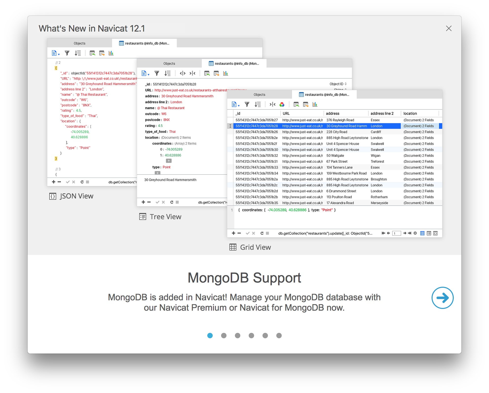
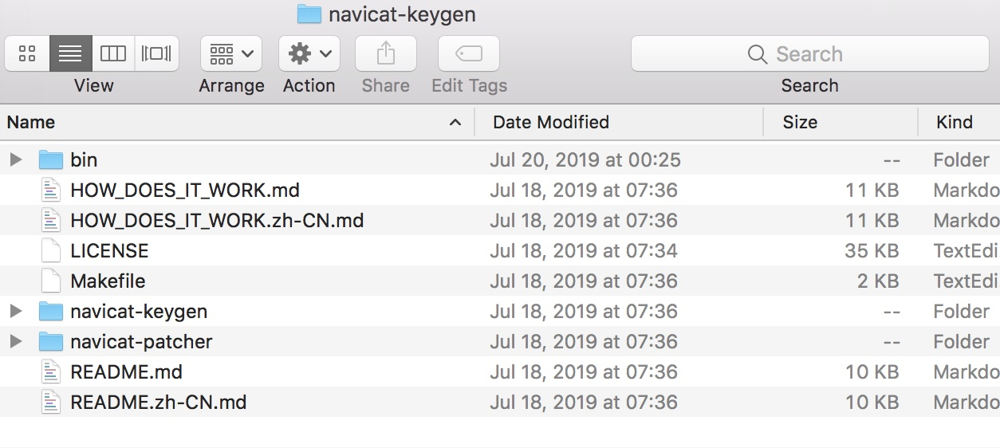
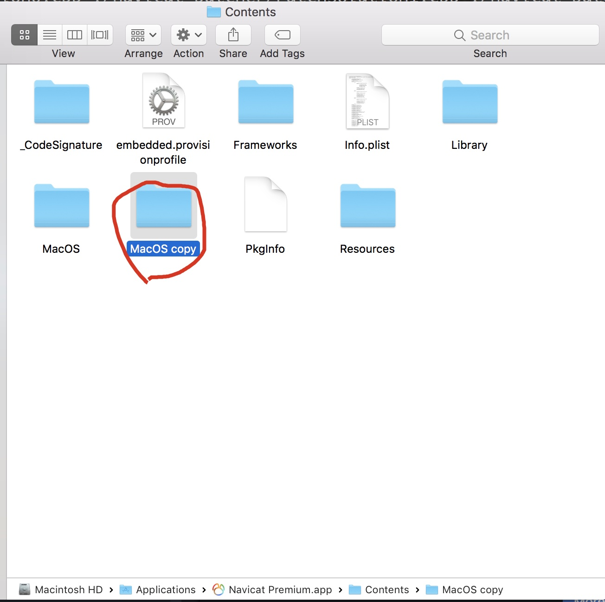
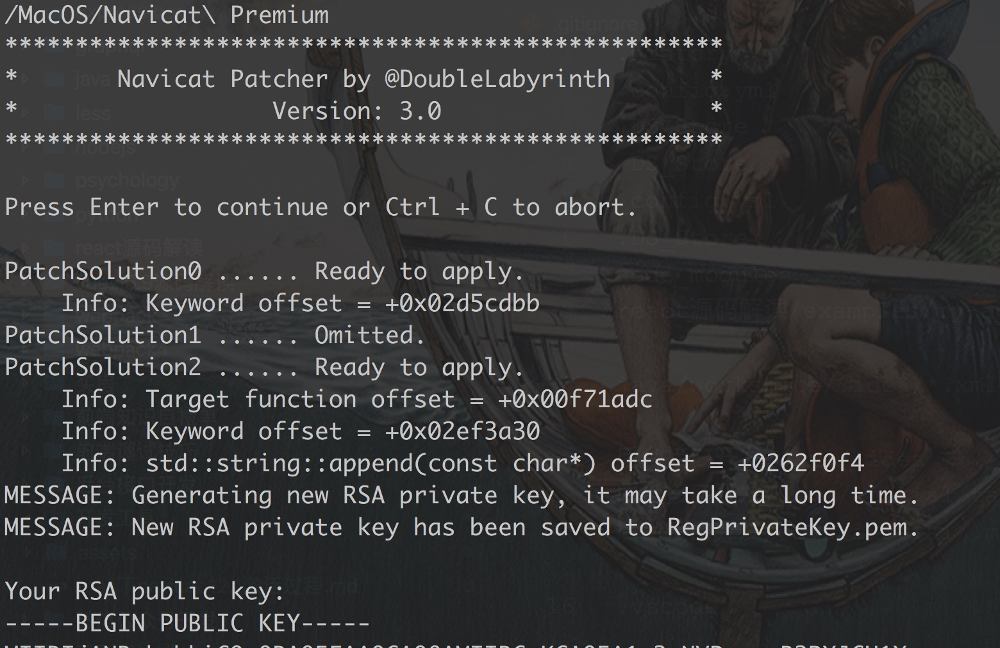
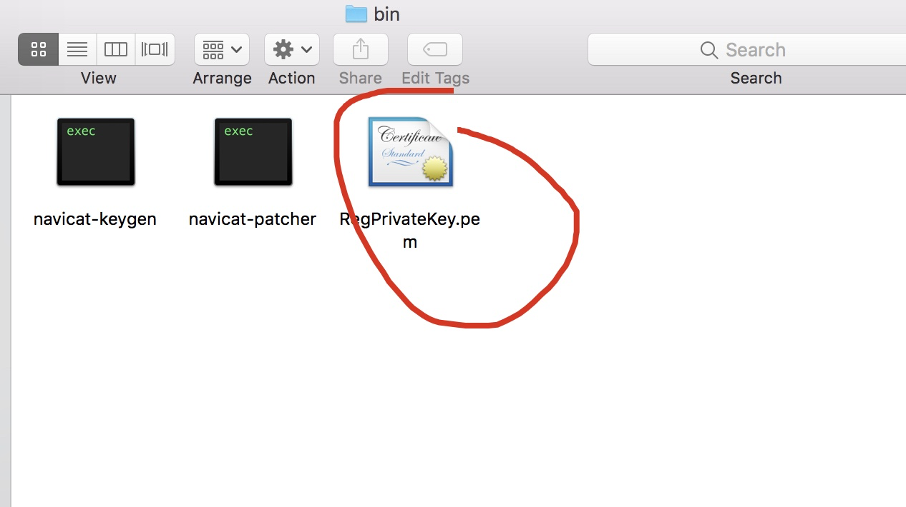
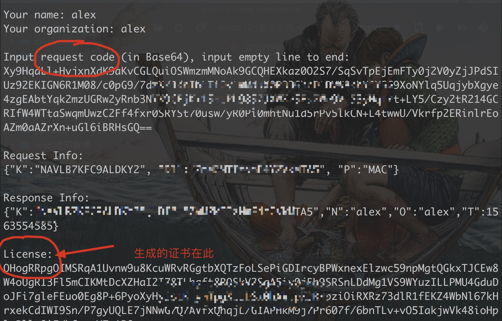
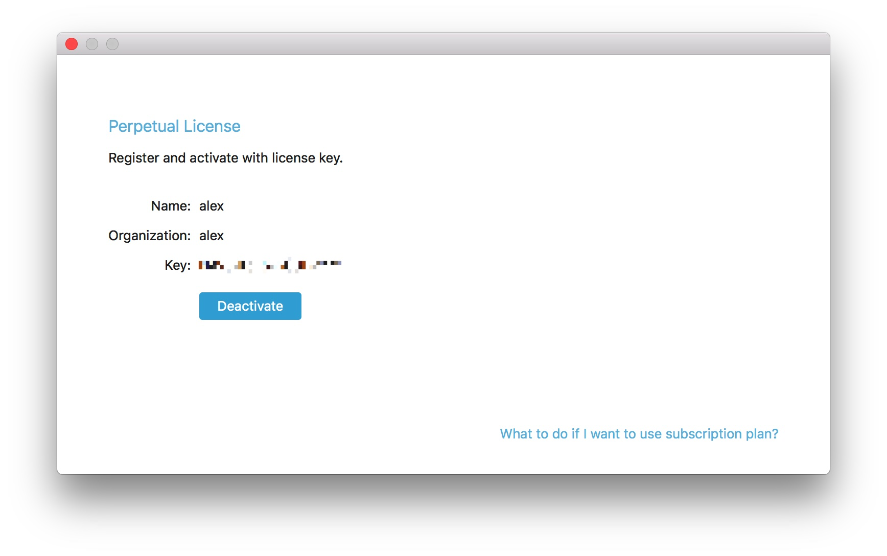

## Mac下Navicat Premium 12.1如何安装与激活

[TOC]
###1 下载

下载地址 [https://www.navicat.com/en/products]()

`mac`安装过程省略，一直按照下去最后放到`Application`即可；



### 2 破解

本次的破解使用的是 [navicat-keygen](https://github.com/DoubleLabyrinth/navicat-keygen)

#### 1)下载 `Navicat-keygen` 项目

```bash
alex:projects $ git clone https://github.com/DoubleLabyrinth/navicat-keygen
```



#### 2) 进入项目

```bash
alex:projects $ cd navicat-keygen/
```

#### 3) 切换 `mac` 分支

```bash
alex:navicat-keygen $ git checkout mac
```

#### 4) 编译前准备

```bash
$ brew install openssl
$ brew install capstone
$ brew install keystone
$ brew install rapidjson
```

#### 5) 进入到`navicat-patcher` 并编译

```bash
alex:navicat-keygen $ make all
//编译之后，会有着两个文件
alex:navicat-keygen $ ls bin
navicat-keygen	navicat-patcher
```

#### 6) 编译好`navicat-keygen`, `navicat-patcher`之后，记得备份你的app



甚至备份整个 `Contents`，都可以。

#### 7) 使用`navicat-patcher`替换掉公钥：

```
Usage:
    navicat-patcher <navicat executable file> [RSA-2048 PrivateKey(PEM file)]
```

- `<navicat executable file>`: Navicat可执行文件的路径。

  **这个参数必须指定。**

- `[RSA-2048 PrivateKey(PEM file)]`: RSA-2048私钥文件的路径。

  **这个参数是可选的。** 如果没有指定，`navicat-patcher`将会在当前目录下生成一个新的RSA-2048私钥文件`RegPrivateKey.pem`。

我使用最简单的用法，不指定：

```bash
alex:navicat-keygen $ cd bin
alex:bin $ ls
navicat-keygen	navicat-patcher
alex:bin $ ./navicat-patcher /Applications/Navicat\Premium.app/Contents/MacOS/Navicat\ Premium
```



如上图：这只是样例生成`RSA public key`一部分。

在`bin`里面生成了`RegPrivateKey.pem`




**仅对 Navicat Premium 版本 < 12.0.24 的说明：**

如果你的Navicat版本小于12.0.24，那么`navicat-patcher`将会终止并且不会修改目标文件。

你必须使用openssl生成`RegPrivateKey.pem`和`rpk`文件：

```bash
$ openssl genrsa -out RegPrivateKey.pem 2048
$ openssl rsa -in RegPrivateKey.pem -pubout -out rpk
```

接着用刚生成的`rpk`文件替换

```bash
/Applications/Navicat Premium.app/Contents/Resources/rpk
```


#### 8) 重要的一步：**生成一份自签名的代码证书，并总是信任该证书**

**用codesign对Navicat Premium.app重签名**

```bash
$ codesign -f -s "Your self-signed code-sign certificate name" <path to Navicat Premium.app>
```

**注意：**

"Your self-signed code-sign certificate name"是你证书的名字，不是路径。

**例如：**

```bash
alex:bin $ codesign -f -s "master" /Applications/Navicat\ Premium.app/
```

#### 9) 接下来使用`navicat-keygen`来生成 **序列号** 和 **激活码**

```
Usage:
    navicat-keygen <RSA-2048 PrivateKey(PEM file)>
```

- `<RSA-2048 PrivateKey(PEM file)>`: RSA-2048私钥文件的路径。

  **这个参数必须指定。**

**例如：**

```bash
alex:bin $ ./navicat-keygen ./RegPrivateKey.pem
Which is your Navicat Premium language?
0. English
1. Simplified Chinese
2. Traditional Chinese
3. Japanese
4. Polish
5. Spanish
6. French
7. German
8. Korean
9. Russian
10. Portuguese

(Input index)> 0
(Input major version number, range: 0 ~ 15, default: 12)> 12

Serial number:
N6VM-YWXC-8ZJU-99VH

Your name:
```

你可以使用这个 **序列号** 暂时激活Navicat。

接下来你会被要求输入`用户名`和`组织名`；请随便填写，但不要太长

```bash
Your name: alex
Your organization: alex

Input request code (in Base64), input empty line to end:
```

之后你会被要求填入请求码。注意 **不要关闭注册机**.

#### 10) 手动激活

**断开网络** 并打开Navicat。找到`注册`窗口，填入注册机给你的序列号。然后点击`激活`按钮

一般来说在线激活肯定会失败，这时候Navicat会询问你是否`手动激活`，直接选

在`手动激活`窗口你会得到一个请求码，复制它并把它粘贴到keygen里。最后别忘了连按至少两下回车结束输入



#### 11) 成功激活

如果不出意外，你会得到一个看似用`Base64`编码的激活码。直接复制它，并把它粘贴到`Navicat`的`手动激活`窗口，最后点`激活`按钮。如果没什么意外的话应该能`成功激活`



