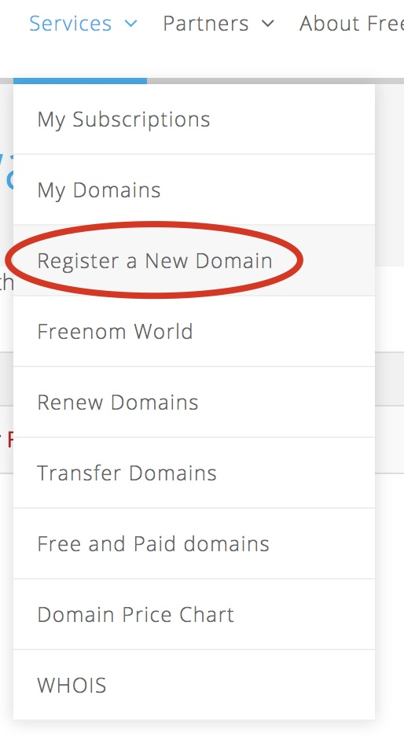
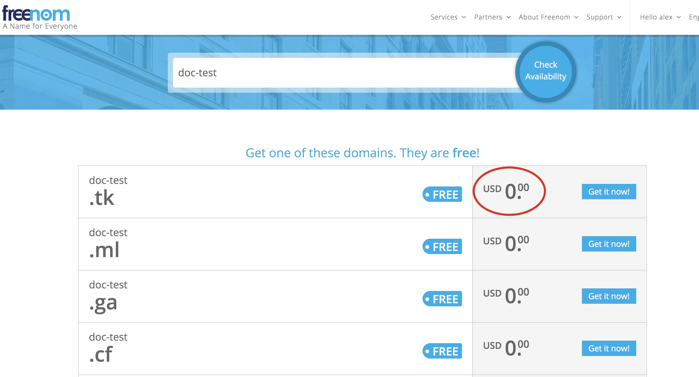
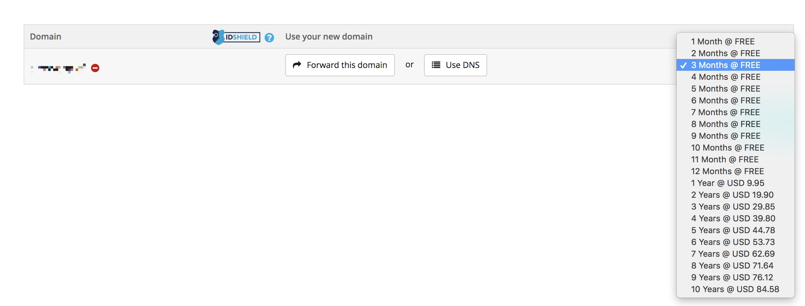
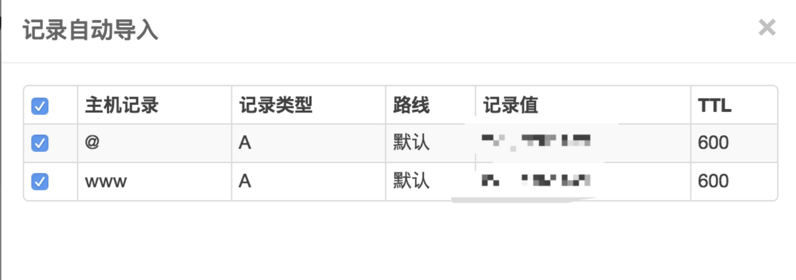
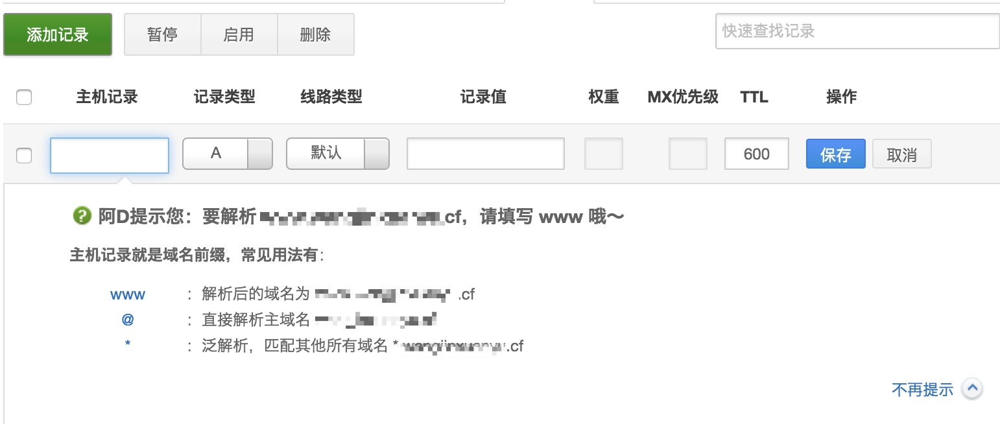
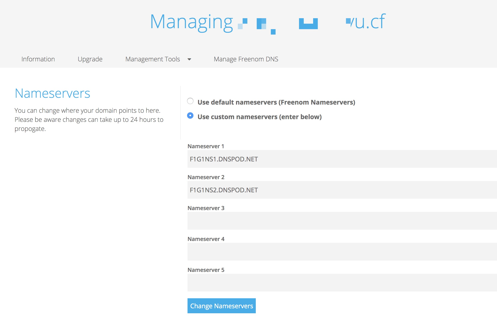
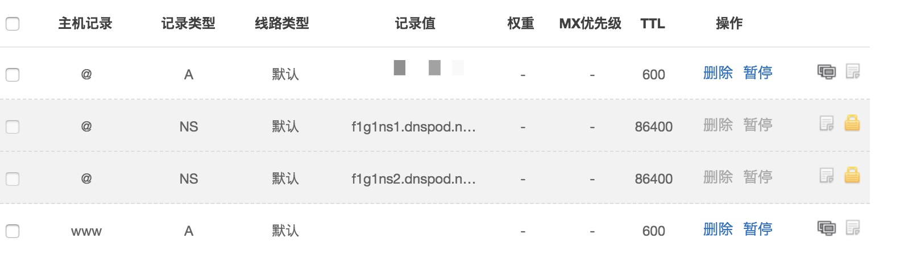

## 搭建网站
[TOC]

### 1 申请免费域名

可以到 [freenom]([https://www.freenom.com](https://www.freenom.com/)) 申请免费或者便宜的域名

注册 or 登陆一个账号…...

后缀`Tk\ml\ga\cf` 大多可以免费申请到，如果想要一些付费的 `com\cn`, 也可以购买。

然后 `Get it now`, 在购物车里就可以看到：

免费使用最大时间是`12months`, 如果再久就需要付费了。

### 2 域名解析

域名解析的话，国内的解析提供商我们一般用 DNSPod，国外的解析服务提供商一般用 CloudFlare，操作都大同小异，接下来以 dynadot 和 DNSPod 为例，讲解一下域名解析。

首先我们打开 DNSPod 的网站：[www.dnspod.cn](https://www.dnspod.cn/)，如果没有账户，注册一个然后进行登陆。

登陆之后，添加我们要解析的域名。如图所示。

然后检查是否要导入它自动扫描的解析记录，如果不是我们添加的，一般不导入

我们选择取消，不导入，然后进入下一步，添加记录。

如上图所示，最基本的话我们需要添加两条记录，一条是 WWW，一条是 @，这两条记录分别添加，记录类型都选择 A，线路类型选择默认即可，记录值填入你的服务器 IP 地址，权重和 MX优先级不用写，TTL 就默认的 600 就行，然后点击保存;

两条记录添加完后，我们再到域名注册商那边修改 `NameServer`。

我们需要返回到 `freenom`;

在菜单中找到 `my domains`，然后点击你的域名，找到管理 `name servers`:

之后我们输入 `DNSPod` 的 `NameServer`，也就是：

- f1g1ns1.dnspod.net
- f1g1ns2.dnspod.net

修改完之后点击 `Save` 之类的按钮，保存即可。

至此，我们已经完成了整个解析过程，接下来需要做的就是等待解析生效，这个时间一般需要几分钟到十几个小时，取决于之前设置的 TTL。所以我们一般不建议把 TTL 设置的过大，默认即可。一般来说几分钟就能生效，如果几天还不生效，那多半是本地有了 DNS 缓存，我们可以清理一下缓存即可。

之后的话，域名解析完成了，就可以上传网站文件;

