## Nodejs获取微信签名并使用JSSDK

[TOC]

上一篇我们讲了基本的准备工作，接下来，进入实战，由于楼主我并没有`备案过的域名`（穷，没钱，没办法哈），还好, 一直通不过`签名验证`，微信比较人性化，提供`测试号`，可以测大部分的接口，并且设置`JS接口安全域名`,没有限制，可以写任何地址，哪怕是`localhost:9999`也是可以的。

### 1、接口测试号申请

由于用户体验和安全性方面的考虑，微信公众号的注册有一定门槛，某些高级接口的权限需要微信认证后才可以获取。

所以，为了帮助开发者快速了解和上手微信公众号开发，熟悉各个接口的调用，微信推出了微信公众帐号测试号，通过`手机微信扫描二维码即可获得测试号`，在这个测试号里面可以模拟各种操作，比如分享啥的，很容易通过验证。

[微信JSSDK开发文档](http://mp.weixin.qq.com/wiki/7/aaa137b55fb2e0456bf8dd9148dd613f.html)

[进入微信公众帐号测试号申请系统](https://mp.weixin.qq.com/debug/cgi-bin/sandbox?t=sandbox/login)


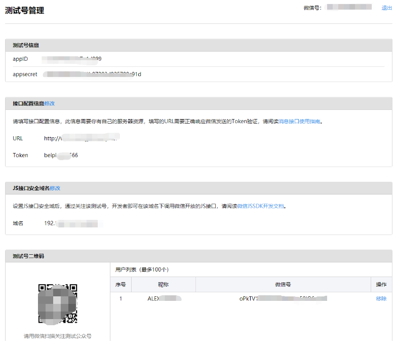


**体验接口权限表**

| 类目                                                         | 功能                                                         | 接口                                                         | 每日调用上限/次                                              | 操作                        |
| :----------------------------------------------------------- | :----------------------------------------------------------- | :----------------------------------------------------------- | :----------------------------------------------------------- | :-------------------------- |
| 对话服务                                                     | 基础支持                                                     | [获取access_token](http://mp.weixin.qq.com/wiki/11/0e4b294685f817b95cbed85ba5e82b8f.html) | 2000                                                         |                             |
| [获取微信服务器IP地址](http://mp.weixin.qq.com/wiki/0/2ad4b6bfd29f30f71d39616c2a0fcedc.html) | 无上限                                                       |                                                              |                                                              |                             |
| 接收消息                                                     | [验证消息真实性](http://mp.weixin.qq.com/wiki/4/2ccadaef44fe1e4b0322355c2312bfa8.html) | 无上限                                                       |                                                              |                             |
| [接收普通消息](http://mp.weixin.qq.com/wiki/10/79502792eef98d6e0c6e1739da387346.html) | 无上限                                                       |                                                              |                                                              |                             |
| [接收事件推送](http://mp.weixin.qq.com/wiki/2/5baf56ce4947d35003b86a9805634b1e.html) | 无上限                                                       |                                                              |                                                              |                             |
| [接收语音识别结果](http://mp.weixin.qq.com/wiki/2/f2bef3230362d18851ee22953abfadde.html) | 无上限                                                       | [关闭](javascript:void(0);)                                  |                                                              |                             |
| 发送消息                                                     | [自动回复](http://mp.weixin.qq.com/wiki/9/2c15b20a16019ae613d413e30cac8ea1.html) | 无上限                                                       |                                                              |                             |
| [客服接口](http://mp.weixin.qq.com/wiki/7/12a5a320ae96fecdf0e15cb06123de9f.html) | 500000                                                       |                                                              |                                                              |                             |
| [群发接口](http://mp.weixin.qq.com/wiki/15/5380a4e6f02f2ffdc7981a8ed7a40753.html) | 详情                                                         |                                                              |                                                              |                             |
| [模板消息（业务通知）](https://mp.weixin.qq.com/debug/cgi-bin/readtmpl?t=tmplmsg/faq_tmpl) | 100000                                                       |                                                              |                                                              |                             |
| 用户管理                                                     | [用户分组管理](http://mp.weixin.qq.com/wiki/index.php?title=分组管理接口) | 详情                                                         |                                                              |                             |
| [设置用户备注名](http://mp.weixin.qq.com/wiki/index.php?title=设置用户备注名接口) | 10000                                                        |                                                              |                                                              |                             |
| [获取用户基本信息](http://mp.weixin.qq.com/wiki/index.php?title=获取用户基本信息) | 500000                                                       |                                                              |                                                              |                             |
| [获取用户列表](http://mp.weixin.qq.com/wiki/index.php?title=获取关注者列表) | 500                                                          |                                                              |                                                              |                             |
| [获取用户地理位置](http://mp.weixin.qq.com/wiki/index.php?title=获取用户地理位置) | 无上限                                                       | [关闭](javascript:void(0);)                                  |                                                              |                             |
| 推广支持                                                     | [生成带参数二维码](http://mp.weixin.qq.com/wiki/index.php?title=生成带参数的二维码) | 100000                                                       |                                                              |                             |
| [长链接转短链接接口](http://mp.weixin.qq.com/wiki/10/165c9b15eddcfbd8699ac12b0bd89ae6.html) | 1000                                                         |                                                              |                                                              |                             |
| 界面丰富                                                     | [自定义菜单](http://mp.weixin.qq.com/wiki/index.php?title=自定义菜单创建接口) | 详情                                                         |                                                              |                             |
| 素材管理                                                     | [素材管理接口](http://mp.weixin.qq.com/wiki/5/963fc70b80dc75483a271298a76a8d59.html) | 详情                                                         |                                                              |                             |
| 功能服务                                                     | 智能接口                                                     | [语义理解接口](http://mp.weixin.qq.com/wiki/index.php?title=接收语音识别结果) | 1000                                                         |                             |
| 设备功能                                                     | [设备功能接口](http://mp.weixin.qq.com/wiki/5/131b418c04b1f4fc1752f7652b14b235.html) | 无上限                                                       | [设置 ](http://hw.weixin.qq.com/mpplugin/test/entrance?ticket=DeD1xU-wXzR5ydymLEBPxeHwzC_lumOq5LrdXFowfGY) [关闭](javascript:void(0);) |                             |
| 多客服                                                       | [获取客服聊天记录](http://mp.weixin.qq.com/wiki/19/7c129ec71ddfa60923ea9334557e8b23.html) | 5000                                                         |                                                              |                             |
| [客服管理](http://mp.weixin.qq.com/wiki/9/6fff6f191ef92c126b043ada035cc935.html) | 详情                                                         |                                                              |                                                              |                             |
| [会话控制](http://mp.weixin.qq.com/wiki/9/6fff6f191ef92c126b043ada035cc935.html) | 详情                                                         |                                                              |                                                              |                             |
| 网页服务                                                     | 网页帐号                                                     | [网页授权获取用户基本信息](http://mp.weixin.qq.com/wiki/17/c0f37d5704f0b64713d5d2c37b468d75.html) | 无上限                                                       | [修改](javascript:void(0);) |
| 基础接口                                                     | [判断当前客户端版本是否支持指定JS接口](http://mp.weixin.qq.com/wiki/7/aaa137b55fb2e0456bf8dd9148dd613f.html) | 无上限                                                       |                                                              |                             |
| 分享接口                                                     | [获取“分享到朋友圈”按钮点击状态及自定义分享内容接口](http://mp.weixin.qq.com/wiki/7/aaa137b55fb2e0456bf8dd9148dd613f.html) | 无上限                                                       |                                                              |                             |
| [获取“分享给朋友”按钮点击状态及自定义分享内容接口](http://mp.weixin.qq.com/wiki/7/aaa137b55fb2e0456bf8dd9148dd613f.html) | 无上限                                                       |                                                              |                                                              |                             |
| [获取“分享到QQ”按钮点击状态及自定义分享内容接口](http://mp.weixin.qq.com/wiki/7/aaa137b55fb2e0456bf8dd9148dd613f.html) | 无上限                                                       |                                                              |                                                              |                             |
| [获取“分享到腾讯微博”按钮点击状态及自定义分享内容接口](http://mp.weixin.qq.com/wiki/7/aaa137b55fb2e0456bf8dd9148dd613f.html) | 无上限                                                       |                                                              |                                                              |                             |
| 图像接口                                                     | [拍照或从手机相册中选图接口](http://mp.weixin.qq.com/wiki/7/aaa137b55fb2e0456bf8dd9148dd613f.html) | 无上限                                                       |                                                              |                             |
| [预览图片接口](http://mp.weixin.qq.com/wiki/7/aaa137b55fb2e0456bf8dd9148dd613f.html) | 无上限                                                       |                                                              |                                                              |                             |
| [上传图片接口](http://mp.weixin.qq.com/wiki/7/aaa137b55fb2e0456bf8dd9148dd613f.html) | 无上限                                                       |                                                              |                                                              |                             |
| [下载图片接口](http://mp.weixin.qq.com/wiki/7/aaa137b55fb2e0456bf8dd9148dd613f.html) | 无上限                                                       |                                                              |                                                              |                             |
| 音频接口                                                     | [开始录音接口](http://mp.weixin.qq.com/wiki/7/aaa137b55fb2e0456bf8dd9148dd613f.html) | 无上限                                                       |                                                              |                             |
| [停止录音接口](http://mp.weixin.qq.com/wiki/7/aaa137b55fb2e0456bf8dd9148dd613f.html) | 无上限                                                       |                                                              |                                                              |                             |
| [播放语音接口](http://mp.weixin.qq.com/wiki/7/aaa137b55fb2e0456bf8dd9148dd613f.html) | 无上限                                                       |                                                              |                                                              |                             |
| [暂停播放接口](http://mp.weixin.qq.com/wiki/7/aaa137b55fb2e0456bf8dd9148dd613f.html) | 无上限                                                       |                                                              |                                                              |                             |
| [停止播放接口](http://mp.weixin.qq.com/wiki/7/aaa137b55fb2e0456bf8dd9148dd613f.html) | 无上限                                                       |                                                              |                                                              |                             |
| [上传语音接口](http://mp.weixin.qq.com/wiki/7/aaa137b55fb2e0456bf8dd9148dd613f.html) | 无上限                                                       |                                                              |                                                              |                             |
| [下载语音接口](http://mp.weixin.qq.com/wiki/7/aaa137b55fb2e0456bf8dd9148dd613f.html) | 无上限                                                       |                                                              |                                                              |                             |
| 智能接口                                                     | [识别音频并返回识别结果接口](http://mp.weixin.qq.com/wiki/7/aaa137b55fb2e0456bf8dd9148dd613f.html) | 无上限                                                       |                                                              |                             |
| 设备信息                                                     | [获取网络状态接口](http://mp.weixin.qq.com/wiki/7/aaa137b55fb2e0456bf8dd9148dd613f.html) | 无上限                                                       |                                                              |                             |
| 地理位置                                                     | [使用微信内置地图查看位置接口](http://mp.weixin.qq.com/wiki/7/aaa137b55fb2e0456bf8dd9148dd613f.html) | 无上限                                                       |                                                              |                             |
| [获取地理位置接口](http://mp.weixin.qq.com/wiki/7/aaa137b55fb2e0456bf8dd9148dd613f.html) | 无上限                                                       |                                                              |                                                              |                             |
| 界面操作                                                     | [隐藏右上角菜单接口](http://mp.weixin.qq.com/wiki/7/aaa137b55fb2e0456bf8dd9148dd613f.html) | 无上限                                                       |                                                              |                             |
| [显示右上角菜单接口](http://mp.weixin.qq.com/wiki/7/aaa137b55fb2e0456bf8dd9148dd613f.html) | 无上限                                                       |                                                              |                                                              |                             |
| [关闭当前网页窗口接口](http://mp.weixin.qq.com/wiki/7/aaa137b55fb2e0456bf8dd9148dd613f.html) | 无上限                                                       |                                                              |                                                              |                             |
| [批量隐藏功能按钮接口](http://mp.weixin.qq.com/wiki/7/aaa137b55fb2e0456bf8dd9148dd613f.html) | 无上限                                                       |                                                              |                                                              |                             |
| [批量显示功能按钮接口](http://mp.weixin.qq.com/wiki/7/aaa137b55fb2e0456bf8dd9148dd613f.html) | 无上限                                                       |                                                              |                                                              |                             |
| [隐藏所有非基础按钮接口](http://mp.weixin.qq.com/wiki/7/aaa137b55fb2e0456bf8dd9148dd613f.html) | 无上限                                                       |                                                              |                                                              |                             |
| [显示所有功能按钮接口](http://mp.weixin.qq.com/wiki/7/aaa137b55fb2e0456bf8dd9148dd613f.html) | 无上限                                                       |                                                              |                                                              |                             |

### 2、获取 `access_token` 访问令牌

> access_token`（有效期`7200秒`，开发者必须在自己的服务全局缓存`access_token`）

```javascript
https请求方式: GET
https://api.weixin.qq.com/cgi-bin/token?grant_type=client_credential&appid=APPID&secret=APPSECRET
```

**参数说明**

| 参数       | 是否必须 | 说明                                  |
| :--------- | :------- | :------------------------------------ |
| grant_type | 是       | 获取access_token填写client_credential |
| appid      | 是       | 第三方用户唯一凭证                    |
| secret     | 是       | 第三方用户唯一凭证密钥，即appsecret   |

**返回说明**

正常情况下，微信会返回下述JSON数据包给公众号：

```
{"access_token":"ACCESS_TOKEN","expires_in":7200}
```

实战项目代码：

> 获取 access_token
>
> `config/index.json:`
>
> 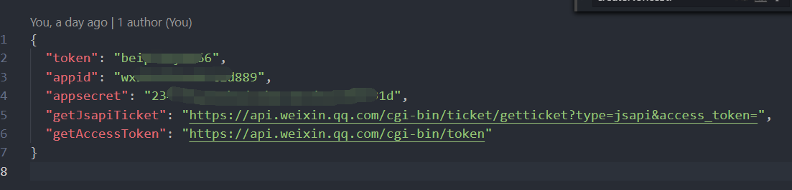

> api/accessToken.js

```javascript
// 获取 access_token
const config = require('../config/index.json'); // 配置数据
const axios = require('axios'); // 请求api
const CircularJSON = require('circular-json');

// (设置 | 获取)缓存方法
const cache = require('../utils/cache');

module.exports = getAccessToken = (res) => {

  const fetchUrl = `${config.getAccessToken}?grant_type=client_credential&appid=${config.appid}&secret=${config.appsecret}`;
  // console.log(fetchUrl, config);

  // 获取缓存
  cache.getCache('access_token', function (cacheValue) {
    // 缓存存在
    if (cacheValue) {
      const result = CircularJSON.stringify({
        access_token: cacheValue,
        from: 'cache'
      });
      res.send(result);
    } else {
      // 调取微信api
      axios.get(fetchUrl).then(response => {
        let json = CircularJSON.stringify(response.data);
				res.send(json);
        // 设置缓存
        if (response.data.access_token) {
          cache.setCache('access_token', response.data.access_token)
        }
      }).catch(err => {
        console.log('axios occurs ', err);
      });
    }
  });

};

```

这里用的 [axios](https://www.npmjs.com/package/axios)请求微信api，获取 `access_token`;

由于`access_token` 只有`7200秒`有效时间，并且限制一天最多调` 2000 次`，所以中控服务器最好作缓存，这里使用的 [node-cache](https://www.npmjs.com/package/node-cache)，做了`access_token`的缓存，并且删除的缓存的时间也设置的是 `7200s`，这样在 `access_token`失效的时候，node缓存也会被删除。

> utils/cache.js

```javascript
// node-cache 保存和获取缓存

const NodeCache = require("node-cache");
const myCache = new NodeCache({
  stdTTL: 7200, // 缓存过期时间
  checkperiod: 120 // 定期检查时间
});


// 设置缓存
var setCache = function (key, value) {
  // 设置缓存
  myCache.set(key, value, function (err, success) {
    if (!err && success) {
      console.log(key + "保存成功", value);
    }
  });
};

// 获取缓存
var getCache = function (key, callback) {
  // 读取缓存
  myCache.get(key, function (err, value) {
    if (!err) {
      if (value) {
        console.log(`存在于缓存中${key}=${value}`);
        callback(value);
      } else {
        console.log(`${key} not found in node-cache`);
        callback();
      }
    } else {
      console.log('get ' + key + ' cache occurs error =', err);
    }
  });
};


module.exports = {
  setCache,
  getCache
}

```

`node-cache`只能存活于当前进程里面，如果当前node命令被重启，将会重新去请求微信服务器，所以不太适合。

这里其实最好存在 `redis`数据库里，

**路由设置：**

> app.js

```javascript
const express = require('express');
const api = require('./api');
const path = require('path');
const app = express();

// accessToken 获取token
app.get('/getAccessToken', (req, res) => {
  api.accessToken(res);
});

....
```

结果：

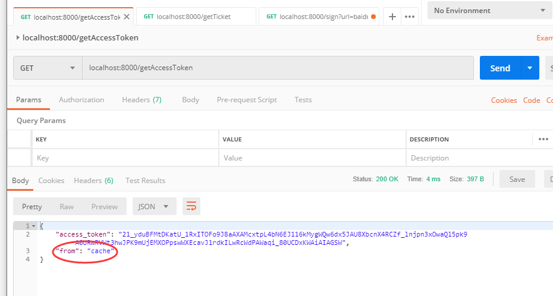

这是第一次请求，`access_token`从微信服务器获取最初的数据。

接下来是第二次请求，`access_token`将会缓存中读取。

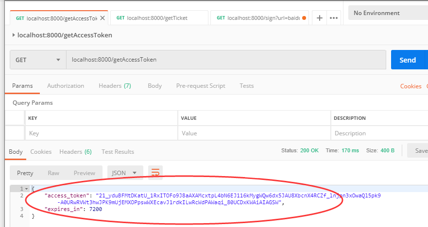

### 3、获取 `jsapi_ticket `临时票据

生成签名之前必须先了解一下`jsapi_ticket`，`jsapi_ticket`是公众号用于调用`微信JS接口`的`临时票据`。正常情况下，`jsapi_ticket`的有效期为`7200`秒，通过`access_token`来获取。由于获取`jsapi_ticket`的api调用次数非常有限，频繁刷新`jsapi_ticket`会导致`api`调用受限，影响自身业务，开发者必须在自己的服务全局缓存`jsapi_ticket `。

> 用上一步拿到的`access_token `采用`http GET`方式请求获得`jsapi_ticket`（有效期7200秒，开发者必须在自己的服务全局缓存`jsapi_ticket`）：<`https://api.weixin.qq.com/cgi-bin/ticket/getticket?access_token=ACCESS_TOKEN&type=jsapi`>

成功返回如下JSON：

```javascript
{
"errcode":0,
"errmsg":"ok",
"ticket":"bxLdikRXVbTPdHSM05e5u5sUoXNKd841ZO3MhKoyN5OfkWITDGgnr2fwJ0m9E8NYzWKVZvdVtaUWvsdshFKA",
"expires_in":7200
}
```

获得`jsapi_ticket`之后，就可以生成`JS-SDK`权限验证的签名了。

回到之前说的那个`Nodejs + Express`项目中：

> api/jsapiTicket.js

```javascript
// 通过 access_token 获取 jsapi_ticket 临时票据
const axios = require('axios'); // 请求api
const CircularJSON = require('circular-json');
const config = require('../config/index.json');
const cache = require('../utils/cache');


module.exports = get_jsapi_ticket = (access_token, res) => {

  const fetchUrl = config.getJsapiTicket + access_token;
  console.log('>>>>', fetchUrl)
  // 判断是否存在于缓存中
  const cacheName = "jsapi_ticket";
  cache.getCache(cacheName, function (cacheValue) {
    if (cacheValue) {
      const result = CircularJSON.stringify({
        ticket: cacheValue,
        from: 'cache'
      });
      res.send(result);
    } else {
      // 调取微信api
      axios.get(fetchUrl).then(response => {
        let json = CircularJSON.stringify(response.data);
        // promise
        res.send(json);
        // 设置缓存
        if (response.data.ticket) {
          cache.setCache(cacheName, response.data.ticket)
        }
      }).catch(err => {
        // console.log('axios occurs ', err);
      });
    }
  });

}

```

路由设置：

```javascript
const express = require('express');
const api = require('./api');
const path = require('path');
const app = express();
//express请求别的路由中间件
require('run-middleware')(app);

// 获取 jsapi_ticket 临时票据
app.get('/getTicket', (req, res) => {
  app.runMiddleware('/getAccessToken', function (code, body, headers) {
    const result = JSON.parse(body);
    console.log('User token:', result.access_token);
    api.jsapiTicket(result.access_token, res);
  })
});

....
```

这里比较特殊的地方，是用 [run-middleware](https://www.npmjs.com/package/run-middleware) 这个 npm package，从一个路由去直接请求另外一个路由的数据。

这样避免重复很多逻辑。我们直接请求路由获取上一步的 access_token;

废话不多说，运行一下：

第一次，是从微信服务器获取 ticket

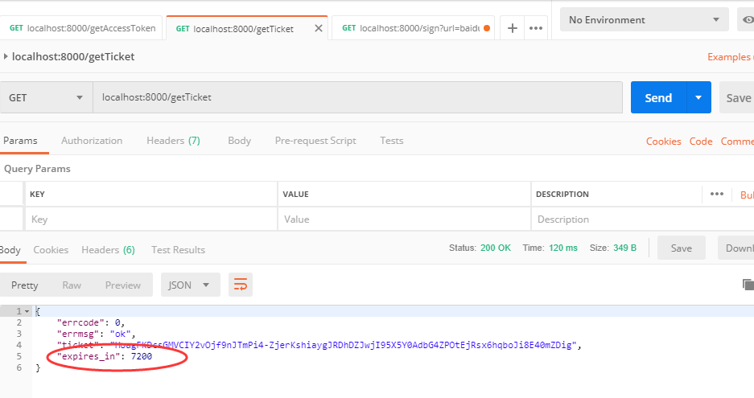

第二次，从缓存中：

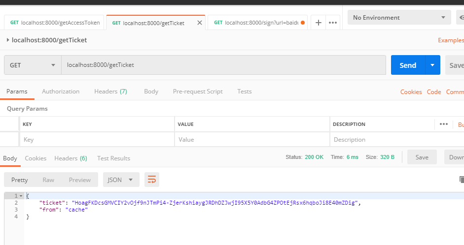


至此，我们获取到了 `jsapi_ticker`;

获得`jsapi_ticket`之后，就可以生成`JS-SDK`权限验证的签名了

### 4、增加签名算法获取微信签名

**签名算法**

> 签名生成规则如下：参与签名的字段包括`noncestr`（随机字符串）, 有效的`jsapi_ticket`, `timestamp`（时间戳）, `url`（当前网页的URL，不包含#及其后面部分） 。对所有待签名参数按照字段名的ASCII 码从小到大排序（字典序）后，使用URL键值对的格式（即`key1=value1&key2=value2…`）拼接成字符串`string1`。这里需要注意的是所有参数名均为小写字符。对`string1`作`sha1`加密，字段名和字段值都采用原始值，不进行URL 转义。

说明：

> `noncestr `随机字符串，一般自己生成
>
> `jsapi_ticket` 从微信服务器或者自己的缓存中
>
> `timestamp `时间戳自己生成
>
> `url `当前页面的`url`，一定要动态获取，千万不要 `hardcode`
>
> 然后再按照字典排序，进行排序  `jsapi_ticket&noncestr&timestamp&url`
>
> 最后`sha1` 加密

即`signature=sha1(string1)`。 示例：

```javascript
noncestr=Wm3WZYTPz0wzccnW
jsapi_ticket=sM4AOVdWfPE4DxkXGEs8VMCPGGVi4C3VM0P37wVUCFvkVAy_90u5h9nbSlYy3
timestamp=1414587457
url=http://mp.weixin.qq.com?params=value
```

步骤1. 对所有待签名参数按照字段名的ASCII 码从小到大排序（字典序）后，使用URL键值对的格式（即`key1=value1&key2=value2…`）拼接成字符串`string1`：

```javascript
jsapi_ticket=sM4AOVdWfPE4DxkXGEs8VMCPGGVi4C3VM0P37wVUCFvkVAy_90u5h9nbSlYy3-Sl-HhTdfl2fzFy1AOcHKP7qg&noncestr=Wm3WZYTPz0wzccnW&timestamp=1414587457&url=http://mp.weixin.qq.com?params=value
```

步骤2. 对`string1`进行`sha1`签名，得到`signature`：

```markdown
0f9de62fce790f9a083d5c99e95740ceb90c27ed
```

注意事项

> 1.签名用的`noncestr`和`timestamp`必须与`wx.config`中的`nonceStr`和`timestamp`相同。
>
> 2.签名用的`url`必须是调用`JS接口页面的完整URL`。
>
> 3.出于安全考虑，开发者必须在服务器端实现签名的逻辑。
>
> 如出现`invalid signature` 等错误详见附录常见错误及解决办法

代码如下：

```javascript
/**
 * 获取签名
 * @returns:
 * 1. appId 必填，公众号的唯一标识
 * 2. timestamp 必填，生成签名的时间戳
 * 3. nonceStr 必填，生成签名的随机串
 * 4. signature 必填，签名
 */
const crypto = require('crypto');
const config = require('../config/index.json');

// sha1加密
function sha1(str) {
  let shasum = crypto.createHash("sha1")
  shasum.update(str)
  str = shasum.digest("hex")
  return str
}

/**
 * 生成签名的时间戳
 * @return {字符串}
 */
function createTimestamp() {
  return parseInt(new Date().getTime() / 1000) + ''
}

/**
 * 生成签名的随机串
 * @return {字符串}
 */
function createNonceStr() {
  return Math.random().toString(36).substr(2, 15)
}

/**
 * 对参数对象进行字典排序
 * @param  {对象} args 签名所需参数对象
 * @return {字符串}    排序后生成字符串
 */
function raw(args) {
  var keys = Object.keys(args)
  keys = keys.sort()
  var newArgs = {}
  keys.forEach(function (key) {
    newArgs[key.toLowerCase()] = args[key]
  })

  var string = ''
  for (var k in newArgs) {
    string += '&' + k + '=' + newArgs[k]
  }
  string = string.substr(1)
  return string
}


module.exports = getSign = (params, res) => {

  /**
   * 签名算法
   * 签名生成规则如下：
   * 参与签名的字段包括noncestr（ 随机字符串）,
   * 有效的jsapi_ticket, timestamp（ 时间戳）,
   * url（ 当前网页的URL， 不包含# 及其后面部分）。
   * 对所有待签名参数按照字段名的ASCII 码从小到大排序（ 字典序） 后，
   *  使用URL键值对的格式（ 即key1 = value1 & key2 = value2…） 拼接成字符串string1。
   * 这里需要注意的是所有参数名均为小写字符。 对string1作sha1加密， 字段名和字段值都采用原始值， 不进行URL 转义。
   */
  var ret = {
    jsapi_ticket: params.ticket,
    nonceStr: createNonceStr(),
    timestamp: createTimestamp(),
    url: params.url
  };
  console.log(params, ret);
  var string = raw(ret)
  ret.signature = sha1(string)
  ret.appId = config.appid;
  console.log('ret', ret)
  res.send(ret);
}

```

路由设置：

```javascript
const express = require('express');
const api = require('./api');
const path = require('path');
const app = express();
//express请求别的路由中间件
require('run-middleware')(app);

//获取签名
app.get('/sign', (req, res) => {
  const params = {};
  console.log(req.query)
  params.url = req.query.url;
  /***
   * runMiddleware 请求别的 endPoint 获取 jsapi_ticket
   */
  app.runMiddleware('/getTicket', function (code, body, headers) {
    const result = JSON.parse(body);
    console.log('User ticket:', result.ticket);
    params.ticket = result.ticket;
    api.getSign(params, res);
  });

});

....
```

 postman 请求如下：

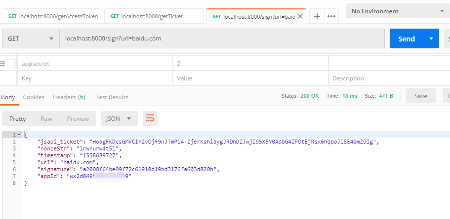

这样我就获取了 签名 等一系列数据。

### 5、JSSDK 使用

[微信JS-SDK说明文档](https://mp.weixin.qq.com/wiki?t=resource/res_main&id=mp1421141115)


 **步骤一：绑定域名**

先登录微信公众平台进入“公众号设置”的“功能设置”里填写“JS接口安全域名”。

备注：登录后可在“开发者中心”查看对应的接口权限。


 **步骤二：引入JS文件**

在需要调用JS接口的页面引入如下JS文件，（支持https）：<http://res.wx.qq.com/open/js/jweixin-1.4.0.js>

如需进一步提升服务稳定性，当上述资源不可访问时，可改访问：<http://res2.wx.qq.com/open/js/jweixin-1.4.0.js> （支持https）。

备注：支持使用 AMD/CMD 标准模块加载方法加载


 **步骤三：通过config接口注入权限验证配置**

所有需要使用JS-SDK的页面必须先注入配置信息，否则将无法调用（同一个url仅需调用一次，对于变化url的SPA的web app可在每次url变化时进行调用,目前Android微信客户端不支持pushState的H5新特性，所以使用pushState来实现web app的页面会导致签名失败，此问题会在Android6.2中修复）。

```javascript
wx.config({
    debug: true, // 开启调试模式,调用的所有api的返回值会在客户端alert出来，若要查看传入的参数，可以在pc端打开，参数信息会通过log打出，仅在pc端时才会打印。
    appId: '', // 必填，公众号的唯一标识
    timestamp: , // 必填，生成签名的时间戳
    nonceStr: '', // 必填，生成签名的随机串
    signature: '',// 必填，签名
    jsApiList: [] // 必填，需要使用的JS接口列表
});
```


**步骤四：通过ready接口处理成功验证**

```javascript
wx.ready(function(){
    // config信息验证后会执行ready方法，所有接口调用都必须在config接口获得结果之后，config是一个客户端的异步操作，所以如果需要在页面加载时就调用相关接口，则须把相关接口放在ready函数中调用来确保正确执行。对于用户触发时才调用的接口，则可以直接调用，不需要放在ready函数中。
});
```

实战代码如下：

```javascript
// promise
const getSignPromise = new Promise((resolve, reject) => {
  const xhr = new XMLHttpRequest();
  xhr.open('GET', location.origin + '/sign?url=' + location.href, true);
  xhr.send();
  xhr.onload = () => {
    if (xhr.readyState === xhr.DONE) {
      if (xhr.status === 200) {
        const result = JSON.parse(xhr.response);
        console.log(result);
        resolve(result);
      }
    }
  }
});

// 分享
getSignPromise.then(res => {
  getWeShare(res);
});

/***
 * 微信分享
 */
const getWeShare = (params) => {
  wx.config({
    debug: true, // 开启调试模式,调用的所有api的返回值会在客户端alert出来，若要查看传入的参数，可以在pc端打开，参数信息会通过log打出，仅在pc端时才会打印。
    appId: params.appId, // 必填，公众号的唯一标识
    timestamp: params.timestamp, // 必填，生成签名的时间戳
    nonceStr: params.nonceStr, // 必填，生成签名的随机串
    signature: params.signature, // 必填，签名
    jsApiList: [
      'checkJsApi',
      'onMenuShareTimeline',
      'onMenuShareAppMessage',
      'onMenuShareQQ',
      'onMenuShareWeibo',
      'hideMenuItems',
      'chooseImage',
      'updateAppMessageShareData',
      'scanQRCode'
    ] // 必填，需要使用的JS接口列表
  });

  wx.ready(function () { //需在用户可能点击分享按钮前就先调用
    const data = {
      title: '测试JSSDK', // 分享标题
      desc: '后端端口签名测试', // 分享描述
      link: location.href, // 分享链接，该链接域名或路径必须与当前页面对应的公众号JS安全域名一致
      imgUrl: 'http://www.***.cf/img/share.JPG', // 分享图标
      success: function () {
        // 设置成功
      }
    }
    wx.onMenuShareTimeline(data);
    wx.onMenuShareAppMessage(data);
  });
}

// 打开相册
document.getElementById('chooseImage').addEventListener('click', function (params) {
  wx.chooseImage({
    count: 1, // 默认9
    sizeType: ['original', 'compressed'], // 可以指定是原图还是压缩图，默认二者都有
    sourceType: ['album', 'camera'], // 可以指定来源是相册还是相机，默认二者都有
    success: function (res) {
      var localIds = res.localIds; // 返回选定照片的本地ID列表，localId可以作为img标签的src属性显示图片
      console.log(localIds);
    }
  });
  wx.scanQRCode({
    needResult: 0, // 默认为0，扫描结果由微信处理，1则直接返回扫描结果，
    scanType: ["qrCode", "barCode"], // 可以指定扫二维码还是一维码，默认二者都有
    success: function (res) {
      var result = res.resultStr; // 当needResult 为 1 时，扫码返回的结果
    }
  });
})

```

页面写好之后, 我们可以在 微信开发者工具里面看到：

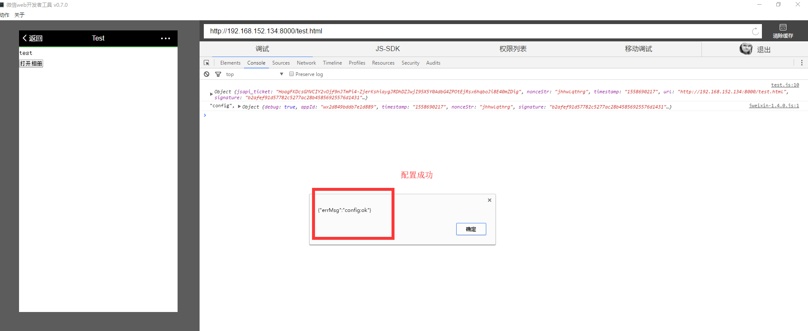

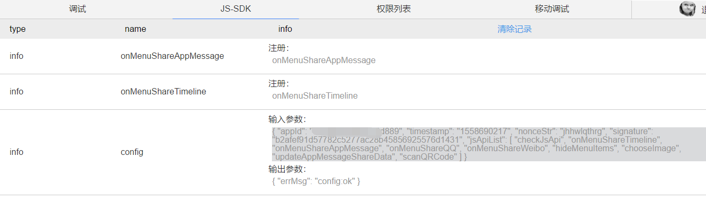

我们也可以打开测试公众号，在里面调试，否则，我们没有权限调取 js 接口

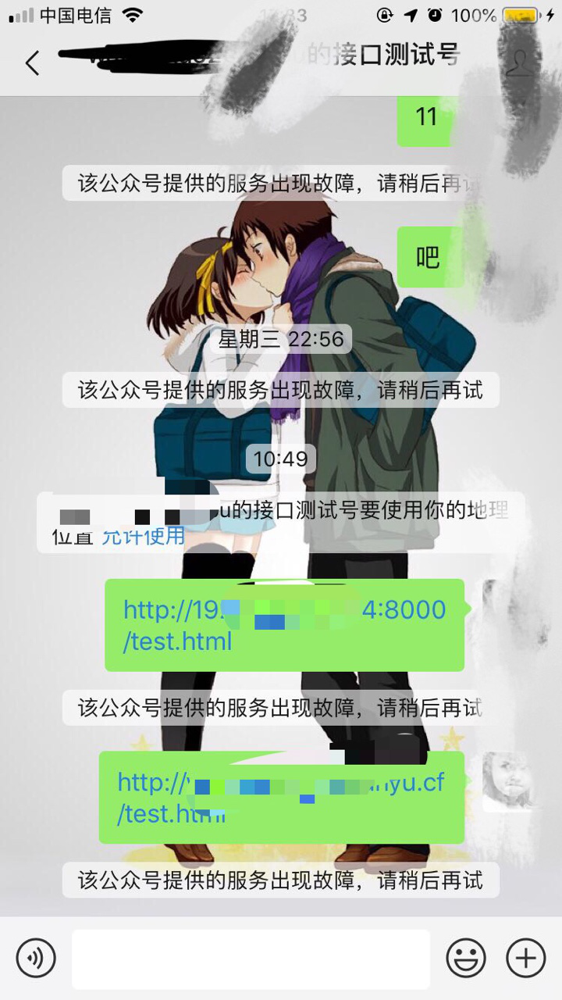

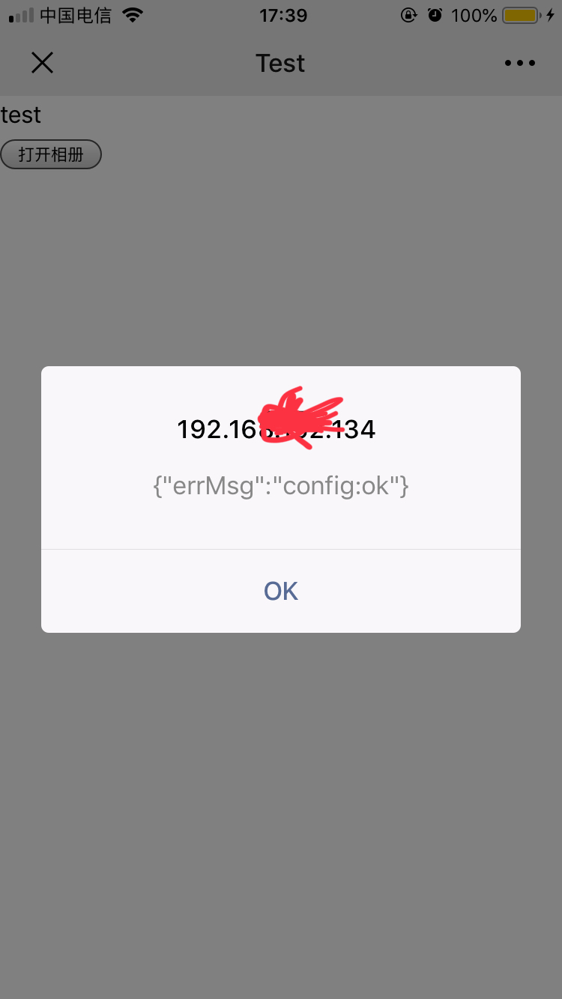


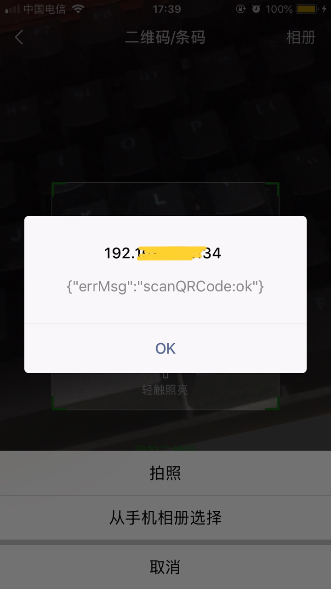

至此，已经算是成功开发了，其他接口不再做尝试。

### 6、附录

调用`config `接口的时候传入参数 `debug: true` 可以开启`debug`模式，页面会`alert`出错误信息。以下为常见错误及解决方法：

1.`invalid url domain`当前页面所在域名与使用的`appid`没有绑定，请确认正确填写绑定的域名，仅支持`80（http）`和`443（https）`两个端口，因此不需要填写端口号（一个appid可以绑定三个有效域名，见 ][目录1.1.1](https://mp.weixin.qq.com/wiki?action=doc&id=mp1421141115&t=0.8486565069939067#2)）。

2.·`invalid signature`签名错误。建议按如下顺序检查：

> 1.确认签名算法正确，可用<http://mp.weixin.qq.com/debug/cgi-bin/sandbox?t=jsapisign> 页面工具进行校验。
>
> 2.确认`config`中`nonceStr`（js中驼峰标准大写S）, `timestamp`与用以签名中的对应`noncestr`, `timestamp`一致。
>
> 3.确认url是页面完整的url(请在当前页面alert(location.href.split('#')[0])确认)，包括'http(s)://'部分，以及'？'后面的GET参数部分,但不包括'#'hash后面的部分。
>
> 4.确认 config 中的 appid 与用来获取 jsapi_ticket 的 appid 一致。
>
> 5.确保一定缓存`access_token`和`jsapi_ticket`。
>
> 6.确保你获取用来签名的url是动态获取的，动态页面可参见实例代码中php的实现方式。如果是html的静态页面在前端通过ajax将url传到后台签名，前端需要用js获取当前页面除去'#'hash部分的链接（可用location.href.split('#')[0]获取,而且需要encodeURIComponent），因为页面一旦分享，微信客户端会在你的链接末尾加入其它参数，如果不是动态获取当前链接，将导致分享后的页面签名失败。

3.the permission value is offline verifying这个错误是因为config没有正确执行，或者是调用的JSAPI没有传入config的jsApiList参数中。建议按如下顺序检查：

> 1.确认config正确通过。
>
> 2.如果是在页面加载好时就调用了JSAPI，则必须写在wx.ready的回调中。
>
> 3.确认config的jsApiList参数包含了这个JSAPI。
>
> 4.permission denied该公众号没有权限使用这个JSAPI，或者是调用的JSAPI没有传入config的jsApiList参数中（部分接口需要认证之后才能使用）。
>
> 5.function not exist当前客户端版本不支持该接口，请升级到新版体验。
>
> 6.为什么6.0.1版本config:ok，但是6.0.2版本之后不ok（因为6.0.2版本之前没有做权限验证，所以config都是ok，但这并不意味着你config中的签名是OK的，请在6.0.2检验是否生成正确的签名以保证config在高版本中也ok。）
>
> 7.在iOS和Android都无法分享（请确认公众号已经认证，只有认证的公众号才具有分享相关接口权限，如果确实已经认证，则要检查监听接口是否在wx.ready回调函数中触发）
>
> 8.服务上线之后无法获取jsapi_ticket，自己测试时没问题。（因为access_token和jsapi_ticket必须要在自己的服务器缓存，否则上线后会触发频率限制。请确保一定对token和ticket做缓存以减少2次服务器请求，不仅可以避免触发频率限制，还加快你们自己的服务速度。目前为了方便测试提供了1w的获取量，超过阀值后，服务将不再可用，请确保在服务上线前一定全局缓存access_token和jsapi_ticket，两者有效期均为7200秒，否则一旦上线触发频率限制，服务将不再可用）。
>
> 9.uploadImage怎么传多图（目前只支持一次上传一张，多张图片需等前一张图片上传之后再调用该接口）
>
> 10.没法对本地选择的图片进行预览（chooseImage接口本身就支持预览，不需要额外支持）
>
> 11.通过a链接(例如先通过微信授权登录)跳转到b链接，invalid signature签名失败（后台生成签名的链接为使用jssdk的当前链接，也就是跳转后的b链接，请不要用微信登录的授权链接进行签名计算，后台签名的url一定是使用jssdk的当前页面的完整url除去'#'部分）
>
> 12.出现config:fail错误（这是由于传入的config参数不全导致，请确保传入正确的appId、timestamp、nonceStr、signature和需要使用的jsApiList）
>
> 13.如何把jsapi上传到微信的多媒体资源下载到自己的服务器（请参见文档中uploadVoice和uploadImage接口的备注说明）
>
> 14.Android通过jssdk上传到微信服务器，第三方再从微信下载到自己的服务器，会出现杂音（微信团队已经修复此问题，目前后台已优化上线）
>
> 15.绑定父级域名，是否其子域名也是可用的（是的，合法的子域名在绑定父域名之后是完全支持的）
>
> 16.在iOS微信6.1版本中，分享的图片外链不显示，只能显示公众号页面内链的图片或者微信服务器的图片，已在6.2中修复
>
> 17.是否需要对低版本自己做兼容（jssdk都是兼容低版本的，不需要第三方自己额外做更多工作，但有的接口是6.0.2新引入的，只有新版才可调用）
>
> 18.该公众号支付签名无效，无法发起该笔交易（请确保你使用的jweixin.js是官方线上版本，不仅可以减少用户流量，还有可能对某些bug进行修复，拷贝到第三方服务器中使用，官方将不对其出现的任何问题提供保障，具体支付签名算法可参考 JSSDK微信支付一栏）
>
> 19.目前Android微信客户端不支持pushState的H5新特性，所以使用pushState来实现web app的页面会导致签名失败，此问题已在Android6.2中修复
>
> 20.uploadImage在chooseImage的回调中有时候Android会不执行，Android6.2会解决此问题，若需支持低版本可以把调用uploadImage放在setTimeout中延迟100ms解决
>
> 21.require subscribe错误说明你没有订阅该测试号，该错误仅测试号会出现
>
> 22.getLocation返回的坐标在openLocation有偏差，因为getLocation返回的是gps坐标，openLocation打开的腾讯地图为火星坐标，需要第三方自己做转换，6.2版本开始已经支持直接获取火星坐标
>
> 23.查看公众号（未添加）: "menuItem:addContact"不显示，目前仅有从公众号传播出去的链接才能显示，来源必须是公众号
>
> 24.ICP备案数据同步有一天延迟，所以请在第二日绑定


 **DEMO页面和示例代码**

**DEMO页面：**

[http://demo.open.weixin.qq.com/jssdk](http://203.195.235.76/jssdk/)


**示例代码：**

<http://demo.open.weixin.qq.com/jssdk/sample.zip>

备注：链接中包含php、java、nodejs以及python的示例代码供第三方参考，第三方切记要对获取的accesstoken以及jsapi_ticket进行缓存以确保不会触发频率限制。