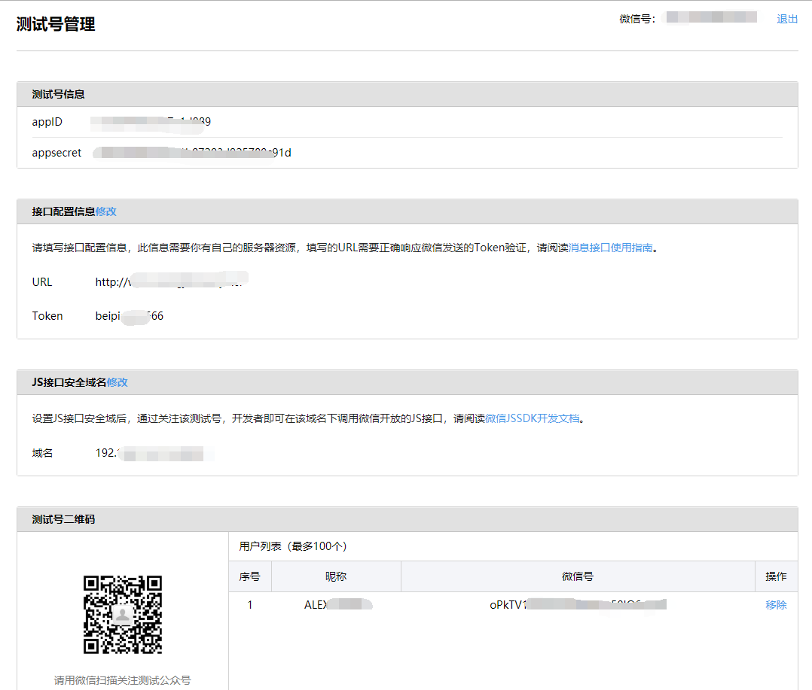

## Nodejs获取微信签名并使用JSSDK

[TOC]

上一篇我们讲了基本的准备工作，接下来，进入实战，由于楼主我并没有`备案过的域名`（穷，没钱，没办法哈），还好, 一直通不过`签名验证`，微信比较人性化，提供`测试号`，可以测大部分的接口，并且设置`JS接口安全域名`,没有限制，可以写任何地址，哪怕是`localhost:9999`也是可以的。

### 1、 接口测试号申请

由于用户体验和安全性方面的考虑，微信公众号的注册有一定门槛，某些高级接口的权限需要微信认证后才可以获取。

所以，为了帮助开发者快速了解和上手微信公众号开发，熟悉各个接口的调用，微信推出了微信公众帐号测试号，通过`手机微信扫描二维码即可获得测试号`，在这个测试号里面可以模拟各种操作，比如分享啥的，很容易通过验证。

[进入微信公众帐号测试号申请系统](https://mp.weixin.qq.com/debug/cgi-bin/sandbox?t=sandbox/login)

**体验接口权限表**

| 类目                                                         | 功能                                                         | 接口                                                         | 每日调用上限/次                                              | 操作                        |
| :----------------------------------------------------------- | :----------------------------------------------------------- | :----------------------------------------------------------- | :----------------------------------------------------------- | :-------------------------- |
| 对话服务                                                     | 基础支持                                                     | [获取access_token](http://mp.weixin.qq.com/wiki/11/0e4b294685f817b95cbed85ba5e82b8f.html) | 2000                                                         |                             |
| [获取微信服务器IP地址](http://mp.weixin.qq.com/wiki/0/2ad4b6bfd29f30f71d39616c2a0fcedc.html) | 无上限                                                       |                                                              |                                                              |                             |
| 接收消息                                                     | [验证消息真实性](http://mp.weixin.qq.com/wiki/4/2ccadaef44fe1e4b0322355c2312bfa8.html) | 无上限                                                       |                                                              |                             |
| [接收普通消息](http://mp.weixin.qq.com/wiki/10/79502792eef98d6e0c6e1739da387346.html) | 无上限                                                       |                                                              |                                                              |                             |
| [接收事件推送](http://mp.weixin.qq.com/wiki/2/5baf56ce4947d35003b86a9805634b1e.html) | 无上限                                                       |                                                              |                                                              |                             |
| [接收语音识别结果](http://mp.weixin.qq.com/wiki/2/f2bef3230362d18851ee22953abfadde.html) | 无上限                                                       | [关闭](javascript:void(0);)                                  |                                                              |                             |
| 发送消息                                                     | [自动回复](http://mp.weixin.qq.com/wiki/9/2c15b20a16019ae613d413e30cac8ea1.html) | 无上限                                                       |                                                              |                             |
| [客服接口](http://mp.weixin.qq.com/wiki/7/12a5a320ae96fecdf0e15cb06123de9f.html) | 500000                                                       |                                                              |                                                              |                             |
| [群发接口](http://mp.weixin.qq.com/wiki/15/5380a4e6f02f2ffdc7981a8ed7a40753.html) | 详情                                                         |                                                              |                                                              |                             |
| [模板消息（业务通知）](https://mp.weixin.qq.com/debug/cgi-bin/readtmpl?t=tmplmsg/faq_tmpl) | 100000                                                       |                                                              |                                                              |                             |
| 用户管理                                                     | [用户分组管理](http://mp.weixin.qq.com/wiki/index.php?title=分组管理接口) | 详情                                                         |                                                              |                             |
| [设置用户备注名](http://mp.weixin.qq.com/wiki/index.php?title=设置用户备注名接口) | 10000                                                        |                                                              |                                                              |                             |
| [获取用户基本信息](http://mp.weixin.qq.com/wiki/index.php?title=获取用户基本信息) | 500000                                                       |                                                              |                                                              |                             |
| [获取用户列表](http://mp.weixin.qq.com/wiki/index.php?title=获取关注者列表) | 500                                                          |                                                              |                                                              |                             |
| [获取用户地理位置](http://mp.weixin.qq.com/wiki/index.php?title=获取用户地理位置) | 无上限                                                       | [关闭](javascript:void(0);)                                  |                                                              |                             |
| 推广支持                                                     | [生成带参数二维码](http://mp.weixin.qq.com/wiki/index.php?title=生成带参数的二维码) | 100000                                                       |                                                              |                             |
| [长链接转短链接接口](http://mp.weixin.qq.com/wiki/10/165c9b15eddcfbd8699ac12b0bd89ae6.html) | 1000                                                         |                                                              |                                                              |                             |
| 界面丰富                                                     | [自定义菜单](http://mp.weixin.qq.com/wiki/index.php?title=自定义菜单创建接口) | 详情                                                         |                                                              |                             |
| 素材管理                                                     | [素材管理接口](http://mp.weixin.qq.com/wiki/5/963fc70b80dc75483a271298a76a8d59.html) | 详情                                                         |                                                              |                             |
| 功能服务                                                     | 智能接口                                                     | [语义理解接口](http://mp.weixin.qq.com/wiki/index.php?title=接收语音识别结果) | 1000                                                         |                             |
| 设备功能                                                     | [设备功能接口](http://mp.weixin.qq.com/wiki/5/131b418c04b1f4fc1752f7652b14b235.html) | 无上限                                                       | [设置 ](http://hw.weixin.qq.com/mpplugin/test/entrance?ticket=DeD1xU-wXzR5ydymLEBPxeHwzC_lumOq5LrdXFowfGY) [关闭](javascript:void(0);) |                             |
| 多客服                                                       | [获取客服聊天记录](http://mp.weixin.qq.com/wiki/19/7c129ec71ddfa60923ea9334557e8b23.html) | 5000                                                         |                                                              |                             |
| [客服管理](http://mp.weixin.qq.com/wiki/9/6fff6f191ef92c126b043ada035cc935.html) | 详情                                                         |                                                              |                                                              |                             |
| [会话控制](http://mp.weixin.qq.com/wiki/9/6fff6f191ef92c126b043ada035cc935.html) | 详情                                                         |                                                              |                                                              |                             |
| 网页服务                                                     | 网页帐号                                                     | [网页授权获取用户基本信息](http://mp.weixin.qq.com/wiki/17/c0f37d5704f0b64713d5d2c37b468d75.html) | 无上限                                                       | [修改](javascript:void(0);) |
| 基础接口                                                     | [判断当前客户端版本是否支持指定JS接口](http://mp.weixin.qq.com/wiki/7/aaa137b55fb2e0456bf8dd9148dd613f.html) | 无上限                                                       |                                                              |                             |
| 分享接口                                                     | [获取“分享到朋友圈”按钮点击状态及自定义分享内容接口](http://mp.weixin.qq.com/wiki/7/aaa137b55fb2e0456bf8dd9148dd613f.html) | 无上限                                                       |                                                              |                             |
| [获取“分享给朋友”按钮点击状态及自定义分享内容接口](http://mp.weixin.qq.com/wiki/7/aaa137b55fb2e0456bf8dd9148dd613f.html) | 无上限                                                       |                                                              |                                                              |                             |
| [获取“分享到QQ”按钮点击状态及自定义分享内容接口](http://mp.weixin.qq.com/wiki/7/aaa137b55fb2e0456bf8dd9148dd613f.html) | 无上限                                                       |                                                              |                                                              |                             |
| [获取“分享到腾讯微博”按钮点击状态及自定义分享内容接口](http://mp.weixin.qq.com/wiki/7/aaa137b55fb2e0456bf8dd9148dd613f.html) | 无上限                                                       |                                                              |                                                              |                             |
| 图像接口                                                     | [拍照或从手机相册中选图接口](http://mp.weixin.qq.com/wiki/7/aaa137b55fb2e0456bf8dd9148dd613f.html) | 无上限                                                       |                                                              |                             |
| [预览图片接口](http://mp.weixin.qq.com/wiki/7/aaa137b55fb2e0456bf8dd9148dd613f.html) | 无上限                                                       |                                                              |                                                              |                             |
| [上传图片接口](http://mp.weixin.qq.com/wiki/7/aaa137b55fb2e0456bf8dd9148dd613f.html) | 无上限                                                       |                                                              |                                                              |                             |
| [下载图片接口](http://mp.weixin.qq.com/wiki/7/aaa137b55fb2e0456bf8dd9148dd613f.html) | 无上限                                                       |                                                              |                                                              |                             |
| 音频接口                                                     | [开始录音接口](http://mp.weixin.qq.com/wiki/7/aaa137b55fb2e0456bf8dd9148dd613f.html) | 无上限                                                       |                                                              |                             |
| [停止录音接口](http://mp.weixin.qq.com/wiki/7/aaa137b55fb2e0456bf8dd9148dd613f.html) | 无上限                                                       |                                                              |                                                              |                             |
| [播放语音接口](http://mp.weixin.qq.com/wiki/7/aaa137b55fb2e0456bf8dd9148dd613f.html) | 无上限                                                       |                                                              |                                                              |                             |
| [暂停播放接口](http://mp.weixin.qq.com/wiki/7/aaa137b55fb2e0456bf8dd9148dd613f.html) | 无上限                                                       |                                                              |                                                              |                             |
| [停止播放接口](http://mp.weixin.qq.com/wiki/7/aaa137b55fb2e0456bf8dd9148dd613f.html) | 无上限                                                       |                                                              |                                                              |                             |
| [上传语音接口](http://mp.weixin.qq.com/wiki/7/aaa137b55fb2e0456bf8dd9148dd613f.html) | 无上限                                                       |                                                              |                                                              |                             |
| [下载语音接口](http://mp.weixin.qq.com/wiki/7/aaa137b55fb2e0456bf8dd9148dd613f.html) | 无上限                                                       |                                                              |                                                              |                             |
| 智能接口                                                     | [识别音频并返回识别结果接口](http://mp.weixin.qq.com/wiki/7/aaa137b55fb2e0456bf8dd9148dd613f.html) | 无上限                                                       |                                                              |                             |
| 设备信息                                                     | [获取网络状态接口](http://mp.weixin.qq.com/wiki/7/aaa137b55fb2e0456bf8dd9148dd613f.html) | 无上限                                                       |                                                              |                             |
| 地理位置                                                     | [使用微信内置地图查看位置接口](http://mp.weixin.qq.com/wiki/7/aaa137b55fb2e0456bf8dd9148dd613f.html) | 无上限                                                       |                                                              |                             |
| [获取地理位置接口](http://mp.weixin.qq.com/wiki/7/aaa137b55fb2e0456bf8dd9148dd613f.html) | 无上限                                                       |                                                              |                                                              |                             |
| 界面操作                                                     | [隐藏右上角菜单接口](http://mp.weixin.qq.com/wiki/7/aaa137b55fb2e0456bf8dd9148dd613f.html) | 无上限                                                       |                                                              |                             |
| [显示右上角菜单接口](http://mp.weixin.qq.com/wiki/7/aaa137b55fb2e0456bf8dd9148dd613f.html) | 无上限                                                       |                                                              |                                                              |                             |
| [关闭当前网页窗口接口](http://mp.weixin.qq.com/wiki/7/aaa137b55fb2e0456bf8dd9148dd613f.html) | 无上限                                                       |                                                              |                                                              |                             |
| [批量隐藏功能按钮接口](http://mp.weixin.qq.com/wiki/7/aaa137b55fb2e0456bf8dd9148dd613f.html) | 无上限                                                       |                                                              |                                                              |                             |
| [批量显示功能按钮接口](http://mp.weixin.qq.com/wiki/7/aaa137b55fb2e0456bf8dd9148dd613f.html) | 无上限                                                       |                                                              |                                                              |                             |
| [隐藏所有非基础按钮接口](http://mp.weixin.qq.com/wiki/7/aaa137b55fb2e0456bf8dd9148dd613f.html) | 无上限                                                       |                                                              |                                                              |                             |
| [显示所有功能按钮接口](http://mp.weixin.qq.com/wiki/7/aaa137b55fb2e0456bf8dd9148dd613f.html) | 无上限                                                       |                                                              |                                                              |                             |

